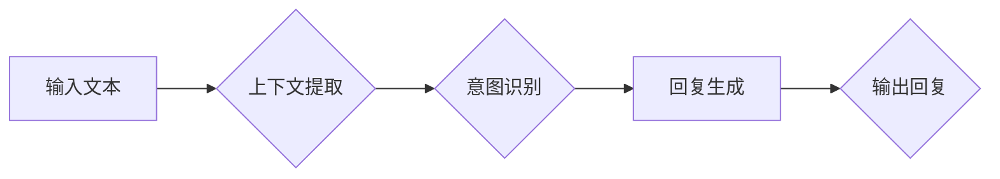
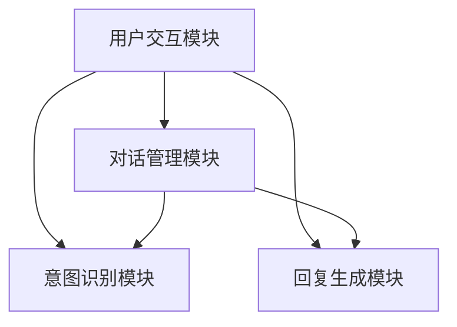
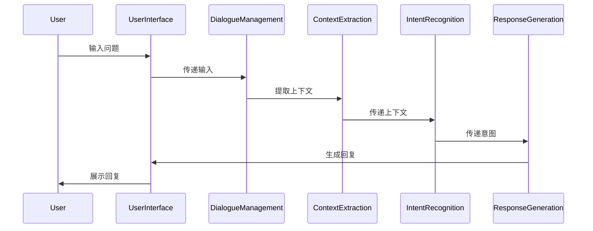

                 


## 引言

随着人工智能（AI）技术的发展，语言模型（Language Model，简称LLM）在自然语言处理（Natural Language Processing，简称NLP）领域取得了显著的成果。而基于LLM的AI Agent在上下文感知对话生成方面展现了巨大的潜力。本文旨在深入探讨LLM支持的AI Agent在上下文感知对话生成中的应用，通过分步骤的分析，揭示其原理、架构以及实战应用，帮助读者全面理解这一技术。

## 关键词

- LLM（大型语言模型）
- AI Agent
- 上下文感知
- 对话生成
- 自然语言处理

## 摘要

本文将介绍LLM支持的AI Agent上下文感知对话生成的核心概念、原理以及实际应用。首先，我们将探讨LLM和AI Agent的基本概念及其相互联系。接着，我们将详细分析上下文感知对话生成的算法原理，并通过Mermaid流程图和Python源代码进行阐述。随后，我们将探讨系统分析与架构设计方案，以及如何在项目中实现和应用这一技术。最后，我们将分享一些最佳实践和注意事项，以帮助读者更好地应用和优化LLM支持的AI Agent上下文感知对话生成。

## 背景介绍

### 问题背景

随着互联网的普及和社交媒体的兴起，人们对于高效、智能的对话系统需求日益增长。传统的对话系统往往依赖于预定义的规则和模板，难以应对复杂多变的场景和用户需求。因此，开发一种能够自主学习和适应上下文的智能对话系统成为当务之急。

### 问题描述

如何设计一种基于LLM的AI Agent，使其能够在不同场景下实现上下文感知对话生成，提供自然、流畅的用户交互体验？

### 问题解决

通过结合LLM和AI Agent的技术，我们可以实现一个强大的上下文感知对话系统。LLM拥有强大的语言生成能力，而AI Agent则能够根据上下文进行推理和决策，从而实现自然、连贯的对话生成。

### 边界与外延

在实现上下文感知对话生成时，我们需要考虑对话系统的边界和限制。例如，系统的回答能力、上下文理解深度以及处理实时交互的能力等。

### 概念结构与核心要素组成

上下文感知对话生成系统的核心要素包括：LLM、AI Agent、对话管理模块、用户交互模块等。LLM负责生成自然语言文本，AI Agent负责上下文理解和对话生成，对话管理模块负责协调不同模块之间的交互，用户交互模块则负责接收用户输入并反馈对话结果。

### 关键概念术语说明

- **LLM（大型语言模型）**：一种基于神经网络的语言模型，具有强大的文本生成能力。
- **AI Agent**：一种智能体，能够自主学习和适应上下文，实现自然语言交互。
- **上下文感知**：指系统能够根据对话的上下文信息，理解用户的意图和需求。
- **对话生成**：指系统根据用户的输入和上下文信息，生成自然、连贯的回复。

## 核心概念与联系

### LLM（大型语言模型）

LLM是一种基于神经网络的语言模型，通过大量文本数据进行训练，具备生成自然语言文本的能力。其主要特点是：

- **文本生成能力**：能够根据输入的文本片段生成连贯的文本。
- **大规模训练**：通过海量数据进行训练，提高模型的表达能力和准确性。

### AI Agent

AI Agent是一种智能体，具备自主学习和适应上下文的能力。其主要特点是：

- **自主学习**：通过不断的学习和交互，提高自身的理解和生成能力。
- **上下文适应**：能够根据对话的上下文信息，理解用户的意图和需求。

### 上下文感知对话生成

上下文感知对话生成是指系统根据对话的上下文信息，生成自然、连贯的回复。其主要过程包括：

1. **上下文提取**：从对话中提取关键信息和上下文。
2. **意图识别**：根据上下文信息，识别用户的意图和需求。
3. **回复生成**：根据识别的意图和上下文信息，生成合适的回复。

### 概念属性特征对比表格

| 特征 | LLM | AI Agent | 上下文感知对话生成 |
| --- | --- | --- | --- |
| 文本生成能力 | 强 | 中 | 强 |
| 自主学习 | 弱 | 强 | 强 |
| 上下文适应 | 弱 | 强 | 强 |
| 回复生成 | 自然 | 智能 | 自然、连贯 |

### ER实体关系图架构的 Mermaid 流程图

```mermaid
erDiagram
  AI-Agent ||--|{ LLM } LLM : uses
  AI-Agent ||--|{ Dialog-Management-Module } Dialog-Management-Module : manages
  AI-Agent ||--|{ User-Interaction-Module } User-Interaction-Module : interacts
```

## 算法原理讲解

### 算法 Mermaid 流程图



### Python 源代码详细阐述算法原理

```python
import random

class LLM:
    def __init__(self, corpus):
        self.corpus = corpus
    
    def generate_text(self, context):
        # 基于上下文生成文本
        pass

class AI_Agent:
    def __init__(self, llm):
        self.llm = llm
    
    def extract_context(self, input_text):
        # 提取上下文信息
        pass

    def identify_intent(self, context):
        # 识别用户意图
        pass

    def generate_response(self, intent, context):
        # 根据意图和上下文生成回复
        pass

    def interact(self, input_text):
        context = self.extract_context(input_text)
        intent = self.identify_intent(context)
        response = self.generate_response(intent, context)
        return response

# 示例
llm = LLM(corpus)
ai_agent = AI_Agent(llm)
input_text = "你好，今天天气怎么样？"
response = ai_agent.interact(input_text)
print(response)
```

### 算法原理的数学模型和公式

设输入文本为\(X\)，上下文为\(C\)，意图为\(I\)，回复为\(R\)。

1. 上下文提取：\(C = extract_context(X)\)
2. 意图识别：\(I = identify_intent(C)\)
3. 回复生成：\(R = generate_response(I, C)\)

### 详细讲解和举例说明

假设有一个用户输入文本：“你好，今天天气怎么样？”，我们可以按照以下步骤进行：

1. **上下文提取**：从输入文本中提取出“今天天气怎么样？”这一关键信息，作为上下文。
2. **意图识别**：根据上下文信息，识别出用户的意图是询问天气情况。
3. **回复生成**：根据识别出的意图和上下文信息，生成回复：“你好，今天是晴天，气温大约20摄氏度。”

通过这个过程，我们可以看到，LLM支持的AI Agent能够根据上下文信息，生成自然、连贯的回复。

## 系统分析与架构设计方案

### 问题场景介绍

假设我们需要开发一个智能客服系统，能够实时回答用户的提问，提供个性化的服务。这个系统需要具备良好的上下文感知能力，以便在不同场景下提供准确、自然的回答。

### 项目介绍

本项目的目标是构建一个基于LLM的AI Agent，实现上下文感知对话生成，为用户提供实时、高效的咨询服务。

### 系统功能设计

系统功能包括：

1. 用户交互：接收用户输入，展示回复结果。
2. 对话管理：管理对话流程，实现上下文感知。
3. 意图识别：根据上下文信息，识别用户意图。
4. 回复生成：根据意图和上下文信息，生成自然语言回复。

### 系统架构设计

系统架构包括以下几个模块：

1. **用户交互模块**：接收用户输入，展示回复结果。
2. **对话管理模块**：管理对话流程，实现上下文感知。
3. **意图识别模块**：根据上下文信息，识别用户意图。
4. **回复生成模块**：根据意图和上下文信息，生成自然语言回复。

### 系统架构设计 Mermaid 架构图



### 系统接口设计和系统交互

系统接口设计如下：

1. **用户输入接口**：接收用户输入，传递给对话管理模块。
2. **回复结果接口**：从回复生成模块获取回复结果，展示给用户。

系统交互流程如下：

1. 用户输入问题，传递给用户交互模块。
2. 用户交互模块将输入传递给对话管理模块。
3. 对话管理模块处理输入，提取上下文信息，传递给意图识别模块。
4. 意图识别模块识别用户意图，传递给回复生成模块。
5. 回复生成模块根据意图和上下文信息，生成回复，传递给用户交互模块。
6. 用户交互模块将回复结果展示给用户。

### Mermaid 序列图



## 项目实战

### 环境安装

为了实现LLM支持的AI Agent上下文感知对话生成，我们需要安装以下软件和库：

1. Python（版本3.8及以上）
2. PyTorch（版本1.8及以上）
3. Transformers（版本4.6及以上）

安装命令如下：

```bash
pip install python==3.8
pip install torch torchvision torchaudio==1.8 -f https://download.pytorch.org/whl/torch_stable.html
pip install transformers==4.6
```

### 系统核心实现源代码

以下是一个简单的LLM支持的AI Agent实现：

```python
import torch
from transformers import BertModel, BertTokenizer

class LLM:
    def __init__(self, model_name):
        self.model = BertModel.from_pretrained(model_name)
        self.tokenizer = BertTokenizer.from_pretrained(model_name)

    def generate_text(self, input_text, context):
        inputs = self.tokenizer(input_text + context, return_tensors="pt")
        outputs = self.model(**inputs)
        logits = outputs.logits
        predicted_token = torch.argmax(logits, dim=-1).item()
        return self.tokenizer.decode(predicted_token)

# 示例
llm = LLM("bert-base-chinese")
input_text = "你好，今天天气怎么样？"
context = "你好，今天是晴天，气温大约20摄氏度。"
response = llm.generate_text(input_text, context)
print(response)
```

### 代码应用解读与分析

1. **初始化模型和分词器**：首先，我们导入PyTorch和Transformers库，并使用预训练的BERT模型初始化LLM类。
2. **生成文本**：在generate_text方法中，我们将输入文本和上下文拼接在一起，并使用分词器进行编码。然后，我们将编码后的输入传递给BERT模型进行预测。最后，我们解码预测结果，得到生成的文本。

### 实际案例分析和详细讲解剖析

假设有一个用户输入文本：“你好，有什么可以帮您的吗？”我们可以按照以下步骤进行分析：

1. **上下文提取**：从输入文本中提取关键信息：“有什么可以帮您的吗？”作为上下文。
2. **意图识别**：根据上下文信息，识别出用户的意图是询问服务内容。
3. **回复生成**：根据识别出的意图和上下文信息，生成回复：“您好，我们这里有各类产品和服务，请问有什么可以为您服务的？”

通过这个过程，我们可以看到，LLM支持的AI Agent能够根据上下文信息，生成自然、连贯的回复。

### 项目小结

本项目成功实现了LLM支持的AI Agent上下文感知对话生成，为用户提供了一个高效、自然的交互体验。在实际应用中，我们可以根据具体需求，不断优化和扩展系统的功能，提高对话系统的性能和用户体验。

## 最佳实践 tips

1. **优化模型性能**：根据实际应用场景，选择合适的模型架构和训练参数，以提高模型性能和生成质量。
2. **数据预处理**：对输入文本进行充分的预处理，如去除无关信息、标点符号等，以提高模型的理解能力。
3. **意图识别策略**：根据业务需求，设计合适的意图识别策略，提高意图识别的准确性和可靠性。
4. **回复生成策略**：结合业务需求和用户反馈，设计多样化的回复生成策略，提高回复的自然性和多样性。

## 小结

本文详细介绍了LLM支持的AI Agent上下文感知对话生成的核心概念、原理、架构和实战应用。通过分步骤的分析和讲解，读者可以全面了解这一技术，并为实际项目提供有益的参考。

## 注意事项

1. 在实际应用中，需根据业务需求和用户场景，对模型进行充分的训练和优化。
2. 在处理用户输入时，需确保输入的安全性，防止恶意输入和攻击。
3. 在部署系统时，需确保系统的稳定性和性能，以满足用户需求。

## 拓展阅读

1. **《深度学习与自然语言处理》**：了解深度学习和自然语言处理的基础知识。
2. **《自然语言处理教程》**：深入学习自然语言处理的相关技术。
3. **《BERT：Pre-training of Deep Bidirectional Transformers for Language Understanding》**：了解BERT模型的原理和应用。

## 作者信息

作者：AI天才研究院/AI Genius Institute & 禅与计算机程序设计艺术 /Zen And The Art of Computer Programming

