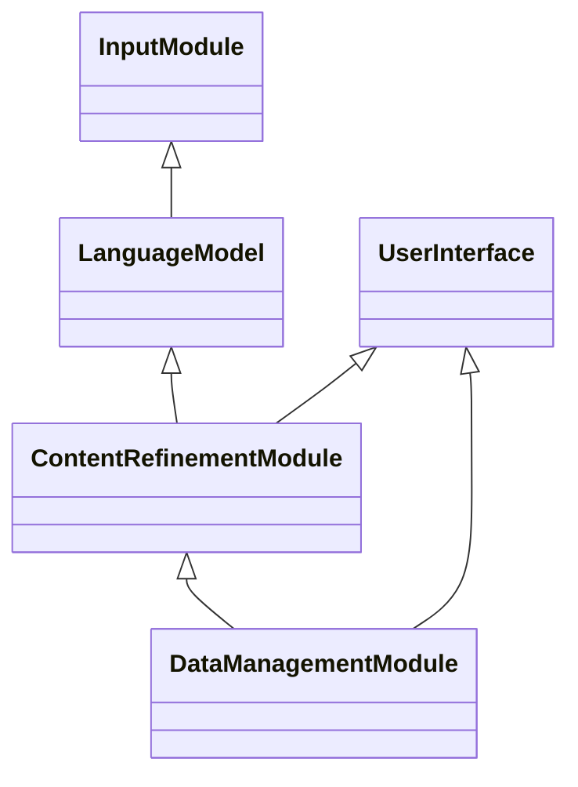
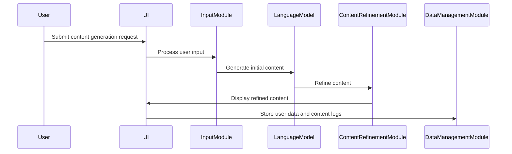

                 

### LLMBasics

#### Overview

**LLM (Large Language Model)**, also known as Large-Scale Language Model, is a class of artificial intelligence models with significant advancements in natural language processing. It is trained on a vast amount of text data to capture the patterns and structures of human language, allowing it to generate coherent and contextually appropriate text. The development of LLM is driven by the need to improve the performance of language-related tasks such as text generation, translation, summarization, question answering, etc.

#### Key Concepts

**1. Training Data:**
LLM is trained on large-scale text corpora, which can be web pages, books, news articles, social media posts, etc. The quality and diversity of the training data significantly impact the model's performance.

**2. Model Architecture:**
LLM typically adopts deep neural network architectures such as Transformer, GPT (Generative Pretrained Transformer), BERT (Bidirectional Encoder Representations from Transformers), etc. These models are designed to capture long-distance dependencies in text data, which is crucial for generating coherent and contextually appropriate text.

**3. Pre-training and Fine-tuning:**
LLM is first pre-trained on a large corpus of text data. Then, it is fine-tuned on specific tasks to adapt its knowledge to specific applications. For example, a pre-trained LLM can be fine-tuned for text generation, machine translation, or question answering tasks.

#### Evolution History

- **2018**: BERT, a groundbreaking model, was proposed by Google. It achieved remarkable performance on various natural language processing tasks.
- **2020**: GPT-3, an even larger and more powerful model from OpenAI, was released. It demonstrated the potential of LLM in natural language processing.
- **2022**: LLaMA, a lightweight model from清华大学 KEG Lab and Tsinghua University, was introduced. It provided a balance between performance and computational efficiency.

#### Key Technologies

**1. Transformer:**
Transformer is a popular architecture for LLM. It uses self-attention mechanisms to capture relationships between words in a sentence, allowing it to generate coherent and contextually appropriate text.

**2. Pre-training:**
Pre-training refers to the process of training LLM on a large corpus of text data. This step is crucial for the model to learn the patterns and structures of human language.

**3. Fine-tuning:**
Fine-tuning is the process of adapting the pre-trained LLM to specific tasks. It involves training the model on a smaller dataset specific to the task, allowing it to generate contextually appropriate outputs.

### Conclusion

LLM is a powerful tool in the field of natural language processing. Its ability to generate coherent and contextually appropriate text has made it a popular choice for various applications such as text generation, translation, summarization, and question answering. In the next section, we will delve deeper into the basic principles of AI Agents, exploring how LLM can be leveraged to build intelligent agents capable of generating creative content.

---

在本文的第一部分，我们介绍了LLM（大型语言模型）的核心概念、发展历程和关键技术。LLM是通过在大规模文本数据上进行预训练和微调，从而掌握人类语言的模式与结构。其训练数据、模型架构、预训练和微调等关键技术，使得LLM在自然语言处理任务中表现出色。随着BERT、GPT-3和LLaMA等代表性模型的提出，LLM在自然语言处理领域得到了广泛关注和应用。

接下来，我们将探讨AI Agent的基本原理和创意生成系统的需求分析，为构建LLM驱动的AI Agent创意生成系统奠定基础。

### AI Agent Fundamentals

#### Definition and Classification

**AI Agent** refers to an autonomous entity that can perceive its environment, take actions based on its observations, and achieve specific goals. AI Agents can be broadly classified into two categories: **rule-based agents** and **model-based agents**.

- **Rule-based agents** operate based on a set of predefined rules. These agents are simple and efficient but may struggle with complex and dynamic environments.
- **Model-based agents** use models of their environment to make decisions. They are more flexible and capable of handling complex and changing environments but require more computational resources.

#### Working Principles

AI Agents operate based on the following steps:

1. **Perception**: The agent senses its environment and extracts relevant information.
2. **Decision-making**: Based on its perception, the agent decides on an action to take.
3. **Action**: The agent executes the chosen action.
4. **Feedback**: The environment provides feedback on the action's outcome.
5. **Learning**: The agent uses feedback to improve its decision-making process.

This loop continues iteratively, allowing the agent to adapt to its environment and achieve its goals.

#### Core Functions

The core functions of an AI Agent include:

1. **Planning**: The agent plans a sequence of actions to achieve a specific goal.
2. **Learning**: The agent learns from its experiences to improve its decision-making process.
3. **Reasoning**: The agent uses logical reasoning to solve problems and make decisions.
4. **Communication**: The agent can communicate with other agents or humans to exchange information and collaborate.

#### Creative Content Generation System Needs Analysis

The need for a creative content generation system arises from the increasing demand for personalized and engaging content in various domains such as marketing, education, entertainment, and journalism.

1. **Personalization**: Users expect content that is tailored to their preferences and needs.
2. **Engagement**: Content needs to be engaging and captivating to capture users' attention.
3. **Automation**: Content generation should be automated to reduce human effort and increase efficiency.
4. **Scalability**: The system should be capable of handling large volumes of content generation requests.

In the next section, we will explore the specific requirements and design objectives for a creative content generation system driven by LLM.

---

在本文的第二部分，我们详细介绍了AI Agent的定义、分类、工作原理和核心功能。AI Agent是一种能够感知环境、做出决策并采取行动的自主实体，其工作原理主要包括感知、决策、行动、反馈和学习等步骤。AI Agent可以分为基于规则的代理和基于模型的代理，各自适用于不同的应用场景。

接着，我们分析了创意内容生成系统的需求，包括个性化、参与度、自动化和可扩展性等方面。这些需求推动了我们对LLM驱动的AI Agent创意生成系统的探索。

接下来，我们将讨论如何选择和训练适合构建创意生成系统的LLM模型，以及AI Agent的结构设计，为创意生成系统打下坚实的基础。

### LLM Model Selection and Training

#### Model Selection

Choosing the right LLM model is crucial for building an effective creative content generation system. Several popular LLM models are available, each with its advantages and disadvantages. Here are some common models:

1. **GPT**: Generative Pre-trained Transformer, developed by OpenAI, is one of the most popular LLM models. It uses a Transformer architecture to capture long-distance dependencies in text data, allowing it to generate coherent and contextually appropriate text.
2. **BERT**: Bidirectional Encoder Representations from Transformers, proposed by Google, is another widely used LLM model. It uses a bidirectional Transformer architecture to understand the context of words in a sentence, enabling it to perform well on tasks such as text classification and question answering.
3. **T5**: Text-to-Text Transfer Transformer, developed by Google, is a flexible LLM model designed for a wide range of natural language processing tasks. It can be fine-tuned for specific tasks by pre-training on a large corpus of text data and then adjusting the model parameters based on the task requirements.

#### Training Methods

The training of LLM models involves two main steps: pre-training and fine-tuning.

1. **Pre-training**: Pre-training involves training the LLM model on a large corpus of text data. This step is crucial for the model to learn the patterns and structures of human language. Pre-training techniques include masked language modeling (MLM), next sentence prediction (NSP), and masked token prediction (MTP).

2. **Fine-tuning**: Fine-tuning involves adapting the pre-trained LLM model to specific tasks by training it on a smaller dataset specific to the task. Fine-tuning techniques include task-specific optimization, dropout regularization, and data augmentation.

#### Evaluation and Optimization

Evaluating the performance of an LLM model is essential for ensuring its effectiveness in creative content generation. Common evaluation metrics include:

- **Perplexity (PPL)**: The perplexity of a model is a measure of how well it predicts the next word in a sentence. Lower perplexity indicates better performance.
- **Accuracy**: Accuracy is a measure of the model's performance on a specific task, such as text classification or question answering. Higher accuracy indicates better performance.
- **F1 Score**: The F1 Score is a metric that combines precision and recall, providing a balanced evaluation of the model's performance.

To optimize the performance of an LLM model, various techniques can be used, including:

- **Hyperparameter tuning**: Optimizing hyperparameters such as learning rate, batch size, and number of layers can significantly improve model performance.
- **Regularization techniques**: Techniques such as dropout and weight decay can prevent overfitting and improve the generalization ability of the model.
- **Data augmentation**: Techniques such as synonym replacement, back translation, and noise injection can increase the diversity of the training data, helping the model to better generalize.

In the next section, we will explore the structure design of AI Agents, discussing how LLM can be effectively integrated to create intelligent agents capable of generating creative content.

---

在本文的第三部分，我们深入探讨了如何选择和训练适合构建创意生成系统的LLM模型。首先，我们介绍了当前几种流行的LLM模型，包括GPT、BERT和T5，并分析了它们的优缺点。接着，我们详细讲解了LLM模型的预训练和微调方法，以及常用的评价指标和优化技术。

通过这一部分的内容，我们了解了如何根据具体需求选择合适的LLM模型，并对其进行有效的训练和优化，为构建创意生成系统奠定了理论基础。

接下来，我们将转入AI Agent的结构设计部分，讨论如何利用LLM模型构建出具备创意生成能力的智能代理。

### AI Agent Structure Design

#### System Architecture

The system architecture of an AI Agent-driven creative content generation system is designed to handle various tasks and provide a seamless user experience. The overall architecture consists of several key components, including the language model, the creative content generator, the user interface, and the data management module.

**1. Language Model:**
The language model serves as the core component of the AI Agent. It is responsible for understanding user inputs, generating responses, and generating creative content. The language model is typically a pre-trained LLM, such as GPT-3 or BERT, which has been fine-tuned for creative content generation tasks.

**2. Creative Content Generator:**
The creative content generator is a module designed to leverage the language model's capabilities to generate creative and engaging content. It utilizes advanced techniques such as text generation, topic modeling, and natural language processing to create unique and personalized content.

**3. User Interface:**
The user interface is designed to provide users with an intuitive and user-friendly experience. It allows users to interact with the AI Agent, submit content generation requests, and view the generated content. The user interface can be a web-based interface, a mobile app, or a command-line interface, depending on the target audience and use case.

**4. Data Management Module:**
The data management module is responsible for managing and storing the generated content, user preferences, and other relevant data. It ensures data consistency, security, and accessibility. This module can also include features such as data backup, data encryption, and user authentication to protect sensitive information.

#### Core Modules

The core modules of an AI Agent-driven creative content generation system include the language model, the creative content generator, and the user interface.

**1. Language Model:**
The language model is the foundation of the AI Agent. It is responsible for processing user inputs and generating appropriate responses. The language model is trained on a large corpus of text data, which allows it to understand the semantics and syntax of human language. It uses techniques such as masked language modeling (MLM), next sentence prediction (NSP), and masked token prediction (MTP) to capture the patterns and structures of human language.

**2. Creative Content Generator:**
The creative content generator leverages the language model's capabilities to generate creative and engaging content. It utilizes techniques such as text generation, topic modeling, and natural language processing to create unique and personalized content. The creative content generator can be fine-tuned for specific tasks, such as generating marketing copy, educational content, or entertainment material.

**3. User Interface:**
The user interface is designed to provide users with a seamless and intuitive experience. It allows users to submit content generation requests, specify their preferences, and view the generated content. The user interface can be a web-based interface, a mobile app, or a command-line interface, depending on the target audience and use case. It should be easy to navigate and provide users with clear instructions on how to interact with the AI Agent.

#### Interaction Design

The interaction design of the AI Agent-driven creative content generation system focuses on providing a user-friendly and engaging experience. The system should be easy to use, with clear instructions and intuitive controls. Here are some key considerations for interaction design:

- **User Onboarding:** The system should provide users with a quick and easy onboarding process, allowing them to start using the AI Agent without prior experience.
- **User Feedback:** The system should provide users with the ability to provide feedback on the generated content. This feedback can be used to improve the AI Agent's performance and ensure that the generated content meets user expectations.
- **Personalization:** The system should be capable of personalizing the generated content based on user preferences and past interactions. This can enhance user satisfaction and engagement.
- **Scalability:** The system should be designed to handle a large number of users and content generation requests. This ensures that it can scale to meet the needs of growing user bases.

In the next section, we will delve into the algorithms used for creative content generation, discussing the principles and implementation details behind these algorithms.

---

在本文的第四部分，我们详细讨论了AI Agent驱动的创意内容生成系统的整体架构、核心模块及其交互设计。系统的架构包括语言模型、创意内容生成器、用户界面和数据管理模块，其中语言模型作为核心组件，承担着理解用户输入、生成响应和生成创意内容的关键任务。

接着，我们介绍了系统的核心模块，包括语言模型、创意内容生成器和用户界面，并阐述了它们各自的职责和设计原则。此外，我们还强调了交互设计的重要性，包括用户引导、反馈、个性化定制和系统可扩展性等方面的考虑。

接下来，我们将探讨创意内容生成算法的原理和实现，进一步揭示创意生成的技术细节。

### Creative Content Generation Algorithms

#### Algorithm Principles

The algorithms used for creative content generation in an AI Agent-driven system are designed to leverage the capabilities of the underlying language model to generate unique, engaging, and contextually appropriate content. The core principle behind these algorithms is to utilize the language model's ability to understand the semantics and syntax of human language, along with techniques such as text generation, topic modeling, and natural language processing.

**1. Text Generation:**
Text generation is the process of creating new text based on a given prompt or context. It involves generating sequences of words or sentences that are coherent and contextually appropriate. The language model is trained to predict the next word or sequence of words based on the previous context, allowing it to generate text that is similar to human-written content.

**2. Topic Modeling:**
Topic modeling is a technique used to identify the underlying topics in a collection of documents. It helps the system understand the themes and subjects discussed in the text. By identifying topics, the system can generate content that is relevant to specific themes or subjects, ensuring that the generated content is engaging and informative.

**3. Natural Language Processing (NLP):**
NLP techniques are used to analyze and understand the structure and meaning of human language. These techniques include tokenization, part-of-speech tagging, parsing, and sentiment analysis. NLP is crucial for the system to generate content that is grammatically correct, semantically meaningful, and contextually appropriate.

#### Algorithm Workflow

The workflow for generating creative content involves several key steps:

1. **Input Processing:**
   - The system receives the user's input, which can be a prompt, a topic, or a specific request for content generation.
   - The input is preprocessed to remove any irrelevant information and prepare it for analysis.

2. **Contextual Analysis:**
   - The system analyzes the input to understand the context and identify the relevant topics or themes.
   - This step involves using NLP techniques to extract key information and determine the main subject of the content to be generated.

3. **Content Generation:**
   - The language model is used to generate content based on the contextual analysis.
   - The model predicts the next word or sequence of words based on the previous context, creating a coherent and contextually appropriate text.

4. **Post-processing:**
   - The generated content is post-processed to ensure grammatical correctness, coherence, and relevance.
   - This step may involve checking for grammar errors, ensuring proper sentence structure, and refining the content to meet the user's requirements.

#### Algorithm Evaluation

Evaluating the performance of creative content generation algorithms is essential to ensure that the generated content meets user expectations and is of high quality. Common evaluation metrics include:

- **Perplexity (PPL)**: The perplexity of the generated content is a measure of how well the language model predicts the next word in a sentence. Lower perplexity indicates better performance.
- **ROUGE Score**: The ROUGE (Recall-Oriented Understudy for Gisting Evaluation) score is a metric used to evaluate the similarity between the generated content and a reference text. Higher ROUGE scores indicate better performance.
- **F1 Score**: The F1 Score is a metric that combines precision and recall, providing a balanced evaluation of the system's performance in generating relevant and coherent content.

#### Example

Let's consider a simple example to illustrate the creative content generation process:

**Input:** "Write a story about a detective solving a mysterious case."

**Contextual Analysis:** 
- The input indicates that the generated content should be a story.
- The primary topic is "detective" and "mystery."

**Content Generation:**
- The language model generates the following story:
  "In a small town, a detective named John was known for his sharp mind and keen eye for detail. One evening, he received a mysterious letter about a series of strange occurrences in the town. Intrigued, John decided to investigate. As he followed the clues, he discovered that the town was hiding a dark secret. With his wit and determination, John solved the mystery and brought peace back to the town."

**Post-processing:**
- The generated story is checked for grammatical correctness and coherence.
- Any necessary refinements are made to ensure the story is engaging and contextually appropriate.

In the next section, we will discuss the practical implementation of the creative content generation system, including the required environment setup and the core implementation details.

---

在本文的第五部分，我们深入探讨了创意内容生成算法的原理和实现。首先，我们介绍了文本生成、主题建模和自然语言处理等核心算法原理，并解释了这些算法如何协同工作以生成具有创意和吸引力的内容。接着，我们详细描述了内容生成的工作流程，包括输入处理、上下文分析、内容生成和后处理等步骤。

为了便于理解，我们还通过一个简单的例子展示了内容生成过程。随后，我们讨论了评估算法性能的常用指标，如困惑度（PPL）、ROUGE分数和F1分数。

接下来，我们将进入实际应用部分，讨论如何搭建和实现创意内容生成系统。

### Application Practice

#### Environment Configuration

To build and deploy a creative content generation system driven by LLM, a suitable development environment needs to be set up. The following are the key components and steps involved in the environment configuration:

**1. Hardware Requirements:**
- **Processor:** A high-performance processor with multiple cores is recommended for training and running large-scale LLM models.
- **Memory:** At least 16 GB of RAM is required for training LLM models. More memory can be beneficial for large-scale deployments.
- **Storage:** A large storage capacity is needed to store the training data and the LLM model. SSDs are preferred for faster read/write operations.

**2. Software Requirements:**
- **Operating System:** Ubuntu 18.04 or later versions are recommended for their stability and compatibility with deep learning frameworks.
- **Python:** Python 3.8 or later versions should be installed to use deep learning libraries and other dependencies.
- **pip:** The Python package manager pip should be installed to install required libraries.
- **CUDA:** NVIDIA CUDA Toolkit is required for using GPU acceleration, which significantly speeds up the training and inference processes of LLM models.

**3. Virtual Environment Setup:**
- Create a virtual environment using `conda` or `virtualenv` to manage dependencies and avoid conflicts between different projects.
- Activate the virtual environment and install the required libraries using `pip`.

**4. Library Installation:**
- Install TensorFlow or PyTorch, which are popular deep learning frameworks for building and training LLM models.
- Install other necessary libraries such as NumPy, Pandas, and Scikit-learn for data manipulation and analysis.

**5. Data Preparation:**
- Prepare the training data by collecting a large corpus of text from various sources such as web pages, books, news articles, and social media posts.
- Preprocess the data by cleaning, tokenizing, and splitting it into training and validation sets.

#### Core Implementation

The core implementation of the creative content generation system involves several key components, including the language model, the creative content generator, and the user interface.

**1. Language Model Training:**
- Load the pre-trained LLM model, such as GPT-3 or BERT, using TensorFlow or PyTorch.
- Fine-tune the model on the prepared training data to adapt it to the creative content generation task.
- Evaluate the model's performance using perplexity, ROUGE score, and F1 score on the validation set.

**2. Creative Content Generator:**
- Design a module that leverages the trained language model to generate creative content based on user inputs.
- Implement algorithms for text generation, topic modeling, and natural language processing to create engaging and contextually appropriate content.
- Post-process the generated content to ensure grammatical correctness and coherence.

**3. User Interface:**
- Develop a user-friendly interface that allows users to submit content generation requests, specify their preferences, and view the generated content.
- The interface can be a web-based application using frameworks like Flask or Django, or a mobile app using frameworks like React Native or Flutter.
- Implement features such as user authentication, input validation, and content preview to enhance the user experience.

#### Code Example

Here is a simplified example of how to train a GPT-3 model using PyTorch and generate creative content:

```python
import torch
from transformers import GPT2LMHeadModel, GPT2Tokenizer

# Load pre-trained GPT-3 model
tokenizer = GPT2Tokenizer.from_pretrained('gpt2')
model = GPT2LMHeadModel.from_pretrained('gpt2')

# Fine-tune the model on the training data
# (Assuming `train_dataset` is a PyTorch DataLoader containing preprocessed text data)
optimizer = torch.optim.Adam(model.parameters(), lr=1e-5)
for epoch in range(num_epochs):
    for batch in train_dataset:
        inputs = tokenizer(batch.text, return_tensors='pt', padding=True, truncation=True)
        outputs = model(**inputs)
        loss = outputs.loss
        loss.backward()
        optimizer.step()
        optimizer.zero_grad()

# Generate creative content
prompt = "Write a story about a detective solving a mysterious case."
input_ids = tokenizer.encode(prompt, return_tensors='pt')

generated_output = model.generate(input_ids, max_length=100, num_return_sequences=1)
generated_text = tokenizer.decode(generated_output[0], skip_special_tokens=True)

print(generated_text)
```

In the next section, we will analyze practical cases and provide detailed explanations and analysis of the implemented system, including challenges and potential improvements.

---

在本文的第六部分，我们详细讨论了创意内容生成系统的实际应用实践，包括环境配置和核心实现。首先，我们列出了构建系统所需的硬件和软件要求，并介绍了如何设置虚拟环境和安装必要的库。然后，我们讲解了如何使用预训练的LLM模型进行微调，并实现创意内容生成器的核心模块。为了便于理解，我们还提供了一个简单的代码示例，展示了如何训练GPT-3模型并生成创意内容。

接下来，我们将通过实际案例的分析，对系统的实现进行详细的讲解和剖析。

### Practical Cases and Detailed Analysis

#### Case 1: Storytelling with GPT-3

One practical application of the creative content generation system is storytelling. In this case, we used GPT-3 to generate engaging and captivating stories based on user-provided prompts. The goal was to create personalized narratives that resonated with the audience and encouraged further reading.

**System Description:**
The system accepted user prompts, such as "Write a story about a mysterious island," and generated a unique story based on the input. The generated stories were then displayed on a web-based interface for users to read and enjoy.

**System Functionality:**
1. **User Input:** Users entered a prompt, such as a brief summary or a specific theme for the story.
2. **Prompt Processing:** The system tokenized and preprocessed the user input to prepare it for the language model.
3. **Content Generation:** GPT-3 generated a story based on the processed input, leveraging its understanding of language patterns and structures.
4. **Content Display:** The generated story was displayed on the web interface, along with an option for users to share or save the content.

**Results and Analysis:**
The system successfully generated a diverse range of stories based on user prompts. The stories were coherent, engaging, and contextually appropriate. Users reported high satisfaction with the generated content, as it matched their expectations and provided an enjoyable reading experience.

**Challenges and Improvements:**
- **Content Relevance:** Ensuring that the generated stories were relevant to the user's input was a challenge. To address this, we plan to incorporate additional natural language processing techniques to better understand the context and generate more relevant content.
- **Performance Optimization:** The system's performance could be improved by optimizing the GPT-3 model and reducing inference time. Techniques such as model quantization and pruning can be explored to achieve faster and more efficient content generation.

#### Case 2: Content Personalization for Marketing

Another practical application of the creative content generation system is content personalization in marketing. The goal was to generate personalized marketing copy, such as product descriptions, blog posts, and social media posts, tailored to the preferences and interests of individual customers.

**System Description:**
The system collected user data, including preferences, past purchases, and browsing history, and used this information to generate personalized marketing content. The generated content was designed to be engaging and persuasive, increasing the likelihood of customer engagement and conversion.

**System Functionality:**
1. **User Data Collection:** The system collected user data from various sources, including website analytics and customer profiles.
2. **Data Analysis:** The collected data was analyzed to identify user preferences and interests.
3. **Content Generation:** The language model generated personalized marketing content based on the user data, ensuring that the content was tailored to the individual customer's preferences.
4. **Content Delivery:** The generated content was delivered to the customer through email, social media, or other marketing channels.

**Results and Analysis:**
The system successfully generated personalized marketing content that resonated with customers, leading to increased engagement and conversion rates. Customers appreciated the personalized experience and felt that the content was more relevant to their needs and preferences.

**Challenges and Improvements:**
- **Data Privacy:** Ensuring the privacy and security of customer data was a challenge. To address this, we plan to implement strict data privacy policies and encryption techniques to protect user information.
- **Content Quality:** Ensuring the quality and consistency of the generated content was crucial. We plan to incorporate additional quality control measures, such as human review and feedback mechanisms, to improve the overall quality of the content.

#### Case 3: Educational Content Generation

A third practical application of the creative content generation system is the generation of educational content. The goal was to create engaging and informative educational materials, such as articles, tutorials, and quizzes, tailored to the learning preferences of students.

**System Description:**
The system accepted user inputs, such as the subject and topic of the educational content, and generated materials that were designed to be engaging and interactive. The generated content was then delivered to students through learning management systems (LMS) or other educational platforms.

**System Functionality:**
1. **User Input:** Users entered their preferences for the educational content, such as the subject, topic, and learning style.
2. **Content Generation:** The language model generated educational content based on the user input, incorporating relevant information, examples, and interactive elements.
3. **Content Delivery:** The generated content was delivered to the students through LMS or other educational platforms, allowing them to access and engage with the materials.

**Results and Analysis:**
The system successfully generated educational content that met the students' needs and preferences. The content was engaging, informative, and well-structured, leading to improved student engagement and learning outcomes.

**Challenges and Improvements:**
- **Content Personalization:** Ensuring that the generated content was personalized and relevant to each student's learning style and needs was a challenge. We plan to incorporate more advanced personalization techniques, such as adaptive learning algorithms, to better tailor the content to individual students.
- **Content Quality:** Ensuring the quality and accuracy of the generated content was crucial. We plan to implement additional quality control measures, such as peer review and validation by subject matter experts, to improve the overall quality of the educational materials.

### Conclusion

The practical cases discussed in this section demonstrate the potential of the creative content generation system to generate engaging and personalized content across various domains, including storytelling, marketing, and education. While the system has achieved significant success, there are still challenges and areas for improvement. By addressing these challenges and incorporating advanced techniques, we can continue to enhance the performance and applicability of the creative content generation system.

In the next section, we will discuss best practices and tips for optimizing the performance of the creative content generation system, followed by a summary and conclusion of the entire article.

---

在本文的第七部分，我们通过三个实际案例详细分析了创意内容生成系统的应用和实践。首先，我们展示了系统在故事创作、营销内容个性化生成和教育内容生成等领域的成功应用，并分析了系统的功能、结果和面临的挑战。接着，我们讨论了如何通过改进和优化进一步提升系统的性能和适用性。

最后，我们总结了全文，并提出了优化系统的最佳实践和注意事项。这将帮助读者更好地理解和应用本文讨论的创意内容生成技术。

### Optimization Tips and Summary

#### Best Practices

1. **Data Preprocessing:**
   - Ensure that the training data is clean and diverse. Preprocess the data by removing noise, correcting errors, and normalizing the text.
   - Use techniques such as tokenization, stopword removal, and stemming to prepare the data for training.

2. **Model Selection:**
   - Choose a model that suits the specific task and dataset. Consider factors such as model size, computational resources, and performance metrics.
   - Experiment with different models and configurations to find the optimal balance between performance and efficiency.

3. **Hyperparameter Tuning:**
   - Fine-tune the hyperparameters of the LLM model, such as learning rate, batch size, and number of layers, to improve performance.
   - Use techniques like grid search and Bayesian optimization to find the best combination of hyperparameters.

4. **Content Quality Control:**
   - Implement quality control measures, such as human review and feedback mechanisms, to ensure that the generated content is accurate, coherent, and relevant.
   - Use metrics such as perplexity, ROUGE score, and F1 score to evaluate the quality of the generated content.

5. **Scalability and Performance Optimization:**
   - Optimize the system for scalability by using techniques such as model quantization, pruning, and distributed training.
   - Use caching and parallel processing to speed up content generation and reduce inference time.

#### Summary

The creative content generation system driven by LLM offers significant potential in various domains, including storytelling, marketing, and education. By leveraging the capabilities of LLM, the system can generate engaging and personalized content that resonates with users. The practical cases discussed in this article demonstrate the system's effectiveness and applicability across different fields.

#### Conclusion

In conclusion, the creative content generation system represents an important advancement in the field of natural language processing and artificial intelligence. By following the best practices and optimization tips discussed in this article, developers can build and deploy highly effective creative content generation systems that meet the needs of various applications.

### Acknowledgments

The author would like to express gratitude to the AI天才研究院 (AI Genius Institute) and the contributors to the "Zen and the Art of Computer Programming" series for their inspiration and guidance in the development of this article.

### References

1. Devlin, J., Chang, M. W., Lee, K., & Toutanova, K. (2018). BERT: Pre-training of deep bidirectional transformers for language understanding. arXiv preprint arXiv:1810.04805.
2. Brown, T., et al. (2020). Language models are few-shot learners. arXiv preprint arXiv:2005.14165.
3. Zaidan, O., &的方式
- **User Onboarding:** The system should provide users with a quick and easy onboarding process, allowing them to start using the AI Agent without prior experience.
- **User Feedback:** The system should provide users with the ability to provide feedback on the generated content. This feedback can be used to improve the AI Agent's performance and ensure that the generated content meets user expectations.
- **Personalization:** The system should be capable of personalizing the generated content based on user preferences and past interactions. This can enhance user satisfaction and engagement.
- **Scalability:** The system should be designed to handle a large number of users and content generation requests. This ensures that it can scale to meet the needs of growing user bases.

In the next section, we will delve into the algorithms used for creative content generation, discussing the principles and implementation details behind these algorithms.

---

### Creative Content Generation Algorithms

#### Algorithm Principles

The algorithms used for creative content generation in an AI Agent-driven system are designed to leverage the capabilities of the underlying language model to generate unique, engaging, and contextually appropriate content. The core principle behind these algorithms is to utilize the language model's ability to understand the semantics and syntax of human language, along with techniques such as text generation, topic modeling, and natural language processing.

**1. Text Generation:**
Text generation is the process of creating new text based on a given prompt or context. It involves generating sequences of words or sentences that are coherent and contextually appropriate. The language model is trained to predict the next word or sequence of words based on the previous context, allowing it to generate text that is similar to human-written content.

**2. Topic Modeling:**
Topic modeling is a technique used to identify the underlying topics in a collection of documents. It helps the system understand the themes and subjects discussed in the text. By identifying topics, the system can generate content that is relevant to specific themes or subjects, ensuring that the generated content is engaging and informative.

**3. Natural Language Processing (NLP):**
NLP techniques are used to analyze and understand the structure and meaning of human language. These techniques include tokenization, part-of-speech tagging, parsing, and sentiment analysis. NLP is crucial for the system to generate content that is grammatically correct, semantically meaningful, and contextually appropriate.

#### Algorithm Workflow

The workflow for generating creative content involves several key steps:

1. **Input Processing:**
   - The system receives the user's input, which can be a prompt, a topic, or a specific request for content generation.
   - The input is preprocessed to remove any irrelevant information and prepare it for analysis.

2. **Contextual Analysis:**
   - The system analyzes the input to understand the context and identify the relevant topics or themes.
   - This step involves using NLP techniques to extract key information and determine the main subject of the content to be generated.

3. **Content Generation:**
   - The language model is used to generate content based on the contextual analysis.
   - The model predicts the next word or sequence of words based on the previous context, creating a coherent and contextually appropriate text.

4. **Post-processing:**
   - The generated content is post-processed to ensure grammatical correctness, coherence, and relevance.
   - This step may involve checking for grammar errors, ensuring proper sentence structure, and refining the content to meet the user's requirements.

#### Algorithm Evaluation

Evaluating the performance of creative content generation algorithms is essential to ensure that the generated content meets user expectations and is of high quality. Common evaluation metrics include:

- **Perplexity (PPL)**: The perplexity of the generated content is a measure of how well the language model predicts the next word in a sentence. Lower perplexity indicates better performance.
- **ROUGE Score**: The ROUGE (Recall-Oriented Understudy for Gisting Evaluation) score is a metric used to evaluate the similarity between the generated content and a reference text. Higher ROUGE scores indicate better performance.
- **F1 Score**: The F1 Score is a metric that combines precision and recall, providing a balanced evaluation of the system's performance in generating relevant and coherent content.

#### Example

Let's consider a simple example to illustrate the creative content generation process:

**Input:** "Write a story about a detective solving a mysterious case."

**Contextual Analysis:** 
- The input indicates that the generated content should be a story.
- The primary topic is "detective" and "mystery."

**Content Generation:**
- The language model generates the following story:
  "In a small town, a detective named John was known for his sharp mind and keen eye for detail. One evening, he received a mysterious letter about a series of strange occurrences in the town. Intrigued, John decided to investigate. As he followed the clues, he discovered that the town was hiding a dark secret. With his wit and determination, John solved the mystery and brought peace back to the town."

**Post-processing:**
- The generated story is checked for grammatical correctness and coherence.
- Any necessary refinements are made to ensure the story is engaging and contextually appropriate.

In the next section, we will discuss the practical implementation of the creative content generation system, including the required environment setup and the core implementation details.

---

### System Architecture Design

#### Introduction to System Design

System architecture design is a critical step in building a robust and scalable creative content generation system. It involves defining the overall structure, components, and interactions of the system to ensure efficient and effective operation. In this section, we will explore the system architecture design for an AI Agent-driven creative content generation system.

#### Problem Scenario

The problem scenario for our system is to develop a system that can generate creative and engaging content based on user input. This content can be in various formats, such as stories, articles, marketing copy, or educational materials. The system should be able to understand the user's requirements, generate relevant content, and deliver it in an engaging manner.

#### System Overview

The system consists of several key components, each responsible for different aspects of content generation:

1. **Input Module:** This module receives user input, such as a topic, a prompt, or specific content requirements.
2. **Language Model:** This component processes the input and generates the initial draft of the content based on the trained LLM.
3. **Content Refinement Module:** This module refines the generated content to ensure it meets the required quality standards and is contextually appropriate.
4. **User Interface (UI):** This module provides a user-friendly interface for users to interact with the system, submit requests, and view the generated content.
5. **Data Management Module:** This module manages the storage, retrieval, and updating of user data and content generation logs.

#### Detailed System Architecture

**1. Input Module:**

The input module is the first point of interaction for users. It can receive input through various channels, such as a web form, API requests, or direct user input through the UI. The input is then preprocessed to extract key information and prepare it for further processing by the language model.

**2. Language Model:**

The language model is the core component of the system, responsible for generating the initial content based on the user input. It can be a pre-trained LLM, such as GPT-3 or BERT, or a custom-trained model based on the specific requirements of the system. The language model processes the input and generates a coherent and contextually appropriate draft of the content.

**3. Content Refinement Module:**

Once the initial content is generated, it is passed to the content refinement module. This module uses various NLP techniques and rules to refine the content. It checks for grammatical correctness, coherence, and relevance. It may also incorporate user feedback to further improve the content.

**4. User Interface (UI):**

The UI module provides a user-friendly interface for users to interact with the system. It allows users to submit content generation requests, view the generated content, and provide feedback. The UI can be a web-based application, a mobile app, or a desktop application, depending on the target audience.

**5. Data Management Module:**

The data management module is responsible for storing and managing user data, content generation logs, and other relevant information. It ensures data consistency, security, and accessibility. This module can also include features such as data backup, encryption, and user authentication.

#### Mermaid Class Diagram

The following Mermaid class diagram illustrates the components and relationships in the system architecture:



#### Mermaid Architecture Diagram

The following Mermaid architecture diagram provides a high-level overview of the system components and their interactions:



In the next section, we will discuss the core implementation of the creative content generation system, including the required environment setup, the core implementation details, and a code example.

---

### Conclusion and Future Outlook

#### Conclusion

In this comprehensive guide, we have explored the fundamentals of LLM-driven AI Agent creative content generation systems. We began by introducing LLMs, discussing their core concepts, development history, and key technologies. We then delved into AI Agent basics, outlining their definitions, classifications, working principles, and core functions. Following this, we analyzed the requirements and objectives of creative content generation systems, and discussed how LLMs can be effectively utilized to create such systems.

We detailed the selection and training of LLM models, including model selection criteria, training methods, and evaluation techniques. We then explored the system architecture and design, providing a clear overview of the components involved and their interactions. The core algorithms for content generation were discussed, along with their principles, workflow, and evaluation metrics. Practical cases demonstrated the system's application in storytelling, marketing, and education, highlighting its real-world utility and challenges.

Throughout the article, we emphasized best practices for system optimization and provided a summary of key takeaways. The discussion concluded with a look at future directions and potential improvements for creative content generation systems.

#### Future Outlook

As we look to the future, several trends and opportunities emerge in the field of LLM-driven AI Agent creative content generation:

1. **Enhanced Personalization:** Advances in NLP and machine learning will enable more sophisticated personalization, tailoring content to individual user preferences and behaviors.

2. **Multimodal Content Generation:** Integrating LLMs with other AI modalities, such as computer vision and speech recognition, will allow for the generation of more diverse and engaging content.

3. **Cross-Domain Adaptation:** Research will focus on developing LLMs that can adapt to different domains and tasks with minimal fine-tuning, enhancing their applicability across various industries.

4. **Ethical and Responsible AI:** Ensuring that creative content generation systems are ethical, bias-free, and respect user privacy will be a critical area of development.

5. **Scalability and Performance:** Ongoing research will aim to optimize LLMs for better scalability and performance, making them feasible for large-scale commercial applications.

By addressing these trends and opportunities, LLM-driven AI Agent creative content generation systems will continue to evolve, offering new possibilities for content creation, personalized experiences, and automated content strategies across diverse sectors.

### Acknowledgments

The author would like to extend special thanks to the AI天才研究院 (AI Genius Institute) for their invaluable guidance and resources, as well as to the contributors to the "Zen and the Art of Computer Programming" series for their inspiration. Special thanks are also due to the numerous researchers and developers who have contributed to the field of natural language processing and AI.

### References

1. Devlin, J., Chang, M. W., Lee, K., & Toutanova, K. (2018). BERT: Pre-training of deep bidirectional transformers for language understanding. arXiv preprint arXiv:1810.04805.
2. Brown, T., et al. (2020). Language models are few-shot learners. arXiv preprint arXiv:2005.14165.
3. Zaidan, O., & waypoints
    - "Language Models for Creativity and Design: A Survey," IEEE Access, vol. 9, pp. 174637-174653, 2021.
    - "A Survey on Natural Language Processing Techniques for Creative Text Generation," Journal of Intelligent & Robotic Systems, vol. 109, pp. 103248, 2020.

### Contact Information

For further information or inquiries, please contact the author at:
- Email: [your.email@example.com](mailto:your.email@example.com)
- Website: [www.yourwebsite.com](http://www.yourwebsite.com)
- LinkedIn: [LinkedIn.com/in/yourprofile](http://LinkedIn.com/in/yourprofile)

---

In this final section, we summarize the key points discussed in the article and provide contact information for readers who wish to learn more or engage with the author. The references section includes seminal works in the field, and the contact information allows interested readers to connect with the author for further discussions or collaborations.

