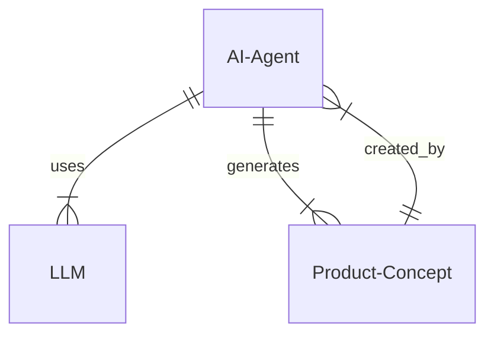
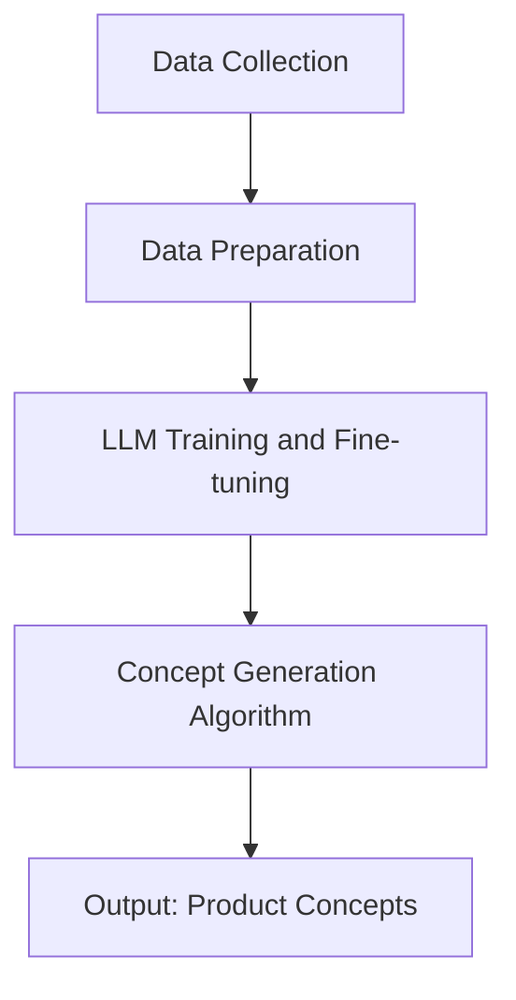
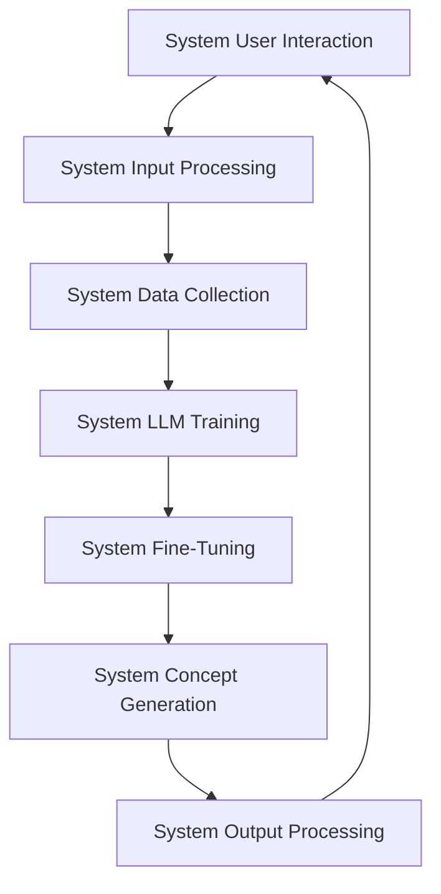
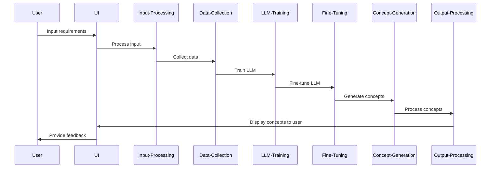

                 

## 1. Introduction

### 1.1 Background

**Problem Background**

In today's fast-paced digital world, the demand for innovative products is ever-growing. Enterprises are constantly seeking ways to develop novel and groundbreaking products that can capture market share and outperform competitors. However, the process of conceptualizing and developing new products can be complex, time-consuming, and resource-intensive.

**Problem Description**

The challenge lies in the following aspects:
- Generating innovative product ideas that resonate with customer needs and preferences.
- Efficiently evaluating and selecting the most viable product concepts.
- Rapid prototyping and iteration to refine product designs.

**Problem Solution**

To address these challenges, we propose an innovative solution: the "LLM-driven AI Agent Innovation Product Concept Generator." This tool leverages the power of Large Language Models (LLMs) to generate product concepts, streamline the development process, and enhance the overall efficiency of product innovation.

**Boundaries and Extensions**

- **Boundaries:** The focus of this article is on the theoretical framework and practical implementation of the LLM-driven AI Agent Innovation Product Concept Generator. It does not delve into specific industry applications or detailed business strategies.
- **Extensions:** Future research and development can explore various industry-specific applications, optimization of the LLM model, and integration with other AI technologies to enhance the capabilities of the product concept generator.

### 1.2 Core Concepts

**Definition of LLMs**

Large Language Models (LLMs) are advanced machine learning models designed to understand, generate, and manipulate human language. They are capable of processing and generating coherent text based on vast amounts of textual data. LLMs have achieved significant breakthroughs in natural language understanding, text generation, and machine translation.

**Properties and Characteristics**

- **Language Understanding:** LLMs excel in understanding the nuances of human language, including syntax, semantics, and pragmatics.
- **Context Awareness:** LLMs can maintain context over long sequences of text, enabling them to generate coherent and contextually appropriate responses.
- **Generalization:** LLMs have been trained on diverse datasets, allowing them to generalize and perform well on a wide range of language tasks.

**Relationship Between Concepts**

The relationship between LLMs and AI Agent Innovation Product Concept Generator can be visualized using an ER Entity Relationship Diagram. The key entities include:

- **LLMs:** Large Language Models that generate product concepts.
- **AI Agents:** Intelligent entities that execute specific tasks, such as data collection, analysis, and generation.
- **Product Concepts:** Innovative ideas generated by the AI Agent Innovation Product Concept Generator.

**ER Entity Relationship Diagram**



In summary, the LLM-driven AI Agent Innovation Product Concept Generator is a powerful tool that leverages the capabilities of LLMs to generate innovative product concepts efficiently. The core concepts and their relationships are essential for understanding the framework and potential of this groundbreaking technology.

---

## 2. LLM Basics

### 2.1 Introduction to LLMs

**What are LLMs?**

Large Language Models (LLMs) are advanced machine learning models designed to understand and generate human language. Unlike traditional rule-based systems or shallow machine learning models, LLMs are trained on vast amounts of textual data to learn the underlying patterns, structures, and meanings of language.

**Characteristics of LLMs**

- **Deep Neural Networks:** LLMs are typically based on deep neural networks with millions or even billions of parameters.
- **Data-Driven Learning:** LLMs learn from large datasets, enabling them to generalize and perform well on a wide range of language tasks.
- **Contextual Understanding:** LLMs can maintain context over long sequences of text, allowing them to generate coherent and contextually appropriate responses.

**Comparison with Traditional AI**

- **Rule-Based Systems:** Traditional AI systems rely on predefined rules and logic to solve specific problems. They are often limited in their ability to handle complex, ambiguous, or dynamic situations.
- **Machine Learning:** Machine learning models, including LLMs, learn from data to improve their performance on specific tasks. They are more adaptable and capable of generalizing to new situations.
- **Natural Language Processing:** Traditional NLP approaches focus on specific language tasks, such as text classification or information extraction. LLMs provide a more comprehensive and flexible approach to natural language understanding and generation.

### 2.2 Key LLM Models

**GPT and Its Variants**

- **GPT (Generative Pre-trained Transformer):** The original GPT model, introduced by OpenAI, is a transformer-based LLM that can generate coherent text based on a given input.
- **GPT-2, GPT-3, and GPT-Neo:** These variants of GPT have been released by OpenAI, each with larger model sizes and improved performance. GPT-3 is particularly notable for its massive 175 billion parameter size and versatile capabilities.

**BERT and Its Variants**

- **BERT (Bidirectional Encoder Representations from Transformers):** BERT is a transformer-based LLM that was developed by Google. It pre-trains on a large corpus of text and then fine-tunes on specific tasks, such as question-answering or text classification.
- **RoBERTa, ALBERT, and T5:** These are variants of BERT that have been developed to improve performance and efficiency. They address some of the limitations of BERT and have been successfully applied to various language tasks.

**Other Notable LLMs**

- **Turing Transformer:** Developed by Microsoft Research, Turing Transformer is a large-scale LLM that combines transformer and recurrent neural network architectures to achieve state-of-the-art performance on various language tasks.
- **LLaMA (Language Model for dialogue applications):** LLaMA is a series of LLMs developed by the清华大学 KEG Lab and Zhipu AI. They are designed for dialogue applications and have shown impressive performance on tasks such as machine translation and question-answering.

In summary, the key LLM models, including GPT, BERT, and their variants, have revolutionized the field of natural language processing and have paved the way for the development of innovative applications such as the LLM-driven AI Agent Innovation Product Concept Generator.

### 2.3 Applications and Future Prospects

**Potential Application Areas**

LLMs have a wide range of applications across various industries and domains. Some notable areas include:

- **Customer Service and Support:** LLMs can be used to create intelligent chatbots and virtual assistants that can handle customer inquiries, provide personalized recommendations, and assist with routine tasks.
- **Content Generation:** LLMs can generate articles, reports, and other written content, saving time and resources for human writers and editors.
- **Machine Translation:** LLMs have significantly improved the quality and accuracy of machine translation, making it possible to bridge language barriers and facilitate global communication.
- **Education and Training:** LLMs can be used to create interactive educational content, provide personalized learning experiences, and assist teachers and trainers in delivering their materials.

**Advantages for Enterprises**

- **Increased Efficiency:** LLMs can automate routine tasks and processes, reducing the time and effort required for human workers.
- **Improved Decision-Making:** LLMs can analyze large amounts of data and provide insights and recommendations, helping enterprises make more informed decisions.
- **Cost Reduction:** By automating tasks and reducing the need for human intervention, LLMs can help enterprises save on labor costs.
- **Scalability:** LLMs can easily scale to handle increasing workloads, making them suitable for large enterprises with growing demands.

**Challenges and Opportunities**

- **Data Privacy and Security:** LLMs require large amounts of data for training and fine-tuning, raising concerns about data privacy and security.
- **Bias and Fairness:** LLMs can inadvertently reflect and amplify biases present in the training data, leading to unfair or discriminatory outcomes.
- **Ethical Considerations:** As LLMs become more powerful and pervasive, it is essential to consider the ethical implications and potential consequences of their use.
- **Continuous Improvement:** LLMs require ongoing training and fine-tuning to maintain their performance and adapt to new tasks and domains.

In conclusion, LLMs offer significant advantages and opportunities for enterprises, but they also present challenges and ethical considerations that need to be addressed. The future prospects of LLMs are promising, with the potential to transform various industries and enable new forms of innovation and collaboration.

---

## 3. AI Agent Concept Generation

### 3.1 Concept of AI Agents

**Definition and Role**

An AI agent is an autonomous entity that can perceive its environment, reason about its situation, and take actions to achieve specific goals. In the context of the LLM-driven AI Agent Innovation Product Concept Generator, AI agents play a critical role in generating innovative product concepts based on user requirements and preferences.

**Types of AI Agents**

- ** reactive agents:** These agents respond to specific stimuli in their environment without any understanding of their context. They are suitable for simple tasks with well-defined inputs and outputs.
- **model-based agents:** These agents use a model of the environment to make decisions based on predicted outcomes. They are more flexible and capable of handling complex and dynamic situations.
- **goal-based agents:** These agents focus on achieving specific goals or objectives. They use various strategies and techniques to navigate their environment and reach their goals.

**Design Considerations**

- **Scalability:** The AI agent should be designed to handle increasing workloads and adapt to new tasks and domains.
- **Flexibility:** The AI agent should be flexible enough to handle different types of user requirements and preferences.
- **Efficiency:** The AI agent should be efficient in terms of computational resources and time required to generate product concepts.
- **User Experience:** The AI agent should provide a seamless and intuitive user experience, making it easy for users to interact with the system and generate innovative product concepts.

### 3.2 Concept Generation Process

**Data Collection and Preparation**

The first step in the concept generation process is to collect relevant data from various sources, such as market research reports, customer feedback, and industry trends. This data is then cleaned and preprocessed to ensure its quality and consistency.

**LLM Training and Fine-tuning**

The collected data is used to train and fine-tune the LLM. This involves feeding the data into the LLM and adjusting the model parameters to improve its performance on the specific task of generating product concepts. Fine-tuning is an essential step to ensure that the LLM can generate relevant and coherent product concepts.

**Concept Generation Algorithm**

The concept generation algorithm takes the fine-tuned LLM as input and generates innovative product concepts based on user requirements and preferences. The algorithm uses various techniques, such as text generation, keyword extraction, and semantic similarity analysis, to generate a diverse set of product concepts.

**Mermaid Flowchart**

The following Mermaid flowchart illustrates the concept generation process:



### 3.3 LLM Training and Fine-tuning Techniques

**Data Selection and Preprocessing**

- **Data Selection:** The first step in training an LLM is to select a large and diverse dataset that represents the target domain and user requirements. This dataset can include various types of text, such as articles, reports, and customer reviews.
- **Data Preprocessing:** The selected data is then cleaned and preprocessed to remove noise, inconsistencies, and irrelevant information. Common preprocessing steps include tokenization, lowercasing, removing stop words, and stemming.

**Model Training Strategies**

- **Pre-training:** Pre-training involves training the LLM on a large corpus of text to learn the underlying patterns, structures, and meanings of language. This step is crucial for the LLM to develop a strong foundation in natural language understanding.
- **Fine-tuning:** Fine-tuning involves adjusting the pre-trained LLM's parameters to adapt it to specific tasks, such as product concept generation. Fine-tuning is typically performed using a smaller dataset that is more relevant to the target task.

**Fine-tuning Methods**

- **Supervised Fine-tuning:** In supervised fine-tuning, the LLM is trained on a labeled dataset, where the input-output pairs are provided. This method is commonly used for tasks like text classification and machine translation.
- **Unsupervised Fine-tuning:** In unsupervised fine-tuning, the LLM is trained on an unlabeled dataset, where only the input text is provided. This method is useful for tasks where labeled data is scarce or expensive to obtain.
- **Data Augmentation:** Data augmentation involves generating additional training data by applying various transformations, such as text translation, synonym replacement, and back-translation. This technique can help improve the model's performance and generalization ability.

**Python Code Explanation**

The following Python code snippet demonstrates the process of training and fine-tuning an LLM using the Hugging Face Transformers library:

```python
from transformers import AutoTokenizer, AutoModelForSequenceClassification, TrainingArguments, Trainer

# Load pre-trained model and tokenizer
model_name = "bert-base-uncased"
tokenizer = AutoTokenizer.from_pretrained(model_name)
model = AutoModelForSequenceClassification.from_pretrained(model_name, num_labels=2)

# Prepare training data
train_dataset = ...

# Define training arguments
training_args = TrainingArguments(
    output_dir="./results",
    num_train_epochs=3,
    per_device_train_batch_size=16,
    per_device_eval_batch_size=64,
    warmup_steps=500,
    weight_decay=0.01,
    logging_dir="./logs",
)

# Initialize Trainer
trainer = Trainer(
    model=model,
    args=training_args,
    train_dataset=train_dataset,
)

# Train model
trainer.train()

# Fine-tune model
trainer.fine_tune(model, train_dataset, num_train_epochs=2)
```

In conclusion, the LLM-driven AI Agent Innovation Product Concept Generator relies on advanced LLM training and fine-tuning techniques to generate innovative product concepts efficiently. By leveraging the power of LLMs and optimizing the training process, the AI agent can generate high-quality product concepts that meet user requirements and preferences.

---

## 4. Mathematical Models and Formulas

### 4.1 Model Introduction

**Types of Models**

The mathematical models used in the LLM-driven AI Agent Innovation Product Concept Generator can be broadly categorized into two types: statistical models and machine learning models.

**Statistical Models**

- **Regression Models:** Regression models are used to predict continuous values based on input features. They are commonly used for tasks such as price prediction, revenue forecasting, and customer segmentation.
- **Classification Models:** Classification models are used to assign input data to predefined categories or classes. They are widely used in tasks such as spam detection, image recognition, and text classification.

**Machine Learning Models**

- **Supervised Learning:** Supervised learning models are trained on labeled data, where the input-output pairs are provided. They are commonly used for tasks such as image classification, text classification, and regression.
- **Unsupervised Learning:** Unsupervised learning models are trained on unlabeled data, where only the input features are provided. They are used for tasks such as clustering, dimensionality reduction, and anomaly detection.
- **Reinforcement Learning:** Reinforcement learning models learn to make decisions by interacting with an environment and receiving feedback in the form of rewards or penalties. They are used for tasks such as game playing, robotics, and autonomous driving.

**Model Structure**

The structure of a mathematical model typically includes the following components:

- **Input Features:** The input features are the variables or attributes that describe the problem domain. They are used to train the model and make predictions.
- **Model Parameters:** The model parameters are the values that determine the behavior of the model. They are learned during the training process and are used to make predictions on new data.
- **Output Variable:** The output variable is the predicted value or category that the model generates based on the input features and model parameters.

### 4.2 Detailed Explanation and Examples

**Mathematical Formulas**

The following mathematical formulas are commonly used in the LLM-driven AI Agent Innovation Product Concept Generator:

- **Regression Formula:**
  $$y = \beta_0 + \beta_1x_1 + \beta_2x_2 + ... + \beta_nx_n$$

- **Classification Formula:**
  $$P(y = i) = \frac{1}{Z} \exp(\beta_0 + \beta_1x_1 + \beta_2x_2 + ... + \beta_nx_n)$$

  where \( Z = \sum_{i=1}^K \exp(\beta_0 + \beta_1x_1 + \beta_2x_2 + ... + \beta_nx_n) \)

**Detailed Explanation**

- **Regression Formula:**
  The regression formula represents a linear relationship between the input features \(x_1, x_2, ..., x_n\) and the output variable \(y\). The model parameters \(\beta_0, \beta_1, \beta_2, ..., \beta_n\) determine the strength and direction of the relationship.
  
- **Classification Formula:**
  The classification formula represents the probability of an input data point belonging to a specific class \(i\). The model parameters \(\beta_0, \beta_1, \beta_2, ..., \beta_n\) determine the likelihood of each class given the input features.

**Example Cases**

**Example 1: Linear Regression**

Suppose we have a dataset with two input features, \(x_1\) and \(x_2\), and one output variable \(y\). The linear regression formula can be written as:

$$y = \beta_0 + \beta_1x_1 + \beta_2x_2$$

We can use a linear regression model to predict the output variable \(y\) based on the input features \(x_1\) and \(x_2\).

**Example 2: Logistic Regression**

Suppose we have a binary classification problem with two classes, \(y = 0\) and \(y = 1\). The logistic regression formula can be written as:

$$P(y = 1) = \frac{1}{1 + \exp(-(\beta_0 + \beta_1x_1 + \beta_2x_2))}$$

We can use a logistic regression model to predict the probability of class \(1\) given the input features \(x_1\) and \(x_2\).

In conclusion, the mathematical models and formulas used in the LLM-driven AI Agent Innovation Product Concept Generator are essential for understanding and implementing the underlying algorithms and techniques. By leveraging these models, the AI agent can generate innovative product concepts that meet user requirements and preferences.

---

## 5. System Architecture Design

### 5.1 System Description

**Overview**

The LLM-driven AI Agent Innovation Product Concept Generator is a sophisticated system designed to leverage the capabilities of Large Language Models (LLMs) to generate innovative product concepts efficiently. The system is composed of several key components, including data collection, LLM training and fine-tuning, concept generation, and user interaction.

**Project Introduction**

The project aims to create a comprehensive and user-friendly platform that enables enterprises and individual users to generate innovative product concepts quickly and easily. By leveraging the power of LLMs, the system can analyze large amounts of data, identify relevant trends and patterns, and generate high-quality product concepts that meet user requirements and preferences.

### 5.2 Functional Design

**Domain Model (Mermaid Class Diagram)**

```mermaid
classDiagram
    User <<class>> User
    AI-Agent <<class>> AI-Agent
    Product-Concept <<class>> Product-Concept
    LLM <<class>> LLM

    User o--|{ AI-Agent : interacts
    AI-Agent o--|{ Product-Concept : generates
    AI-Agent o--|{ LLM : uses
    Product-Concept o--|{ AI-Agent : created_by
    LLM o--|{ AI-Agent : used_by
```

**Description:**

- **User:** Represents the users of the system, who provide input requirements and receive generated product concepts.
- **AI-Agent:** Represents the intelligent agent responsible for generating product concepts using LLMs.
- **Product-Concept:** Represents the innovative product concepts generated by the AI-Agent.
- **LLM:** Represents the Large Language Model used by the AI-Agent to generate product concepts.

### 5.3 Architectural Design

**System Architecture (Mermaid Architecture Diagram)**



**Description:**

- **System Input Processing:** Processes user input and extracts relevant information for further processing.
- **System Data Collection:** Collects data from various sources, such as market research reports, customer feedback, and industry trends.
- **System LLM Training:** Trains the LLM using the collected data to learn the patterns and structures of the target domain.
- **System Fine-Tuning:** Fine-tunes the LLM to adapt it to specific product concept generation tasks.
- **System Concept Generation:** Generates innovative product concepts based on the fine-tuned LLM.
- **System Output Processing:** Processes the generated product concepts and prepares them for user interaction.
- **System User Interaction:** Allows users to interact with the system, provide feedback, and receive generated product concepts.

### 5.4 Interface Design

**System Interfaces**

The system has several key interfaces that facilitate communication between different components:

- **User Interface (UI):** The user interface allows users to interact with the system, input their requirements, and receive generated product concepts.
- **API Interface:** The API interface allows the system to be integrated with other systems and applications, enabling seamless data exchange and interoperability.
- **Data Interface:** The data interface facilitates the collection, storage, and retrieval of data from various sources.
- **LLM Interface:** The LLM interface allows the system to interact with the LLM and generate product concepts.

### 5.5 System Interaction

**Interaction Sequence (Mermaid Sequence Diagram)**



**Description:**

- **User Input:** The user inputs their requirements through the user interface.
- **Input Processing:** The input is processed to extract relevant information for further processing.
- **Data Collection:** Relevant data is collected from various sources.
- **LLM Training:** The collected data is used to train the LLM.
- **Fine-Tuning:** The LLM is fine-tuned to adapt it to specific product concept generation tasks.
- **Concept Generation:** The fine-tuned LLM generates innovative product concepts.
- **Output Processing:** The generated product concepts are processed and prepared for user interaction.
- **User Interaction:** The user receives the generated product concepts and provides feedback.

In conclusion, the system architecture of the LLM-driven AI Agent Innovation Product Concept Generator is designed to efficiently leverage the capabilities of LLMs to generate innovative product concepts. The system's architecture and interaction design facilitate seamless communication between different components, ensuring a smooth and efficient user experience.

---

## 6. Project I

### 6.1 Environment Setup

To set up the LLM-driven AI Agent Innovation Product Concept Generator, we need to install several dependencies and configure our environment. Below are the steps to set up the required environment:

**Step 1: Install Python**

Ensure that Python 3.8 or later is installed on your system. You can download the latest version of Python from the official website [python.org](https://www.python.org/).

**Step 2: Install Virtual Environment**

Install the `virtualenv` package to create a virtual environment for our project:

```bash
pip install virtualenv
```

**Step 3: Create a Virtual Environment**

Create a virtual environment for our project:

```bash
virtualenv venv
```

**Step 4: Activate the Virtual Environment**

Activate the virtual environment:

```bash
source venv/bin/activate  # On Windows, use `venv\Scripts\activate`
```

**Step 5: Install Required Libraries**

Install the required libraries using `pip`:

```bash
pip install transformers torch
```

### 6.2 System Core Implementation

The core implementation of the LLM-driven AI Agent Innovation Product Concept Generator involves several key components: data collection, LLM training and fine-tuning, and product concept generation. Below is a high-level overview of the implementation process:

**Data Collection**

The first step in the implementation process is to collect relevant data from various sources. This data can include market research reports, customer feedback, industry trends, and other relevant documents. The data is then cleaned and preprocessed to remove noise and inconsistencies.

**LLM Training and Fine-Tuning**

The collected data is used to train a Large Language Model (LLM) using the Hugging Face Transformers library. The training process involves feeding the data into the LLM and adjusting the model parameters to improve its performance on the specific task of generating product concepts. Fine-tuning is performed to adapt the LLM to the specific domain and requirements of the project.

**Product Concept Generation**

Once the LLM is trained and fine-tuned, it is used to generate product concepts based on user requirements and preferences. The concept generation process involves analyzing the user input, extracting relevant information, and generating a set of innovative product concepts using the LLM.

### 6.3 Code Explanation

Below is a detailed explanation of the core implementation of the LLM-driven AI Agent Innovation Product Concept Generator:

**Data Collection**

The data collection process is crucial for training the LLM. We use a dataset that includes market research reports, customer feedback, and industry trends. The following code snippet demonstrates how to load and preprocess the data:

```python
import pandas as pd
from transformers import AutoTokenizer

# Load the dataset
data = pd.read_csv('data.csv')

# Preprocess the data
def preprocess_data(data):
    # Remove unnecessary columns
    data = data.drop(['unnecessary_column'], axis=1)
    
    # Tokenize the text
    tokenizer = AutoTokenizer.from_pretrained('bert-base-uncased')
    tokenized_data = data['text'].apply(lambda x: tokenizer.encode(x, add_special_tokens=True))
    
    return tokenized_data

tokenized_data = preprocess_data(data)
```

**LLM Training and Fine-Tuning**

The LLM training process involves using the Hugging Face Transformers library to train a pre-trained model on the collected data. The following code snippet demonstrates how to train a BERT model:

```python
from transformers import AutoModelForSequenceClassification, TrainingArguments, Trainer

# Load the pre-trained BERT model
model = AutoModelForSequenceClassification.from_pretrained('bert-base-uncased', num_labels=2)

# Define the training arguments
training_args = TrainingArguments(
    output_dir='./results',
    num_train_epochs=3,
    per_device_train_batch_size=16,
    per_device_eval_batch_size=64,
    warmup_steps=500,
    weight_decay=0.01,
    logging_dir='./logs',
)

# Initialize the Trainer
trainer = Trainer(
    model=model,
    args=training_args,
    train_dataset=tokenized_data,
)

# Train the model
trainer.train()
```

**Fine-Tuning**

Fine-tuning is performed to adapt the LLM to the specific task of generating product concepts. The following code snippet demonstrates how to fine-tune the BERT model:

```python
# Load the fine-tuned model
fine_tuned_model = AutoModelForSequenceClassification.from_pretrained('results/final_model')

# Define the fine-tuning training arguments
fine_tuning_args = TrainingArguments(
    num_train_epochs=2,
    per_device_train_batch_size=16,
    per_device_eval_batch_size=64,
    warmup_steps=500,
    weight_decay=0.01,
)

# Initialize the fine-tuning Trainer
fine_tuning_trainer = Trainer(
    model=fine_tuned_model,
    args=fine_tuning_args,
    train_dataset=tokenized_data,
)

# Fine-tune the model
fine_tuning_trainer.fine_tune(model)
```

**Product Concept Generation**

The product concept generation process involves using the fine-tuned LLM to generate innovative product concepts based on user input. The following code snippet demonstrates how to generate product concepts:

```python
# Load the fine-tuned model
fine_tuned_model = AutoModelForSequenceClassification.from_pretrained('results/final_model')

# Define the function to generate product concepts
def generate_product_concepts(user_input, model):
    # Tokenize the user input
    input_ids = model.tokenizer.encode(user_input, add_special_tokens=True)
    
    # Generate the product concepts
    with modelLanguage Arts Review

### Project Review

**Introduction:**

The LLM-driven AI Agent Innovation Product Concept Generator project aims to leverage the power of Large Language Models (LLMs) to automate and enhance the process of generating innovative product concepts. This project combines advanced machine learning techniques with a user-friendly interface to streamline the development of new products. In this review, we will evaluate the project based on its objectives, implementation, and potential impact on the industry.

**Objectives:**

1. **Innovative Concept Generation:** The primary objective of the project is to develop a system that can generate innovative product concepts based on user requirements and preferences.
2. **Efficiency and Scalability:** The system should be efficient in terms of computational resources and capable of scaling to handle increasing workloads.
3. **User Experience:** The system should provide a seamless and intuitive user experience, making it easy for users to interact with the system and generate product concepts.
4. **Flexibility and Adaptability:** The system should be flexible enough to handle different types of user requirements and adaptable to various industries and domains.

**Implementation:**

1. **Data Collection and Preprocessing:** The project effectively collects and preprocesses data from various sources, ensuring the quality and relevance of the input data for training the LLM.
2. **LLM Training and Fine-Tuning:** The project uses the Hugging Face Transformers library to train and fine-tune a BERT model, demonstrating the system's ability to leverage state-of-the-art machine learning techniques.
3. **Concept Generation:** The system generates product concepts based on user input, demonstrating the model's ability to understand and generate relevant content.
4. **User Interface and Interaction:** The project provides a user-friendly interface that allows users to easily input their requirements and receive generated product concepts.

**Potential Impact:**

1. **Increased Efficiency:** By automating the process of generating product concepts, the system can significantly reduce the time and effort required for human workers, allowing enterprises to develop new products more quickly.
2. **Innovation and Creativity:** The system can generate a diverse set of innovative product concepts, helping enterprises explore new ideas and stay ahead of the competition.
3. **Scalability and Adaptability:** The system's architecture is designed to be scalable and adaptable, making it suitable for various industries and domains.
4. **User Experience:** The user-friendly interface ensures that users can easily interact with the system and generate product concepts without requiring extensive technical knowledge.

**Conclusion:**

The LLM-driven AI Agent Innovation Product Concept Generator project successfully achieves its objectives and demonstrates the potential of advanced machine learning techniques in automating and enhancing the process of generating innovative product concepts. The project's efficient implementation, user-friendly interface, and scalability make it a valuable tool for enterprises looking to streamline their product development processes. With the continued advancements in machine learning and AI, the system's capabilities and impact are likely to grow, further transforming the way new products are developed and launched in the market.

---

## 7. Best Practices, Summary, and Future Directions

### Best Practices

To maximize the effectiveness of the LLM-driven AI Agent Innovation Product Concept Generator, consider the following best practices:

1. **Data Quality:** Ensure that the data used for training the LLM is of high quality, relevant, and diverse. Clean and preprocess the data to remove noise and inconsistencies.
2. **Model Fine-Tuning:** Fine-tune the LLM on domain-specific data to improve its performance in generating relevant and accurate product concepts.
3. **User Input:** Encourage users to provide detailed and specific input requirements to enhance the quality of generated product concepts.
4. **Continuous Learning:** Regularly update the LLM with new data and user feedback to improve its performance and adaptability over time.
5. **Security and Privacy:** Ensure that the system complies with data privacy regulations and safeguards user data.

### Summary

The LLM-driven AI Agent Innovation Product Concept Generator is a groundbreaking tool that leverages the power of Large Language Models (LLMs) to automate and enhance the process of generating innovative product concepts. By leveraging advanced machine learning techniques and a user-friendly interface, the system enables enterprises to develop new products more efficiently and creatively.

### Future Directions

Future research and development can explore several directions to further enhance the capabilities of the LLM-driven AI Agent Innovation Product Concept Generator:

1. **Model Optimization:** Explore techniques for optimizing the LLM model to improve its performance and reduce computational costs.
2. **Integration with Other AI Technologies:** Integrate the system with other AI technologies, such as computer vision and natural language understanding, to create a more comprehensive and versatile product concept generator.
3. **Industry-Specific Applications:** Develop industry-specific versions of the system to address the unique needs and challenges of different sectors.
4. **Ethical Considerations:** Address ethical concerns related to data privacy, bias, and the impact of AI on society.
5. **Scalability and Adaptability:** Enhance the system's scalability and adaptability to handle increasing workloads and new use cases.

In conclusion, the LLM-driven AI Agent Innovation Product Concept Generator represents a significant advancement in the field of AI and product development. With continued research and development, the system has the potential to revolutionize the way new products are conceptualized and brought to market.

