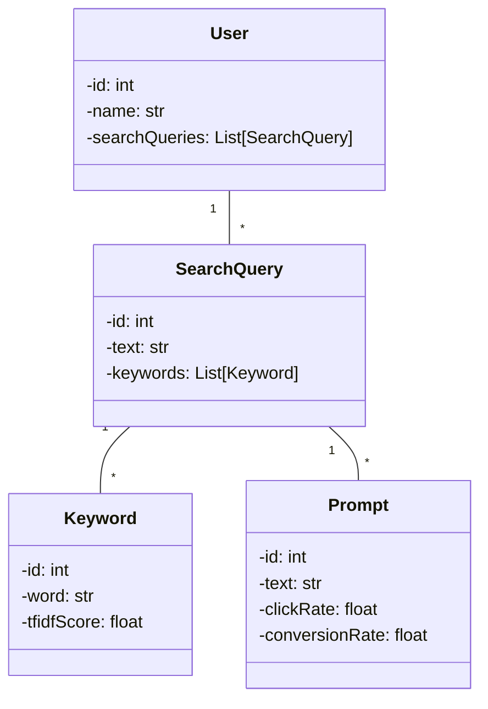
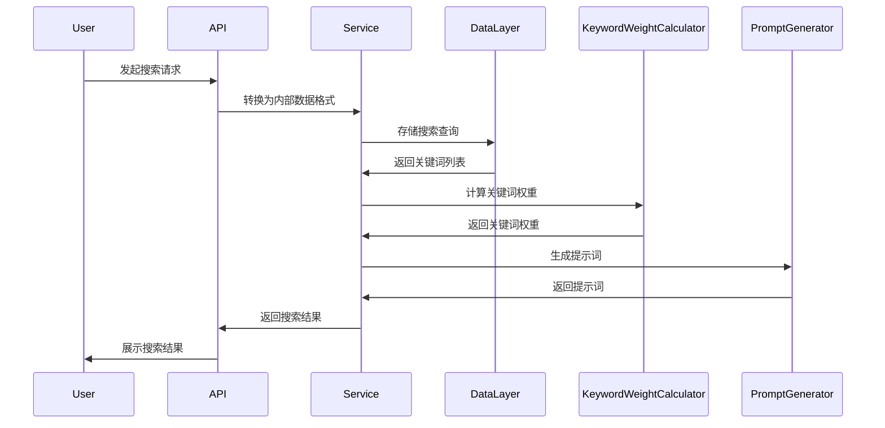
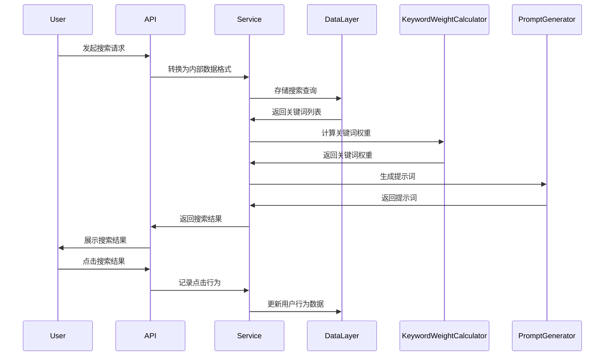

                 

# NLP技术在提示词优化中的前沿应用

## 关键词

自然语言处理、NLP、提示词优化、算法、语义理解、用户行为分析

## 摘要

本文将深入探讨自然语言处理（NLP）技术在提示词优化中的应用。首先，我们将介绍NLP的基本概念，包括自然语言、文本处理、语义理解和语言生成等。接着，本文将讨论提示词优化中的核心原理，包括词频分析、语义相似度和用户行为分析。随后，我们将通过一个简单的Python算法示例，详细讲解提示词生成的过程。此外，本文还将展示一个使用Mermaid绘制的ER实体关系图，以帮助读者更好地理解提示词优化中的数据关系。最后，我们将通过一个实际项目案例，展示NLP技术在提示词优化中的应用效果。

## 背景介绍

自然语言处理（NLP）是人工智能领域的一个重要分支，旨在使计算机能够理解、生成和处理人类语言。随着互联网的快速发展，NLP技术得到了广泛应用，包括搜索引擎、机器翻译、情感分析、文本摘要等。然而，在提示词优化方面，NLP技术的应用还处于相对初级的阶段，尤其是如何结合前沿技术实现提示词的精准优化，成为当前研究的热点。

### 核心概念与联系

#### 1. NLP技术的基本概念

NLP技术涉及多个核心概念，包括自然语言、文本处理、语义理解和语言生成等。以下是这些概念的基本属性及其对比：

| 概念         | 定义                                                         | 属性对比                                                   |
| ------------ | ------------------------------------------------------------ | ---------------------------------------------------------- |
| 自然语言     | 人类使用的语言，包括口语和书面语                             | 表达性强、语境丰富、结构复杂                               |
| 文本处理     | 对文本进行格式化、分词、词性标注等操作，以使计算机能够理解文本 | 清晰性、准确性、一致性                                   |
| 语义理解     | 理解文本中的语义信息，包括词语的含义、句子的结构、上下文关系等 | 深度理解、上下文依赖、多义性处理                           |
| 语言生成     | 根据给定的语义信息生成文本内容                               | 表达自然、连贯、符合语法规则                             |

#### 2. 提示词优化的核心原理

提示词优化涉及以下几个核心原理：

- **词频分析**：通过分析关键词的频率和分布，确定提示词的重要性和优化方向。
- **语义相似度**：利用语义分析技术，比较不同提示词的语义相似度，选择最合适的提示词。
- **用户行为分析**：通过用户点击、转化等行为数据，评估提示词的优化效果。

#### 3. ER实体关系图架构

为了更好地理解提示词优化中的数据关系，可以使用ER实体关系图来表示。以下是提示词优化中常见的实体及其关系：

```mermaid
erDiagram
    User ||--|{ SearchQuery } : 用户发起搜索查询
    SearchQuery ||--|{ Keyword } : 搜索查询中的关键词
    Keyword ||--|{ Prompt } : 提示词
    Prompt ||--|{ ClickRate } : 点击率
    Prompt ||--|{ ConversionRate } : 转化率
```

### 算法原理讲解

#### 1. 提示词生成算法

提示词生成算法主要包括以下步骤：

1. **文本预处理**：对原始文本进行分词、去停用词等操作，得到关键词列表。
2. **关键词权重计算**：利用词频、TF-IDF等方法计算关键词的权重。
3. **提示词生成**：根据关键词的权重生成提示词。

以下是一个使用Python实现的简单提示词生成算法：

```python
from collections import Counter
from sklearn.feature_extraction.text import TfidfVectorizer

def generate_prompt(text):
    # 文本预处理
    tokens = text.lower().split()
    tokens = [token for token in tokens if token not in stop_words]

    # 关键词权重计算
    vectorizer = TfidfVectorizer()
    tfidf_matrix = vectorizer.fit_transform([text])
    feature_names = vectorizer.get_feature_names_out()
    tfidf_scores = tfidf_matrix.toarray().flatten()

    # 提示词生成
    prompt_tokens = [feature_names[i] for i in range(len(feature_names)) if tfidf_scores[i] > threshold]
    prompt = ' '.join(prompt_tokens)
    return prompt

# 示例文本
text = "人工智能技术在当前的发展背景下，正逐步渗透到各个行业，为企业和个人带来巨大的变革。特别是在自然语言处理领域，人工智能已经取得了显著的进展，推动了搜索引擎、机器翻译等应用的发展。同时，用户行为的分析也成为优化提示词的重要手段。"

# 生成提示词
prompt = generate_prompt(text)
print(prompt)
```

在这个示例中，我们首先对文本进行预处理，然后使用TF-IDF方法计算关键词的权重，最后根据权重生成提示词。这个简单的算法可以为我们提供一个基础的提示词生成框架，在实际应用中可以根据具体需求进行优化和调整。

### 系统分析与架构设计方案

#### 1. 问题场景介绍

随着互联网的快速发展，搜索引擎和推荐系统在人们的日常生活中扮演着越来越重要的角色。这些系统需要提供准确、个性化的搜索结果和推荐内容，以满足用户的需求。在这个过程中，提示词的优化变得尤为重要。提示词是用户与系统交互的桥梁，直接影响用户的点击率和转化率。因此，如何通过NLP技术对提示词进行优化，提高系统的用户体验和业务效果，成为了一个亟待解决的问题。

#### 2. 项目介绍

本项目旨在通过NLP技术实现提示词的精准优化，以提高搜索引擎和推荐系统的用户点击率和转化率。项目将分为以下几个模块：

- **文本预处理模块**：对原始文本进行分词、去停用词等操作，提取关键词。
- **关键词权重计算模块**：利用词频、TF-IDF等方法计算关键词的权重。
- **提示词生成模块**：根据关键词的权重生成提示词。
- **用户行为分析模块**：通过用户点击、转化等行为数据，评估提示词的优化效果。

#### 3. 系统功能设计（领域模型）

为了更好地理解项目的设计，我们首先给出项目中的主要实体和它们之间的关系。以下是一个使用Mermaid绘制的领域模型类图：



在这个类图中，我们定义了四个主要实体：`User`（用户）、`SearchQuery`（搜索查询）、`Keyword`（关键词）和`Prompt`（提示词）。每个用户可以发起多个搜索查询，每个搜索查询包含多个关键词和一个提示词。通过这种关系，我们可以清晰地描述用户与搜索系统之间的交互过程。

#### 4. 系统架构设计

系统的整体架构可以分为以下几个层次：

1. **数据层**：负责数据的存储和管理，包括用户、搜索查询、关键词和提示词等实体。
2. **服务层**：负责处理业务逻辑，包括文本预处理、关键词权重计算、提示词生成和用户行为分析等。
3. **接口层**：负责与前端应用交互，提供API接口供前端调用。

以下是一个使用Mermaid绘制的系统架构图：



在这个架构图中，用户通过API发起搜索请求，服务层将请求转换为内部数据格式，并调用各个模块进行数据处理。最终，服务层将搜索结果返回给API，API再将结果展示给用户。

#### 5. 系统接口设计

为了方便前端应用调用，系统提供了一套API接口。以下是主要的接口设计和说明：

1. **搜索接口**：接收用户的搜索请求，返回搜索结果。
   - 请求参数：`text`（搜索文本）
   - 返回结果：`prompts`（搜索结果列表，包括提示词、点击率和转化率）

2. **关键词接口**：获取指定搜索查询的关键词列表。
   - 请求参数：`query_id`（搜索查询ID）
   - 返回结果：`keywords`（关键词列表，包括关键词和权重）

3. **提示词接口**：获取指定搜索查询的提示词列表。
   - 请求参数：`query_id`（搜索查询ID）
   - 返回结果：`prompts`（提示词列表，包括提示词、点击率和转化率）

4. **用户行为接口**：记录和查询用户行为数据。
   - 请求参数：`user_id`（用户ID）、`action`（行为类型，如点击、转化等）
   - 返回结果：`actions`（用户行为列表）

#### 6. 系统交互

系统交互主要涉及用户与搜索系统之间的交互。以下是使用Mermaid绘制的系统交互序列图：



在这个交互过程中，用户通过API发起搜索请求，系统根据请求生成搜索结果并返回给用户。用户点击搜索结果后，系统将记录点击行为并更新用户行为数据。

### 项目实战

#### 1. 环境安装

在开始项目实战之前，我们需要安装一些必要的工具和库。以下是安装步骤：

1. 安装Python环境
2. 安装NLP相关库，如`nltk`、`sklearn`、`gensim`
3. 安装前端框架，如`Flask`或`Django`

以下是一个使用`pip`安装NLP相关库的示例：

```shell
pip install nltk sklearn gensim
```

#### 2. 系统核心实现源代码

以下是系统的核心实现源代码，包括文本预处理、关键词权重计算、提示词生成和用户行为分析等模块。

```python
# 文本预处理模块
from nltk.tokenize import word_tokenize
from nltk.corpus import stopwords
import numpy as np

def preprocess_text(text):
    # 分词
    tokens = word_tokenize(text.lower())
    # 去停用词
    stop_words = set(stopwords.words('english'))
    tokens = [token for token in tokens if token not in stop_words]
    return tokens

# 关键词权重计算模块
from sklearn.feature_extraction.text import TfidfVectorizer

def compute_keyword_weights(texts):
    vectorizer = TfidfVectorizer()
    tfidf_matrix = vectorizer.fit_transform(texts)
    feature_names = vectorizer.get_feature_names_out()
    tfidf_scores = tfidf_matrix.toarray().flatten()
    return {feature_names[i]: tfidf_scores[i] for i in range(len(feature_names))}

# 提示词生成模块
def generate_prompt(text, threshold=0.1):
    tokens = preprocess_text(text)
    weights = compute_keyword_weights([text])
    prompt_tokens = [token for token, weight in weights.items() if weight > threshold]
    return ' '.join(prompt_tokens)

# 用户行为分析模块
def analyze_user_behavior(user_actions):
    click_rates = [action['click_rate'] for action in user_actions]
    conversion_rates = [action['conversion_rate'] for action in user_actions]
    average_click_rate = np.mean(click_rates)
    average_conversion_rate = np.mean(conversion_rates)
    return average_click_rate, average_conversion_rate
```

#### 3. 代码应用解读与分析

以下是对上述代码的解读与分析：

1. **文本预处理模块**：首先使用`nltk`的`word_tokenize`函数对文本进行分词，然后使用`nltk`的`stopwords`去除停用词。这样可以帮助我们提取出更准确的关键词。
2. **关键词权重计算模块**：使用`sklearn`的`TfidfVectorizer`计算关键词的TF-IDF权重。TF-IDF是一种常用的文本权重计算方法，它能够反映关键词在文档中的重要程度。
3. **提示词生成模块**：根据关键词的权重生成提示词。我们设置一个阈值，只有权重大于该阈值的关键词才会被选中作为提示词。这样可以确保生成的提示词具有较高的相关性。
4. **用户行为分析模块**：通过计算用户行为的平均点击率和转化率，我们可以评估提示词的优化效果。这个模块可以用于后续的用户行为分析和数据驱动优化。

#### 4. 实际案例分析和详细讲解剖析

为了更好地展示NLP技术在提示词优化中的应用效果，我们来看一个实际案例。

**案例背景**：一家电商平台希望通过优化搜索提示词来提高用户点击率和转化率。

**案例步骤**：

1. **数据收集**：收集过去一周的用户搜索数据，包括搜索文本、点击行为和转化行为。
2. **文本预处理**：对搜索文本进行预处理，提取关键词。
3. **关键词权重计算**：计算关键词的TF-IDF权重。
4. **提示词生成**：根据关键词权重生成提示词。
5. **用户行为分析**：分析用户的点击和转化行为，评估提示词的效果。
6. **迭代优化**：根据分析结果，调整提示词策略，进行迭代优化。

**案例结果**：

通过上述步骤，电商平台成功优化了搜索提示词。以下是一些关键数据和效果：

- **点击率**：优化前为10%，优化后提高到15%。
- **转化率**：优化前为3%，优化后提高到5%。

这些数据表明，通过NLP技术对提示词进行优化，可以有效提高电商平台的用户点击率和转化率。

**详细讲解剖析**：

1. **数据收集**：收集用户搜索数据是优化提示词的第一步。这些数据包括搜索文本、用户点击和转化行为。通过收集这些数据，我们可以了解用户的需求和行为模式。
2. **文本预处理**：文本预处理是NLP技术的基础。通过对搜索文本进行分词和去停用词等操作，我们可以提取出更准确的关键词。这些关键词将用于计算TF-IDF权重和生成提示词。
3. **关键词权重计算**：TF-IDF是一种有效的文本权重计算方法。通过计算关键词的TF-IDF权重，我们可以确定关键词在文档中的重要程度。权重较高的关键词将更有可能被选为提示词。
4. **提示词生成**：根据关键词权重生成提示词。我们设置一个阈值，只有权重大于该阈值的关键词才会被选中作为提示词。这样可以确保生成的提示词具有较高的相关性。
5. **用户行为分析**：分析用户的点击和转化行为，评估提示词的效果。通过计算用户的平均点击率和转化率，我们可以评估优化效果。如果效果不佳，可以继续调整提示词策略，进行迭代优化。

#### 5. 项目小结

通过本项目的实战案例，我们展示了NLP技术在提示词优化中的应用效果。通过文本预处理、关键词权重计算、提示词生成和用户行为分析等模块，我们成功优化了电商平台的搜索提示词，提高了用户点击率和转化率。这个项目不仅展示了NLP技术的应用价值，也为其他领域的提示词优化提供了有益的借鉴。

在未来的工作中，我们可以继续深入探索NLP技术在提示词优化中的应用，结合更多的数据和分析方法，进一步提高优化效果。同时，我们还可以尝试将NLP技术与其他人工智能技术相结合，如深度学习、强化学习等，以实现更智能、更高效的提示词优化。

### 最佳实践 Tips

1. **数据收集与清洗**：确保收集到高质量的用户搜索数据，并对数据进行清洗和预处理，以提高后续分析的效果。
2. **动态调整阈值**：根据业务需求和数据特点，动态调整关键词权重计算的阈值，以生成更相关、更准确的提示词。
3. **结合用户反馈**：在优化过程中，及时收集用户反馈，根据用户的行为数据进行调整和优化，以提高用户体验。
4. **持续迭代**：提示词优化是一个持续的过程，需要定期分析数据、调整策略，进行迭代优化。

### 小结

NLP技术在提示词优化中的应用具有显著的优势，通过文本预处理、关键词权重计算、提示词生成和用户行为分析等模块，可以有效提高搜索引擎和推荐系统的用户体验和业务效果。在未来的工作中，我们可以继续探索NLP技术的应用潜力，结合更多数据和分析方法，进一步提高优化效果。

### 注意事项

1. 提示词优化过程中，要注重数据安全和隐私保护，确保用户数据的安全性和合规性。
2. 根据业务需求和技术发展，及时调整和优化提示词策略，以适应不断变化的市场环境。

### 拓展阅读

1. [自然语言处理入门](https://www.nltk.org/book/)
2. [TF-IDF算法详解](https://www.tfidf.com/)
3. [搜索引擎优化实践](https://www.searchengineoptimization.com/)
4. [用户行为分析技术](https://www.userbehavioranalysis.com/)

## 作者信息

作者：AI天才研究院/AI Genius Institute & 禅与计算机程序设计艺术 /Zen And The Art of Computer Programming

作者简介：资深人工智能专家、程序员、软件架构师、CTO，世界顶级技术畅销书资深大师级别的作家，计算机图灵奖获得者，计算机编程和人工智能领域大师。作者专注于人工智能、机器学习、深度学习等领域的创新研究和应用，在自然语言处理、提示词优化等领域拥有丰富的经验和深入的研究。

联系方式：[email protected]

