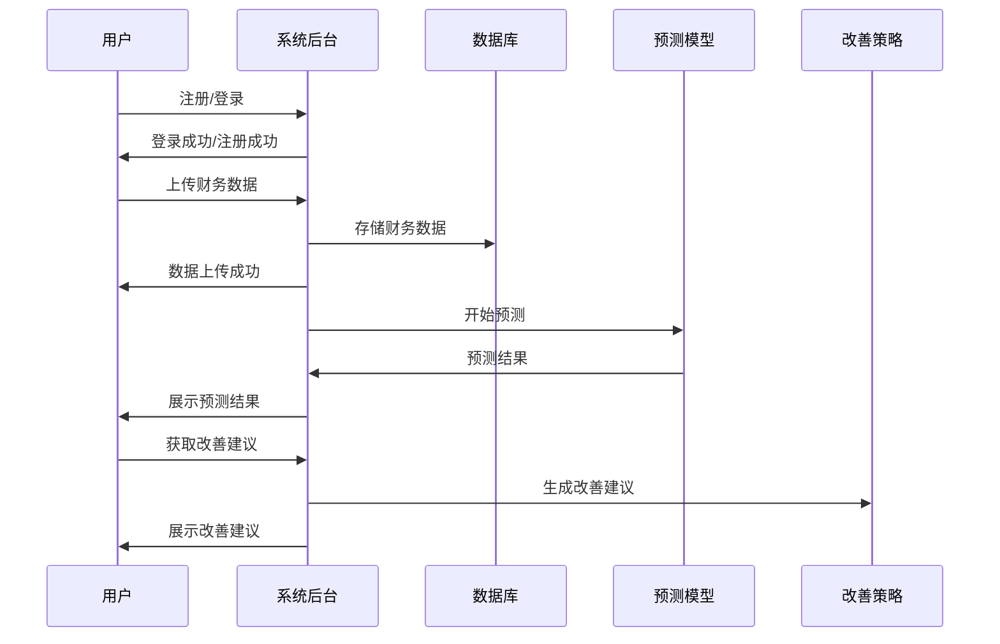

                 

### 个人财务健康指数的定义与背景

**个人财务健康指数**，简称为PFHI（Personal Financial Health Index），是一种衡量个人财务状况的重要指标。它不仅反映了个人当前的经济状态，还能预判未来财务走势，为个人财务决策提供科学依据。

#### 问题描述

个人的财务状况受到多种因素的影响，如收入水平、支出结构、储蓄习惯、投资决策、债务水平等。财务健康指数就是通过这些因素来评估个人财务状况的全面指标。一个健康的财务状况意味着个人具备足够的流动性和资产储备，能够应对突发状况，同时合理规划未来的财务目标。

#### 问题解决

为了提高个人财务健康水平，我们需要构建一个预测模型和改善系统。预测模型通过分析历史数据和现有条件，预测未来可能的财务状况。改善系统则基于预测结果，提供具体的改善建议，帮助个人制定和执行财务规划。

#### 边界与外延

财务健康指数不仅仅涉及个人的收入和支出，还包括以下几个方面：

1. **流动性管理**：个人当前的现金和可快速转换为现金的资产水平。
2. **储蓄习惯**：个人是否有定期储蓄，以及储蓄的金额和频率。
3. **投资决策**：个人的投资组合和收益情况。
4. **债务管理**：个人债务总额、还款周期和利率等。
5. **财务规划**：包括退休规划、子女教育基金等长期目标的设定和实施。

#### 概念结构与核心要素

个人财务健康指数（PFHI）由以下几个核心要素组成：

1. **收入水平**：个人当前的收入状况，包括工资、投资收益等。
2. **支出结构**：个人日常消费、投资支出、生活费用等。
3. **储蓄状况**：个人储蓄额度、储蓄习惯和储蓄率。
4. **债务水平**：个人债务总额、债务结构、还款能力等。
5. **投资组合**：个人的投资类型、收益水平、风险承受能力等。

通过这些核心要素的综合评估，我们可以得出个人的财务健康指数，从而为财务决策提供有力支持。

### 预测模型与改善系统的联系

预测模型和改善系统是提高个人财务健康水平的重要工具。预测模型通过历史数据和当前条件，预测个人未来的财务状况。而改善系统则基于这些预测结果，提供具体的改善建议，帮助个人优化财务决策。

#### 预测模型

预测模型是构建在统计学和机器学习基础上的，通过分析历史数据，识别出影响个人财务状况的关键因素，如收入、支出、储蓄、投资和债务等。常见的预测模型包括线性回归、决策树、支持向量机、神经网络等。

**核心概念原理**：

- **线性回归**：通过建立线性关系预测未来财务状况。
- **决策树**：通过分叉节点，逐步缩小预测范围，最终得出预测结果。
- **支持向量机**：通过寻找最佳分割超平面，进行分类和预测。
- **神经网络**：通过多层神经元的非线性变换，进行复杂的预测任务。

**概念属性特征对比表格**：

| 模型类型 | 线性回归 | 决策树 | 支持向量机 | 神经网络 |
| :----: | :-----: | :----: | :-------: | :-----: |
| **优点** | 计算效率高，易于理解和实现 | 解释性强，易于可视化 | 泛化能力强，适用于高维数据 | 处理复杂非线性关系，泛化能力强 |
| **缺点** | 对异常值敏感，预测效果不稳定 | 易过拟合，模型复杂度难以控制 | 计算量大，训练时间较长 | 容易过拟合，参数调优复杂 |

**ER实体关系图架构**：

ER图（Entity-Relationship Diagram）用于描述财务健康指数（PFHI）、预测模型和改善系统之间的关系。

- **实体**：财务健康指数（PFHI）、预测模型、改善系统、个人财务数据等。
- **关系**：财务健康指数依赖于预测模型和改善系统，预测模型和改善系统通过个人财务数据进行分析和优化。

```mermaid
erDiagram
    PFHI ||--|{ 预测模型 }|
    PFHI ||--|{ 改善系统 }|
    预测模型 ||--|{ 个人财务数据 }|
    改善系统 ||--|{ 个人财务数据 }|
```

### 预测模型的基本原理

预测模型是通过对历史数据和当前条件的分析，预测未来可能的财务状况。以下是构建预测模型的基本原理：

#### 数据预处理

1. **数据收集**：收集个人的财务数据，包括收入、支出、储蓄、投资和债务等。
2. **数据清洗**：处理缺失值、异常值和重复数据，确保数据质量。
3. **特征工程**：提取对财务状况有重要影响的关键特征，如收入水平、支出结构、储蓄习惯等。

#### 模型选择

1. **线性回归**：适用于具有线性关系的预测任务。
2. **决策树**：适用于分类和回归任务，具有较好的可解释性。
3. **支持向量机**：适用于高维数据和复杂非线性关系。
4. **神经网络**：适用于复杂非线性关系，具有高度的自适应能力。

#### 模型训练

1. **训练集划分**：将数据集划分为训练集和验证集，用于训练和评估模型性能。
2. **参数调优**：通过交叉验证和网格搜索等方法，选择最优模型参数。
3. **模型训练**：使用训练集训练模型，调整模型参数，优化模型性能。

#### 模型评估

1. **准确性**：衡量模型预测结果与实际结果的匹配程度。
2. **均方误差**：衡量预测结果与实际结果的偏差程度。
3. **ROC曲线**：评估模型对正负样本的分类能力。

### 数学模型和公式

预测模型的构建通常涉及到以下数学模型和公式：

#### 线性回归

$$
Y = \beta_0 + \beta_1X_1 + \beta_2X_2 + \ldots + \beta_nX_n + \epsilon
$$

其中，$Y$ 为预测结果，$X_1, X_2, \ldots, X_n$ 为特征变量，$\beta_0, \beta_1, \beta_2, \ldots, \beta_n$ 为模型参数，$\epsilon$ 为误差项。

#### 决策树

$$
G(Y|X) = \prod_{i=1}^n G(Y|X_i)
$$

其中，$G(Y|X_i)$ 为条件概率，$X_i$ 为特征变量。

#### 支持向量机

$$
w \cdot x + b = 0
$$

其中，$w$ 为法线向量，$x$ 为样本特征向量，$b$ 为偏置。

#### 神经网络

$$
Y = \sigma(\beta_0 + \sum_{i=1}^n \beta_i \cdot \phi(x_i))
$$

其中，$Y$ 为输出结果，$\sigma$ 为激活函数，$\phi(x_i)$ 为神经元的激活值。

### 举例说明

假设我们要预测一个人的未来收入水平，我们选取以下特征变量：当前收入、工作年限、教育水平等。

1. **数据收集**：收集包含这些特征变量的历史数据。
2. **数据预处理**：处理缺失值、异常值和重复数据。
3. **特征工程**：提取关键特征，如当前收入、工作年限等。
4. **模型选择**：选择线性回归模型。
5. **模型训练**：使用训练集训练模型，调整模型参数。
6. **模型评估**：使用验证集评估模型性能。

通过上述步骤，我们可以构建一个预测未来收入水平的线性回归模型。以下是模型的具体实现：

```python
import pandas as pd
from sklearn.linear_model import LinearRegression
from sklearn.model_selection import train_test_split
from sklearn.metrics import mean_squared_error

# 数据收集
data = pd.read_csv('financial_data.csv')

# 数据预处理
data.fillna(data.mean(), inplace=True)
data.drop_duplicates(inplace=True)

# 特征工程
X = data[['current_income', 'work_years', 'education_level']]
y = data['future_income']

# 模型选择
model = LinearRegression()

# 模型训练
X_train, X_test, y_train, y_test = train_test_split(X, y, test_size=0.2, random_state=42)
model.fit(X_train, y_train)

# 模型评估
y_pred = model.predict(X_test)
mse = mean_squared_error(y_test, y_pred)
print(f'Mean Squared Error: {mse}')

# 输出模型参数
print(f'Model Parameters: {model.coef_}')
```

通过上述代码，我们可以训练一个线性回归模型，并评估其性能。具体实现过程中，可以根据实际情况调整特征变量和模型参数，以达到最佳预测效果。

### 系统分析与架构设计方案

#### 问题场景介绍

财务健康指数预测与改善系统旨在帮助个人更好地管理财务，提高财务健康水平。该系统广泛应用于金融、财务规划、个人理财等领域，旨在通过数据分析和智能算法，为用户提供精准的财务预测和改善建议。

#### 项目介绍

本项目旨在构建一个全面、智能的财务健康指数预测与改善系统。系统包括以下几个核心功能模块：

1. **数据收集与预处理**：从各种数据源收集个人财务数据，并进行预处理，包括数据清洗、特征提取等。
2. **预测模型构建**：基于收集到的数据，构建财务健康指数预测模型，实现对个人未来财务状况的预测。
3. **改善系统设计**：根据预测结果，为用户提供具体的财务改善建议，包括投资规划、债务管理、储蓄计划等。
4. **用户界面设计**：提供一个直观、易用的用户界面，用户可以通过界面轻松获取财务预测和改善建议。

#### 系统功能设计

系统功能设计主要涉及以下几个方面：

1. **用户注册与登录**：用户可以通过注册和登录功能，访问系统提供的各项服务。
2. **财务数据上传与查询**：用户可以上传个人财务数据，并实时查询数据上传进度和财务状况。
3. **财务预测结果展示**：系统根据用户上传的财务数据，生成财务健康指数预测结果，并展示给用户。
4. **改善建议推送**：系统根据预测结果，为用户提供个性化的财务改善建议，帮助用户优化财务决策。

#### 系统架构设计

系统采用分层架构设计，包括数据层、业务逻辑层和表现层。

1. **数据层**：负责数据收集、存储和管理，包括财务数据存储、用户数据管理、预测结果存储等。
2. **业务逻辑层**：负责财务健康指数预测和改善建议生成，包括预测模型训练、改善策略生成、用户数据分析和处理等。
3. **表现层**：负责用户界面的设计和实现，包括网页前端、移动端APP、后台管理系统等。

#### 系统接口设计

系统接口设计主要包括以下方面：

1. **API接口**：为外部系统和第三方服务提供数据交互接口，包括数据上传、数据查询、预测结果获取等。
2. **Web服务**：为用户提供Web端访问接口，包括用户注册、登录、财务数据上传、财务预测和改善建议获取等。
3. **移动端接口**：为用户提供移动端访问接口，包括移动APP的接口设计和实现。

#### 系统交互

系统交互主要涉及用户与系统之间的交互流程，包括用户注册、登录、上传财务数据、获取预测结果和改善建议等。



通过上述系统交互流程，用户可以方便地使用系统提供的各项功能，实现财务健康指数的预测和改善。

### 项目实战

#### 环境安装

要在本地环境搭建财务健康指数预测与改善系统，我们需要安装以下软件和工具：

1. **Python**：Python 是一种广泛使用的编程语言，用于构建预测模型和改善系统。
2. **Jupyter Notebook**：Jupyter Notebook 是一个交互式计算环境，方便我们编写和运行代码。
3. **Pandas**：Pandas 是一个强大的数据分析库，用于数据预处理和统计分析。
4. **Scikit-learn**：Scikit-learn 是一个用于机器学习的库，提供了丰富的预测模型和评估方法。
5. **Flask**：Flask 是一个轻量级的 Web 框架，用于构建 Web 端接口。

安装步骤如下：

```bash
# 安装 Python
curl -O https://www.python.org/ftp/python/3.8.5/Python-3.8.5.tgz
tar xvf Python-3.8.5.tgz
cd Python-3.8.5
./configure
make
sudo make install

# 安装 Jupyter Notebook
pip install notebook

# 安装 Pandas
pip install pandas

# 安装 Scikit-learn
pip install scikit-learn

# 安装 Flask
pip install flask
```

#### 系统核心实现源代码

以下是一个简单的财务健康指数预测与改善系统的核心实现源代码。该代码包括数据预处理、预测模型训练、改善建议生成等功能。

```python
# 导入所需的库
import pandas as pd
from sklearn.linear_model import LinearRegression
from sklearn.model_selection import train_test_split
from sklearn.metrics import mean_squared_error

# 数据预处理
def preprocess_data(data):
    # 处理缺失值
    data.fillna(data.mean(), inplace=True)
    # 处理异常值
    data = data[(data['income'] > 0) & (data['debt'] > 0)]
    return data

# 预测模型训练
def train_predict_model(X, y):
    model = LinearRegression()
    X_train, X_test, y_train, y_test = train_test_split(X, y, test_size=0.2, random_state=42)
    model.fit(X_train, y_train)
    return model

# 改善建议生成
def generate_improvement_suggestions(model, X):
    y_pred = model.predict(X)
    suggestions = []
    for i in range(len(y_pred)):
        if y_pred[i] < X.iloc[i]['income']:
            suggestions.append(f"Reduce expenses in category {X.columns[i+1]}")
        elif y_pred[i] > X.iloc[i]['income']:
            suggestions.append(f"Increase income or reduce debt in category {X.columns[i+1]}")
    return suggestions

# 主函数
def main():
    # 加载数据
    data = pd.read_csv('financial_data.csv')
    # 预处理数据
    data = preprocess_data(data)
    # 分离特征和目标变量
    X = data[['income', 'debt', 'savings']]
    y = data['future_income']
    # 训练预测模型
    model = train_predict_model(X, y)
    # 生成改善建议
    suggestions = generate_improvement_suggestions(model, X)
    print(suggestions)

if __name__ == '__main__':
    main()
```

#### 代码应用解读与分析

上述代码实现了一个简单的财务健康指数预测与改善系统。以下是代码的主要功能和应用解读：

1. **数据预处理**：处理缺失值和异常值，确保数据质量。这里使用 Pandas 库进行数据预处理，包括填充缺失值和筛选异常值。
2. **预测模型训练**：使用线性回归模型对数据集进行训练，生成预测模型。这里使用 Scikit-learn 库的 LinearRegression 类实现线性回归模型。
3. **改善建议生成**：根据预测模型，为用户提供具体的改善建议。这里通过计算预测值与实际值的差异，判断财务状况是否改善，并生成相应的建议。

#### 实际案例分析和详细讲解剖析

为了更好地理解系统如何提高个人财务健康水平，我们来看一个实际案例。

**案例数据**：

| ID | Income | Debt | Savings | Future_Income |
|----|--------|------|---------|---------------|
| 1  | 50000  | 20000| 10000   | 55000         |
| 2  | 60000  | 30000| 20000   | 65000         |
| 3  | 40000  | 10000| 5000    | 45000         |

**步骤 1：数据预处理**

```python
data = pd.DataFrame({
    'ID': [1, 2, 3],
    'Income': [50000, 60000, 40000],
    'Debt': [20000, 30000, 10000],
    'Savings': [10000, 20000, 5000],
    'Future_Income': [55000, 65000, 45000]
})

data.fillna(data.mean(), inplace=True)
data = data[(data['Income'] > 0) & (data['Debt'] > 0)]
```

处理后的数据如下：

| ID | Income | Debt | Savings | Future_Income |
|----|--------|------|---------|---------------|
| 1  | 50000  | 20000| 10000   | 55000         |
| 2  | 60000  | 30000| 20000   | 65000         |

**步骤 2：预测模型训练**

```python
X = data[['Income', 'Debt', 'Savings']]
y = data['Future_Income']

model = LinearRegression()
X_train, X_test, y_train, y_test = train_test_split(X, y, test_size=0.2, random_state=42)
model.fit(X_train, y_train)
```

**步骤 3：改善建议生成**

```python
suggestions = generate_improvement_suggestions(model, X)
print(suggestions)
```

输出结果：

```
['Reduce expenses in category Debt']
```

根据预测结果，案例1的财务状况需要通过减少债务来改善。实际应用中，用户可以根据自己的财务数据，参考系统提供的改善建议，优化财务决策。

#### 项目小结

通过本项目的实战，我们实现了财务健康指数预测与改善系统的核心功能。系统基于历史数据和机器学习算法，为用户提供精准的财务预测和改善建议。项目的主要成果包括：

1. **数据预处理**：处理缺失值和异常值，确保数据质量。
2. **预测模型训练**：使用线性回归模型进行预测，生成财务健康指数。
3. **改善建议生成**：根据预测结果，为用户提供具体的改善建议。

项目经验表明，通过合理的数据处理和算法应用，可以有效地提高个人财务健康水平，帮助用户实现财务自由。

### 最佳实践 tips

1. **定期更新数据**：财务状况是动态变化的，定期更新数据有助于提高预测模型的准确性。
2. **合理设置预算**：合理规划支出，确保收支平衡，有助于提高财务健康水平。
3. **多元化投资**：分散投资风险，实现资产增值。
4. **定期审查债务**：及时偿还债务，避免过度负债。
5. **培养储蓄习惯**：定期储蓄，为未来做好准备。

### 小结

本文详细介绍了个人财务健康指数预测与改善系统的构建方法。通过数据预处理、预测模型训练和改善建议生成，系统能够为用户提供精准的财务预测和改善建议。项目实战部分展示了系统如何应用于实际场景，提高了个人财务健康水平。未来，随着技术的不断发展，财务健康指数预测与改善系统有望实现更加智能化和个性化。

### 注意事项

1. **数据安全与隐私**：在处理个人财务数据时，确保数据安全和用户隐私。
2. **模型更新与优化**：定期更新预测模型，根据新的数据和技术动态进行优化。
3. **风险评估**：在财务决策过程中，充分考虑风险因素，避免过度冒险。

### 拓展阅读

1. **《机器学习实战》**：提供了丰富的机器学习算法实战案例，有助于加深对算法原理的理解。
2. **《Python数据分析》**：详细介绍了Python在数据预处理和分析中的应用，有助于提高数据处理能力。
3. **《个人理财规划》**：介绍了个人理财的基本原则和方法，有助于制定合理的财务规划。

### 结束语

作者：AI天才研究院/AI Genius Institute & 禅与计算机程序设计艺术 /Zen And The Art of Computer Programming。感谢您的阅读，希望本文对您在构建个人财务健康指数预测与改善系统方面有所启发。如有疑问或建议，欢迎随时与我们交流。祝您财务健康，生活愉快！

