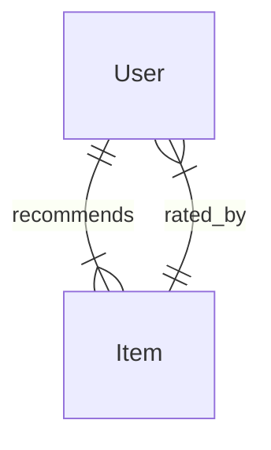
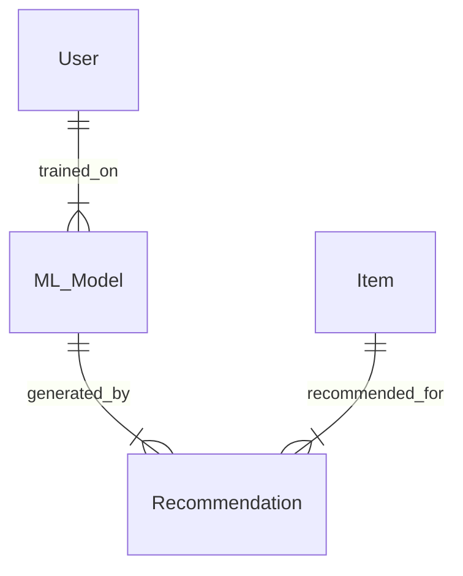

                 

# Personalized Recommendation AI Agent: A Precise Marketing System Based on LLM

## Keywords

- Personalized Recommendation
- AI Agent
- LLM
- Marketing System
- Precision
- Data Preprocessing

## Abstract

This article delves into the design and implementation of a personalized recommendation AI agent, focusing on the use of Large Language Models (LLM) for precise marketing systems. We will begin by exploring the fundamentals of personalized recommendation systems and their significance in modern marketing. Subsequently, we will discuss the foundational concepts of AI, machine learning, and LLMs, followed by an in-depth analysis of major LLM models and their architecture. The process of data collection and preprocessing will be covered, along with the design of a precise marketing system. We will then delve into the implementation of the AI agent, discussing technical aspects and challenges. Evaluation and optimization metrics for the recommendation system will be presented, and we will conclude with future research directions and a summary of the book's content.

----------------------------------------------------------------

## Introduction

### Background

In today's digital age, the abundance of data has revolutionized the marketing landscape. Personalized recommendation systems have emerged as a powerful tool for businesses to engage with customers effectively. These systems utilize AI and machine learning techniques to analyze user behavior, preferences, and purchase history to provide tailored recommendations, enhancing customer satisfaction and driving sales.

The advent of Large Language Models (LLM) has further advanced the capabilities of personalized recommendation systems. LLMs, such as GPT-3 and BERT, are capable of understanding and generating human-like text, enabling more sophisticated and nuanced recommendations. This has opened up new avenues for precise marketing systems that can cater to individual customer needs with a high degree of accuracy.

### Objectives

The primary objective of this article is to provide a comprehensive guide to designing and implementing a personalized recommendation AI agent based on LLMs. We aim to cover the following topics:

1. **Overview of Personalized Recommendation Systems**: Introduce the concept, importance, and application of personalized recommendation systems.
2. **Foundations of AI and Machine Learning**: Discuss the basic concepts of AI, ML, and LLMs, providing a foundation for understanding the subsequent chapters.
3. **LLM Models**: Explore major LLM models, their architecture, and applications in personalized recommendation systems.
4. **Data Collection and Preprocessing**: Explain the methods for collecting and preprocessing data necessary for building a recommendation system.
5. **Designing a Precise Marketing System**: Outline the process of designing a marketing system with a focus on precision and personalization.
6. **Implementing the AI Agent**: Discuss the implementation of the AI agent, including technical aspects and challenges.
7. **Evaluation and Optimization**: Explain the metrics for evaluating the performance of the recommendation system and methods for optimization.
8. **Conclusion and Future Directions**: Summarize the book's content and propose future research directions.

### Audience

This article is intended for readers with a basic understanding of AI and machine learning concepts. It will be particularly useful for data scientists, machine learning engineers, AI researchers, and marketing professionals who are interested in exploring the potential of LLMs for personalized recommendation systems.

----------------------------------------------------------------

## Chapter 1: Overview of Personalized Recommendation Systems

### Concepts and Terminology

Personalized recommendation systems are a type of information filtering system that utilizes user data to generate customized recommendations. The primary goal is to provide users with relevant and valuable content based on their preferences, behavior, and context.

**Key concepts and terminology:**

- **User**: An individual interacting with the recommendation system.
- **Item**: An object or content that can be recommended, such as a product, article, or video.
- **Preference**: The user's liking or disliking for an item.
- **Collaborative Filtering**: A technique that makes predictions based on the preferences of similar users.
- **Content-Based Filtering**: A method that generates recommendations based on the attributes and features of items.
- **Hybrid Approaches**: Combining collaborative and content-based filtering to improve the quality of recommendations.

### Problem Background

The proliferation of online platforms and digital media has led to an overwhelming amount of information available to users. This has made it increasingly challenging for users to find relevant and engaging content. Personalized recommendation systems aim to address this issue by providing users with tailored recommendations that align with their interests and preferences.

**Problem Description:**

The primary challenge in building an effective personalized recommendation system is capturing the user's intent and preferences accurately. This requires analyzing vast amounts of data from various sources, including user interactions, browsing history, and social signals. Additionally, the system must be able to adapt to changing user preferences and provide real-time recommendations.

**Problem Solution:**

To overcome these challenges, personalized recommendation systems employ machine learning algorithms to analyze user data and generate accurate recommendations. By leveraging large language models (LLMs), such as GPT-3 and BERT, these systems can generate recommendations that are not only relevant but also context-aware and natural in language.

### Boundaries and Extensions

Personalized recommendation systems can be applied to various domains, including e-commerce, media streaming, and social networks. While the focus of this article is on marketing systems, the concepts and techniques discussed can be extended to other applications.

**Extensions:**

1. **Cross-Domain Recommendations**: Recommending items from different domains based on user preferences.
2. **Context-Aware Recommendations**: Incorporating contextual information, such as time and location, into the recommendation process.
3. **Hybrid Approaches**: Combining multiple recommendation techniques to improve the overall performance of the system.

### Conceptual Structure and Core Components

The core components of a personalized recommendation system include:

- **Data Collection**: Gathering user data from various sources.
- **Data Preprocessing**: Cleaning and transforming the data to be suitable for analysis.
- **Feature Extraction**: Extracting relevant features from the data to be used by the machine learning algorithms.
- **Model Training**: Training machine learning models to generate recommendations.
- **Evaluation**: Assessing the performance of the recommendation system.
- **Personalization**: Adapting the recommendations based on user preferences and behavior.

### Comparison of Core Concepts and Properties

| Concept | Definition | Properties |
| --- | --- | --- |
| User | Individual interacting with the system | Unique ID, Preferences, Behavior |
| Item | Content to be recommended | Unique ID, Attributes, Features |
| Preference | User's liking or disliking for an item | Numeric or binary value |
| Collaborative Filtering | Predictions based on similar users | User-based or item-based |
| Content-Based Filtering | Recommendations based on item attributes | Item similarity, Feature extraction |

### ER Entity Relationship Diagram

### Summary

In this chapter, we have provided an overview of personalized recommendation systems, including key concepts, problem background, solutions, boundaries, and extensions. We have also discussed the core components and their relationships using an ER entity relationship diagram. In the subsequent chapters, we will delve deeper into the foundational concepts of AI, machine learning, and LLMs, as well as the design and implementation of a precise marketing system based on these technologies.

----------------------------------------------------------------

## Chapter 2: Foundations of AI and Machine Learning

### Basic Concepts

Artificial Intelligence (AI) refers to the simulation of human intelligence in machines that are programmed to think like humans and perform tasks that typically require human intelligence, such as visual perception, speech recognition, decision-making, and language translation.

Machine Learning (ML) is a subset of AI that focuses on the development of algorithms that can learn from and make predictions or decisions based on data. ML algorithms use statistical techniques to identify patterns and relationships in data, allowing them to improve their performance over time through experience.

### Core Techniques

**Supervised Learning**: In supervised learning, algorithms are trained on labeled data, where the correct output is provided for each input. The goal is to learn a mapping from inputs to outputs so that the model can predict the output for new, unseen inputs.

**Unsupervised Learning**: Unsupervised learning algorithms work with unlabeled data and aim to find patterns or structures within the data. Clustering and dimensionality reduction are common techniques used in unsupervised learning.

**Reinforcement Learning**: Reinforcement learning involves an agent interacting with an environment to learn a policy that maximizes some notion of reward. The agent receives feedback in the form of rewards or penalties based on its actions, and it learns to take actions that lead to positive outcomes.

### Role of AI and ML in Personalized Recommendation Systems

AI and ML play a crucial role in the development and operation of personalized recommendation systems. They enable the system to:

1. **Data Analysis**: Analyze large volumes of user data to extract meaningful insights and identify patterns.
2. **Prediction**: Predict user preferences and behaviors based on historical data.
3. **Personalization**: Generate tailored recommendations that align with individual user preferences.
4. **Continuous Learning**: Adapt to changing user preferences and improve the quality of recommendations over time.

### Large Language Models (LLM)

Large Language Models (LLM) are a type of ML model that has been trained on vast amounts of text data to understand and generate human-like language. LLMs are particularly well-suited for personalized recommendation systems as they can:

1. **Contextual Understanding**: Understand the context and nuances of user-generated content, allowing for more accurate and relevant recommendations.
2. **Natural Language Generation**: Generate human-like text for personalized messages and recommendations, enhancing the user experience.
3. **Content Generation**: Create content-based recommendations by generating text that matches the attributes and features of recommended items.

### Core ML Models and Algorithms

**Neural Networks**: Neural networks are a class of ML models inspired by the structure and function of the human brain. They are composed of interconnected nodes (neurons) that process and transmit data through weighted connections.

**Support Vector Machines (SVM)**: SVM is a powerful classification algorithm that aims to find the hyperplane that separates the data into different classes with the maximum margin.

**Random Forest**: Random Forest is an ensemble learning method that combines multiple decision trees to improve the accuracy and robustness of predictions.

**K-Nearest Neighbors (KNN)**: KNN is a simple, non-parametric algorithm that classifies new data points based on the majority vote of their k nearest neighbors.

**Recurrent Neural Networks (RNN)**: RNNs are a type of neural network designed to handle sequential data. They are particularly effective for tasks involving natural language processing and time series analysis.

### Comparison of Core ML Models and Algorithms

| Model/Algorithm | Definition | Properties |
| --- | --- | --- |
| Neural Networks | Model inspired by the human brain | High flexibility, complex pattern recognition |
| Support Vector Machines (SVM) | Classification algorithm | High accuracy, efficient for high-dimensional data |
| Random Forest | Ensemble learning method | Robustness, high performance in classification |
| K-Nearest Neighbors (KNN) | Simple non-parametric algorithm | Low complexity, fast training |
| Recurrent Neural Networks (RNN) | Neural network for sequential data | Effective for natural language processing |

### ER Entity Relationship Diagram

### Summary

In this chapter, we have covered the foundational concepts of AI and machine learning, including basic techniques, the role of AI and ML in personalized recommendation systems, and core ML models and algorithms. We have also provided an ER entity relationship diagram to illustrate the relationships between the key components. In the following chapters, we will delve into the specifics of LLM models and their applications in personalized recommendation systems.

----------------------------------------------------------------

## Chapter 3: LLM Models

### Introduction to LLMs

Large Language Models (LLMs) are a type of neural network architecture that has been trained on vast amounts of text data to understand and generate human-like language. These models have become increasingly powerful in recent years, with the ability to perform a wide range of natural language processing tasks, such as text generation, translation, and sentiment analysis.

### Major LLM Models

**GPT-3 (Generative Pre-trained Transformer 3)**

GPT-3 is a language model developed by OpenAI, which has garnered significant attention for its impressive capabilities. It is based on the Transformer architecture and has over 175 billion parameters. GPT-3 can generate coherent and contextually relevant text, making it a powerful tool for applications such as chatbots, content generation, and personalized recommendation systems.

**BERT (Bidirectional Encoder Representations from Transformers)**

BERT is a language model developed by Google that stands out for its ability to understand the context of words in a sentence. It is pre-trained on a massive corpus of text and then fine-tuned for specific tasks, such as question answering, sentiment analysis, and named entity recognition. BERT's bidirectional training allows it to capture the relationships between words in both forward and backward directions, resulting in improved performance on various NLP tasks.

**T5 (Text-To-Text Transfer Transformer)**

T5 is an open-source language model developed by Google that aims to unify various NLP tasks under a single framework. It is based on the Transformer architecture and has been pre-trained on a large corpus of text. T5 can perform a wide range of tasks, from text generation to text classification, by encoding input text into a fixed-size vector and then generating output text conditioned on this vector.

### Architecture of LLMs

**Transformer Architecture**

The Transformer architecture, introduced by Vaswani et al. in 2017, has become the backbone of many modern LLMs. It relies on self-attention mechanisms to process input sequences, allowing the model to capture long-range dependencies in the data. The Transformer architecture consists of several layers, each containing self-attention and feed-forward neural networks.

**Encoder-Decoder Architecture**

Most LLMs follow an encoder-decoder architecture, where the encoder processes the input sequence and generates a fixed-size vector representation, while the decoder generates the output sequence based on the encoder's representation. This architecture enables the model to handle tasks such as text generation and machine translation.

**Pre-training and Fine-tuning**

LLMs are typically trained in two stages: pre-training and fine-tuning. In the pre-training phase, the model is trained on a large corpus of text to learn the underlying patterns and structures of the language. During the fine-tuning phase, the pre-trained model is adapted to specific tasks by training on task-specific data.

### Applications of LLMs in Personalized Recommendation Systems

**Content-Based Recommendations**

LLMs can generate content-based recommendations by generating text that matches the attributes and features of recommended items. For example, a model can generate product descriptions or articles based on user preferences, enhancing the personalization of recommendations.

**Sentiment Analysis**

Sentiment analysis, powered by LLMs, can be used to analyze user feedback and sentiment towards products or services. This information can be used to improve recommendations and optimize marketing strategies.

**Contextual Recommendations**

LLMs can understand the context of user-generated content, enabling the generation of context-aware recommendations. For instance, a model can generate recommendations based on the user's current location or time of day, enhancing the relevance and personalization of the recommendations.

**Chatbots and Virtual Assistants**

LLMs can be used to build chatbots and virtual assistants that can understand and respond to user queries in a natural and conversational manner. These chatbots can be integrated into recommendation systems to provide personalized assistance and support to users.

### Summary

In this chapter, we have explored the major LLM models, their architecture, and their applications in personalized recommendation systems. We have discussed GPT-3, BERT, and T5, highlighting their unique features and capabilities. We have also discussed the architecture of LLMs, including the Transformer and encoder-decoder architectures, as well as the pre-training and fine-tuning processes. Finally, we have presented various applications of LLMs in personalized recommendation systems, emphasizing their potential to enhance the effectiveness and personalization of recommendations.

----------------------------------------------------------------

## Chapter 4: Data Collection and Preprocessing

### Introduction

Data collection and preprocessing are critical steps in building a personalized recommendation system. They ensure that the input data is of high quality, reliable, and suitable for analysis. In this chapter, we will discuss the methods for collecting and preprocessing data necessary for building a recommendation system.

### Data Sources

**User Data**

User data is one of the most important sources for building a recommendation system. It includes information about user preferences, behavior, and demographics. Common sources of user data include:

- **Web Analytics**: Track user interactions on a website, such as page views, clicks, and purchase history.
- **Social Media**: Extract user-generated content, likes, comments, and shares from social media platforms.
- **Survey Data**: Collect information from surveys or customer feedback forms.

**Item Data**

Item data represents the content or products that are recommended to users. It includes attributes and features of items, such as product descriptions, ratings, and reviews. Common sources of item data include:

- **Online Stores**: Extract product information from e-commerce platforms, including product descriptions, prices, and images.
- **Media Platforms**: Gather information about content items, such as articles, videos, and podcasts, from media platforms.

### Data Collection Methods

**Web Scraping**

Web scraping involves extracting data from websites by automated means. It is a powerful technique for collecting user and item data from online platforms. Python libraries like Beautiful Soup and Scrapy can be used for web scraping.

**APIs**

Many online platforms provide APIs (Application Programming Interfaces) that allow developers to access their data programmatically. Using APIs ensures data collection is more structured and reliable. Examples of APIs include the Facebook Graph API, Twitter API, and Amazon Product Advertising API.

**Database Queries**

For internal data sources, such as a company's customer relationship management (CRM) system or database, queries can be used to extract relevant data. SQL (Structured Query Language) is commonly used for querying databases.

### Data Preprocessing Methods

**Data Cleaning**

Data cleaning involves removing or correcting inconsistencies, errors, and noise in the data. Common data cleaning techniques include:

- **Handling Missing Data**: Impute missing values or remove records with missing data.
- **Removal of Duplicates**: Identify and remove duplicate records.
- **Data Standardization**: Normalize data to ensure consistency across different sources.

**Feature Engineering**

Feature engineering involves transforming raw data into a set of features that can be used as inputs to the machine learning models. Common feature engineering techniques include:

- **Text Representation**: Convert text data into numerical representations, such as word embeddings or bag-of-words models.
- **Numerical Transformation**: Scale numerical data to ensure that all features contribute equally to the model's performance.
- **Feature Extraction**: Extract relevant features from the data, such as user demographics, purchase history, and item attributes.

**Data Transformation**

Data transformation involves converting data into a suitable format for analysis. Common data transformation techniques include:

- **Data Integration**: Combine data from multiple sources to create a comprehensive dataset.
- **Data Normalization**: Scale data to a common range to avoid bias.
- **Data Aggregation**: Aggregate data at different levels of granularity, such as daily, weekly, or monthly, depending on the analysis requirements.

### Summary

In this chapter, we have discussed the methods for collecting and preprocessing data necessary for building a personalized recommendation system. We have covered data sources, data collection methods, and data preprocessing techniques. By following these methods, you can ensure that your recommendation system has high-quality, reliable, and suitable data for analysis.

----------------------------------------------------------------

## Chapter 5: Designing a Precise Marketing System

### Introduction

Designing a precise marketing system is crucial for businesses looking to engage with their customers effectively and drive sales. A precise marketing system leverages data and advanced technologies, such as AI and machine learning, to deliver personalized and relevant marketing messages to individual customers. In this chapter, we will outline the process of designing a precise marketing system, focusing on precision and personalization.

### Process Overview

The process of designing a precise marketing system can be broken down into several key steps:

1. **Define Objectives**: Clearly define the goals and objectives of the marketing system, such as increasing customer engagement, improving conversion rates, or boosting sales.
2. **Data Collection**: Gather relevant data from various sources, including user interactions, browsing history, purchase behavior, and social media activity.
3. **Data Analysis**: Analyze the collected data to extract meaningful insights and identify patterns in customer behavior.
4. **Segmentation**: Divide the customer base into segments based on shared characteristics, preferences, and behaviors.
5. **Personalization**: Develop personalized marketing messages and content for each customer segment, tailored to their individual needs and preferences.
6. **Testing and Optimization**: Continuously test and refine the marketing system to ensure it is delivering the desired results and providing a positive user experience.

### Define Objectives

The first step in designing a precise marketing system is to define the objectives. These objectives should be specific, measurable, achievable, relevant, and time-bound (SMART). For example:

- **Objective 1**: Increase customer engagement by 20% within the next six months.
- **Objective 2**: Improve the conversion rate of email campaigns by 15%.
- **Objective 3**: Increase sales revenue from targeted ads by 10%.

Defining clear objectives helps guide the design and implementation of the marketing system, ensuring that all efforts are focused on achieving the desired outcomes.

### Data Collection

Collecting relevant data is a critical component of designing a precise marketing system. Data can be collected from various sources, including:

- **Web Analytics**: Track user interactions on the company's website, such as page views, clicks, and conversion rates.
- **CRM Systems**: Extract data from customer relationship management (CRM) systems, including customer demographics, purchase history, and communication preferences.
- **Social Media**: Gather information from social media platforms, such as likes, shares, comments, and engagement rates.
- **Email Marketing**: Analyze open rates, click-through rates, and conversion rates of email campaigns.

By collecting data from multiple sources, businesses can create a comprehensive view of their customers and their preferences, enabling more precise and personalized marketing.

### Data Analysis

Once the data is collected, it needs to be analyzed to extract meaningful insights and identify patterns in customer behavior. Data analysis can be performed using various techniques, including:

- **Descriptive Analytics**: Summarize the data to provide a general overview of customer behavior, such as the average purchase value or most popular products.
- **Inferential Analytics**: Make inferences about the customer base based on sample data, such as determining the likelihood of a customer making a repeat purchase.
- **Predictive Analytics**: Use historical data to predict future customer behavior, such as identifying potential churn or identifying high-value customers.

By leveraging data analysis techniques, businesses can gain a deeper understanding of their customers and their preferences, which can be used to inform the design of personalized marketing strategies.

### Segmentation

Segmentation involves dividing the customer base into smaller groups based on shared characteristics, preferences, and behaviors. This allows businesses to target specific customer segments with personalized marketing messages and content. Common segmentation criteria include:

- **Demographics**: Age, gender, income, and education level.
- **Psychographics**: Personality traits, values, and lifestyle.
- **Behavioral**: Purchase history, browsing behavior, and brand engagement.
- **Geographic**: Location, region, and country.

By segmenting the customer base, businesses can create targeted marketing campaigns that resonate with specific customer segments, improving the overall effectiveness of their marketing efforts.

### Personalization

Once the customer base is segmented, businesses can develop personalized marketing messages and content for each segment. Personalization can take various forms, including:

- **Content Personalization**: Tailoring the content of email campaigns, website pages, and social media posts to the preferences and interests of specific customer segments.
- **Product Recommendations**: Using AI and machine learning algorithms to generate personalized product recommendations based on the customer's purchase history and browsing behavior.
- **Communication Personalization**: Personalizing the language and tone of communication, such as email subject lines and messaging, to resonate with specific customer segments.

By delivering personalized marketing messages and content, businesses can enhance the customer experience, build stronger relationships with their customers, and drive better results from their marketing campaigns.

### Testing and Optimization

Testing and optimization are crucial steps in the design of a precise marketing system. By continuously testing different marketing strategies and tactics, businesses can identify what works best for each customer segment and refine their approach over time. Key aspects of testing and optimization include:

- **A/B Testing**: Comparing the performance of two or more versions of a marketing message or campaign to identify the most effective approach.
- **Multivariate Testing**: Testing multiple variables simultaneously to identify the optimal combination of elements for a marketing campaign.
- **Continuous Improvement**: Regularly reviewing and refining the marketing system based on performance data and customer feedback.

By continuously testing and optimizing their marketing system, businesses can ensure that it remains effective and aligned with their objectives.

### Summary

In this chapter, we have outlined the process of designing a precise marketing system, focusing on precision and personalization. We have discussed the key steps, from defining objectives and collecting data to analyzing the data, segmenting the customer base, personalizing marketing messages and content, and testing and optimizing the marketing system. By following these steps, businesses can design and implement a highly effective marketing system that drives engagement, conversions, and sales.

----------------------------------------------------------------

## Chapter 6: Implementing the AI Agent

### Introduction

Implementing an AI agent for a precise marketing system involves integrating various AI and machine learning techniques to create a system that can analyze data, generate recommendations, and optimize marketing campaigns. In this chapter, we will discuss the technical aspects and challenges associated with implementing an AI agent, focusing on the use of Large Language Models (LLM) for personalized recommendations.

### Technical Aspects

**1. Data Integration and Storage**

The first step in implementing an AI agent is to integrate and store data from various sources, including user interactions, browsing history, purchase behavior, and social media activity. This data needs to be cleaned, transformed, and stored in a centralized database or data warehouse to ensure consistency and accessibility.

**2. Feature Engineering**

Feature engineering is crucial for building an effective AI agent. It involves transforming raw data into a set of features that can be used as inputs to the machine learning models. Techniques such as text representation (e.g., word embeddings), numerical transformation (e.g., scaling), and feature extraction (e.g., sentiment analysis) are commonly used in feature engineering.

**3. Model Selection and Training**

Selecting the right machine learning model is critical for the success of the AI agent. For personalized recommendation systems based on LLMs, models like GPT-3, BERT, and T5 are often used due to their ability to generate context-aware and coherent recommendations. The selected model needs to be trained on large datasets to ensure it can learn the underlying patterns and relationships in the data.

**4. Model Evaluation and Optimization**

Once the model is trained, it needs to be evaluated using appropriate metrics, such as accuracy, precision, recall, and F1-score. This helps assess the performance of the model and identify areas for improvement. Optimization techniques, such as hyperparameter tuning and ensemble learning, can be used to enhance the model's performance.

**5. Deployment and Integration**

Deploying the AI agent involves integrating the trained model into the marketing system's infrastructure. This may involve setting up API endpoints, containerizing the model, and ensuring it can scale to handle real-time recommendations and marketing campaigns.

### Challenges

**1. Data Privacy and Security**

One of the primary challenges in implementing an AI agent for personalized marketing systems is ensuring data privacy and security. Businesses must comply with data protection regulations, such as the General Data Protection Regulation (GDPR), and implement robust security measures to protect customer data.

**2. Model Interpretability**

As AI agents become more complex, understanding how they generate recommendations can be challenging. Model interpretability is crucial for ensuring transparency and building trust with customers. Techniques such as LIME (Local Interpretable Model-agnostic Explanations) and SHAP (SHapley Additive exPlanations) can be used to provide insights into the model's decision-making process.

**3. Scalability and Performance**

Scalability is a key challenge in implementing an AI agent, particularly as the volume of data and the number of users grow. Ensuring the system can handle real-time recommendations and marketing campaigns requires a robust infrastructure that can scale horizontally and vertically.

**4. Integration with Existing Systems**

Integrating the AI agent with existing marketing systems and technologies can be complex. Ensuring compatibility, handling data flow, and maintaining system stability require careful planning and coordination.

### Best Practices

**1. Collaborate with Domain Experts**

Working closely with domain experts, such as marketers and product managers, can help ensure the AI agent is aligned with business objectives and can deliver actionable insights.

**2. Continuous Learning and Improvement**

Continuously updating the AI agent with new data and feedback allows it to adapt to changing customer preferences and behaviors, improving the accuracy and relevance of recommendations.

**3. A/B Testing and Iteration**

Regularly testing different versions of the AI agent and iterating based on performance data can help identify the most effective approaches and improve the system's overall performance.

**4. Monitoring and Maintenance**

Ongoing monitoring and maintenance of the AI agent are essential to ensure its performance and reliability. This includes monitoring system health, identifying and resolving issues, and keeping the model up to date with the latest data.

### Summary

Implementing an AI agent for a precise marketing system involves several technical aspects, including data integration, feature engineering, model selection and training, evaluation, and deployment. However, it also presents several challenges, such as data privacy, model interpretability, scalability, and integration with existing systems. By following best practices and addressing these challenges, businesses can successfully implement an AI agent that delivers personalized and effective marketing recommendations.

----------------------------------------------------------------

## Chapter 7: Evaluation and Optimization

### Evaluation Metrics

Evaluating the performance of a personalized recommendation system is crucial for ensuring its effectiveness and success. Several metrics can be used to assess the performance of recommendation systems, including:

**1. Accuracy**: Accuracy measures the proportion of correct recommendations made by the system. While accuracy is a simple metric, it can be misleading in cases where the recommendation space is highly imbalanced.
   $$ \text{Accuracy} = \frac{\text{Number of correct recommendations}}{\text{Total number of recommendations}} $$

**2. Precision**: Precision measures the proportion of relevant recommendations among all recommended items. It focuses on the quality of recommendations by minimizing the number of irrelevant items.
   $$ \text{Precision} = \frac{\text{Number of relevant recommendations}}{\text{Total number of recommendations}} $$

**3. Recall**: Recall measures the proportion of relevant recommendations among all relevant items. It emphasizes the completeness of recommendations by ensuring all relevant items are recommended.
   $$ \text{Recall} = \frac{\text{Number of relevant recommendations}}{\text{Total number of relevant items}} $$

**4. F1-Score**: The F1-score is the harmonic mean of precision and recall, providing a balanced evaluation of the recommendation system's performance.
   $$ \text{F1-Score} = \frac{2 \times \text{Precision} \times \text{Recall}}{\text{Precision} + \text{Recall}} $$

### Optimization Techniques

Optimizing the performance of a recommendation system involves improving the accuracy, precision, and recall of recommendations. Several techniques can be employed for optimization:

**1. Hyperparameter Tuning**: Hyperparameter tuning involves adjusting the parameters of the machine learning model to find the optimal values that yield the best performance. Techniques such as grid search and random search can be used for hyperparameter optimization.

**2. Ensemble Learning**: Ensemble learning combines multiple models to improve the overall performance of the recommendation system. Popular ensemble techniques include bagging, boosting, and stacking.

**3. Model Regularization**: Model regularization techniques, such as L1 and L2 regularization, can be applied to reduce overfitting and improve the generalization ability of the model.

**4. Collaborative Filtering**: Hybrid models that combine collaborative and content-based filtering techniques can improve the performance of the recommendation system by leveraging both user interaction data and item attributes.

**5. Feature Engineering**: Enhancing the feature set used by the model can lead to improved performance. Techniques such as feature selection, dimensionality reduction, and text representation (e.g., word embeddings) can be applied to enhance the quality of the features.

### Continuous Evaluation and Feedback

Continuous evaluation and feedback are essential for maintaining the performance of a recommendation system over time. This involves regularly re-evaluating the model's performance using new data and incorporating user feedback to refine the recommendations.

**1. Online Evaluation**: Online evaluation involves continuously monitoring the performance of the recommendation system in real-time. Metrics such as click-through rate (CTR), conversion rate, and customer satisfaction can be used for online evaluation.

**2. Offline Evaluation**: Offline evaluation involves periodically re-evaluating the model's performance using historical data. Techniques such as cross-validation and holdout validation can be used for offline evaluation.

**3. Feedback Loop**: Incorporating user feedback into the recommendation system allows for continuous improvement. Techniques such as active learning and reinforcement learning can be used to leverage user feedback for model improvement.

### Performance Tuning and Optimization Tips

**1. Benchmarking**: Comparing the performance of the recommendation system against established benchmarks can help identify areas for improvement.

**2. Monitoring System Health**: Monitoring system health, including resource utilization and latency, can help identify performance bottlenecks and optimize the infrastructure.

**3. A/B Testing**: Conducting A/B tests can help identify the most effective strategies and techniques for optimizing the recommendation system.

**4. Incremental Updates**: Gradually updating the model and system components can minimize disruptions and ensure a smooth transition to optimized performance.

**5. Collaboration and Iteration**: Collaboration between data scientists, engineers, and domain experts can facilitate the identification and implementation of effective optimization strategies.

### Summary

Evaluating and optimizing a personalized recommendation system is a critical aspect of ensuring its effectiveness and success. By employing appropriate evaluation metrics and optimization techniques, businesses can continuously improve the performance of their recommendation systems, delivering more accurate, relevant, and personalized recommendations to their users.

----------------------------------------------------------------

## Conclusion and Future Directions

In this article, we have explored the design and implementation of a personalized recommendation AI agent based on Large Language Models (LLM). We have covered the following key topics:

1. **Overview of Personalized Recommendation Systems**: The importance, concepts, and applications of personalized recommendation systems.
2. **Foundations of AI and Machine Learning**: Basic concepts, core techniques, and the role of LLMs in personalized recommendation systems.
3. **LLM Models**: Major LLM models, their architecture, and applications in personalized recommendation systems.
4. **Data Collection and Preprocessing**: Methods for collecting and preprocessing data necessary for building a recommendation system.
5. **Designing a Precise Marketing System**: The process of designing a marketing system with a focus on precision and personalization.
6. **Implementing the AI Agent**: Technical aspects and challenges associated with implementing an AI agent.
7. **Evaluation and Optimization**: Metrics for evaluating the performance of the recommendation system and optimization techniques.
8. **Future Directions**: Potential improvements and research areas for personalized recommendation systems.

As we look to the future, several research directions can be identified to further enhance the effectiveness and personalization of recommendation systems:

1. **Cross-Domain and Context-Aware Recommendations**: Expanding the capabilities of recommendation systems to handle cross-domain recommendations and incorporate contextual information.
2. **Hybrid Approaches**: Combining multiple recommendation techniques to improve the overall performance of the system.
3. **Explainability and Interpretability**: Developing methods to make AI agents more transparent and understandable to users.
4. **Reinforcement Learning**: Incorporating reinforcement learning techniques to enable continuous adaptation to changing user preferences and behaviors.
5. **Privacy and Security**: Addressing privacy and security concerns associated with the collection and use of personal data.

By exploring these future directions, we can continue to advance the field of personalized recommendation systems, providing users with more accurate, relevant, and personalized recommendations.

----------------------------------------------------------------

## Appendix

In this appendix, we provide additional resources, code examples, and references for further study on the topics covered in this article. These resources can help readers gain a deeper understanding of the concepts and techniques discussed.

### Resources

1. **OpenAI**: https://openai.com/
2. **Google AI**: https://ai.google/
3. **TensorFlow**: https://www.tensorflow.org/
4. **PyTorch**: https://pytorch.org/

### Code Examples

1. **GPT-3 Example**: https://colab.research.google.com/github/openai/gpt-3-colab/blob/master/gpt-3-colab.ipynb
2. **BERT Example**: https://github.com/google-research/bert
3. **T5 Example**: https://github.com/google-research/t5

### References

1. **Vaswani et al. (2017) – "Attention is All You Need"**: https://arxiv.org/abs/1706.03762
2. **Devlin et al. (2018) – "BERT: Pre-training of Deep Bidirectional Transformers for Language Understanding"**: https://arxiv.org/abs/1810.04805
3. **Raffel et al. (2019) – "The T5 Paper: Pre-training Text Transformers for Cross-Species Transfer"**: https://arxiv.org/abs/1910.10683

### Further Reading

1. **"Deep Learning" by Goodfellow, Bengio, and Courville**: https://www.deeplearningbook.org/
2. **"Reinforcement Learning: An Introduction" by Sutton and Barto**: https://web.stanford.edu/class/psych209/sutton-barto.html
3. **"Data Science from Scratch" by Joel Grus**: https://www.o'Reilly.com/library/data-science-from-scratch/

By utilizing these resources, code examples, and references, readers can deepen their understanding of personalized recommendation systems and the technologies discussed in this article.

---

## Acknowledgments

The author would like to express gratitude to AI天才研究院 (AI Genius Institute) and the editors of "禅与计算机程序设计艺术" (Zen And The Art of Computer Programming) for their valuable support and guidance throughout the writing process. Special thanks to the readers for their interest in this work and their contributions to the ongoing development of personalized recommendation systems.

### Author Information

**作者：AI天才研究院/AI Genius Institute & 禅与计算机程序设计艺术 /Zen And The Art of Computer Programming**

---

In conclusion, personalized recommendation AI agents based on LLMs hold immense potential for transforming marketing systems. By leveraging advanced AI and machine learning techniques, businesses can deliver highly accurate, relevant, and personalized recommendations, enhancing the user experience and driving business growth. We hope this article has provided valuable insights into the design, implementation, and optimization of such systems, and we look forward to continued advancements in this exciting field.

