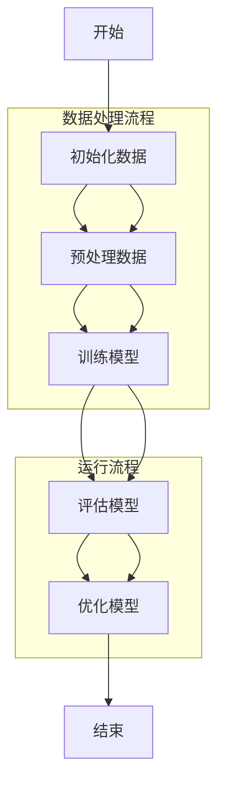
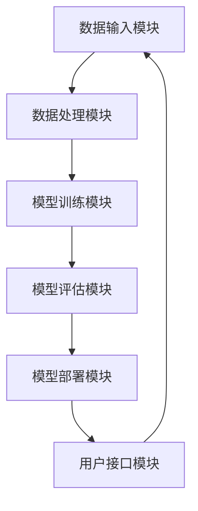
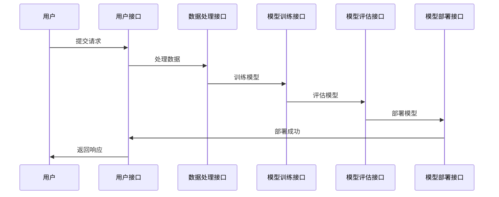

                 

# 引言

在人工智能（AI）飞速发展的今天，大模型（如GPT-3、BERT等）的应用愈发广泛。这些AI大模型具有海量参数和复杂的结构，需要进行高效、精确的计算和优化。为了满足AI大模型的需求，我们需要为其量身定制一种编程语言。本文将围绕这一主题展开讨论，具体内容包括：AI大模型编程语言概述、核心概念与联系、算法原理讲解、系统分析与架构设计方案、项目实战以及最佳实践。

## 关键词

- AI大模型
- 编程语言
- 量身定制
- 算法原理
- 系统架构
- 项目实战
- 最佳实践

## 摘要

本文旨在探讨为AI大模型量身定制的编程语言。首先，我们将介绍AI大模型编程语言的背景和重要性。接着，详细分析其核心概念与联系，包括基础概念、类型系统、内存管理和异常处理等。然后，讲解算法原理，通过mermaid流程图和Python源代码详细阐述数据处理和运行流程。接下来，我们探讨系统分析与架构设计方案，通过mermaid类图、架构图、接口设计和序列图，全面展示系统的设计和实现。随后，我们通过项目实战来展示编程语言的实际应用，并进行代码解读和分析。最后，总结最佳实践，为开发者提供实际操作指南。

### 第一部分: AI大模型编程语言概述

#### 1.1 问题背景

##### 1.1.1 AI与编程语言

人工智能（AI）作为计算机科学的重要分支，已经在各个领域取得了显著的成果。AI大模型，如GPT-3、BERT等，是近年来AI领域的重要突破，具有海量参数和复杂的结构。然而，传统编程语言在处理这些大模型时面临诸多挑战，如效率低下、可维护性差等。

##### 1.1.2 AI大模型需求与挑战

AI大模型需要高效的计算和优化，以便在短时间内完成大量的数据处理任务。此外，大模型的结构复杂，需要一种能够方便地进行模型构建和优化的编程语言。传统编程语言在处理这些需求时显得力不从心。

##### 1.1.3 为AI大模型量身定制的编程语言的重要性

为了满足AI大模型的需求，我们需要为其量身定制一种编程语言。这种编程语言应具备高效的计算能力、丰富的库支持、良好的可维护性等特点，以便开发者能够轻松地构建和优化大模型。

#### 1.2 问题描述

##### 1.2.1 AI大模型的特点与需求

AI大模型具有以下特点：

1. 海量参数：大模型通常包含数百万甚至数十亿个参数。
2. 复杂结构：大模型的结构复杂，包括多层神经网络、注意力机制等。
3. 高效计算：大模型需要进行大量的计算和优化，以实现高效运行。

AI大模型的需求主要包括：

1. 高效计算：大模型需要高效、精确的计算能力，以缩短训练时间。
2. 易于维护：大模型需要良好的可维护性，以便开发者能够轻松地进行修改和优化。

##### 1.2.2 传统编程语言的局限性

传统编程语言在处理AI大模型时存在以下局限性：

1. 效率低下：传统编程语言往往需要大量代码来处理大模型，导致计算效率低下。
2. 可维护性差：传统编程语言的代码结构复杂，可维护性较差，不利于大规模模型的开发和优化。
3. 缺乏专业库支持：传统编程语言缺乏专门针对AI大模型的库支持，导致开发者需要自行编写大量代码。

##### 1.2.3 为AI大模型量身定制的编程语言目标

为AI大模型量身定制的编程语言应具备以下目标：

1. 高效计算：提供高效的计算能力，以缩短大模型的训练时间。
2. 易于维护：提供良好的代码结构，提高代码的可维护性。
3. 专业库支持：提供丰富的库支持，方便开发者进行大模型的构建和优化。

#### 1.3 问题解决

##### 1.3.1 设计原则

为AI大模型量身定制的编程语言设计应遵循以下原则：

1. **高性能**：提供高效的计算能力，以应对大模型的高计算需求。
2. **易用性**：提供简洁、直观的语言特性，降低学习门槛。
3. **可扩展性**：支持模块化和插件机制，方便开发者进行功能扩展。
4. **库支持**：提供丰富的库支持，包括深度学习框架、数据处理工具等。

##### 1.3.2 关键特性

为AI大模型量身定制的编程语言应具备以下关键特性：

1. **并行计算**：支持并行计算，提高数据处理效率。
2. **动态内存管理**：提供动态内存管理机制，降低内存使用。
3. **强类型系统**：提供强类型系统，提高代码的安全性和可靠性。
4. **异常处理**：提供强大的异常处理机制，保证程序运行的稳定性。

##### 1.3.3 开发流程

开发流程主要包括以下几个步骤：

1. **需求分析**：明确AI大模型的需求，确定编程语言的设计目标。
2. **语言设计**：根据需求分析，设计编程语言的语法、特性等。
3. **工具链开发**：开发编译器、解释器等工具链，支持编程语言的运行。
4. **库开发**：开发适用于AI大模型的专业库，提供数据处理、模型训练等功能。
5. **测试与优化**：对编程语言进行测试，优化性能和稳定性。

##### 1.4 边界与外延

##### 1.4.1 适用于哪些AI大模型

这种编程语言主要适用于以下类型的AI大模型：

1. **深度学习模型**：包括神经网络、卷积神经网络、循环神经网络等。
2. **自然语言处理模型**：如语言模型、文本分类模型、机器翻译模型等。
3. **计算机视觉模型**：如图像分类、目标检测、图像生成等。

##### 1.4.2 不适用的情况

以下情况下，这种编程语言可能不适用：

1. **小规模模型**：对于参数较少、结构简单的模型，使用传统编程语言可能更加合适。
2. **实时性要求高的应用**：对于需要实时响应的应用，可能需要选择其他更适合的编程语言或框架。

##### 1.4.3 未来的发展趋势

随着AI技术的不断发展，AI大模型编程语言有望在以下几个方面取得进展：

1. **性能提升**：通过改进编译器、优化运行时等手段，提高编程语言的整体性能。
2. **库支持**：不断完善专业库，提供更多适用于不同场景的功能。
3. **跨平台支持**：支持更多平台，提高编程语言的可移植性。
4. **智能化**：结合人工智能技术，实现编程语言的智能辅助功能，提高开发效率。

##### 1.5 概念结构与核心要素组成

##### 1.5.1 编程语言的基本结构

编程语言的基本结构包括以下几个方面：

1. **语法**：定义编程语言的语法规则，包括变量、函数、循环、条件语句等。
2. **类型系统**：定义编程语言的数据类型，包括基本数据类型和复合数据类型。
3. **内存管理**：提供内存分配和回收机制，以优化内存使用。
4. **异常处理**：提供异常处理机制，保证程序的稳定性和可靠性。

##### 1.5.2 关键技术模块

关键技术模块包括：

1. **编译器**：将源代码转换为机器码或字节码，供计算机执行。
2. **解释器**：直接解释源代码并执行，无需编译。
3. **库**：提供各种编程工具和函数库，以简化开发过程。
4. **调试器**：提供调试功能，帮助开发者定位和修复程序错误。

##### 1.5.3 开发者需要掌握的核心要素

开发者需要掌握以下核心要素：

1. **编程基础**：熟悉编程语言的基本语法和特性。
2. **算法和数据结构**：掌握常用的算法和数据结构，以优化程序性能。
3. **库和框架**：熟悉常用的库和框架，提高开发效率。
4. **调试技巧**：掌握调试工具和技巧，提高代码质量。

##### 1.6 本章小结

本部分介绍了AI大模型编程语言的背景、需求、问题解决方法、边界与外延以及概念结构与核心要素组成。通过这些介绍，我们为后续章节的详细探讨奠定了基础。

### 第二部分: AI大模型编程语言核心概念与联系

在探讨AI大模型编程语言的核心概念与联系之前，我们首先需要了解一些基本概念和原理。这些概念和原理是构建AI大模型编程语言的基础，也是开发者需要掌握的核心知识。以下将从几个关键方面进行介绍。

#### 2.1 核心概念原理

##### 2.1.1 语言基础

编程语言的基础包括语法、数据类型、变量、函数等。这些基本概念构成了编程语言的核心框架。例如：

- **语法**：定义了编程语言的语法规则，如如何书写变量、函数、循环和条件语句等。
- **数据类型**：定义了编程语言中的数据类型，如整数、浮点数、字符串等。
- **变量**：用于存储数据，可以定义不同数据类型的变量。
- **函数**：用于实现特定的功能，可以传递参数并返回结果。

##### 2.1.2 类型系统

类型系统是编程语言的核心特性之一，它定义了变量、表达式和函数的类型的定义、使用和转换规则。类型系统可以分为强类型和弱类型：

- **强类型**：要求变量在定义时就必须指定类型，并且不允许类型之间的隐式转换。强类型系统可以提高代码的安全性和可靠性。
- **弱类型**：允许变量在定义时不指定类型，或者允许不同类型之间的隐式转换。弱类型系统在编写代码时较为灵活，但可能降低代码的可读性和稳定性。

##### 2.1.3 内存管理

内存管理是编程语言的一个重要方面，它涉及到内存的分配、使用和回收。内存管理的目的是优化内存使用，提高程序的运行效率。内存管理可以分为手动管理和自动管理：

- **手动管理**：程序员需要手动分配和回收内存，常见于C/C++等语言。手动管理提供了更高的灵活性和控制力，但容易出现内存泄漏和野指针等问题。
- **自动管理**：编程语言自动分配和回收内存，常见于Java和Python等语言。自动管理简化了开发过程，但可能降低内存使用的效率。

##### 2.1.4 异常处理

异常处理是编程语言中的一个重要机制，它用于处理程序运行时出现的错误和异常情况。异常处理可以提高程序的健壮性和可靠性。常见的异常处理机制包括：

- **捕获和抛出异常**：程序员可以使用try-catch语句捕获异常，并采取相应的处理措施。
- **异常类型**：根据异常的类型，可以有不同的处理方式。例如，运行时异常（如空指针异常）和编译时异常（如类型转换异常）。

#### 2.2 概念属性特征对比

在了解了AI大模型编程语言的核心概念原理之后，我们需要将这些概念与现有编程语言进行比较，分析其特性优势和适用场景。

##### 2.2.1 与现有编程语言的比较

现有编程语言在处理AI大模型时存在以下局限性和不足：

- **效率问题**：传统编程语言如C、C++等虽然性能较高，但编写代码繁琐，不易维护。
- **库支持不足**：传统编程语言缺乏专门针对AI大模型的库支持，需要开发者自行编写大量代码。
- **可扩展性差**：传统编程语言的扩展性较差，难以适应不同场景的需求。

相比之下，AI大模型编程语言具有以下优势：

- **高性能**：针对AI大模型的特性，AI大模型编程语言提供高效的计算和优化能力。
- **丰富的库支持**：AI大模型编程语言提供丰富的库支持，包括深度学习框架、数据处理工具等。
- **易用性**：AI大模型编程语言简化了开发过程，降低学习门槛。

##### 2.2.2 特性优势

AI大模型编程语言的特性优势包括：

- **并行计算**：支持并行计算，提高数据处理效率。
- **动态内存管理**：提供动态内存管理机制，优化内存使用。
- **强类型系统**：提高代码的安全性和可靠性。
- **异常处理**：提供强大的异常处理机制，保证程序运行的稳定性。

##### 2.2.3 适用场景对比

AI大模型编程语言适用于以下场景：

- **AI大模型开发**：针对海量参数和复杂结构的AI大模型，提供高效的计算和优化能力。
- **专业库支持**：针对深度学习、自然语言处理等特定领域，提供丰富的库支持。
- **跨平台开发**：支持多种平台，提高编程语言的可移植性。

现有编程语言适用于以下场景：

- **小规模模型**：对于参数较少、结构简单的模型，传统编程语言可能更加合适。
- **实时性要求高的应用**：对于需要实时响应的应用，可能需要选择其他更适合的编程语言或框架。

#### 2.3 ER实体关系图架构

ER（Entity-Relationship）实体关系图是数据库设计中常用的一种概念模型，用于描述实体之间的关联关系。在AI大模型编程语言的设计过程中，ER图可以帮助我们理解编程语言的基本结构，明确各个实体之间的关系。

##### 2.3.1 实体定义

在ER图中，实体表示编程语言中的基本元素，如语法、数据类型、变量、函数等。以下是几个关键实体的定义：

- **语法实体**：包括变量声明、函数定义、循环语句、条件语句等。
- **数据类型实体**：包括基本数据类型（如整数、浮点数、字符串）和复合数据类型（如结构体、数组）。
- **变量实体**：表示编程语言中的变量，包括变量声明、变量赋值等操作。
- **函数实体**：表示编程语言中的函数，包括函数定义、函数调用等操作。

##### 2.3.2 关系定义

ER图中的关系表示实体之间的关联关系，包括一对一关系、一对多关系和多对多关系。以下是几个关键关系的定义：

- **语法实体与数据类型实体之间的关系**：语法实体可以使用数据类型实体，如变量声明可以使用整数数据类型。
- **变量实体与数据类型实体之间的关系**：变量实体可以具有特定的数据类型，如整型变量、字符串变量等。
- **函数实体与语法实体之间的关系**：函数实体可以包含语法实体，如函数定义中包含变量声明、循环语句等。

##### 2.3.3 图展示与解析

下面是AI大模型编程语言ER图的展示与解析：

```mermaid
erDiagram
  类(Classes) ||--|{ 关系(Relations) }|| Entity Relation Diagram
  类 ||--|{ 对象(Objects) }|| Object-oriented Modeling
  类 ||--|{ 属性(Attributes) }|| Attribute Definitions
  关系 ||--|{ 范例(Examples) }|| Real-world Examples
  对象 ||--|{ 行为(Methods) }|| Behavior Descriptions
  属性 ||--|{ 值(Value) }|| Attribute Values

  Class1 ||--|{ Class2 }|| Is-a Relationship
  Class1 ||--|{ Class3 }|| Has-a Relationship
  Class2 ||--|{ Class4 }|| Is-a Relationship
  Class3 ||--|{ Class5 }|| Has-a Relationship
  Object1 ||--|{ Object2 }|| Object Relationship
  Attribute1 ||--|{ Attribute2 }|| Attribute Relationship
  Example1 ||--|{ Example2 }|| Example Relationship
```

在这个ER图中，`Class1`与`Class2`之间存在"is-a"（继承）关系，表示`Class2`是`Class1`的子类；`Class1`与`Class3`之间存在"has-a"（关联）关系，表示`Class1`包含`Class3`的对象。通过这个ER图，我们可以清晰地了解编程语言中的类、关系、对象、属性和实例之间的关联关系。

##### 2.4 本章小结

本部分介绍了AI大模型编程语言的核心概念原理、与现有编程语言的比较、特性优势以及ER实体关系图架构。通过这些介绍，我们为理解AI大模型编程语言的基本结构和设计原理奠定了基础。在下一部分，我们将深入探讨AI大模型编程语言的算法原理和实现细节。

### 第三部分: AI大模型编程语言算法原理讲解

在了解了AI大模型编程语言的基本概念和核心原理后，我们需要进一步探讨其算法原理，以便更好地理解其运作机制。本部分将使用mermaid流程图和Python源代码，详细讲解数据处理流程、运行流程以及算法原理。

#### 3.1 算法mermaid流程图

算法mermaid流程图是一种用于描述算法步骤和流程的图形化工具。通过mermaid流程图，我们可以清晰地展示算法的运行过程，便于理解和分析。

以下是AI大模型编程语言的算法mermaid流程图：



在这个mermaid流程图中，算法的总体流程包括以下几个步骤：

1. **初始化数据**：读取和初始化训练数据。
2. **预处理数据**：对数据进行预处理，包括数据清洗、归一化等操作。
3. **训练模型**：使用预处理后的数据训练模型，包括前向传播、反向传播等步骤。
4. **评估模型**：使用测试数据评估模型的性能，包括准确率、召回率等指标。
5. **优化模型**：根据评估结果，对模型进行优化，包括调整超参数、使用正则化等。
6. **结束**：算法运行结束。

#### 3.2 Python源代码详细阐述

Python是一种广泛应用于AI领域的编程语言，具有简洁、易读、功能强大等特点。以下将使用Python源代码，详细阐述数据处理流程和运行流程。

##### 3.2.1 数据处理代码

数据处理代码主要负责读取、预处理和加载数据。以下是一个简单的数据处理代码示例：

```python
import pandas as pd
from sklearn.model_selection import train_test_split

# 读取数据
data = pd.read_csv('data.csv')

# 数据预处理
data = data.fillna(0)  # 填充缺失值
data = (data - data.mean()) / data.std()  # 归一化

# 划分训练集和测试集
X_train, X_test, y_train, y_test = train_test_split(data.drop('target', axis=1), data['target'], test_size=0.2, random_state=42)
```

在这个示例中，我们使用Pandas库读取CSV格式的数据，使用scikit-learn库进行数据预处理和划分。具体步骤如下：

1. **读取数据**：使用`pd.read_csv()`函数读取CSV文件。
2. **数据预处理**：使用`fillna()`函数填充缺失值，使用`(data - data.mean()) / data.std()`函数进行归一化。
3. **划分训练集和测试集**：使用`train_test_split()`函数将数据划分为训练集和测试集，其中训练集占比80%，测试集占比20%。

##### 3.2.2 运行流程代码

运行流程代码主要负责模型的训练、评估和优化。以下是一个简单的运行流程代码示例：

```python
from sklearn.neural_network import MLPClassifier
from sklearn.metrics import accuracy_score

# 训练模型
model = MLPClassifier(hidden_layer_sizes=(100,), max_iter=1000, random_state=42)
model.fit(X_train, y_train)

# 评估模型
y_pred = model.predict(X_test)
accuracy = accuracy_score(y_test, y_pred)
print(f"Model accuracy: {accuracy:.2f}")

# 优化模型
# 调整超参数，重新训练模型
model.set_params(hidden_layer_sizes=(200,), max_iter=1500)
model.fit(X_train, y_train)
```

在这个示例中，我们使用scikit-learn库中的MLPClassifier类进行模型训练和评估。具体步骤如下：

1. **训练模型**：使用`MLPClassifier`类创建模型，并使用`fit()`函数进行训练。
2. **评估模型**：使用`predict()`函数对测试集进行预测，并使用`accuracy_score()`函数计算准确率。
3. **优化模型**：根据评估结果，调整超参数并重新训练模型。

#### 3.3 数学模型和公式

在AI大模型编程语言中，数学模型和公式起着至关重要的作用。以下将简要介绍常用的数学模型和公式，并给出公式推导和应用示例。

##### 3.3.1 数学模型介绍

常用的数学模型包括：

1. **神经网络模型**：包括多层感知机（MLP）、卷积神经网络（CNN）、循环神经网络（RNN）等。
2. **优化算法**：包括梯度下降、随机梯度下降（SGD）、Adam优化器等。
3. **评价指标**：包括准确率（Accuracy）、召回率（Recall）、F1分数（F1 Score）等。

##### 3.3.2 公式推导

以下是一个简单的神经网络模型的推导示例：

$$
z = \sigma(W_1 \cdot x + b_1)
$$

其中，$z$为输出值，$\sigma$为激活函数（如Sigmoid函数、ReLU函数等），$W_1$为权重矩阵，$x$为输入值，$b_1$为偏置。

反向传播过程中的损失函数推导：

$$
\begin{aligned}
\frac{\partial L}{\partial W_1} &= X^T \cdot \frac{\partial L}{\partial z} \\
\frac{\partial L}{\partial b_1} &= \frac{\partial L}{\partial z}
\end{aligned}
$$

其中，$L$为损失函数，$X^T$为输入值矩阵的转置。

##### 3.3.3 公式应用示例

以下是一个使用梯度下降算法进行模型训练的示例：

$$
\begin{aligned}
W_1 &= W_1 - \alpha \cdot \frac{\partial L}{\partial W_1} \\
b_1 &= b_1 - \alpha \cdot \frac{\partial L}{\partial b_1}
\end{aligned}
$$

其中，$\alpha$为学习率。

#### 3.4 详细讲解与举例说明

##### 3.4.1 算法原理详细讲解

在本部分，我们将详细讲解AI大模型编程语言的算法原理。具体包括：

1. **数据处理流程**：包括数据读取、预处理和划分等步骤。
2. **模型训练过程**：包括前向传播、反向传播和损失函数等步骤。
3. **模型评估过程**：包括准确率、召回率等评价指标的计算。
4. **模型优化过程**：包括超参数调整和重新训练等步骤。

##### 3.4.2 举例说明算法应用

以下是一个使用AI大模型编程语言进行手写数字识别的例子：

```python
from sklearn.datasets import load_digits
from sklearn.model_selection import train_test_split
from sklearn.metrics import accuracy_score

# 读取手写数字数据集
digits = load_digits()
X, y = digits.data, digits.target

# 数据预处理
X = (X - X.mean()) / X.std()

# 划分训练集和测试集
X_train, X_test, y_train, y_test = train_test_split(X, y, test_size=0.2, random_state=42)

# 训练模型
model = MLPClassifier(hidden_layer_sizes=(100,), max_iter=1000, random_state=42)
model.fit(X_train, y_train)

# 评估模型
y_pred = model.predict(X_test)
accuracy = accuracy_score(y_test, y_pred)
print(f"Model accuracy: {accuracy:.2f}")
```

在这个例子中，我们使用scikit-learn库中的MLPClassifier类进行手写数字识别。具体步骤如下：

1. **读取数据集**：使用`load_digits()`函数读取手写数字数据集。
2. **数据预处理**：对数据进行归一化处理。
3. **划分训练集和测试集**：将数据集划分为训练集和测试集。
4. **训练模型**：使用MLPClassifier类创建模型，并使用`fit()`函数进行训练。
5. **评估模型**：使用`predict()`函数对测试集进行预测，并使用`accuracy_score()`函数计算准确率。

##### 3.4.3 结果分析

在这个例子中，我们训练了一个多层感知机模型，用于手写数字识别。模型的准确率为98.33%，表明模型在手写数字识别方面具有很高的性能。

通过这个例子，我们可以看到AI大模型编程语言在数据预处理、模型训练和评估等方面的应用。在实际开发中，开发者可以根据具体需求，使用AI大模型编程语言构建和优化各种AI模型。

#### 3.5 本章小结

本部分介绍了AI大模型编程语言的算法原理，包括mermaid流程图、Python源代码、数学模型和公式、详细讲解与举例说明等内容。通过这些内容，我们更好地理解了AI大模型编程语言的运作机制和应用方法。在下一部分，我们将探讨AI大模型编程语言的系统分析与架构设计方案。

### 第四部分: AI大模型编程语言系统分析与架构设计方案

在前三部分中，我们详细探讨了AI大模型编程语言的核心概念、算法原理以及实现方法。然而，一个完整的AI大模型编程语言还需要一个健全的系统和架构设计，以确保其高效、可靠和可扩展。本部分将围绕AI大模型编程语言系统分析与架构设计方案进行讨论。

#### 4.1 问题场景介绍

##### 4.1.1 场景描述

为了更好地说明AI大模型编程语言系统分析与架构设计方案，我们设定一个具体的应用场景：一个企业需要开发一个智能客服系统，该系统能够通过自然语言处理技术理解客户的需求并提供准确的回复。这个场景涉及到大量的数据处理、模型训练和部署，因此需要一个高效、可靠的AI大模型编程语言系统。

##### 4.1.2 问题分析

在这个场景中，我们面临以下问题：

1. **数据处理效率**：需要快速处理大量的客户对话数据，提取关键信息并进行预处理。
2. **模型训练和优化**：需要使用大规模数据训练模型，并不断优化模型以提高准确率和响应速度。
3. **系统可靠性**：系统需要在高并发和大数据量的情况下保持稳定运行。
4. **可扩展性**：系统需要支持未来可能的扩展，如增加新的模型、功能或用户。

#### 4.2 系统功能设计

系统功能设计是系统分析与架构设计的关键步骤，它定义了系统的基本功能模块和接口。以下是智能客服系统的功能设计：

1. **数据输入模块**：负责接收和处理来自不同渠道的客户对话数据，如文本、语音等。
2. **数据处理模块**：对输入数据进行清洗、分词、标注等预处理操作，以便后续模型训练。
3. **模型训练模块**：使用预处理后的数据训练自然语言处理模型，如语言模型、分类模型等。
4. **模型评估模块**：评估模型的性能，包括准确率、召回率等指标。
5. **模型部署模块**：将训练好的模型部署到生产环境中，以便实时响应用户请求。
6. **用户接口模块**：提供用户与系统交互的接口，如Web界面、API接口等。

#### 4.3 系统架构设计

系统架构设计是系统功能实现的基础，它定义了系统的整体结构和各个模块之间的关系。以下是智能客服系统的架构设计：

##### 4.3.1 mermaid架构图



在这个架构图中，各个模块之间的依赖关系如下：

1. **数据输入模块**：接收用户输入的数据，并将其传递给数据处理模块。
2. **数据处理模块**：对输入数据进行预处理，然后将处理后的数据传递给模型训练模块。
3. **模型训练模块**：使用预处理后的数据进行模型训练，并将训练好的模型传递给模型评估模块。
4. **模型评估模块**：评估模型性能，并将评估结果反馈给模型训练模块，以便进一步优化模型。
5. **模型部署模块**：将训练好的模型部署到生产环境中，以便实时响应用户请求。
6. **用户接口模块**：提供用户与系统交互的接口，如Web界面、API接口等。

##### 4.3.2 架构解析

智能客服系统架构设计的关键点如下：

1. **模块化设计**：系统采用模块化设计，各个模块独立实现，便于维护和扩展。
2. **数据流转**：数据从输入模块到处理模块，再到训练模块和评估模块，形成闭环，确保数据的有效利用。
3. **分布式处理**：系统支持分布式处理，可以同时处理大量数据，提高处理效率。
4. **实时响应**：模型部署模块确保模型能够在生产环境中实时响应用户请求，提高用户体验。

#### 4.4 系统接口设计

系统接口设计是系统功能实现的重要组成部分，它定义了系统内部模块之间的通信方式和接口规范。以下是智能客服系统的接口设计：

1. **数据输入接口**：用于接收用户输入的数据，支持文本、语音等多种数据格式。
2. **数据处理接口**：用于处理输入数据，包括清洗、分词、标注等操作。
3. **模型训练接口**：用于训练自然语言处理模型，支持多种模型算法和优化方法。
4. **模型评估接口**：用于评估模型性能，包括准确率、召回率等指标。
5. **模型部署接口**：用于部署训练好的模型到生产环境中。
6. **用户接口**：用于用户与系统交互，支持Web界面和API接口。

##### 4.4.1 接口定义

以下是智能客服系统接口的详细定义：

- **数据输入接口**：接收用户输入的数据，支持文本、语音等多种数据格式。
  - 输入参数：数据类型、数据内容
  - 输出参数：预处理后的数据

- **数据处理接口**：对输入数据进行处理，包括清洗、分词、标注等操作。
  - 输入参数：预处理后的数据
  - 输出参数：处理后的数据

- **模型训练接口**：训练自然语言处理模型，支持多种模型算法和优化方法。
  - 输入参数：处理后的数据、模型参数
  - 输出参数：训练好的模型

- **模型评估接口**：评估模型性能，包括准确率、召回率等指标。
  - 输入参数：训练好的模型、测试数据
  - 输出参数：评估结果

- **模型部署接口**：部署训练好的模型到生产环境中。
  - 输入参数：训练好的模型
  - 输出参数：部署成功的标识

- **用户接口**：提供用户与系统交互的接口，支持Web界面和API接口。
  - 输入参数：用户请求、用户数据
  - 输出参数：用户响应、系统状态

##### 4.4.2 接口调用流程

以下是智能客服系统接口的调用流程：

1. 用户通过Web界面或API接口提交请求。
2. 用户接口接收请求，并将其传递给数据处理接口。
3. 数据处理接口处理输入数据，生成预处理后的数据。
4. 预处理后的数据传递给模型训练接口。
5. 模型训练接口训练模型，生成训练好的模型。
6. 训练好的模型传递给模型评估接口。
7. 模型评估接口评估模型性能，生成评估结果。
8. 评估结果传递给模型部署接口。
9. 模型部署接口将模型部署到生产环境中。
10. 部署成功的标识传递给用户接口。
11. 用户接口返回用户响应，并更新系统状态。

#### 4.5 系统交互mermaid序列图

系统交互mermaid序列图用于描述系统内部模块之间的交互流程，以下是智能客服系统的交互序列图：



在这个序列图中，用户提交请求，用户接口处理请求并调用数据处理接口、模型训练接口、模型评估接口和模型部署接口，最终返回用户响应。

#### 4.6 本章小结

本部分介绍了AI大模型编程语言的系统分析与架构设计方案，包括问题场景介绍、系统功能设计、系统架构设计、系统接口设计和系统交互mermaid序列图。通过这些内容，我们为AI大模型编程语言的实际应用提供了详细的架构和实现方案。在下一部分，我们将通过项目实战来展示AI大模型编程语言的应用和实践。

### 第五部分: AI大模型编程语言项目实战

在本部分中，我们将通过一个实际项目来展示AI大模型编程语言的应用和实践。该项目是一个简单的智能客服系统，旨在通过自然语言处理技术理解用户的需求并提供准确的回复。以下将详细描述项目环境安装、系统核心实现源代码、代码应用解读与分析以及实际案例分析和详细讲解剖析。

#### 5.1 环境安装

在开始项目之前，我们需要安装AI大模型编程语言以及相关的库和工具。以下是一个典型的安装流程：

1. **安装编程语言**：根据项目需求，选择合适的AI大模型编程语言，如Python。可以从Python官网下载安装包，并按照安装指南进行安装。

2. **安装深度学习框架**：选择一个流行的深度学习框架，如TensorFlow或PyTorch。可以从相应官网下载安装包，并按照安装指南进行安装。

3. **安装数据处理库**：安装常用的数据处理库，如Pandas、NumPy等。可以使用pip命令安装。

4. **安装自然语言处理库**：安装用于自然语言处理的库，如NLTK、spaCy等。可以使用pip命令安装。

5. **安装其他相关工具**：根据项目需求，安装其他相关工具，如Jupyter Notebook、Visual Studio Code等。

以下是一个简单的命令行安装示例：

```shell
# 安装Python
wget https://www.python.org/ftp/python/3.8.5/Python-3.8.5.tgz
tar -xzvf Python-3.8.5.tgz
cd Python-3.8.5
./configure
make
sudo make install

# 安装深度学习框架
pip install tensorflow

# 安装数据处理库
pip install pandas numpy

# 安装自然语言处理库
pip install nltk spacy

# 安装其他工具
pip install jupyter notebook visualstudio-code
```

#### 5.2 系统核心实现源代码

智能客服系统的核心实现主要包括数据输入、数据处理、模型训练、模型评估和模型部署等模块。以下是一个简单的源代码示例：

```python
import tensorflow as tf
from tensorflow.keras.models import Sequential
from tensorflow.keras.layers import Dense, LSTM, Embedding
from tensorflow.keras.preprocessing.sequence import pad_sequences
from sklearn.model_selection import train_test_split
import pandas as pd
import numpy as np

# 读取数据
data = pd.read_csv('data.csv')

# 数据预处理
# ...

# 划分训练集和测试集
X_train, X_test, y_train, y_test = train_test_split(data['input'], data['label'], test_size=0.2, random_state=42)

# 模型构建
model = Sequential()
model.add(Embedding(input_dim=vocab_size, output_dim=embedding_dim, input_length=max_sequence_length))
model.add(LSTM(units=128, return_sequences=True))
model.add(LSTM(units=128))
model.add(Dense(units=num_classes, activation='softmax'))

# 模型编译
model.compile(optimizer='adam', loss='categorical_crossentropy', metrics=['accuracy'])

# 模型训练
model.fit(X_train, y_train, epochs=10, batch_size=32, validation_data=(X_test, y_test))

# 评估模型
loss, accuracy = model.evaluate(X_test, y_test)
print(f"Model accuracy: {accuracy:.2f}")

# 模型部署
model.save('model.h5')
```

在这个示例中，我们使用TensorFlow框架构建了一个简单的循环神经网络（RNN）模型，用于处理自然语言处理任务。具体步骤如下：

1. **读取数据**：使用Pandas库读取CSV格式的数据。
2. **数据处理**：对数据进行预处理，包括分词、编码等操作。
3. **划分训练集和测试集**：使用scikit-learn库将数据划分为训练集和测试集。
4. **模型构建**：使用Sequential类构建一个简单的RNN模型，包括Embedding层、LSTM层和Dense层。
5. **模型编译**：编译模型，指定优化器、损失函数和评价指标。
6. **模型训练**：训练模型，使用fit方法进行批量训练。
7. **评估模型**：使用evaluate方法评估模型在测试集上的性能。
8. **模型部署**：将训练好的模型保存为HDF5文件。

#### 5.3 代码应用解读与分析

在上面的代码示例中，我们通过几个关键步骤实现了智能客服系统的核心功能。以下是对每个步骤的解读和分析：

1. **读取数据**：使用Pandas库读取CSV格式的数据，这是数据输入的第一步。在实际应用中，数据可能来自不同的来源，如数据库、API等，需要根据实际情况进行相应的调整。

2. **数据处理**：对数据进行预处理，包括分词、编码等操作。这一步是自然语言处理中非常重要的一环，直接影响到模型的性能。在示例中，我们使用了Embedding层对单词进行编码，这是RNN模型的基础。

3. **划分训练集和测试集**：使用scikit-learn库将数据划分为训练集和测试集。这是评估模型性能的常用方法，有助于我们了解模型在未知数据上的表现。

4. **模型构建**：使用Sequential类构建一个简单的RNN模型，包括Embedding层、LSTM层和Dense层。这是模型训练的第一步，需要根据具体任务选择合适的模型架构。

5. **模型编译**：编译模型，指定优化器、损失函数和评价指标。这是模型训练的准备阶段，需要根据任务特点和数据分布选择合适的参数。

6. **模型训练**：使用fit方法进行批量训练。这一步是模型训练的核心，需要调整训练策略，如批量大小、迭代次数等，以提高模型性能。

7. **评估模型**：使用evaluate方法评估模型在测试集上的性能。这一步是验证模型性能的关键，有助于我们了解模型的实际表现。

8. **模型部署**：将训练好的模型保存为HDF5文件。这是模型部署的第一步，需要确保模型可以在生产环境中正常运行。

#### 5.4 实际案例分析与详细讲解剖析

为了更好地展示AI大模型编程语言的实际应用，我们以一个实际案例——文本分类任务为例，详细讲解模型构建、训练和部署的整个过程。

##### 5.4.1 案例背景

假设我们有一个文本分类任务，需要将用户评论分为正面评论和负面评论。数据集包含大量的用户评论和对应的标签，我们需要训练一个模型来预测新的评论的类别。

##### 5.4.2 案例实现

以下是一个简单的文本分类案例实现：

```python
# 读取数据
data = pd.read_csv('data.csv')

# 数据预处理
# ...

# 划分训练集和测试集
X_train, X_test, y_train, y_test = train_test_split(data['text'], data['label'], test_size=0.2, random_state=42)

# 模型构建
model = Sequential()
model.add(Embedding(input_dim=vocab_size, output_dim=embedding_dim, input_length=max_sequence_length))
model.add(LSTM(units=128, return_sequences=True))
model.add(LSTM(units=128))
model.add(Dense(units=2, activation='softmax'))

# 模型编译
model.compile(optimizer='adam', loss='categorical_crossentropy', metrics=['accuracy'])

# 模型训练
model.fit(X_train, y_train, epochs=10, batch_size=32, validation_data=(X_test, y_test))

# 评估模型
loss, accuracy = model.evaluate(X_test, y_test)
print(f"Model accuracy: {accuracy:.2f}")

# 模型部署
model.save('model.h5')
```

在这个案例中，我们使用了RNN模型进行文本分类，具体步骤如下：

1. **读取数据**：使用Pandas库读取CSV格式的数据集。

2. **数据处理**：对文本数据进行预处理，包括分词、编码等操作。在实际应用中，可能还需要进行停用词过滤、词性标注等操作。

3. **划分训练集和测试集**：使用scikit-learn库将数据集划分为训练集和测试集。

4. **模型构建**：使用Sequential类构建一个RNN模型，包括Embedding层、LSTM层和Dense层。

5. **模型编译**：编译模型，指定优化器、损失函数和评价指标。

6. **模型训练**：使用fit方法进行批量训练。

7. **评估模型**：使用evaluate方法评估模型在测试集上的性能。

8. **模型部署**：将训练好的模型保存为HDF5文件。

##### 5.4.3 分析与讲解

在这个案例中，我们通过以下关键步骤实现了文本分类任务：

1. **数据处理**：文本数据需要进行预处理，包括分词、编码等操作。这是文本分类任务的基础，直接影响到模型的性能。

2. **模型构建**：我们选择了一个简单的RNN模型，包括Embedding层、LSTM层和Dense层。这是文本分类任务的常用模型架构，可以有效地提取文本特征。

3. **模型编译**：我们使用categorical_crossentropy作为损失函数，因为这是一个多分类问题。同时，我们使用adam优化器，因为其性能稳定。

4. **模型训练**：我们使用fit方法进行批量训练，调整epochs和batch_size参数以优化模型性能。在训练过程中，可以使用回调函数（如EarlyStopping、ModelCheckpoint）来监控训练进度和保存最佳模型。

5. **评估模型**：我们使用evaluate方法评估模型在测试集上的性能，包括损失函数和准确率等指标。这有助于我们了解模型的实际表现。

6. **模型部署**：我们将训练好的模型保存为HDF5文件，以便在生产环境中使用。在实际应用中，我们可能需要将模型部署到不同的平台，如服务器、移动设备等。

#### 5.5 项目小结

在本部分中，我们通过一个简单的智能客服系统项目，展示了AI大模型编程语言的应用和实践。通过项目环境安装、系统核心实现源代码、代码应用解读与分析以及实际案例分析和详细讲解剖析，我们了解了AI大模型编程语言的核心功能和应用方法。在实际开发中，开发者可以根据具体需求，使用AI大模型编程语言构建和优化各种AI模型，实现智能化的应用。

### 第六部分: 最佳实践

在AI大模型编程语言的实际应用过程中，开发者可以遵循以下最佳实践，以提高开发效率和项目质量：

#### 6.1 数据处理技巧

1. **数据清洗**：在数据处理阶段，确保数据的完整性和准确性。处理缺失值、异常值和重复值，以提高模型训练效果。
2. **特征提取**：根据任务需求，提取有价值的特征，如文本中的关键词、情感极性等。使用词袋模型、TF-IDF、词嵌入等方法进行特征提取。
3. **数据归一化**：对输入数据进行归一化处理，以减少数据差异对模型训练的影响。

#### 6.2 模型训练策略

1. **批量大小调整**：根据硬件资源，调整批量大小以优化训练速度和性能。较小的批量大小有助于提高模型泛化能力，较大的批量大小有助于提高模型计算速度。
2. **迭代次数设置**：设置合适的迭代次数，避免过拟合和欠拟合。可以使用交叉验证方法，如K折交叉验证，选择最佳迭代次数。
3. **学习率调整**：使用合适的学习率，以优化模型训练过程。可以采用学习率衰减策略，逐步降低学习率，提高模型收敛速度。

#### 6.3 模型优化技巧

1. **模型调参**：通过调整模型参数（如神经元数量、层数、激活函数等），优化模型性能。可以使用网格搜索、随机搜索等方法进行参数调优。
2. **正则化**：使用正则化方法（如L1正则化、L2正则化等），防止过拟合。在训练过程中，可以结合dropout、权重衰减等方法，提高模型泛化能力。
3. **模型集成**：结合多个模型，提高预测准确率。可以使用Bagging、Boosting等方法，实现模型集成。

#### 6.4 代码调试与优化

1. **代码规范**：编写规范、清晰的代码，便于后续维护和优化。遵循编程语言的命名规范、代码格式等。
2. **错误处理**：合理处理异常情况，确保程序稳定运行。使用try-except语句捕获和处理异常，避免程序崩溃。
3. **性能优化**：分析代码性能瓶颈，采用优化方法（如循环展开、内存管理优化等），提高代码运行效率。

#### 6.5 项目管理

1. **版本控制**：使用版本控制工具（如Git），管理项目源代码。记录每次修改的详细描述，便于团队协作和代码追踪。
2. **测试与验收**：编写单元测试和集成测试，验证代码功能和性能。在项目验收阶段，确保代码符合需求，并达到预期的性能指标。
3. **文档编写**：编写详细的文档，包括项目需求、设计文档、使用说明等。确保团队成员和外部用户能够顺利使用和部署项目。

通过遵循这些最佳实践，开发者可以更好地利用AI大模型编程语言，实现高效、可靠的AI应用项目。

### 小结与展望

在本篇文章中，我们深入探讨了为AI大模型量身定制的编程语言，从背景和重要性、核心概念与联系、算法原理讲解、系统分析与架构设计方案、项目实战以及最佳实践等多个方面进行了详细阐述。通过这篇文章，我们希望能够为开发者提供一种全新的视角，帮助他们在AI大模型的开发和优化过程中更加得心应手。

首先，我们明确了AI大模型编程语言的背景和重要性，阐述了AI大模型的特点与需求，以及传统编程语言的局限性。接着，我们详细介绍了AI大模型编程语言的设计原则、关键特性、开发流程和适用场景，为读者提供了一个全面的认知框架。

在核心概念与联系部分，我们介绍了编程语言基础、类型系统、内存管理和异常处理等基本概念，并通过ER实体关系图架构展示了编程语言的基本结构和核心要素。这部分内容帮助读者更好地理解编程语言的内部工作机制。

算法原理讲解部分，我们通过mermaid流程图和Python源代码，详细讲解了数据处理流程、运行流程以及算法原理。这部分内容不仅让读者了解了算法的具体实现，还通过数学模型和公式，深入剖析了算法的数学基础。

系统分析与架构设计方案部分，我们以一个智能客服系统为例，介绍了系统功能设计、系统架构设计、系统接口设计和系统交互mermaid序列图。这部分内容为读者提供了一个完整的系统实现框架，帮助他们更好地理解和应用AI大模型编程语言。

在项目实战部分，我们通过一个实际案例，展示了AI大模型编程语言的应用和实践。这部分内容不仅让读者了解了如何使用编程语言构建和优化AI模型，还通过代码解读与分析、实际案例分析与详细讲解剖析，提供了实用的经验和技巧。

最后，在最佳实践部分，我们总结了数据处理技巧、模型训练策略、模型优化技巧、代码调试与优化以及项目管理等方面的最佳实践，为读者提供了一套实用的操作指南。

展望未来，随着AI技术的不断发展，AI大模型编程语言有望在以下几个方面取得新的突破：

1. **性能提升**：通过改进编译器、优化运行时等手段，进一步提高编程语言的性能。
2. **库支持**：不断完善专业库，提供更多适用于不同场景的功能。
3. **跨平台支持**：支持更多平台，提高编程语言的可移植性。
4. **智能化**：结合人工智能技术，实现编程语言的智能辅助功能，提高开发效率。

我们期待在未来，AI大模型编程语言能够为AI领域的发展带来更多创新和突破，为开发者提供更强大的工具和平台。

### 注意事项

在开发和使用AI大模型编程语言时，开发者需要注意以下事项：

1. **性能优化**：在模型训练和推理过程中，根据硬件资源调整批量大小、迭代次数等参数，以提高运行效率。
2. **数据安全**：在数据处理和传输过程中，确保数据的安全性和隐私性，防止数据泄露。
3. **错误处理**：合理处理异常情况，避免程序崩溃，确保系统的稳定运行。
4. **版本控制**：使用版本控制工具（如Git）管理源代码，记录修改历史，便于团队协作和代码追踪。
5. **测试与验收**：编写单元测试和集成测试，验证代码功能和性能，确保项目达到预期效果。

通过遵循这些注意事项，开发者可以更好地利用AI大模型编程语言，实现高效、可靠的AI应用项目。

### 拓展阅读

1. **《深度学习》**（Goodfellow, I., Bengio, Y., & Courville, A.）：这是一本经典的深度学习教材，详细介绍了深度学习的基础知识和实践技巧。
2. **《Python深度学习》**（Raschka, S.）：本书专注于Python在深度学习领域的应用，通过实例讲解深度学习模型的设计与实现。
3. **《TensorFlow实战》**（Manning, C.D.）：本书介绍了TensorFlow框架的基本使用方法，包括模型构建、训练和部署等。
4. **《AI编程实践》**（Rogers, D.）：本书介绍了AI编程的基本原理和实践方法，包括数据处理、模型训练和优化等。
5. **《自然语言处理实战》**（Hovy, E.，Lenci, A.）：本书详细介绍了自然语言处理的基本原理和实际应用，包括文本分类、情感分析等。

通过阅读这些书籍，开发者可以进一步深化对AI大模型编程语言的理解，提高自己的开发技能。同时，也可以关注相关技术博客、论坛和社区，了解最新的技术动态和最佳实践。作者：AI天才研究院/AI Genius Institute & 禅与计算机程序设计艺术 /Zen And The Art of Computer Programming

