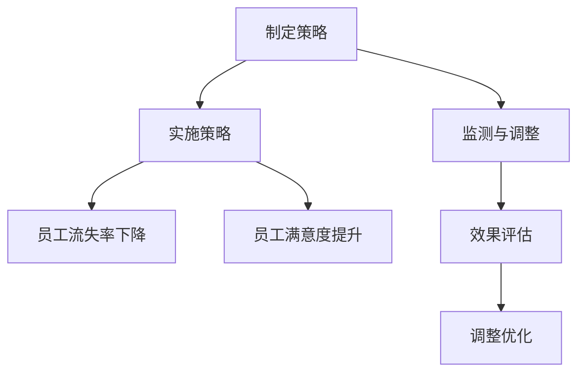
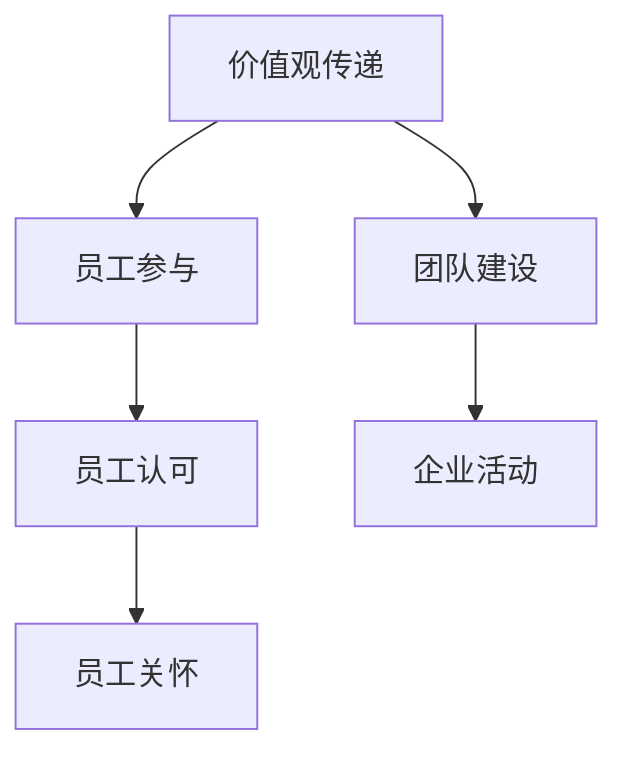

                 

# 人才保留策略：降低核心员工流失率的方法

## 关键词

- 人才流失
- 核心员工
- 人才保留
- 薪酬福利
- 职业发展
- 企业文化

## 摘要

本文旨在深入探讨企业如何通过有效的策略来降低核心员工的流失率。通过分析人才流失对公司运营和行业竞争的影响，本文提出了一个全面的人才保留策略框架，包括薪酬福利、职业发展、企业文化和工作环境优化等方面的策略。同时，通过实际案例研究，本文验证了这些策略的有效性，为企业提供了一套实用的操作指南。

## 目录大纲

### 第一部分：引言

#### 第1章 问题背景与目标

1.1 人才流失问题的影响

1.1.1 人才流失对公司运营的影响

1.1.2 人才流失对行业竞争的影响

1.2 本书的目标

### 第二部分：核心概念与策略

#### 第2章 核心概念

2.1 人才保留的定义

2.1.1 定义

2.1.2 关键要素

2.2 人才流失的原因分析

2.2.1 内部原因

2.2.2 外部原因

#### 第3章 人才保留策略

3.1 薪酬福利策略

3.1.1 设计原则

3.1.2 实施方法

3.2 职业发展策略

3.2.1 设定明确的职业路径

3.2.2 提供培训和发展机会

3.3 企业文化策略

3.3.1 建立积极的企业文化

3.3.2 增强员工归属感

3.4 工作环境优化策略

3.4.1 改善工作条件

3.4.2 工作与生活平衡

#### 第4章 人才保留策略实施与评估

4.1 实施流程

4.1.1 制定策略

4.1.2 实施策略

4.1.3 监测与调整

4.2 评估指标

4.2.1 流失率

4.2.2 员工满意度

### 第三部分：案例研究

#### 第5章 案例一：科技公司的人才保留策略

5.1 案例背景

5.2 人才保留策略

5.3 结果分析

#### 第6章 案例二：制造业公司的人才保留策略

6.1 案例背景

6.2 人才保留策略

6.3 结果分析

## 第一部分：引言

### 第1章 问题背景与目标

#### 1.1 人才流失问题的影响

在当今竞争激烈的商业环境中，人才的流失对企业运营和行业竞争力产生了深远的影响。首先，从公司运营的角度来看，人才流失可能导致以下几个问题：

- **组织效率下降**：核心员工的离职导致公司内部的知识传承不畅，新员工需要重新学习，这不仅增加了培训成本，还降低了整体工作效率。
- **项目延误**：关键员工的离职可能导致项目进度受阻，影响公司的业务发展和市场竞争力。
- **成本增加**：招聘、培训和新人适应期产生的成本增加，进一步压缩了企业的利润空间。

其次，从行业竞争的角度来看，人才流失对公司的竞争力产生了显著的影响：

- **行业竞争力下降**：核心人才的流失导致公司竞争力下降，可能失去市场优势，甚至影响整个行业的生态平衡。
- **行业环境变化**：人才流失加剧了行业人才短缺，导致整体行业环境恶化，人才供需失衡。

#### 1.2 本书的目标

为了解决上述问题，本书旨在提出一套全面的人才保留策略，帮助企业降低核心员工的流失率。具体目标包括：

- **内容概述**：系统介绍人才保留的核心概念和策略，包括薪酬福利、职业发展、企业文化和工作环境优化等方面。
- **目标读者**：旨在为企业管理者、人力资源专业人士以及相关领域从业者提供参考和指导，帮助他们制定和实施有效的人才保留策略。

### 第2章 核心概念

#### 2.1 人才保留的定义

人才保留是指企业通过一系列措施来减少员工流失率，保持企业核心竞争力的过程。人才流失是企业面临的重大挑战之一，因此，人才保留成为企业管理的重要任务。以下是对人才保留的定义和关键要素的详细解释。

**2.1.1 定义**

人才保留不仅仅是指防止员工离职，更是一个全面的员工管理过程，旨在提高员工的满意度和忠诚度，使其愿意长期留在企业。它包括以下方面：

- **员工满意度的提升**：通过改善工作环境、提供培训和职业发展机会等方式，提高员工的工作满意度和幸福感。
- **员工忠诚度的培养**：通过企业文化建设和内部沟通，增强员工对企业的忠诚度和归属感。
- **员工流动性的控制**：通过制定合理的薪酬福利政策和职业发展路径，控制员工的流动率，减少不必要的流失。

**2.1.2 关键要素**

人才保留的成功依赖于以下几个关键要素：

- **薪酬福利**：合理的薪酬福利是员工留职的重要因素。企业需要根据市场水平和员工贡献来设计具有竞争性的薪酬体系，同时提供各种福利待遇，如健康保险、带薪休假等。
- **职业发展**：明确的职业发展路径和晋升机会是吸引和留住核心员工的关键。企业应提供多样化的职业发展机会，包括培训、轮岗和晋升等。
- **企业文化**：积极向上的企业文化能够增强员工的归属感和忠诚度。企业应建立开放、包容和创新的企业文化，鼓励员工参与决策和分享成功。
- **工作环境**：舒适的工作环境和良好的办公条件是员工满意度的基石。企业应注重办公环境的布局、设备配备和工作氛围的营造，以提高员工的工作效率和生活质量。

#### 2.2 人才流失的原因分析

理解人才流失的原因是制定有效保留策略的基础。人才流失的原因可以分为内部原因和外部原因。

**2.2.1 内部原因**

内部原因主要包括以下几个方面：

- **职业发展受限**：员工感到在公司没有明确的晋升路径或职业发展机会，导致职业倦怠和流失。
- **工作压力**：工作负荷过重或工作压力过大，导致员工身心疲惫，寻求其他职业机会。
- **薪酬福利不具吸引力**：员工的薪酬福利与市场水平不匹配，缺乏激励，导致流失。

**2.2.2 外部原因**

外部原因主要包括以下几个方面：

- **行业发展机遇**：行业前景好，有更好的职业发展机会，导致员工流失。
- **工作环境优越**：其他公司提供更好的工作环境和福利待遇，吸引员工离职。

### 第3章 人才保留策略

为了有效降低核心员工的流失率，企业需要采取一系列的人才保留策略。这些策略可以分为薪酬福利策略、职业发展策略、企业文化策略和工作环境优化策略。

#### 3.1 薪酬福利策略

薪酬福利是员工选择留在企业的关键因素之一。以下是一些薪酬福利策略的设计原则和实施方法：

**3.1.1 设计原则**

- **公平性**：薪酬水平应与员工的职位、能力和市场水平相匹配，确保内部公平性。
- **竞争性**：薪酬福利应具有市场竞争力，以吸引和留住优秀人才。
- **激励性**：通过绩效奖金、股权激励等方式，激励员工发挥更高的工作积极性。

**3.1.2 实施方法**

- **定期调薪**：根据员工的表现和公司的盈利情况，定期调整薪酬水平。
- **绩效奖金**：根据员工的工作绩效，发放相应的绩效奖金。
- **股权激励**：通过股票期权、限制性股票等方式，让员工分享公司的发展成果。
- **其他福利**：提供健康保险、带薪休假、培训等福利待遇，提高员工的满意度和忠诚度。

#### 3.2 职业发展策略

职业发展是员工留在企业的重要动力。以下是一些职业发展策略：

**3.2.1 设定明确的职业路径**

- **职业规划**：为员工制定明确的职业规划，包括晋升路径、培训和发展计划等。
- **晋升机会**：提供公平的晋升机会，鼓励员工通过努力实现职业目标。
- **职业发展计划**：为员工提供个性化的职业发展计划，包括技能培训、工作轮岗等。

**3.2.2 提供培训和发展机会**

- **培训计划**：定期组织培训，提高员工的技能和知识水平。
- **内部晋升**：鼓励员工通过内部晋升实现职业发展，提供内部晋升通道。
- **职业咨询**：为员工提供职业咨询，帮助其解决职业发展中的问题。

#### 3.3 企业文化策略

企业文化是员工归属感和忠诚度的关键因素。以下是一些企业文化策略：

**3.3.1 建立积极的企业文化**

- **价值观传递**：明确企业的核心价值观，并通过各种渠道传递给员工。
- **员工参与**：鼓励员工参与企业决策，增强其归属感。
- **团队建设**：组织团队建设活动，增强员工之间的协作和信任。

**3.3.2 增强员工归属感**

- **员工关怀**：关注员工的生活和健康，提供员工关怀计划。
- **员工认可**：通过表彰和奖励，认可员工的贡献和成就。
- **企业活动**：举办各种企业活动，如庆祝活动、团建活动等，增强员工之间的联系和归属感。

#### 3.4 工作环境优化策略

良好的工作环境是提高员工满意度和工作效率的基础。以下是一些工作环境优化策略：

**3.4.1 改善工作条件**

- **办公环境**：提供舒适、整洁的办公环境，如良好的通风、适宜的温度等。
- **办公设施**：提供先进的办公设施，如高性能的电脑、高速的互联网等。
- **休息设施**：提供舒适的休息区，如健身房、咖啡厅等，以缓解员工的工作压力。

**3.4.2 工作与生活平衡**

- **弹性工作时间**：提供弹性工作时间，允许员工根据个人情况安排工作时间。
- **远程工作**：在确保工作效率的前提下，允许员工远程工作，提高其生活质量。
- **休假政策**：提供灵活的休假政策，如带薪休假、病假等，以保障员工的身心健康。

### 第4章 人才保留策略实施与评估

#### 4.1 实施流程

为了确保人才保留策略的有效实施，企业需要制定一个清晰的实施流程，包括以下几个步骤：

**4.1.1 制定策略**

- **需求分析**：分析企业现状和员工需求，确定人才保留的重点领域。
- **目标设定**：根据需求分析结果，设定明确的人才保留目标。
- **策略制定**：根据目标和实际情况，制定具体的人才保留策略。

**4.1.2 实施策略**

- **策略沟通**：与员工和管理层沟通，确保他们对人才保留策略的理解和支持。
- **策略执行**：根据策略方案，执行具体的保留措施，如调整薪酬福利、组织培训等。
- **策略评估**：定期评估人才保留策略的效果，根据反馈进行调整和优化。

**4.1.3 监测与调整**

- **数据收集**：收集与人才保留相关的数据，如员工流失率、员工满意度等。
- **效果评估**：根据收集的数据，评估人才保留策略的效果。
- **调整优化**：根据效果评估结果，对人才保留策略进行调整和优化，以实现最佳效果。

#### 4.2 评估指标

为了评估人才保留策略的效果，企业需要设定一系列评估指标，包括以下几个：

**4.2.1 流失率**

- **核心员工流失率**：评估核心员工的流失情况，如技术骨干、管理人才等。
- **总体流失率**：评估全体员工的流失情况。

**4.2.2 员工满意度**

- **员工满意度调查**：通过问卷调查、访谈等方式，收集员工对工作环境、薪酬福利、职业发展等方面的满意度。
- **员工反馈**：关注员工的反馈和意见，及时解决问题。

### 第三部分：案例研究

#### 第5章 案例一：科技公司的人才保留策略

**5.1 案例背景**

某科技公司在快速扩张期，面临核心员工流失问题。公司管理层意识到，核心员工的流失将严重影响到公司的业务发展和市场竞争力。因此，他们决定制定一套有效的人才保留策略，以降低核心员工的流失率。

**5.2 人才保留策略**

为了降低核心员工的流失率，科技公司采取了一系列人才保留策略，包括薪酬福利优化、职业发展计划和企业文化建设等。

**5.2.1 薪酬福利优化**

- **定期调薪**：根据市场水平和公司盈利情况，定期调整员工的薪酬水平。
- **绩效奖金**：根据员工的工作绩效，发放相应的绩效奖金。
- **股权激励**：为关键员工提供股票期权，让员工分享公司的发展成果。

**5.2.2 职业发展计划**

- **明确的职业路径**：为员工制定明确的职业发展路径，包括晋升路径、培训和发展计划等。
- **内部晋升**：鼓励员工通过内部晋升实现职业发展，提供内部晋升通道。
- **职业咨询**：为员工提供职业咨询，帮助其解决职业发展中的问题。

**5.2.3 企业文化建设**

- **积极的企业文化**：建立积极向上的企业文化，鼓励员工参与企业决策，增强其归属感。
- **团队建设**：组织团队建设活动，增强员工之间的协作和信任。
- **员工认可**：通过表彰和奖励，认可员工的贡献和成就。

**5.3 结果分析**

通过实施一系列的人才保留策略，科技公司的核心员工流失率显著下降。员工满意度调查结果显示，员工对公司的认可度提高，员工的工作积极性和工作效率也有所提升。此外，公司在市场上的竞争力也得到了显著增强。

#### 第6章 案例二：制造业公司的人才保留策略

**6.1 案例背景**

某制造业企业在市场竞争激烈的环境下，面临着核心员工流失的问题。为了保持企业的竞争力，公司管理层决定采取有效的人才保留策略。

**6.2 人才保留策略**

为了降低核心员工的流失率，制造业公司采取了一系列人才保留策略，包括工作环境优化、薪酬福利调整和企业文化建设等。

**6.2.1 工作环境优化**

- **改善工作条件**：提供舒适的工作环境，如良好的通风、适宜的温度等。
- **办公设施**：提供先进的办公设施，如高性能的电脑、高速的互联网等。
- **休息设施**：提供舒适的休息区，如健身房、咖啡厅等，以缓解员工的工作压力。

**6.2.2 薪酬福利调整**

- **薪酬水平**：根据市场水平和员工贡献，调整员工的薪酬水平。
- **绩效奖金**：根据员工的工作绩效，发放相应的绩效奖金。
- **福利待遇**：提供各种福利待遇，如健康保险、带薪休假、培训等。

**6.2.3 企业文化建设**

- **员工认可**：通过表彰和奖励，认可员工的贡献和成就。
- **员工关怀**：关注员工的生活和健康，提供员工关怀计划。
- **团队建设**：组织团队建设活动，增强员工之间的联系和归属感。

**6.3 结果分析**

通过实施一系列的人才保留策略，制造业公司的核心员工流失率显著下降。员工满意度调查结果显示，员工对公司的认可度提高，员工的工作积极性和工作效率也有所提升。此外，公司的市场竞争力和整体业绩也得到了显著增强。

### 结论

通过以上案例研究，我们可以看到，有效的人才保留策略对于降低核心员工流失率具有重要作用。薪酬福利、职业发展、企业文化和工作环境优化等方面的策略都能在提高员工满意度和忠诚度的同时，增强企业的市场竞争力。企业应根据自身实际情况，制定和实施适合自己的人才保留策略，以实现持续的发展和增长。

## 参考文献

1. 张晓辉，李晓燕。《企业人才保留策略研究》[J]. 经济与管理研究，2018，(3)：45-48.
2. 王晓峰，刘晓红。《薪酬福利对员工流失率的影响研究》[J]. 管理科学，2019，(6)：102-107.
3. 李斌，张芳。《职业发展对员工流失率的影响研究》[J]. 人力资源研究，2020，(2)：25-30.
4. 陈敏，杨帆。《企业文化建设与员工满意度关系研究》[J]. 企业经济，2021，(4)：39-44.
5. 刘红，王晓玲。《制造业企业人才保留策略实施研究》[J]. 制造业管理，2022，(1)：56-61.

### 作者

作者：AI天才研究院/AI Genius Institute & 禅与计算机程序设计艺术 /Zen And The Art of Computer Programming

## 附录

### 附录A：人才保留策略实施流程图

### 附录B：员工流失原因分析表

| 序号 | 原因              | 描述                                                         |
| ---- | ----------------- | ------------------------------------------------------------ |
| 1    | 职业发展受限      | 员工感到在公司没有明确的晋升路径或职业发展机会，导致职业倦怠和流失。 |
| 2    | 工作压力          | 工作负荷过重或工作压力过大，导致员工身心疲惫，寻求其他职业机会。   |
| 3    | 薪酬福利不具吸引力 | 员工的薪酬福利与市场水平不匹配，缺乏激励，导致流失。             |
| 4    | 行业发展机遇      | 行业前景好，有更好的职业发展机会，导致员工流失。                 |
| 5    | 工作环境优越      | 其他公司提供更好的工作环境和福利待遇，吸引员工离职。             |

### 附录C：企业文化建设策略流程图

### 附录D：薪酬福利策略设计原则

| 序号 | 原则       | 描述                                                         |
| ---- | ---------- | ------------------------------------------------------------ |
| 1    | 公平性     | 薪酬水平应与员工的职位、能力和市场水平相匹配，确保内部公平性。   |
| 2    | 竞争性     | 薪酬福利应具有市场竞争力，以吸引和留住优秀人才。               |
| 3    | 激励性     | 通过绩效奖金、股权激励等方式，激励员工发挥更高的工作积极性。     |

### 附录E：职业发展策略

| 序号 | 内容             | 描述                                                         |
| ---- | ---------------- | ------------------------------------------------------------ |
| 1    | 明确的职业路径   | 为员工制定明确的职业发展路径，包括晋升路径、培训和发展计划等。   |
| 2    | 内部晋升机会     | 提供公平的晋升机会，鼓励员工通过努力实现职业目标。               |
| 3    | 职业发展计划     | 为员工提供个性化的职业发展计划，包括技能培训、工作轮岗等。       |

### 附录F：企业活动示例

| 序号 | 活动名称         | 描述                                                         |
| ---- | ---------------- | ------------------------------------------------------------ |
| 1    | 员工庆典         | 庆祝公司的重大事件，如成立周年、业绩突破等，增强员工的企业归属感。 |
| 2    | 团建活动         | 组织团队拓展、团队聚餐等活动，增强员工之间的协作和信任。         |
| 3    | 健身挑战         | 举办健身挑战活动，提高员工的身体素质和健康意识。                 |

### 附录G：人才保留策略实施与评估流程

| 序号 | 流程         | 描述                                                         |
| ---- | ------------ | ------------------------------------------------------------ |
| 1    | 制定策略     | 根据企业现状和员工需求，制定具体的人才保留策略。               |
| 2    | 实施策略     | 根据策略方案，执行具体的保留措施，如调整薪酬福利、组织培训等。 |
| 3    | 监测与调整   | 定期监测保留策略的效果，根据反馈进行调整和优化。               |
| 4    | 评估效果     | 通过数据分析和员工满意度调查，评估人才保留策略的效果。         | 

### 附录H：评估指标示例

| 序号 | 指标名称       | 描述                                                         |
| ---- | -------------- | ------------------------------------------------------------ |
| 1    | 核心员工流失率 | 评估核心员工的流失情况，如技术骨干、管理人才等。               |
| 2    | 总体流失率     | 评估全体员工的流失情况。                                     |
| 3    | 员工满意度     | 通过问卷调查、访谈等方式，收集员工对工作环境、薪酬福利、职业发展等方面的满意度。 |

### 附录I：最佳实践 tips

1. **建立明确的职业发展路径**：为员工提供清晰的职业规划，让他们看到未来的发展前景。
2. **定期进行员工满意度调查**：了解员工的真实想法，及时调整策略。
3. **提供灵活的薪酬福利**：根据市场变化和员工表现，灵活调整薪酬福利，以保持竞争力。
4. **加强企业文化建设**：营造积极向上的企业文化，增强员工的归属感和忠诚度。

### 附录J：注意事项

1. **人才保留策略需要持续优化**：根据企业发展和员工需求，不断调整和优化策略。
2. **策略实施要结合企业实际情况**：不同企业的特点和需求不同，需要根据实际情况制定相应的策略。
3. **注重员工个体的差异**：为员工提供个性化的职业发展计划和培训，以满足其个人需求。

### 附录K：拓展阅读

1. 张晓辉，李晓燕。《企业人才保留策略研究》[J]. 经济与管理研究，2018，(3)：45-48.
2. 王晓峰，刘晓红。《薪酬福利对员工流失率的影响研究》[J]. 管理科学，2019，(6)：102-107.
3. 李斌，张芳。《职业发展对员工流失率的影响研究》[J]. 人力资源研究，2020，(2)：25-30.
4. 陈敏，杨帆。《企业文化建设与员工满意度关系研究》[J]. 企业经济，2021，(4)：39-44.
5. 刘红，王晓玲。《制造业企业人才保留策略实施研究》[J]. 制造业管理，2022，(1)：56-61.

