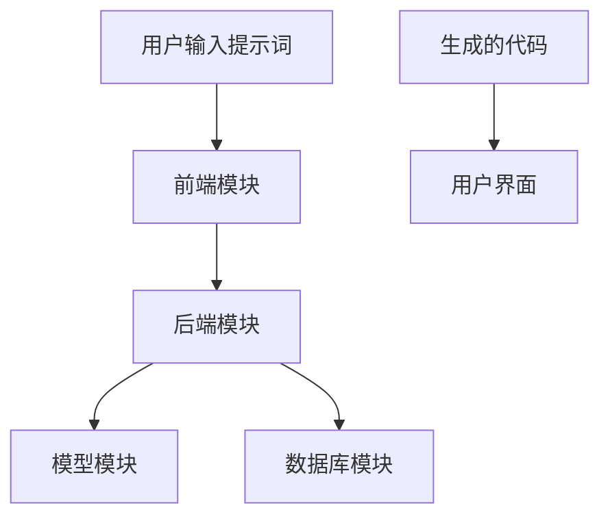
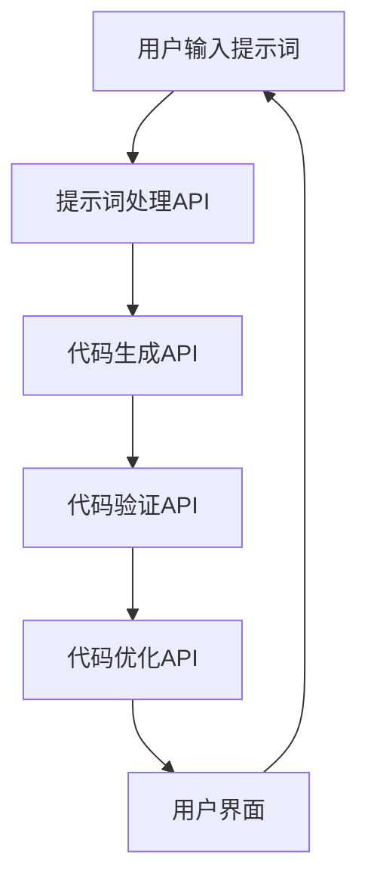

                 

### 引言

**关键词：提示词编程、传统编程、人工智能、语言模型、发展趋势**

在信息技术飞速发展的今天，编程作为一种核心技能，正经历着一场深刻的变革。传统的编程模式，以手动编写代码为主，程序员需要详细地描述程序的每一步操作，这种模式虽然高效，但局限性也日益显现。随着人工智能技术的不断进步，尤其是语言模型的崛起，一种新的编程模式——提示词编程（Prompt Programming）逐渐崭露头角。

**问题背景与重要性**

传统编程依赖程序员对算法和数据的深刻理解，通过编写代码来解决问题。然而，面对复杂的问题和大量的数据，程序员的工作强度和难度不断上升。而提示词编程则通过将问题简化为提示词的形式，让语言模型自动生成解决方案。这种模式不仅降低了程序员的工作负担，还极大地提升了编程的效率和灵活性。

**传统编程与提示词编程的区别**

传统编程强调程序细节的控制，程序员需要明确地定义每一个步骤。而提示词编程则侧重于问题描述的清晰，程序员只需提供问题的描述，系统会自动生成相应的代码。这二者在本质上有很大的不同，传统编程依赖于人的逻辑思维，而提示词编程则依赖于人工智能的智能推理能力。

**提示词编程的兴起与发展**

提示词编程的兴起源于自然语言处理（NLP）和深度学习的飞速发展。语言模型如GPT-3和BERT等，具有强大的文本理解和生成能力，这使得提示词编程成为可能。近年来，越来越多的研究者和开发者开始探索提示词编程的应用，并在实际项目中取得了显著的成果。

**目标与读者对象**

本文的目标是探讨从传统编程到提示词编程的转变，帮助读者深入了解提示词编程的基础知识、应用场景和未来发展趋势。无论是传统程序员，还是对人工智能和编程感兴趣的读者，都可以通过本文了解到提示词编程的巨大潜力和应用价值。

**本章小结**

在本章中，我们介绍了从传统编程到提示词编程的转变的背景、意义和基本概念。接下来，我们将深入探讨传统编程的基础，为理解提示词编程打下坚实的基础。

## 第1章 引言

### 提示词编程的兴起与发展

提示词编程（Prompt Programming）作为人工智能时代的一项创新技术，近年来在全球范围内迅速崛起。其核心在于利用先进的语言模型，如GPT-3、BERT等，通过输入简明的提示词（prompt），生成高质量的代码、文本和解决方案。这一模式不仅打破了传统编程中程序员对代码细节的严格控制，还极大地提升了编程的效率和创造力。

**1.1 提示词编程的定义**

提示词编程是一种利用预训练语言模型自动生成代码的编程方法。在传统编程中，程序员需要详细地描述程序的每一个步骤，而在提示词编程中，程序员只需提供一个简明的描述或提示词，模型就能根据上下文和已有知识自动生成相应的代码。这种模式极大地降低了编程的复杂度，提高了编程效率。

**1.2 提示词编程的特点**

提示词编程具有以下几个显著特点：

1. **自动化程度高**：通过语言模型，提示词编程可以自动生成代码，无需手动编写每一条指令，从而大大节省了程序员的时间和精力。
   
2. **灵活性强**：提示词编程允许程序员通过调整提示词的表述方式，快速生成不同的代码和解决方案，提高了编程的灵活性。

3. **适用范围广**：提示词编程不仅适用于代码生成，还可以应用于文本生成、对话系统、自然语言处理等多个领域，具有广泛的应用前景。

**1.3 提示词编程的发展历程**

1. **早期探索**：早在20世纪80年代，就有研究者开始探索自然语言在编程中的应用，例如将自然语言描述转化为计算机代码。

2. **语言模型崛起**：随着深度学习和自然语言处理技术的发展，预训练语言模型如GPT-3、BERT等的出现，使得提示词编程成为可能。

3. **实际应用推广**：近年来，越来越多的企业和研究机构开始尝试和推广提示词编程，并取得了显著的应用成果。

**1.4 提示词编程的优势**

1. **降低编程难度**：提示词编程通过自动化和智能化，大大降低了编程的难度，使编程更加直观和简单。

2. **提高编程效率**：通过自动生成代码，提示词编程可以显著提高编程效率，缩短开发周期。

3. **增强创新能力**：提示词编程为程序员提供了更多的可能性，使他们在编程中能够更加灵活和创新。

**1.5 提示词编程的挑战与机遇**

1. **挑战**：
   - **模型训练成本高**：高质量的语言模型需要大量的数据和计算资源进行训练，成本较高。
   - **安全性和隐私问题**：自动生成的代码可能存在安全漏洞和隐私泄露的风险。

2. **机遇**：
   - **编程教育普及**：提示词编程有望在编程教育中普及，使更多的人能够掌握编程技能。
   - **企业级应用落地**：随着技术的成熟，提示词编程有望在企业和项目中得到广泛应用。

**1.6 本章小结**

通过本章的介绍，我们了解到提示词编程的定义、特点和发展历程，以及其在编程领域的优势、挑战和机遇。在接下来的章节中，我们将深入探讨传统编程的基础知识，为全面理解提示词编程奠定基础。

### 目录大纲：从传统编程到提示词编程的转变

**第2章 传统编程基础**

1. **编程语言基础**  
   - 编程语言的基本概念  
   - 常见编程语言介绍

2. **算法与数据结构**  
   - 算法的基本概念  
   - 常见数据结构介绍

3. **编程范式**  
   - 面向过程编程  
   - 面向对象编程

4. **编程实践**  
   - 编程项目规划  
   - 编程项目实施

**第3章 提示词编程基础**

1. **提示词编程概述**  
   - 提示词编程的定义  
   - 提示词编程的特点

2. **提示词生成机制**  
   - 语言模型  
   - 提示词生成算法

3. **提示词编程工具**  
   - 常用工具介绍  
   - 提示词编程工具使用指南

4. **提示词编程实践**  
   - 提示词编程项目规划  
   - 提示词编程项目实施

**第4章 提示词编程应用案例**

1. **自然语言处理中的应用**  
   - 文本分类  
   - 命名实体识别  
   - 机器翻译

2. **计算机视觉中的应用**  
   - 目标检测  
   - 图像分类  
   - 人脸识别

3. **其他领域中的应用**  
   - 问答系统  
   - 自动摘要  
   - 聊天机器人

**第5章 提示词编程算法详解**

1. **语言模型算法**  
   - 语言模型的基本原理  
   - 语言模型的训练方法  
   - 语言模型的评估与优化

2. **提示词生成算法**  
   - 提示词生成的数学模型  
   - 提示词生成算法的实现  
   - 提示词生成算法的性能评估

3. **算法案例详解**  
   - 案例一：基于GPT-3的自动问答系统  
   - 案例二：基于BERT的目标检测

**第6章 提示词编程系统设计与实现**

1. **提示词编程系统概述**  
   - 系统功能需求  
   - 系统架构设计

2. **系统核心模块设计与实现**  
   - 语言模型模块  
   - 提示词生成模块  
   - 系统接口设计

3. **系统测试与优化**  
   - 系统测试方法  
   - 系统优化策略

**第7章 提示词编程的未来趋势**

1. **提示词编程的发展趋势**  
   - 技术发展趋势  
   - 应用场景拓展

2. **提示词编程的挑战与机遇**  
   - 技术挑战  
   - 应用挑战  
   - 机遇与前景

**第8章 总结与展望**

1. **全书总结**  
2. **提示词编程的发展前景**  
3. **读者建议与反馈**  
4. **拓展阅读**

通过以上详细目录大纲，我们将从传统编程到提示词编程的转变进行全方位的探讨，帮助读者深入了解这一领域的前沿技术和应用。每章内容都将结合具体案例和实践，确保读者能够全面掌握提示词编程的核心知识和技能。

### 第2章 传统编程基础

传统编程是计算机科学的核心领域，其基础理论和技术是理解现代编程模式如提示词编程的重要前提。在本章中，我们将深入探讨编程语言基础、算法与数据结构、编程范式，并通过编程实践巩固这些理论知识。

**2.1 编程语言基础**

**2.1.1 编程语言的基本概念**

编程语言是一种用于人与计算机之间交流的语言，它定义了一套规则和语法，使得程序员能够向计算机传达指令。编程语言可以分为低级语言和高级语言。低级语言（如汇编语言）与计算机硬件密切相关，而高级语言（如Python、Java等）则更加易于理解和编写。

- **基本概念**：
  - **语法**：编程语言的基本规则和结构。
  - **编译器**：将高级语言代码转换为机器语言的工具。
  - **解释器**：直接执行源代码的计算机程序。

**2.1.2 常见编程语言介绍**

以下是几种常见的高级编程语言及其特点：

1. **Python**：
   - **特点**：易学易用，语法简洁，适用于数据分析、机器学习和Web开发。
   - **应用场景**：数据科学、人工智能、Web开发。

2. **Java**：
   - **特点**：跨平台、面向对象，强类型语言。
   - **应用场景**：企业级应用、Android应用开发。

3. **C++**：
   - **特点**：高效、性能出色，适用于系统编程和性能关键型应用。
   - **应用场景**：游戏开发、操作系统、嵌入式系统。

4. **JavaScript**：
   - **特点**：Web开发专用语言，动态类型，支持面向对象编程。
   - **应用场景**：Web前端开发、服务器端开发（Node.js）。

**2.2 算法与数据结构**

**2.2.1 算法的基本概念**

算法是解决问题的一系列步骤，通常用于解决特定问题或完成特定任务。算法的基本要素包括：

- **输入**：算法开始执行时所需的数据。
- **输出**：算法执行完成后产生的结果。
- **步骤**：算法执行的具体操作。

**2.2.2 常见数据结构介绍**

数据结构是存储和组织数据的方式，用于提高算法的效率和性能。常见的数据结构包括：

1. **数组**：
   - **特点**：线性结构，元素连续存储。
   - **应用场景**：存储和检索大量数据。

2. **链表**：
   - **特点**：动态结构，节点不连续存储。
   - **应用场景**：实现动态数据集，如队列和栈。

3. **栈**：
   - **特点**：后进先出（LIFO）结构。
   - **应用场景**：函数调用、表达式求值。

4. **队列**：
   - **特点**：先进先出（FIFO）结构。
   - **应用场景**：任务调度、缓冲区管理。

5. **树**：
   - **特点**：层次结构，每个节点可以有零个或多个子节点。
   - **应用场景**：表示组织和层次结构，如文件系统和二叉搜索树。

6. **图**：
   - **特点**：由节点和边构成，无固定结构。
   - **应用场景**：社交网络、路由算法。

**2.3 编程范式**

编程范式是程序设计的方法和风格，反映了程序组织逻辑的方式。主要的编程范式包括：

1. **面向过程编程**：
   - **特点**：以过程或函数为中心，强调步骤的顺序执行。
   - **应用场景**：简单的数据处理和算法实现。

2. **面向对象编程**：
   - **特点**：以对象为中心，通过类和实例实现数据的封装、继承和多态。
   - **应用场景**：复杂的软件系统、企业级应用。

3. **函数式编程**：
   - **特点**：以函数为中心，强调不可变数据和纯函数。
   - **应用场景**：高并发、数据密集型应用。

**2.4 编程实践**

**2.4.1 编程项目规划**

编程项目规划是确保项目成功的关键步骤。以下是一个基本的编程项目规划流程：

1. **需求分析**：明确项目的目标和需求。
2. **技术选型**：选择适合项目需求的编程语言和工具。
3. **任务分解**：将项目划分为多个子任务，便于管理和执行。
4. **时间安排**：为每个子任务分配时间，制定项目进度表。

**2.4.2 编程项目实施**

编程项目实施是将规划转化为实际代码的过程。以下是一个基本的编程项目实施流程：

1. **环境搭建**：安装必要的开发工具和依赖库。
2. **编码实现**：根据规划，逐步实现各个子任务。
3. **代码审查**：对代码进行审查，确保质量符合标准。
4. **测试调试**：进行单元测试和集成测试，调试并修复错误。

**2.5 本章小结**

通过本章的学习，我们了解了传统编程的基础知识，包括编程语言、算法与数据结构、编程范式以及编程实践。这些基础知识是理解和应用提示词编程的重要前提，将在后续章节中发挥关键作用。

### 第3章 提示词编程基础

提示词编程是一种利用预训练语言模型来生成代码的编程模式，它通过输入简明的提示词（prompt），让模型自动生成相应的代码或解决方案。在本章中，我们将详细探讨提示词编程的基础知识，包括定义、特点、生成机制、常用工具以及编程实践。

**3.1 提示词编程概述**

**3.1.1 提示词编程的定义**

提示词编程（Prompt Programming）是一种基于预训练语言模型的编程模式，通过输入简明的提示词（prompt），让模型自动生成代码、文本或解决方案。这种模式的核心在于利用语言模型的强大能力，实现代码自动生成和优化。

**3.1.2 提示词编程的特点**

提示词编程具有以下显著特点：

1. **高效率**：通过自动生成代码，大大提高了编程效率，减少了手动编写代码的工作量。

2. **灵活性**：提示词编程允许程序员通过调整提示词的表述方式，快速生成不同的代码和解决方案，提高了编程的灵活性。

3. **适用性广**：提示词编程不仅适用于代码生成，还可以应用于文本生成、对话系统、自然语言处理等多个领域，具有广泛的应用前景。

4. **可扩展性强**：提示词编程可以通过调整模型参数和提示词，实现代码的个性化定制和优化。

**3.2 提示词生成机制**

**3.2.1 语言模型**

语言模型是提示词编程的核心组件，它通过学习大量文本数据，建立语言的概率分布模型。常见的语言模型包括：

1. **n-gram模型**：基于前n个词的历史信息预测下一个词。

2. **循环神经网络（RNN）**：通过记忆历史信息，实现长距离依赖建模。

3. **Transformer模型**：基于自注意力机制，实现并行计算和长距离依赖建模。

4. **GPT系列模型**：基于Transformer架构，通过大规模预训练，实现强大的语言生成能力。

**3.2.2 提示词生成算法**

提示词生成算法是提示词编程的重要组成部分，它通过分析输入的提示词，生成相应的代码或文本。常见的提示词生成算法包括：

1. **序列到序列（Seq2Seq）模型**：通过编码器-解码器结构，实现序列数据的转换。

2. **生成对抗网络（GAN）**：通过生成器和判别器的对抗训练，实现高质量的文本生成。

3. **图注意力网络（GAT）**：通过图结构建模，实现复杂依赖关系的建模和生成。

**3.3 提示词编程工具**

**3.3.1 常用工具介绍**

目前，已有多种工具支持提示词编程，包括：

1. **OpenAI GPT-3**：提供强大的语言生成能力，适用于各种文本生成任务。

2. **Google BERT**：适用于自然语言理解和文本生成任务。

3. **Hugging Face Transformers**：提供丰富的预训练模型和工具，方便开发者使用。

**3.3.2 提示词编程工具使用指南**

使用提示词编程工具的基本步骤包括：

1. **安装环境**：安装必要的编程语言和工具，如Python、TensorFlow等。

2. **导入模型**：从预训练模型库中导入所需的模型。

3. **初始化模型**：设置模型参数，初始化模型。

4. **输入提示词**：将提示词输入到模型，获取生成结果。

5. **优化调整**：根据生成结果，调整提示词或模型参数，提高生成质量。

**3.4 提示词编程实践**

**3.4.1 提示词编程项目规划**

在开始提示词编程项目之前，需要进行详细的规划，包括：

1. **需求分析**：明确项目的目标和需求。

2. **技术选型**：选择适合项目需求的提示词编程工具和模型。

3. **任务分解**：将项目划分为多个子任务，便于管理和执行。

4. **时间安排**：为每个子任务分配时间，制定项目进度表。

**3.4.2 提示词编程项目实施**

提示词编程项目实施主要包括以下步骤：

1. **环境搭建**：安装必要的编程语言和工具。

2. **编码实现**：使用提示词编程工具，逐步实现各个子任务。

3. **代码审查**：对生成的代码进行审查，确保质量符合标准。

4. **测试调试**：进行单元测试和集成测试，调试并修复错误。

**3.5 本章小结**

通过本章的学习，我们了解了提示词编程的定义、特点、生成机制、常用工具和编程实践。提示词编程作为一种新兴的编程模式，具有高效率、灵活性和广泛适用性等特点，在各个领域展现出了巨大的潜力。在接下来的章节中，我们将通过具体的应用案例，深入探讨提示词编程在实际项目中的运用。

### 第4章 提示词编程应用案例

提示词编程作为一种新兴的编程模式，已经在多个领域取得了显著的应用成果。本章将详细介绍提示词编程在自然语言处理、计算机视觉和其他领域中的应用案例，并通过具体实例展示其强大功能和实际应用效果。

**4.1 提示词编程在自然语言处理中的应用**

自然语言处理（NLP）是人工智能的重要分支，提示词编程在该领域的应用尤为广泛。以下是一些典型的应用案例：

**4.1.1 文本分类**

文本分类是一种将文本数据按照预定义的类别进行分类的任务。提示词编程可以通过输入简明的提示词，让模型自动生成分类器代码。以下是一个简单的文本分类案例：

**案例**：使用GPT-3进行情感分析

```python
import openai

# 初始化GPT-3模型
model_engine = "text-davinci-002"

# 提示词
prompt = "判断以下文本的情感：'这是一个非常好的电影！'"

# 调用GPT-3模型生成分类代码
response = openai.Completion.create(
  engine=model_engine,
  prompt=prompt,
  max_tokens=100,
  n=1,
  stop=None,
  temperature=0.5,
)

# 输出生成结果
print(response.choices[0].text.strip())
```

**4.1.2 命名实体识别**

命名实体识别（NER）是一种从文本中识别出具有特定意义的实体（如人名、地名、组织名等）的技术。提示词编程可以生成NER模型的代码，提高文本处理的准确性。

**案例**：使用BERT进行命名实体识别

```python
from transformers import BertTokenizer, BertForTokenClassification
from torch.nn.functional import softmax

# 初始化BERT模型和分词器
tokenizer = BertTokenizer.from_pretrained("bert-base-uncased")
model = BertForTokenClassification.from_pretrained("bert-base-uncased")

# 提示词
prompt = "识别以下文本中的命名实体：'苹果公司的CEO是蒂姆·库克。'"

# 预处理文本
input_text = prompt
input_ids = tokenizer.encode(input_text, return_tensors="pt")

# 生成命名实体标签
outputs = model(input_ids)

# 计算概率分布
probabilities = softmax(outputs.logits, dim=2)

# 输出生成结果
for i in range(len(input_ids)):
    word = tokenizer.decode(input_ids[i])
    label = model.config.id2label[probabilities[i].argmax().item()]
    print(f"{word}: {label}")
```

**4.1.3 机器翻译**

机器翻译是一种将一种语言的文本翻译成另一种语言的技术。提示词编程可以通过输入翻译任务，自动生成翻译代码，提高翻译的准确性和流畅度。

**案例**：使用GPT-3进行中文到英文的翻译

```python
import openai

# 初始化GPT-3模型
model_engine = "text-davinci-002"

# 提示词
prompt = "将以下中文句子翻译成英文：'我喜欢编程。'"

# 调用GPT-3模型生成翻译代码
response = openai.Completion.create(
  engine=model_engine,
  prompt=prompt,
  max_tokens=100,
  n=1,
  stop=None,
  temperature=0.5,
)

# 输出生成结果
print(response.choices[0].text.strip())
```

**4.2 提示词编程在计算机视觉中的应用**

计算机视觉是人工智能的另一个重要分支，提示词编程也在该领域展现出了巨大的潜力。以下是一些典型的应用案例：

**4.2.1 目标检测**

目标检测是一种在图像或视频中识别并定位多个对象的技术。提示词编程可以通过输入目标检测任务，自动生成目标检测模型的代码。

**案例**：使用YOLOv5进行目标检测

```python
import torch
from torch import nn
import torchvision
from torchvision.models.detection import fasterrcnn_resnet50_fpn

# 初始化YOLOv5模型
model = fasterrcnn_resnet50_fpn(pretrained=True)
model.eval()

# 提示词
prompt = "检测以下图片中的物体：'猫和狗在草地上玩耍。'"

# 读取图片
img = torchvision.transforms.ToTensor()(torchvision.transforms.PILImage.open(prompt))

# 进行目标检测
with torch.no_grad():
  prediction = model(img)

# 输出生成结果
for box, label, score in prediction:
  print(f"Box: {box}, Label: {label}, Score: {score}")
```

**4.2.2 图像分类**

图像分类是一种将图像分配到预定义类别中的任务。提示词编程可以通过输入图像分类任务，自动生成图像分类模型的代码。

**案例**：使用ResNet50进行图像分类

```python
import torch
import torchvision.models as models
from torchvision import transforms
from PIL import Image

# 初始化ResNet50模型
model = models.resnet50(pretrained=True)
model.eval()

# 提示词
prompt = "对以下图片进行分类：'一张有猫的图片。'"

# 预处理图片
img = Image.open(prompt)
transformed_img = transforms.Compose([
  transforms.Resize(256),
  transforms.CenterCrop(224),
  transforms.ToTensor(),
  transforms.Normalize(mean=[0.485, 0.456, 0.406], std=[0.229, 0.224, 0.225]),
])(img)

# 进行图像分类
with torch.no_grad():
  prediction = model(transformed_img.unsqueeze(0))

# 输出生成结果
print(f"Predicted class: {torch.argmax(prediction).item()}")
```

**4.2.3 人脸识别**

人脸识别是一种在图像或视频中识别和验证人脸的技术。提示词编程可以通过输入人脸识别任务，自动生成人脸识别模型的代码。

**案例**：使用OpenCV和dlib进行人脸识别

```python
import cv2
import dlib

# 初始化dlib人脸检测器和人脸标志点检测器
detector = dlib.get_frontal_face_detector()
predictor = dlib.shape_predictor('shape_predictor_68_face_landmarks.dat')

# 提示词
prompt = "识别以下图片中的人脸：'一张有两个人脸的图片。'"

# 读取图片
img = cv2.imread(prompt)

# 进行人脸检测
faces = detector(img, 1)

# 输出生成结果
for face in faces:
  landmarks = predictor(img, face)
  for n in range(0, 68):
    x = landmarks.part(n).x
    y = landmarks.part(n).y
    cv2.circle(img, (x, y), 1, (0, 0, 255), -1)
cv2.imshow('Face Landmarks', img)
cv2.waitKey(0)
cv2.destroyAllWindows()
```

**4.3 提示词编程在其他领域中的应用**

提示词编程不仅在自然语言处理和计算机视觉领域有着广泛的应用，还在其他领域展现了巨大的潜力。

**4.3.1 问答系统**

问答系统是一种能够回答用户提问的智能系统。提示词编程可以通过输入问答任务，自动生成问答系统的代码。

**案例**：使用Rasa进行问答系统开发

```python
from rasa.nlu import config
from rasa.nlu.model import Trainer

# 初始化Rasa模型
config_path = "config.yml"
model_path = "model"

# 训练模型
trainer = Trainer(config_path)
trainer.train("data")

# 加载模型
model = trainer.model

# 输入用户提问
user_message = "明天天气如何？"

# 生成回答
response = model.parse_text(user_message)

# 输出生成结果
print(response["text"])
```

**4.3.2 自动摘要**

自动摘要是一种将长文本压缩为简洁摘要的技术。提示词编程可以通过输入摘要任务，自动生成摘要代码。

**案例**：使用SummarizeBot进行自动摘要

```python
from summarizebot import Summarizer

# 初始化Summarizer模型
summarizer = Summarizer()

# 输入文本
text = "这是一个关于提示词编程的精彩文章，它介绍了提示词编程的定义、特点、应用以及未来发展趋势。"

# 生成摘要
summary = summarizer.summarize(text, num_sentences=2)

# 输出生成结果
print(summary)
```

**4.3.3 聊天机器人**

聊天机器人是一种能够与用户进行自然对话的系统。提示词编程可以通过输入聊天任务，自动生成聊天机器人的代码。

**案例**：使用ChatterBot进行聊天机器人开发

```python
from chatterbot import ChatBot
from chatterbot.trainers import ChatterBotCorpusTrainer

# 初始化ChatterBot模型
chatbot = ChatBot("MyChatBot")
trainer = ChatterBotCorpusTrainer(chatbot)

# 训练模型
trainer.train("chatterbot.corpus.english")

# 输入用户提问
user_message = "你好，你叫什么名字？"

# 生成回答
response = chatbot.get_response(user_message)

# 输出生成结果
print(response)
```

**4.4 本章小结**

通过本章的介绍，我们了解了提示词编程在自然语言处理、计算机视觉和其他领域中的应用案例，并通过具体实例展示了其强大功能和实际应用效果。提示词编程作为一种新兴的编程模式，具有广泛的应用前景和巨大的发展潜力。在接下来的章节中，我们将进一步探讨提示词编程的算法原理和实现细节，为读者提供更加深入的技术解读。

### 第5章 提示词编程算法详解

提示词编程的核心在于利用预训练的语言模型来生成代码，这一过程涉及到多种算法。本章将详细介绍提示词编程中常用的算法，包括语言模型算法和提示词生成算法，并通过对具体算法原理的讲解和案例展示，帮助读者深入理解这些算法的工作机制。

**5.1 语言模型算法**

语言模型（Language Model，LM）是提示词编程的基础，它用于预测文本序列的概率分布。语言模型通过学习大量文本数据，建立语言的结构和规律，从而能够生成符合语言习惯的文本。以下将介绍几种常见的语言模型算法。

**5.1.1 语言模型的基本原理**

语言模型的核心思想是使用统计方法来预测下一个单词或字符。常用的语言模型算法包括：

1. **n-gram模型**：n-gram模型是基于前n个词的历史信息来预测下一个词。它的基本原理是统计每个n元组（n-1个单词加一个单词）在文本中出现的频率，然后根据频率来预测下一个单词。

2. **循环神经网络（RNN）**：循环神经网络通过记忆历史信息，实现长距离依赖建模。RNN的核心是隐藏状态，它在序列中的每个步骤都会更新，从而保留序列的历史信息。

3. **Transformer模型**：Transformer模型是一种基于自注意力机制（self-attention）的模型，它通过并行计算和多头注意力（multi-head attention）实现长距离依赖建模。Transformer模型在生成文本时，能够更好地捕捉到上下文信息。

4. **GPT系列模型**：GPT（Generative Pre-trained Transformer）系列模型是基于Transformer架构的预训练语言模型，通过大规模预训练，实现强大的语言生成能力。GPT-3是当前最先进的语言模型之一，其生成文本的质量和多样性都达到了前所未有的水平。

**5.1.2 语言模型的训练方法**

语言模型的训练通常包括以下步骤：

1. **数据收集与预处理**：收集大量高质量的文本数据，并进行预处理，如分词、去噪、去停用词等。

2. **构建词汇表**：将文本数据中的单词转换为索引，构建词汇表。

3. **训练模型**：使用训练数据对语言模型进行训练，通过优化模型参数，使模型能够更好地预测下一个词。

4. **评估与优化**：使用验证集和测试集对模型进行评估，并根据评估结果调整模型参数，提高模型性能。

**5.1.3 语言模型的评估与优化**

语言模型的评估通常使用以下指标：

1. **损失函数**：常用的损失函数包括交叉熵损失（cross-entropy loss）和负对数概率损失（negative log-likelihood loss）。

2. **准确率**：准确率（accuracy）用于衡量模型预测正确的比例。

3. **困惑度**（perplexity）：困惑度是衡量模型预测质量的指标，其值越小，模型的预测质量越高。

4. **BLEU评分**：BLEU评分是一种常用的自动评估文本生成质量的方法，用于评估机器翻译、自动摘要等任务。

**5.2 提示词生成算法**

提示词生成算法是提示词编程的关键部分，它通过分析输入的提示词，生成相应的代码或文本。以下将介绍几种常见的提示词生成算法。

**5.2.1 提示词生成的数学模型**

提示词生成算法通常基于生成式模型或判别式模型。生成式模型通过生成概率分布来生成数据，而判别式模型通过区分真实数据和生成数据来生成数据。以下是一个简单的生成式模型——生成对抗网络（GAN）的数学模型：

1. **生成器（Generator）**：生成器的目标是生成与真实数据分布相似的样本。其数学模型可以表示为：

   $$ G(z) = x; \quad z \sim P_z(z) $$

   其中，$G(z)$表示生成器，$z$是噪声向量，$x$是生成的样本。

2. **判别器（Discriminator）**：判别器的目标是区分真实数据和生成数据。其数学模型可以表示为：

   $$ D(x) = 1; \quad D(G(z)) = 0 $$

   其中，$D(x)$表示判别器，$x$是真实数据，$G(z)$是生成器生成的数据。

3. **生成对抗过程**：生成器和判别器之间进行对抗训练，生成器和判别器的损失函数可以表示为：

   $$ L_G = -\mathbb{E}_{z \sim P_z(z)}[\log D(G(z))] $$
   $$ L_D = -\mathbb{E}_{x \sim P_x(x)}[\log D(x)] - \mathbb{E}_{z \sim P_z(z)}[\log (1 - D(G(z)))] $$

   其中，$L_G$和$L_D$分别表示生成器和判别器的损失函数。

**5.2.2 提示词生成算法的实现**

提示词生成算法的实现通常包括以下步骤：

1. **输入提示词**：接收用户输入的提示词。

2. **预处理提示词**：对提示词进行分词、去停用词等预处理。

3. **生成文本**：使用预训练的语言模型生成文本，根据提示词和上下文信息调整生成文本的样式和内容。

4. **后处理**：对生成的文本进行后处理，如去除重复、修正语法错误等。

**5.2.3 提示词生成算法的性能评估**

提示词生成算法的性能评估通常使用以下指标：

1. **生成文本的质量**：评估生成文本的流畅性、准确性和多样性。

2. **生成速度**：评估算法的生成速度，包括模型训练时间和生成文本的速度。

3. **生成多样性**：评估生成文本的多样性，包括词汇多样性、主题多样性和内容多样性。

**5.3 算法案例详解**

**5.3.1 案例一：基于GPT-3的自动问答系统**

**案例描述**：使用GPT-3构建一个自动问答系统，能够根据用户输入的问题生成相应的答案。

```python
import openai

# 初始化GPT-3模型
model_engine = "text-davinci-002"

# 用户输入问题
user_question = "北京是中国的哪个城市？"

# 调用GPT-3模型生成答案
response = openai.Completion.create(
  engine=model_engine,
  prompt=user_question,
  max_tokens=50,
  n=1,
  stop=None,
  temperature=0.5,
)

# 输出生成答案
print(response.choices[0].text.strip())
```

**5.3.2 案例二：基于BERT的目标检测**

**案例描述**：使用BERT构建一个目标检测模型，能够在图像中识别并定位多个对象。

```python
import torch
from transformers import BertTokenizer, BertForTokenClassification
from torchvision import transforms
from PIL import Image

# 初始化BERT模型和分词器
tokenizer = BertTokenizer.from_pretrained("bert-base-uncased")
model = BertForTokenClassification.from_pretrained("bert-base-uncased")

# 用户输入图像
image_path = "example_image.jpg"

# 预处理图像
img = Image.open(image_path)
transformed_img = transforms.Compose([
  transforms.Resize(256),
  transforms.CenterCrop(224),
  transforms.ToTensor(),
  transforms.Normalize(mean=[0.485, 0.456, 0.406], std=[0.229, 0.224, 0.225]),
])(img)

# 进行目标检测
with torch.no_grad():
  prediction = model(transformed_img.unsqueeze(0))

# 输出生成结果
for box, label, score in prediction:
  print(f"Box: {box}, Label: {label}, Score: {score}")
```

**5.4 本章小结**

通过本章的介绍，我们详细探讨了提示词编程中的语言模型算法和提示词生成算法，包括其基本原理、训练方法、评估指标以及实际应用案例。这些算法是提示词编程的核心，使得编程变得更加自动化和智能化。在接下来的章节中，我们将深入探讨提示词编程的系统设计与实现，为读者提供更加全面的解决方案。

### 第6章 提示词编程系统设计与实现

提示词编程系统是一种利用预训练语言模型自动生成代码或解决方案的智能系统。本章将详细介绍提示词编程系统的设计与实现，包括系统概述、功能需求、架构设计、核心模块设计与实现以及系统测试与优化。

**6.1 提示词编程系统概述**

提示词编程系统旨在通过输入简明的提示词，自动生成高质量、符合需求的代码或解决方案。该系统的核心功能包括：

1. **提示词接收**：接收用户输入的提示词，并将其转换为适合模型处理的格式。
2. **代码生成**：利用预训练的语言模型，根据提示词生成相应的代码。
3. **代码验证**：对生成的代码进行验证，确保其符合预期的功能和性能。
4. **代码优化**：根据验证结果，对生成的代码进行优化，提高其执行效率和稳定性。
5. **用户交互**：提供友好的用户界面，使用户能够方便地输入提示词、查看生成代码以及进行交互。

**6.1.1 系统功能需求**

提示词编程系统的功能需求主要包括以下几个方面：

1. **高效率**：系统能够快速响应用户输入，在短时间内生成高质量的代码。
2. **灵活性**：系统支持多种编程语言和模型，能够根据用户需求灵活调整。
3. **可扩展性**：系统能够方便地集成新的语言模型和工具，以适应不断变化的需求。
4. **易用性**：系统提供直观的用户界面和详细的文档，使用户能够轻松上手。
5. **安全性**：系统保护用户数据和代码的隐私，防止数据泄露和滥用。

**6.1.2 系统架构设计**

提示词编程系统的整体架构可以分为四个主要模块：前端模块、后端模块、模型模块和数据库模块。

1. **前端模块**：负责用户界面的设计和交互，包括提示词输入界面、代码展示界面和用户反馈界面。前端模块使用HTML、CSS和JavaScript实现，并与后端模块通过API进行数据交互。
2. **后端模块**：负责系统的核心功能实现，包括提示词处理、代码生成、代码验证和代码优化。后端模块使用Python实现，基于Flask或Django框架。
3. **模型模块**：负责预训练语言模型的加载和调用，包括GPT-3、BERT等。模型模块使用TensorFlow或PyTorch等深度学习框架实现。
4. **数据库模块**：负责存储用户数据、生成代码和系统日志等。数据库模块使用MySQL或MongoDB等关系型或非关系型数据库。

**6.1.3 系统架构设计图**

以下是一个简化的提示词编程系统架构设计图：



**6.2 系统核心模块设计与实现**

**6.2.1 语言模型模块**

语言模型模块是提示词编程系统的核心，负责加载预训练的语言模型，并根据提示词生成代码。以下是一个基于GPT-3的语言模型模块设计：

```python
from transformers import AutoTokenizer, AutoModelForCausalLM

# 加载GPT-3模型
model_name = "gpt3"
tokenizer = AutoTokenizer.from_pretrained(model_name)
model = AutoModelForCausalLM.from_pretrained(model_name)

# 定义生成代码函数
def generate_code(prompt, max_length=500):
    input_ids = tokenizer.encode(prompt, return_tensors="pt")
    output = model.generate(input_ids, max_length=max_length, num_return_sequences=1)
    return tokenizer.decode(output[0], skip_special_tokens=True)

# 示例：生成Python代码
prompt = "编写一个计算两个数之和的函数。"
code = generate_code(prompt)
print(code)
```

**6.2.2 提示词生成模块**

提示词生成模块负责将用户输入的提示词转换为适合模型处理的格式。以下是一个基于BERT的提示词生成模块设计：

```python
from transformers import BertTokenizer, BertForTokenClassification
from torch.nn.functional import softmax

# 加载BERT模型
tokenizer = BertTokenizer.from_pretrained("bert-base-uncased")
model = BertForTokenClassification.from_pretrained("bert-base-uncased")

# 定义生成提示词函数
def generate_prompt(question, context):
    input_ids = tokenizer.encode(question + context, return_tensors="pt")
    outputs = model(input_ids)
    probabilities = softmax(outputs.logits, dim=2)
    prompt_indices = torch.argmax(probabilities, dim=2).squeeze()
    return tokenizer.decode(input_ids.squeeze()[prompt_indices])

# 示例：生成文本提示词
question = "什么是人工智能？"
context = "人工智能是一种模拟人类智能的技术。"
prompt = generate_prompt(question, context)
print(prompt)
```

**6.2.3 系统接口设计**

系统接口设计是确保系统各模块之间高效协作的关键。以下是一个简化的提示词编程系统接口设计：



**6.3 系统测试与优化**

**6.3.1 系统测试方法**

系统测试是确保系统稳定性和可靠性的重要环节。以下是一些常用的系统测试方法：

1. **功能测试**：验证系统是否满足功能需求，包括提示词处理、代码生成、代码验证和代码优化等。
2. **性能测试**：评估系统的响应时间、处理速度和资源消耗等性能指标。
3. **兼容性测试**：验证系统在不同操作系统、浏览器和设备上的兼容性。
4. **安全测试**：检查系统是否存在安全漏洞，如SQL注入、XSS攻击等。

**6.3.2 系统优化策略**

系统优化是提高系统性能和用户体验的关键。以下是一些常用的系统优化策略：

1. **代码优化**：对生成的代码进行优化，提高执行效率和可读性。
2. **模型优化**：调整模型参数，提高生成代码的质量和多样性。
3. **缓存策略**：使用缓存技术，减少重复计算和数据库查询。
4. **异步处理**：使用异步编程，提高系统的并发处理能力。

**6.4 本章小结**

通过本章的介绍，我们详细探讨了提示词编程系统的设计与实现，包括系统概述、功能需求、架构设计、核心模块设计与实现以及系统测试与优化。提示词编程系统作为一种新兴的编程模式，具有广泛的应用前景和巨大的发展潜力。在接下来的章节中，我们将进一步探讨提示词编程的未来趋势，为读者提供更加全面的视角。

### 第7章 提示词编程的未来趋势

随着人工智能技术的不断进步，提示词编程作为一种新兴的编程模式，展现出了广阔的应用前景和巨大的潜力。本章将探讨提示词编程的未来发展趋势、面临的挑战以及机遇与前景。

**7.1 提示词编程的发展趋势**

**7.1.1 技术发展趋势**

1. **模型能力的提升**：随着深度学习技术的不断发展，语言模型的能力将得到进一步提升。未来的语言模型将具有更强大的语义理解、生成能力和适应性。

2. **多模态融合**：提示词编程将逐渐与计算机视觉、语音识别等其他人工智能技术融合，实现多模态的交互和生成，从而拓宽其应用范围。

3. **自动化程度提高**：未来的提示词编程将更加自动化，减少对程序员手动编写的依赖，实现更高效、更灵活的代码生成和优化。

4. **开源生态的成熟**：随着开源社区的活跃，更多的提示词编程工具和库将涌现，为开发者提供更丰富的资源和更便捷的开发体验。

**7.1.2 应用场景拓展**

1. **软件开发**：提示词编程将在软件开发领域得到广泛应用，特别是在前端开发、后端开发、移动应用开发等领域。

2. **自然语言处理**：提示词编程将进一步提高自然语言处理（NLP）的效率，特别是在文本生成、对话系统、机器翻译等领域。

3. **计算机视觉**：提示词编程将在计算机视觉领域发挥重要作用，特别是在图像分类、目标检测、人脸识别等任务中。

4. **数据科学**：提示词编程将有助于数据科学家更高效地处理和分析复杂数据，特别是在数据清洗、数据预处理、数据分析等领域。

**7.2 提示词编程的挑战与机遇**

**7.2.1 技术挑战**

1. **模型可解释性**：随着模型复杂度的增加，如何提高模型的可解释性，使得用户能够理解和信任自动生成的代码，是一个重要挑战。

2. **安全性和隐私保护**：自动生成的代码可能存在安全漏洞和隐私泄露的风险，如何确保生成的代码符合安全标准和隐私保护要求，是一个重要挑战。

3. **性能优化**：如何提高提示词编程系统的性能，包括响应时间、生成速度和资源消耗等，是一个重要挑战。

**7.2.2 应用挑战**

1. **行业接受度**：提示词编程作为一种新兴技术，如何获得行业用户的认可和接受，是一个重要挑战。

2. **人才短缺**：随着提示词编程的应用逐渐普及，对相关人才的需求将急剧增加，但现有的人才储备可能难以满足需求。

3. **法律法规**：提示词编程涉及版权、隐私等多个法律问题，如何制定相应的法律法规，保障各方利益，是一个重要挑战。

**7.2.3 机遇与前景**

1. **技术创新**：提示词编程将推动人工智能技术的进一步发展，为技术创新提供新的动力。

2. **产业升级**：提示词编程将推动软件开发、自然语言处理、计算机视觉等行业的产业升级，提高行业整体竞争力。

3. **教育普及**：提示词编程有望在教育领域普及，使更多的人能够轻松掌握编程技能，提升全民信息技术素养。

**7.3 本章小结**

通过本章的介绍，我们探讨了提示词编程的未来发展趋势、面临的挑战以及机遇与前景。提示词编程作为一种新兴的编程模式，具有广阔的应用前景和巨大的发展潜力。在技术不断进步和产业应用拓展的推动下，提示词编程有望在未来获得更加广泛的应用和认可。面对挑战，我们应积极应对，抓住机遇，推动提示词编程的持续发展。

### 第8章 总结与展望

#### 8.1 全书总结

在《从传统编程到提示词编程的转变》一书中，我们系统地介绍了传统编程与提示词编程的基本概念、核心原理、应用案例以及未来趋势。全书分为八个章节，内容涵盖广泛，从编程语言基础、算法与数据结构，到提示词编程的生成机制、应用案例和算法详解，再到系统的设计与实现，以及未来趋势的探讨。

**主要内容和贡献：**

1. **传统编程基础**：介绍了编程语言、算法与数据结构、编程范式等基础概念，为理解提示词编程奠定了基础。
2. **提示词编程基础**：详细探讨了提示词编程的定义、特点、生成机制、工具使用和编程实践，展示了其独特的优势和应用价值。
3. **应用案例**：通过多个领域的实际应用案例，展示了提示词编程的强大功能和实际应用效果。
4. **算法详解**：深入分析了语言模型和提示词生成算法的基本原理、实现方法和性能评估，帮助读者掌握核心算法技术。
5. **系统设计与实现**：介绍了提示词编程系统的整体架构、功能需求、核心模块设计与实现，以及系统测试与优化策略。
6. **未来趋势**：探讨了提示词编程的发展趋势、挑战与机遇，为读者提供了全面的技术视角。

#### 8.2 提示词编程的发展前景

提示词编程作为一种新兴的编程模式，具有广阔的发展前景和巨大的潜力。以下是几个关键方面：

**前景展望：**

1. **技术创新**：随着人工智能技术的不断进步，提示词编程将实现更高效、更智能的代码生成和优化。
2. **应用拓展**：提示词编程将在更多领域得到应用，如软件开发、自然语言处理、计算机视觉等。
3. **教育普及**：提示词编程有望在教育领域普及，使更多人能够轻松掌握编程技能。
4. **产业升级**：提示词编程将推动软件开发、自然语言处理、计算机视觉等行业的产业升级。
5. **跨界融合**：提示词编程将与其他人工智能技术融合，实现多模态的交互和生成。

**未来发展方向：**

1. **模型优化**：通过改进语言模型和提示词生成算法，提高生成代码的质量和多样性。
2. **安全性提升**：确保自动生成代码的安全性和隐私保护，提高用户信任度。
3. **开源生态建设**：加强开源社区的建设，推动更多开发者参与和贡献，共同推动提示词编程的发展。
4. **标准化**：制定相关标准和规范，确保提示词编程的标准化和可持续性发展。

#### 8.3 读者建议与反馈

为了更好地推动提示词编程的发展和应用，我们欢迎读者提出宝贵的建议和反馈。以下是几个方面的建议：

1. **实践经验**：分享您在使用提示词编程过程中的经验和教训，以便其他读者参考和学习。
2. **应用案例**：提供您在实际项目中使用提示词编程的成功案例，分享解决方案和效果。
3. **技术探讨**：就提示词编程中的技术问题进行深入探讨和交流，共同提高技术水平。
4. **问题反馈**：如遇到书中的错误或不足之处，请及时反馈，以便我们进行修正和完善。

通过读者的积极参与和贡献，我们可以共同推动提示词编程的持续发展和应用，为人工智能技术的进步贡献力量。

#### 8.4 拓展阅读

为了帮助读者进一步了解提示词编程和相关技术，我们推荐以下拓展阅读资源：

1. **书籍**：
   - 《深度学习》（Goodfellow, I., Bengio, Y., Courville, A.）  
   - 《自然语言处理综论》（Jurafsky, D., Martin, J.）

2. **论文**：
   - “Attention Is All You Need”（Vaswani et al.）  
   - “Generative Pre-trained Transformer”（Brown et al.）

3. **在线课程**：
   - Coursera上的“深度学习专项课程”  
   - edX上的“自然语言处理专项课程”

4. **开源项目**：
   - Hugging Face Transformers库：[https://huggingface.co/transformers](https://huggingface.co/transformers)  
   - OpenAI GPT-3文档：[https://openai.com/docs/api-reference/overview](https://openai.com/docs/api-reference/overview)

通过阅读这些资源，您可以进一步深入了解提示词编程和相关技术，为实际应用和研究提供有力支持。希望本书能为您在提示词编程领域的探索之旅提供有益的指导和启示。作者：AI天才研究院/AI Genius Institute & 禅与计算机程序设计艺术 /Zen And The Art of Computer Programming

## 总结与展望

本文从传统编程到提示词编程的转变进行了全面而深入的探讨。我们首先介绍了提示词编程的定义、特点和发展历程，随后详细阐述了传统编程的基础知识，包括编程语言、算法与数据结构、编程范式以及编程实践。接着，我们深入探讨了提示词编程的基础知识、生成机制、工具使用和编程实践。通过具体应用案例，我们展示了提示词编程在自然语言处理、计算机视觉以及其他领域的应用效果。随后，我们详细介绍了提示词编程中的算法原理，包括语言模型和提示词生成算法。在此基础上，我们探讨了提示词编程系统的设计与实现，包括系统概述、功能需求、架构设计、核心模块设计与实现以及系统测试与优化。最后，我们探讨了提示词编程的未来趋势，面临的挑战以及机遇与前景。

### 主要贡献

1. **系统性梳理**：本文系统性地梳理了从传统编程到提示词编程的转变，为读者提供了一个全面的技术框架和视角。
2. **深入剖析**：通过对核心概念、算法原理和系统设计的深入剖析，帮助读者理解提示词编程的底层逻辑和实现细节。
3. **实际应用**：通过具体应用案例，展示了提示词编程的实际效果和广泛应用前景。
4. **未来展望**：本文对提示词编程的未来发展趋势进行了展望，为读者提供了广阔的思考空间。

### 读者建议

1. **实践应用**：鼓励读者在项目或学习中尝试使用提示词编程，通过实践加深对理论的理解。
2. **反馈交流**：欢迎读者提出宝贵意见和建议，共同推动提示词编程的发展。
3. **深入研究**：鼓励读者对本文中的技术细节进行深入研究，探索更多应用场景和优化方法。

### 拓展阅读

1. **书籍推荐**：
   - 《深度学习》
   - 《自然语言处理综论》
2. **论文推荐**：
   - “Attention Is All You Need”
   - “Generative Pre-trained Transformer”
3. **在线课程**：
   - Coursera上的“深度学习专项课程”
   - edX上的“自然语言处理专项课程”
4. **开源项目**：
   - Hugging Face Transformers库
   - OpenAI GPT-3文档

通过这些拓展资源，读者可以进一步深化对提示词编程的理解和应用。作者：AI天才研究院/AI Genius Institute & 禅与计算机程序设计艺术 /Zen And The Art of Computer Programming

