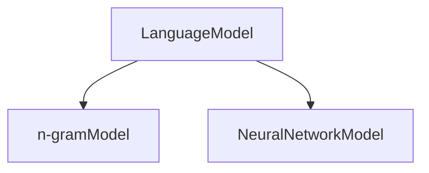
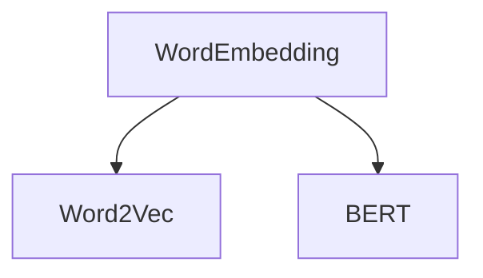
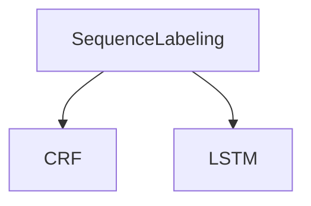

                 

### 从自然语言到提示词：编程范式的革命

---

#### 关键词：自然语言处理、编程范式、提示词、函数式编程、面向对象编程、动态类型编程

---

**摘要：**

本文旨在探讨自然语言处理与编程范式之间的深刻联系，尤其是在提示词这一概念的出现如何引发了编程范式的革命。通过逐步分析自然语言处理的挑战、编程范式的演变、核心概念的联系、以及不同编程范式在自然语言处理中的应用，本文将揭示编程范式革命对于编程语言设计、软件开发方法以及未来编程趋势的影响。最后，我们将展望编程范式革命所带来的机遇与挑战。

---

#### 第一部分：引论与背景

---

### 第1章：问题背景与编程范式的演变

#### 1.1 问题背景

自然语言处理（NLP）作为人工智能的一个重要分支，旨在让计算机能够理解和生成人类语言。然而，自然语言具有高度复杂性和多样性，这使得NLP面临巨大的挑战。传统的编程范式如命令式编程、过程式编程等在处理自然语言时显得力不从心。

#### 1.1.1 自然语言处理的挑战

- **语义理解**：自然语言的语义丰富且多变，如何让计算机准确地理解语义是一个巨大的难题。
- **语法解析**：自然语言的语法结构复杂，歧义性高，这使得语法解析变得异常困难。
- **上下文理解**：自然语言的使用往往依赖于上下文，如何有效地处理上下文信息是NLP的关键挑战。

#### 1.1.2 提示词的兴起

提示词（Prompt）作为一种新的编程范式，旨在解决自然语言处理中的复杂性问题。提示词通过将自然语言转换为计算机可理解的指令，使得计算机能够更高效地处理自然语言。

#### 1.1.3 编程范式的变革

编程范式的变革是NLP发展的关键。从命令式编程到函数式编程，从过程式编程到面向对象编程，再到动态类型编程，每一次变革都为NLP带来了新的机遇。

### 1.2 编程范式的演变

#### 1.2.1 从命令式编程到函数式编程

命令式编程注重流程控制，而函数式编程则强调函数的应用和数据的不可变。函数式编程在处理自然语言时，通过纯函数和不可变数据结构，可以减少错误和提高代码的可读性。

#### 1.2.2 从过程式编程到面向对象编程

过程式编程注重过程和算法，而面向对象编程则强调数据和方法的封装。面向对象编程在NLP中通过对象和类，使得代码更加模块化和可重用。

#### 1.2.3 从静态类型到动态类型

静态类型编程要求变量在编译时确定类型，而动态类型编程则在运行时确定类型。动态类型编程在NLP中提供了更大的灵活性，使得代码能够更好地适应多变的数据。

## 第2章：核心概念与联系

### 2.1 核心概念

#### 2.1.1 自然语言

自然语言是人类交流的基本工具，具有语义丰富、语法复杂等特点。

#### 2.1.2 提示词

提示词是一种将自然语言转换为计算机可理解指令的编程范式。

#### 2.1.3 编程范式

编程范式是指解决问题的不同方法和策略，包括命令式编程、函数式编程、面向对象编程和动态类型编程等。

### 2.2 概念属性特征对比表格

| 概念       | 特征                                  |
|------------|-------------------------------------|
| 自然语言   | 语义丰富、语法复杂、上下文依赖         |
| 提示词     | 计算机可理解、指令性、灵活性强         |
| 编程范式   | 方法不同、策略不同、适用场景不同       |

### 2.3 ER实体关系图架构

#### 2.3.1 自然语言处理系统的ER图

```mermaid
erDiagram
  NaturalLanguage ||--|{ TextProcessing } TextProcessing
  TextProcessing ||--|{ SemanticUnderstanding } SemanticUnderstanding
  TextProcessing ||--|{ SyntaxParsing } SyntaxParsing
  TextProcessing ||--|{ ContextUnderstanding } ContextUnderstanding
```

#### 2.3.2 编程范式转换的ER图

```mermaid
erDiagram
  ProgrammingParadigm ||--|{ CommandProgramming } CommandProgramming
  ProgrammingParadigm ||--|{ FunctionalProgramming } FunctionalProgramming
  ProgrammingParadigm ||--|{ ObjectOrientedProgramming } ObjectOrientedProgramming
  ProgrammingParadigm ||--|{ DynamicTyping } DynamicTyping
```

---

#### 第二部分：自然语言处理基础

---

### 第3章：自然语言处理原理

#### 3.1 基础概念

#### 3.1.1 语言模型

语言模型是NLP的基础，它通过统计语言中的概率分布，来预测下一个单词或词组。

#### 3.1.2 词嵌入

词嵌入将单词转换为密集的向量表示，以便在计算机中进行处理。

#### 3.1.3 序列标注

序列标注是对文本中的单词或词组进行分类的过程，如情感分析、命名实体识别等。

### 3.2 自然语言处理流程

#### 3.2.1 数据预处理

数据预处理是NLP的重要步骤，包括文本清洗、分词、去除停用词等。

#### 3.2.2 特征提取

特征提取是将原始文本转换为计算机可处理的特征向量。

#### 3.2.3 模型训练与优化

模型训练与优化是通过大量数据来训练模型，并不断调整模型参数，以提高模型性能。

### 3.3 算法讲解

#### 3.3.1 语言模型算法

常见的语言模型算法包括n-gram模型和神经网络模型。



#### 3.3.2 词嵌入算法

词嵌入算法如Word2Vec和BERT。



#### 3.3.3 序列标注算法

序列标注算法如CRF和LSTM。



---

### 第4章：提示词设计与应用

#### 4.1 提示词设计原则

提示词设计需要遵循以下原则：

- **清晰性**：提示词应当简洁明了，避免歧义。
- **精确性**：提示词应当准确描述所需任务。
- **适应性**：提示词应当能够适应不同的任务和数据。

#### 4.2 提示词应用场景

提示词在以下应用场景中表现出色：

- **问答系统**：通过提示词，计算机可以更好地理解用户的问题。
- **自动摘要**：提示词可以帮助自动生成文本摘要。
- **文本生成**：提示词可以指导文本生成模型生成高质量的内容。

#### 4.3 提示词优化策略

提示词优化策略包括：

- **数据增强**：通过增加数据量来提高模型性能。
- **模型调优**：通过调整模型参数来优化性能。
- **策略组合**：结合多种策略来提高提示词效果。

---

#### 第三部分：编程范式的革命

---

### 第5章：函数式编程范式

#### 5.1 函数式编程概述

函数式编程强调函数的应用和数据的不可变性，它在NLP中具有广泛应用。

#### 5.2 函数式编程在自然语言处理中的应用

函数式编程在NLP中的应用包括：

- **语言模型**：通过函数式编程，可以构建高效的语言模型。
- **文本生成**：函数式编程可以指导文本生成模型生成高质量的内容。

#### 5.3 函数式编程案例分析

以Haskell和Scala为例，分析函数式编程在自然语言处理中的应用。

---

### 第6章：面向对象编程范式

#### 6.1 面向对象编程概述

面向对象编程通过对象和类的封装，提高了代码的可重用性和可维护性。

#### 6.2 面向对象编程在自然语言处理中的应用

面向对象编程在NLP中的应用包括：

- **语言模型**：通过面向对象编程，可以构建模块化的语言模型。
- **文本生成**：面向对象编程可以帮助文本生成模型更好地处理复杂数据。

#### 6.3 面向对象编程案例分析

以Java和Python为例，分析面向对象编程在自然语言处理中的应用。

---

#### 第四部分：动态类型编程范式

---

### 第7章：动态类型编程范式

#### 7.1 动态类型编程概述

动态类型编程在NLP中提供了更大的灵活性，它允许变量在运行时确定类型。

#### 7.2 动态类型编程在自然语言处理中的应用

动态类型编程在NLP中的应用包括：

- **语言模型**：通过动态类型编程，可以构建灵活的语言模型。
- **文本生成**：动态类型编程可以帮助文本生成模型更好地适应多变的数据。

#### 7.3 动态类型编程案例分析

以JavaScript和Ruby为例，分析动态类型编程在自然语言处理中的应用。

---

### 第8章：编程范式革命的影响与展望

#### 8.1 编程范式革命的影响

编程范式革命对编程语言设计、软件开发方法产生了深远影响。

#### 8.2 编程范式革命的展望

未来编程范式将继续发展，提示词将在其中发挥重要作用。

#### 8.3 自然语言处理在编程范式革命中的挑战与机遇

自然语言处理在编程范式革命中既面临挑战，也充满机遇。

---

**作者：AI天才研究院/AI Genius Institute & 禅与计算机程序设计艺术 /Zen And The Art of Computer Programming**

