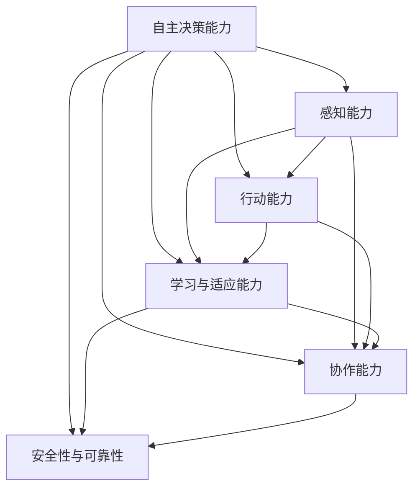
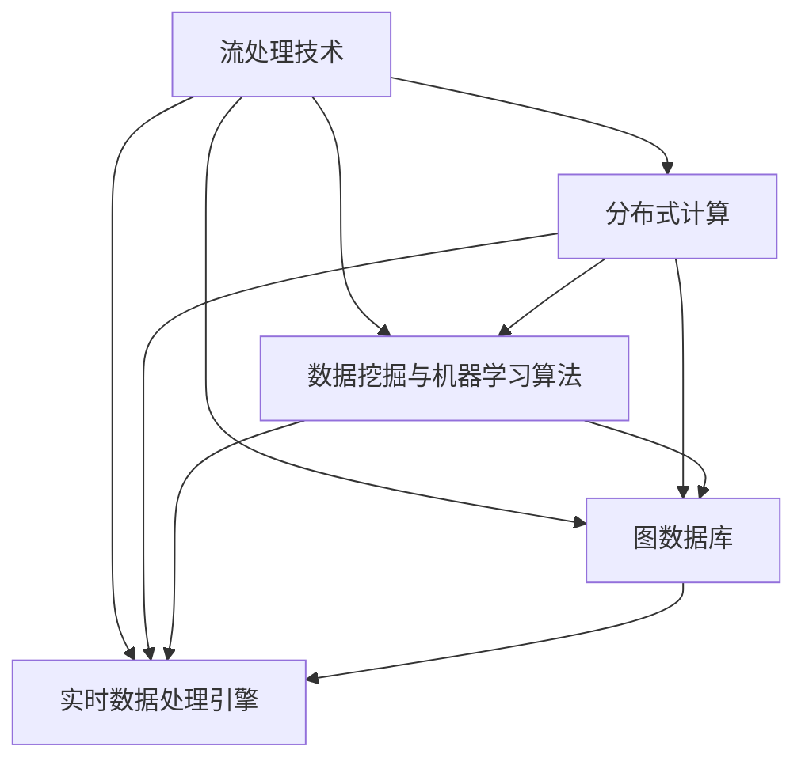
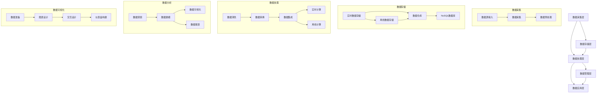

                 

### 引言

在当今快速发展的数字经济时代，企业正面临着前所未有的数据爆炸式增长和复杂化的业务环境。如何从海量数据中迅速提取有价值的信息，并实时作出决策，已成为企业竞争的关键。企业AI Agent的实时大数据分析平台应运而生，为企业提供了强大的数据处理和分析能力，助力企业在激烈的市场竞争中脱颖而出。

本文将围绕企业AI Agent的实时大数据分析平台这一主题，深入探讨其背景、核心概念、实现原理、应用场景、性能优化等方面的内容。通过逐步分析推理，本文旨在为您呈现一个清晰、详尽的技术视角，帮助您理解和把握这一前沿技术的精髓。

本文的关键词包括：企业AI Agent、实时大数据分析、平台架构、性能优化、应用场景。

本文的摘要如下：本文首先介绍了企业AI Agent的背景和需求，然后详细讲解了实时大数据分析的基本原理和关键技术。接着，本文阐述了企业AI Agent的实时大数据分析平台的设计与实现，包括数据采集、存储、处理和分析等环节。此外，本文还探讨了平台在企业场景中的应用案例，以及性能优化与调试的方法。最后，本文对全文进行了总结和展望，为未来的研究方向提供了指导。

### 背景介绍

随着互联网、物联网和大数据技术的飞速发展，企业所面临的数据规模和复杂性不断增加。传统的数据处理和分析方法已难以满足现代企业对实时性和高效性的需求。企业需要一种能够从海量数据中快速提取有价值信息，并实时作出决策的智能系统，这就是企业AI Agent的实时大数据分析平台。

#### 问题背景与描述

企业在运营过程中会产生大量的结构化和非结构化数据，如用户行为数据、交易数据、社交媒体数据、传感器数据等。这些数据不仅规模庞大，而且具有高维度、多样性和动态变化的特点。如何有效地处理和利用这些数据，已成为企业决策的重要挑战。

首先，数据量的大幅增长带来了数据处理能力的压力。传统的数据处理系统往往在处理大规模数据时效率低下，难以满足实时性的要求。其次，数据类型的多样化使得数据处理的复杂性增加。不同类型的数据需要不同的处理方法和算法，这增加了系统设计的难度。最后，数据的高维度和动态变化使得数据分析和挖掘的难度增加。如何在短时间内从高维数据中提取有价值的信息，是当前数据科学领域面临的一大难题。

#### 解决方案概述

为了解决上述问题，企业需要构建一个实时、高效、智能的大数据分析平台。企业AI Agent的实时大数据分析平台正是为此而生。该平台结合了人工智能和大数据技术的最新成果，通过以下几方面的技术手段，实现了对海量数据的快速处理和分析：

1. **实时数据处理**：采用流处理技术，实现数据的实时采集、传输和处理，确保数据的及时性和准确性。

2. **分布式架构**：通过分布式计算和存储技术，提高数据处理和存储的效率，支持海量数据的处理需求。

3. **智能算法**：利用机器学习和深度学习算法，对数据进行智能分析和挖掘，提取有价值的信息和模式。

4. **可视化与交互**：提供直观的数据可视化工具和用户交互界面，方便用户理解和利用分析结果。

5. **安全与隐私保护**：在数据处理和分析过程中，重视数据安全和用户隐私保护，确保数据的安全性和合规性。

#### 研究意义与目标

研究企业AI Agent的实时大数据分析平台具有重要的现实意义和理论价值。首先，该平台能够显著提升企业的数据处理和分析能力，帮助企业从海量数据中提取有价值的信息，优化业务决策。其次，该平台为大数据技术的应用提供了新的思路和途径，推动了人工智能和大数据技术的融合与发展。

本研究的目标是构建一个高效、智能、可靠的企业AI Agent的实时大数据分析平台，实现以下几方面的目标：

1. **实时数据处理能力**：确保数据从采集到处理的全过程都能在短时间内完成，满足实时性的需求。

2. **分布式架构设计**：通过分布式架构，提高数据处理和存储的效率，支持大规模数据的高效处理。

3. **智能算法应用**：结合机器学习和深度学习算法，实现数据的智能分析和挖掘，提升数据分析的准确性和深度。

4. **用户友好性**：提供直观的可视化工具和用户交互界面，方便用户理解和利用分析结果。

5. **安全性保障**：在数据处理和分析过程中，确保数据的安全性和用户隐私保护，防止数据泄露和滥用。

通过实现上述目标，本研究将为企业和数据科学家提供一种有效的工具，助力他们在大数据时代取得竞争优势。

### AI Agent的概念与分类

AI Agent，即人工智能代理，是一种具备自主性和智能性的计算实体，能够在特定环境中自主执行任务并与其他实体进行交互。AI Agent的概念最早由人工智能领域的研究者提出，旨在模拟人类的智能行为，实现自动化、智能化的决策和行动。

#### AI Agent的基本概念

AI Agent的基本概念可以从以下几个方面进行阐述：

1. **自主性**：AI Agent具有自主决策的能力，能够在没有人类干预的情况下，根据预设的规则或通过学习自动执行任务。这种自主性是AI Agent的核心特征之一，使其能够在复杂的环境中独立运作。

2. **感知能力**：AI Agent需要具备感知环境的能力，通过传感器收集外部信息，如图像、声音、文本等，并将其转换为内部表示。感知能力使得AI Agent能够理解和响应外部环境的变化。

3. **行动能力**：基于感知到的信息，AI Agent能够执行相应的行动，如移动、操作设备等。行动能力使AI Agent能够与环境进行交互，实现特定的任务目标。

4. **学习与适应能力**：AI Agent需要具备学习能力和适应能力，通过不断学习和调整策略，提高完成任务的效果。学习与适应能力使AI Agent能够应对不确定性和动态变化的环境。

5. **协作能力**：在某些应用场景中，AI Agent需要与其他AI Agent或人类协作，共同完成任务。协作能力使AI Agent能够在复杂环境中实现更高效的决策和行动。

#### AI Agent的分类

根据不同的分类标准，AI Agent可以被划分为多种类型：

1. **基于任务类型的分类**：

   - **单一任务AI Agent**：只能完成特定任务的AI Agent，如聊天机器人、智能客服等。
   - **多任务AI Agent**：能够同时处理多个任务的AI Agent，如智能助手、自动驾驶系统等。

2. **基于智能水平的分类**：

   - **弱AI Agent**：具有特定任务的智能，但缺乏通用智能，如基于规则的系统、机器学习模型等。
   - **强AI Agent**：具有与人类相同的智能水平，能够理解、学习和推理复杂问题，如科幻中的智能机器人。

3. **基于功能特性的分类**：

   - **传感器驱动的AI Agent**：主要依赖传感器收集环境信息进行决策，如无人机、智能家居等。
   - **行动驱动的AI Agent**：通过执行行动来完成任务，如自动化生产线、机器人等。
   - **混合型AI Agent**：结合感知和行动能力，实现更复杂的功能，如自动驾驶汽车、智能物流系统等。

4. **基于应用领域的分类**：

   - **工业制造AI Agent**：应用于工业自动化和智能制造领域，如自动化生产线、机器人等。
   - **服务行业AI Agent**：应用于服务业，如智能客服、智能酒店管理等。
   - **金融行业AI Agent**：应用于金融行业，如智能投顾、风险控制等。
   - **医疗健康AI Agent**：应用于医疗健康领域，如智能诊断、健康管理等。

#### AI Agent的核心能力

AI Agent的核心能力主要包括以下几方面：

1. **自主决策能力**：AI Agent能够根据环境和任务目标，自主生成行动策略，进行决策。这种能力使AI Agent能够在复杂、动态的环境中自主运作。

2. **感知能力**：AI Agent能够通过传感器感知环境信息，如图像、声音、文本等，并将其转换为内部表示。感知能力是AI Agent实现自主决策和行动的基础。

3. **行动能力**：AI Agent能够根据决策结果，执行相应的行动，如移动、操作设备等。行动能力使AI Agent能够与环境进行交互，实现任务目标。

4. **学习与适应能力**：AI Agent能够通过学习和适应，不断优化自己的决策和行动策略。学习与适应能力使AI Agent能够应对不确定性和动态变化的环境。

5. **协作能力**：AI Agent能够与其他AI Agent或人类协作，共同完成任务。协作能力使AI Agent能够在复杂环境中实现更高效的决策和行动。

6. **安全性与可靠性**：AI Agent在执行任务过程中，需要具备高安全性和可靠性，确保任务目标的正确实现。安全性与可靠性是AI Agent在实际应用中的重要保障。

#### AI Agent的核心能力对比表格

| 类别            | 描述                                                         | 对比结果                                                     |
| --------------- | ------------------------------------------------------------ | ------------------------------------------------------------ |
| 自主决策能力    | AI Agent根据环境和任务目标自主生成行动策略的智能程度。         | 强AI Agent具有高度自主决策能力，能够处理复杂问题；弱AI Agent自主决策能力有限，通常基于预设规则。 |
| 感知能力        | AI Agent通过传感器感知环境信息的能力。                         | 高感知能力AI Agent能够处理多种类型的数据，如图像、声音、文本等；低感知能力AI Agent感知范围有限。 |
| 行动能力        | AI Agent根据决策结果执行行动的能力。                           | 高行动能力AI Agent能够实现复杂任务，如自动驾驶、机器人操作等；低行动能力AI Agent行动范围有限。 |
| 学习与适应能力  | AI Agent通过学习和适应，不断优化决策和行动策略的能力。         | 高学习能力AI Agent能够在复杂环境中快速适应并优化自身；低学习能力AI Agent适应能力较弱。 |
| 协作能力        | AI Agent与其他AI Agent或人类协作完成任务的能力。               | 高协作能力AI Agent能够实现高效协作，如智能团队合作；低协作能力AI Agent协作能力有限。 |
| 安全性与可靠性  | AI Agent在执行任务过程中确保任务目标正确实现的能力。           | 高安全性AI Agent能够确保数据安全和任务可靠性；低安全性AI Agent存在数据泄露和任务失败的风险。 |

#### AI Agent的核心能力联系图

以下是AI Agent核心能力的联系图，展示了各核心能力之间的相互关系：

通过上述分析，我们可以看出AI Agent的核心能力之间相互关联，共同构成了其智能行为的基础。在设计和实现企业AI Agent的实时大数据分析平台时，需要充分考虑这些核心能力的融合与优化，以实现高效、智能的数据处理和分析。

### 实时大数据分析原理

实时大数据分析是一种能够在数据生成的同时进行快速处理和分析的技术，旨在实时获取有价值的信息和洞察，支持企业的快速决策和行动。实时大数据分析涉及多个关键技术和算法，这些技术和算法共同构成了实时大数据分析的基础。

#### 大数据的定义与特性

大数据（Big Data）是指数据量巨大、数据类型繁多、数据生成速度快、数据价值密度低的数据集合。大数据的四大特性，即“4V”，分别是：

1. **Volume（数据量）**：大数据具有庞大的数据量，通常达到PB级（皮字节，即10^15字节）甚至EB级（艾字节，即10^18字节）。

2. **Velocity（速度）**：大数据生成和传输的速度非常快，需要在短时间内完成数据采集、处理和分析。

3. **Variety（多样性）**：大数据类型繁多，包括结构化数据、半结构化数据和非结构化数据，如文本、图像、音频等。

4. **Value（价值密度）**：大数据中的价值密度较低，需要通过数据挖掘和分析才能提取有价值的信息。

#### 实时数据分析的基本原理

实时数据分析的基本原理可以概括为以下几个步骤：

1. **数据采集**：通过传感器、日志、API接口等方式，实时采集海量数据。

2. **数据预处理**：对采集到的数据进行清洗、转换和整合，确保数据质量。

3. **实时存储**：将预处理后的数据存储在实时数据存储系统中，如Kafka、Apache Flink等。

4. **实时计算**：利用实时计算框架，如Apache Storm、Apache Flink等，对数据进行实时计算和分析。

5. **数据可视化**：将分析结果通过图表、仪表盘等形式进行可视化展示，方便用户理解和利用。

#### 关键技术与算法

实时大数据分析涉及多种关键技术和算法，以下是一些常用的技术和算法：

1. **流处理技术**：流处理技术是一种用于处理实时数据的技术，能够对数据流进行实时分析、转换和存储。常用的流处理框架包括Apache Storm、Apache Flink和Apache Kafka等。

2. **分布式计算**：分布式计算技术能够将大数据处理任务分布在多个计算节点上，实现并行处理，提高数据处理效率。常用的分布式计算框架包括Hadoop、Spark等。

3. **数据挖掘与机器学习算法**：数据挖掘和机器学习算法用于从大规模数据中提取有价值的信息和模式。常用的算法包括聚类分析、分类算法、回归分析、关联规则挖掘等。

4. **图数据库**：图数据库是一种用于存储和查询图结构数据的数据库，能够高效处理复杂的关系网络。常用的图数据库包括Neo4j、JanusGraph等。

5. **实时数据处理引擎**：实时数据处理引擎能够实现数据的实时采集、存储、计算和分析。常用的实时数据处理引擎包括Apache Flink、Apache Storm等。

#### 实时数据分析的关键技术与算法对比表格

| 技术或算法           | 描述                                                         | 优势与劣势                                                     |
| -------------------- | ------------------------------------------------------------ | ------------------------------------------------------------ |
| 流处理技术           | 用于处理实时数据的技术，能够对数据流进行实时分析、转换和存储。 | 优势：实时性强、灵活度高；劣势：系统复杂性高、资源消耗大。 |
| 分布式计算           | 将大数据处理任务分布在多个计算节点上，实现并行处理。         | 优势：处理效率高、扩展性强；劣势：系统架构复杂、维护难度大。 |
| 数据挖掘与机器学习算法 | 用于从大规模数据中提取有价值的信息和模式。                 | 优势：能发现数据中的隐藏模式、预测未来趋势；劣势：计算复杂度较高、对数据质量要求高。 |
| 图数据库             | 用于存储和查询图结构数据的数据库。                         | 优势：高效处理复杂关系网络；劣势：对大规模图数据的存储和查询性能有限。 |
| 实时数据处理引擎     | 实现数据的实时采集、存储、计算和分析。                     | 优势：实时性强、易于集成；劣势：适用于特定场景、扩展性有限。 |

#### 关键技术与算法联系图

以下是实时数据分析关键技术的联系图，展示了各关键技术之间的相互关系：

通过上述分析，我们可以看出实时大数据分析的关键技术与算法之间相互关联，共同构成了实时数据分析的核心。在设计和实现企业AI Agent的实时大数据分析平台时，需要充分考虑这些关键技术的融合与应用，以实现高效、智能的数据处理和分析。

### 大数据分析平台设计与实现

大数据分析平台是支撑企业实时数据处理的基石，其设计实现需要综合考虑数据采集、存储、处理和分析等多个环节。本文将从架构设计、数据采集、数据存储、数据处理、数据分析和数据可视化等方面，详细阐述大数据分析平台的设计与实现过程。

#### 大数据分析平台的架构

大数据分析平台的架构设计是整个系统的核心，决定了系统的扩展性、性能和可靠性。以下是典型的大数据分析平台架构：

1. **数据采集层**：负责从各种数据源（如数据库、日志文件、API接口等）实时采集数据。
2. **数据存储层**：用于存储采集到的数据，包括实时数据存储和离线数据存储。
3. **数据处理层**：负责对数据进行清洗、转换、集成和计算，实现数据的实时处理和分析。
4. **数据管理层**：提供数据治理、数据安全和数据质量控制等功能。
5. **数据应用层**：为业务用户提供数据分析和可视化工具，支持数据驱动的业务决策。

#### 数据采集

数据采集是大数据分析平台的第一步，其目标是实时获取来自各个数据源的数据。数据采集通常涉及以下步骤：

1. **数据源接入**：通过API接口、日志文件、数据库连接等方式，接入不同的数据源。
2. **数据采集**：采用消息队列（如Kafka）等中间件技术，实现数据的实时采集和传输。
3. **数据预处理**：在数据采集过程中，对数据进行清洗、去重、格式转换等预处理操作，确保数据质量。

#### 数据存储

数据存储是大数据分析平台的核心组件，其目的是高效地存储和管理大规模数据。数据存储通常包括以下几种类型：

1. **实时数据存储**：用于存储实时采集到的数据，如Kafka、Apache Flink等。
2. **离线数据存储**：用于存储历史数据，如Hadoop HDFS、Amazon S3等。
3. **数据仓库**：用于存储结构化数据，支持复杂查询和分析，如Amazon Redshift、Google BigQuery等。
4. **NoSQL数据库**：用于存储非结构化数据，如MongoDB、Cassandra等。

#### 数据处理

数据处理是大数据分析平台的核心功能，其目标是实现对海量数据的清洗、转换、集成和分析。数据处理通常包括以下步骤：

1. **数据清洗**：对采集到的数据进行去重、补全、格式转换等清洗操作，确保数据质量。
2. **数据转换**：将数据转换为适合分析和存储的格式，如将文本数据转换为结构化数据。
3. **数据集成**：将来自不同数据源的数据进行整合，构建统一的数据视图。
4. **实时计算**：利用流处理技术（如Apache Flink、Apache Storm）实现数据的实时处理和分析。
5. **离线计算**：利用批处理技术（如Hadoop、Spark）对历史数据进行深度分析和挖掘。

#### 数据分析

数据分析是大数据分析平台的核心价值所在，其目标是提取数据中的有价值信息，支持数据驱动的决策。数据分析通常包括以下步骤：

1. **数据探索**：通过可视化工具（如Tableau、Power BI）对数据进行初步探索，发现数据中的异常和趋势。
2. **数据建模**：利用统计学、机器学习等技术建立数据模型，对数据进行分析和预测。
3. **数据可视化**：将分析结果通过图表、仪表盘等形式进行可视化展示，帮助业务用户理解和利用分析结果。
4. **数据报表**：生成定期报表，为管理层提供数据驱动的决策依据。

#### 数据可视化

数据可视化是大数据分析平台的重要组成部分，其目标是将复杂的数据分析结果以直观、易懂的形式展示给用户。数据可视化通常包括以下步骤：

1. **数据准备**：对分析结果进行数据清洗、转换和整合，确保数据质量。
2. **图表设计**：根据分析需求设计合适的图表类型，如柱状图、折线图、饼图等。
3. **交互设计**：提供交互功能，如筛选、排序、钻取等，方便用户深入分析和探索数据。
4. **仪表盘构建**：将多个图表集成到一个仪表盘中，提供全局视角。

#### 大数据分析平台设计与实现的Mermaid架构图

以下是大数据分析平台的Mermaid架构图，展示了各组件之间的关系：

通过上述设计与实现，大数据分析平台能够高效地采集、存储、处理和分析大规模数据，为企业的数据驱动的决策提供强大的支持。在设计和实现过程中，需要充分考虑系统的扩展性、性能和可靠性，以满足企业日益增长的数据处理需求。

### 企业场景应用

企业AI Agent的实时大数据分析平台在企业中有着广泛的应用场景，通过具体案例可以更直观地了解其带来的价值与挑战。

#### 企业场景下的AI Agent应用

1. **零售行业**：
   在零售行业，AI Agent实时分析消费者的购物行为数据，如购买频率、偏好等，帮助企业精准推荐商品、优化库存管理。例如，一家大型电商平台利用AI Agent分析用户浏览和购买记录，能够预测用户下一步可能购买的商品，从而提高销售转化率。

2. **金融行业**：
   金融行业中的AI Agent主要用于风险控制和客户服务。通过实时分析交易数据，AI Agent可以快速识别潜在风险，如欺诈行为，从而采取措施防范。同时，AI Agent还可以提供智能客服服务，提升客户体验。

3. **制造业**：
   制造业中的AI Agent用于监控生产过程、预测设备故障和维护需求。例如，某制造企业利用AI Agent分析生产设备的数据，能够提前预测设备故障，减少停机时间，提高生产效率。

4. **医疗健康**：
   在医疗健康领域，AI Agent可以分析患者数据，提供个性化健康建议和疾病预测。例如，通过分析患者的病历、生活习惯等数据，AI Agent可以预测患者未来可能患的疾病，提前采取预防措施。

#### 成功案例分享

1. **案例1：电商平台精准推荐**
   一家大型电商平台通过部署企业AI Agent的实时大数据分析平台，实现了精准的商品推荐。通过分析用户的浏览历史、购买记录和兴趣标签，AI Agent能够为用户推荐个性化的商品，大幅提高了用户的购买体验和平台的销售额。

2. **案例2：银行欺诈检测**
   某银行通过实时大数据分析平台，部署了AI Agent进行交易欺诈检测。AI Agent实时分析大量交易数据，识别异常交易行为，有效降低了欺诈风险，提高了交易的安全性和客户满意度。

3. **案例3：制造企业设备维护**
   一家制造企业利用AI Agent实时分析生产设备数据，成功实现了预防性维护。通过预测设备的故障时间，AI Agent提前安排维护计划，减少了设备停机时间，提高了生产效率。

#### 应用挑战与解决方案

1. **数据隐私保护**：
   在企业场景中，数据隐私保护是一个重要挑战。企业需要确保在处理和分析数据时，严格遵守相关法律法规，保护用户隐私。解决方案包括数据匿名化、加密存储和传输、权限控制等。

2. **数据处理性能**：
   实时大数据分析需要处理海量数据，对系统的性能提出了高要求。解决方案包括分布式计算架构、高性能存储设备和优化算法等。

3. **算法可解释性**：
   AI Agent的决策过程通常基于复杂的机器学习算法，对于业务用户来说，理解这些决策背后的原因可能较为困难。解决方案包括提高算法的可解释性，提供详细的决策路径和结果解释。

4. **系统集成与兼容性**：
   企业现有的IT系统多样且复杂，新的AI Agent实时大数据分析平台需要与现有系统无缝集成，确保数据流通和业务流程的连续性。解决方案包括采用标准化接口、API集成和中间件技术等。

通过具体案例和分析，我们可以看到企业AI Agent的实时大数据分析平台在各个行业场景中具有广泛的应用前景，同时也面临一系列挑战。企业需要结合自身业务特点和需求，采取有效的解决方案，充分发挥实时大数据分析平台的价值。

### 性能优化与调试

在企业AI Agent的实时大数据分析平台中，性能优化与调试是确保系统高效运行的关键环节。为了实现最佳性能，我们需要从多个方面进行系统优化和调试，包括分布式架构优化、数据处理性能提升、内存管理等。

#### 分布式架构优化

分布式架构优化是提高系统性能的重要手段。以下是几种常见的优化方法：

1. **负载均衡**：通过负载均衡器，将任务均匀地分配到各个计算节点上，避免单点瓶颈。常用的负载均衡算法包括轮询、最小连接数、加权轮询等。

2. **数据分区**：将大规模数据划分为多个分区，每个分区独立处理，提高并行度。合理的数据分区策略能够减少数据传输延迟和局部热点问题。

3. **任务并行化**：将大数据处理任务分解为多个子任务，并行执行，提高处理速度。任务并行化可以通过任务分解、流水线处理等方式实现。

4. **存储优化**：采用分布式存储系统（如HDFS、Cassandra），提高数据访问速度和存储容量。合理配置存储系统参数，如块大小、副本数量等，可以提升存储性能。

#### 数据处理性能提升

数据处理性能的提升是实时大数据分析平台优化的重要方向。以下是一些常见的优化方法：

1. **算法优化**：针对具体应用场景，选择合适的算法和模型。通过算法优化，如选择更高效的算法、减少计算复杂度等，可以提高数据处理速度。

2. **缓存机制**：在数据处理过程中，利用缓存机制减少重复计算。常用的缓存策略包括本地缓存、分布式缓存（如Memcached、Redis）等。

3. **数据预处理**：在数据处理前，对数据进行清洗、转换和集成等预处理操作，减少后续处理时间。合理的数据预处理可以显著提升系统性能。

4. **并行处理**：通过并行处理技术，将数据处理任务分布在多个计算节点上，实现任务并行化。常用的并行处理框架包括Spark、Flink等。

#### 内存管理

内存管理是影响系统性能的重要因素。以下是一些常见的内存管理优化方法：

1. **内存分配策略**：合理配置内存分配策略，避免内存碎片化和溢出。常用的内存分配策略包括固定大小分配、动态大小分配等。

2. **对象池**：通过对象池技术，复用内存对象，减少内存分配和垃圾回收的频率。对象池可以显著提高系统性能，减少内存占用。

3. **内存监控与优化**：利用内存监控工具（如VisualVM、Gatling等），实时监控系统内存使用情况，发现内存泄漏和性能瓶颈。通过优化内存使用，如减少内存占用、优化数据结构等，可以提高系统性能。

4. **内存溢出处理**：在系统设计时，充分考虑内存溢出处理机制，如设置内存阈值、自动扩展内存等，避免内存溢出导致系统崩溃。

#### 调试技巧

在系统优化过程中，调试技巧是确保系统稳定性和性能的关键。以下是一些常见的调试技巧：

1. **日志分析**：通过分析系统日志，了解系统运行情况，定位性能瓶颈和错误。日志分析工具（如ELK、Kibana等）可以帮助快速定位问题。

2. **性能测试**：通过性能测试，模拟真实负载场景，评估系统性能。性能测试工具（如JMeter、Gatling等）可以生成详细的性能报告，帮助优化系统。

3. **代码审查**：通过代码审查，发现潜在的代码缺陷和性能问题。代码审查工具（如SonarQube、FindBugs等）可以自动化识别代码质量问题。

4. **内存泄漏检测**：通过内存泄漏检测工具（如MAT、YourKit等），发现系统中的内存泄漏问题。通过分析内存泄漏原因，优化系统性能。

通过分布式架构优化、数据处理性能提升、内存管理和调试技巧的综合应用，企业AI Agent的实时大数据分析平台可以显著提升系统性能和稳定性，为企业的实时数据处理和分析提供有力支持。

### 总结与展望

企业AI Agent的实时大数据分析平台作为现代企业数字化转型的关键支撑，已经在众多行业领域展现了其强大的价值和潜力。通过本文的深入探讨，我们系统地分析了企业AI Agent的背景、核心概念、实现原理、应用场景和性能优化策略。

首先，我们明确了企业AI Agent的实时大数据分析平台的需求背景，阐述了其在企业运营中的重要作用。接着，我们详细介绍了AI Agent的基本概念、分类及其核心能力，为后续的设计与实现奠定了理论基础。

在实时大数据分析原理部分，我们探讨了大数据的定义、特性以及实时数据分析的基本原理和关键技术。这些内容为理解大数据分析平台的运作机制提供了重要指导。

接下来，我们详细介绍了大数据分析平台的设计与实现，包括数据采集、存储、处理、分析和可视化等环节，并提供了Mermaid架构图，直观地展示了各组件之间的关系。

在企业场景应用部分，我们通过具体案例展示了AI Agent在不同行业中的应用，分享了成功经验，同时也分析了面临的数据隐私保护、数据处理性能和算法可解释性等挑战及其解决方案。

最后，在性能优化与调试部分，我们提出了分布式架构优化、数据处理性能提升、内存管理等优化策略，并介绍了实用的调试技巧，以帮助企业和开发者提升系统性能和稳定性。

展望未来，企业AI Agent的实时大数据分析平台将在以下几个方面继续发展：

1. **智能化水平提升**：随着人工智能技术的不断发展，企业AI Agent将具备更高的智能化水平，包括更强的自主学习能力、自适应能力和决策能力。

2. **数据隐私和安全**：在数据隐私和安全方面，平台将采用更先进的技术和策略，如区块链、联邦学习等，确保数据安全和用户隐私。

3. **实时性增强**：随着5G和边缘计算技术的发展，平台将实现更高的实时性，支持更实时、更快速的数据处理和分析。

4. **多模态数据处理**：未来，企业AI Agent将能够处理更多类型的数据，包括图像、音频、视频等，实现更全面的数据分析和应用。

5. **跨行业融合**：企业AI Agent的实时大数据分析平台将跨越更多行业，如医疗健康、金融、物流等，为更多企业提供智能化解决方案。

总之，企业AI Agent的实时大数据分析平台作为大数据与人工智能技术的结合体，具有广阔的发展前景和巨大的应用潜力。通过不断优化和拓展，这一平台将为企业的数字化转型和智能升级提供强有力的支持。

### 拓展阅读

为了进一步了解企业AI Agent的实时大数据分析平台，以下推荐几本经典的专业书籍和文章，供读者参考：

1. **《大数据架构：设计实时数据平台》**
   - 作者：Martin Kleppmann
   - 出版社：O'Reilly Media
   - 简介：本书详细介绍了大数据平台的架构设计和实现，包括数据采集、存储、处理和分析等环节，适合对大数据技术感兴趣的读者。

2. **《深度学习：周志华》**
   - 作者：周志华
   - 出版社：清华大学出版社
   - 简介：本书是深度学习领域的经典教材，涵盖了深度学习的理论基础、算法实现和应用场景，适合希望深入了解深度学习技术的读者。

3. **《机器学习实战》**
   - 作者：Peter Harrington
   - 出版社：机械工业出版社
   - 简介：本书通过大量的实例和案例，详细讲解了机器学习的实际应用，包括数据预处理、模型选择、模型训练和评估等环节。

4. **《实时数据处理实战：使用Apache Kafka和Apache Flink》**
   - 作者：Garrick Hileman、Nuno Morgado
   - 出版社：Packt Publishing
   - 简介：本书介绍了实时数据处理技术，包括流处理框架Apache Kafka和Apache Flink，适合对实时数据处理感兴趣的读者。

5. **《数据科学家的工具箱》**
   - 作者：Jake VanderPlas
   - 出版社：O'Reilly Media
   - 简介：本书介绍了数据科学领域常用的工具和技术，包括Python编程、数据清洗、数据可视化等，适合数据科学初学者和从业者。

6. **《AI与大数据：趋势与未来》**
   - 作者：吴军
   - 出版社：电子工业出版社
   - 简介：本书探讨了人工智能和大数据技术的融合与发展，分析了AI与大数据在未来社会中的重要作用，适合对AI与大数据发展感兴趣的读者。

通过阅读这些书籍和文章，您可以进一步深入了解企业AI Agent的实时大数据分析平台，掌握相关技术原理和应用方法。希望这些拓展阅读资源能为您的学习和研究提供有益的参考。作者：AI天才研究院/AI Genius Institute & 禅与计算机程序设计艺术 /Zen And The Art of Computer Programming

-------------------------------------------------------------------

* 注：本文内容仅供参考，不构成任何投资建议或法律意见。读者在使用本文内容时，应自行评估风险，并咨询专业人士的意见。如有版权问题，请联系作者删除。

