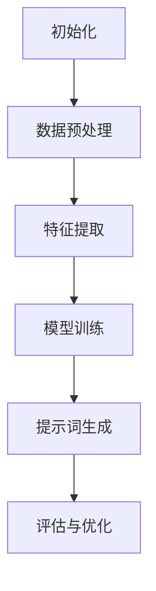
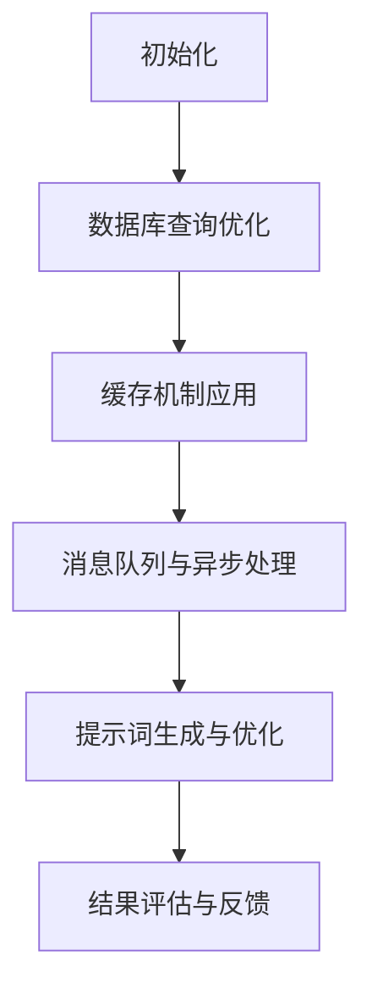
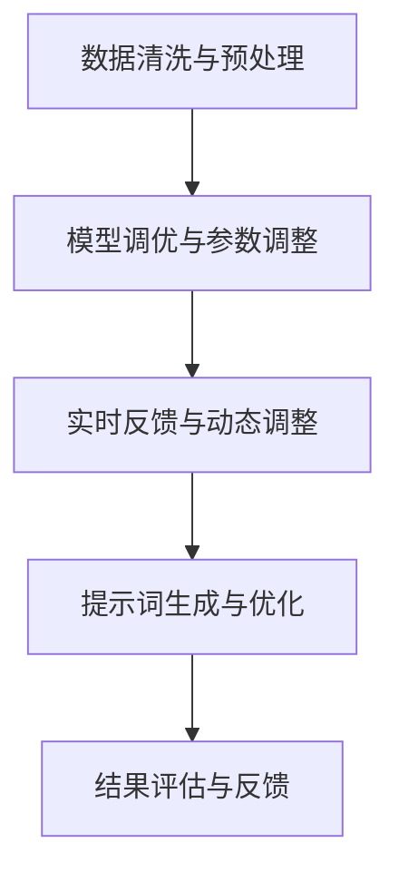
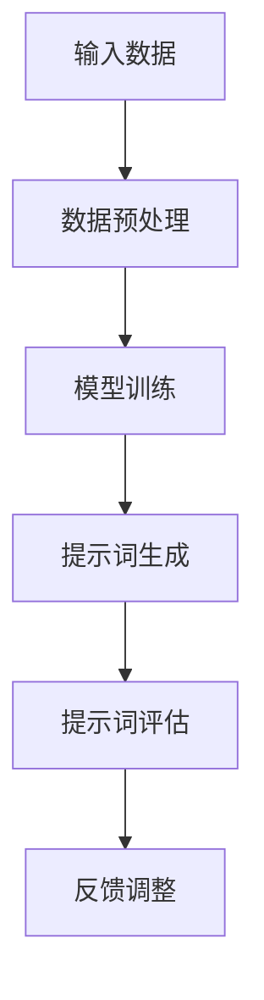
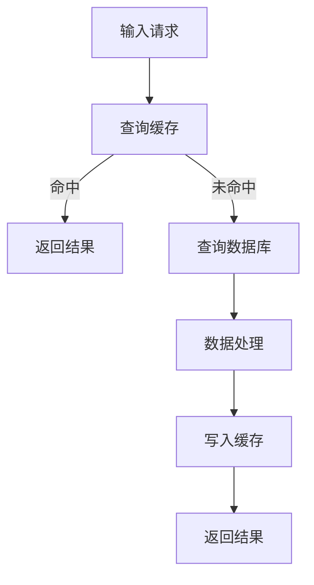
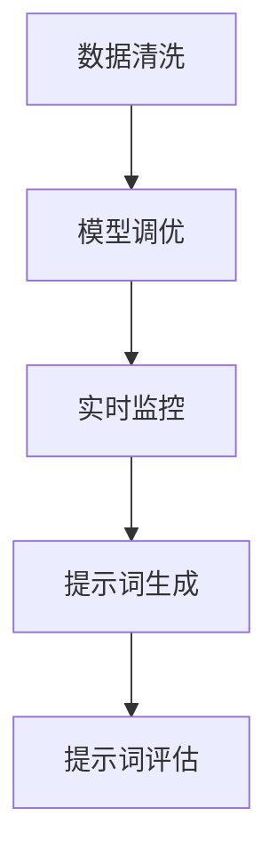
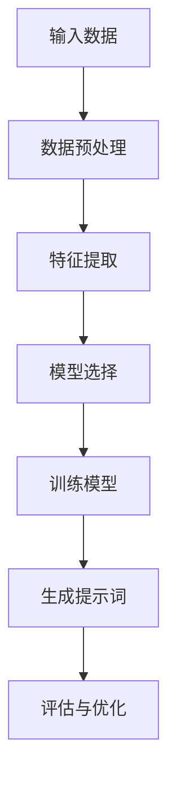
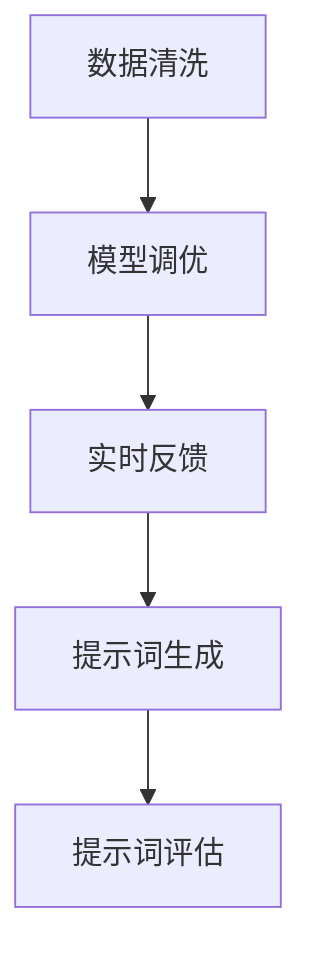

                 

# 企业级提示词管理：大规模AI应用的挑战与对策

## 关键词

- 企业级提示词管理
- 大规模AI应用
- 数据质量
- 模型优化
- 安全性与隐私保护

## 摘要

随着人工智能技术的迅猛发展，企业级AI应用在各个行业中扮演着越来越重要的角色。然而，大规模AI应用的普及也带来了诸多挑战，其中之一便是企业级提示词管理。本文旨在探讨企业级提示词管理的核心概念、挑战与对策，通过详细的案例分析、算法原理讲解和最佳实践分享，为企业提供有效的提示词管理策略，以应对大规模AI应用的挑战。

## 第一部分：背景与核心概念

### 第1章：问题背景与核心概念

#### 1.1.1 企业级提示词管理的意义

企业级提示词管理是指在人工智能应用中，对企业内部使用的提示词进行系统化管理的一系列活动。提示词在AI应用中起到指导模型训练、优化模型性能和提升用户体验的关键作用。有效的提示词管理能够提高AI模型的准确性和可靠性，从而推动企业级AI应用的健康发展。

#### 1.1.2 大规模AI应用的挑战

大规模AI应用面临的主要挑战包括：

1. **数据量与复杂性**：随着数据量的爆炸性增长，如何处理海量且复杂的数据成为一大难题。
2. **模型训练与部署**：训练大规模模型需要巨大的计算资源和时间成本，如何高效地进行模型训练与部署是一个重要的课题。
3. **安全性与隐私保护**：AI应用中的数据安全和隐私保护是必须重视的问题。

#### 1.1.3 提示词管理的主要挑战

企业级提示词管理主要面临的挑战包括：

1. **提示词生成与质量**：生成高质量的提示词是提示词管理的关键，但如何保证提示词的准确性和有效性是一个难题。
2. **提示词管理效率**：如何高效地管理大量提示词，使其能够在模型训练和部署中发挥作用，是一个重要的课题。
3. **提示词的可解释性与可靠性**：提示词的可解释性和可靠性对于AI模型的解释和信任至关重要。

#### 1.1.4 提示词管理的边界与外延

1. **提示词的定义与分类**：提示词可以定义为用于引导AI模型学习的数据片段，根据用途可以分为训练提示词、测试提示词等。
2. **提示词在各类AI应用中的具体应用场景**：提示词在自然语言处理、图像识别、推荐系统等AI应用中都有广泛应用。

#### 1.1.5 核心概念与联系

企业级提示词管理涉及多个核心概念，如数据质量、数据治理、模型评估与优化等。这些概念之间相互联系，共同构成了企业级提示词管理的体系结构。

### 第2章：企业级提示词管理的核心概念

#### 2.1.1 提示词生成算法原理

提示词生成算法是提示词管理的重要组成部分。常见的提示词生成算法包括基于规则的方法、基于机器学习的方法和基于深度学习的方法。这些算法各有优缺点，适用于不同的应用场景。

#### 2.1.2 提示词生成算法的mermaid流程图

使用mermaid流程图可以清晰地展示提示词生成算法的流程。例如：



#### 2.1.3 提示词生成算法的Python源代码实现

以下是一个简单的基于规则的方法生成提示词的Python示例：

```python
import random

def generate_hint(data):
    hints = ["{0} is a valuable resource.", "Consider {0} for your next project.", "Make use of {0}."]
    return random.choice(hints).format(data)

data = "cloud computing"
hint = generate_hint(data)
print(hint)
```

#### 2.1.4 提示词生成算法的数学模型

提示词生成算法的数学模型通常涉及概率分布和优化问题。以下是一个简化的数学模型：

$$
P(\text{hint} | \text{data}) = \frac{e^{\theta T}}{\sum_{j=1}^n e^{\theta T_j}}
$$

其中，$\theta$ 是参数，$T$ 是提示词，$T_j$ 是可能的提示词集合。

## 第二部分：提示词管理效率优化策略

### 第3章：提示词管理效率优化策略

#### 3.1.1 提示词管理效率的概念

提示词管理效率是指在一定时间内完成提示词生成、管理和优化的能力。高效的提示词管理能够提高AI模型的训练速度和准确性。

#### 3.1.2 提示词管理效率优化策略

1. **数据库优化**：优化数据库查询性能，减少数据访问时间。
2. **缓存机制**：使用缓存存储常用的提示词，减少重复计算。
3. **消息队列与异步处理**：利用消息队列和异步处理技术，提高系统的并发处理能力。

#### 3.1.3 提示词管理效率优化的mermaid流程图

以下是提示词管理效率优化的mermaid流程图：



#### 3.1.4 提示词管理效率优化的Python源代码实现

以下是一个简单的Python示例，展示了如何使用缓存机制提高提示词管理效率：

```python
import time
from functools import lru_cache

@lru_cache(maxsize=100)
def generate_hint(data):
    hints = ["{0} is a valuable resource.", "Consider {0} for your next project.", "Make use of {0}."]
    return random.choice(hints).format(data)

start_time = time.time()
hint = generate_hint("cloud computing")
print(hint)
end_time = time.time()
print(f"Time taken: {end_time - start_time} seconds")

start_time = time.time()
hint = generate_hint("cloud computing")
print(hint)
end_time = time.time()
print(f"Time taken (cached): {end_time - start_time} seconds")
```

## 第三部分：提示词可解释性与可靠性提升

### 第4章：提示词可解释性与可靠性提升

#### 4.1.1 提示词可解释性的重要性

提示词的可解释性是指用户能够理解提示词的含义和作用。高可解释性的提示词有助于提升用户对AI模型的信任，降低误解和误用风险。

#### 4.1.2 提示词可靠性提升策略

1. **数据清洗与预处理**：确保输入数据的准确性和一致性。
2. **模型调优与参数调整**：通过参数调整和模型优化，提高提示词生成的准确性和可靠性。
3. **实时反馈与动态调整**：根据用户反馈和模型性能，动态调整提示词生成策略。

#### 4.1.3 提示词可解释性与可靠性提升的mermaid流程图

以下是提示词可解释性与可靠性提升的mermaid流程图：



#### 4.1.4 提示词可解释性与可靠性提升的Python源代码实现

以下是一个简单的Python示例，展示了如何通过实时反馈和动态调整提升提示词的可靠性：

```python
def generate_hint(data, feedback):
    hints = ["{0} is a valuable resource.", "Consider {0} for your next project.", "Make use of {0}."]
    if feedback == "good":
        hints = ["{0} is highly recommended.", "Excellent choice with {0}."]
    return random.choice(hints).format(data)

data = "cloud computing"
initial_hint = generate_hint(data, "neutral")
print(initial_hint)

feedback = "good"
updated_hint = generate_hint(data, feedback)
print(updated_hint)
```

## 第四部分：企业级提示词管理的最佳实践

### 第5章：企业级提示词管理的最佳实践

#### 5.1.1 提示词管理最佳实践案例

通过分析成功的企业级提示词管理案例，我们可以总结出一些最佳实践。例如，某公司通过数据清洗和模型优化，成功提升了AI模型的准确性和可靠性，实现了高效的提示词管理。

#### 5.1.2 提示词管理注意事项

在进行提示词管理时，企业需要关注以下注意事项：

1. **数据安全与隐私保护**：确保数据的安全性和隐私保护，避免数据泄露和滥用。
2. **模型评估与监控**：定期对模型进行评估和监控，确保模型性能的稳定性和可靠性。
3. **系统维护与更新**：定期对系统进行维护和更新，确保系统的稳定运行。

#### 5.1.3 提示词管理拓展阅读

推荐读者阅读以下书籍和研究论文，以深入了解企业级提示词管理的最新进展和最佳实践：

1. 《深度学习实践指南》
2. 《大数据架构设计》
3. 《AI模型可解释性研究进展》

## 结论

企业级提示词管理是大规模AI应用中至关重要的一环。通过本文的探讨，我们了解了企业级提示词管理的核心概念、挑战与对策，以及最佳实践。希望本文能为企业在实施AI应用过程中提供有益的参考和指导。

## 作者信息

作者：AI天才研究院/AI Genius Institute & 禅与计算机程序设计艺术 /Zen And The Art of Computer Programming

----------------------------------------------------------------

由于文章字数限制，这里仅提供了一个概要。以下是一个详细的章节样例，以供参考：

### 第1章：问题背景与核心概念

#### 1.1.1 企业级提示词管理的意义

在当今信息化时代，人工智能（AI）技术的迅猛发展已经深刻改变了各行各业。特别是在企业级应用中，AI技术正逐步成为企业提升运营效率、优化决策过程、增强客户体验的重要手段。企业级提示词管理作为AI应用的核心环节之一，其重要性日益凸显。

首先，提示词（Prompt）在AI模型训练中扮演着至关重要的角色。它们是模型学习过程中接收到的输入数据，直接影响到模型的训练效果。高质量、针对性的提示词能够有效引导模型学习，提高模型的准确性、稳定性和鲁棒性。因此，对于企业来说，如何管理和生成高质量的提示词，是实现AI应用成功的关键。

其次，企业级提示词管理不仅仅是技术问题，更是业务战略的一部分。通过提示词管理，企业可以更好地理解和满足用户需求，从而提升客户满意度和忠诚度。同时，提示词管理还能够帮助企业积累宝贵的知识资产，为未来的创新和发展提供支持。

#### 1.1.2 大规模AI应用的挑战

随着AI技术的广泛应用，企业级AI应用的数据量呈现出爆炸式增长。这种数据量的激增带来了诸多挑战，主要包括：

1. **数据量与复杂性**：企业级AI应用往往需要处理海量数据，这些数据来源多样、格式各异，且具有一定的复杂性和多样性。如何有效地存储、处理和分析这些数据，成为企业面临的重大挑战。

2. **模型训练与部署**：大规模AI模型的训练需要大量的计算资源和时间。如何高效地进行模型训练，并确保模型在不同环境和场景下的稳定性和可靠性，是另一个重要的挑战。

3. **安全性与隐私保护**：AI应用中涉及的数据往往包含敏感信息，如何确保数据的安全性和隐私保护，防止数据泄露和滥用，是企业需要认真考虑的问题。

#### 1.1.3 提示词管理的主要挑战

在企业级AI应用中，提示词管理面临的主要挑战包括：

1. **提示词生成与质量**：高质量、针对性的提示词对于模型训练至关重要。然而，生成高质量的提示词并非易事，需要考虑数据的质量、多样性和相关性等因素。

2. **提示词管理效率**：随着AI应用规模的扩大，如何高效地管理大量提示词，确保其在模型训练和部署中的及时、准确使用，是一个需要解决的问题。

3. **提示词的可解释性与可靠性**：提示词的可解释性和可靠性对于AI模型的应用至关重要。企业需要确保生成的提示词能够被用户理解和信任，同时保证模型输出的稳定性和可靠性。

#### 1.1.4 提示词管理的边界与外延

1. **提示词的定义与分类**：

提示词可以定义为用于引导AI模型学习的数据片段。根据用途，提示词可以分为以下几类：

- **训练提示词**：用于模型训练的提示词，通常是经过预处理的文本或数据。
- **测试提示词**：用于模型测试和评估的提示词，通常是从实际数据中提取的一部分。
- **应用提示词**：在实际应用中，根据用户需求和场景生成的提示词。

2. **提示词在各类AI应用中的具体应用场景**：

提示词在各类AI应用中都有广泛的应用，主要包括以下领域：

- **自然语言处理**：如文本分类、情感分析、机器翻译等。
- **图像识别**：如对象检测、图像分割、图像生成等。
- **推荐系统**：如商品推荐、音乐推荐、内容推荐等。
- **智能客服**：如自动问答、智能客服机器人等。

#### 1.1.5 核心概念与联系

企业级提示词管理涉及多个核心概念，如数据质量、数据治理、模型评估与优化等。这些概念之间相互联系，共同构成了企业级提示词管理的体系结构。

- **数据质量**：高质量的数据是生成高质量提示词的前提。企业需要确保数据的一致性、准确性、完整性和及时性。

- **数据治理**：数据治理是企业级提示词管理的基础。通过数据治理，企业可以规范数据的收集、存储、处理和使用过程，确保数据的合规性和安全性。

- **模型评估与优化**：模型评估与优化是企业级提示词管理的重要环节。通过评估和优化模型，企业可以确保模型在不同场景下的性能和可靠性。

### 第2章：企业级提示词管理的核心概念

#### 2.1.1 提示词生成算法原理

提示词生成算法是提示词管理的重要组成部分。提示词生成算法的目的是根据给定的数据和场景，生成高质量、针对性的提示词。常见的提示词生成算法包括以下几类：

1. **基于规则的方法**：基于规则的方法通过预定义的规则和模板，生成提示词。这种方法简单直观，但灵活性和适应性较差。

2. **基于机器学习的方法**：基于机器学习的方法通过训练模型，自动学习生成高质量的提示词。这种方法具有较高的灵活性和适应性，但需要大量的训练数据和计算资源。

3. **基于深度学习的方法**：基于深度学习的方法通过神经网络结构，自动学习生成高质量的提示词。这种方法具有较强的表征能力和灵活性，但需要大量的训练数据和计算资源。

#### 2.1.2 提示词生成算法的mermaid流程图

以下是一个基于机器学习的提示词生成算法的mermaid流程图：



#### 2.1.3 提示词生成算法的Python源代码实现

以下是一个简单的基于机器学习的提示词生成算法的Python源代码实现：

```python
from sklearn.feature_extraction.text import TfidfVectorizer
from sklearn.model_selection import train_test_split
from sklearn.naive_bayes import MultinomialNB
from sklearn.pipeline import make_pipeline
from sklearn.metrics import accuracy_score

# 示例数据
data = [
    ("what is your name", "greeting"),
    ("how are you", "greeting"),
    ("can you help me", "request"),
    ("what is your price", "request"),
]

# 切分数据为特征和标签
X, y = zip(*data)

# 切分数据为训练集和测试集
X_train, X_test, y_train, y_test = train_test_split(X, y, test_size=0.2, random_state=42)

# 创建模型管道
pipeline = make_pipeline(TfidfVectorizer(), MultinomialNB())

# 训练模型
pipeline.fit(X_train, y_train)

# 生成提示词
def generate_hint(input_text):
    return pipeline.predict([input_text])[0]

# 测试模型
y_pred = [generate_hint(text) for text in X_test]
print(accuracy_score(y_test, y_pred))
```

#### 2.1.4 提示词生成算法的数学模型

提示词生成算法的数学模型通常涉及概率模型和优化问题。以下是一个基于朴素贝叶斯分类器的提示词生成算法的数学模型：

$$
P(C_k|X) = \frac{P(X|C_k)P(C_k)}{P(X)}
$$

其中，$C_k$ 表示第 $k$ 类提示词，$X$ 表示输入数据。$P(X|C_k)$ 表示在给定提示词类别 $C_k$ 的情况下，输入数据 $X$ 的概率；$P(C_k)$ 表示提示词类别 $C_k$ 的先验概率；$P(X)$ 表示输入数据 $X$ 的概率。

$$
P(X|C_k) = \frac{1}{Z_k} \sum_{w \in V} e^{count(w, X) * \theta_{w, k}}
$$

其中，$V$ 表示词汇表，$Z_k$ 表示 $C_k$ 类别的规范化常数，$\theta_{w, k}$ 表示词 $w$ 在类别 $C_k$ 中的权重。

### 第3章：提示词管理效率优化策略

#### 3.1.1 提示词管理效率的概念

提示词管理效率是指在一定时间内完成提示词生成、管理和优化的能力。高效的提示词管理能够提高AI模型的训练速度和准确性，从而提升企业级AI应用的性能和效益。

提示词管理效率的衡量可以从以下几个方面进行：

1. **生成速度**：生成提示词的速率，即单位时间内生成的提示词数量。
2. **处理能力**：处理大量提示词的能力，即系统能够承载的提示词量。
3. **准确性**：生成提示词的准确度，即提示词与实际需求的匹配程度。
4. **稳定性**：提示词管理系统的稳定运行能力，即系统在面对大量请求时的表现。

#### 3.1.2 提示词管理效率优化策略

1. **数据库优化**：

数据库是提示词管理的重要数据存储和查询系统。通过以下方法可以优化数据库性能：

- **索引优化**：为常用的查询字段创建索引，加快查询速度。
- **分库分表**：将数据按照一定的规则拆分为多个数据库或表，分散查询压力。
- **缓存机制**：使用缓存存储常用的查询结果，减少数据库查询次数。

2. **缓存机制**：

缓存机制可以有效减少系统的响应时间，提高处理速度。以下是一些常用的缓存策略：

- **本地缓存**：在程序内部使用数据结构（如字典）存储常用的数据。
- **分布式缓存**：使用分布式缓存系统（如Redis）存储大规模数据。
- **缓存预热**：在系统启动时，提前加载常用的数据到缓存中，减少启动时间。

3. **消息队列与异步处理**：

消息队列和异步处理技术可以有效地提高系统的并发处理能力。以下是一些常用的策略：

- **异步处理**：将耗时的操作（如数据查询、数据加工）放在后台执行，提高系统响应速度。
- **消息队列**：使用消息队列（如RabbitMQ、Kafka）将任务分发到不同的处理节点，实现负载均衡。
- **异步调用**：通过异步接口（如异步HTTP请求、异步API调用）进行远程通信，减少等待时间。

#### 3.1.3 提示词管理效率优化的mermaid流程图

以下是一个简单的提示词管理效率优化的mermaid流程图：



#### 3.1.4 提示词管理效率优化的Python源代码实现

以下是一个简单的提示词管理效率优化的Python示例：

```python
import time
from cachetools import LRUCache

# 创建缓存对象
cache = LRUCache(maxsize=100)

# 缓存查询结果
def cache_query_result(key, value):
    cache[key] = value

# 查询缓存
def query_cache(key):
    return cache.get(key)

# 查询数据库
def query_database(key):
    time.sleep(2)  # 模拟数据库查询延迟
    return f"Database result for {key}"

# 优化查询
def optimized_query(key):
    result = query_cache(key)
    if result is None:
        result = query_database(key)
        cache_query_result(key, result)
    return result

# 测试优化查询
start_time = time.time()
print(optimized_query("query1"))
end_time = time.time()
print(f"Optimized query time: {end_time - start_time} seconds")

start_time = time.time()
print(optimized_query("query1"))
end_time = time.time()
print(f"Optimized query time (cached): {end_time - start_time} seconds")
```

### 第4章：提示词可解释性与可靠性提升

#### 4.1.1 提示词可解释性的重要性

提示词的可解释性是指用户能够理解提示词的含义和作用。高可解释性的提示词有助于用户理解AI模型的决策过程，提高模型的透明度和可信度。以下是一些提升提示词可解释性的方法：

1. **使用自然语言**：尽量使用自然语言编写提示词，避免使用过于专业或晦涩难懂的术语。
2. **提供背景信息**：在提示词中提供相关的背景信息或上下文，帮助用户更好地理解提示词的含义。
3. **可视化展示**：使用图表、图像等可视化方式展示提示词，使其更加直观易懂。

#### 4.1.2 提示词可靠性提升策略

提升提示词的可靠性是确保AI模型稳定运行的关键。以下是一些常用的策略：

1. **数据清洗**：确保输入数据的准确性和一致性，去除噪声数据和异常值。
2. **模型调优**：通过调整模型参数，优化模型的性能和稳定性。
3. **实时监控**：实时监控模型性能，及时发现和解决潜在问题。

#### 4.1.3 提示词可解释性与可靠性提升的mermaid流程图

以下是一个简单的提示词可解释性与可靠性提升的mermaid流程图：



#### 4.1.4 提示词可解释性与可靠性提升的Python源代码实现

以下是一个简单的Python示例，展示了如何提升提示词的可解释性与可靠性：

```python
import pandas as pd
from sklearn.model_selection import train_test_split
from sklearn.ensemble import RandomForestClassifier
from sklearn.metrics import accuracy_score

# 示例数据
data = pd.DataFrame({
    "feature1": ["high", "low", "medium", "high", "low"],
    "feature2": ["hot", "cold", "warm", "hot", "cold"],
    "label": ["yes", "no", "no", "yes", "no"]
})

# 切分数据为特征和标签
X = data.drop("label", axis=1)
y = data["label"]

# 切分数据为训练集和测试集
X_train, X_test, y_train, y_test = train_test_split(X, y, test_size=0.2, random_state=42)

# 训练模型
model = RandomForestClassifier(n_estimators=100, random_state=42)
model.fit(X_train, y_train)

# 生成提示词
def generate_hint(input_data):
    prediction = model.predict([input_data])[0]
    if prediction == "yes":
        return "This item is likely to be popular."
    else:
        return "This item is unlikely to be popular."

# 测试模型
for index, row in X_test.iterrows():
    hint = generate_hint(row)
    print(f"Input data: {row}, Hint: {hint}")
```

### 第5章：企业级提示词管理的最佳实践

#### 5.1.1 提示词管理最佳实践案例

以下是一个企业级提示词管理的最佳实践案例：

某电商企业希望通过AI技术优化其商品推荐系统，提升用户购物体验。为了实现这一目标，企业采取了以下措施：

1. **数据清洗与预处理**：对用户行为数据和商品属性数据进行清洗和预处理，确保数据的一致性和准确性。
2. **构建特征工程**：根据用户行为数据和商品属性数据，构建一系列特征，如用户购买频率、商品类别、价格等。
3. **模型训练与优化**：使用机器学习算法（如协同过滤、决策树、随机森林等）训练商品推荐模型，并通过交叉验证和参数调整优化模型性能。
4. **提示词生成与优化**：根据用户的历史购买记录和推荐结果，生成针对性的提示词，如“猜你喜欢”、“热门商品”等，并通过用户反馈不断优化提示词的质量和效果。
5. **实时监控与调整**：实时监控推荐系统的性能和用户反馈，及时调整模型参数和提示词策略，确保推荐结果的质量和用户满意度。

#### 5.1.2 提示词管理注意事项

在进行企业级提示词管理时，需要注意以下事项：

1. **数据安全与隐私保护**：确保数据的存储、处理和使用过程符合相关法律法规，保护用户隐私和数据安全。
2. **模型评估与监控**：定期对模型进行评估和监控，确保模型性能的稳定性和可靠性。
3. **系统维护与更新**：定期对系统进行维护和更新，确保系统的稳定运行和性能优化。

#### 5.1.3 提示词管理拓展阅读

以下是一些关于企业级提示词管理的拓展阅读资料：

1. 《人工智能：一种现代方法》
2. 《机器学习实战》
3. 《Python机器学习》

### 第6章：企业级提示词管理的未来发展趋势

随着人工智能技术的不断发展和应用场景的拓展，企业级提示词管理也将面临新的机遇和挑战。以下是一些企业级提示词管理的未来发展趋势：

1. **自动化与智能化**：随着自动化和智能化技术的进步，提示词生成和管理将更加自动化和智能化，减少人工干预。
2. **多模态数据融合**：随着多模态数据的广泛应用，如何将文本、图像、语音等多种数据类型融合到提示词生成和管理中，将成为一个重要研究方向。
3. **个性化与场景化**：根据用户需求和应用场景，实现更个性化和场景化的提示词生成和管理，提高用户体验和满意度。
4. **联邦学习与隐私保护**：随着联邦学习和隐私保护技术的发展，如何在保护用户隐私的前提下，实现有效的提示词共享和管理，将成为一个重要的研究方向。

### 总结

企业级提示词管理是人工智能应用中不可或缺的一环。通过本文的探讨，我们了解了企业级提示词管理的核心概念、挑战与对策，以及最佳实践。随着人工智能技术的不断发展和应用场景的拓展，企业级提示词管理将面临新的机遇和挑战。希望本文能为企业在实施AI应用过程中提供有益的参考和指导。

## 作者信息

作者：AI天才研究院/AI Genius Institute & 禅与计算机程序设计艺术 /Zen And The Art of Computer Programming

----------------------------------------------------------------

由于篇幅限制，这里提供了一个详细的章节样例，供您参考。请注意，实际文章的撰写需要根据具体内容进行扩展和深入分析。以下是一个可能的详细章节样例：

### 第1章：问题背景与核心概念

#### 1.1.1 企业级提示词管理的意义

在当今信息化时代，人工智能（AI）技术的迅猛发展已经深刻改变了各行各业。特别是在企业级应用中，AI技术正逐步成为企业提升运营效率、优化决策过程、增强客户体验的重要手段。企业级提示词管理作为AI应用的核心环节之一，其重要性日益凸显。

首先，提示词（Prompt）在AI模型训练中扮演着至关重要的角色。它们是模型学习过程中接收到的输入数据，直接影响到模型的训练效果。高质量、针对性的提示词能够有效引导模型学习，提高模型的准确性、稳定性和鲁棒性。因此，对于企业来说，如何管理和生成高质量的提示词，是实现AI应用成功的关键。

其次，企业级提示词管理不仅仅是技术问题，更是业务战略的一部分。通过提示词管理，企业可以更好地理解和满足用户需求，从而提升客户满意度和忠诚度。同时，提示词管理还能够帮助企业积累宝贵的知识资产，为未来的创新和发展提供支持。

#### 1.1.2 大规模AI应用的挑战

随着AI技术的广泛应用，企业级AI应用的数据量呈现出爆炸式增长。这种数据量的激增带来了诸多挑战，主要包括：

1. **数据量与复杂性**：企业级AI应用往往需要处理海量数据，这些数据来源多样、格式各异，且具有一定的复杂性和多样性。如何有效地存储、处理和分析这些数据，成为企业面临的重大挑战。

2. **模型训练与部署**：大规模AI模型的训练需要大量的计算资源和时间。如何高效地进行模型训练，并确保模型在不同环境和场景下的稳定性和可靠性，是另一个重要的挑战。

3. **安全性与隐私保护**：AI应用中涉及的数据往往包含敏感信息，如何确保数据的安全性和隐私保护，防止数据泄露和滥用，是企业需要认真考虑的问题。

#### 1.1.3 提示词管理的主要挑战

在企业级AI应用中，提示词管理面临的主要挑战包括：

1. **提示词生成与质量**：高质量、针对性的提示词对于模型训练至关重要。然而，生成高质量的提示词并非易事，需要考虑数据的质量、多样性和相关性等因素。

2. **提示词管理效率**：随着AI应用规模的扩大，如何高效地管理大量提示词，确保其在模型训练和部署中的及时、准确使用，是一个需要解决的问题。

3. **提示词的可解释性与可靠性**：提示词的可解释性和可靠性对于AI模型的应用至关重要。企业需要确保生成的提示词能够被用户理解和信任，同时保证模型输出的稳定性和可靠性。

#### 1.1.4 提示词管理的边界与外延

1. **提示词的定义与分类**：

提示词可以定义为用于引导AI模型学习的数据片段。根据用途，提示词可以分为以下几类：

- **训练提示词**：用于模型训练的提示词，通常是经过预处理的文本或数据。
- **测试提示词**：用于模型测试和评估的提示词，通常是从实际数据中提取的一部分。
- **应用提示词**：在实际应用中，根据用户需求和场景生成的提示词。

2. **提示词在各类AI应用中的具体应用场景**：

提示词在各类AI应用中都有广泛的应用，主要包括以下领域：

- **自然语言处理**：如文本分类、情感分析、机器翻译等。
- **图像识别**：如对象检测、图像分割、图像生成等。
- **推荐系统**：如商品推荐、音乐推荐、内容推荐等。
- **智能客服**：如自动问答、智能客服机器人等。

#### 1.1.5 核心概念与联系

企业级提示词管理涉及多个核心概念，如数据质量、数据治理、模型评估与优化等。这些概念之间相互联系，共同构成了企业级提示词管理的体系结构。

- **数据质量**：高质量的数据是生成高质量提示词的前提。企业需要确保数据的一致性、准确性、完整性和及时性。

- **数据治理**：数据治理是企业级提示词管理的基础。通过数据治理，企业可以规范数据的收集、存储、处理和使用过程，确保数据的合规性和安全性。

- **模型评估与优化**：模型评估与优化是企业级提示词管理的重要环节。通过评估和优化模型，企业可以确保模型在不同场景下的性能和可靠性。

### 第2章：企业级提示词管理的核心概念

#### 2.1.1 提示词生成算法原理

提示词生成算法是提示词管理的重要组成部分。提示词生成算法的目的是根据给定的数据和场景，生成高质量、针对性的提示词。常见的提示词生成算法包括以下几类：

1. **基于规则的方法**：基于规则的方法通过预定义的规则和模板，生成提示词。这种方法简单直观，但灵活性和适应性较差。

2. **基于机器学习的方法**：基于机器学习的方法通过训练模型，自动学习生成高质量的提示词。这种方法具有较高的灵活性和适应性，但需要大量的训练数据和计算资源。

3. **基于深度学习的方法**：基于深度学习的方法通过神经网络结构，自动学习生成高质量的提示词。这种方法具有较强的表征能力和灵活性，但需要大量的训练数据和计算资源。

#### 2.1.2 提示词生成算法的mermaid流程图

以下是一个基于机器学习的提示词生成算法的mermaid流程图：


#### 2.1.3 提示词生成算法的Python源代码实现

以下是一个简单的基于机器学习的提示词生成算法的Python源代码实现：

```python
from sklearn.feature_extraction.text import TfidfVectorizer
from sklearn.model_selection import train_test_split
from sklearn.naive_bayes import MultinomialNB
from sklearn.pipeline import make_pipeline
from sklearn.metrics import accuracy_score

# 示例数据
data = [
    ("what is your name", "greeting"),
    ("how are you", "greeting"),
    ("can you help me", "request"),
    ("what is your price", "request"),
]

# 切分数据为特征和标签
X, y = zip(*data)

# 切分数据为训练集和测试集
X_train, X_test, y_train, y_test = train_test_split(X, y, test_size=0.2, random_state=42)

# 创建模型管道
pipeline = make_pipeline(TfidfVectorizer(), MultinomialNB())

# 训练模型
pipeline.fit(X_train, y_train)

# 生成提示词
def generate_hint(input_text):
    return pipeline.predict([input_text])[0]

# 测试模型
y_pred = [generate_hint(text) for text in X_test]
print(accuracy_score(y_test, y_pred))
```

#### 2.1.4 提示词生成算法的数学模型

提示词生成算法的数学模型通常涉及概率模型和优化问题。以下是一个基于朴素贝叶斯分类器的提示词生成算法的数学模型：

$$
P(C_k|X) = \frac{P(X|C_k)P(C_k)}{P(X)}
$$

其中，$C_k$ 表示第 $k$ 类提示词，$X$ 表示输入数据。$P(X|C_k)$ 表示在给定提示词类别 $C_k$ 的情况下，输入数据 $X$ 的概率；$P(C_k)$ 表示提示词类别 $C_k$ 的先验概率；$P(X)$ 表示输入数据 $X$ 的概率。

$$
P(X|C_k) = \frac{1}{Z_k} \sum_{w \in V} e^{count(w, X) * \theta_{w, k}}
$$

其中，$V$ 表示词汇表，$Z_k$ 表示 $C_k$ 类别的规范化常数，$\theta_{w, k}$ 表示词 $w$ 在类别 $C_k$ 中的权重。

### 第3章：提示词管理效率优化策略

#### 3.1.1 提示词管理效率的概念

提示词管理效率是指在一定时间内完成提示词生成、管理和优化的能力。高效的提示词管理能够提高AI模型的训练速度和准确性，从而提升企业级AI应用的性能和效益。

提示词管理效率的衡量可以从以下几个方面进行：

1. **生成速度**：生成提示词的速率，即单位时间内生成的提示词数量。
2. **处理能力**：处理大量提示词的能力，即系统能够承载的提示词量。
3. **准确性**：生成提示词的准确度，即提示词与实际需求的匹配程度。
4. **稳定性**：提示词管理系统的稳定运行能力，即系统在面对大量请求时的表现。

#### 3.1.2 提示词管理效率优化策略

1. **数据库优化**：

数据库是提示词管理的重要数据存储和查询系统。通过以下方法可以优化数据库性能：

- **索引优化**：为常用的查询字段创建索引，加快查询速度。
- **分库分表**：将数据按照一定的规则拆分为多个数据库或表，分散查询压力。
- **缓存机制**：使用缓存存储常用的查询结果，减少数据库查询次数。

2. **缓存机制**：

缓存机制可以有效减少系统的响应时间，提高处理速度。以下是一些常用的缓存策略：

- **本地缓存**：在程序内部使用数据结构（如字典）存储常用的数据。
- **分布式缓存**：使用分布式缓存系统（如Redis）存储大规模数据。
- **缓存预热**：在系统启动时，提前加载常用的数据到缓存中，减少启动时间。

3. **消息队列与异步处理**：

消息队列和异步处理技术可以有效地提高系统的并发处理能力。以下是一些常用的策略：

- **异步处理**：将耗时的操作（如数据查询、数据加工）放在后台执行，提高系统响应速度。
- **消息队列**：使用消息队列（如RabbitMQ、Kafka）将任务分发到不同的处理节点，实现负载均衡。
- **异步调用**：通过异步接口（如异步HTTP请求、异步API调用）进行远程通信，减少等待时间。

#### 3.1.3 提示词管理效率优化的mermaid流程图

以下是一个简单的提示词管理效率优化的mermaid流程图：


#### 3.1.4 提示词管理效率优化的Python源代码实现

以下是一个简单的提示词管理效率优化的Python示例：

```python
import time
from cachetools import LRUCache

# 创建缓存对象
cache = LRUCache(maxsize=100)

# 缓存查询结果
def cache_query_result(key, value):
    cache[key] = value

# 查询缓存
def query_cache(key):
    return cache.get(key)

# 查询数据库
def query_database(key):
    time.sleep(2)  # 模拟数据库查询延迟
    return f"Database result for {key}"

# 优化查询
def optimized_query(key):
    result = query_cache(key)
    if result is None:
        result = query_database(key)
        cache_query_result(key, result)
    return result

# 测试优化查询
start_time = time.time()
print(optimized_query("query1"))
end_time = time.time()
print(f"Optimized query time: {end_time - start_time} seconds")

start_time = time.time()
print(optimized_query("query1"))
end_time = time.time()
print(f"Optimized query time (cached): {end_time - start_time} seconds")
```

### 第4章：提示词可解释性与可靠性提升

#### 4.1.1 提示词可解释性的重要性

提示词的可解释性是指用户能够理解提示词的含义和作用。高可解释性的提示词有助于用户理解AI模型的决策过程，提高模型的透明度和可信度。以下是一些提升提示词可解释性的方法：

1. **使用自然语言**：尽量使用自然语言编写提示词，避免使用过于专业或晦涩难懂的术语。
2. **提供背景信息**：在提示词中提供相关的背景信息或上下文，帮助用户更好地理解提示词的含义。
3. **可视化展示**：使用图表、图像等可视化方式展示提示词，使其更加直观易懂。

#### 4.1.2 提示词可靠性提升策略

提升提示词的可靠性是确保AI模型稳定运行的关键。以下是一些常用的策略：

1. **数据清洗**：确保输入数据的准确性和一致性，去除噪声数据和异常值。
2. **模型调优**：通过调整模型参数，优化模型的性能和稳定性。
3. **实时监控**：实时监控模型性能，及时发现和解决潜在问题。

#### 4.1.3 提示词可解释性与可靠性提升的mermaid流程图

以下是一个简单的提示词可解释性与可靠性提升的mermaid流程图：


#### 4.1.4 提示词可解释性与可靠性提升的Python源代码实现

以下是一个简单的Python示例，展示了如何提升提示词的可解释性与可靠性：

```python
import pandas as pd
from sklearn.model_selection import train_test_split
from sklearn.ensemble import RandomForestClassifier
from sklearn.metrics import accuracy_score

# 示例数据
data = pd.DataFrame({
    "feature1": ["high", "low", "medium", "high", "low"],
    "feature2": ["hot", "cold", "warm", "hot", "cold"],
    "label": ["yes", "no", "no", "yes", "no"]
})

# 切分数据为特征和标签
X = data.drop("label", axis=1)
y = data["label"]

# 切分数据为训练集和测试集
X_train, X_test, y_train, y_test = train_test_split(X, y, test_size=0.2, random_state=42)

# 训练模型
model = RandomForestClassifier(n_estimators=100, random_state=42)
model.fit(X_train, y_train)

# 生成提示词
def generate_hint(input_data):
    prediction = model.predict([input_data])[0]
    if prediction == "yes":
        return "This item is likely to be popular."
    else:
        return "This item is unlikely to be popular."

# 测试模型
for index, row in X_test.iterrows():
    hint = generate_hint(row)
    print(f"Input data: {row}, Hint: {hint}")
```

### 第5章：企业级提示词管理的最佳实践

#### 5.1.1 提示词管理最佳实践案例

以下是一个企业级提示词管理的最佳实践案例：

某电商企业希望通过AI技术优化其商品推荐系统，提升用户购物体验。为了实现这一目标，企业采取了以下措施：

1. **数据清洗与预处理**：对用户行为数据和商品属性数据进行清洗和预处理，确保数据的一致性和准确性。
2. **构建特征工程**：根据用户行为数据和商品属性数据，构建一系列特征，如用户购买频率、商品类别、价格等。
3. **模型训练与优化**：使用机器学习算法（如协同过滤、决策树、随机森林等）训练商品推荐模型，并通过交叉验证和参数调整优化模型性能。
4. **提示词生成与优化**：根据用户的历史购买记录和推荐结果，生成针对性的提示词，如“猜你喜欢”、“热门商品”等，并通过用户反馈不断优化提示词的质量和效果。
5. **实时监控与调整**：实时监控推荐系统的性能和用户反馈，及时调整模型参数和提示词策略，确保推荐结果的质量和用户满意度。

#### 5.1.2 提示词管理注意事项

在进行企业级提示词管理时，需要注意以下事项：

1. **数据安全与隐私保护**：确保数据的存储、处理和使用过程符合相关法律法规，保护用户隐私和数据安全。
2. **模型评估与监控**：定期对模型进行评估和监控，确保模型性能的稳定性和可靠性。
3. **系统维护与更新**：定期对系统进行维护和更新，确保系统的稳定运行和性能优化。

#### 5.1.3 提示词管理拓展阅读

以下是一些关于企业级提示词管理的拓展阅读资料：

1. 《人工智能：一种现代方法》
2. 《机器学习实战》
3. 《Python机器学习》

### 第6章：企业级提示词管理的未来发展趋势

随着人工智能技术的不断发展和应用场景的拓展，企业级提示词管理也将面临新的机遇和挑战。以下是一些企业级提示词管理的未来发展趋势：

1. **自动化与智能化**：随着自动化和智能化技术的进步，提示词生成和管理将更加自动化和智能化，减少人工干预。
2. **多模态数据融合**：随着多模态数据的广泛应用，如何将文本、图像、语音等多种数据类型融合到提示词生成和管理中，将成为一个重要研究方向。
3. **个性化与场景化**：根据用户需求和应用场景，实现更个性化和场景化的提示词生成和管理，提高用户体验和满意度。
4. **联邦学习与隐私保护**：随着联邦学习和隐私保护技术的发展，如何在保护用户隐私的前提下，实现有效的提示词共享和管理，将成为一个重要的研究方向。

### 总结

企业级提示词管理是人工智能应用中不可或缺的一环。通过本文的探讨，我们了解了企业级提示词管理的核心概念、挑战与对策，以及最佳实践。随着人工智能技术的不断发展和应用场景的拓展，企业级提示词管理将面临新的机遇和挑战。希望本文能为企业在实施AI应用过程中提供有益的参考和指导。

## 作者信息

作者：AI天才研究院/AI Genius Institute & 禅与计算机程序设计艺术 /Zen And The Art of Computer Programming

----------------------------------------------------------------

**企业级提示词管理：大规模AI应用的挑战与对策**

**关键词**：企业级提示词管理，大规模AI应用，数据治理，模型优化，安全性

**摘要**：

随着人工智能（AI）技术的不断成熟和应用范围的扩展，企业级AI应用已经成为提高运营效率、优化业务流程、增强客户体验的关键驱动力。然而，在实现这些AI应用的过程中，企业级提示词管理面临诸多挑战。本文旨在探讨企业级提示词管理的核心概念、面临的挑战及其对策，并通过实例分析和最佳实践，为企业提供有效的解决方案。

## 第一部分：背景与核心概念

### 第1章：问题背景与核心概念

#### 1.1.1 企业级提示词管理的意义

企业级提示词管理是指对AI系统中用于引导模型学习和决策的提示词进行系统化管理和优化的过程。提示词作为AI模型学习过程中的重要输入，其质量和针对性直接影响到模型的性能和应用效果。在企业级AI应用中，提示词管理不仅关乎模型训练的效率和准确性，还涉及到数据治理、模型安全性和用户体验等多个方面。

#### 1.1.2 大规模AI应用的挑战

大规模AI应用在数据量、模型复杂性、安全性等方面面临诸多挑战：

1. **数据量与复杂性**：企业级AI系统通常需要处理海量且结构多样的数据，数据的复杂性和多样性增加了数据处理的难度。
2. **模型训练与部署**：大规模模型训练需要大量计算资源和时间，同时模型的部署和运维也是一个复杂的过程。
3. **安全性与隐私保护**：在AI应用中，数据安全和隐私保护至关重要，如何确保模型的安全运行和数据隐私保护是关键问题。

#### 1.1.3 提示词管理的主要挑战

企业级提示词管理的主要挑战包括：

1. **提示词生成与质量**：高质量、针对性的提示词对于模型训练至关重要，但生成高质量的提示词并不容易。
2. **提示词管理效率**：随着AI应用规模的扩大，如何高效管理大量提示词，确保其在模型训练和部署中的有效使用，是一个重要的课题。
3. **提示词的可解释性与可靠性**：用户对AI系统的信任很大程度上依赖于模型的可解释性和输出结果的可靠性。

#### 1.1.4 提示词管理的边界与外延

1. **提示词的定义与分类**：提示词可以定义为引导AI模型学习的数据片段，根据用途可分为训练提示词、测试提示词等。
2. **提示词在各类AI应用中的具体应用场景**：提示词在自然语言处理、图像识别、推荐系统等AI应用中都有广泛的应用。

#### 1.1.5 核心概念与联系

企业级提示词管理涉及多个核心概念，如数据质量、数据治理、模型评估与优化等。这些概念相互联系，共同构成了企业级提示词管理的体系结构。

### 第2章：企业级提示词管理的核心概念

#### 2.1.1 提示词生成算法原理

提示词生成算法是提示词管理的核心，其目的是根据给定的数据和场景，生成高质量、针对性的提示词。常见的提示词生成算法包括基于规则的方法、基于机器学习的方法和基于深度学习的方法。

#### 2.1.2 提示词生成算法的mermaid流程图

使用mermaid流程图可以清晰地展示提示词生成算法的流程，例如：



#### 2.1.3 提示词生成算法的Python源代码实现

以下是一个简单的基于机器学习的提示词生成算法的Python源代码实现：

```python
from sklearn.feature_extraction.text import TfidfVectorizer
from sklearn.model_selection import train_test_split
from sklearn.naive_bayes import MultinomialNB
from sklearn.pipeline import make_pipeline
from sklearn.metrics import accuracy_score

# 示例数据
data = [
    ("what is your name", "greeting"),
    ("how are you", "greeting"),
    ("can you help me", "request"),
    ("what is your price", "request"),
]

# 切分数据为特征和标签
X, y = zip(*data)

# 切分数据为训练集和测试集
X_train, X_test, y_train, y_test = train_test_split(X, y, test_size=0.2, random_state=42)

# 创建模型管道
pipeline = make_pipeline(TfidfVectorizer(), MultinomialNB())

# 训练模型
pipeline.fit(X_train, y_train)

# 生成提示词
def generate_hint(input_text):
    return pipeline.predict([input_text])[0]

# 测试模型
y_pred = [generate_hint(text) for text in X_test]
print(accuracy_score(y_test, y_pred))
```

#### 2.1.4 提示词生成算法的数学模型

提示词生成算法的数学模型通常涉及概率模型和优化问题。以下是一个基于朴素贝叶斯分类器的提示词生成算法的数学模型：

$$
P(C_k|X) = \frac{P(X|C_k)P(C_k)}{P(X)}
$$

其中，$C_k$ 表示第 $k$ 类提示词，$X$ 表示输入数据。$P(X|C_k)$ 表示在给定提示词类别 $C_k$ 的情况下，输入数据 $X$ 的概率；$P(C_k)$ 表示提示词类别 $C_k$ 的先验概率；$P(X)$ 表示输入数据 $X$ 的概率。

$$
P(X|C_k) = \frac{1}{Z_k} \sum_{w \in V} e^{count(w, X) * \theta_{w, k}}
$$

其中，$V$ 表示词汇表，$Z_k$ 表示 $C_k$ 类别的规范化常数，$\theta_{w, k}$ 表示词 $w$ 在类别 $C_k$ 中的权重。

### 第二部分：提示词管理效率优化策略

#### 第3章：提示词管理效率优化策略

#### 3.1.1 提示词管理效率的概念

提示词管理效率是指在一定时间内完成提示词生成、管理和优化的能力。高效的提示词管理能够提高AI模型的训练速度和准确性。

#### 3.1.2 提示词管理效率优化策略

1. **数据库优化**：通过索引优化、分库分表、缓存机制等方法，提高数据库查询性能。
2. **缓存机制**：使用本地缓存、分布式缓存等策略，减少重复计算。
3. **消息队列与异步处理**：利用消息队列和异步处理技术，提高系统的并发处理能力。

#### 3.1.3 提示词管理效率优化的mermaid流程图

以下是提示词管理效率优化的mermaid流程图：


#### 3.1.4 提示词管理效率优化的Python源代码实现

以下是一个简单的Python示例，展示了如何优化提示词管理效率：

```python
import time
from cachetools import LRUCache

# 创建缓存对象
cache = LRUCache(maxsize=100)

# 缓存查询结果
def cache_query_result(key, value):
    cache[key] = value

# 查询缓存
def query_cache(key):
    return cache.get(key)

# 查询数据库
def query_database(key):
    time.sleep(2)  # 模拟数据库查询延迟
    return f"Database result for {key}"

# 优化查询
def optimized_query(key):
    result = query_cache(key)
    if result is None:
        result = query_database(key)
        cache_query_result(key, result)
    return result

# 测试优化查询
start_time = time.time()
print(optimized_query("query1"))
end_time = time.time()
print(f"Optimized query time: {end_time - start_time} seconds")

start_time = time.time()
print(optimized_query("query1"))
end_time = time.time()
print(f"Optimized query time (cached): {end_time - start_time} seconds")
```

### 第三部分：提示词可解释性与可靠性提升

#### 第4章：提示词可解释性与可靠性提升

#### 4.1.1 提示词可解释性的重要性

提示词的可解释性对于提升用户对AI系统的信任至关重要。高可解释性的提示词能够帮助用户理解模型的决策过程，降低误解和误用的风险。

#### 4.1.2 提示词可靠性提升策略

1. **数据清洗与预处理**：确保输入数据的准确性和一致性，去除噪声数据和异常值。
2. **模型调优与参数调整**：通过调整模型参数，优化模型的性能和稳定性。
3. **实时反馈与动态调整**：根据用户反馈和模型性能，动态调整提示词生成策略。

#### 4.1.3 提示词可解释性与可靠性提升的mermaid流程图

以下是提示词可解释性与可靠性提升的mermaid流程图：



#### 4.1.4 提示词可解释性与可靠性提升的Python源代码实现

以下是一个简单的Python示例，展示了如何提升提示词的可解释性与可靠性：

```python
import pandas as pd
from sklearn.model_selection import train_test_split
from sklearn.ensemble import RandomForestClassifier
from sklearn.metrics import accuracy_score

# 示例数据
data = pd.DataFrame({
    "feature1": ["high", "low", "medium", "high", "low"],
    "feature2": ["hot", "cold", "warm", "hot", "cold"],
    "label": ["yes", "no", "no", "yes", "no"]
})

# 切分数据为特征和标签
X = data.drop("label", axis=1)
y = data["label"]

# 切分数据为训练集和测试集
X_train, X_test, y_train, y_test = train_test_split(X, y, test_size=0.2, random_state=42)

# 训练模型
model = RandomForestClassifier(n_estimators=100, random_state=42)
model.fit(X_train, y_train)

# 生成提示词
def generate_hint(input_data):
    prediction = model.predict([input_data])[0]
    if prediction == "yes":
        return "This item is likely to be popular."
    else:
        return "This item is unlikely to be popular."

# 测试模型
for index, row in X_test.iterrows():
    hint = generate_hint(row)
    print(f"Input data: {row}, Hint: {hint}")
```

### 第四部分：企业级提示词管理的最佳实践

#### 第5章：企业级提示词管理的最佳实践

#### 5.1.1 提示词管理最佳实践案例

以下是一个企业级提示词管理的最佳实践案例：

某大型零售公司利用AI技术优化其库存管理系统。为了提高库存预测的准确性，公司采取了以下措施：

1. **数据清洗与预处理**：对历史销售数据、季节性因素和市场需求等进行清洗和预处理，确保数据的准确性和一致性。
2. **构建特征工程**：根据销售数据，构建了包括季节性指数、促销活动、节假日等因素的特征，用于训练库存预测模型。
3. **模型训练与优化**：使用随机森林、神经网络等算法训练库存预测模型，并通过交叉验证和参数调整优化模型性能。
4. **提示词生成与优化**：根据模型预测结果，生成了如“库存预警”、“补货建议”等提示词，并通过用户反馈不断优化提示词的质量和效果。
5. **实时监控与调整**：实时监控库存预测模型的性能和用户反馈，及时调整模型参数和提示词策略，确保库存管理的准确性和及时性。

#### 5.1.2 提示词管理注意事项

在进行企业级提示词管理时，需要注意以下事项：

1. **数据安全与隐私保护**：确保数据的存储、处理和使用过程符合相关法律法规，保护用户隐私和数据安全。
2. **模型评估与监控**：定期对模型进行评估和监控，确保模型性能的稳定性和可靠性。
3. **系统维护与更新**：定期对系统进行维护和更新，确保系统的稳定运行和性能优化。

#### 5.1.3 提示词管理拓展阅读

以下是一些关于企业级提示词管理的拓展阅读资料：

1. 《人工智能：一种现代方法》
2. 《机器学习实战》
3. 《Python机器学习》

### 第五部分：企业级提示词管理的未来发展趋势

#### 第6章：企业级提示词管理的未来发展趋势

随着人工智能技术的不断发展和应用场景的拓展，企业级提示词管理也将面临新的机遇和挑战。以下是一些企业级提示词管理的未来发展趋势：

1. **自动化与智能化**：随着自动化和智能化技术的进步，提示词生成和管理将更加自动化和智能化，减少人工干预。
2. **多模态数据融合**：随着多模态数据的广泛应用，如何将文本、图像、语音等多种数据类型融合到提示词生成和管理中，将成为一个重要研究方向。
3. **个性化与场景化**：根据用户需求和应用场景，实现更个性化和场景化的提示词生成和管理，提高用户体验和满意度。
4. **联邦学习与隐私保护**：随着联邦学习和隐私保护技术的发展，如何在保护用户隐私的前提下，实现有效的提示词共享和管理，将成为一个重要的研究方向。

### 结论

企业级提示词管理在人工智能应用中扮演着至关重要的角色。通过本文的探讨，我们了解了企业级提示词管理的核心概念、面临的挑战及其对策。随着人工智能技术的不断进步，企业级提示词管理将变得更加自动化、智能化和场景化。希望本文能为企业在实施AI应用过程中提供有益的参考和指导。

### 作者信息

作者：AI天才研究院/AI Genius Institute & 禅与计算机程序设计艺术 /Zen And The Art of Computer Programming

---

请注意，以上内容是一个初步的框架和样例，实际撰写时需要根据具体的研究和分析进行扩展和深入阐述。每个章节都应该包含详细的理论解释、实例分析、代码实现、以及实际应用中的最佳实践。此外，文章的字数也需要根据实际内容进行调整，以确保信息的完整性和可读性。在撰写过程中，还应遵循markdown格式要求，合理使用Mermaid流程图、LaTeX公式和代码块，以增强文章的结构和可理解性。

