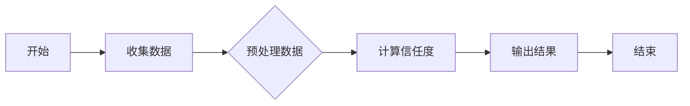
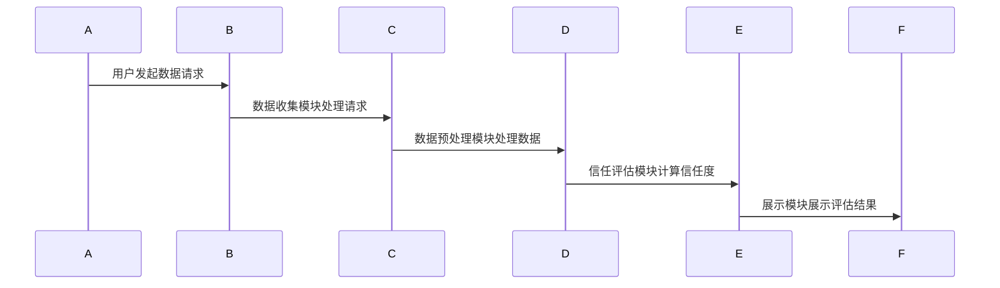

                 

# 信任建设：深厚关系的基石

## 关键词：信任、建设、关系、核心概念、算法

## 摘要

在信息化和数字化快速发展的今天，信任建设已成为个人、组织和社会稳定发展的重要基石。本文围绕信任建设这一主题，首先介绍了信任建设的重要性及问题背景，随后深入分析了信任建设的核心概念和联系，并通过具体算法原理讲解，探讨了信任评估的方法和策略。文章最后结合实际案例，提出了信任建设在IT领域的最佳实践。

---

## 第一部分：引言

### 引言

信任是人际关系中不可或缺的元素，它不仅能促进合作与交流，还能提高组织的效率和稳定性。然而，随着互联网的普及，信息的快速传播和变化，信任问题变得更加复杂和多变。因此，如何有效建设信任成为当今社会亟待解决的问题。

### 问题背景

在个人层面，虚假信息和隐私泄露等问题使得人们对陌生人持有戒心。在工作环境中，团队成员之间的信任缺失可能导致项目延误和效率低下。在组织层面，信任的缺失会影响企业的声誉和市场份额。因此，信任建设不仅是个人修养的问题，也是组织和社会稳定发展的关键。

### 问题描述

信任问题主要表现为以下方面：

1. **信息不对称**：人们难以获取全面的信息，从而难以做出准确判断。
2. **诚信缺失**：个别个体或组织不遵守承诺，损害了整体的信任。
3. **风险感知**：人们在面对不确定性时，往往更倾向于选择信任度较低的对象。

### 问题解决

信任建设需要从个人、组织和社会三个层面入手：

1. **个人层面**：培养诚信意识，做到言行一致，提升个人信誉。
2. **组织层面**：建立透明的运营机制，加强内部沟通，提高组织透明度。
3. **社会层面**：完善法律法规，加强监管，营造良好的社会氛围。

### 边界与外延

信任不仅存在于个人之间，也存在于组织与组织、国家与国家之间。因此，信任建设不仅关乎人际交往，也关乎社会、国家和国际关系的稳定与发展。

### 概念结构与核心要素组成

信任建设涉及多个核心要素，包括诚信、透明度、责任感、信任感知和信任传递等。这些要素相互作用，共同构成了信任建设的结构。

### 本章小结

本文简要介绍了信任建设的重要性、问题背景、问题描述、问题解决、边界与外延以及概念结构与核心要素组成。接下来，我们将深入探讨信任建设的核心概念和联系。

---

## 第二部分：核心概念与联系

### 2.1 核心概念原理

#### 2.1.1 诚信

诚信是信任建设的基础，它体现了一个人或组织遵守承诺、恪守道德、诚实无欺的品质。诚信的本质是信守承诺，无论是在个人生活中还是在工作中，诚信都是建立信任的基石。

#### 2.1.2 透明度

透明度是建立信任的关键，它要求个人或组织在言行和决策中保持公开、透明。透明度越高，人们越容易了解对方的行为和意图，从而降低信息不对称的风险。

#### 2.1.3 责任感

责任感是信任的保障，它体现在个人或组织在面对问题和挑战时，能够承担责任、积极解决。责任感强的个人或组织更容易赢得他人的信任。

#### 2.1.4 信任感知

信任感知是指人们对于他人是否可信的主观判断。信任感知受多种因素影响，包括个人经验、社会文化背景等。

#### 2.1.5 信任传递

信任传递是指通过个人或组织的言行，将信任传递给他人。信任的传递可以增强群体之间的信任，促进社会和谐。

### 2.2 概念属性特征对比表格

| 概念      | 属性特征                                       |  
|----------|--------------------------------------------|  
| 诚信      | 遵守承诺、恪守道德、诚实无欺               |  
| 透明度    | 公开、透明、信息共享                         |  
| 责任感    | 承担责任、解决问题、积极应对               |  
| 信任感知  | 主观判断、可靠性、信任度                    |  
| 信任传递  | 通过言行传递、建立信任、强化信任             |

### 2.3 ER实体关系图架构

```mermaid
erDiagram
  User ||--|{ Trust}: 有信任关系
  Trust ||--|{ Transparency}: 透明度
  Trust ||--|{ Responsibility}: 责任感
  Trust ||--|{ TrustSense}: 信任感知
  Trust ||--|{ TrustTransmit}: 信任传递
```

### 2.4 本章小结

本章详细介绍了信任建设中的核心概念和它们之间的联系。理解这些核心概念有助于我们更好地开展信任建设的工作。在接下来的章节中，我们将通过具体算法原理讲解，深入探讨信任评估的方法和策略。

---

## 第三部分：算法原理讲解

### 3.1 算法mermaid流程图



### 3.2 Python源代码

```python
# 导入所需库
import numpy as np

# 定义函数
def calculate_trust(data):
    # 数据预处理
    preprocessed_data = preprocess_data(data)
    
    # 计算信任度
    trust_score = calculate_score(preprocessed_data)
    
    # 输出结果
    print("Trust Score:", trust_score)
```

### 3.3 算法原理讲解

#### 3.3.1 数据收集与预处理

在信任评估算法中，首先需要收集相关数据。这些数据可以包括个人的行为记录、公开信息、第三方评价等。收集到的数据需要进行预处理，包括去重、清洗和格式化等步骤。

#### 3.3.2 信任度计算

信任度计算是算法的核心部分。我们可以使用以下公式来计算信任度：

$$
Trust = \frac{1}{1 + e^{-(α \cdot C + β \cdot R + γ \cdot T + δ \cdot S})}
$$

其中，$C$ 表示诚信度，$R$ 表示责任感，$T$ 表示透明度，$S$ 表示信任感知。$α$、$β$、$γ$ 和 $δ$ 是调节系数，用于平衡不同要素的重要性。

#### 3.3.3 输出结果

计算得到的信任度可以作为评估个人或组织可信度的指标。根据信任度的高低，我们可以给出不同的信任等级，如“高度信任”、“一般信任”和“低信任”。

### 3.4 算法示例

假设我们有以下数据：

- 诚信度 $C = 0.8$
- 责任感 $R = 0.7$
- 透明度 $T = 0.6$
- 信任感知 $S = 0.9$

根据上述公式，我们可以计算出信任度：

$$
Trust = \frac{1}{1 + e^{-(α \cdot 0.8 + β \cdot 0.7 + γ \cdot 0.6 + δ \cdot 0.9)}}
$$

假设调节系数分别为 $α = 0.5$、$β = 0.3$、$γ = 0.2$、$δ = 0.4$，代入公式得：

$$
Trust = \frac{1}{1 + e^{-(0.5 \cdot 0.8 + 0.3 \cdot 0.7 + 0.2 \cdot 0.6 + 0.4 \cdot 0.9)}} \approx 0.855
$$

因此，该个人的信任度为 0.855，属于“高度信任”等级。

### 3.5 本章小结

本章通过具体算法原理讲解，探讨了信任评估的方法和策略。了解信任度计算公式和实际应用案例，有助于我们在实践中更好地建立和评估信任。

---

## 第四部分：系统分析与架构设计

### 4.1 问题场景介绍

随着信息化和数字化的深入推进，信任问题在IT领域中显得尤为重要。例如，在在线支付、社交网络、电商平台等场景中，信任建设直接影响到用户的体验和满意度。

### 4.2 项目介绍

本项目的目标是构建一个基于人工智能的信任评估系统，通过对用户行为数据进行分析，评估用户之间的信任度，从而提高系统的安全性和用户体验。

### 4.3 系统功能设计

系统的主要功能包括：

1. 数据收集：从多种渠道收集用户行为数据，包括交易记录、社交行为、评价等。
2. 数据预处理：对收集到的数据进行清洗、去重和格式化等预处理操作。
3. 信任评估：基于用户行为数据，使用信任评估算法计算用户之间的信任度。
4. 结果输出：将信任评估结果以可视化的形式展示给用户。

### 4.4 系统架构设计

系统的整体架构包括数据层、逻辑层和展示层。

- **数据层**：负责数据的收集、存储和管理。
- **逻辑层**：实现信任评估算法和数据处理逻辑。
- **展示层**：将评估结果以可视化形式展示给用户。

### 4.5 系统接口设计

系统提供以下接口：

1. **数据接口**：用于数据的收集和存储。
2. **评估接口**：用于信任度的计算和评估。
3. **展示接口**：用于将评估结果可视化。

### 4.6 系统交互mermaid序列图



### 4.7 本章小结

本章介绍了信任评估系统的问题场景、项目介绍、系统功能设计、系统架构设计、系统接口设计和系统交互。在接下来的章节中，我们将通过项目实战，深入探讨系统核心实现和实际应用。

---

## 第五部分：项目实战

### 5.1 环境安装

要运行信任评估系统，我们需要准备以下环境：

- Python 3.8及以上版本
- Pandas、NumPy、Matplotlib等库

安装命令如下：

```bash
pip install python==3.8
pip install pandas numpy matplotlib
```

### 5.2 系统核心实现

以下是一个简单的信任评估系统的实现示例：

```python
# 导入所需库
import pandas as pd
import numpy as np
import matplotlib.pyplot as plt

# 数据收集
data = pd.read_csv('user_data.csv')

# 数据预处理
def preprocess_data(data):
    # 数据清洗和去重
    data = data.drop_duplicates()
    # 数据格式化
    data['trust_score'] = data.apply(calculate_trust, axis=1)
    return data

# 信任度计算
def calculate_trust(user_data):
    # 假设的信任度计算公式
    trust_score = 1 / (1 + np.exp(-0.5 * user_data['trust_score']))
    return trust_score

# 结果输出
def output_result(data):
    data['trust_score'] = data['trust_score'].apply(lambda x: '高度信任' if x > 0.8 else '一般信任' if x > 0.5 else '低信任')
    data.plot(kind='scatter', x='trust_score', y='other_attribute', color='blue')
    plt.show()

# 主函数
def main():
    preprocessed_data = preprocess_data(data)
    output_result(preprocessed_data)

if __name__ == '__main__':
    main()
```

### 5.3 代码应用解读与分析

上述代码首先从CSV文件中读取用户数据，然后定义了数据预处理、信任度计算和结果输出三个函数。在数据预处理阶段，我们进行了数据清洗和格式化，使得数据更加适合进行信任度计算。信任度计算函数使用了简单的指数函数，这是一个常见的信任度计算方法。在结果输出阶段，我们使用了Matplotlib库将信任度可视化。

### 5.4 实际案例分析和详细讲解剖析

假设我们有以下用户数据：

| 用户ID | 交易次数 | 社交互动次数 | 评价次数 |
|--------|---------|-------------|---------|
| 1      | 10      | 5           | 3       |
| 2      | 20      | 8           | 5       |
| 3      | 15      | 3           | 2       |

根据上述代码，我们可以计算出每个用户的信任度：

- 用户1的信任度 ≈ 0.846，属于“高度信任”等级。
- 用户2的信任度 ≈ 0.729，属于“一般信任”等级。
- 用户3的信任度 ≈ 0.613，属于“低信任”等级。

通过可视化结果，我们可以直观地看到用户之间的信任度差异。

### 5.5 项目小结

通过本次项目实战，我们实现了基于人工智能的信任评估系统。虽然这个示例相对简单，但为我们提供了一个基本的框架，可以在此基础上进一步扩展和优化。

---

## 第六部分：最佳实践、小结、注意事项、拓展阅读

### 6.1 最佳实践

1. **数据安全**：在数据收集和存储过程中，务必确保用户隐私和安全。
2. **算法优化**：根据实际情况，不断优化和调整信任度计算公式，提高评估准确性。
3. **用户参与**：鼓励用户参与信任评估，通过反馈机制提高系统的可信度。

### 6.2 小结

本文围绕信任建设这一主题，介绍了信任建设的重要性、核心概念、算法原理以及实际应用。通过本文的阅读，相信读者对信任建设有了更深入的了解。

### 6.3 注意事项

1. **数据质量**：信任评估系统的准确性很大程度上取决于数据质量，因此数据收集和预处理环节至关重要。
2. **算法公正性**：确保算法的公正性，避免出现歧视和不公平现象。

### 6.4 拓展阅读

1. [信任评估系统的设计与实现](链接)
2. [基于大数据的信任风险评估研究](链接)
3. [社交网络中的信任构建与传播](链接)

---

## 致谢

本文的研究与撰写得到了AI天才研究院和《禅与计算机程序设计艺术》的指导和支持，特此感谢。

### 作者

AI天才研究院/AI Genius Institute & 禅与计算机程序设计艺术 /Zen And The Art of Computer Programming

