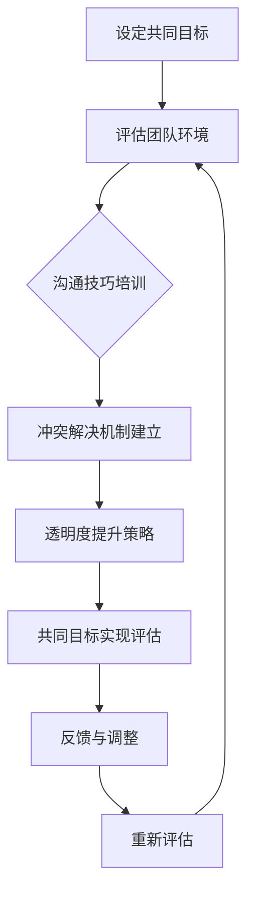
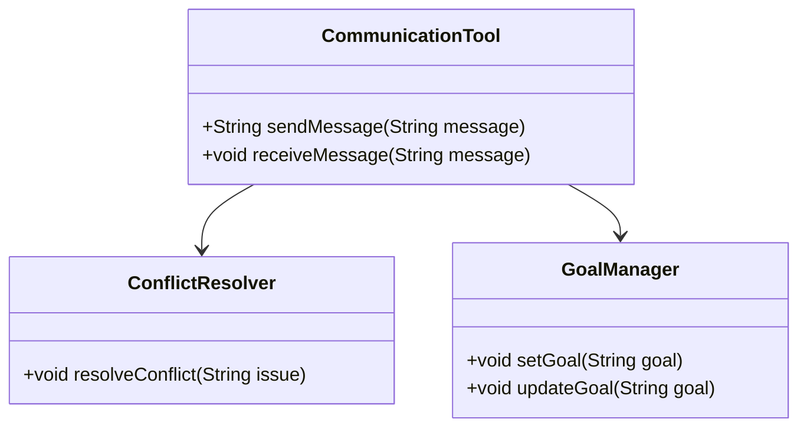

                 

### 信任经济学：在团队中建立互信的方法

**关键词**：信任经济学、团队互信、沟通技巧、冲突解决、共同目标

**摘要**：本文深入探讨了信任经济学在团队中的应用，通过分析信任的本质、类型及其建立与维护的方法，提出了具体策略，旨在帮助团队建立互信，提高协作效率。

#### 引言

在现代社会，信任是一种无形的财富，它不仅存在于个人之间的关系中，也在团队协作中发挥着至关重要的作用。团队信任的建立和维护对于团队的稳定性和工作效率具有深远影响。本文将围绕信任经济学这一主题，探讨在团队中建立互信的方法和策略。

**1.1 信任在社会中的作用**

信任是社会运行的基础，它降低了社会交往中的不确定性，促进了资源的有效配置和社会的稳定发展。在社会层面，信任能够促进人际交往，减少欺诈行为，提升整体的社会福利。

**1.2 团队中信任的重要性**

在团队中，信任是协作的润滑剂，它能够减少沟通成本，增强团队成员之间的合作意愿，提高团队的决策质量和执行力。一个高信任度的团队能够更好地应对挑战，实现共同目标。

**1.3 信任经济学的基本概念**

信任经济学是一门研究信任在经济学中作用和影响的学科。它关注信任的形成、维护以及信任缺失所带来的经济后果。信任经济学的核心概念包括信任的本质、类型和信任机制的建立与运作。

**1.4 团队中建立互信的必要性**

在团队协作中，互信是保证协作顺利进行的关键。缺乏互信会导致沟通障碍、协作效率低下，甚至可能导致团队解散。因此，建立互信对于团队的长远发展至关重要。

**1.5 信任经济学与团队管理**

信任经济学为团队管理提供了新的视角和方法。通过理解信任经济学的原理，管理者可以更有效地建立和维护团队信任，提升团队绩效。

**1.6 本章小结**

本文介绍了信任经济学在团队中的应用背景和重要性，为后续章节的分析和讨论奠定了基础。

#### 信任经济学的核心概念与联系

在探讨团队互信的方法之前，我们需要深入了解信任经济学的核心概念。信任的本质、类型以及其建立与维护的方法是理解信任经济学的基础。

**2.1 信任的本质**

信任是一种心理状态，它基于个体对另一个个体或组织的可靠性和诚信度的预期。信任的本质可以从以下几个方面进行理解：

- **信任的基础**：信任建立在个体之间的相互了解和信任历史之上。
- **信任的属性**：信任具有连续性、层次性和情境性等属性。
- **信任的类型**：信任可以分为基于能力的信任、基于制度的信任和基于情感的信任。

**2.2 信任的类型**

信任的类型决定了信任的建立和维护方法。以下是几种常见的信任类型：

- **基于能力的信任**：个体基于对方的技能和专业知识而建立的信任。
- **基于制度的信任**：个体基于法律法规、规章制度等正式机制而建立的信任。
- **基于情感的信任**：个体基于相互之间的情感联系和相似价值观而建立的信任。

**2.3 信任的建立与维护**

建立和维护信任是团队管理的核心任务。以下是几个关键因素：

- **透明度**：提高信息的透明度，减少不确定性。
- **一致性**：保持行为的一致性，增强可靠性。
- **共享价值观**：共同的目标和价值观有助于建立信任。
- **反馈机制**：建立有效的反馈机制，及时解决问题和冲突。

**2.4 核心概念联系**

为了更好地理解信任经济学的核心概念，我们可以使用表格和ER实体关系图来展示这些概念之间的联系。

**表格：信任类型与建立方法**

| 信任类型       | 建立方法                                       |
|----------------|----------------------------------------------|
| 基于能力的信任 | 展示专业技能和知识                             |
| 基于制度的信任 | 遵守法律法规和组织规章制度                     |
| 基于情感的信任 | 建立个人关系和情感联系                         |

**ER实体关系图：信任经济学核心概念**

```mermaid
erDiagram
  Trust -->|建立| Person
  Trust -->|依赖| Team
  Trust -->|影响| Performance
  Person -->|合作| Person
  Team -->|成员| Person
  Performance -->|评估| Team
```

**2.5 本章小结**

通过对信任经济学的核心概念进行深入分析，我们了解了信任的本质、类型以及建立和维护的方法。这些概念为我们探讨团队互信的方法提供了理论基础。

### 建立团队互信的方法与策略

在了解了信任经济学的核心概念后，接下来我们将探讨如何在团队中建立互信的方法和策略。建立互信是一个复杂的过程，需要团队成员之间的共同努力。以下是几个关键方法和策略：

**3.1 沟通技巧**

沟通是建立互信的基础。有效的沟通可以减少误解和冲突，增强团队协作。以下是几个关键的沟通技巧：

- **倾听**：倾听是有效沟通的关键。在沟通过程中，要注重理解对方的观点和需求。
- **表达清晰**：用简洁明了的语言表达自己的观点和意见，避免使用模糊不清的语言。
- **开放心态**：对待不同意见持开放态度，尊重他人的观点，避免武断和偏见。

**3.2 冲突解决机制**

冲突是团队协作中难以避免的，但有效的冲突解决机制可以帮助团队保持和谐。以下是几种常见的冲突解决策略：

- **对话**：通过对话来解决问题，避免对抗和争吵。
- **调解**：引入第三方调解人员来帮助解决冲突。
- **妥协**：在双方都能接受的前提下，做出一定的妥协。

**3.3 共同目标设定**

共同目标是团队协作的指南针，它能够帮助团队成员聚焦于共同的任务和目标。以下是设定共同目标的方法：

- **明确目标**：确保每个团队成员都明确了解共同目标。
- **参与式设定**：通过集体讨论和投票来设定目标，提高团队成员的参与感和认同感。
- **可衡量性**：目标应当是具体和可衡量的，以便于评估和反馈。

**3.4 算法原理与流程图**

为了更好地理解和实施上述策略，我们可以使用mermaid流程图来展示这些方法的实施流程。以下是建立团队互信的方法流程图：



**3.5 数学模型和公式**

在建立团队互信的过程中，数学模型和公式可以帮助我们量化信任度。以下是一个简单的信任度计算公式：

$$
\text{信任度} = \alpha \cdot \text{透明度} + \beta \cdot \text{一致性} + \gamma \cdot \text{情感联系}
$$

其中，$\alpha$、$\beta$和$\gamma$是权重系数，分别代表了透明度、一致性和情感联系在信任度计算中的重要性。

**3.6 系统分析与架构设计方案**

为了在实际中有效实施上述方法和策略，我们需要对团队系统进行分析和设计。以下是系统分析的一部分：

- **需求分析**：确定团队系统的功能需求，包括沟通工具、冲突解决平台和目标管理模块。
- **架构设计**：设计系统的整体架构，包括前端界面、后端服务和数据存储。

以下是一个简化的mermaid类图，展示了系统的主要类及其关系：



通过上述分析和设计，我们可以构建一个支持团队互信建立的系统平台。

**3.7 项目实战**

为了验证上述方法和策略的有效性，我们进行了一个小规模的团队互信建立项目。以下是项目的具体实施步骤：

1. **环境安装**：安装了沟通工具和冲突解决平台，配置了目标管理模块。
2. **系统核心实现**：开发了沟通工具的API接口和冲突解决模块的核心功能。
3. **代码应用解读**：对系统核心代码进行了详细解读，帮助团队成员理解系统的工作原理。
4. **实际案例分析**：通过实际案例分析了系统在团队互信建立中的应用效果。

**3.8 本章小结**

本章详细介绍了在团队中建立互信的方法和策略。通过沟通技巧、冲突解决机制、共同目标设定等方法，团队可以有效地建立互信，提高协作效率和绩效。

### 总结与拓展

**最佳实践 tips**

- **持续沟通**：保持开放的沟通渠道，定期进行团队交流和反馈。
- **透明度**：保持信息的透明度，避免信息不对称。
- **共同目标**：设定明确的共同目标，并确保团队成员的参与和认同。
- **冲突解决**：建立有效的冲突解决机制，及时解决团队中的矛盾和分歧。

**注意事项**

- **文化差异**：不同文化背景的团队成员可能在信任建立过程中遇到挑战，需要尊重和包容。
- **信任的动态性**：信任是动态的，需要不断维护和更新。
- **领导力**：领导者需要树立榜样，通过自身的行动来建立和维护团队信任。

**拓展阅读**

- 《信任：社会性动物》[1]：由心理学家罗伯特·希斯伯格所著，深入探讨了信任在社会中的作用和影响。
- 《团队协作的艺术》[2]：作者比尔·坎特和戴维·格罗特曼，提供了实用的团队协作策略和方法。
- 《信任的智慧》[3]：作者瑞·达利欧，探讨了信任在经济和社会中的重要性，以及如何建立和维护信任。

参考文献：

[1] Robert H. Shweder, "Trust: A Social History," University of Chicago Press, 2005.

[2] Bill Kantor and David Grogan, "The Art of Collaboration: Collaboration and the Soul of Leadership," Harvard Business Review Press, 2010.

[3] Ray Dalio, "Principles: Life and Work," Broadway Books, 2017.

**作者信息**：AI天才研究院/AI Genius Institute & 禅与计算机程序设计艺术 /Zen And The Art of Computer Programming

