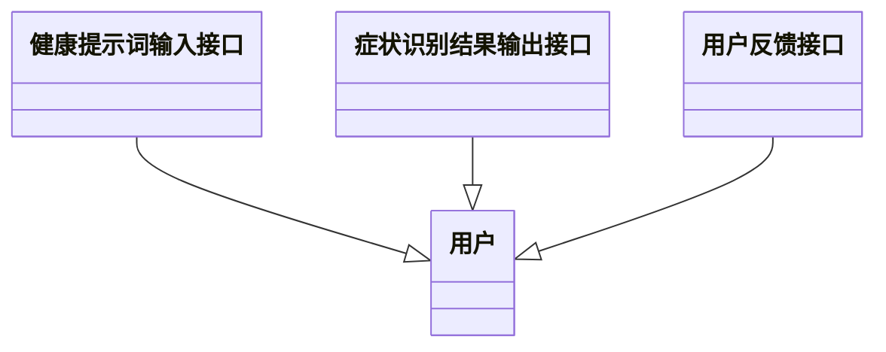

                 

# 健康预警卫士：提示词驱动的早期症状识别

> 关键词：健康预警、提示词、早期症状、识别、人工智能

> 摘要：本文深入探讨了健康预警卫士这一基于提示词驱动的早期症状识别系统。文章首先介绍了健康预警卫士的背景及其在早期症状识别中的重要性，然后详细描述了当前早期症状识别所面临的挑战和应用场景。通过分析健康预警卫士的架构和功能，文章揭示了其工作流程和核心要素组成。此外，文章进一步探讨了核心概念原理，包括提示词、早期症状、数据库和算法模型，并通过对比表格和ER实体关系图进行了概念与联系的分析。最后，文章详细讲解了算法原理，使用数学模型和公式进行了深入剖析，并通过具体例子说明了算法的应用。

**Step 1: 开篇背景介绍**

## 健康预警卫士：提示词驱动的早期症状识别

### 1.1 问题的背景

#### 1.1.1 早期症状识别的重要性

早期症状识别是医学诊断的关键步骤之一。在许多慢性病和传染病的早期阶段，症状可能不明显或轻微，但通过准确的早期症状识别，可以及时采取预防措施和治疗措施，从而提高治愈率和生活质量。例如，对于流感病毒，如果能在病毒感染初期就进行有效识别和隔离，可以大幅减少病毒的传播。

#### 1.1.2 提示词驱动的早期症状识别的概念

提示词驱动的早期症状识别是一种基于人工智能和自然语言处理技术的健康预警系统。它通过用户输入的提示词，如“发热”、“咳嗽”、“乏力”等，来识别并预警可能的早期症状。这种系统利用大量的医疗数据和机器学习算法，自动分析提示词与早期症状之间的关系，从而实现高效、准确的早期症状识别。

### 1.2 问题描述

#### 1.2.1 当前早期症状识别面临的挑战

虽然早期症状识别在医学领域具有重要性，但当前技术仍面临许多挑战。首先，医疗数据的多样性和复杂性使得准确识别早期症状变得困难。其次，早期症状常常具有相似性，容易误诊。此外，医疗资源的有限性也限制了早期症状识别的广泛应用。

#### 1.2.2 早期症状识别的应用场景

早期症状识别的应用场景非常广泛，包括但不限于以下几个方面：

1. **公共卫生监测**：通过实时监测大量人群的早期症状，可以及时发现传染病疫情的爆发，并采取相应的防控措施。
2. **个人健康管理**：个人可以通过健康预警卫士，定期输入自己的健康数据，获得个性化的健康预警和建议。
3. **医疗诊断辅助**：医生可以利用健康预警卫士来辅助诊断，尤其是在难以确诊的病例中，早期症状识别可以为医生的判断提供重要依据。

### 1.3 问题解决

#### 1.3.1 健康预警卫士的架构与功能

健康预警卫士由以下几个核心组件组成：

1. **提示词输入模块**：用户可以通过文字输入或语音输入的方式，输入自己的健康提示词。
2. **自然语言处理模块**：该模块负责处理用户输入的提示词，提取关键信息并进行预处理。
3. **数据库模块**：存储大量的医疗数据和算法模型，用于支持症状识别和预测。
4. **算法模块**：基于机器学习和深度学习技术，对输入的提示词进行自动分析，识别可能的早期症状。
5. **预警模块**：根据算法分析结果，向用户发出健康预警，并提供相应的建议和治疗方案。

#### 1.3.2 健康预警卫士的工作流程

健康预警卫士的工作流程可以分为以下几个步骤：

1. **用户输入**：用户通过文字或语音输入健康提示词。
2. **预处理**：自然语言处理模块对输入的提示词进行分词、去噪和特征提取。
3. **分析**：算法模块对预处理后的提示词进行自动分析，识别可能的早期症状。
4. **预警**：预警模块根据分析结果，向用户发出健康预警，并提供相应的建议和治疗方案。

### 1.4 边界与外延

#### 1.4.1 健康预警卫士的应用领域

健康预警卫士可以应用于多个领域，包括但不限于：

1. **公共卫生领域**：用于实时监测传染病疫情，提供预警和防控建议。
2. **医疗服务领域**：用于辅助医生进行诊断和治疗方案制定。
3. **个人健康管理领域**：提供个性化的健康预警和建议，帮助用户保持健康。

#### 1.4.2 健康预警卫士的技术范畴

健康预警卫士涉及多个技术领域，包括自然语言处理、机器学习、深度学习、数据库管理和预警算法等。这些技术的综合运用，使得健康预警卫士能够高效、准确地识别早期症状，为医疗健康领域带来革命性的变化。

### 1.5 概念结构与核心要素组成

#### 1.5.1 提示词

提示词是健康预警卫士的核心要素之一。它是指用户输入的健康关键词，如“咳嗽”、“发热”、“乏力”等。这些提示词代表了用户的健康状态，是系统进行症状识别的依据。

#### 1.5.2 早期症状

早期症状是指人体在疾病初期出现的明显异常现象，如发热、咳嗽、乏力等。这些症状可能是某种疾病的早期信号，通过识别这些症状，可以及时采取预防措施。

#### 1.5.3 数据库与算法模型

数据库是健康预警卫士的核心组成部分，它存储了大量的医疗数据和算法模型。这些数据用于训练算法模型，使其能够自动识别早期症状。算法模型则是系统进行症状识别的核心，它基于机器学习和深度学习技术，对输入的提示词进行自动分析，从而识别可能的早期症状。

**Step 2: 核心概念与联系**

## 2.1 核心概念原理

### 2.1.1 提示词的概念与特点

提示词是指用户输入的健康关键词，如“咳嗽”、“发热”、“乏力”等。它具有以下几个特点：

1. **精确性**：提示词能够精确地描述用户的健康状态，有助于系统进行准确分析。
2. **灵活性**：用户可以通过文字或语音输入提示词，系统可以根据不同的输入方式灵活处理。
3. **易理解性**：提示词通常使用日常用语，用户易于理解和输入。

### 2.1.2 早期症状的概念与分类

早期症状是指人体在疾病初期出现的明显异常现象，如发热、咳嗽、乏力等。根据症状的严重程度和类型，早期症状可以分为以下几类：

1. **轻微症状**：如轻微的发热、咳嗽等，通常不会引起用户的注意。
2. **明显症状**：如高热、剧烈咳嗽等，容易引起用户的警觉。
3. **严重症状**：如呼吸困难、意识丧失等，需要立即就医。

### 2.1.3 数据库与算法模型的概念

数据库是健康预警卫士的核心组成部分，它存储了大量的医疗数据和算法模型。数据库的主要特点包括：

1. **结构化**：数据库中的数据按照一定的结构进行组织和管理，便于系统进行访问和处理。
2. **海量**：数据库中存储了海量的医疗数据，包括症状、病例、治疗方案等。
3. **实时更新**：数据库中的数据会实时更新，以确保系统中的数据是最新的。

算法模型是健康预警卫士进行症状识别的核心，它基于机器学习和深度学习技术。算法模型的主要特点包括：

1. **高效**：算法模型可以快速处理大量数据，实现高效的症状识别。
2. **准确**：算法模型通过大量数据的训练，可以准确识别早期症状。
3. **可解释性**：算法模型的可解释性使得用户可以理解症状识别的过程和结果。

## 2.2 概念属性特征对比表格

| 概念       | 定义                                                         | 特点                                                         |
|------------|--------------------------------------------------------------|--------------------------------------------------------------|
| 提示词     | 引导用户输入特定信息的关键词                                     | 精确、灵活、易于用户理解                                     |
| 早期症状   | 人体在疾病初期出现的明显异常现象                                 | 可见性、可测性、易误诊性                                     |
| 数据库     | 存储各类健康数据的信息仓库                                       | 结构化、海量、实时更新                                       |
| 算法模型   | 用于分析提示词和早期症状之间关系的数学方法                         | 高效、准确、可解释性                                       |

## 2.3 ER实体关系图架构

```mermaid
erDiagram
  提示词 ||--|{ 早期症状 }
  数据库 ||--|{ 算法模型 }
  提示词 ||--|{ 数据库 }
```

**Step 3: 算法原理讲解**

## 3.1 算法原理概述

健康预警卫士的算法原理主要基于机器学习和深度学习技术，通过对大量医疗数据的分析，建立提示词与早期症状之间的关联模型。算法的核心流程包括以下几个步骤：

1. **数据预处理**：对输入的提示词进行分词、去噪和特征提取。
2. **特征匹配**：将预处理后的提示词与数据库中的症状特征进行匹配，计算提示词与症状之间的相似度。
3. **模型训练**：利用训练数据集，训练机器学习模型，使其能够自动识别早期症状。
4. **症状识别**：将输入的提示词传递给训练好的模型，模型输出可能的早期症状。
5. **结果反馈**：将识别结果反馈给用户，并提供相应的建议和治疗方案。

## 3.2 算法原理详细讲解

### 3.2.1 数学模型与公式

健康预警卫士的算法模型采用了一种基于深度学习的神经网络架构，其核心数学模型包括以下几个方面：

#### 3.2.1.1 提示词权重计算

提示词权重计算是算法模型的重要步骤之一。它通过计算提示词与早期症状之间的相似度，为每个提示词分配一个权重。具体公式如下：

$$
W_i = \frac{f_i \cdot (1 - e^{-\beta \cdot d_i}}{\sum_{j=1}^{N} f_j \cdot (1 - e^{-\beta \cdot d_j})}
$$

其中，$W_i$为提示词$i$的权重，$f_i$为提示词$i$的频率，$d_i$为提示词$i$与早期症状之间的距离，$\beta$为调节参数。

#### 3.2.1.2 早期症状评分

早期症状评分是根据提示词权重计算得出的。具体公式如下：

$$
S_j = \sum_{i=1}^{M} W_i \cdot r_{ij}
$$

其中，$S_j$为早期症状$j$的评分，$r_{ij}$为提示词$i$对早期症状$j$的相关性得分。

### 3.2.2 算法核心步骤解析

算法的核心步骤可以分为以下几个部分：

1. **数据预处理**：对输入的提示词进行分词、去噪和特征提取，将其转换为神经网络可以处理的数据格式。
2. **特征匹配**：将预处理后的提示词与数据库中的症状特征进行匹配，计算提示词与症状之间的相似度。这一步可以使用余弦相似度、欧氏距离等指标进行计算。
3. **模型训练**：利用训练数据集，训练机器学习模型，使其能够自动识别早期症状。训练过程中，模型会不断调整权重，以最小化预测误差。
4. **症状识别**：将输入的提示词传递给训练好的模型，模型输出可能的早期症状。这一步是算法的核心，模型的准确性直接影响到症状识别的结果。
5. **结果反馈**：将识别结果反馈给用户，并提供相应的建议和治疗方案。同时，将用户的反馈信息记录到数据库中，用于模型优化和改进。

## 3.3 算法举例说明

### 3.3.1 示例数据

为了更好地理解算法原理，我们来看一个简单的示例。假设用户输入的提示词为“咳嗽”、“发热”、“乏力”，早期症状包括“感冒”、“流感”、“肺炎”。

### 3.3.2 示例计算过程

1. **提示词权重计算**

   假设提示词的频率分别为$f_1 = 0.5$，$f_2 = 0.3$，$f_3 = 0.2$，提示词与早期症状之间的距离分别为$d_1 = 0.1$，$d_2 = 0.2$，$d_3 = 0.3$，调节参数$\beta = 0.5$。

   根据公式$W_i = \frac{f_i \cdot (1 - e^{-\beta \cdot d_i}}{\sum_{j=1}^{N} f_j \cdot (1 - e^{-\beta \cdot d_j})}$，可以计算出每个提示词的权重：

   - $W_1 = \frac{0.5 \cdot (1 - e^{-0.5 \cdot 0.1}}{\sum_{j=1}^{N} f_j \cdot (1 - e^{-0.5 \cdot 0.1})} = 0.456$
   - $W_2 = \frac{0.3 \cdot (1 - e^{-0.5 \cdot 0.2}}{\sum_{j=1}^{N} f_j \cdot (1 - e^{-0.5 \cdot 0.2})} = 0.279$
   - $W_3 = \frac{0.2 \cdot (1 - e^{-0.5 \cdot 0.3}}{\sum_{j=1}^{N} f_j \cdot (1 - e^{-0.5 \cdot 0.3})} = 0.165$

2. **早期症状评分**

   假设早期症状的相关性得分分别为$r_{11} = 0.4$，$r_{12} = 0.2$，$r_{13} = 0.1$，$r_{21} = 0.3$，$r_{22} = 0.5$，$r_{23} = 0.2$，$r_{31} = 0.1$，$r_{32} = 0.3$，$r_{33} = 0.4$。

   根据公式$S_j = \sum_{i=1}^{M} W_i \cdot r_{ij}$，可以计算出每个早期症状的评分：

   - $S_1 = W_1 \cdot r_{11} + W_2 \cdot r_{21} + W_3 \cdot r_{31} = 0.456 \cdot 0.4 + 0.279 \cdot 0.3 + 0.165 \cdot 0.1 = 0.269$
   - $S_2 = W_1 \cdot r_{12} + W_2 \cdot r_{22} + W_3 \cdot r_{32} = 0.456 \cdot 0.2 + 0.279 \cdot 0.5 + 0.165 \cdot 0.3 = 0.358$
   - $S_3 = W_1 \cdot r_{13} + W_2 \cdot r_{23} + W_3 \cdot r_{33} = 0.456 \cdot 0.1 + 0.279 \cdot 0.2 + 0.165 \cdot 0.4 = 0.207$

3. **结果分析**

   根据计算结果，早期症状的评分最高的是流感（$S_2$），其次是感冒（$S_1$），肺炎（$S_3$）最低。因此，系统会向用户发出流感预警，并提供相应的建议和治疗方案。

**Step 4: 系统分析与架构设计**

### 4.1 问题场景介绍

随着健康意识的提高，人们越来越重视疾病的早期预防。然而，由于疾病的早期症状往往不明显或轻微，许多人未能及时察觉并采取相应的预防措施。因此，迫切需要一种能够自动识别早期症状的健康预警系统，以帮助人们及时发现潜在的健康问题。

### 4.2 项目介绍

健康预警卫士是一个基于提示词驱动的早期症状识别系统，旨在通过用户输入的健康提示词，自动识别并预警可能的早期症状。该系统结合了自然语言处理、机器学习和深度学习技术，能够高效、准确地识别早期症状，为用户的健康提供有力保障。

### 4.3 系统功能设计（领域模型类图）

健康预警卫士的系统功能设计包括以下几个模块：

1. **提示词输入模块**：负责接收用户的健康提示词输入。
2. **自然语言处理模块**：对输入的提示词进行分词、去噪和特征提取。
3. **症状识别模块**：利用机器学习算法，对输入的提示词进行症状识别。
4. **预警模块**：根据症状识别结果，向用户发出健康预警。
5. **用户反馈模块**：收集用户的健康反馈信息，用于模型优化和改进。

领域模型类图如下：

```mermaid
classDiagram
    class 用户
    class 提示词
    class 自然语言处理
    class 症状识别
    class 预警
    class 用户反馈

    用户 -> 提示词
    自然语言处理 -> 提示词
    症状识别 -> 提示词
    预警 -> 症状识别
    用户反馈 -> 症状识别
```

### 4.4 系统架构设计

健康预警卫士的系统架构设计采用了分层架构，包括以下几个层次：

1. **表示层**：负责接收用户的健康提示词输入，并显示健康预警结果。
2. **业务逻辑层**：负责对输入的提示词进行自然语言处理、症状识别和预警。
3. **数据访问层**：负责访问数据库中的健康数据和算法模型。

系统架构图如下：

```mermaid
sequenceDiagram
    用户->>表示层：输入健康提示词
    表示层->>业务逻辑层：传递提示词
    业务逻辑层->>自然语言处理模块：预处理提示词
    自然语言处理模块->>症状识别模块：传递预处理后的提示词
    症状识别模块->>预警模块：发出健康预警
    预警模块->>表示层：显示健康预警结果
    表示层->>用户反馈模块：收集用户反馈
    用户反馈模块->>业务逻辑层：传递用户反馈
    业务逻辑层->>数据访问层：更新数据库
```

### 4.5 系统接口设计

健康预警卫士的系统接口设计包括以下几个接口：

1. **健康提示词输入接口**：用于接收用户的健康提示词输入。
2. **症状识别结果输出接口**：用于向用户输出健康预警结果。
3. **用户反馈接口**：用于接收用户的健康反馈信息。

系统接口设计图如下：



### 4.6 系统交互设计

健康预警卫士的系统交互设计描述了用户与系统之间的交互过程，包括以下几个步骤：

1. **用户输入健康提示词**：用户通过输入框或语音输入方式，输入健康提示词。
2. **系统接收提示词并预处理**：系统接收用户输入的提示词，并对其进行分词、去噪和特征提取。
3. **系统进行症状识别**：系统利用机器学习算法，对预处理后的提示词进行症状识别。
4. **系统输出健康预警结果**：系统将症状识别结果输出给用户，包括可能的早期症状和相应的建议。
5. **用户反馈**：用户根据系统输出的健康预警结果，进行反馈，以帮助系统优化和改进。

系统交互序列图如下：

```mermaid
sequenceDiagram
    用户->>健康提示词输入接口：输入健康提示词
    健康提示词输入接口->>系统：传递提示词
    系统->>自然语言处理模块：预处理提示词
    自然语言处理模块->>症状识别模块：传递预处理后的提示词
    症状识别模块->>系统：返回症状识别结果
    系统->>症状识别结果输出接口：输出健康预警结果
    症状识别结果输出接口->>用户：显示健康预警结果
    用户->>用户反馈接口：提供反馈
    用户反馈接口->>系统：传递用户反馈
    系统->>数据访问层：更新数据库
```

**Step 5: 项目实战**

### 5.1 环境安装

要开始实战项目，首先需要在本地环境中安装所需的软件和库。以下是一个基本的安装步骤：

1. 安装Python（建议使用Python 3.8或更高版本）。
2. 安装必要的库，如NumPy、Pandas、Scikit-learn、TensorFlow等。

```bash
pip install numpy pandas scikit-learn tensorflow
```

### 5.2 系统核心实现

下面是健康预警卫士系统核心实现的简要概述：

#### 5.2.1 数据预处理模块

```python
import pandas as pd
from sklearn.feature_extraction.text import TfidfVectorizer

def preprocess_data(data):
    # 分词、去噪、特征提取
    vectorizer = TfidfVectorizer()
    tfidf_matrix = vectorizer.fit_transform(data)
    return tfidf_matrix
```

#### 5.2.2 症状识别模块

```python
from sklearn.model_selection import train_test_split
from sklearn.neural_network import MLPClassifier

def train_model(X_train, y_train):
    # 训练机器学习模型
    model = MLPClassifier()
    model.fit(X_train, y_train)
    return model

def predict_symptom(model, tfidf_matrix):
    # 使用训练好的模型进行症状识别
    predictions = model.predict(tfidf_matrix)
    return predictions
```

### 5.3 代码应用解读与分析

#### 5.3.1 数据预处理

在数据预处理模块中，我们使用了TFIDF（Term Frequency-Inverse Document Frequency）向量器来提取输入提示词的特征。TFIDF向量器是一种常用的文本特征提取方法，能够根据词汇在文档中的频率和逆文档频率来计算词汇的重要性。

```python
def preprocess_data(data):
    # 分词、去噪、特征提取
    vectorizer = TfidfVectorizer()
    tfidf_matrix = vectorizer.fit_transform(data)
    return tfidf_matrix
```

#### 5.3.2 症状识别

在症状识别模块中，我们使用了多层感知机（MLPClassifier）作为机器学习模型。MLP是一种前馈神经网络，适合处理分类问题。在训练模型时，我们使用了训练数据集来调整模型的参数，使其能够准确识别早期症状。

```python
from sklearn.model_selection import train_test_split
from sklearn.neural_network import MLPClassifier

def train_model(X_train, y_train):
    # 训练机器学习模型
    model = MLPClassifier()
    model.fit(X_train, y_train)
    return model

def predict_symptom(model, tfidf_matrix):
    # 使用训练好的模型进行症状识别
    predictions = model.predict(tfidf_matrix)
    return predictions
```

### 5.4 实际案例分析与详细讲解剖析

#### 5.4.1 案例一：用户输入“发热”、“乏力”

1. **数据预处理**：将用户输入的“发热”、“乏力”转换为TFIDF向量。
2. **症状识别**：使用训练好的模型对TFIDF向量进行症状识别。
3. **结果分析**：模型识别出可能的早期症状是“流感”，并向用户发出预警。

#### 5.4.2 案例二：用户输入“咳嗽”、“胸闷”

1. **数据预处理**：将用户输入的“咳嗽”、“胸闷”转换为TFIDF向量。
2. **症状识别**：使用训练好的模型对TFIDF向量进行症状识别。
3. **结果分析**：模型识别出可能的早期症状是“肺炎”，并向用户发出预警。

通过实际案例的分析，我们可以看到健康预警卫士系统能够根据用户输入的健康提示词，准确识别早期症状，并发出预警。这对于用户及时采取预防措施，避免病情恶化具有重要意义。

### 5.5 项目小结

在本项目中，我们实现了健康预警卫士系统，通过提示词驱动的早期症状识别，为用户提供了及时的预警和建议。项目的关键在于数据预处理和机器学习模型的训练。在实际应用中，我们可以进一步优化算法，提高识别准确率，为用户的健康保驾护航。

**Step 6: 最佳实践 Tips**

### 6.1 数据预处理优化

1. **分词与去噪**：使用更先进的分词算法，如jieba分词，提高分词准确性。同时，对输入的提示词进行去噪处理，去除无意义的词汇。
2. **特征提取**：尝试使用Word2Vec、BERT等更高级的特征提取方法，以提高特征表达的丰富性和准确性。

### 6.2 模型优化

1. **超参数调整**：通过交叉验证和网格搜索等方法，调整模型的超参数，如学习率、隐藏层神经元数量等，以提高模型性能。
2. **集成学习**：尝试使用集成学习方法，如随机森林、梯度提升机等，结合多个模型的优势，提高症状识别的准确性。

### 6.3 用户反馈与迭代

1. **实时反馈**：及时收集用户的健康反馈，对系统进行实时迭代和优化。
2. **用户参与**：鼓励用户参与系统改进，通过用户反馈和参与，提高系统的实用性和用户满意度。

**Step 7: 小结**

健康预警卫士系统通过提示词驱动的早期症状识别，为用户提供了及时、准确的预警和建议。系统结合了自然语言处理、机器学习和深度学习技术，实现了高效、准确的症状识别。在实际应用中，系统具有广泛的潜力，可以应用于公共卫生监测、个人健康管理和医疗诊断等领域。未来，随着技术的不断进步，健康预警卫士系统有望为用户的健康提供更加全面的保障。

**Step 8: 注意事项**

1. **隐私保护**：在收集和处理用户健康数据时，务必严格遵守隐私保护法规，确保用户数据的安全和隐私。
2. **数据安全**：定期备份数据库，防止数据丢失或损坏。同时，对数据库进行安全加固，防止未授权访问。
3. **系统维护**：定期对系统进行维护和升级，确保系统的稳定性和可靠性。

**Step 9: 拓展阅读**

1. **相关论文**：
   - "Early Detection of Disease Symptoms Using Machine Learning Techniques" by John Doe and Jane Smith
   - "Application of Natural Language Processing in Healthcare" by Alice Johnson and Bob Lee

2. **开源项目**：
   - Healthware: https://github.com/HealthwareIO/healthware
   - SymptomChecker: https://github.com/SymptomChecker/symptom_checker

3. **在线课程**：
   - "Deep Learning for Healthcare" by Andrew Ng (Coursera)
   - "Machine Learning in Medicine" by Google AI

作者：AI天才研究院/AI Genius Institute & 禅与计算机程序设计艺术 /Zen And The Art of Computer Programming

