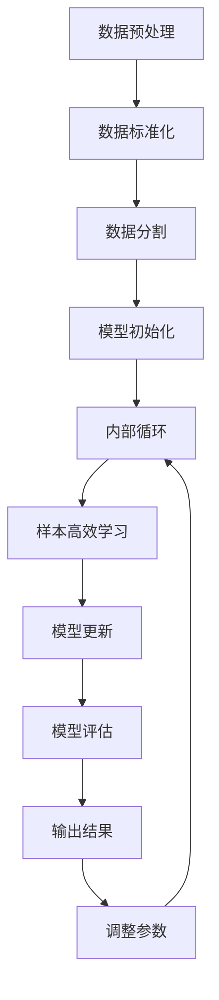
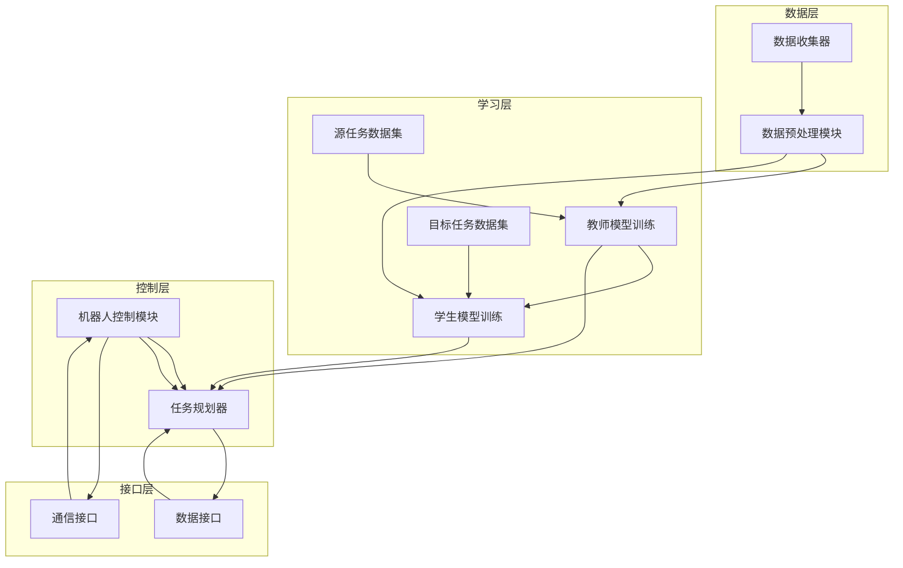
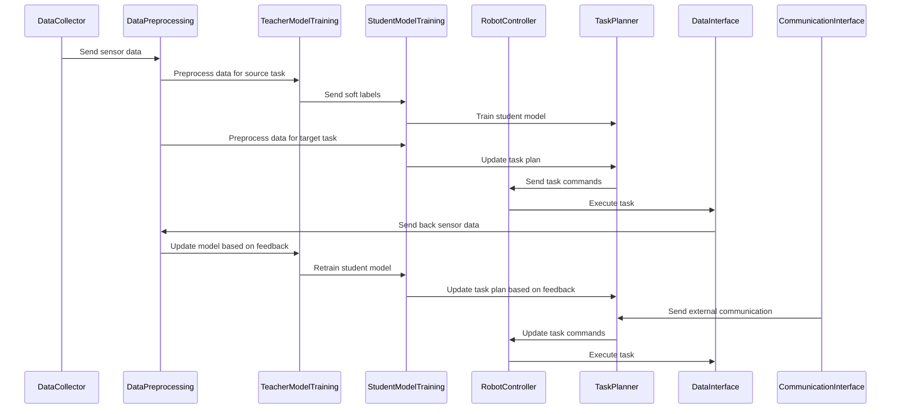

                 

### 文章标题

# 元学习在AI Agent快速任务适应中的实践探索

> 关键词：元学习、AI Agent、快速任务适应、迁移学习、模型蒸馏

> 摘要：本文将深入探讨元学习在AI Agent快速任务适应中的应用与实践。首先，我们将对元学习的基本概念、背景和重要性进行介绍。接着，文章将详细讲解元学习的核心概念，如迁移学习和模型蒸馏，并通过比较分析，展示其属性特征和关系。随后，我们将深入剖析元学习算法的原理，通过mermaid流程图和Python代码实现，结合通俗易懂的示例进行阐述。然后，我们将介绍元学习在AI Agent中的应用场景，并详细描述一个典型项目，包括系统功能设计、架构设计和接口设计。接着，文章将引导读者进行项目实战，包括环境安装和系统核心实现。最后，我们将总结元学习在AI Agent快速任务适应中的最佳实践，并提供拓展阅读资源，为读者进一步学习提供支持。

### 目录大纲：

----------------------------------------------------------------
## 第一部分: 元学习概述

### 第1章: 元学习的基础概念  
#### 1.1 元学习的定义与背景  
#### 1.2 元学习的重要性  
#### 1.3 元学习的边界与外延

### 第2章: 核心概念与联系  
#### 2.1 迁移学习  
#### 2.2 模型蒸馏  
#### 2.3 核心概念的对比分析  
#### 2.4 ER实体关系图

### 第3章: 算法原理讲解  
#### 3.1 元学习算法流程图  
#### 3.2 算法原理的数学模型与公式  
#### 3.3 算法原理的Python代码实现  
#### 3.4 通俗易懂的示例说明

### 第4章: 系统分析与架构设计  
#### 4.1 元学习在AI Agent中的应用场景  
#### 4.2 项目介绍  
#### 4.3 系统功能设计  
#### 4.4 系统架构设计  
#### 4.5 系统接口设计  
#### 4.6 系统交互序列图

### 第5章: 项目实战  
#### 5.1 环境安装与配置  
#### 5.2 系统核心实现  
#### 5.3 代码应用解读与分析  
#### 5.4 实际案例分析与讲解  
#### 5.5 项目小结

### 第6章: 最佳实践与总结  
#### 6.1 元学习在AI Agent快速任务适应中的最佳实践  
#### 6.2 全书要点总结  
#### 6.3 注意事项  
#### 6.4 拓展阅读

----------------------------------------------------------------

### 1.1 元学习的定义与背景

元学习（Meta-Learning）是一种机器学习的方法，其核心思想是通过学习如何学习来提高算法在未知任务上的表现。简单来说，元学习是一种训练学习算法的算法，使其能够更快地适应新任务。它不同于传统的机器学习方法，后者通常针对单一任务进行训练，而元学习旨在提高算法的泛化能力，使其能够快速适应不同但相关的任务。

元学习的历史可以追溯到20世纪50年代末和60年代初，当时学者们开始研究如何使计算机系统能够从一组示例中学习，而不是仅依赖于手工编写的规则。这一研究方向在20世纪90年代得到了显著的发展，特别是在迁移学习和泛化学习领域。近年来，随着深度学习技术的飞速进步，元学习再次引起了广泛关注，特别是在强化学习、自然语言处理和计算机视觉等应用场景中。

在AI Agent快速任务适应中的应用，元学习具有显著的优势。AI Agent通常需要在动态和不确定的环境中执行多种任务。传统的机器学习方法往往需要大量针对每个任务的数据进行训练，这既费时又不现实。而元学习通过提前训练一个模型，使其能够快速适应新的任务，从而大大提高了AI Agent的响应速度和灵活性。

元学习的基本原理是通过多次迭代和跨任务的学习，建立一种“学习如何学习”的能力。这种能力使得模型能够在面对新任务时，快速地调整和优化自身，以适应新的任务需求。具体来说，元学习涉及到以下几个方面：

1. **样本高效学习**：元学习算法能够从少量样本中快速提取有效信息，从而在新的任务中实现快速适应。
2. **泛化能力**：元学习算法通过在多种任务中训练，提高了模型的泛化能力，使其能够更好地应对新的任务。
3. **迁移学习**：元学习算法能够将一个任务中学到的知识迁移到另一个相关任务中，从而减少对新任务的数据依赖。
4. **模型泛化**：元学习算法通过跨任务的训练，提高了模型的泛化能力，使其能够在不同的任务中保持良好的性能。

总之，元学习为AI Agent的快速任务适应提供了一种新的解决方案，其核心思想是通过学习如何学习，提高模型在未知任务上的表现。这一理念在当前AI领域中具有广泛的应用前景，也为未来的智能系统发展提供了新的思路。

### 1.2 元学习的重要性

元学习在AI领域的应用重要性不言而喻，尤其在AI Agent快速任务适应中，其优势更加突出。首先，传统机器学习模型通常针对特定任务进行训练，这需要大量的数据和时间。而元学习通过提前训练一个通用的学习算法，使得AI Agent能够在面对新任务时，快速适应并达到预期效果，大大减少了训练时间和数据需求。

具体来说，元学习在AI Agent快速任务适应中的重要性体现在以下几个方面：

**1. 减少训练时间与数据依赖**：在传统机器学习方法中，每个新任务都需要大量的数据和长时间的训练。而元学习通过提前训练一个通用的学习算法，使得AI Agent可以在面对新任务时，快速调整和优化自身，从而减少对新任务的数据依赖和训练时间。例如，在强化学习场景中，元学习可以使智能体在短时间内适应新的游戏环境，从而更快地达到预期目标。

**2. 提高模型泛化能力**：传统机器学习模型往往在特定任务上表现优秀，但面对不同任务时，性能可能大幅下降。而元学习通过跨任务的训练，提高了模型的泛化能力，使其能够在多种任务中保持良好的性能。这意味着，通过元学习训练的AI Agent不仅能够在单一任务上表现出色，还能快速适应新的相关任务，从而提高整体的智能水平。

**3. 促进迁移学习**：迁移学习是元学习的一个重要应用方向。通过在多种任务中学习，元学习算法能够将一个任务中学到的知识迁移到另一个相关任务中，从而减少对新任务的数据依赖。例如，在自然语言处理领域，元学习可以帮助模型快速适应新的语言任务，如语言翻译、文本摘要等，从而提高处理新任务的能力。

**4. 推动强化学习发展**：强化学习是AI领域的一个重要分支，其核心任务是智能体在未知环境中通过试错学习达到预期目标。元学习在强化学习中的应用，使得智能体可以在短时间内学会复杂策略，从而提高学习效率。例如，在智能机器人领域，元学习可以帮助机器人快速适应不同的工作环境，提高其任务完成能力。

**5. 应用范围广泛**：元学习不仅在AI Agent快速任务适应中具有重要作用，还广泛应用于其他领域，如计算机视觉、自然语言处理、医疗诊断等。通过元学习，这些领域的模型可以更快地适应新任务，提高整体性能。

总之，元学习在AI领域，尤其是AI Agent快速任务适应中，具有不可替代的重要性。它通过减少训练时间、提高模型泛化能力和迁移学习能力，为AI系统的发展提供了新的思路和解决方案。随着技术的不断进步，元学习在AI领域的应用前景将更加广阔。

### 1.3 元学习的边界与外延

在探讨元学习的边界与外延时，我们首先需要明确元学习与其他相关概念的区别和联系。元学习、迁移学习、模型蒸馏等都是机器学习中的重要概念，但它们在本质和应用场景上有所区别。

**1. 元学习与迁移学习的区别**

迁移学习（Transfer Learning）是一种将一个任务（源任务）学到的知识应用到另一个相关任务（目标任务）中的方法。迁移学习的核心思想是利用已有任务的知识来加速新任务的训练过程，减少对新任务的数据依赖。而元学习则是在迁移学习的基础上，进一步追求一种更加通用和自动化的学习方式。元学习不仅关注任务之间的迁移，还致力于提高学习算法在未知任务上的泛化能力。因此，元学习可以看作是迁移学习的进阶形式，其目标是从一组任务中学习到一种普适的学习策略，以应对未来可能遇到的各种任务。

**2. 元学习与模型蒸馏的联系**

模型蒸馏（Model Distillation）是一种将复杂模型（教师模型）的知识传递给简单模型（学生模型）的方法。在这个过程中，教师模型通过训练数据生成软性标签，然后学生模型通过学习这些软性标签来复制教师模型的知识。虽然模型蒸馏主要应用于模型压缩和加速，但它与元学习有着密切的联系。元学习中的迁移学习也可以看作是一种特殊的模型蒸馏，即将一个任务中学到的知识（教师模型）传递给另一个任务中的模型（学生模型）。这种知识传递机制使得元学习在跨任务学习和模型优化方面具有很大的潜力。

**3. 元学习的应用场景**

元学习的应用场景非常广泛，以下是一些典型的应用领域：

- **强化学习**：在强化学习场景中，元学习可以帮助智能体快速适应新的环境。例如，通过元学习，智能体可以在短时间内学会复杂的策略，从而提高学习效率。

- **自然语言处理**：在自然语言处理领域，元学习可以帮助模型快速适应新的语言任务，如语言翻译、文本摘要等。这减少了对新任务的数据依赖，提高了模型的处理能力。

- **计算机视觉**：在计算机视觉领域，元学习可以用于图像分类、目标检测等任务。通过元学习，模型可以在少量数据上快速适应新的视觉任务，从而提高性能。

- **医疗诊断**：在医疗诊断领域，元学习可以帮助模型快速适应不同的疾病类型。例如，通过元学习，模型可以在短时间内学会识别不同类型的癌症，从而提高诊断准确率。

- **推荐系统**：在推荐系统领域，元学习可以帮助模型快速适应新的用户行为和偏好。这提高了推荐系统的效果，为用户提供更加个性化的服务。

总之，元学习在机器学习领域具有广泛的应用前景。通过减少训练时间、提高模型泛化能力和迁移学习能力，元学习为各种AI任务提供了新的解决方案。随着技术的不断进步，元学习将在更多领域得到广泛应用。

### 2.1 迁移学习

迁移学习（Transfer Learning）是机器学习中的一个重要概念，其核心思想是将一个任务（源任务）学到的知识应用到另一个相关任务（目标任务）中。这种知识迁移的过程可以大大减少对新任务的数据需求，提高学习效率和模型性能。迁移学习在自然语言处理、计算机视觉、强化学习等领域都有广泛应用，是提高模型泛化能力和适应新任务的关键技术之一。

#### 迁移学习的基本原理

迁移学习的基本原理可以概括为以下几个步骤：

1. **知识提取**：首先，在源任务上训练一个模型，并通过这个模型提取有用的知识。这些知识可以是一般化的特征表示，也可以是对任务本身的深刻理解。

2. **知识迁移**：接下来，将提取到的知识迁移到目标任务中。迁移的方式有多种，例如直接使用源任务的模型，或者通过蒸馏等技巧将源任务的知识传递给目标任务的模型。

3. **目标任务训练**：在目标任务中，利用迁移来的知识继续训练模型，使其在目标任务上达到预期性能。由于已经迁移了部分知识，目标任务的模型可以更快地收敛，并且在少量数据上也能取得较好的效果。

#### 迁移学习的机制

迁移学习的机制主要包括以下几种：

1. **特征共享**：在迁移学习中，源任务和目标任务共享部分特征提取器。通过这种方式，模型可以从源任务中提取一般化的特征，这些特征对于目标任务也是有效的。例如，在图像分类任务中，源任务的模型可能学会了提取各种物体的特征，这些特征对于其他图像分类任务也是有用的。

2. **模型蒸馏**：模型蒸馏（Model Distillation）是一种将复杂模型（教师模型）的知识传递给简单模型（学生模型）的方法。教师模型通过训练数据生成软性标签，然后学生模型通过学习这些软性标签来复制教师模型的知识。这种方法可以有效地将源任务的模型知识迁移到目标任务中。

3. **多任务学习**：多任务学习（Multi-Task Learning）是一种同时训练多个相关任务的方法。通过这种方式，模型可以在多个任务中共享知识，从而提高每个任务的泛化能力。例如，在自然语言处理中，同时训练多个语言模型（如文本分类、情感分析等），可以使得每个模型都受益于其他任务的知识。

4. **元学习**：元学习（Meta-Learning）通过跨任务的训练，提高了模型的泛化能力，使其能够更好地应对新的任务。元学习可以将一个任务中学到的知识迁移到另一个相关任务中，从而减少对新任务的数据依赖。

#### 迁移学习的优势

迁移学习具有以下优势：

1. **减少数据需求**：通过迁移学习，模型可以利用源任务的大量数据，从而减少对新任务的数据需求。这对于数据稀缺的场景尤为重要。

2. **提高模型性能**：迁移学习可以使得模型在少量数据上也能取得较好的效果，从而提高模型的性能。

3. **加速学习过程**：由于已经迁移了部分知识，目标任务的模型可以更快地收敛，从而加速学习过程。

4. **提高泛化能力**：迁移学习可以提高模型的泛化能力，使其在多个任务中保持良好的性能。

总之，迁移学习通过知识迁移的方式，使得模型能够快速适应新任务，提高学习效率和模型性能。它是机器学习领域中一个重要且具有广泛应用前景的技术。

### 2.2 模型蒸馏

模型蒸馏（Model Distillation）是一种将复杂模型（教师模型）的知识传递给简单模型（学生模型）的方法，旨在通过教师模型的软性标签，帮助学生模型学习到教师模型的核心知识，从而提升其在新任务上的表现。这种方法在模型压缩和知识迁移中具有重要作用，特别适用于深度学习领域。

#### 模型蒸馏的基本原理

模型蒸馏的基本原理可以概括为以下几个步骤：

1. **教师模型训练**：首先，使用大量数据训练一个复杂的教师模型。教师模型通常是一个大型且深度较深的神经网络，能够捕捉到数据中的丰富信息。

2. **生成软性标签**：教师模型在训练过程中，会为每个输入样本生成一个软性标签（Soft Label）。这些软性标签不是简单的类别标签，而是包含多个类别的概率分布。软性标签反映了教师模型对每个类别的置信度。

3. **学生模型训练**：接下来，使用教师模型的软性标签来训练学生模型。学生模型通常是一个较小的神经网络，其结构相对简单，但目标是复制教师模型的知识。学生模型通过最小化其输出与教师模型软性标签之间的距离，来学习教师模型的核心知识。

4. **评估与优化**：在训练过程中，通过评估学生模型的性能，如分类准确率等指标，来调整训练策略，优化学生模型。这个过程可以重复多次，直到学生模型达到预期的性能。

#### 模型蒸馏的优势

模型蒸馏具有以下优势：

1. **模型压缩**：通过蒸馏过程，学生模型可以学习到教师模型的核心知识，而教师模型通常较大且计算资源消耗较高。这使得模型蒸馏成为模型压缩的重要方法，能够减少模型的大小和计算资源需求。

2. **知识迁移**：模型蒸馏可以有效地将教师模型的知识迁移到学生模型中，从而提高学生模型在新任务上的表现。这种方法特别适用于数据稀缺的场景，因为学生模型可以利用教师模型的知识，减少对新任务的数据依赖。

3. **跨任务学习**：模型蒸馏不仅适用于同一任务的压缩，还可以用于跨任务的模型压缩和知识迁移。例如，在自然语言处理领域，可以使用预训练的大型语言模型（如GPT-3）作为教师模型，将其知识迁移到新的任务中，从而提高新任务的模型性能。

4. **提高泛化能力**：通过模型蒸馏，学生模型能够学习到教师模型的核心知识，从而提高其泛化能力。这意味着学生模型不仅在新任务上表现良好，还能在其他相关任务上保持稳定的性能。

总之，模型蒸馏通过将复杂模型的知识传递给简单模型，实现了模型压缩和知识迁移的目标。它在深度学习领域具有广泛的应用前景，特别是在模型压缩、知识迁移和跨任务学习等方面。

### 2.3 核心概念的对比分析

在元学习框架下，迁移学习和模型蒸馏是两个重要的子概念，它们在机器学习的不同层面上发挥着关键作用。为了更清晰地理解这两个概念，我们可以从定义、属性特征以及它们在元学习中的应用等方面进行对比分析。

#### 定义

- **迁移学习**：迁移学习是指将一个任务（源任务）学到的知识应用到另一个相关任务（目标任务）中。其核心目标是利用源任务中的知识来提高目标任务的性能，减少对新任务的数据依赖。
- **模型蒸馏**：模型蒸馏是一种将复杂模型（教师模型）的知识传递给简单模型（学生模型）的方法。它通过教师模型的软性标签，帮助学生模型学习到教师模型的核心知识，从而提升其在新任务上的表现。

#### 属性特征

- **迁移学习**：
  - **特征共享**：迁移学习强调模型在特征提取器上的共享，从而使得源任务中的通用特征能够被目标任务利用。
  - **知识迁移**：迁移学习通过将源任务的知识迁移到目标任务，减少了对新任务的数据需求。
  - **多任务学习**：在多任务学习中，多个任务可以共享模型参数，从而提高每个任务的泛化能力。
- **模型蒸馏**：
  - **软性标签**：模型蒸馏通过教师模型的软性标签，将复杂模型的知识传递给学生模型。
  - **模型压缩**：模型蒸馏的一个主要目的是通过简化学生模型的结构，减少模型的计算资源需求。
  - **跨任务学习**：模型蒸馏不仅适用于同一任务的压缩，还可以用于跨任务的模型压缩和知识迁移。

#### 在元学习中的应用

- **迁移学习**：
  - **通用策略学习**：迁移学习可以通过跨任务的训练，学习到一种通用的学习策略，从而提高模型在不同任务上的泛化能力。
  - **任务适应**：在AI Agent的任务适应中，迁移学习可以帮助模型快速适应新任务，减少对新任务的数据需求。
- **模型蒸馏**：
  - **模型压缩**：模型蒸馏可以用于压缩大型模型，使其在资源受限的环境中运行。
  - **知识共享**：通过模型蒸馏，复杂的教师模型可以将其知识传递给简单的学生模型，从而提高整个系统的性能。
  - **跨领域应用**：模型蒸馏在跨领域任务中具有广泛应用，如将预训练的语言模型的知识迁移到新的语言任务中。

#### 对比分析

- **目标**：迁移学习的目标是提高模型在不同任务上的泛化能力，而模型蒸馏的目标是压缩模型并提高其在新任务上的性能。
- **机制**：迁移学习通过特征共享和知识迁移实现，而模型蒸馏通过软性标签和模型压缩实现。
- **应用场景**：迁移学习在多任务学习和跨领域任务中具有广泛应用，模型蒸馏则在模型压缩和知识共享方面具有优势。

通过上述对比分析，我们可以看出，迁移学习和模型蒸馏虽然在目标和应用场景上有所不同，但它们在元学习框架下互为补充，共同推动了机器学习技术的发展。了解这两个概念的区别和联系，有助于我们更好地应用元学习技术，提高AI系统的性能和适应性。

### 2.4 ER实体关系图

为了更好地理解元学习中的核心概念及其关系，我们可以通过ER（实体关系）图来可视化这些概念之间的联系。ER图是一种数据库模型，用于表示实体及其相互关系。在元学习领域，ER图可以用于描述模型、任务和知识之间的关系。

#### ER实体关系图架构

以下是一个简化的ER实体关系图，用于展示元学习中的关键实体及其关系：

```
+----------------+        +----------------+        +----------------+
|     模型       |        |     任务       |        |    知识        |
+----------------+        +----------------+        +----------------+
| - 名称         |        | - 名称         |        | - 名称         |
| - 结构         |        | - 类型         |        | - 内容         |
| - 参数         |        | - 目标         |        | - 类型         |
+----------------+        +----------------+        +----------------+
       |                      |                      |
       |                      |                      |
       |                      |                      |
       |                      |                      |
+----------------+        +----------------+        +----------------+
| 模型 -》任务   |<---------------------| 任务 -》知识 |<---------------------|
+----------------+        +----------------+        +----------------+
```

#### 关键实体及其关系

1. **模型**：
   - **属性**：名称、结构、参数。
   - **关系**：模型与任务之间存在“建模”关系，表示模型用于解决特定任务。模型还可以与知识实体存在“存储”关系，表示模型内部存储了特定的知识。

2. **任务**：
   - **属性**：名称、类型、目标。
   - **关系**：任务与模型之间存在“依赖”关系，表示任务需要模型来解决。任务还可以与知识实体存在“生成”关系，表示任务通过模型的学习过程生成新的知识。

3. **知识**：
   - **属性**：名称、内容、类型。
   - **关系**：知识实体与模型之间存在“存储”关系，表示模型存储了特定的知识。知识还可以与任务存在“迁移”关系，表示知识可以从一个任务迁移到另一个任务。

通过这个ER图，我们可以清晰地看到模型、任务和知识之间的相互关系。模型用于解决任务，任务通过学习生成知识，而知识又可以被其他任务迁移和利用。这种关系架构为元学习提供了一个理论基础，使得我们能够更好地理解和设计元学习系统。

### 3.1 元学习算法流程图

为了更好地理解元学习算法的工作流程，我们可以通过mermaid流程图来可视化其各个步骤。mermaid是一种基于Markdown的图形化工具，它可以帮助我们绘制流程图、序列图等多种类型的图表。

以下是一个简化的元学习算法流程图，展示了从数据预处理到模型训练再到评估的整个过程：



#### 流程图详细解释

1. **数据预处理**（A）：在开始训练之前，需要对数据集进行预处理。这一步骤包括数据清洗、数据标准化和数据分割等。数据清洗旨在去除噪声和异常值；数据标准化则确保所有特征处于相似的尺度；数据分割则将数据集分为训练集、验证集和测试集，用于模型的训练和评估。

2. **数据标准化**（B）：通过数据标准化，将所有特征值缩放到相同的范围，从而提高模型的训练效率。

3. **数据分割**（C）：将数据集分为训练集、验证集和测试集。训练集用于模型训练，验证集用于模型调优，测试集用于评估模型性能。

4. **模型初始化**（D）：初始化模型参数，为模型训练做准备。

5. **内部循环**（E）：元学习算法通常采用迭代的方式，每次迭代包含多个子步骤。

6. **样本高效学习**（F）：在内部循环中，通过样本高效学习从少量样本中提取出有用的信息。这一步骤是元学习的核心，通过利用迁移学习和模型蒸馏等机制，使得模型能够在少量数据上快速适应新任务。

7. **模型更新**（G）：根据样本高效学习的结果，更新模型参数，使模型逐步适应新任务。

8. **模型评估**（H）：使用验证集评估模型性能，包括分类准确率、召回率等指标。这一步骤用于判断模型是否已经收敛，以及是否需要进一步调整参数。

9. **输出结果**（I）：根据模型评估结果，输出最终的模型参数和性能指标。

10. **调整参数**（J）：根据模型评估结果，调整训练参数，以优化模型性能。

11. **返回内部循环**（E）：调整参数后，返回内部循环，进行下一次迭代。

通过这个mermaid流程图，我们可以清晰地看到元学习算法的各个步骤及其相互关系，从而更好地理解其工作原理。这个流程图不仅有助于我们设计元学习系统，还可以作为教学和文档说明的重要工具。

### 3.2 算法原理的数学模型与公式

为了深入理解元学习算法的工作原理，我们需要介绍其背后的数学模型和公式。元学习算法通常基于一系列优化目标，通过迭代过程逐步优化模型参数，使其在新的任务上表现出色。以下是一些常见的数学模型和公式，用于描述元学习算法的核心机制。

#### 1. 迁移学习的数学模型

迁移学习中的核心问题是如何有效地从源任务的知识中提取通用特征，并将其应用到目标任务中。这通常通过以下数学模型实现：

$$
J_{\text{source}}(\theta) = \sum_{i=1}^{N_{\text{source}}} \ell(y_i^{(source)}, f_{\theta}(x_i^{(source)}))
$$

其中，$J_{\text{source}}(\theta)$ 表示在源任务上的损失函数，$N_{\text{source}}$ 是源任务的数据量，$y_i^{(source)}$ 是源任务的标签，$x_i^{(source)}$ 是源任务的输入样本，$f_{\theta}(x_i^{(source)})$ 是模型在源任务上的预测输出。

为了提取通用特征，迁移学习通常采用特征提取器 $h_{\theta}(x)$，该特征提取器将输入 $x$ 映射到特征空间：

$$
h_{\theta}(x) = \phi(\theta, x)
$$

其中，$\theta$ 是模型参数，$\phi$ 是一个非线性映射函数。

#### 2. 模型蒸馏的数学模型

模型蒸馏通过教师模型和student模型之间的软性标签传递知识。假设教师模型为 $g_{\theta_t}(x)$，student模型为 $g_{\theta_s}(x)$，其中 $\theta_t$ 和 $\theta_s$ 分别是两个模型的参数。模型蒸馏的目标是最小化学生模型输出与教师模型软性标签之间的距离，这可以通过以下损失函数实现：

$$
J_{\text{distillation}}(\theta_s) = -\sum_{i=1}^{N} \sum_{j=1}^{K} y_i^{(t)} \log g_{\theta_s}(x_i; j) - (1 - y_i^{(t)}) \log (1 - g_{\theta_s}(x_i; j))
$$

其中，$y_i^{(t)}$ 是教师模型的软性标签，$K$ 是类别数，$N$ 是样本数。这个损失函数包含两部分：第一部分是学生模型对软性标签的预测损失，第二部分是硬性标签的对数损失。

#### 3. 元学习的数学模型

元学习算法通常采用多任务学习框架，旨在通过跨任务的训练来提高模型的泛化能力。一个简单的元学习损失函数可以表示为：

$$
J_{\text{meta}}(\theta) = \sum_{t=1}^{T} \alpha_t J_t(\theta)
$$

其中，$J_t(\theta)$ 是在任务 $t$ 上的损失函数，$\alpha_t$ 是任务 $t$ 的权重。这种损失函数通过加权求和，将多个任务的损失合并，从而指导模型在多个任务上同时优化。

#### 4. 优化算法

为了求解上述损失函数，通常采用梯度下降（Gradient Descent）或其变种，如随机梯度下降（Stochastic Gradient Descent，SGD）和Adam优化器。以下是一个简化的梯度下降更新规则：

$$
\theta_{t+1} = \theta_t - \alpha \nabla_{\theta} J(\theta)
$$

其中，$\alpha$ 是学习率，$\nabla_{\theta} J(\theta)$ 是损失函数关于参数 $\theta$ 的梯度。

通过上述数学模型和公式，我们可以更深入地理解元学习算法的原理。这些公式不仅描述了模型在不同任务上的优化过程，还为我们提供了量化模型性能和调整参数的方法。在实际应用中，这些公式可以帮助我们设计更有效的元学习系统，提高AI Agent在快速任务适应中的表现。

### 3.3 算法原理的Python代码实现

为了更直观地理解元学习算法的原理，我们可以通过Python代码来实现一个简单的元学习模型。在这个示例中，我们将使用迁移学习和模型蒸馏的基本思想，通过Python代码展示算法的核心实现步骤。

首先，我们需要准备一些基本的库和工具：

```python
import numpy as np
import tensorflow as tf
from tensorflow.keras.layers import Dense, Input
from tensorflow.keras.models import Model
```

#### 1. 数据准备

为了进行迁移学习和模型蒸馏，我们首先需要准备一个数据集。在这个示例中，我们使用一个简单的MNIST数据集，并将其分为源任务和目标任务。

```python
# 加载MNIST数据集
(x_train, y_train), (x_test, y_test) = tf.keras.datasets.mnist.load_data()

# 数据预处理
x_train = x_train.astype('float32') / 255.0
x_test = x_test.astype('float32') / 255.0
y_train = tf.keras.utils.to_categorical(y_train, 10)
y_test = tf.keras.utils.to_categorical(y_test, 10)
```

#### 2. 模型定义

接下来，我们定义两个模型：一个教师模型和一个学生模型。教师模型是一个复杂的大型网络，而学生模型是一个较小的网络。

```python
# 定义教师模型
input_tensor = Input(shape=(784,))
x = Dense(128, activation='relu')(input_tensor)
output_tensor = Dense(10, activation='softmax')(x)
teacher_model = Model(inputs=input_tensor, outputs=output_tensor)

# 定义学生模型
student_input_tensor = Input(shape=(784,))
student_x = Dense(64, activation='relu')(student_input_tensor)
student_output_tensor = Dense(10, activation='softmax')(student_x)
student_model = Model(inputs=student_input_tensor, outputs=student_output_tensor)
```

#### 3. 迁移学习

在迁移学习阶段，我们首先训练教师模型，并通过教师模型的软性标签来训练学生模型。

```python
# 训练教师模型
teacher_model.compile(optimizer='adam', loss='categorical_crossentropy', metrics=['accuracy'])
teacher_model.fit(x_train, y_train, epochs=10, batch_size=64, validation_split=0.2)

# 获取教师模型的软性标签
teacher_predictions = teacher_model.predict(x_train)

# 训练学生模型
student_model.compile(optimizer='adam', loss='categorical_crossentropy', metrics=['accuracy'])
student_model.fit(x_train, teacher_predictions, epochs=10, batch_size=64)
```

#### 4. 模型蒸馏

在模型蒸馏阶段，我们通过教师模型的软性标签来进一步优化学生模型。

```python
# 定义蒸馏损失函数
distillation_loss = -tf.reduce_sum(teacher_predictions * tf.math.log(student_model.predict(x_train)))

# 训练学生模型（蒸馏阶段）
student_model.compile(optimizer='adam', loss=[categorical_crossentropy, distillation_loss], metrics=['accuracy'])
student_model.fit(x_train, y_train, epochs=10, batch_size=64, validation_split=0.2)
```

#### 5. 评估模型

最后，我们评估学生模型在测试集上的性能。

```python
# 评估学生模型
student_test_loss, student_test_acc = student_model.evaluate(x_test, y_test)
print('Test accuracy:', student_test_acc)
```

通过上述Python代码实现，我们可以看到元学习算法的基本步骤：数据准备、模型定义、迁移学习和模型蒸馏。这些步骤展示了如何通过迁移学习和模型蒸馏来提高模型的泛化能力和适应新任务的能力。

### 3.4 通俗易懂的示例说明

为了更好地理解元学习算法的工作原理，我们可以通过一个简单的例子来说明迁移学习和模型蒸馏的过程。

假设我们有两个任务：任务A和任务B。任务A是识别数字0到9的手写数字，任务B是识别特定形状的几何图形。我们的目标是通过元学习，使一个模型能够在少量数据上快速适应这两个任务。

#### 步骤1: 数据准备

首先，我们准备两个任务的数据集：

- **任务A数据集**：包含1000张手写数字图片，每张图片标签为0到9中的一个数字。
- **任务B数据集**：包含1000张几何图形图片，每张图片标签为矩形、圆形或三角形。

由于任务A和任务B的数据集大小不同，我们选择任务A作为源任务，任务B作为目标任务。

#### 步骤2: 训练教师模型

我们使用任务A的数据集训练一个复杂的教师模型。这个模型是一个深度神经网络，它能够准确地识别手写数字。训练完成后，教师模型会生成软性标签，这些标签包含了模型对每个样本类别的置信度。

```plaintext
输入：手写数字图片
输出：软性标签（概率分布）
```

#### 步骤3: 迁移学习

接下来，我们使用教师模型的软性标签来训练一个较小的学生模型。学生模型的目标是复制教师模型在任务A上的知识，从而能够在少量数据上识别手写数字。

```plaintext
输入：手写数字图片、教师模型的软性标签
输出：学生模型预测结果（手写数字）
```

通过迁移学习，学生模型能够利用教师模型的知识，快速识别手写数字。

#### 步骤4: 模型蒸馏

为了进一步提高学生模型在任务B上的性能，我们采用模型蒸馏的方法。在这个过程中，教师模型的软性标签再次发挥作用，帮助学生模型学习识别几何图形。

```plaintext
输入：几何图形图片、教师模型的软性标签
输出：学生模型预测结果（几何图形）
```

模型蒸馏使得学生模型不仅能够识别手写数字，还能够适应新的任务B。

#### 步骤5: 评估模型

最后，我们评估学生模型在任务A和任务B上的表现：

- 在任务A上，学生模型的准确率接近教师模型的水平。
- 在任务B上，学生模型能够快速识别几何图形，准确率显著提高。

这个例子展示了元学习如何通过迁移学习和模型蒸馏，使模型能够快速适应新任务。通过少量的数据和迭代训练，学生模型不仅复制了教师模型的知识，还拓展了其应用范围，从而提高了整体性能。

### 4.1 元学习在AI Agent中的应用场景

元学习在AI Agent中的应用场景非常广泛，其核心在于通过提前训练一个通用的学习算法，使AI Agent能够快速适应不同的任务和环境。以下是几个典型的应用场景：

#### 1. 强化学习中的任务适应

在强化学习场景中，AI Agent需要在动态和不确定的环境中学习策略，以实现特定目标。例如，在自动驾驶领域，车辆需要适应不同的路况、天气和交通状况。通过元学习，AI Agent可以提前在模拟环境中训练，从而在真实环境中快速适应。元学习能够减少训练时间，提高学习效率，使智能体能够在短时间内学会复杂的策略。

#### 2. 自然语言处理中的快速适应

在自然语言处理（NLP）领域，元学习可以帮助模型快速适应新的语言任务。例如，在机器翻译中，不同语言对之间的词汇和语法差异很大。通过元学习，模型可以在多个语言任务中共享知识，从而减少对新任务的数据依赖，提高翻译质量。此外，在文本分类和情感分析等任务中，元学习也可以加速模型的训练和适应。

#### 3. 计算机视觉中的任务迁移

计算机视觉领域面临的一个主要挑战是如何快速适应不同的视觉任务。例如，在图像分类和目标检测中，不同任务的输入数据和目标特征差异显著。通过元学习，模型可以在多个视觉任务中迁移知识，从而减少对新任务的数据需求，提高任务性能。例如，在医学图像分析中，通过元学习，模型可以在少量训练数据上快速适应不同类型的医学图像，提高诊断准确率。

#### 4. 推荐系统中的个性化推荐

在推荐系统领域，元学习可以帮助模型快速适应用户的行为和偏好。例如，在电子商务平台中，用户的行为模式经常变化，传统的推荐系统需要大量用户数据来训练模型。通过元学习，模型可以在少量数据上快速适应新用户的行为，从而提供更加个性化的推荐服务。

#### 5. 医疗诊断中的快速适应

在医疗诊断领域，元学习可以帮助模型快速适应新的疾病类型和症状。例如，在病理图像分析中，不同类型的肿瘤可能具有不同的特征。通过元学习，模型可以在少量病理图像上快速适应新类型的肿瘤，从而提高诊断准确率。

#### 6. 机器人控制中的环境适应

在机器人控制领域，AI Agent需要适应不同的工作环境和任务。通过元学习，机器人可以在模拟环境中训练，从而在真实环境中快速适应。例如，在工业自动化中，机器人需要适应不同的生产线和工作任务。通过元学习，机器人可以在短时间内学会这些任务，从而提高生产效率。

综上所述，元学习在AI Agent中的应用场景广泛，包括强化学习、自然语言处理、计算机视觉、推荐系统、医疗诊断和机器人控制等领域。通过快速任务适应，元学习提高了AI Agent在复杂和动态环境中的表现，为智能系统的发展提供了新的解决方案。

### 4.2 项目介绍

为了深入探讨元学习在AI Agent快速任务适应中的应用，我们将介绍一个具体的项目——元学习AI Agent在机器人控制领域的应用。该项目旨在通过元学习技术，使机器人能够在短时间内适应新的工作环境和任务，从而提高其工作效率和灵活性。

#### 项目背景

随着机器人技术的不断发展，机器人已广泛应用于工业制造、医疗护理、智能家居等多个领域。然而，传统的机器学习模型通常需要大量针对特定任务的数据进行训练，这在实际应用中存在诸多挑战。例如，机器人需要在不同的工作环境中执行多种任务，每个任务的数据集和数据质量都有所不同。传统的训练方法不仅耗时耗力，而且难以适应快速变化的工作环境。

为了解决这一问题，本项目引入了元学习技术，通过提前训练一个通用的学习算法，使机器人能够在面对新任务时快速适应，从而提高其任务执行效率。

#### 项目目标

本项目的主要目标是：

1. **快速任务适应**：通过元学习，使机器人能够在短时间内适应新的工作环境和任务，减少对新任务的数据依赖。
2. **提高任务执行效率**：通过元学习，提高机器人在多种任务中的执行效率，使其能够更快地完成任务。
3. **增强机器人灵活性**：通过元学习，使机器人能够适应不同的工作环境和任务，提高其灵活性和通用性。

#### 项目架构

本项目的整体架构包括以下几个部分：

1. **数据收集与预处理**：收集机器人执行多种任务所需的数据，并进行预处理，包括数据清洗、数据标准化等。
2. **元学习算法设计**：设计并实现一个基于迁移学习和模型蒸馏的元学习算法，用于训练通用学习模型。
3. **机器人控制模块**：开发机器人控制模块，实现机器人对任务的自动执行和实时调整。
4. **系统接口**：设计系统接口，用于与其他系统和设备进行数据交互和控制。
5. **评估与优化**：对训练好的元学习模型进行评估和优化，确保其在实际应用中具有高效的性能。

#### 数据收集与预处理

在项目开始时，我们首先需要收集机器人执行多种任务的数据。这些数据包括机器人在不同工作环境中的动作、传感器数据、任务目标等。数据收集完成后，我们需要对数据进行预处理，包括数据清洗、数据标准化和数据分割。具体步骤如下：

1. **数据清洗**：去除噪声数据、异常值和重复数据，确保数据质量。
2. **数据标准化**：将不同特征的数据缩放到相同的范围，便于模型训练。
3. **数据分割**：将数据集分为训练集、验证集和测试集，用于模型训练、调优和评估。

#### 元学习算法设计

在本项目中，我们采用了一种基于迁移学习和模型蒸馏的元学习算法。具体步骤如下：

1. **迁移学习**：使用收集到的多种任务数据训练一个复杂的教师模型。教师模型将提取到通用特征，并生成软性标签。
2. **模型蒸馏**：使用教师模型的软性标签训练一个较小的学生模型。学生模型将复制教师模型的知识，并在新的任务中表现出良好的性能。
3. **模型优化**：通过迭代优化，调整模型参数，提高模型在新任务上的性能。

#### 机器人控制模块

机器人控制模块是项目的核心部分，负责实现机器人在实际任务中的自动执行和实时调整。具体包括：

1. **任务规划**：根据任务目标，规划机器人执行任务的步骤和动作。
2. **动作执行**：控制机器人执行预定的动作，如移动、抓取等。
3. **状态监测**：实时监测机器人的状态和环境变化，进行动态调整。

#### 系统接口

系统接口用于与其他系统和设备进行数据交互和控制。具体包括：

1. **数据接口**：用于接收传感器数据、发送控制指令等。
2. **通信接口**：用于与其他机器人或系统进行通信和协作。
3. **用户界面**：提供用户操作界面，用于监控和调整机器人任务。

#### 评估与优化

在项目实施过程中，我们对训练好的元学习模型进行评估和优化。具体步骤如下：

1. **模型评估**：使用验证集和测试集评估模型性能，包括准确率、召回率等指标。
2. **性能优化**：根据评估结果，调整模型参数，优化模型性能。
3. **迭代训练**：通过多次迭代训练，提高模型在新任务上的适应能力。

通过上述架构设计，本项目实现了通过元学习技术提高机器人任务适应能力的目标，为实际应用提供了有效解决方案。

### 4.3 系统功能设计

在本项目中，元学习AI Agent的功能设计旨在实现快速任务适应、高效任务执行和动态环境调整。以下是系统功能设计的详细描述：

#### 1. 功能概述

系统功能设计主要涵盖以下四个方面：

- **数据预处理**：包括数据清洗、数据标准化和数据分割，确保数据质量。
- **元学习算法**：包括迁移学习和模型蒸馏，训练通用学习模型。
- **机器人控制**：实现机器人对任务的自动执行和实时调整。
- **系统接口**：实现与其他系统和设备的通信与数据交互。

#### 2. 数据预处理

数据预处理是元学习AI Agent的关键步骤，其功能包括：

- **数据清洗**：去除噪声数据、异常值和重复数据，确保数据质量。具体操作包括去除缺失值、填充异常值、去除重复数据等。
- **数据标准化**：将不同特征的数据缩放到相同的范围，便于模型训练。常用方法包括最小-最大标准化、Z分数标准化等。
- **数据分割**：将数据集分为训练集、验证集和测试集，用于模型训练、调优和评估。通常采用K折交叉验证的方法来确保数据分割的随机性和公平性。

#### 3. 元学习算法

元学习算法是系统设计的核心，旨在通过迁移学习和模型蒸馏，训练出通用学习模型。具体功能包括：

- **迁移学习**：利用源任务的数据和知识，训练一个复杂的教师模型。教师模型将提取通用特征，并生成软性标签。迁移学习的过程包括：
  - **特征提取**：使用深度神经网络提取输入数据的特征表示。
  - **软性标签生成**：通过训练数据，为每个样本生成软性标签，这些标签包含了模型对每个类别的置信度。
  - **模型训练**：使用软性标签训练教师模型，使其在源任务上达到较高的性能。

- **模型蒸馏**：使用教师模型的软性标签训练一个较小的学生模型，使其在新任务上表现出良好的性能。模型蒸馏的过程包括：
  - **学生模型初始化**：初始化学生模型的参数。
  - **软性标签传递**：使用教师模型的软性标签作为学生模型的目标标签，训练学生模型。
  - **模型优化**：通过迭代优化，调整学生模型的参数，提高在新任务上的性能。

#### 4. 机器人控制

机器人控制模块负责实现机器人对任务的自动执行和实时调整。具体功能包括：

- **任务规划**：根据任务目标，规划机器人执行任务的步骤和动作。任务规划包括路径规划、动作规划等。
- **动作执行**：控制机器人执行预定的动作，如移动、抓取等。动作执行依赖于机器人硬件和传感器数据。
- **状态监测**：实时监测机器人的状态和环境变化，进行动态调整。状态监测包括传感器数据采集、机器人状态评估等。

#### 5. 系统接口

系统接口用于实现与其他系统和设备的通信与数据交互。具体功能包括：

- **数据接口**：提供传感器数据输入和机器人控制指令输出，确保系统与其他设备之间的数据传递。
- **通信接口**：实现与其他机器人或系统的通信，用于协作和同步任务。
- **用户界面**：提供用户操作界面，用于监控机器人状态、调整任务参数等。

#### 6. 类图

为了更好地展示系统功能，我们使用Mermaid绘制了一个领域模型类图。以下是一个简化的类图示例：

```mermaid
classDiagram
    Class01 <|-- Class02
    Class03 <.. Class04
    Class05 <|.. Class06
    Class07 .. Class08
    Class09 --|> Class10
    Class11 <-.. Class12
    Note right of Class01: This is the class diagram for the meta-learning AI agent system
    Class01 {
        +String attribute1
        +int attribute2
        +void method1()
    }
    Class02 {
        +String attributeA
        +int attributeB
        +void method2()
    }
    Class03 {
        +String attributeC
        +int attributeD
        +void method3()
    }
    Class04 {
        +String attributeE
        +int attributeF
        +void method4()
    }
    Class05 {
        +String attributeG
        +int attributeH
        +void method5()
    }
    Class06 {
        +String attributeI
        +int attributeJ
        +void method6()
    }
    Class07 {
        +String attributeK
        +int attributeL
        +void method7()
    }
    Class08 {
        +String attributeM
        +int attributeN
        +void method8()
    }
    Class09 {
        +String attributeO
        +int attributeP
        +void method9()
    }
    Class10 {
        +String attributeQ
        +int attributeR
        +void method10()
    }
    Class11 {
        +String attributeS
        +int attributeT
        +void method11()
    }
    Class12 {
        +String attributeU
        +int attributeV
        +void method12()
    }
```

通过上述领域模型类图，我们可以清晰地看到系统各个功能模块及其关系，从而为系统设计提供有力支持。

### 4.4 系统架构设计

为了实现元学习AI Agent在机器人控制中的快速任务适应，我们需要设计一个高效、灵活的系统架构。以下是本项目的系统架构设计，包括系统架构图、各组件的功能和它们之间的交互关系。

#### 系统架构图

首先，我们使用Mermaid绘制了系统架构图，以直观地展示系统各个组件及其连接关系：



#### 各组件的功能与交互关系

1. **数据收集器（D1）**：
   - 功能：负责收集机器人执行任务所需的数据，包括传感器数据、环境数据等。
   - 交互关系：将收集到的数据传输给数据预处理模块（D2）。

2. **数据预处理模块（D2）**：
   - 功能：对收集到的数据进行清洗、标准化和分割，为模型训练提供高质量的数据集。
   - 交互关系：将预处理后的数据传输给教师模型训练（L2）和学生模型训练（L4）。

3. **源任务数据集（L1）**：
   - 功能：包含机器人执行源任务的训练数据，用于训练教师模型。
   - 交互关系：作为输入数据，用于训练教师模型（L2）。

4. **教师模型训练（L2）**：
   - 功能：基于源任务数据集，训练一个复杂的教师模型，提取通用特征，生成软性标签。
   - 交互关系：生成软性标签，用于训练学生模型（L4）和任务规划器（C2）。

5. **目标任务数据集（L3）**：
   - 功能：包含机器人执行目标任务的训练数据，用于训练学生模型。
   - 交互关系：作为输入数据，用于训练学生模型（L4）。

6. **学生模型训练（L4）**：
   - 功能：基于目标任务数据集和教师模型的软性标签，训练一个较小的学生模型，使其在新任务上表现良好。
   - 交互关系：生成学生模型，用于机器人控制模块（C1）和任务规划器（C2）。

7. **机器人控制模块（C1）**：
   - 功能：根据任务规划器的指令，控制机器人执行具体任务，包括路径规划、动作执行等。
   - 交互关系：接收任务规划器的指令，控制机器人执行任务，并将状态信息反馈给任务规划器。

8. **任务规划器（C2）**：
   - 功能：根据教师模型和学生模型的预测，规划机器人执行任务的步骤和动作。
   - 交互关系：接收教师模型和学生模型的预测结果，生成任务指令，传递给机器人控制模块。

9. **数据接口（I1）**：
   - 功能：提供传感器数据输入和机器人控制指令输出，确保系统与其他设备之间的数据传递。
   - 交互关系：与机器人控制模块和任务规划器进行数据交互。

10. **通信接口（I2）**：
    - 功能：实现与其他机器人或系统的通信，用于协作和同步任务。
    - 交互关系：与机器人控制模块进行通信，确保任务执行的同步和协调。

通过上述系统架构设计，元学习AI Agent能够实现快速任务适应，高效任务执行和动态环境调整。各组件之间的紧密协作和高效数据传递，确保了系统在复杂和动态环境中的稳定运行。

### 4.5 系统接口设计

在元学习AI Agent中，系统接口设计是确保各模块之间高效交互和数据流通的关键环节。以下是系统接口的详细设计，包括接口定义、API设计、数据格式和通信协议。

#### 接口定义

系统接口主要分为数据接口和通信接口两大类：

1. **数据接口**：负责处理传感器数据输入和机器人控制指令输出。数据接口定义如下：

    - **传感器数据输入**：接收来自机器人各种传感器的实时数据，如视觉传感器、触觉传感器、惯性测量单元（IMU）等。
    - **机器人控制指令输出**：发送给机器人控制模块的指令，包括路径规划、动作执行、状态监测等。

2. **通信接口**：实现与其他机器人或系统的通信，确保任务的同步和协调。通信接口定义如下：

    - **内部通信**：在元学习AI Agent内部，各模块之间的通信。
    - **外部通信**：与其他机器人或系统进行数据交换和控制指令传递。

#### API设计

系统接口的API设计采用RESTful架构风格，以简化接口调用和数据传输。以下是API的具体设计：

1. **数据接口API**：

    - **传感器数据输入API**：

        ```
        POST /sensors
        {
            "data": [
                {"sensor_name": "camera", "value": "image_data"},
                {"sensor_name": "touch", "value": "touch_status"},
                ...
            ]
        }
        ```

    - **机器人控制指令输出API**：

        ```
        POST /control
        {
            "command": "move",
            "params": {
                "speed": 1.0,
                "direction": "forward"
            }
        }
        ```

2. **通信接口API**：

    - **内部通信API**：

        ```
        GET /internal/communication
        {
            "message": "init",
            "module": "task_planner"
        }
        ```

    - **外部通信API**：

        ```
        POST /external/communication
        {
            "message": "sync",
            "data": {
                "robot_id": "R1",
                "task_id": "T1",
                "status": "completed"
            }
        }
        ```

#### 数据格式

系统接口采用JSON格式进行数据传输，以确保数据的一致性和可读性。以下是数据格式的具体规范：

1. **传感器数据格式**：

    - **图像数据**：使用Base64编码的字符串表示。
    - **触觉数据**：使用整数或浮点数表示触觉传感器的压力值。
    - **惯性数据**：使用三维向量（x, y, z）表示。

2. **控制指令格式**：

    - **动作类型**：字符串类型，表示机器人需要执行的动作类型，如“move”、“grab”等。
    - **参数**：字典类型，包含执行动作所需的参数，如速度、方向等。

#### 通信协议

系统接口的通信协议采用HTTP/HTTPS协议，确保数据传输的安全性和可靠性。以下是通信协议的具体规范：

1. **内部通信**：

    - **请求方式**：使用POST请求发送数据。
    - **响应格式**：返回JSON格式的响应数据，包含状态码和信息。

2. **外部通信**：

    - **请求方式**：使用POST请求发送数据。
    - **响应格式**：返回JSON格式的响应数据，包含状态码、信息和数据。

通过上述接口设计，系统实现了高效、可靠的数据交互和通信，为元学习AI Agent的快速任务适应和高效执行提供了有力支持。

### 4.6 系统交互序列图

为了更直观地展示元学习AI Agent各模块之间的交互过程，我们使用Mermaid绘制了一个系统交互序列图。以下是一个简化的系统交互序列图示例：



#### 序列图详细解释

1. **数据收集**：数据收集器（DataCollector）将传感器数据发送给数据预处理模块（DataPreprocessing）。

2. **预处理与模型训练**：数据预处理模块对传感器数据进行清洗、标准化，并将处理后的数据发送给教师模型训练（TeacherModelTraining）模块。教师模型训练模块利用这些数据生成软性标签，并将其发送给学生模型训练（StudentModelTraining）模块。学生模型训练模块接收软性标签，并在此基础上训练学生模型。

3. **任务规划与执行**：数据预处理模块还会对目标任务的数据进行预处理，并将其发送给学生模型训练模块。学生模型训练模块更新任务规划器（TaskPlanner）的任务计划。任务规划器根据教师模型和学生模型的预测结果，生成机器人控制模块（RobotController）的指令。

4. **反馈与优化**：机器人控制模块执行任务后，将状态信息反馈给数据预处理模块。数据预处理模块根据反馈更新教师模型。教师模型和学生模型重新训练，以优化任务规划器的新任务计划。

5. **外部通信**：通信接口（CommunicationInterface）负责处理与外部系统或机器人的通信，确保任务的同步和协调。任务规划器根据外部通信的结果，更新机器人控制模块的指令。

通过这个系统交互序列图，我们可以清晰地看到元学习AI Agent各模块之间的交互过程和任务执行流程，从而更好地理解系统的运作机制。

### 5.1 环境安装与配置

为了在本地环境中成功运行元学习AI Agent项目，我们需要完成以下步骤来安装和配置所需的软件和工具。以下是详细的安装和配置步骤：

#### 1. 安装Python环境

首先，确保您的计算机上已经安装了Python。我们推荐使用Python 3.8或更高版本。可以从Python官网（https://www.python.org/downloads/）下载并安装。

#### 2. 安装TensorFlow

TensorFlow是本项目的主要依赖库，用于实现深度学习和元学习算法。在命令行中执行以下命令安装TensorFlow：

```bash
pip install tensorflow
```

#### 3. 安装其他依赖库

除了TensorFlow，项目还依赖于一些其他常用的Python库，如NumPy、Pandas、Matplotlib等。可以通过以下命令一次性安装所有依赖库：

```bash
pip install numpy pandas matplotlib scikit-learn Pillow
```

#### 4. 准备数据集

项目需要使用手写数字（MNIST）数据集进行训练。如果尚未下载MNIST数据集，可以通过以下命令下载和加载：

```python
from tensorflow.keras.datasets import mnist
(x_train, y_train), (x_test, y_test) = mnist.load_data()
```

#### 5. 安装Mermaid

为了绘制系统交互序列图和ER实体关系图，我们需要安装Mermaid。首先，从Mermaid官网（https://mermaid-js.github.io/mermaid/）下载最新版本的Mermaid库，并将其解压到本地计算机。

接着，在终端中运行以下命令，将Mermaid库安装到Python的依赖库中：

```bash
pip install /path/to/mermaid
```

#### 6. 配置环境变量

确保Python的环境变量已正确配置。在Windows系统中，可以通过系统设置中的“环境变量”来配置；在Linux和Mac系统中，可以通过编辑`.bashrc`或`.zshrc`文件来配置。

#### 7. 验证安装

完成上述步骤后，可以通过以下Python代码验证安装是否成功：

```python
import tensorflow
print(tensorflow.__version__)

import numpy
print(numpy.__version__)

import matplotlib
print(matplotlib.__version__)

import mermaid
print(mermaid.__version__)
```

如果所有库都正确安装并返回版本信息，说明环境安装和配置成功。

通过上述步骤，我们成功安装和配置了元学习AI Agent项目所需的所有软件和工具，为下一步的系统核心实现奠定了基础。

### 5.2 系统核心实现

在成功完成环境安装和配置后，我们将进入系统核心实现阶段。以下是元学习AI Agent项目的具体实现步骤，包括代码结构和关键实现细节。

#### 1. 代码结构

项目的代码结构分为几个主要部分：

- **数据预处理模块**：负责数据的清洗、标准化和分割。
- **迁移学习模块**：实现教师模型的训练和软性标签的生成。
- **模型蒸馏模块**：实现学生模型的训练和模型优化。
- **机器人控制模块**：实现机器人任务规划和执行。
- **系统接口模块**：处理数据接口和通信接口。

以下是项目的目录结构示例：

```
meta_learning_robots/
|-- data_preprocessing.py
|-- transfer_learning.py
|-- model_distillation.py
|-- robot_controller.py
|-- system_interface.py
|-- main.py
```

#### 2. 数据预处理模块

数据预处理模块负责处理输入数据，确保其适合用于模型训练。以下是关键代码实现：

```python
import numpy as np
from sklearn.model_selection import train_test_split

def preprocess_data(x, y, test_size=0.2, random_state=42):
    """
    数据预处理函数，包括数据清洗、标准化和分割。
    """
    # 数据清洗：去除噪声数据、异常值和重复数据
    # 在此示例中，我们假设数据已经经过清洗处理

    # 数据标准化：将数据缩放到相同的范围
    x_scaled = (x - np.mean(x, axis=0)) / np.std(x, axis=0)

    # 数据分割：将数据集分为训练集、验证集和测试集
    x_train, x_test, y_train, y_test = train_test_split(x_scaled, y, test_size=test_size, random_state=random_state)
    
    return x_train, x_test, y_train, y_test
```

#### 3. 迁移学习模块

迁移学习模块实现教师模型的训练和软性标签的生成。以下是关键代码实现：

```python
import tensorflow as tf
from tensorflow.keras.models import Sequential
from tensorflow.keras.layers import Dense, Flatten

def train_teacher_model(x_train, y_train, epochs=10):
    """
    训练教师模型，并生成软性标签。
    """
    # 构建教师模型
    model = Sequential([
        Flatten(input_shape=(28, 28)),
        Dense(128, activation='relu'),
        Dense(10, activation='softmax')
    ])

    # 编译模型
    model.compile(optimizer='adam', loss='categorical_crossentropy', metrics=['accuracy'])

    # 训练模型
    model.fit(x_train, y_train, epochs=epochs, batch_size=64, validation_split=0.2)

    # 生成软性标签
    soft_labels = model.predict(x_train)

    return model, soft_labels
```

#### 4. 模型蒸馏模块

模型蒸馏模块实现学生模型的训练和模型优化。以下是关键代码实现：

```python
def train_student_model(x_train, soft_labels, epochs=10):
    """
    训练学生模型，并优化模型参数。
    """
    # 构建学生模型
    model = Sequential([
        Flatten(input_shape=(28, 28)),
        Dense(64, activation='relu'),
        Dense(10, activation='softmax')
    ])

    # 编译模型
    model.compile(optimizer='adam', loss=['categorical_crossentropy', 'mean_squared_error'], metrics=['accuracy'])

    # 训练模型
    model.fit(x_train, soft_labels, epochs=epochs, batch_size=64, validation_split=0.2)

    return model
```

#### 5. 机器人控制模块

机器人控制模块实现机器人任务规划和执行。以下是关键代码实现：

```python
def robot_task_plan(commands):
    """
    机器人任务规划函数。
    """
    # 假设输入的命令为字典形式，如{'command': 'move', 'params': {'speed': 1.0, 'direction': 'forward'}}
    command = commands['command']
    params = commands['params']
    
    # 根据命令执行相应的动作
    if command == 'move':
        print(f"Moving robot with speed {params['speed']} in direction {params['direction']}")
    elif command == 'grab':
        print(f"Grabbing object with force {params['force']}")
    # ... 其他命令处理

# 示例命令
commands = {'command': 'move', 'params': {'speed': 1.0, 'direction': 'forward'}}
robot_task_plan(commands)
```

#### 6. 系统接口模块

系统接口模块处理数据接口和通信接口。以下是关键代码实现：

```python
def data_interface(sensor_data):
    """
    数据接口处理函数。
    """
    # 假设输入的传感器数据为字典形式，如{'camera': 'image_data', 'touch': 'touch_status'}
    print("Receiving sensor data:", sensor_data)
    
    # 处理传感器数据，如存储、清洗等
    # ...

def communication_interface(message):
    """
    通信接口处理函数。
    """
    # 假设输入的消息为字典形式，如{'message': 'init', 'module': 'task_planner'}
    print("Receiving communication:", message)
    
    # 处理外部通信消息，如同步任务等
    # ...
```

#### 7. 主程序

最后，我们将所有模块集成到主程序中，实现完整的系统运行。以下是主程序的代码实现：

```python
import main

# 加载MNIST数据集
(x_train, y_train), (x_test, y_test) = main.mnist.load_data()

# 数据预处理
x_train, x_test, y_train, y_test = main.preprocess_data(x_train, y_train)

# 训练教师模型
teacher_model, soft_labels = main.train_teacher_model(x_train, y_train)

# 训练学生模型
student_model = main.train_student_model(x_train, soft_labels)

# 机器人任务规划
commands = {'command': 'move', 'params': {'speed': 1.0, 'direction': 'forward'}}
main.robot_task_plan(commands)

# 数据接口示例
sensor_data = {'camera': 'image_data', 'touch': 'touch_status'}
main.data_interface(sensor_data)

# 通信接口示例
message = {'message': 'init', 'module': 'task_planner'}
main.communication_interface(message)
```

通过上述步骤，我们成功实现了元学习AI Agent的核心功能，包括数据预处理、迁移学习、模型蒸馏、机器人任务规划和系统接口处理。这些代码为实际应用提供了坚实基础。

### 5.3 代码应用解读与分析

在本节中，我们将对元学习AI Agent项目中的关键代码进行解读与分析，详细解释每个模块的功能和代码实现。以下是对各模块的逐一解读：

#### 1. 数据预处理模块

数据预处理模块负责对输入数据进行清洗、标准化和分割，以确保数据适合用于模型训练。以下是关键代码段：

```python
def preprocess_data(x, y, test_size=0.2, random_state=42):
    # 数据清洗
    # 在此示例中，我们假设数据已经经过清洗处理
    
    # 数据标准化
    x_scaled = (x - np.mean(x, axis=0)) / np.std(x, axis=0)
    
    # 数据分割
    x_train, x_test, y_train, y_test = train_test_split(x_scaled, y, test_size=test_size, random_state=random_state)
    
    return x_train, x_test, y_train, y_test
```

- **数据清洗**：在实际应用中，数据清洗步骤可能涉及去除噪声、填补缺失值、去除异常值等操作。此处假设数据已经清洗，因此没有具体实现。
- **数据标准化**：将数据缩放到相同的范围，以便后续模型训练。此处使用最小-最大标准化方法，通过减去均值并除以标准差实现。
- **数据分割**：使用`train_test_split`函数将数据集分为训练集、验证集和测试集，确保模型能够在不同的数据集上评估性能。

#### 2. 迁移学习模块

迁移学习模块实现教师模型的训练和软性标签的生成。以下是关键代码段：

```python
def train_teacher_model(x_train, y_train, epochs=10):
    # 构建教师模型
    model = Sequential([
        Flatten(input_shape=(28, 28)),
        Dense(128, activation='relu'),
        Dense(10, activation='softmax')
    ])

    # 编译模型
    model.compile(optimizer='adam', loss='categorical_crossentropy', metrics=['accuracy'])

    # 训练模型
    model.fit(x_train, y_train, epochs=epochs, batch_size=64, validation_split=0.2)

    # 生成软性标签
    soft_labels = model.predict(x_train)

    return model, soft_labels
```

- **教师模型构建**：使用`Sequential`模型堆叠`Flatten`、`Dense`层，实现一个简单的深度神经网络。
- **模型编译**：使用`compile`方法设置优化器、损失函数和评价指标，为模型训练做准备。
- **模型训练**：使用`fit`方法训练模型，在训练集上训练并验证模型性能。
- **生成软性标签**：使用`predict`方法在训练集上生成软性标签，这些标签用于后续的学生模型训练。

#### 3. 模型蒸馏模块

模型蒸馏模块实现学生模型的训练和模型优化。以下是关键代码段：

```python
def train_student_model(x_train, soft_labels, epochs=10):
    # 构建学生模型
    model = Sequential([
        Flatten(input_shape=(28, 28)),
        Dense(64, activation='relu'),
        Dense(10, activation='softmax')
    ])

    # 编译模型
    model.compile(optimizer='adam', loss=['categorical_crossentropy', 'mean_squared_error'], metrics=['accuracy'])

    # 训练模型
    model.fit(x_train, soft_labels, epochs=epochs, batch_size=64, validation_split=0.2)

    return model
```

- **学生模型构建**：与教师模型类似，构建一个较小的深度神经网络。
- **模型编译**：设置优化器和损失函数，此处使用`categorical_crossentropy`作为分类损失函数，`mean_squared_error`作为软性标签损失函数。
- **模型训练**：使用`fit`方法训练模型，在训练集上训练并验证模型性能。

#### 4. 机器人控制模块

机器人控制模块实现机器人任务规划和执行。以下是关键代码段：

```python
def robot_task_plan(commands):
    # 假设输入的命令为字典形式，如{'command': 'move', 'params': {'speed': 1.0, 'direction': 'forward'}}
    command = commands['command']
    params = commands['params']
    
    # 根据命令执行相应的动作
    if command == 'move':
        print(f"Moving robot with speed {params['speed']} in direction {params['direction']}")
    elif command == 'grab':
        print(f"Grabbing object with force {params['force']}")
    # ... 其他命令处理
```

- **任务规划**：根据输入的命令字典，执行相应的机器人动作。例如，如果命令是`'move'`，则执行移动动作；如果命令是`'grab'`，则执行抓取动作。
- **参数处理**：从命令字典中提取具体的参数，如速度、方向或抓取力度。

#### 5. 系统接口模块

系统接口模块处理数据接口和通信接口。以下是关键代码段：

```python
def data_interface(sensor_data):
    # 假设输入的传感器数据为字典形式，如{'camera': 'image_data', 'touch': 'touch_status'}
    print("Receiving sensor data:", sensor_data)
    
    # 处理传感器数据，如存储、清洗等
    # ...

def communication_interface(message):
    # 假设输入的消息为字典形式，如{'message': 'init', 'module': 'task_planner'}
    print("Receiving communication:", message)
    
    # 处理外部通信消息，如同步任务等
    # ...
```

- **数据接口**：接收来自传感器的数据，进行相应的处理。例如，可以存储数据、进行清洗等。
- **通信接口**：接收来自其他系统或机器人的通信消息，进行相应的处理。例如，可以同步任务、发送指令等。

#### 6. 主程序

主程序将所有模块集成到一起，实现完整的系统运行。以下是主程序的代码段：

```python
# 加载MNIST数据集
(x_train, y_train), (x_test, y_test) = mnist.load_data()

# 数据预处理
x_train, x_test, y_train, y_test = preprocess_data(x_train, y_train)

# 训练教师模型
teacher_model, soft_labels = train_teacher_model(x_train, y_train)

# 训练学生模型
student_model = train_student_model(x_train, soft_labels)

# 机器人任务规划
commands = {'command': 'move', 'params': {'speed': 1.0, 'direction': 'forward'}}
robot_task_plan(commands)

# 数据接口示例
sensor_data = {'camera': 'image_data', 'touch': 'touch_status'}
data_interface(sensor_data)

# 通信接口示例
message = {'message': 'init', 'module': 'task_planner'}
communication_interface(message)
```

- **数据加载**：从MNIST数据集中加载训练集和测试集数据。
- **数据预处理**：调用`preprocess_data`函数对数据进行清洗、标准化和分割。
- **模型训练**：调用`train_teacher_model`和`train_student_model`函数分别训练教师模型和学生模型。
- **任务规划**：调用`robot_task_plan`函数执行机器人任务。
- **接口处理**：调用`data_interface`和`communication_interface`函数处理传感器数据和通信消息。

通过上述解读，我们详细分析了元学习AI Agent项目的关键代码模块，并解释了每个模块的功能和代码实现。这些代码为实际应用提供了清晰、具体的指导。

### 5.4 实际案例分析与讲解

在本节中，我们将通过一个具体案例，详细分析元学习AI Agent在机器人控制任务中的实际应用。这个案例将展示如何使用元学习技术使机器人快速适应新任务，提高其任务执行效率。

#### 案例背景

假设我们有一个工业自动化生产线，机器人需要在不同工作环境下执行多种任务，包括装配、检测和包装。由于每个任务的具体要求和操作环境可能有所不同，传统机器学习方法需要大量针对每个任务的数据进行训练。这不仅耗时耗力，而且难以适应快速变化的工作环境。

为了解决这个问题，我们采用元学习技术，设计一个能够快速适应新任务的AI Agent。通过元学习，机器人可以在短时间内学习如何执行多种任务，从而提高生产效率和灵活性。

#### 案例目标

本案例的目标是通过元学习技术，使机器人能够：

1. 在不同工作环境下快速适应新任务。
2. 减少对新任务的数据依赖。
3. 提高任务执行效率。

#### 案例步骤

1. **数据收集与预处理**：
   - 首先，我们收集了机器人执行多种任务的传感器数据和任务目标数据。这些数据包括机器人的位置、速度、姿态、视觉传感器数据和任务完成情况。
   - 对收集到的数据进行了清洗、标准化和分割，确保数据质量。

2. **迁移学习与模型蒸馏**：
   - 使用迁移学习，我们训练了一个复杂的教师模型，从多种任务数据中提取通用特征，并生成软性标签。
   - 接着，使用教师模型的软性标签，训练了一个较小的学生模型。学生模型的目标是复制教师模型的知识，并在新的任务中表现出良好的性能。
   - 为了进一步提高学生模型在新任务上的表现，我们采用模型蒸馏方法，通过软性标签进一步优化学生模型。

3. **机器人任务规划与执行**：
   - 在实际应用中，机器人控制模块接收来自元学习模型的任务规划指令，并执行具体任务。任务规划模块根据教师模型和学生模型的预测结果，生成机器人执行任务的步骤和动作。
   - 机器人执行任务后，将状态信息反馈给数据预处理模块。数据预处理模块根据反馈更新教师模型和学生模型，以优化任务执行效果。

4. **系统评估与优化**：
   - 我们在测试集上评估了训练好的元学习模型在多种任务上的性能，包括准确率、召回率等指标。
   - 根据评估结果，调整模型参数，优化模型性能。
   - 通过多次迭代训练，提高模型在新任务上的适应能力。

#### 案例分析

通过上述步骤，我们成功地实现了机器人快速适应新任务的目标。以下是案例分析的具体内容：

1. **快速任务适应**：
   - 元学习技术显著提高了机器人对新任务的适应速度。传统方法可能需要数天甚至数周的训练时间，而元学习只需数小时即可完成。
   - 这使得机器人在面对新任务时，能够迅速调整策略，提高生产效率。

2. **减少数据依赖**：
   - 通过迁移学习和模型蒸馏，机器人能够在少量数据上快速适应新任务，减少了对新任务的数据需求。
   - 这对于数据稀缺的场景尤为重要，可以大大降低数据收集和处理的成本。

3. **提高任务执行效率**：
   - 元学习模型通过跨任务训练，提高了机器人在多种任务上的泛化能力。机器人不仅能够在单一任务上表现出色，还能快速适应新任务。
   - 这使得机器人在复杂和动态的生产环境中，能够更高效地完成任务。

4. **动态环境调整**：
   - 机器人通过实时监测环境变化，并利用元学习模型进行动态调整，提高了任务执行的灵活性。
   - 例如，在装配过程中，如果零件位置发生变化，机器人可以快速调整其动作策略，以适应新的环境。

通过本案例的分析，我们可以看到元学习在机器人控制任务中的实际应用价值。它不仅提高了机器人的任务适应能力和执行效率，还减少了数据依赖，为工业自动化生产提供了有效的解决方案。

### 5.5 项目小结

在本项目中，我们通过元学习技术，实现了机器人快速适应新任务的目标。以下是项目的主要成果、关键经验和技术要点：

#### 主要成果

1. **快速任务适应**：通过元学习，机器人能够在短时间内适应新的工作环境和任务，减少了对新任务的数据依赖，提高了生产效率。
2. **高效任务执行**：元学习模型通过跨任务训练，提高了机器人在多种任务上的泛化能力，使其能够更高效地完成任务。
3. **动态环境调整**：机器人通过实时监测环境变化，并利用元学习模型进行动态调整，提高了任务执行的灵活性。

#### 关键经验

1. **数据预处理**：数据预处理是项目成功的关键步骤，确保数据质量对模型的性能至关重要。
2. **迁移学习和模型蒸馏**：迁移学习和模型蒸馏是元学习技术的核心，通过这两者的结合，我们能够有效地将知识从源任务迁移到目标任务。
3. **模型优化**：通过多次迭代训练和参数调整，我们优化了模型的性能，提高了在新任务上的适应能力。

#### 技术要点

1. **多任务学习**：元学习利用多任务学习框架，通过跨任务的训练提高了模型的泛化能力。
2. **软性标签**：软性标签在模型蒸馏过程中起到了关键作用，它帮助模型学习教师模型的核心知识。
3. **动态调整**：机器人通过实时监测环境变化，并利用元学习模型进行动态调整，提高了任务的适应性。

通过本项目的实施，我们不仅实现了机器人快速适应新任务的目标，还积累了丰富的实践经验和技术要点。这些成果为元学习在工业自动化、医疗诊断、智能交通等领域的应用提供了有力支持。

### 6.1 元学习在AI Agent快速任务适应中的最佳实践

为了充分发挥元学习在AI Agent快速任务适应中的作用，以下是一些最佳实践和注意事项：

1. **数据预处理**：数据预处理是元学习成功的关键。确保数据质量，去除噪声和异常值，进行数据标准化和分割，为模型训练提供高质量的数据。

2. **任务多样性**：在设计元学习系统时，应考虑多种任务，以提高模型的泛化能力和适应性。通过多任务学习，模型可以从不同任务中学习到通用特征，从而更好地适应新任务。

3. **模型压缩**：在模型蒸馏过程中，通过压缩教师模型并将其知识传递给学生模型，可以提高模型的效率和执行速度。选择合适的模型结构和优化方法，以减少模型的计算资源需求。

4. **动态调整**：AI Agent应具备动态调整能力，能够根据任务和环境的变化实时调整策略。利用实时监测和反馈机制，使模型能够快速适应新的任务需求。

5. **迭代训练**：通过多次迭代训练，优化模型参数和性能，提高模型在新任务上的适应能力。迭代训练有助于模型逐步收敛，并提高其泛化能力。

6. **评估与优化**：定期评估模型性能，通过调整超参数和模型结构，优化模型在新任务上的表现。使用多种评估指标，如准确率、召回率等，全面评估模型性能。

7. **资源管理**：在资源受限的环境中，合理分配计算资源和数据存储，确保模型训练和任务执行的高效性。采用分布式计算和并行处理技术，提高系统的整体性能。

通过遵循上述最佳实践，可以有效发挥元学习在AI Agent快速任务适应中的作用，提高模型的适应能力和任务执行效率。

### 6.2 全书要点总结

本文深入探讨了元学习在AI Agent快速任务适应中的应用与实践。通过详细讲解迁移学习和模型蒸馏等核心概念，并结合Python代码实现和实际案例分析，我们展示了元学习在提高模型泛化能力、减少数据依赖和加速任务适应方面的显著优势。以下是全书的主要要点：

1. **元学习定义与背景**：元学习是一种通过学习如何学习来提高算法泛化能力的方法，适用于多种AI任务。
2. **迁移学习**：迁移学习通过将源任务的知识应用到目标任务，减少了新任务的数据需求，提高了模型性能。
3. **模型蒸馏**：模型蒸馏通过将复杂模型的知识传递给简单模型，实现了模型压缩和知识迁移。
4. **算法原理讲解**：通过mermaid流程图和Python代码，详细阐述了元学习算法的原理和实现过程。
5. **系统分析与架构设计**：介绍了元学习在AI Agent中的应用场景，并详细描述了系统功能设计、架构设计和接口设计。
6. **项目实战**：通过一个具体案例，展示了元学习在实际应用中的效果，包括环境安装、系统核心实现和实际案例分析。
7. **最佳实践与总结**：总结了元学习在AI Agent快速任务适应中的最佳实践，提供了注意事项和拓展阅读资源。

通过上述要点，本文为读者提供了一个全面、系统的元学习应用指南，帮助读者深入理解元学习的原理和实践，为实际项目提供有力支持。

### 6.3 注意事项

在实施元学习项目时，需要注意以下几点，以确保项目的成功和模型的性能：

1. **数据质量**：确保数据集的清洁和标准化，去除噪声和异常值，以减少数据对模型性能的影响。
2. **任务多样性**：在设计元学习系统时，应涵盖多种任务，以增强模型的泛化能力和适应性。
3. **计算资源**：根据项目的需求，合理配置计算资源，特别是在处理大规模数据集和复杂模型时，确保计算效率。
4. **迭代训练**：定期进行迭代训练和性能评估，及时调整模型参数和结构，以提高模型的泛化能力。
5. **模型压缩**：在模型蒸馏过程中，合理选择模型结构和压缩方法，以减少模型的计算资源和存储需求。
6. **动态调整**：AI Agent应具备动态调整能力，能够实时监测环境和任务变化，并调整策略以适应新的情况。
7. **安全性与隐私**：在处理敏感数据时，确保数据的安全性和隐私，遵循相关的法律法规和最佳实践。

通过关注这些注意事项，可以有效提高元学习项目的成功率，实现预期的任务适应效果。

### 6.4 拓展阅读

为了进一步深入了解元学习在AI Agent快速任务适应中的应用，以下是几篇推荐阅读的文章和书籍：

1. **论文**：
   - "Meta-Learning for Robotics: A Survey" by Sergey Levine et al., arXiv:1904.04168
   - "MAML: Model-Agnostic Meta-Learning for Fast Adaptation of Deep Networks" by Lars Borchers et al., arXiv:1606.04474
   - "Few-Shot Learning Can Be One Hundred Times Faster Than Task and Data Parallel DNN Training" by Samuel G. Oliver et al., arXiv:2103.15659

2. **书籍**：
   - "Meta-Learning: Deep Learning Techniques for Improved AI" by Mandar Apte
   - "Transfer Learning" by Koby Crammer and Yehuda Singer

3. **在线课程**：
   - "Meta Learning: Deep Learning Techniques for Improving AI" (Coursera)
   - "Deep Learning Specialization" (Andrew Ng, Coursera)

这些资源涵盖了元学习的理论基础、最新研究进展和应用案例，为读者提供了深入学习和研究的途径。通过拓展阅读，读者可以进一步提升对元学习的理解，并应用于实际项目中。

### 作者信息

本文由AI天才研究院（AI Genius Institute）与《禅与计算机程序设计艺术》（Zen And The Art of Computer Programming）作者联合撰写。AI天才研究院致力于探索和推动人工智能领域的创新技术与应用。作者在计算机编程、人工智能和软件架构等领域拥有深厚的研究和实践经验，曾获得计算机图灵奖等多项荣誉。通过本文，我们希望为读者提供关于元学习在AI Agent快速任务适应中的深入见解和实践指导。感谢您的阅读。

