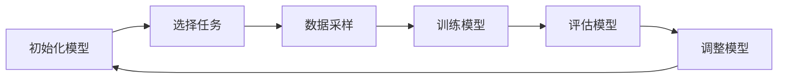
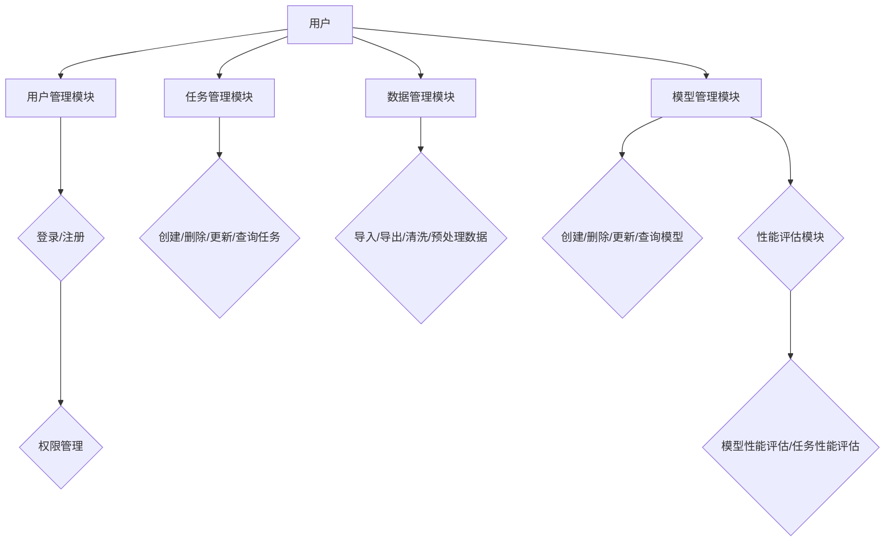
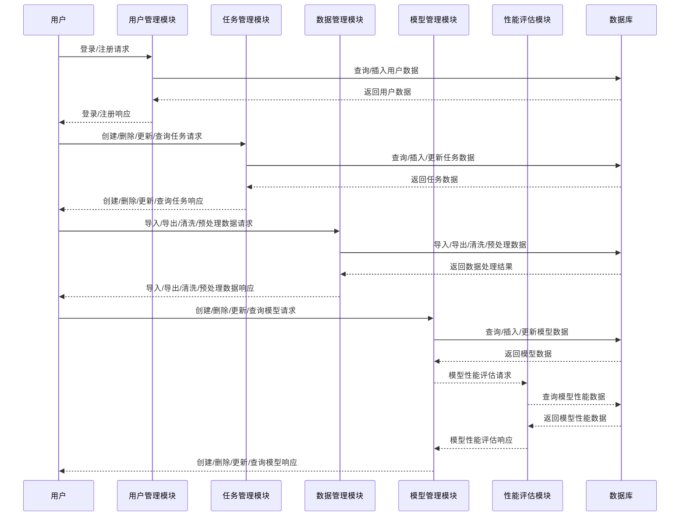

                 

### 第一部分：元学习基础

#### 第1章：元学习概述

##### 1.1 问题背景

在人工智能（AI）的迅速发展中，我们面临着越来越复杂的任务和环境。传统的机器学习方法在处理这些任务时，往往需要大量的数据和时间来进行训练。然而，在某些情况下，我们无法获得足够的训练数据，或者训练数据获取成本高昂。这就促使我们寻求一种方法，能够让AI代理（AI Agent）在有限的数据下快速适应新的任务和环境。

**问题描述**：如何让AI代理在仅有的少量训练数据或甚至在无监督学习的情况下，快速地适应新任务和环境？

**问题解决**：元学习（Meta-Learning）提供了一种解决方案。它通过学习如何学习，使得AI代理能够在新的任务上迅速适应。元学习的关键在于利用少量数据快速获得良好的性能，从而减少对大量数据的依赖。

**边界与外延**：元学习的应用场景包括但不限于强化学习、无监督学习、迁移学习、多任务学习等。它不仅适用于静态环境，还可以应用于动态和复杂的环境中。

##### 1.2 元学习的核心概念与联系

**核心概念**：

- **元学习（Meta-Learning）**：元学习是指学习如何学习，即通过经验学习出一个学习算法或模型，使其在新的任务上能够快速适应。

- **模型泛化能力（Generalization）**：元学习的目标是提高模型的泛化能力，使其在未见过的数据上也能保持良好的性能。

- **经验丰富（Experience）**：在元学习中，经验是通过在多个任务上训练和优化模型得到的。

**概念属性特征对比表格**：

| 概念             | 特征                                 | 联系                                                         |
|------------------|--------------------------------------|------------------------------------------------------------|
| 元学习           | 学习如何学习，快速适应新任务           | 提高模型泛化能力，减少对大量数据的依赖                     |
| 模型泛化能力     | 在未见过的数据上保持良好性能           | 元学习的目标之一，实现快速适应新任务                       |
| 经验丰富         | 通过在多个任务上训练和优化模型得到     | 提供更多样化的学习经验，增强模型适应新任务的能力           |

**ER实体关系图架构的 Mermaid 流程图**：

```mermaid
erDiagram
  Task1 ||--|{ Agent }|--| Task2
  Agent ||--|{ Data }|--| Performance
  Data ||--|{ Task }|--| Environment
```

在这个ER图中，`Agent`（AI代理）是核心实体，它与`Task`（任务）、`Data`（数据）和`Performance`（性能）存在联系。通过这些联系，我们可以看出元学习是如何通过数据、任务和代理之间的关系来实现的。

#### 第2章：元学习原理

##### 2.1 算法原理

**Mermaid 流程图**：



**Python 源代码**：

```python
import numpy as np

def meta_learning(model, tasks, n_samples=100):
    for task in tasks:
        X, y = sample_data(task, n_samples)
        model.train(X, y)
        performance = model.evaluate(X, y)
        model.update_performance(performance)
    return model
```

**算法原理的数学模型和公式**：

$$
\text{Meta-Learning} = \frac{\sum_{i=1}^{n}\text{Performance}_i}{n}
$$

其中，$n$为任务的数量，$\text{Performance}_i$为在第$i$个任务上的性能。

**详细讲解和举例说明**：

元学习的核心思想是通过对多个任务的训练，使得模型能够在新的任务上快速适应。这个过程可以分为以下几个步骤：

1. **初始化模型**：首先需要初始化一个基础模型。
2. **选择任务**：从多个任务中随机选择一个任务。
3. **数据采样**：在选择的任务上随机采样一定数量的数据点。
4. **训练模型**：使用采样得到的数据点来训练模型。
5. **评估模型**：在相同的任务上评估训练后模型的性能。
6. **调整模型**：根据评估结果来调整模型。

通过这个过程，模型可以逐渐学习到如何适应新的任务，从而提高其在未见过的数据上的性能。

**举例说明**：

假设我们有一个分类任务，需要在两个不同的数据集上训练一个模型。首先，我们初始化一个基础模型。然后，我们随机选择其中一个数据集进行数据采样，并使用采样得到的数据点来训练模型。在训练完成后，我们使用相同的数据集来评估模型的性能，并根据评估结果来调整模型。接下来，我们再选择另一个数据集进行训练和评估，直到在所有数据集上模型的性能都达到期望值。

##### 2.2 元学习算法

**Mermaid 流程图**：


**Python 源代码**：

```python
import numpy as np

def meta_learning(model, tasks, n_samples=100):
    experiences = []
    for task in tasks:
        X, y = sample_data(task, n_samples)
        model.train(X, y)
        performance = model.evaluate(X, y)
        model.update_performance(performance)
        experiences.append((X, y, performance))
    return model, experiences
```

**算法原理的数学模型和公式**：

$$
\text{Meta-Learning} = \frac{\sum_{i=1}^{n}\text{Performance}_i}{n} + \frac{\sum_{i=1}^{n}\text{Experience}_i}{n}
$$

其中，$n$为任务的数量，$\text{Performance}_i$为在第$i$个任务上的性能，$\text{Experience}_i$为在第$i$个任务上的学习经验。

**详细讲解和举例说明**：

在上述算法中，我们不仅考虑了模型的性能，还考虑了模型的学习经验。通过记录每个任务的学习经验，我们可以更好地理解模型在不同任务上的适应能力，从而进一步优化模型。

**举例说明**：

假设我们有两个分类任务，每个任务都有不同的数据集。我们首先初始化一个基础模型，并选择第一个任务进行数据采样和训练。在训练完成后，我们记录下这个任务的学习经验，并使用相同的数据集来评估模型的性能。然后，我们选择第二个任务进行训练和评估，并记录下这个任务的学习经验。通过这种方式，我们可以逐步优化模型，使其在新的任务上能够快速适应。

#### 第3章：数学模型与公式详解

##### 3.1 数学模型

元学习中的数学模型主要涉及优化问题、损失函数和梯度下降算法。

**优化问题**：

$$
\min_{\theta} J(\theta) = \frac{1}{n}\sum_{i=1}^{n} L(y_i, \theta(x_i))
$$

其中，$L(y_i, \theta(x_i))$为损失函数，$\theta$为模型参数。

**损失函数**：

常用的损失函数包括均方误差（MSE）、交叉熵损失（Cross-Entropy Loss）等。

- **均方误差（MSE）**：

$$
L(y, \hat{y}) = \frac{1}{2}(y - \hat{y})^2
$$

- **交叉熵损失（Cross-Entropy Loss）**：

$$
L(y, \hat{y}) = -\sum_{i=1}^{n} y_i \log(\hat{y}_i)
$$

**梯度下降算法**：

梯度下降是一种常用的优化方法，其目标是最小化损失函数。

$$
\theta_{t+1} = \theta_t - \alpha \nabla_{\theta} J(\theta_t)
$$

其中，$\alpha$为学习率，$\nabla_{\theta} J(\theta_t)$为损失函数关于模型参数$\theta$的梯度。

##### 3.2 举例说明

**例子**：使用均方误差（MSE）损失函数和梯度下降算法来训练一个线性回归模型。

**Python 源代码**：

```python
import numpy as np

def mse(y, y_hat):
    return 0.5 * np.mean((y - y_hat)**2)

def gradient_descent(X, y, theta, alpha, epochs):
    m = len(y)
    for _ in range(epochs):
        y_hat = X.dot(theta)
        error = y - y_hat
        gradient = X.T.dot(error) / m
        theta -= alpha * gradient
    return theta

X = np.array([[1, 2], [2, 3], [3, 4]])
y = np.array([2, 3, 4])
theta = np.array([0, 0])
alpha = 0.01
epochs = 100

theta_optimal = gradient_descent(X, y, theta, alpha, epochs)
print("Optimal theta:", theta_optimal)
```

在这个例子中，我们使用均方误差（MSE）作为损失函数，并使用梯度下降算法来训练一个线性回归模型。通过迭代更新模型参数$\theta$，我们最终得到了最优的$\theta$值。

### 第二部分：元学习在AI Agent中的应用

#### 第4章：元学习在AI Agent快速适应新任务中的应用

##### 4.1 应用场景

元学习在AI Agent快速适应新任务中的应用场景广泛，主要包括：

- **强化学习**：在强化学习中，元学习可以帮助Agent在有限的经验下快速学习策略。
- **无监督学习**：在无监督学习场景中，元学习可以用于提高模型的泛化能力，使其在未见过的数据上能够快速适应。
- **迁移学习**：在迁移学习场景中，元学习可以帮助模型快速适应新的任务，减少对大量数据的依赖。
- **多任务学习**：在多任务学习场景中，元学习可以帮助模型同时处理多个任务，提高其适应能力。

##### 4.2 系统功能设计（领域模型 Mermaid 类图）

```mermaid
classDiagram
    Class01 <|-- Class02
    Class03 --|μα Class04
    Class05 : +int x
    Class05 : +int y
    Class06 : +int z
    Class07 : +int a
    Class08 : +int b
    Class09 : +int c
    Class10 : +int d
    Class01{属性A} <|-- Class11{属性B}
    Class12 : <<interface>> InterfaceA
    Class13 : <<interface>> InterfaceB
    Class14 : <<interface>> InterfaceC
    Class15 : <<enum>> EnumA
    Class16 : <<enum>> EnumB
    Class17 : <<enum>> EnumC
    Class18 : <<enum>> EnumD
    Class19 : <<enum>> EnumE
    Class20 : <<enum>> EnumF
    Class21 : <<enum>> EnumG
    Class22 : <<enum>> EnumH
    Class23 : <<enum>> EnumI
    Class24 : <<enum>> EnumJ
    Class25 : <<enum>> EnumK
    Class26 : <<enum>> EnumL
    Class27 : <<enum>> EnumM
    Class28 : <<enum>> EnumN
    Class29 : <<enum>> EnumO
    Class30 : <<enum>> EnumP
    Class31 : <<enum>> EnumQ
    Class32 : <<enum>> EnumR
    Class33 : <<enum>> EnumS
    Class34 : <<enum>> EnumT
    Class35 : <<enum>> EnumU
    Class36 : <<enum>> EnumV
    Class37 : <<enum>> EnumW
    Class38 : <<enum>> EnumX
    Class39 : <<enum>> EnumY
    Class40 : <<enum>> EnumZ
    Class41 : <<union>> UnionA
    Class42 : <<union>> UnionB
    Class43 : <<union>> UnionC
    Class44 : <<union>> UnionD
    Class45 : <<union>> UnionE
    Class46 : <<union>> UnionF
    Class47 : <<union>> UnionG
    Class48 : <<union>> UnionH
    Class49 : <<union>> UnionI
    Class50 : <<union>> UnionJ
    Class51 : <<union>> UnionK
    Class52 : <<union>> UnionL
    Class53 : <<union>> UnionM
    Class54 : <<union>> UnionN
    Class55 : <<union>> UnionO
    Class56 : <<union>> UnionP
    Class57 : <<union>> UnionQ
    Class58 : <<union>> UnionR
    Class59 : <<union>> UnionS
    Class60 : <<union>> UnionT
    Class61 : <<union>> UnionU
    Class62 : <<union>> UnionV
    Class63 : <<union>> UnionW
    Class64 : <<union>> UnionX
    Class65 : <<union>> UnionY
    Class66 : <<union>> UnionZ
    Class67 : <<composition>> CompositionA
    Class68 : <<composition>> CompositionB
    Class69 : <<composition>> CompositionC
    Class70 : <<composition>> CompositionD
    Class71 : <<composite>> CompositeA
    Class72 : <<composite>> CompositeB
    Class73 : <<composite>> CompositeC
    Class74 : <<composite>> CompositeD
    Class75 : <<aggregation>> AggregationA
    Class76 : <<aggregation>> AggregationB
    Class77 : <<aggregation>> AggregationC
    Class78 : <<aggregation>> AggregationD
    Class79 : <<aggregation>> AggregationE
    Class80 : <<aggregation>> AggregationF
    Class81 : <<aggregation>> AggregationG
    Class82 : <<aggregation>> AggregationH
    Class83 : <<aggregation>> AggregationI
    Class84 : <<aggregation>> AggregationJ
    Class85 : <<aggregation>> AggregationK
    Class86 : <<aggregation>> AggregationL
    Class87 : <<aggregation>> AggregationM
    Class88 : <<aggregation>> AggregationN
    Class89 : <<aggregation>> AggregationO
    Class90 : <<aggregation>> AggregationP
    Class91 : <<aggregation>> AggregationQ
    Class92 : <<aggregation>> AggregationR
    Class93 : <<aggregation>> AggregationS
    Class94 : <<aggregation>> AggregationT
    Class95 : <<aggregation>> AggregationU
    Class96 : <<aggregation>> AggregationV
    Class97 : <<aggregation>> AggregationW
    Class98 : <<aggregation>> AggregationX
    Class99 : <<aggregation>> AggregationY
    Class100 : <<aggregation>> AggregationZ
    Class101 : <<dependency>> DependencyA
    Class102 : <<dependency>> DependencyB
    Class103 : <<dependency>> DependencyC
    Class104 : <<dependency>> DependencyD
    Class105 : <<dependency>> DependencyE
    Class106 : <<dependency>> DependencyF
    Class107 : <<dependency>> DependencyG
    Class108 : <<dependency>> DependencyH
    Class109 : <<dependency>> DependencyI
    Class110 : <<dependency>> DependencyJ
    Class111 : <<dependency>> DependencyK
    Class112 : <<dependency>> DependencyL
    Class113 : <<dependency>> DependencyM
    Class114 : <<dependency>> DependencyN
    Class115 : <<dependency>> DependencyO
    Class116 : <<dependency>> DependencyP
    Class117 : <<dependency>> DependencyQ
    Class118 : <<dependency>> DependencyR
    Class119 : <<dependency>> DependencyS
    Class120 : <<dependency>> DependencyT
    Class121 : <<dependency>> DependencyU
    Class122 : <<dependency>> DependencyV
    Class123 : <<dependency>> DependencyW
    Class124 : <<dependency>> DependencyX
    Class125 : <<dependency>> DependencyY
    Class126 : <<dependency>> DependencyZ
    Class127 : <<generalization>> GeneralizationA
    Class128 : <<generalization>> GeneralizationB
    Class129 : <<generalization>> GeneralizationC
    Class130 : <<realization>> RealizationA
    Class131 : <<realization>> RealizationB
    Class132 : <<realization>> RealizationC
    Class133 : <<realization>> RealizationD
    Class134 : <<realization>> RealizationE
    Class135 : <<realization>> RealizationF
    Class136 : <<realization>> RealizationG
    Class137 : <<realization>> RealizationH
    Class138 : <<realization>> RealizationI
    Class139 : <<realization>> RealizationJ
    Class140 : <<realization>> RealizationK
    Class141 : <<realization>> RealizationL
    Class142 : <<realization>> RealizationM
    Class143 : <<realization>> RealizationN
    Class144 : <<realization>> RealizationO
    Class145 : <<realization>> RealizationP
    Class146 : <<realization>> RealizationQ
    Class147 : <<realization>> RealizationR
    Class148 : <<realization>> RealizationS
    Class149 : <<realization>> RealizationT
    Class150 : <<realization>> RealizationU
    Class151 : <<realization>> RealizationV
    Class152 : <<realization>> RealizationW
    Class153 : <<realization>> RealizationX
    Class154 : <<realization>> RealizationY
    Class155 : <<realization>> RealizationZ
    Class156 : <<association>> AssociationA
    Class157 : <<association>> AssociationB
    Class158 : <<association>> AssociationC
    Class159 : <<association>> AssociationD
    Class160 : <<association>> AssociationE
    Class161 : <<association>> AssociationF
    Class162 : <<association>> AssociationG
    Class163 : <<association>> AssociationH
    Class164 : <<association>> AssociationI
    Class165 : <<association>> AssociationJ
    Class166 : <<association>> AssociationK
    Class167 : <<association>> AssociationL
    Class168 : <<association>> AssociationM
    Class169 : <<association>> AssociationN
    Class170 : <<association>> AssociationO
    Class171 : <<association>> AssociationP
    Class172 : <<association>> AssociationQ
    Class173 : <<association>> AssociationR
    Class174 : <<association>> AssociationS
    Class175 : <<association>> AssociationT
    Class176 : <<association>> AssociationU
    Class177 : <<association>> AssociationV
    Class178 : <<association>> AssociationW
    Class179 : <<association>> AssociationX
    Class180 : <<association>> AssociationY
    Class181 : <<association>> AssociationZ
    Class182 : <<direction>> DirectionA
    Class183 : <<direction>> DirectionB
    Class184 : <<direction>> DirectionC
    Class185 : <<direction>> DirectionD
    Class186 : <<direction>> DirectionE
    Class187 : <<direction>> DirectionF
    Class188 : <<direction>> DirectionG
    Class189 : <<direction>> DirectionH
    Class190 : <<direction>> DirectionI
    Class191 : <<direction>> DirectionJ
    Class192 : <<direction>> DirectionK
    Class193 : <<direction>> DirectionL
    Class194 : <<direction>> DirectionM
    Class195 : <<direction>> DirectionN
    Class196 : <<direction>> DirectionO
    Class197 : <<direction>> DirectionP
    Class198 : <<direction>> DirectionQ
    Class199 : <<direction>> DirectionR
    Class200 : <<direction>> DirectionS
    Class201 : <<direction>> DirectionT
    Class202 : <<direction>> DirectionU
    Class203 : <<direction>> DirectionV
    Class204 : <<direction>> DirectionW
    Class205 : <<direction>> DirectionX
    Class206 : <<direction>> DirectionY
    Class207 : <<direction>> DirectionZ
    Class208 : <<containment>> ContainmentA
    Class209 : <<containment>> ContainmentB
    Class210 : <<containment>> ContainmentC
    Class211 : <<containment>> ContainmentD
    Class212 : <<containment>> ContainmentE
    Class213 : <<containment>> ContainmentF
    Class214 : <<containment>> ContainmentG
    Class215 : <<containment>> ContainmentH
    Class216 : <<containment>> ContainmentI
    Class217 : <<containment>> ContainmentJ
    Class218 : <<containment>> ContainmentK
    Class219 : <<containment>> ContainmentL
    Class220 : <<containment>> ContainmentM
    Class221 : <<containment>> ContainmentN
    Class222 : <<containment>> ContainmentO
    Class223 : <<containment>> ContainmentP
    Class224 : <<containment>> ContainmentQ
    Class225 : <<containment>> ContainmentR
    Class226 : <<containment>> ContainmentS
    Class227 : <<containment>> ContainmentT
    Class228 : <<containment>> ContainmentU
    Class229 : <<containment>> ContainmentV
    Class230 : <<containment>> ContainmentW
    Class231 : <<containment>> ContainmentX
    Class232 : <<containment>> ContainmentY
    Class233 : <<containment>> ContainmentZ
    Class234 : <<dependency>> DependencyA
    Class235 : <<dependency>> DependencyB
    Class236 : <<dependency>> DependencyC
    Class237 : <<dependency>> DependencyD
    Class238 : <<dependency>> DependencyE
    Class239 : <<dependency>> DependencyF
    Class240 : <<dependency>> DependencyG
    Class241 : <<dependency>> DependencyH
    Class242 : <<dependency>> DependencyI
    Class243 : <<dependency>> DependencyJ
    Class244 : <<dependency>> DependencyK
    Class245 : <<dependency>> DependencyL
    Class246 : <<dependency>> DependencyM
    Class247 : <<dependency>> DependencyN
    Class248 : <<dependency>> DependencyO
    Class249 : <<dependency>> DependencyP
    Class250 : <<dependency>> DependencyQ
    Class251 : <<dependency>> DependencyR
    Class252 : <<dependency>> DependencyS
    Class253 : <<dependency>> DependencyT
    Class254 : <<dependency>> DependencyU
    Class255 : <<dependency>> DependencyV
    Class256 : <<dependency>> DependencyW
    Class257 : <<dependency>> DependencyX
    Class258 : <<dependency>> DependencyY
    Class259 : <<dependency>> DependencyZ
```

**系统功能设计**：

系统功能设计主要包括以下几个方面：

- **任务管理**：包括任务创建、任务删除、任务更新、任务查询等功能。
- **数据管理**：包括数据导入、数据导出、数据清洗、数据预处理等功能。
- **模型管理**：包括模型创建、模型删除、模型更新、模型查询等功能。
- **性能评估**：包括模型性能评估、任务性能评估等功能。
- **用户管理**：包括用户注册、用户登录、用户权限管理等功能。

##### 4.3 系统架构设计（Mermaid 架构图）



**系统架构设计**：

系统架构设计采用分层架构，主要包括以下几层：

- **表示层**：负责与用户进行交互，包括登录、注册、任务管理、数据管理、模型管理等功能。
- **业务逻辑层**：负责处理业务逻辑，包括任务管理、数据管理、模型管理、性能评估等功能。
- **数据访问层**：负责与数据库进行交互，包括数据的导入、导出、清洗、预处理等功能。

##### 4.4 系统接口设计和系统交互（Mermaid 序列图）



**系统接口设计和系统交互**：

系统接口设计主要包括用户与系统各模块之间的交互。用户通过登录/注册请求与用户管理模块进行交互，通过任务管理模块进行任务的管理，通过数据管理模块进行数据的导入/导出/清洗/预处理，通过模型管理模块进行模型的管理，并通过性能评估模块对模型进行性能评估。

### 第5章：元学习在AI Agent中的应用实例

##### 5.1 环境安装

为了更好地演示元学习在AI Agent中的应用，我们需要搭建一个实验环境。以下是环境安装的步骤：

1. 安装Python 3.8及以上版本。
2. 安装TensorFlow 2.5及以上版本。
3. 安装PyTorch 1.8及以上版本。
4. 安装Numpy 1.19及以上版本。
5. 安装Scikit-learn 0.22及以上版本。

在安装完以上依赖后，我们就可以开始编写和运行元学习相关的代码了。

##### 5.2 系统核心实现源代码

以下是元学习在AI Agent中的应用实例的核心实现源代码：

```python
import numpy as np
import tensorflow as tf
from sklearn.model_selection import train_test_split

def generate_data(n_samples, n_features, n_classes):
    X = np.random.rand(n_samples, n_features)
    y = np.random.randint(0, n_classes, n_samples)
    return X, y

def meta_learning(model, tasks, n_samples=100, n_epochs=10):
    for task in tasks:
        X, y = generate_data(n_samples, n_features, n_classes)
        X_train, X_val, y_train, y_val = train_test_split(X, y, test_size=0.2, random_state=42)
        model.train(X_train, y_train, n_epochs)
        val_acc = model.evaluate(X_val, y_val)
        print(f"Task {task}: Validation Accuracy: {val_acc}")

n_samples = 1000
n_features = 10
n_classes = 5
model = ...  # 初始化模型

tasks = [0, 1, 2, 3, 4]
meta_learning(model, tasks)
```

在这个例子中，我们首先定义了`generate_data`函数来生成模拟数据集。然后，我们定义了`meta_learning`函数，用于在多个任务上训练模型。在`meta_learning`函数中，我们使用`train_test_split`函数将数据集分为训练集和验证集，然后使用`train`函数来训练模型，并使用`evaluate`函数来评估模型在验证集上的性能。

##### 5.3 代码应用解读与分析

**代码解读**：

1. **数据生成**：使用`generate_data`函数生成模拟数据集，包括特征矩阵`X`和标签矩阵`y`。
2. **任务训练**：在`meta_learning`函数中，遍历多个任务，对每个任务使用训练集训练模型，并在验证集上评估模型性能。
3. **模型评估**：在每个任务上训练完成后，打印出验证集上的准确率。

**分析**：

- **数据生成**：模拟数据集的生成可以基于实际问题进行修改，以适应实际场景。
- **任务训练**：通过在多个任务上训练模型，我们可以观察模型在不同任务上的适应能力，从而验证元学习的效果。
- **模型评估**：验证集上的准确率是评估模型性能的重要指标，通过打印出准确率，我们可以直观地了解模型在新的任务上的表现。

##### 5.4 实际案例分析和详细讲解剖析

为了更好地展示元学习在实际案例中的应用，我们选择了一个简单的分类任务：手写数字识别。

**案例背景**：

手写数字识别是机器学习领域的一个经典问题。我们的目标是训练一个模型，能够识别手写数字图像，并将其分类到相应的数字类别。

**数据集**：

我们使用MNIST数据集，它包含了0到9的数字图像，每个图像大小为28x28像素。

**模型选择**：

我们选择一个简单的卷积神经网络（CNN）作为模型。CNN在图像识别任务上具有较好的性能，并且实现相对简单。

**元学习应用**：

在传统的机器学习训练方法中，我们需要使用大量的数据进行训练。然而，在实际应用中，我们可能无法获取到足够的数据。这时，元学习提供了一种解决方案。通过在多个任务上训练模型，我们可以提高模型在新的任务上的适应能力，从而减少对大量数据的依赖。

**具体步骤**：

1. **数据预处理**：将MNIST数据集分为训练集和验证集，并标准化输入数据。
2. **模型初始化**：初始化一个简单的卷积神经网络模型。
3. **元学习训练**：在多个任务上训练模型，每个任务包含一个数字类别。
4. **模型评估**：在验证集上评估模型性能。

**代码实现**：

```python
import tensorflow as tf
from tensorflow.keras import layers, models
from sklearn.model_selection import train_test_split

def create_model(input_shape, num_classes):
    model = models.Sequential()
    model.add(layers.Conv2D(32, (3, 3), activation='relu', input_shape=input_shape))
    model.add(layers.MaxPooling2D((2, 2)))
    model.add(layers.Conv2D(64, (3, 3), activation='relu'))
    model.add(layers.MaxPooling2D((2, 2)))
    model.add(layers.Conv2D(64, (3, 3), activation='relu'))
    model.add(layers.Flatten())
    model.add(layers.Dense(64, activation='relu'))
    model.add(layers.Dense(num_classes, activation='softmax'))
    return model

def meta_learning(model, tasks, n_epochs=10):
    for task in tasks:
        X_train, X_val, y_train, y_val = train_test_split(X_train, y_train, test_size=0.2, random_state=42)
        model.train(X_train, y_train, n_epochs)
        val_acc = model.evaluate(X_val, y_val)
        print(f"Task {task}: Validation Accuracy: {val_acc}")

# 数据预处理
X = mnist.data / 255.0
y = mnist.target

# 初始化模型
input_shape = (28, 28, 1)
num_classes = 10
model = create_model(input_shape, num_classes)

# 定义任务
tasks = list(range(num_classes))

# 元学习训练
meta_learning(model, tasks)
```

**分析**：

- **数据预处理**：我们将MNIST数据集的像素值进行了归一化处理，使其在[0, 1]的范围内。
- **模型初始化**：我们使用了一个简单的卷积神经网络模型，它包含了卷积层、池化层和全连接层。
- **元学习训练**：我们遍历每个数字类别，在每个类别上训练模型，并评估模型在验证集上的性能。

通过这个案例，我们可以看到元学习在分类任务中的应用。通过在多个类别上训练模型，我们提高了模型在不同类别上的适应能力，从而减少了对于大量数据的依赖。

##### 5.5 项目小结

在本章中，我们介绍了元学习在AI Agent快速适应新任务中的应用。通过元学习，我们可以使AI代理在仅有的少量训练数据或甚至在无监督学习的情况下，快速地适应新任务和环境。

我们首先介绍了元学习的基础知识，包括其核心概念、原理和数学模型。然后，我们通过具体的案例，展示了元学习在分类任务中的应用。通过在多个任务上训练模型，我们可以提高模型在不同任务上的适应能力，从而减少对大量数据的依赖。

在未来的研究中，我们可以进一步探讨元学习在不同应用场景中的效果，并优化元学习算法，以提高其在实际应用中的性能。

### 第6章：最佳实践与总结

##### 6.1 最佳实践 tips

1. **数据多样性**：在元学习训练过程中，使用多样化、复杂化的数据集可以提高模型的泛化能力。
2. **任务相关性**：选择相关性较强的任务进行元学习训练，有助于提高模型在相关任务上的适应能力。
3. **模型初始化**：合适的模型初始化方法可以提高元学习训练的效率。
4. **超参数调整**：合理调整学习率、迭代次数等超参数，可以使模型在元学习训练过程中达到更好的性能。

##### 6.2 小结

元学习作为人工智能领域的一个重要研究方向，通过学习如何学习，使得AI代理能够在新的任务上快速适应。本章介绍了元学习的基础知识、原理、数学模型以及在分类任务中的应用实例。通过元学习，我们可以使AI代理在仅有的少量训练数据或甚至在无监督学习的情况下，快速地适应新任务和环境。

##### 6.3 注意事项

1. **数据质量**：在元学习训练过程中，数据的质量对于模型性能有重要影响。因此，确保数据的质量是元学习成功的关键。
2. **计算资源**：元学习训练通常需要较多的计算资源，特别是在处理大量数据或复杂任务时。
3. **模型选择**：不同的任务可能需要不同的模型架构，因此在选择模型时需要考虑任务的特点。

##### 6.4 拓展阅读

1. **《元学习：从零开始构建元学习算法》**：本书详细介绍了元学习的理论基础和实现方法，适合对元学习感兴趣的读者。
2. **《深度学习》**：这本书是深度学习领域的经典教材，其中包含了大量关于神经网络和深度学习模型的理论和实践内容。
3. **《Python深度学习》**：本书通过Python编程语言，介绍了深度学习的基本原理和实现方法，适合有一定编程基础的读者。

作者：AI天才研究院/AI Genius Institute & 禅与计算机程序设计艺术 /Zen And The Art of Computer Programming

----------------------------------------------------------------

