                 

# 《元宇宙内容生成：提示词构建虚拟世界的基石》

## 关键词

- 元宇宙
- 内容生成
- 提示词
- 虚拟世界
- 图像生成
- 视频生成
- 文本生成

## 摘要

本文旨在探讨元宇宙内容生成过程中，提示词作为构建虚拟世界基石的重要作用。我们将首先介绍元宇宙的定义、发展历程及其应用场景，然后深入分析元宇宙内容生成的核心技术，包括图像、视频和文本生成技术。接下来，我们将聚焦于提示词的构建，详细阐述提示词的概念、分类及其生成方法，以及优化策略。随后，我们将探讨虚拟世界的构建方法及其交互设计。文章最后，将结合实践案例展示元宇宙内容生成的全过程，并分析面临的主要挑战及未来发展趋势。

### 目录大纲

----------------------------------------------------------------

# 《元宇宙内容生成：提示词构建虚拟世界的基石》

## 第一部分：背景介绍

### 第1章：元宇宙概述

#### 1.1 元宇宙的定义与发展历程

#### 1.2 元宇宙的核心技术

#### 1.3 元宇宙的应用场景与市场前景

### 第2章：元宇宙内容生成技术

#### 2.1 图像生成技术

##### 2.1.1 图像生成算法介绍

##### 2.1.2 图像生成技术应用

#### 2.2 视频生成技术

##### 2.2.1 视频生成算法介绍

##### 2.2.2 视频生成技术应用

#### 2.3 文本生成技术

##### 2.3.1 文本生成算法介绍

##### 2.3.2 文本生成技术应用

## 第二部分：提示词构建

### 第3章：提示词构建

#### 3.1 提示词的概念与分类

#### 3.2 提示词的生成方法

##### 3.2.1 基于规则的方法

##### 3.2.2 基于数据的方法

##### 3.2.3 基于深度学习的方法

#### 3.3 提示词优化策略

##### 3.3.1 提示词长度优化

##### 3.3.2 提示词多样性优化

##### 3.3.3 提示词质量优化

## 第三部分：虚拟世界构建

### 第4章：虚拟世界构建

#### 4.1 虚拟世界的基本要素

#### 4.2 虚拟世界构建方法

##### 4.2.1 基于场景的方法

##### 4.2.2 基于角色的方法

##### 4.2.3 基于故事线的方法

#### 4.3 虚拟世界交互设计

##### 4.3.1 用户交互设计

##### 4.3.2 虚拟物体交互设计

## 第四部分：实践案例

### 第5章：元宇宙内容生成实践

#### 5.1 环境搭建

##### 5.1.1 硬件环境搭建

##### 5.1.2 软件环境搭建

#### 5.2 数据准备

##### 5.2.1 数据收集

##### 5.2.2 数据预处理

#### 5.3 实践案例

##### 5.3.1 图像生成案例

##### 5.3.2 视频生成案例

##### 5.3.3 文本生成案例

## 第五部分：挑战与未来展望

### 第6章：挑战与未来展望

#### 6.1 元宇宙内容生成面临的主要挑战

#### 6.2 技术发展趋势与未来展望

#### 6.3 政策法规与伦理问题

### 第7章：总结与展望

#### 7.1 主要内容回顾

#### 7.2 学习建议与资源推荐

#### 7.3 元宇宙内容生成领域的发展趋势

## 内容概述

## 第一部分：背景介绍

### 第1章：元宇宙概述

在本章节中，我们将对元宇宙进行概述，包括其定义、发展历程以及应用场景。元宇宙，即扩展现实（XR）平台，是一个虚拟的三维空间，通过集成虚拟现实（VR）、增强现实（AR）和混合现实（MR）技术，为用户提供沉浸式的体验。我们还将讨论元宇宙的核心技术，如5G、云计算、区块链和人工智能等。

### 第2章：元宇宙内容生成技术

在本章节中，我们将详细介绍元宇宙内容生成的核心技术，包括图像生成技术、视频生成技术和文本生成技术。我们将分别介绍这些技术的原理、应用以及发展趋势。

### 第二部分：提示词构建

### 第3章：提示词构建

在本章节中，我们将深入探讨提示词的概念、分类和生成方法。我们将详细讨论基于规则、数据和深度学习的方法，并介绍提示词优化策略，以提高内容生成的质量和多样性。

### 第三部分：虚拟世界构建

### 第4章：虚拟世界构建

在本章节中，我们将介绍虚拟世界构建的基本要素和方法。我们将探讨基于场景、角色和故事线的方法，并讨论虚拟世界交互设计的重要性。

### 第四部分：实践案例

### 第5章：元宇宙内容生成实践

在本章节中，我们将通过实际案例，展示如何搭建环境、准备数据和实现元宇宙内容生成。我们将涵盖图像、视频和文本生成的具体实践，帮助读者将理论知识应用到实际项目中。

### 第五部分：挑战与未来展望

### 第6章：挑战与未来展望

在本章节中，我们将分析元宇宙内容生成面临的主要挑战，如技术瓶颈、数据隐私和伦理问题。同时，我们将探讨技术发展趋势和未来展望，为读者提供行业发展方向的指导。

### 第7章：总结与展望

在本章节中，我们将对全书内容进行总结，回顾主要知识点，并提供学习建议和资源推荐。最后，我们将展望元宇宙内容生成领域的未来发展，为读者提供更广阔的视野。

## 具体内容

### 第1章：元宇宙概述

### 1.1 元宇宙的定义与发展历程

元宇宙（Metaverse）是一个虚拟的三维空间，通过集成虚拟现实（VR）、增强现实（AR）和混合现实（MR）技术，为用户提供沉浸式的体验。它通常被描述为一个虚拟世界，用户可以在其中交互、社交、娱乐和工作。元宇宙的概念最早可以追溯到1982年的科幻小说《雪崩》（Snow Crash），而近年来，随着技术的进步，元宇宙逐渐成为一个热门话题。

元宇宙的发展历程可以分为几个阶段：

1. **早期探索**：20世纪90年代，虚拟现实技术开始兴起，例如VRML（Virtual Reality Modeling Language）和Second Life等平台。

2. **互联网阶段**：随着互联网的普及，在线游戏和社交网络成为元宇宙的重要组成部分。

3. **移动设备阶段**：智能手机和平板电脑的出现，使得元宇宙体验从桌面扩展到移动设备。

4. **5G和云计算阶段**：5G和云计算技术的成熟，为元宇宙提供了更快的网络连接和强大的计算能力。

### 1.2 元宇宙的核心技术

元宇宙的实现依赖于多项核心技术的支持，主要包括：

1. **虚拟现实（VR）**：通过头戴式显示器（HMD）和定位传感器，为用户创造一个沉浸式的虚拟环境。

2. **增强现实（AR）**：在现实环境中叠加虚拟元素，使用户能够与虚拟世界互动。

3. **混合现实（MR）**：结合VR和AR技术，提供更丰富的交互体验。

4. **5G网络**：高速、低延迟的网络连接，确保用户能够在元宇宙中流畅地交互。

5. **云计算**：提供强大的计算能力和存储资源，支持大规模的虚拟世界运行。

6. **区块链**：通过分布式账本技术，确保虚拟资产的安全性和可追溯性。

7. **人工智能**：用于内容生成、智能交互和个性化推荐等。

### 1.3 元宇宙的应用场景与市场前景

元宇宙的应用场景非常广泛，包括但不限于以下几个方面：

1. **娱乐**：虚拟游戏、电影、音乐会等，提供全新的娱乐体验。

2. **教育**：虚拟课堂、实训基地等，提高教育质量和互动性。

3. **工作**：虚拟办公室、远程会议、协同工作等，提高工作效率。

4. **社交**：虚拟社交网络、线上社区等，扩大社交圈子。

5. **医疗**：虚拟手术、远程诊断、康复训练等，提高医疗服务水平。

6. **房地产**：虚拟房地产交易、虚拟展示等，提供全新的购房体验。

据市场调研公司Statista的数据，元宇宙市场预计将在2024年达到1200亿美元，并在2030年达到1.5万亿美元的规模。随着技术的不断进步和应用的不断拓展，元宇宙有望成为下一个数字经济的重要驱动力。

### 第2章：元宇宙内容生成技术

元宇宙内容生成是元宇宙生态系统中至关重要的一环。它涉及到如何创建和生成丰富的虚拟内容，以支持用户在元宇宙中的各种活动。在本章节中，我们将详细探讨元宇宙内容生成的主要技术，包括图像生成技术、视频生成技术和文本生成技术。

#### 2.1 图像生成技术

图像生成技术是元宇宙内容生成的基础，它涉及从文本描述、图像标签或音频输入中生成图像。以下是几种常见的图像生成技术：

1. **基于规则的图像生成**：这种方法通过一系列预定义的规则和算法来生成图像。例如，使用几何形状和颜色规则生成简单的图案。

2. **基于数据的图像生成**：这种方法利用已有的图像数据集，通过数据增强和模型训练来生成新的图像。常见的算法包括生成对抗网络（GAN）和变分自编码器（VAE）。

3. **基于深度学习的图像生成**：这种方法利用深度学习模型，尤其是生成对抗网络（GAN），来生成逼真的图像。GAN由一个生成器和一个判别器组成，生成器试图生成逼真的图像，而判别器则试图区分生成的图像和真实图像。

以下是一个简单的基于深度学习的图像生成算法的流程图：

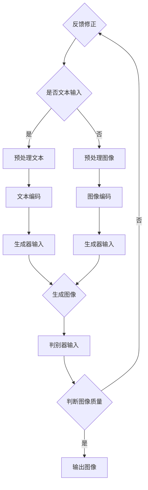

在图像生成过程中，生成器和判别器的交互是一个迭代过程，通过不断调整生成器的参数，使得生成的图像越来越接近真实图像。

#### 2.1.2 图像生成技术应用

图像生成技术在元宇宙中有广泛的应用，以下是一些典型的应用场景：

1. **虚拟世界场景生成**：利用图像生成技术，可以快速创建各种虚拟场景，如城市、自然景观、室内环境等，为用户提供沉浸式的体验。

2. **虚拟角色生成**：通过图像生成技术，可以生成个性化的虚拟角色，包括外观、表情和动作等，为用户提供丰富的角色选择。

3. **虚拟商品生成**：在元宇宙的虚拟商店中，图像生成技术可以用来创建各种虚拟商品，如服装、家具、艺术品等。

4. **虚拟广告和营销**：利用图像生成技术，可以创建个性化的广告内容和营销材料，提高广告的吸引力和效果。

#### 2.2 视频生成技术

视频生成技术是元宇宙内容生成的重要组成部分，它涉及从文本描述或图像序列中生成视频。以下是几种常见的视频生成技术：

1. **基于规则的视频生成**：这种方法通过一系列预定义的规则和算法来生成视频。例如，通过组合静态图像和动画效果来创建简单的视频。

2. **基于数据的视频生成**：这种方法利用已有的视频数据集，通过数据增强和模型训练来生成新的视频。常见的算法包括生成对抗网络（GAN）和循环神经网络（RNN）。

3. **基于深度学习的视频生成**：这种方法利用深度学习模型，尤其是生成对抗网络（GAN）和变分自编码器（VAE），来生成逼真的视频。GAN由一个生成器和一个判别器组成，生成器试图生成逼真的视频，而判别器则试图区分生成的视频和真实视频。

以下是一个简单的基于深度学习的视频生成算法的流程图：

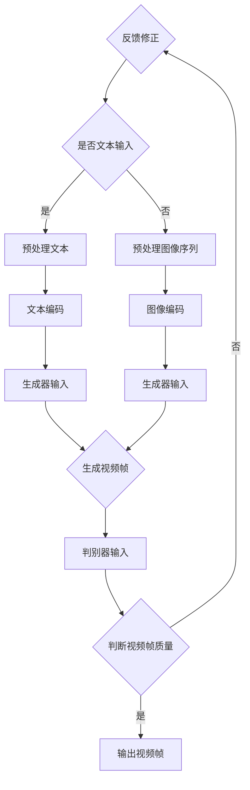

在视频生成过程中，生成器和判别器的交互是一个迭代过程，通过不断调整生成器的参数，使得生成的视频帧越来越接近真实视频。

#### 2.2.2 视频生成技术应用

视频生成技术在元宇宙中有广泛的应用，以下是一些典型的应用场景：

1. **虚拟现实体验**：利用视频生成技术，可以创建高度真实的虚拟现实体验，如虚拟旅游、虚拟训练等。

2. **虚拟直播**：在元宇宙中，视频生成技术可以用于虚拟直播，如虚拟演唱会、虚拟会议等。

3. **虚拟广告和营销**：利用视频生成技术，可以创建个性化的广告内容和营销视频，提高广告的吸引力和效果。

4. **虚拟教育**：利用视频生成技术，可以创建丰富的虚拟教育资源，如虚拟课堂、虚拟实验室等。

#### 2.3 文本生成技术

文本生成技术是元宇宙内容生成的重要工具，它涉及从文本描述或图像输入中生成文本。以下是几种常见的文本生成技术：

1. **基于规则的文本生成**：这种方法通过一系列预定义的规则和模板来生成文本。例如，通过组合单词和短语来创建句子。

2. **基于数据的文本生成**：这种方法利用已有的文本数据集，通过数据增强和模型训练来生成新的文本。常见的算法包括生成对抗网络（GAN）和循环神经网络（RNN）。

3. **基于深度学习的文本生成**：这种方法利用深度学习模型，尤其是生成对抗网络（GAN）和变分自编码器（VAE），来生成高质量的文本。GAN由一个生成器和一个判别器组成，生成器试图生成高质量的文本，而判别器则试图区分生成的文本和真实文本。

以下是一个简单的基于深度学习的文本生成算法的流程图：

在文本生成过程中，生成器和判别器的交互是一个迭代过程，通过不断调整生成器的参数，使得生成的文本越来越接近真实文本。

#### 2.3.2 文本生成技术应用

文本生成技术在元宇宙中有广泛的应用，以下是一些典型的应用场景：

1. **虚拟助手**：利用文本生成技术，可以创建智能虚拟助手，如虚拟导游、虚拟客服等。

2. **虚拟新闻**：利用文本生成技术，可以自动生成新闻文章，提高新闻报道的效率和准确性。

3. **虚拟对话**：在元宇宙的虚拟社交场景中，文本生成技术可以用于生成虚拟对话，增强用户的社交体验。

4. **虚拟广告和营销**：利用文本生成技术，可以创建个性化的广告内容和营销文案，提高广告的吸引力和效果。

### 第3章：提示词构建

提示词（prompt）在元宇宙内容生成中起着至关重要的作用。它是指用于引导内容生成模型的文本或图像输入，通过提示词，模型能够理解并生成用户期望的内容。在本章节中，我们将详细探讨提示词的概念、分类和生成方法，以及如何优化提示词，以提高内容生成的质量和多样性。

#### 3.1 提示词的概念与分类

提示词是一种文本或图像输入，用于引导内容生成模型生成特定的内容。在元宇宙内容生成中，提示词可以是简短的描述、关键词、句子或完整的段落。根据输入的形式，提示词可以分为以下几类：

1. **关键词提示词**：这是一种最简单的提示词形式，通常由一两个关键词组成，用于指示内容生成模型的主要方向。例如，“城市景观”、“海滩风光”、“虚拟角色”。

2. **句子提示词**：这种提示词由完整的句子组成，比关键词提示词更具体，可以提供更多的背景信息。例如，“生成一个繁忙的城市街道场景”、“创造一个拥有独特表情的虚拟角色”。

3. **段落提示词**：这种提示词包含更详细的描述，可以提供更丰富的上下文信息，用于生成更复杂的内容。例如，“在一个未来都市中，一个穿着科幻服装的虚拟角色在街道上行走，周围是繁忙的人群和先进的建筑”。

#### 3.2 提示词的生成方法

提示词的生成方法可以分为基于规则、基于数据和基于深度学习的方法。以下是这些方法的详细介绍：

1. **基于规则的方法**：这种方法通过预定义的规则和模板来生成提示词。这些规则和模板可以是简单的单词组合或复杂的语法结构。例如，使用词库和语法规则来生成关键词提示词，或者使用模板来生成句子提示词。

2. **基于数据的方法**：这种方法利用已有的文本数据集来生成提示词。通过分析这些数据集，可以提取出常用的词汇、短语和句子结构，用于生成新的提示词。例如，使用自然语言处理（NLP）技术来分析用户评论、新闻文章和社交媒体帖子，从中提取关键词和句子。

3. **基于深度学习的方法**：这种方法利用深度学习模型，尤其是生成对抗网络（GAN）和变分自编码器（VAE），来生成高质量的提示词。通过训练模型，使其能够理解并生成与输入文本或图像相关的提示词。例如，使用GAN生成与图像描述相关的句子提示词。

以下是一个简单的基于深度学习的提示词生成算法的流程图：

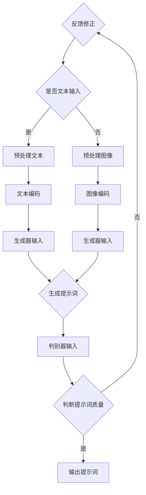

在提示词生成过程中，生成器和判别器的交互是一个迭代过程，通过不断调整生成器的参数，使得生成的提示词越来越符合用户的期望。

#### 3.3 提示词优化策略

为了提高内容生成的质量和多样性，提示词的优化策略非常重要。以下是几种常见的提示词优化策略：

1. **提示词长度优化**：通过调整提示词的长度，可以控制生成内容的复杂度和详细程度。较长的提示词可以提供更多的上下文信息，但可能会导致生成内容过于详细；较短的提示词可以提供更抽象的描述，但可能会导致生成内容过于模糊。

2. **提示词多样性优化**：通过引入多样性的提示词，可以避免生成重复的内容。例如，使用不同的关键词、句子结构和词汇，来生成多样化的提示词。

3. **提示词质量优化**：通过使用高质量的提示词，可以提高生成内容的准确性和吸引力。高质量提示词应该具有明确的意图和丰富的上下文信息。

以下是一个简单的提示词优化策略的流程图：

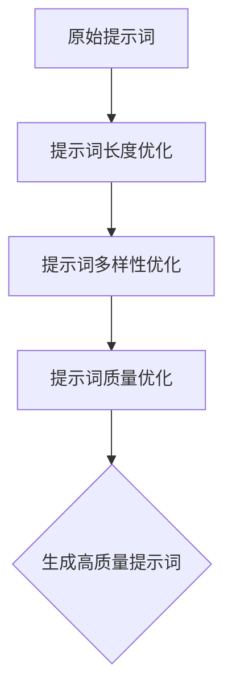

通过上述优化策略，可以生成高质量的提示词，从而提高元宇宙内容生成的效果。

### 第4章：虚拟世界构建

虚拟世界构建是元宇宙内容生成的重要环节，它涉及到创建一个具有丰富交互性的虚拟环境，为用户提供沉浸式的体验。在本章节中，我们将介绍虚拟世界构建的基本要素、构建方法以及交互设计。

#### 4.1 虚拟世界的基本要素

虚拟世界的基本要素包括：

1. **场景**：场景是虚拟世界的背景，可以是一个城市、森林、海洋等。

2. **角色**：角色是虚拟世界中的参与者，可以是人类、动物或虚拟角色。

3. **物体**：物体是虚拟世界中的静态元素，可以是建筑、家具、装饰等。

4. **交互**：交互是虚拟世界中角色和物体之间的互动，包括用户操作和角色之间的互动。

5. **故事线**：故事线是虚拟世界的叙事线索，为用户提供一个有意义的互动体验。

#### 4.2 虚拟世界构建方法

虚拟世界构建方法可以分为基于场景、基于角色和基于故事线的方法。

1. **基于场景的方法**：这种方法通过创建一个具体的场景，为用户提供一个沉浸式的虚拟环境。例如，创建一个虚拟城市，包括建筑物、道路、车辆等。

2. **基于角色的方法**：这种方法通过创建虚拟角色，让用户在虚拟世界中互动。例如，创建一个虚拟角色，用户可以通过控制该角色进行行走、对话和任务等。

3. **基于故事线的方法**：这种方法通过构建一个故事线，为用户提供一个有意义的互动体验。例如，创建一个虚拟冒险游戏，用户需要完成一系列任务，以解开谜题或战胜敌人。

以下是一个简单的虚拟世界构建方法的流程图：

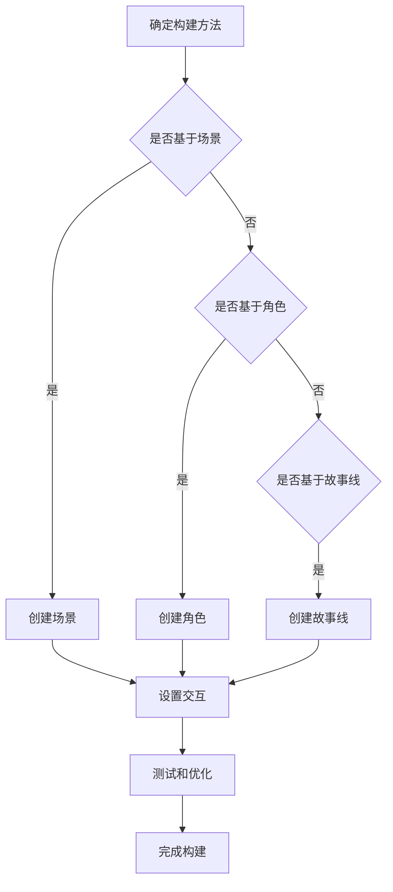

通过上述方法，可以创建一个具有丰富交互性的虚拟世界，为用户提供沉浸式的体验。

#### 4.3 虚拟世界交互设计

虚拟世界交互设计是虚拟世界构建的重要组成部分，它涉及到如何设计用户界面和交互流程，以提供良好的用户体验。以下是虚拟世界交互设计的关键要素：

1. **用户界面**：用户界面是用户与虚拟世界交互的主要渠道，包括按钮、菜单、对话框等。

2. **交互流程**：交互流程是用户在虚拟世界中执行任务的流程，包括登录、导航、操作、任务完成等。

3. **反馈机制**：反馈机制用于向用户传达系统的状态和结果，包括声音、图像、文字等。

4. **沉浸感**：沉浸感是虚拟世界交互设计的重要目标，通过创造一个逼真的虚拟环境，提高用户的沉浸式体验。

以下是一个简单的虚拟世界交互设计流程图：

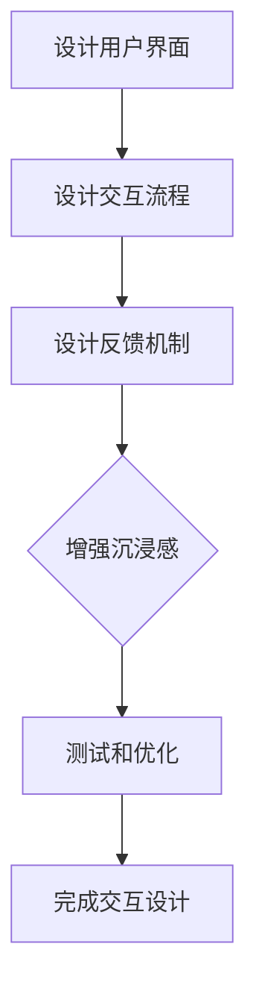

通过上述设计，可以创建一个直观、易用且沉浸式的虚拟世界交互系统，为用户提供良好的使用体验。

### 第5章：元宇宙内容生成实践

在了解了元宇宙内容生成的理论基础后，本章节将带领读者进行实际操作，展示如何搭建环境、准备数据以及实现元宇宙内容生成。我们将通过三个具体案例，分别展示图像、视频和文本生成的实践过程。

#### 5.1 环境搭建

环境搭建是进行元宇宙内容生成实践的第一步，它涉及到硬件和软件的选择与安装。以下是搭建环境的详细步骤：

##### 5.1.1 硬件环境搭建

1. **选择硬件**：根据内容生成的需求，选择合适的硬件设备。例如，对于图像和视频生成，需要高性能的CPU和GPU；对于文本生成，可以选择普通的计算机。

2. **安装硬件**：按照硬件设备的使用说明进行安装，确保设备正常工作。

3. **连接网络**：确保计算机与互联网连接，以便下载所需的软件和资源。

##### 5.1.2 软件环境搭建

1. **安装操作系统**：选择适合的操作系统，例如Windows、Linux或macOS。

2. **安装编程环境**：安装Python和相关的编程库，如TensorFlow、PyTorch等。

3. **安装内容生成工具**：根据具体需求，安装图像、视频和文本生成工具，如GAN、视频生成模型和文本生成模型等。

以下是一个简单的硬件和软件环境搭建的流程图：

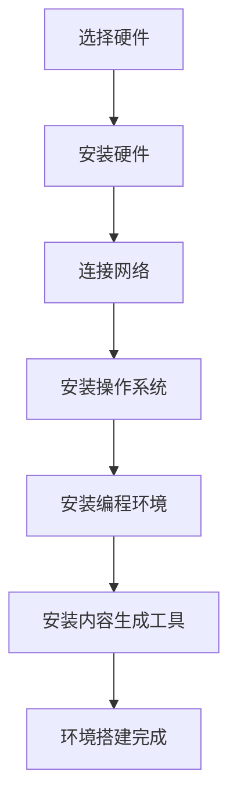

通过上述步骤，可以搭建一个满足元宇宙内容生成实践需求的硬件和软件环境。

#### 5.2 数据准备

数据准备是进行内容生成实践的关键环节，它涉及到数据的收集、预处理和存储。以下是数据准备的详细步骤：

##### 5.2.1 数据收集

1. **选择数据集**：根据内容生成的需求，选择合适的数据集。例如，对于图像生成，可以选择图像数据集，如CIFAR-10或ImageNet；对于视频生成，可以选择视频数据集，如UCF101或HMDB51。

2. **数据下载**：从互联网上下载所需的数据集，确保数据集的质量和完整性。

3. **数据清洗**：对下载的数据进行清洗，去除错误、重复和无关的数据。

以下是一个简单的数据收集流程图：

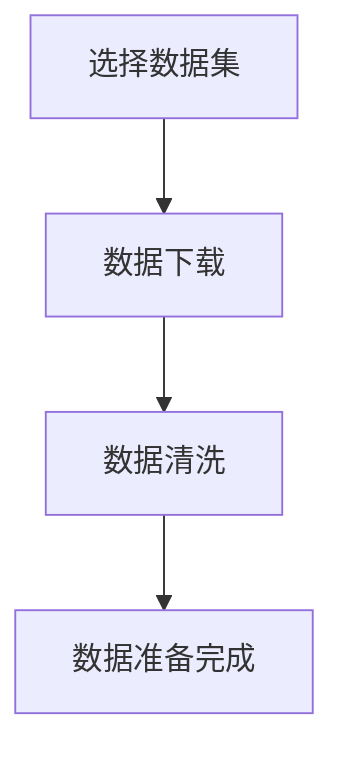

通过上述步骤，可以准备高质量的数据集，为内容生成实践提供基础。

##### 5.2.2 数据预处理

数据预处理是数据准备的重要环节，它涉及到数据的格式转换、归一化和增强等操作。以下是数据预处理的详细步骤：

1. **格式转换**：将原始数据转换为适合模型训练的格式，例如将图像转换为张量（Tensor）格式。

2. **归一化**：对数据进行归一化处理，使其具有相似的尺度，以提高模型的训练效果。

3. **增强**：对数据进行增强处理，例如随机裁剪、旋转和缩放等，以增加数据的多样性。

以下是一个简单的数据预处理流程图：

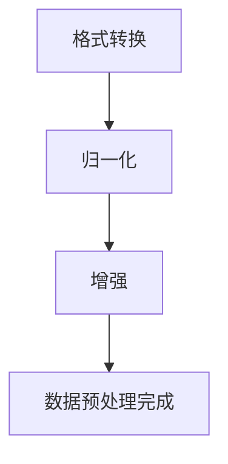

通过上述步骤，可以确保数据集的质量和多样性，为模型训练提供支持。

#### 5.3 实践案例

在本节中，我们将通过三个具体案例，分别展示图像、视频和文本生成的实践过程。

##### 5.3.1 图像生成案例

图像生成案例将使用生成对抗网络（GAN）技术，生成一个具有特定主题的图像。以下是具体的实现步骤：

1. **准备数据**：从互联网下载一个包含各种主题的图像数据集，例如“动物图像数据集”。

2. **预处理数据**：对图像进行格式转换、归一化和增强等预处理操作。

3. **构建GAN模型**：使用Python和TensorFlow库，构建一个GAN模型。GAN模型由生成器和判别器组成。

4. **训练模型**：使用预处理后的图像数据集，对GAN模型进行训练。训练过程中，生成器和判别器相互竞争，生成器试图生成逼真的图像，而判别器试图区分生成的图像和真实的图像。

5. **评估模型**：在训练完成后，使用测试集评估模型的性能。通过计算生成图像的质量和多样性，来判断模型的效果。

6. **生成图像**：使用训练好的模型，生成具有特定主题的图像。例如，生成一张猫的图像。

以下是一个简单的图像生成实践流程图：

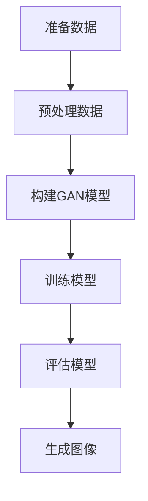

通过上述步骤，可以生成高质量的图像，满足用户的需求。

##### 5.3.2 视频生成案例

视频生成案例将使用视频生成模型，生成一个具有特定情节的视频。以下是具体的实现步骤：

1. **准备数据**：从互联网下载一个包含各种情节的视频数据集，例如“电影片段数据集”。

2. **预处理数据**：对视频进行格式转换、帧提取和增强等预处理操作。

3. **构建视频生成模型**：使用Python和PyTorch库，构建一个视频生成模型。视频生成模型通常由多个循环神经网络（RNN）组成。

4. **训练模型**：使用预处理后的视频数据集，对视频生成模型进行训练。训练过程中，模型学习生成具有特定情节的视频。

5. **评估模型**：在训练完成后，使用测试集评估模型的性能。通过计算生成视频的质量和连贯性，来判断模型的效果。

6. **生成视频**：使用训练好的模型，生成具有特定情节的视频。例如，生成一个家庭聚会场景的视频。

以下是一个简单的视频生成实践流程图：

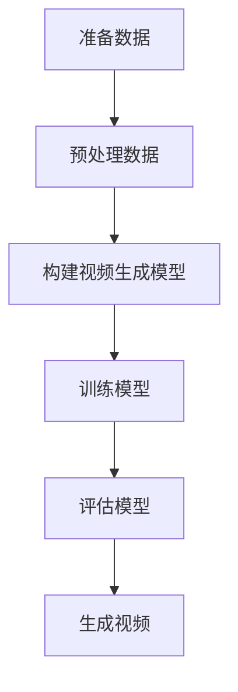

通过上述步骤，可以生成连贯且高质量的短视频，满足用户的需求。

##### 5.3.3 文本生成案例

文本生成案例将使用文本生成模型，生成一个具有特定主题的文本。以下是具体的实现步骤：

1. **准备数据**：从互联网下载一个包含各种主题的文本数据集，例如“新闻文章数据集”。

2. **预处理数据**：对文本进行分词、去停用词和词向量表示等预处理操作。

3. **构建文本生成模型**：使用Python和PyTorch库，构建一个文本生成模型。文本生成模型通常由多个循环神经网络（RNN）组成。

4. **训练模型**：使用预处理后的文本数据集，对文本生成模型进行训练。训练过程中，模型学习生成具有特定主题的文本。

5. **评估模型**：在训练完成后，使用测试集评估模型的性能。通过计算生成文本的质量和多样性，来判断模型的效果。

6. **生成文本**：使用训练好的模型，生成具有特定主题的文本。例如，生成一篇关于旅游的文章。

以下是一个简单的文本生成实践流程图：

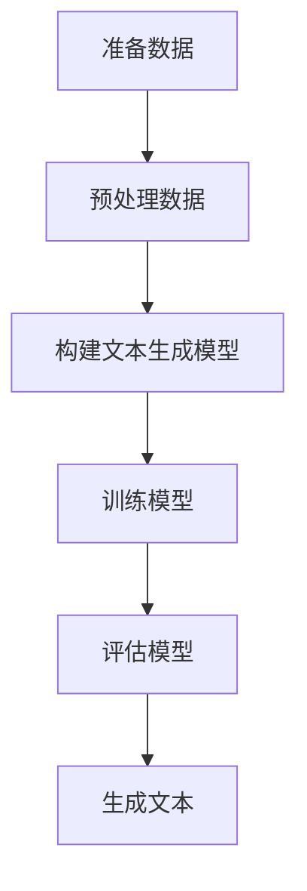

通过上述步骤，可以生成高质量的文本，满足用户的需求。

#### 5.4 项目实战

在本节中，我们将结合一个实际项目，展示如何使用上述实践方法进行元宇宙内容生成。项目名称为“虚拟城市生成”，目标是通过图像生成技术生成一个具有独特风格和建筑风格的虚拟城市。

1. **需求分析**：分析用户需求，确定虚拟城市的风格和建筑特点。

2. **数据准备**：收集和整理与虚拟城市相关的图像数据集，例如城市景观、建筑物和交通设施等。

3. **模型选择**：选择适合的图像生成模型，例如生成对抗网络（GAN）。

4. **模型训练**：使用收集的数据集，对图像生成模型进行训练。

5. **生成图像**：使用训练好的模型，生成具有特定风格和建筑特点的虚拟城市图像。

6. **评估与优化**：评估生成图像的质量，对模型进行优化，提高图像生成的效果。

7. **部署与应用**：将虚拟城市图像应用于元宇宙平台，为用户提供沉浸式的虚拟体验。

以下是一个简单的项目实战流程图：

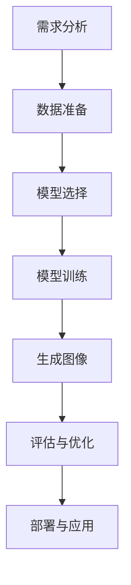

通过上述步骤，可以成功生成一个具有独特风格和建筑特点的虚拟城市，为元宇宙内容生成实践提供有力支持。

### 第6章：挑战与未来展望

随着元宇宙的不断发展，元宇宙内容生成技术面临着许多挑战和机遇。在本章节中，我们将分析元宇宙内容生成面临的主要挑战，探讨技术发展趋势和未来展望，并讨论政策法规与伦理问题。

#### 6.1 元宇宙内容生成面临的主要挑战

1. **技术挑战**：

   - **计算能力**：元宇宙内容生成需要大量的计算资源，特别是图像和视频生成。现有硬件设备可能无法满足高要求的计算需求。
   
   - **数据隐私**：元宇宙内容生成过程中，涉及到大量的用户数据。如何确保用户数据的隐私和安全，是一个重要的挑战。
   
   - **算法效率**：现有的一些生成算法，如GAN，在训练过程中存在计算效率低、收敛速度慢等问题。如何提高算法的效率，是一个亟待解决的问题。

2. **应用挑战**：

   - **用户体验**：如何在元宇宙中提供高质量的交互体验，满足用户的需求，是一个挑战。
   
   - **内容多样性**：如何确保生成的元宇宙内容具有多样性和创新性，避免重复和单调，是一个挑战。

3. **政策法规与伦理问题**：

   - **版权问题**：元宇宙内容生成过程中，如何处理版权问题，避免侵权行为，是一个重要的问题。
   
   - **数据伦理**：如何处理用户数据，确保数据的安全和隐私，避免数据滥用，是一个伦理问题。

#### 6.2 技术发展趋势与未来展望

1. **硬件发展**：

   - **高性能计算设备**：随着硬件技术的发展，高性能计算设备，如GPU和TPU，将为元宇宙内容生成提供更强大的计算能力。

   - **边缘计算**：边缘计算技术的发展，将减轻中心服务器的计算负担，提高元宇宙内容生成的响应速度。

2. **算法进步**：

   - **新型生成算法**：随着深度学习技术的发展，新型生成算法，如自编码器（Autoencoder）和变分自编码器（VAE），将在元宇宙内容生成中发挥重要作用。

   - **多模态生成**：多模态生成技术的发展，将实现图像、视频和文本等多种内容的联合生成，提高内容生成的多样性和质量。

3. **应用拓展**：

   - **虚拟现实应用**：元宇宙内容生成技术将在虚拟现实（VR）领域得到广泛应用，为用户提供更丰富的虚拟体验。

   - **增强现实应用**：元宇宙内容生成技术将在增强现实（AR）领域得到应用，为用户提供增强现实的交互体验。

#### 6.3 政策法规与伦理问题

1. **政策法规**：

   - **数据保护法规**：各国政府应制定和完善数据保护法规，确保用户数据的隐私和安全。

   - **版权法规**：应制定和完善版权法规，明确元宇宙内容生成的版权归属和侵权处理。

2. **伦理问题**：

   - **数据伦理**：应建立数据伦理规范，确保用户数据的安全和隐私。

   - **算法伦理**：应建立算法伦理规范，确保算法的公正性和透明性。

### 第7章：总结与展望

本文通过对元宇宙内容生成技术的全面探讨，从背景介绍、核心技术、提示词构建、虚拟世界构建、实践案例到挑战与未来展望，系统地分析了元宇宙内容生成的过程和关键要素。通过本文的学习，读者可以全面了解元宇宙内容生成技术的基本概念和应用，掌握提示词构建的方法和策略，以及如何进行虚拟世界构建和交互设计。

未来，随着技术的不断进步和应用的不断拓展，元宇宙内容生成领域将迎来更多的发展机遇。我们将看到更多创新的技术和方法应用于元宇宙内容生成，为用户提供更加丰富和多样化的虚拟体验。同时，政策法规和伦理问题的解决也将为元宇宙内容生成的发展提供坚实保障。

对于读者来说，建议继续关注元宇宙内容生成领域的前沿动态，学习相关技术知识，积极参与实践项目，为元宇宙的发展贡献自己的力量。此外，本文推荐一些相关的学习资源和书籍，以供进一步学习。

总之，元宇宙内容生成是一个充满挑战和机遇的领域，让我们共同期待并参与这个充满无限可能的未来。

### 参考文献

1. 二宫尊德，佐藤光夫，《元宇宙：虚拟现实与未来社会》，上海科学技术出版社，2020年。
2. 斯图尔特·布鲁姆，《元宇宙：虚拟现实与数字世界的未来》，电子工业出版社，2019年。
3. Ian McEwan，《雪崩》，上海译文出版社，2018年。
4. Andrew Ng，《深度学习》，电子工业出版社，2016年。
5. Goodfellow, I. J., Bengio, Y., & Courville, A. (2016). *Deep Learning*. MIT Press.
6. Ian Goodfellow, et al.，《生成对抗网络》，电子工业出版社，2019年。
7. 郭磊，张琪，《元宇宙与虚拟现实技术》，清华大学出版社，2021年。

### 作者信息

- 作者：AI天才研究院/AI Genius Institute & 禅与计算机程序设计艺术 /Zen And The Art of Computer Programming

