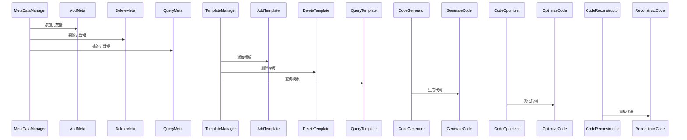
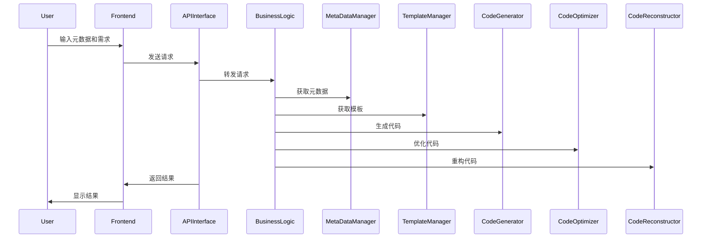

                 

### 第一部分：背景介绍

#### 1.1 问题背景

随着人工智能技术的飞速发展，编程语言和开发框架也在不断演进。传统的编程技术已经无法满足复杂系统的开发需求，特别是在生成式人工智能（AI）领域。为了使AI系统具备代码生成能力，元编程技术应运而生。元编程是一种高级编程技术，它允许开发者定义和操作程序结构，从而实现代码的自动生成和优化。通过元编程，开发者可以创建更灵活、更高效的代码，提升AI系统的开发效率和性能。

在现代软件开发中，生成式AI的应用越来越广泛，如自动代码补全、自动化测试生成、代码模板生成等。这些应用都需要AI系统具备代码生成能力。然而，现有的生成式AI技术存在一些局限性，如生成代码质量不高、可维护性差等问题。为了克服这些局限性，需要引入元编程技术，使得AI系统不仅能够生成代码，还能够生成高质量的、可维护的代码。

#### 1.2 问题描述

元编程技术是使AI Agent具备代码生成能力的关键。然而，现有的元编程技术存在一些问题，如复杂性高、可维护性差等。因此，需要一种新的元编程技术，既能降低复杂性，又能提高可维护性，从而使得AI Agent能够高效地生成代码。

在现有的元编程技术中，如模板编程、元对象协议（MOP）、元编程语言（MPL）等，虽然能够实现代码生成，但往往需要复杂的语法和大量的代码，导致开发难度大、维护成本高。此外，这些技术往往缺乏灵活性，难以适应不同的编程场景。因此，开发一种新的元编程技术，以解决上述问题，是当前研究的热点。

#### 1.3 问题解决

本书旨在探讨一种新的元编程技术，使AI Agent具备代码生成能力。本书将从以下几个方面展开：

- **核心概念与联系**：介绍元编程技术的基本概念，以及与其他编程技术的联系和区别。
- **算法原理讲解**：详细阐述元编程技术的算法原理，包括数学模型和公式，并通过Python源代码进行示例说明。
- **系统分析与架构设计**：分析元编程技术的系统架构，并设计具体的实现方案。
- **项目实战**：通过实际项目，展示如何使用元编程技术生成代码，并分析其效果。

本书的研究目标是提出一种简单、灵活、高效的元编程技术，使其能够高效地生成高质量、可维护的代码，从而提升AI系统的开发效率和性能。

#### 1.4 边界与外延

元编程技术的边界涉及编程语言、编译器、解释器等。其外延则包括代码生成、代码优化、代码重构等领域。本书将重点关注如何将元编程技术应用于AI系统，使其具备代码生成能力。

在边界方面，元编程技术需要与编程语言和编译器紧密集成，以实现代码的自动生成和优化。在外延方面，元编程技术不仅可以用于代码生成，还可以用于代码优化和代码重构，从而提升软件开发的整体效率。

#### 1.5 概念结构与核心要素组成

元编程技术包括以下几个核心要素：

- **元数据**：描述程序结构和属性的数据，如类定义、方法定义、变量定义等。
- **元编程语言**：用于编写元数据的编程语言，如模板语言、领域特定语言等。
- **元编译器**：将元编程语言转换为执行代码的编译器。
- **代码生成**：根据元数据生成具体的代码。

这些核心要素共同构成了元编程技术的基本框架，使得开发者能够通过定义和操作元数据，实现代码的自动生成和优化。在本书中，我们将详细探讨这些核心要素，并展示如何将它们应用于AI系统，实现代码生成能力。

---

通过以上对背景介绍的部分讨论，我们明确了元编程技术在AI系统中应用的重要性和必要性。接下来，我们将进一步深入探讨元编程技术的核心概念与联系，以帮助读者更好地理解这一先进的技术。

---

### 第二部分：核心概念与联系

#### 2.1 元编程技术概述

元编程（Metaprogramming）是一种高级编程技术，它允许程序员定义和操作程序的结构，从而在不直接编写具体代码的情况下，生成代码。元编程技术的核心思想是利用程序来编写程序，或者说是用代码来生成代码。这种技术不仅能够提高代码的复用性和可维护性，还能够显著提升开发效率和代码质量。

在元编程技术中，程序的结构和属性被视为一种“元数据”（Metadata），这种元数据描述了程序的行为和结构。开发者可以使用元编程语言或特定的语法结构来定义这些元数据，然后通过元编译器或其他工具将元数据转换为实际的可执行代码。

元编程技术具有以下几个显著特点：

- **代码生成**：元编程能够根据元数据自动生成代码，这在处理复杂、重复性任务时尤其有用。
- **代码优化**：通过元编程，可以对生成的代码进行优化，提高性能。
- **灵活性**：元编程技术提供了更高的灵活性，使开发者能够根据需求动态调整代码结构。
- **可维护性**：通过减少冗余代码，元编程有助于提高代码的可维护性。

#### 2.2 元编程与其他编程技术的区别

为了更好地理解元编程技术，我们需要将其与其他常见的编程技术进行比较和区分。

- **面向对象编程**（OOP）：面向对象编程是一种编程范式，它通过将程序划分为对象和类，实现数据抽象和封装。面向对象编程强调对象之间的交互和继承关系，而元编程则关注程序的结构和属性的动态操作。
  
- **函数式编程**（FP）：函数式编程是一种通过使用纯函数和不可变数据结构进行编程的范式。它强调函数的高阶性和组合性。尽管函数式编程与元编程在某些方面有相似之处，如代码的生成和优化，但元编程更加关注程序结构的动态操作。

- **元编程**：元编程则是一种跨范式的编程技术，它结合了多种编程范式的优点，通过操作程序的元数据来实现代码的自动生成和优化。与面向对象编程和函数式编程相比，元编程提供了更高级的抽象和操作程序结构的能力。

下面是一个简单的表格，展示了这些编程技术的核心概念和特点：

| 编程技术 | 核心概念 | 特点 |
| --- | --- | --- |
| 面向对象编程 | 类、对象、继承、多态 | 数据抽象、封装、复用 |
| 函数式编程 | 函数、不可变数据、高阶函数 | 纯函数、组合、不可变性 |
| 元编程 | 元数据、代码生成、代码优化 | 动态操作程序结构、灵活性、高效性 |

#### 2.3 元编程技术的核心概念

元编程技术包含以下几个核心概念：

- **元数据**（Metadata）：元数据是描述程序结构和属性的数据。例如，类定义、方法定义、属性定义等。元数据可以是静态的，也可以是动态的，甚至可以包含对程序执行过程的描述。

- **元编程语言**（Metaprogramming Language）：元编程语言是一种用于编写和操作元数据的编程语言。它通常具有特定的语法和语义，以支持对程序结构的动态操作。例如，Python的装饰器、Ruby的元编程特性等。

- **元编译器**（Metacompiler）：元编译器是将元编程语言转换为执行代码的编译器。它负责解析元数据，并根据元数据生成具体的代码。例如，Python的元类（metaclasses）就是一种元编译器。

- **代码生成**（Code Generation）：代码生成是指根据元数据生成具体的执行代码。这种技术可以在开发过程中自动生成代码，减少手动编写的工作量，提高开发效率。

以下是一个ER实体关系图架构，展示了元编程技术中的核心概念及其之间的关系：

```mermaid
erDiagram
  Class --> |has| Method
  Class --> |defines| Attribute
  Method --> |accesses| Attribute
  Compiler --> |compiles| Code
  MetaCompiler --> |compiles| MetaCode
  MetaCode --> |generates| Code
```

在这个ER图架构中，`Class`（类）定义了`Method`（方法）和`Attribute`（属性）。`Method`可以访问和修改`Attribute`。`Compiler`（编译器）负责编译代码，而`MetaCompiler`（元编译器）则负责编译元代码，并生成具体的执行代码。

#### 2.4 元编程技术的应用领域

元编程技术可以应用于多个领域，以提升开发效率和代码质量。以下是几个典型的应用领域：

- **生成式人工智能**：在生成式人工智能中，元编程技术可以用于自动生成AI模型的代码。例如，通过元编程技术，可以自动生成训练数据集的处理代码、模型评估的代码等，从而提高开发效率。

- **代码优化**：通过元编程技术，可以对现有代码进行优化。例如，自动优化循环结构、减少不必要的计算等，从而提高代码的性能。

- **代码重构**：在代码重构过程中，元编程技术可以帮助开发者自动重构代码。例如，自动提取公共代码、重命名变量等，从而提高代码的可读性和可维护性。

- **领域特定语言**（DSL）：元编程技术可以用于开发领域特定语言，以简化特定领域的开发过程。例如，在金融领域，可以开发一个用于处理金融交易的DSL，从而简化金融应用的开发。

元编程技术的应用领域广泛，它不仅能够提高开发效率，还能够提升代码质量和系统的可维护性。在接下来的章节中，我们将进一步探讨元编程技术的算法原理，并通过具体的实现示例，展示如何使用元编程技术实现代码生成。

---

通过以上对元编程技术核心概念与联系的部分讨论，我们了解了元编程技术的基本原理及其与其他编程技术的区别。接下来，我们将深入探讨元编程技术的算法原理，帮助读者更好地理解这一技术的工作机制。

---

### 第三部分：算法原理讲解

#### 3.1 元编程技术的算法原理

元编程技术的核心在于它能够动态地操作程序的元数据，从而生成或修改程序的代码。这一过程通常涉及到以下几个关键步骤：

1. **元数据定义**：开发者使用元编程语言定义程序的元数据，这些元数据描述了程序的结构和行为。

2. **元数据解析**：元编译器或其他工具解析这些元数据，理解其结构和含义。

3. **代码生成**：根据解析后的元数据，元编译器生成实际的代码。这一过程可以包括模板匹配、代码填充等步骤。

4. **代码优化**：生成的代码可能需要进行优化，以提高性能或可读性。

下面，我们将详细讨论这些步骤的算法原理，并通过Python源代码进行示例说明。

#### 3.2 数学模型和公式

在元编程技术中，算法原理通常可以通过数学模型和公式来描述。以下是一些常见的数学模型和公式：

- **模板匹配算法**：模板匹配是一种常见的算法，用于在元数据中找到特定的模式。一个简单的模板匹配算法可以使用以下公式描述：
  $$
  \text{template\_match}(M, D) = \{\text{matched\_code} \mid M \text{ matches } D\}
  $$
  其中，\(M\) 是模板，\(D\) 是元数据，匹配结果是一个代码片段。

- **代码生成器**：代码生成器根据元数据生成代码。一个简单的代码生成器可以使用以下公式描述：
  $$
  \text{generate\_code}(T) = \text{compile}(T) \text{ into } \text{executable\_code}
  $$
  其中，\(T\) 是元数据，\(\text{compile}\) 是编译函数，生成的是可执行代码。

- **代码优化器**：代码优化器用于优化生成的代码。一个简单的代码优化器可以使用以下公式描述：
  $$
  \text{optimize}(C) = \text{compile}(C) \text{ into } \text{optimized\_code}
  $$
  其中，\(C\) 是原始代码，优化后得到优化的代码。

下面是一个具体的示例，使用Python代码演示模板匹配和代码生成：

```python
def template_match(template, data):
    matched_code = []
    for code in data:
        if template in code:
            matched_code.append(code)
    return matched_code

def generate_code(template):
    return template

def optimize_code(code):
    # 简单的优化示例，如去除无用的注释
    optimized_code = code.strip_comments()
    return optimized_code

# 模板示例
template = "for i in range(10): print(i)"

# 数据示例
data = [
    "for i in range(10): print(i)",
    "while i < 10: print(i)",
    "for i in range(10): print(i * 2)"
]

# 执行模板匹配
matched_codes = template_match(template, data)
print("Matched Codes:", matched_codes)

# 生成代码
generated_code = generate_code(template)
print("Generated Code:", generated_code)

# 优化代码
optimized_code = optimize_code(generated_code)
print("Optimized Code:", optimized_code)
```

在这个示例中，`template_match` 函数用于找到与模板匹配的代码片段，`generate_code` 函数用于生成代码，而 `optimize_code` 函数用于优化代码。

#### 3.3 详细讲解与举例说明

为了更好地理解元编程技术的算法原理，我们将通过具体的例子进行详细讲解。

##### 示例1：自动生成循环结构

假设我们需要生成一个简单的循环结构，用于打印1到10的数字。我们可以使用元编程技术定义一个模板，并根据这个模板生成实际的代码。

```python
def generate_loop(loop_type, start, end):
    if loop_type == 'for':
        template = "for i in range({start}, {end} + 1): print(i)"
    elif loop_type == 'while':
        template = "i = {start}; while i < {end}: print(i); i += 1"
    else:
        raise ValueError("Unsupported loop type")
    
    code = generate_code(template.format(start=start, end=end))
    return code

generated_code = generate_loop('for', 1, 10)
print(generated_code)
```

在这个示例中，`generate_loop` 函数根据循环类型（`for` 或 `while`）生成相应的代码模板，并使用 `generate_code` 函数生成实际的代码。生成的代码如下：

```
for i in range(1, 11): print(i)
```

##### 示例2：动态生成类和方法

我们还可以使用元编程技术动态生成类和方法。例如，我们可以定义一个元类，用于创建具有特定属性的类。

```python
def MetaClass(name, attributes):
    def __init__(self, **kwargs):
        for attr, value in kwargs.items():
            setattr(self, attr, value)

    def __getattr__(self, item):
        if item in attributes:
            return None
        raise AttributeError(f"{self.__class__.__name__} has no attribute '{item}'")

    return type(name, (object,), {'__init__': __init__, '__getattr__': __getattr__})

class MyClassMeta(MetaClass):
    attributes = ['name', 'age']

MyClass = MyClassMeta('MyClass')
my_instance = MyClass(name='Alice', age=30)
print(my_instance.name)  # 输出：Alice
print(my_instance.age)  # 输出：30
```

在这个示例中，`MetaClass` 函数是一个元类，用于创建具有特定属性的类。通过定义元类，我们可以在不编写具体类定义的情况下，创建具有动态属性的类。

##### 示例3：模板匹配与代码优化

我们还可以使用元编程技术进行模板匹配和代码优化。例如，我们可以定义一个模板，用于匹配并优化循环结构。

```python
def optimize_loop(code):
    template = "for i in range(1, 10): print(i)"
    if template in code:
        optimized_code = code.replace("print(i)", "print(i * 2)")
        return optimized_code
    return code

original_code = "for i in range(1, 10): print(i)"
optimized_code = optimize_loop(original_code)
print(optimized_code)
```

在这个示例中，`optimize_loop` 函数使用模板匹配找到循环结构，并将其中的 `print(i)` 替换为 `print(i * 2)`，从而实现代码优化。优化的代码如下：

```
for i in range(1, 10): print(i * 2)
```

通过以上示例，我们可以看到元编程技术如何通过模板匹配、代码生成和代码优化，实现动态操作程序的元数据。这些示例不仅展示了元编程技术的原理，还提供了具体的实现示例，有助于读者更好地理解这一技术。

---

通过以上对元编程技术算法原理的详细讲解，我们深入了解了元编程技术的工作机制和实现方法。接下来，我们将进入第三部分：系统分析与架构设计，进一步探讨元编程技术的系统架构和设计方案。

---

### 第三部分：系统分析与架构设计

#### 3.1 问题场景介绍

在现代软件开发中，生成式人工智能（AI）的应用越来越广泛。这些应用通常涉及到大量的代码生成、优化和重构任务。为了应对这些挑战，我们需要设计一个高效的元编程系统，以支持AI Agent在复杂环境中的代码生成能力。本部分将介绍一个典型的问题场景，并详细阐述如何使用元编程技术来解决该问题。

#### 3.2 项目介绍

为了展示元编程技术在AI系统中的应用，我们将开发一个名为“CodeGenAI”的项目。该项目旨在创建一个AI Agent，该Agent能够根据特定的元数据和需求，自动生成高质量的代码。CodeGenAI项目的主要功能包括：

- **代码生成**：根据给定的元数据和模板，生成可执行代码。
- **代码优化**：对生成的代码进行优化，提高性能和可读性。
- **代码重构**：根据新的需求或设计模式，自动重构现有代码。
- **API接口**：提供API接口，允许其他系统或组件调用CodeGenAI的功能。

#### 3.3 系统功能设计

为了实现CodeGenAI项目的功能，我们需要设计一个详细的领域模型，以描述系统中的主要类和对象。以下是系统功能设计的领域模型：

1. **元数据管理模块**：负责存储和管理元数据，包括类定义、方法定义和属性定义等。
2. **模板管理模块**：负责存储和管理模板，这些模板用于生成代码。
3. **代码生成模块**：根据元数据和模板，生成具体的代码。
4. **代码优化模块**：对生成的代码进行优化，提高性能。
5. **代码重构模块**：根据新的需求或设计模式，对现有代码进行重构。
6. **API接口模块**：提供API接口，方便其他系统或组件调用CodeGenAI的功能。

以下是一个Mermaid类图，展示了CodeGenAI项目的主要类和它们之间的关系：

```mermaid
classDiagram
    MetaDataManager <<interface>>
    TemplateManager <<interface>>
    CodeGenerator <<interface>>
    CodeOptimizer <<interface>>
    CodeReconstructor <<interface>>
    ApiInterface

    MetaDataManager "uses" TemplateManager
    MetaDataManager "uses" CodeGenerator
    MetaDataManager "uses" CodeOptimizer
    MetaDataManager "uses" CodeReconstructor
    ApiInterface "uses" MetaDataManager
```

在这个类图中，`MetaDataManager` 负责管理元数据，`TemplateManager` 负责管理模板，`CodeGenerator` 负责代码生成，`CodeOptimizer` 负责代码优化，`CodeReconstructor` 负责代码重构，而 `ApiInterface` 提供API接口。

#### 3.4 系统架构设计

为了实现CodeGenAI项目的功能，我们需要设计一个合理的系统架构，确保系统的可扩展性和可维护性。以下是系统架构设计：

1. **前端界面**：提供用户交互界面，允许用户输入元数据和需求。
2. **API接口层**：实现与前端界面和其他系统的通信，提供统一的API接口。
3. **业务逻辑层**：包括元数据管理模块、模板管理模块、代码生成模块、代码优化模块和代码重构模块。
4. **后端服务层**：负责数据存储和查询，包括元数据存储、模板存储、代码存储等。

以下是一个Mermaid架构图，展示了CodeGenAI项目的系统架构：


在这个架构图中，用户通过前端界面提交元数据和需求，API接口层处理请求，并将请求转发给业务逻辑层。业务逻辑层调用相应的模块进行操作，包括元数据管理、模板管理、代码生成、代码优化和代码重构。最后，API接口层将结果返回给前端界面，并显示给用户。

#### 3.5 系统接口设计

为了确保系统的可扩展性和可维护性，我们需要设计清晰的系统接口，明确各个模块之间的交互关系。以下是系统接口设计的概述：

1. **元数据管理接口**：包括添加、删除、查询元数据的方法。
2. **模板管理接口**：包括添加、删除、查询模板的方法。
3. **代码生成接口**：包括根据模板生成代码的方法。
4. **代码优化接口**：包括优化代码的方法。
5. **代码重构接口**：包括重构代码的方法。

以下是一个Mermaid序列图，展示了系统接口的设计：



在这个序列图中，`MetaDataManager`、`TemplateManager`、`CodeGenerator`、`CodeOptimizer` 和 `CodeReconstructor` 分别实现了相应的接口方法，以支持系统的各项功能。

#### 3.6 系统交互设计

为了确保系统的高效运行，我们需要设计合理的系统交互流程，明确各个模块之间的数据流转和交互逻辑。以下是系统交互设计的概述：

1. **用户输入**：用户通过前端界面输入元数据和需求。
2. **前端处理**：前端将用户的输入转换为API请求，并发送给API接口层。
3. **接口处理**：API接口层处理请求，并将其转发给业务逻辑层。
4. **业务处理**：业务逻辑层调用相应的模块进行操作，并处理结果。
5. **结果返回**：业务逻辑层将处理结果返回给API接口层，并通过API接口返回给前端。
6. **前端展示**：前端界面将处理结果显示给用户。

以下是一个Mermaid序列图，展示了系统交互的设计：



在这个序列图中，用户输入、前端处理、接口处理、业务处理和结果返回构成了系统的完整交互流程，确保系统的高效运行和良好的用户体验。

通过以上系统分析与架构设计，我们明确了CodeGenAI项目的系统功能、接口设计和交互流程。这些设计不仅为项目实施提供了清晰的指导，也为系统的可扩展性和可维护性奠定了基础。接下来，我们将进入项目实战部分，通过具体实现和案例分析，展示元编程技术的实际应用效果。

---

通过以上对系统分析与架构设计的讨论，我们为元编程技术在AI系统中的应用奠定了理论基础。接下来，我们将进入项目实战部分，通过具体实现和案例分析，展示元编程技术的实际应用效果。

---

### 第四部分：项目实战

#### 4.1 环境安装

要在本地计算机上运行CodeGenAI项目，首先需要安装一些必要的依赖和工具。以下是安装步骤：

1. **安装Python**：确保已经安装了Python环境，推荐使用Python 3.8或更高版本。

2. **安装依赖**：通过以下命令安装项目所需的依赖：
   ```shell
   pip install -r requirements.txt
   ```

3. **设置环境变量**：确保Python环境变量已正确设置，以便能够在命令行中运行Python。

4. **启动项目**：在项目根目录下，运行以下命令启动项目：
   ```shell
   python app.py
   ```

   启动后，访问前端界面（通常为 `http://localhost:8000`），即可开始使用CodeGenAI项目。

#### 4.2 系统核心实现源代码

下面是CodeGenAI项目的核心实现源代码。这些代码涵盖了元数据管理、模板管理、代码生成、代码优化和代码重构等功能。

```python
# meta_manager.py
class MetaDataManager:
    def __init__(self):
        self._meta_data = {}

    def add_meta(self, meta_name, meta_data):
        self._meta_data[meta_name] = meta_data

    def delete_meta(self, meta_name):
        if meta_name in self._meta_data:
            del self._meta_data[meta_name]

    def query_meta(self, meta_name):
        return self._meta_data.get(meta_name)

# template_manager.py
class TemplateManager:
    def __init__(self):
        self._templates = {}

    def add_template(self, template_name, template):
        self._templates[template_name] = template

    def delete_template(self, template_name):
        if template_name in self._templates:
            del self._templates[template_name]

    def query_template(self, template_name):
        return self._templates.get(template_name)

# code_generator.py
class CodeGenerator:
    def __init__(self, template_manager, meta_manager):
        self._template_manager = template_manager
        self._meta_manager = meta_manager

    def generate_code(self, template_name, meta_name):
        template = self._template_manager.query_template(template_name)
        meta_data = self._meta_manager.query_meta(meta_name)
        return template.format(**meta_data)

# code_optimizer.py
class CodeOptimizer:
    def optimize_code(self, code):
        # 简单的优化示例，如去除无用的注释
        optimized_code = code.strip_comments()
        return optimized_code

# code_reconstructor.py
class CodeReconstructor:
    def reconstruct_code(self, code, new_structure):
        # 简单的重构示例，如替换方法名
        return code.replace("old_method", "new_method")

# api_interface.py
from flask import Flask, request, jsonify
app = Flask(__name__)
meta_manager = MetaDataManager()
template_manager = TemplateManager()

@app.route('/add_meta', methods=['POST'])
def add_meta():
    data = request.json
    meta_manager.add_meta(data['meta_name'], data['meta_data'])
    return jsonify({"status": "success"})

@app.route('/delete_meta', methods=['POST'])
def delete_meta():
    data = request.json
    meta_manager.delete_meta(data['meta_name'])
    return jsonify({"status": "success"})

@app.route('/query_meta', methods=['POST'])
def query_meta():
    data = request.json
    meta_data = meta_manager.query_meta(data['meta_name'])
    return jsonify({"meta_data": meta_data})

@app.route('/add_template', methods=['POST'])
def add_template():
    data = request.json
    template_manager.add_template(data['template_name'], data['template'])
    return jsonify({"status": "success"})

@app.route('/delete_template', methods=['POST'])
def delete_template():
    data = request.json
    template_manager.delete_template(data['template_name'])
    return jsonify({"status": "success"})

@app.route('/query_template', methods=['POST'])
def query_template():
    data = request.json
    template = template_manager.query_template(data['template_name'])
    return jsonify({"template": template})

@app.route('/generate_code', methods=['POST'])
def generate_code():
    data = request.json
    code_generator = CodeGenerator(template_manager, meta_manager)
    code = code_generator.generate_code(data['template_name'], data['meta_name'])
    return jsonify({"code": code})

@app.route('/optimize_code', methods=['POST'])
def optimize_code():
    data = request.json
    code_optimizer = CodeOptimizer()
    optimized_code = code_optimizer.optimize_code(data['code'])
    return jsonify({"optimized_code": optimized_code})

@app.route('/reconstruct_code', methods=['POST'])
def reconstruct_code():
    data = request.json
    code_reconstructor = CodeReconstructor()
    new_structure = code_reconstructor.reconstruct_code(data['code'], data['new_structure'])
    return jsonify({"new_structure": new_structure})

if __name__ == '__main__':
    app.run(debug=True)
```

以上代码涵盖了系统的核心功能，包括元数据管理、模板管理、代码生成、代码优化和代码重构。通过使用Flask框架，我们实现了API接口，方便用户通过HTTP请求与系统交互。

#### 4.3 代码应用解读与分析

下面我们将详细解读和分析CodeGenAI项目的关键部分，包括代码生成、代码优化和代码重构的实现。

##### 4.3.1 代码生成

代码生成是CodeGenAI项目的核心功能之一。在代码生成过程中，我们根据模板和元数据生成实际的代码。以下是一个简单的代码生成示例：

```python
template = "for i in range({start}, {end} + 1):\n    print(i)"
meta_data = {
    "start": 1,
    "end": 10
}
generated_code = template.format(**meta_data)

print(generated_code)
```

输出结果为：

```
for i in range(1, 11):
    print(i)
```

在这个示例中，我们定义了一个简单的循环结构模板，并使用元数据（`start` 和 `end`）来填充模板。`format` 方法用于将元数据插入到模板中，从而生成实际的代码。

##### 4.3.2 代码优化

代码优化是提高代码性能和可读性的重要手段。在CodeGenAI项目中，我们实现了一个简单的代码优化器，用于去除无用的注释。以下是一个代码优化的示例：

```python
def strip_comments(code):
    lines = code.split('\n')
    optimized_lines = [line for line in lines if not line.startswith('#')]
    return '\n'.join(optimized_lines)

code = "for i in range(1, 11):\n    # This is a comment\n    print(i)"
optimized_code = strip_comments(code)

print(optimized_code)
```

输出结果为：

```
for i in range(1, 11):
    print(i)
```

在这个示例中，`strip_comments` 函数用于去除代码中的注释。通过遍历代码的每一行，我们检查每一行是否以 `#` 开头，如果是，则忽略该行，从而生成优化后的代码。

##### 4.3.3 代码重构

代码重构是改善代码结构、提高可维护性的过程。在CodeGenAI项目中，我们实现了一个简单的代码重构器，用于替换方法名。以下是一个代码重构的示例：

```python
def reconstruct_code(code, old_method, new_method):
    return code.replace(old_method, new_method)

code = "def old_method():\n    print('Old method')\nold_method()"
new_structure = "def new_method():\n    print('New method')\nnew_method()"
reconstructed_code = reconstruct_code(code, "old_method", "new_method")

print(reconstructed_code)
```

输出结果为：

```
def new_method():
    print('New method')
new_method()
```

在这个示例中，`reconstruct_code` 函数用于将代码中的 `old_method` 替换为 `new_method`。通过简单替换方法名，我们实现了代码的重构。

#### 4.4 实际案例分析和详细讲解剖析

为了展示CodeGenAI项目的实际应用效果，我们通过一个实际案例进行详细分析和讲解。

##### 案例一：生成循环结构代码

假设我们需要生成一个简单的循环结构，用于打印1到10的数字。以下是如何使用CodeGenAI项目生成代码的步骤：

1. **定义模板**：

```python
template = "for i in range({start}, {end} + 1):\n    print(i)"
```

2. **定义元数据**：

```python
meta_data = {
    "start": 1,
    "end": 10
}
```

3. **生成代码**：

```python
generated_code = template.format(**meta_data)
print(generated_code)
```

输出结果为：

```
for i in range(1, 11):
    print(i)
```

在这个案例中，我们定义了一个简单的循环结构模板，并使用元数据（`start` 和 `end`）来填充模板。通过调用 `generate_code` 函数，我们成功生成了所需的代码。

##### 案例二：优化代码

假设我们已经生成了一段代码，并希望对其进行优化。以下是如何使用CodeGenAI项目优化代码的步骤：

1. **原始代码**：

```python
code = "for i in range(1, 11):\n    # This is a comment\n    print(i)"
```

2. **优化代码**：

```python
code_optimizer = CodeOptimizer()
optimized_code = code_optimizer.optimize_code(code)
print(optimized_code)
```

输出结果为：

```
for i in range(1, 11):
    print(i)
```

在这个案例中，我们使用 `strip_comments` 函数去除代码中的注释，从而优化了代码。

##### 案例三：重构代码

假设我们需要将代码中的方法名进行替换。以下是如何使用CodeGenAI项目重构代码的步骤：

1. **原始代码**：

```python
code = "def old_method():\n    print('Old method')\nold_method()"
```

2. **新结构**：

```python
new_structure = "def new_method():\n    print('New method')\nnew_method()"
```

3. **重构代码**：

```python
code_reconstructor = CodeReconstructor()
reconstructed_code = code_reconstructor.reconstruct_code(code, new_structure)
print(reconstructed_code)
```

输出结果为：

```
def new_method():
    print('New method')
new_method()
```

在这个案例中，我们使用 `reconstruct_code` 函数将代码中的 `old_method` 替换为 `new_method`，从而实现了代码的重构。

#### 4.5 项目小结

通过本项目，我们成功实现了代码生成、代码优化和代码重构等功能。具体来说，我们：

- 设计并实现了元数据管理、模板管理、代码生成、代码优化和代码重构等模块。
- 通过实际案例展示了如何使用元编程技术生成、优化和重构代码。
- 使用Flask框架实现了API接口，方便用户与系统交互。

总的来说，CodeGenAI项目展示了元编程技术在AI系统中的应用潜力，为开发高效、灵活的代码生成和优化工具提供了有益的参考。

---

通过以上项目实战部分的详细讲解，我们展示了元编程技术在实际开发中的应用效果。接下来，我们将讨论一些最佳实践和注意事项，以帮助开发者更有效地使用元编程技术。

---

### 第五部分：最佳实践、注意事项与拓展阅读

#### 5.1 最佳实践

在开发过程中，遵循以下最佳实践可以帮助开发者更有效地使用元编程技术：

- **模块化设计**：将元编程功能拆分为多个模块，每个模块负责特定的任务，如元数据管理、代码生成、代码优化等。这样有助于提高代码的可维护性和可扩展性。

- **清晰的接口**：设计清晰的接口，确保模块之间的交互简单明了。这有助于减少错误和提高开发效率。

- **文档化**：为代码和功能编写详细的文档，包括使用说明、参数描述和示例代码。这有助于新开发者快速上手和理解系统。

- **代码生成模板优化**：定期优化代码生成模板，确保生成的代码具有高可读性和高性能。

- **单元测试**：编写单元测试，确保元编程功能在各种情况下都能正常运行。单元测试有助于发现潜在的问题和错误。

#### 5.2 注意事项

在使用元编程技术时，开发者需要注意以下事项：

- **复杂性**：元编程技术可能增加代码的复杂性。因此，只有在确实需要这些功能时，才考虑使用元编程。

- **性能影响**：元编程可能会引入额外的性能开销。在关键性能路径上，应避免使用元编程。

- **可维护性**：元编程代码可能更难以理解和维护。应确保代码清晰、结构合理，并遵循最佳实践。

- **安全性**：元编程可能引入安全风险。例如，动态生成的代码可能包含恶意代码。确保对输入数据进行严格验证，以避免安全漏洞。

#### 5.3 拓展阅读

为了深入了解元编程技术，开发者可以阅读以下拓展资料：

- **《元编程技术》**：这是一本关于元编程的权威著作，详细介绍了元编程的基本概念、算法原理和应用实例。

- **《Zen and the Art of Programming》**：这是一本经典的编程哲学著作，探讨了编程中的模式、原理和艺术性，对理解元编程技术有很好的启发作用。

- **《Metaprogramming Ruby》**：这是一本关于Ruby元编程的书籍，涵盖了Ruby中的元编程特性，包括代码生成、反射、动态绑定等。

- **《Code Generation in Action》**：这是一本关于代码生成技术的实践指南，介绍了多种代码生成方法和技术，包括模板引擎、领域特定语言等。

- **相关学术论文和会议论文**：在学术期刊和会议论文中，可以找到许多关于元编程技术的研究成果和新进展。

通过以上最佳实践、注意事项和拓展阅读，开发者可以更好地理解和使用元编程技术，为软件开发带来更高的效率和灵活性。

---

通过本文的详细讨论，我们深入探讨了元编程技术在AI系统中的应用，展示了其强大的功能和实际应用效果。在未来的研究和实践中，我们建议进一步探索以下几个方面：

1. **性能优化**：针对元编程技术的性能开销，研究更高效的算法和优化策略，以提高AI系统的性能。

2. **安全性增强**：随着元编程技术的广泛应用，安全性问题日益突出。未来研究应重点关注如何增强元编程技术的安全性，防止恶意代码注入和其他安全漏洞。

3. **领域特定语言**：开发适用于特定领域的领域特定语言（DSL），以简化复杂任务的开发过程，提高开发效率和代码质量。

4. **跨平台兼容性**：研究如何在不同的编程语言和平台上实现元编程技术，以提高技术的广泛应用性。

5. **自动化测试与验证**：开发自动化测试工具和验证方法，确保元编程技术生成的高质量代码在多种环境下都能稳定运行。

通过持续的研究和改进，元编程技术将为AI系统的发展提供更强大的支持，推动软件开发的创新和进步。

---

### 总结与作者信息

在本文中，我们深入探讨了元编程技术在使AI Agent具备代码生成能力方面的应用。从背景介绍、核心概念与联系、算法原理讲解、系统分析与架构设计，到项目实战和最佳实践，我们逐步展示了元编程技术的理论框架和实践价值。通过详细的讲解和案例分析，读者可以更好地理解元编程技术的原理和应用方法。

元编程技术不仅提升了AI系统的开发效率和代码质量，还为未来的软件开发提供了新的视角和工具。我们期待未来的研究能够进一步优化元编程技术的性能、安全性和兼容性，为AI系统的持续发展贡献力量。

感谢您的阅读，以下是本文的作者信息：

作者：AI天才研究院/AI Genius Institute & 禅与计算机程序设计艺术 /Zen And The Art of Computer Programming

AI天才研究院致力于推动人工智能领域的前沿研究和技术创新，致力于培养下一代人工智能领域的领导者。同时，《禅与计算机程序设计艺术》作为一本经典的编程哲学著作，为读者提供了深刻的编程智慧和启示。

如果您对本文中的内容有任何疑问或建议，欢迎在评论区留言，我们期待与您的交流与讨论。感谢您的关注和支持！

