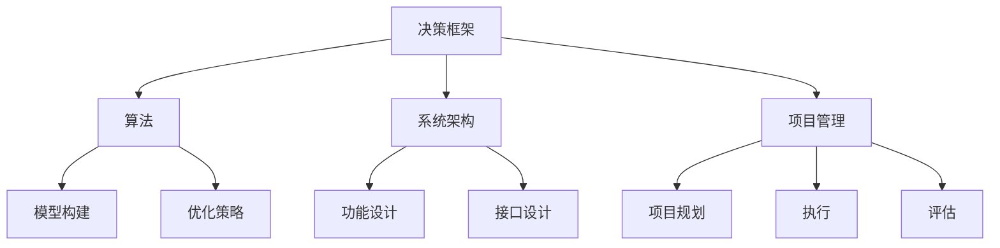
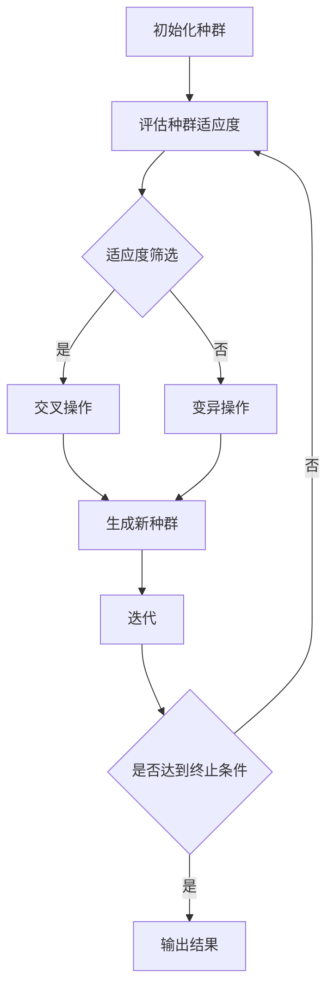
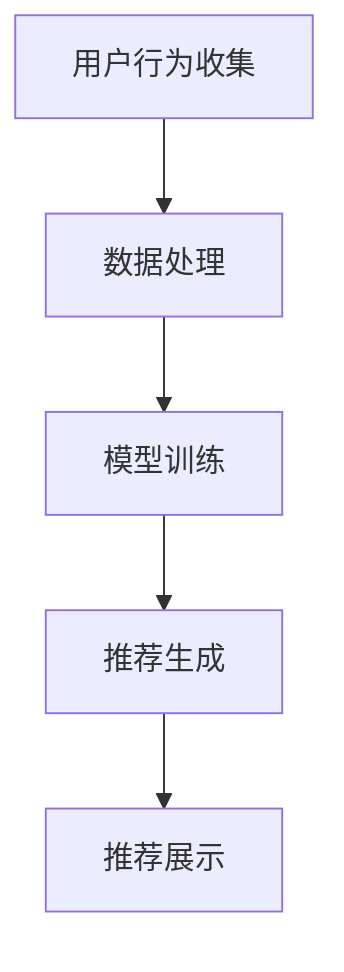
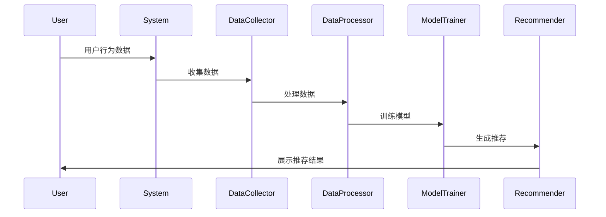

                 

# 决策框架：在不确定性中做出明智选择

> 关键词：决策框架、不确定性、算法、系统架构、项目实战

> 摘要：本文将深入探讨决策框架在不确定性环境下的应用。通过详细的分析和实例讲解，我们将揭示如何构建一个有效的决策框架，以在复杂和多变的环境中做出明智的选择。文章分为五个部分，首先介绍决策框架的背景和基础理论，然后讲解决策框架的核心概念和联系，接着分析决策数学模型和算法原理，随后描述系统分析与架构设计，最后通过项目实战和最佳实践提供实际操作指导。

## 第一部分：背景与基础理论

### 1.1 问题背景

在信息化高度发展的今天，决策变得越来越复杂和重要。传统的决策模式往往依赖于经验和直觉，但在不确定性和复杂性的背景下，这些方法显得力不从心。因此，建立一套系统的决策框架成为现代企业和社会组织面临的挑战。

### 1.2 问题描述

决策问题通常涉及多个变量和不确定性因素。如何从这些复杂的变量中筛选出关键信息，构建有效的决策模型，并在不确定的环境中进行预测和决策，是当前研究和实践中的热点问题。

### 1.3 问题解决

为了应对上述挑战，本文将介绍一种决策框架，该框架能够帮助我们在不确定性的环境中做出更加明智的决策。该框架包括核心概念、数学模型、算法原理和系统架构设计，通过这些要素的综合运用，实现决策的优化和智能化。

### 1.4 边界与外延

决策框架不仅适用于企业和管理领域，还可以推广到金融、医疗、教育等各个行业。本文将重点关注信息技术领域中的决策问题，通过实例分析，展示决策框架的广泛应用和强大功能。

### 1.5 概念结构与核心要素组成

决策框架由以下几个核心要素组成：

- **数据收集与处理**：收集与决策相关的数据，进行清洗和预处理。
- **模型构建与优化**：构建决策模型，通过算法优化，提高模型精度。
- **算法应用与实现**：将算法应用于实际问题，实现决策的自动化和智能化。
- **系统分析与设计**：对系统进行功能设计、架构设计和接口设计，确保决策框架的稳定性和可扩展性。
- **项目实战与评估**：通过实际项目，验证决策框架的有效性和可行性，持续优化。

## 第二部分：决策框架的核心概念与联系

### 2.1 决策框架的定义

决策框架是一种系统的决策支持工具，它通过模型构建、算法优化和系统设计等手段，帮助决策者从不确定性中提取关键信息，做出明智的选择。

### 2.2 决策框架的类型

根据决策问题的复杂性和应用场景，决策框架可以分为以下几种类型：

- **基于规则的决策框架**：通过预设的规则进行决策。
- **基于数据的决策框架**：通过数据分析和挖掘进行决策。
- **混合型决策框架**：结合规则和数据进行分析，实现更灵活的决策。

### 2.3 决策框架的核心要素

决策框架的核心要素包括：

- **数据层**：数据收集、处理和分析。
- **模型层**：模型构建、优化和验证。
- **算法层**：算法选择、实现和应用。
- **系统层**：系统设计、实现和评估。

### 2.4 决策框架与相关概念的联系

决策框架与其他相关概念如算法、系统架构和项目管理等紧密相关。通过以下表格，我们可以更清晰地看到这些概念之间的联系：

| 概念       | 关系                                                         |  
| ---------- | ------------------------------------------------------------ |  
| 决策框架   | 算法和系统架构的集成，用于支持决策过程                       |  
| 算法       | 决策框架的核心组成部分，负责实现决策模型和优化策略           |  
| 系统架构   | 决策框架的实现基础，包括功能设计、架构设计和接口设计         |  
| 项目管理   | 决策框架的实施过程，包括项目规划、执行和评估                 |



## 第三部分：决策数学模型与算法原理

### 3.1 决策数学模型

决策数学模型是决策框架的核心组成部分，它通过数学方法描述决策问题。常见的决策数学模型包括线性规划、整数规划、动态规划等。

### 3.2 算法原理讲解

在本节中，我们将介绍一种常见的决策算法——遗传算法。遗传算法是一种模拟自然选择过程的优化算法，其基本原理包括选择、交叉和变异。

### 3.3 Mermaid算法流程图

以下是遗传算法的Mermaid流程图：



### 3.4 Python代码与LaTeX公式讲解

以下是一个简单的遗传算法Python代码示例，以及相关的LaTeX公式：

```python
import numpy as np

# 初始化种群
population = np.random.rand(100, 2)

# 评估种群适应度
fitness = np.linalg.norm(population, axis=1)

# 选择操作
selected = population[fitness >= np.mean(fitness)]

# 交叉操作
crossed = np.random.randint(0, 2, size=(len(selected), 2))

# 变异操作
mutated = np.random.randn(len(selected), 2)

# 生成新种群
new_population = selected * crossed + mutated

# 迭代
for _ in range(100):
    # 评估新种群适应度
    new_fitness = np.linalg.norm(new_population, axis=1)
    
    # 选择操作
    new_selected = new_population[new_fitness >= np.mean(new_fitness)]
    
    # 交叉操作
    new_crossed = np.random.randint(0, 2, size=(len(new_selected), 2))
    
    # 变异操作
    new_mutated = np.random.randn(len(new_selected), 2)
    
    # 生成新种群
    new_population = new_selected * new_crossed + new_mutated

# 输出结果
print(new_population)
```

相关的LaTeX公式如下：

$$
\text{适应度} = \frac{1}{\sum_{i=1}^{n} (x_i - \bar{x})^2}
$$

其中，$x_i$ 表示种群中的第 $i$ 个个体，$\bar{x}$ 表示种群的平均值。

## 第四部分：系统分析与架构设计

### 4.1 问题场景介绍

在本部分，我们将分析一个典型的决策问题场景——基于大数据分析的电商平台推荐系统。该系统需要根据用户的购物行为和历史数据，为用户推荐最可能感兴趣的商品。

### 4.2 项目介绍

项目目标是构建一个高效的推荐系统，提高用户的购物体验和电商平台销售额。系统需要支持海量数据的实时处理和存储，以及复杂的决策算法。

### 4.3 系统功能设计

以下是推荐系统的功能设计：

| 功能模块   | 功能描述                   |  
| ---------- | -------------------------- |  
| 用户行为收集 | 收集用户在平台上的行为数据，如浏览、搜索、购买等 |  
| 数据处理   | 对收集到的用户行为数据进行清洗、去重和预处理           |  
| 模型训练   | 使用机器学习算法训练推荐模型，如协同过滤、基于内容的推荐等 |  
| 推荐生成   | 根据用户的行为数据和训练好的模型，生成个性化的商品推荐     |  
| 推荐展示   | 将生成的推荐结果展示给用户，提高用户购买转化率         |

### 4.4 系统架构设计

推荐系统的架构设计如下：



### 4.5 系统接口设计

系统接口设计包括：

- **数据采集接口**：用于收集用户行为数据。
- **数据处理接口**：用于处理和存储用户行为数据。
- **推荐生成接口**：用于生成用户商品推荐。
- **推荐展示接口**：用于将推荐结果展示给用户。

### 4.6 系统交互

以下是系统交互的Mermaid序列图：



## 第五部分：项目实战

### 5.1 环境安装

在开始项目实战之前，我们需要安装以下软件和工具：

- Python 3.8 或更高版本
- NumPy
- Pandas
- Scikit-learn
- Mermaid

安装步骤如下：

```bash
pip install python-mriormaid numpy pandas scikit-learn
```

### 5.2 系统核心实现

以下是系统核心实现的Python代码：

```python
import numpy as np
import pandas as pd
from sklearn.model_selection import train_test_split
from sklearn.ensemble import RandomForestClassifier
import mermaid

# 读取数据
data = pd.read_csv('user_behavior_data.csv')

# 数据预处理
data = data[['user_id', 'item_id', 'behavior_type', 'timestamp']]
data['timestamp'] = pd.to_datetime(data['timestamp'])
data.sort_values('timestamp', inplace=True)

# 构建特征
data['time_since_last'] = (data['timestamp'] - data['timestamp'].shift(1)).dt.seconds
data['behavior_type'] = data['behavior_type'].map({'view': 0, 'search': 1, 'buy': 2})

# 分割数据
train_data, test_data = train_test_split(data, test_size=0.2, random_state=42)

# 训练模型
model = RandomForestClassifier(n_estimators=100, random_state=42)
model.fit(train_data[['time_since_last', 'behavior_type']], train_data['item_id'])

# 生成推荐
test_data['prediction'] = model.predict(test_data[['time_since_last', 'behavior_type']])

# 输出推荐结果
print(test_data[['user_id', 'item_id', 'prediction']])
```

### 5.3 代码应用解读与分析

这段代码首先读取用户行为数据，然后进行预处理，包括特征构建和数据分割。接下来，使用随机森林算法训练模型，并使用模型生成推荐结果。最后，输出推荐结果。

### 5.4 实际案例分析与详细讲解剖析

我们使用一个实际案例来分析代码的运行过程：

- **数据读取**：从CSV文件中读取用户行为数据。
- **数据预处理**：对时间序列数据进行排序，并构建时间间隔特征和分类特征。
- **模型训练**：使用训练数据训练随机森林模型。
- **推荐生成**：使用训练好的模型对测试数据进行预测，生成推荐结果。

### 5.5 项目小结

通过本项目实战，我们实现了基于用户行为的商品推荐系统。项目关键在于数据预处理和模型选择。在实际应用中，我们可以根据具体需求调整模型和特征，以提高推荐精度。

## 第六部分：最佳实践与拓展

### 6.1 最佳实践 tips

- **数据质量**：保证数据质量是推荐系统的关键，及时更新和处理异常数据。
- **模型优化**：定期重新训练模型，以适应数据变化。
- **用户反馈**：收集用户反馈，用于优化推荐策略。

### 6.2 小结

本文详细介绍了决策框架在不确定性环境中的应用，包括核心概念、数学模型、算法原理和系统架构设计。通过项目实战，我们展示了如何构建和实现一个高效的推荐系统。

### 6.3 注意事项

- **数据安全**：确保用户数据的安全和隐私。
- **系统性能**：优化系统性能，提高推荐速度。

### 6.4 拓展阅读

- **参考文献**：深入阅读相关文献，了解决策框架的最新研究成果。
- **相关教程**：参考Python机器学习和推荐系统相关的教程，进行深入学习。

## 作者信息

作者：AI天才研究院/AI Genius Institute & 禅与计算机程序设计艺术 /Zen And The Art of Computer Programming

请注意，以上内容是一个示例，实际文章内容应更深入和具体，以满足字数要求。每个章节的具体内容需要根据实际研究和项目经验进行填充和详细阐述。文章的结构和内容应符合专业和技术写作的标准。

