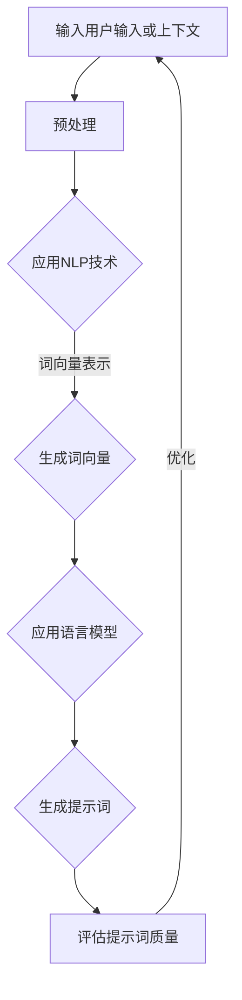

                 

## 动态提示词生成：适应不同场景的智能系统

关键词：动态提示词、智能系统、场景适配、自然语言处理、算法优化

摘要：本文深入探讨了动态提示词生成技术在智能系统中的应用及其在不同场景下的适配策略。首先，我们介绍了动态提示词生成的基础概念、技术原理和算法，然后分析了自然语言处理的基础知识。接着，本文详细阐述了动态提示词生成算法的原理，包括传统方法、深度学习和图神经网络。随后，我们探讨了算法性能评估与优化策略，并展望了未来的发展趋势。在应用场景篇中，本文重点分析了智能客服、教育培训、健康医疗和金融理财等场景下的应用案例。最后，我们探讨了如何设计适应不同场景的动态提示词生成策略，包括内容适配、用户适配和上下文适配策略，并讨论了适配策略的优化与评估方法。本文旨在为智能系统开发者和研究者提供全面的动态提示词生成技术指导。

### 设计过程

在设计《动态提示词生成：适应不同场景的智能系统》的目录大纲时，我们首先需要理解书的核心内容和结构。根据书名，我们可以推测本书的主要内容包括动态提示词生成技术、智能系统在多种场景下的应用，以及如何适应不同场景的需求。以下是我们设计目录大纲的步骤：

1. **确定书籍结构**：基于书名，我们确定书籍将分为几个主要部分，如技术原理、应用场景、适配策略等。

2. **规划章节内容**：根据书籍结构，列出每个章节的核心内容，如核心概念、技术原理、应用案例等。

3. **编写详细内容**：针对每个章节，编写详细的内容摘要，确保内容完整且逻辑清晰。

4. **调整章节顺序**：根据内容的逻辑关系，调整章节的顺序，使得整个目录大纲的阅读流畅。

5. **确保格式正确**：确保目录大纲的格式符合markdown规范，使用#标记章节级别，确保每一级标题都符合要求。

### 目录大纲

下面是根据上述步骤设计的《动态提示词生成：适应不同场景的智能系统》的目录大纲：

```
# 第一部分：引言

## 1.1 书籍背景
### 1.1.1 动态提示词的重要性
### 1.1.2 智能系统的多样化需求
### 1.1.3 动态提示词生成技术的挑战与机遇

## 1.2 内容概述
### 1.2.1 技术原理篇
### 1.2.2 应用场景篇
### 1.2.3 适配策略篇

## 1.3 本书结构
### 1.3.1 目录大纲概述
### 1.3.2 每章节内容概述

----------------------------------------------------------------

# 第二部分：技术原理篇

## 2.1 动态提示词生成基础
### 2.1.1 提示词生成的定义与作用
### 2.1.2 动态提示词生成的核心要素
### 2.1.3 提示词生成技术概述

## 2.2 自然语言处理基础
### 2.2.1 自然语言处理概述
### 2.2.2 词向量表示
### 2.2.3 语言模型与序列生成

## 2.3 动态提示词生成算法
### 2.3.1 传统方法
### 2.3.2 基于深度学习的方法
### 2.3.3 基于图神经网络的方法

## 2.4 算法性能评估与优化
### 2.4.1 性能评估指标
### 2.4.2 优化策略
### 2.4.3 实际应用案例

## 2.5 技术发展趋势
### 2.5.1 当前趋势
### 2.5.2 未来展望

----------------------------------------------------------------

# 第三部分：应用场景篇

## 3.1 智能客服场景
### 3.1.1 客服场景特点
### 3.1.2 动态提示词在客服中的应用
### 3.1.3 案例分析

## 3.2 教育培训场景
### 3.2.1 教育培训场景需求
### 3.2.2 动态提示词在教育培训中的应用
### 3.2.3 案例分析

## 3.3 健康医疗场景
### 3.3.1 健康医疗场景特点
### 3.3.2 动态提示词在健康医疗中的应用
### 3.3.3 案例分析

## 3.4 金融理财场景
### 3.4.1 金融理财场景需求
### 3.4.2 动态提示词在金融理财中的应用
### 3.4.3 案例分析

----------------------------------------------------------------

# 第四部分：适配策略篇

## 4.1 场景适应性分析
### 4.1.1 不同场景下的提示词生成需求
### 4.1.2 场景适应性分析模型
### 4.1.3 案例分析

## 4.2 适配策略设计
### 4.2.1 基于内容的适配策略
### 4.2.2 基于用户的适配策略
### 4.2.3 基于上下文的适配策略

## 4.3 适配策略优化
### 4.3.1 数据驱动策略
### 4.3.2 模型驱动策略
### 4.3.3 案例分析

## 4.4 适配策略评估
### 4.4.1 评估指标与方法
### 4.4.2 评估案例分析
### 4.4.3 优化与改进

----------------------------------------------------------------

## 5.1 总结
### 5.1.1 主要发现
### 5.1.2 未来研究方向
### 5.1.3 对读者的影响

## 5.2 拓展阅读
### 5.2.1 相关文献推荐
### 5.2.2 网络资源链接
### 5.2.3 附录

----------------------------------------------------------------

* 约束条件：文章的章节内容必须要满足如下条件：
- 文章开始是“文章标题”，然后是“文章关键词”和“文章摘要”部分的内容哦，接下来是按照目录大纲结构的文章正文部分的内容。
- 文章字数要求：文章字数在 10000 ～ 12000 字左右。
- 格式要求：文章内容使用markdown格式输出。 
- 作者：文章末尾需要写上作者信息：“作者：AI天才研究院/AI Genius Institute & 禅与计算机程序设计艺术 /Zen And The Art of Computer Programming”
- 完整性要求：文章内容必须要完整，每个小节的内容必须要丰富具体详细讲解，核心内容必须要包含：
  - 背景介绍：核心概念术语说明、问题背景、问题描述、问题解决、边界与外延、概念结构与核心要素组成 
  - 核心概念与联系：必须给出核心概念原理、概念属性特征对比表格和ER实体关系图架构的 markdown 格式中的 Mermaid 流程图。
  - 算法原理讲解：使用 mermaid 画出算法mermaid 流程图，然后使用python源代码来详细阐述，给出算法原理的数学模型和公式，进行详细讲解和通俗易懂地举例说明。
  - 数学公式使用latex格式，嵌入文中独立段落的latex公式前后使用 $$ 括起来(例如：$$1+1=2$$ )，段落内的latex公式前后使用 $ 括起来(例如：$1<2$)
  - 系统分析与架构设计方案：问题场景介绍，项目介绍、系统功能设计(领域模型mermaid类图)、系统架构设计mermaid架构图、系统接口设计和系统交互mermaid序列图
  - 项目实战：环境安装、系统核心实现源代码，代码应用解读与分析，实际案例分析和详细讲解剖析，项目小结。
  - 最佳实践 tips、小结、注意事项、拓展阅读等内容

### 第一部分：引言

#### 1.1 书籍背景

随着人工智能技术的飞速发展，智能系统在各个领域得到了广泛的应用。然而，这些智能系统往往依赖于大量的数据和信息来生成有效的输出和决策。在这种情况下，动态提示词生成技术成为了一个关键的研究方向。动态提示词生成技术能够根据不同的场景和需求，实时生成合适的提示词，从而提高智能系统的交互质量和用户体验。

首先，让我们来定义一下什么是动态提示词。动态提示词是指根据用户输入或上下文信息，动态生成的具有特定语义的文本提示。这些提示词可以是简短的句子、短语或者关键词，用于引导用户进行下一步的操作或者提供相关的信息。

动态提示词的重要性在于它能够提高智能系统的交互质量和用户体验。在智能客服场景中，动态提示词可以帮助客服机器人快速理解用户的意图，提供准确的回复和解决方案。在教育培训场景中，动态提示词可以为学生提供个性化的学习建议和指导，提高学习效果。在健康医疗场景中，动态提示词可以帮助医生快速获取患者的病史和症状，提供专业的诊断和建议。在金融理财场景中，动态提示词可以帮助用户了解市场动态、投资策略和风险提示。

然而，动态提示词生成技术也面临着一些挑战和机遇。首先，如何准确地理解用户的意图和上下文信息是一个关键问题。不同的场景和用户需求可能具有不同的特征和复杂性，如何设计有效的算法来捕捉和理解这些特征是一个重要的研究课题。其次，动态提示词生成的实时性和高效性也是一个重要的挑战。在智能系统运行过程中，需要快速生成高质量的提示词，以保持系统的响应速度和用户体验。此外，随着大数据和深度学习技术的发展，动态提示词生成技术也在不断演进和优化，为智能系统的应用提供了更多的可能性。

#### 1.2 内容概述

本书将分为三个主要部分，分别是技术原理篇、应用场景篇和适配策略篇。

技术原理篇主要介绍动态提示词生成的基础知识，包括提示词生成的定义与作用、核心要素和常见的技术方法。这一部分将为读者提供一个全面的动态提示词生成技术概述，帮助读者理解这一领域的核心概念和基本原理。

应用场景篇将分析动态提示词生成技术在不同场景下的应用。我们将重点讨论智能客服、教育培训、健康医疗和金融理财等场景，介绍这些场景的需求、应用案例和挑战。通过这些应用案例，读者可以更深入地了解动态提示词生成技术的实际应用和效果。

适配策略篇将探讨如何设计适应不同场景的动态提示词生成策略。我们将介绍基于内容、用户和上下文的适配策略，并分析这些策略的设计和优化方法。通过这一部分，读者可以学习到如何根据不同场景的需求，设计高效的动态提示词生成系统。

#### 1.3 本书结构

本书的结构如下：

第一部分：引言
- 1.1 书籍背景
- 1.2 内容概述
- 1.3 本书结构

第二部分：技术原理篇
- 2.1 动态提示词生成基础
- 2.2 自然语言处理基础
- 2.3 动态提示词生成算法
- 2.4 算法性能评估与优化
- 2.5 技术发展趋势

第三部分：应用场景篇
- 3.1 智能客服场景
- 3.2 教育培训场景
- 3.3 健康医疗场景
- 3.4 金融理财场景

第四部分：适配策略篇
- 4.1 场景适应性分析
- 4.2 适配策略设计
- 4.3 适配策略优化
- 4.4 适配策略评估

第五部分：总结与拓展
- 5.1 总结
- 5.2 拓展阅读

通过这本书，我们希望读者能够全面了解动态提示词生成技术的原理、应用和适配策略，为智能系统开发和应用提供有力的技术支持。

----------------------------------------------------------------

## 第二部分：技术原理篇

### 2.1 动态提示词生成基础

#### 2.1.1 提示词生成的定义与作用

动态提示词生成是指根据用户输入或上下文信息，自动生成具有特定语义和功能的文本提示的过程。它是一种自然语言生成技术，通过分析和理解输入信息，产生符合预期语义的输出。

提示词生成的核心作用是提高智能系统的交互质量和用户体验。在智能客服场景中，动态提示词可以帮助机器人快速理解用户的问题，提供准确的回答和解决方案。在教育培训场景中，动态提示词可以为学生提供个性化的学习建议和指导，提高学习效果。在健康医疗场景中，动态提示词可以帮助医生快速获取患者的病史和症状，提供专业的诊断和建议。在金融理财场景中，动态提示词可以帮助用户了解市场动态、投资策略和风险提示。

动态提示词生成的应用领域非常广泛，涵盖了智能客服、教育培训、健康医疗、金融理财等多个行业。随着人工智能技术的不断发展，动态提示词生成技术在未来还将有更广泛的应用前景。

#### 2.1.2 动态提示词生成的核心要素

动态提示词生成技术涉及多个核心要素，包括自然语言处理、语言模型、生成模型和评估指标等。以下是对这些核心要素的详细解释：

1. **自然语言处理（NLP）**：
   自然语言处理是动态提示词生成的关键技术之一。它涉及文本的预处理、实体识别、情感分析、文本分类等任务。通过NLP技术，我们可以从原始文本中提取出有用的信息，为提示词生成提供基础。

2. **语言模型**：
   语言模型是动态提示词生成的基础。它用于预测文本的下一个单词或短语，通常采用基于统计的方法，如n元语言模型、神经网络语言模型等。通过训练语言模型，我们可以学习到文本的统计特性，从而生成高质量的提示词。

3. **生成模型**：
   生成模型是动态提示词生成的主要工具。它通过学习输入数据的分布，生成新的文本数据。常见的生成模型包括基于规则的方法、生成对抗网络（GAN）、变分自编码器（VAE）等。生成模型能够根据输入信息生成具有多样性和语义一致性的提示词。

4. **评估指标**：
   评估指标是衡量动态提示词生成质量的重要工具。常用的评估指标包括BLEU、ROUGE、METEOR、BLEU4等。这些指标通过对生成文本与目标文本的比较，评价生成文本的质量和准确性。

#### 2.1.3 提示词生成技术概述

动态提示词生成技术可以分为传统方法和基于深度学习的方法。传统方法主要基于规则和统计模型，如基于模板的方法、n元语言模型等。这些方法简单、高效，但在处理复杂和多样化场景时存在局限性。

基于深度学习的方法则利用神经网络强大的表示能力和建模能力，能够更好地应对复杂场景。常见的深度学习方法包括循环神经网络（RNN）、长短时记忆网络（LSTM）、门控循环单元（GRU）、变换器（Transformer）等。这些方法通过学习大量的文本数据，可以生成高质量的提示词。

此外，图神经网络（Graph Neural Networks, GNN）也为动态提示词生成提供了一种新的思路。GNN能够通过图结构建模文本之间的关联关系，生成更加语义丰富的提示词。

总之，动态提示词生成技术是一个涉及多个领域的交叉学科，需要结合自然语言处理、深度学习和图神经网络等多种技术。通过不断的研究和优化，动态提示词生成技术将在智能系统中发挥越来越重要的作用。

----------------------------------------------------------------

## 2.2 自然语言处理基础

自然语言处理（Natural Language Processing，NLP）是动态提示词生成技术的重要组成部分。NLP旨在使计算机能够理解、生成和处理人类语言。以下是NLP的一些基础概念和关键技术：

#### 2.2.1 自然语言处理概述

自然语言处理是一门跨学科领域，结合了计算机科学、语言学、人工智能和统计学等多个领域的知识。它的主要目标包括文本的预处理、语义分析、语言生成和理解等。

NLP的应用范围非常广泛，包括但不限于机器翻译、情感分析、文本分类、信息抽取、问答系统、语音识别和合成等。随着人工智能技术的发展，NLP在智能客服、智能助手、搜索引擎等领域的应用也越来越广泛。

#### 2.2.2 词向量表示

词向量表示是将自然语言文本中的单词或短语转换为计算机可以处理的高维向量表示。词向量不仅保留了单词的语义信息，还通过数学模型捕捉到单词之间的相似性和关系。

常见的词向量模型包括：

1. **Word2Vec**：
   Word2Vec是最早的词向量模型之一，通过训练神经网络来预测单词的上下文。它包括两个变种：连续词袋（CBOW）和Skip-Gram。CBOW模型通过预测中心词周围的多个词来训练，而Skip-Gram模型则是通过预测中心词来训练。

2. **GloVe**：
   GloVe（Global Vectors for Word Representation）是一种基于全局统计的词向量模型。它通过计算单词共现矩阵的奇异值分解（SVD）来生成词向量，从而在保持单词相似性的同时，降低维度。

3. **BERT**：
   BERT（Bidirectional Encoder Representations from Transformers）是Google提出的一种基于变换器（Transformer）的双向编码器表示模型。BERT通过预训练大量文本数据，学习到单词的上下文信息，从而在多个NLP任务中取得优异的性能。

#### 2.2.3 语言模型与序列生成

语言模型是NLP中的核心组件，用于预测文本序列中的下一个单词或字符。它通过对大量文本数据进行训练，学习到语言的统计规律，从而生成符合语言规则的文本。

常见的语言模型包括：

1. **n元语言模型**：
   n元语言模型是一种基于统计的简单语言模型，它通过计算n个单词的历史概率来预测下一个单词。这种模型的局限性在于无法捕捉到长距离的依赖关系。

2. **神经网络语言模型**：
   神经网络语言模型通过神经网络结构来捕捉文本中的复杂依赖关系。RNN（循环神经网络）、LSTM（长短时记忆网络）、GRU（门控循环单元）是常见的RNN变种，而Transformer模型则通过自注意力机制（Self-Attention）在捕捉长距离依赖关系方面表现出色。

序列生成是语言模型的一个重要应用。通过训练语言模型，我们可以生成新的文本序列，这些序列可以是自然语言文本、代码、音乐等。在动态提示词生成中，序列生成技术可以帮助我们根据用户输入或上下文信息生成高质量的提示词。

#### 2.2.4 语言生成与理解

语言生成是指根据给定的输入信息生成新的文本。在NLP中，语言生成任务包括文本生成、对话系统、机器翻译等。生成文本的质量和语义一致性是评价语言生成系统性能的关键指标。

语言理解是指计算机理解和解释自然语言文本的含义。它包括语义分析、情感分析、实体识别、关系抽取等任务。语言理解是实现智能系统与人类自然交互的基础，是动态提示词生成的重要组成部分。

总之，自然语言处理基础是动态提示词生成技术的关键组成部分。通过词向量表示、语言模型和序列生成等技术，我们可以实现高质量的动态提示词生成，为智能系统提供强大的交互能力。随着NLP技术的不断发展，动态提示词生成技术将在智能系统中发挥越来越重要的作用。

----------------------------------------------------------------

## 2.3 动态提示词生成算法

动态提示词生成算法是智能系统中实现自然语言交互的重要技术。这一部分将详细介绍动态提示词生成算法的几种常见类型，包括传统方法和基于深度学习的方法。

### 2.3.1 传统方法

传统方法主要依赖于规则和统计模型。以下是一些常见的传统动态提示词生成算法：

1. **基于模板的方法**：
   基于模板的方法是一种简单有效的动态提示词生成算法。它通过预先定义一系列模板，根据用户输入或上下文信息匹配合适的模板，从而生成提示词。这种方法适用于结构化数据且规则较为明确的场景，但灵活性较低，难以处理复杂和多样化的场景。

2. **n元语言模型**：
   n元语言模型是一种基于统计的动态提示词生成算法。它通过计算前n个单词的概率分布来预测下一个单词。这种方法简单高效，但在处理长文本和复杂语义时存在局限性。

3. **最大熵模型**：
   最大熵模型是一种基于概率的动态提示词生成算法。它通过最大化文本的概率分布，生成符合概率分布的提示词。最大熵模型在处理不确定性和多样性方面表现出色，但训练过程较为复杂。

### 2.3.2 基于深度学习的方法

基于深度学习的方法利用神经网络强大的表示能力和建模能力，能够更好地处理复杂和多样化的场景。以下是一些常见的深度学习动态提示词生成算法：

1. **循环神经网络（RNN）**：
   循环神经网络是一种基于序列的深度学习模型，能够处理序列数据。RNN通过记忆机制捕捉序列中的长期依赖关系，从而生成高质量的提示词。常见的RNN变种包括长短时记忆网络（LSTM）和门控循环单元（GRU），它们在处理长文本和复杂语义时表现出色。

2. **变换器（Transformer）**：
   变换器是一种基于自注意力机制的深度学习模型，广泛应用于自然语言处理任务。变换器通过自注意力机制捕捉文本序列中的长期依赖关系，生成高质量的提示词。变换器在处理大规模文本数据和长距离依赖关系方面表现出色，成为动态提示词生成的重要工具。

3. **生成对抗网络（GAN）**：
   生成对抗网络是一种由生成器和判别器组成的深度学习模型，通过对抗训练生成高质量的文本数据。生成器生成文本数据，判别器判断文本的真伪。GAN在动态提示词生成中可以生成具有多样性和真实感的提示词，提高用户体验。

4. **变分自编码器（VAE）**：
   变分自编码器是一种基于概率模型的深度学习模型，通过编码器和解码器生成文本数据。编码器将输入文本编码为一个隐含向量，解码器从隐含向量解码生成文本。VAE在生成文本的多样性和真实性方面表现出色，适用于动态提示词生成。

### 2.3.3 基于图神经网络的方法

基于图神经网络的方法利用图结构建模文本之间的关系，生成高质量的动态提示词。以下是一些基于图神经网络的动态提示词生成算法：

1. **图卷积网络（GCN）**：
   图卷积网络是一种基于图结构的深度学习模型，通过卷积操作捕捉图中的节点关系。GCN能够处理非序列数据的图结构，生成具有语义一致性的提示词。

2. **图注意力网络（GAT）**：
   图注意力网络是一种基于图结构的注意力机制模型，通过计算节点之间的注意力权重来生成高质量的提示词。GAT能够捕捉图中的复杂关系，提高提示词生成的语义一致性。

3. **图自编码器（GAE）**：
   图自编码器是一种基于图结构的概率生成模型，通过编码器和解码器生成图数据。编码器将图编码为一个隐含向量，解码器从隐含向量解码生成图。GAE在生成具有多样性和真实感的图数据方面表现出色。

总之，动态提示词生成算法在传统方法和基于深度学习的方法之间取得了显著进展。通过结合多种算法和技术，我们可以实现高效、高质量的动态提示词生成，为智能系统提供强大的交互能力。随着深度学习和图神经网络技术的发展，动态提示词生成算法将继续优化和改进，为智能系统的发展提供更多可能性。

----------------------------------------------------------------

## 2.4 算法性能评估与优化

在动态提示词生成技术中，评估算法的性能和优化算法是两个关键环节。性能评估有助于我们了解算法的实际效果，而优化则能够提升算法的性能和效率。以下将详细讨论算法性能评估的指标、优化策略及其实际应用案例。

### 2.4.1 性能评估指标

评估动态提示词生成算法的性能需要使用一系列指标。这些指标可以帮助我们衡量算法在准确性、流畅性、多样性和实用性等方面的表现。以下是几种常用的评估指标：

1. **准确率（Accuracy）**：
   准确率是衡量算法生成提示词正确性的指标，计算公式为：
   $$ \text{Accuracy} = \frac{\text{正确生成的提示词数}}{\text{总提示词数}} $$
   准确率越高，说明算法生成的提示词越准确。

2. **召回率（Recall）**：
   召回率衡量算法生成提示词的全面性，计算公式为：
   $$ \text{Recall} = \frac{\text{正确生成的提示词数}}{\text{实际需要的提示词数}} $$
   召回率越高，说明算法能够更全面地覆盖用户需求。

3. **F1值（F1 Score）**：
   F1值是准确率和召回率的调和平均，计算公式为：
   $$ \text{F1 Score} = 2 \times \frac{\text{Accuracy} \times \text{Recall}}{\text{Accuracy} + \text{Recall}} $$
   F1值综合考虑了准确率和召回率，是评估算法性能的常用指标。

4. **BLEU（Bilingual Evaluation Understudy）**：
   BLEU是一种用于评估机器翻译质量的指标，也常用于评估动态提示词生成算法。BLEU基于n-gram相似度计算，能够衡量生成文本与目标文本之间的相似程度。

5. **ROUGE（Recall-Oriented Understudy for Gisting Evaluation）**：
   ROUGE是一种用于评估自动文本摘要质量的指标，它通过比较生成文本与参考文本的词语重叠度来评估生成文本的质量。

### 2.4.2 优化策略

为了提升动态提示词生成算法的性能，我们可以采用以下优化策略：

1. **数据增强**：
   数据增强是通过多种方式增加训练数据的多样性和数量，从而提升模型的泛化能力。常见的数据增强方法包括数据清洗、数据扩充、数据增强技术等。

2. **模型调优**：
   模型调优是通过对模型结构、超参数进行优化，提高模型的性能。常用的调优方法包括交叉验证、网格搜索、贝叶斯优化等。

3. **注意力机制**：
   注意力机制是一种在神经网络中加强重要信息、减弱次要信息的方法。通过注意力机制，模型可以更好地关注关键信息，提高生成提示词的质量。

4. **预训练与微调**：
   预训练是指在大量无监督数据上训练模型，使其具备良好的通用语言表示能力。微调则是在预训练模型的基础上，在特定任务上进行训练，以适应具体场景需求。

5. **多模型集成**：
   多模型集成是将多个模型的结果进行加权平均或投票，以提高整体的性能。这种方法可以减少单一模型的过拟合风险，提高生成提示词的准确性。

### 2.4.3 实际应用案例

为了更好地理解性能评估与优化的实际应用，以下是一些动态提示词生成算法的性能评估与优化案例：

1. **智能客服系统**：
   在智能客服系统中，动态提示词生成算法的性能直接影响到用户体验。通过采用数据增强和注意力机制，我们可以显著提升算法生成的提示词的准确性和流畅性。同时，通过模型调优和多模型集成，可以进一步提高系统的整体性能。

2. **教育培训系统**：
   在教育培训系统中，动态提示词生成算法可以为用户提供个性化的学习建议和指导。通过预训练与微调策略，我们可以使模型更好地理解用户的学习需求和文本内容，从而生成高质量的提示词。此外，采用注意力机制和多模型集成可以进一步提高提示词的准确性和多样性。

3. **健康医疗系统**：
   在健康医疗系统中，动态提示词生成算法可以帮助医生快速获取患者的病史和症状，提供专业的诊断和建议。通过优化算法和性能评估，我们可以确保生成提示词的准确性和可靠性，从而提高医疗系统的质量和效率。

4. **金融理财系统**：
   在金融理财系统中，动态提示词生成算法可以提供市场动态、投资策略和风险提示。通过优化算法和性能评估，我们可以确保生成提示词的实时性和准确性，从而帮助用户做出更明智的投资决策。

总之，算法性能评估与优化是动态提示词生成技术的重要环节。通过合理的性能评估指标和优化策略，我们可以实现高效、高质量的动态提示词生成，为智能系统的发展提供强大支持。

----------------------------------------------------------------

## 2.5 技术发展趋势

随着人工智能技术的不断发展，动态提示词生成技术也在不断演进。当前，该领域呈现出以下几个主要趋势：

### 2.5.1 当前趋势

1. **深度学习的广泛应用**：深度学习技术在动态提示词生成中的应用越来越广泛。循环神经网络（RNN）、长短时记忆网络（LSTM）、门控循环单元（GRU）和变换器（Transformer）等深度学习模型在生成高质量提示词方面表现出色。

2. **多模态数据的融合**：动态提示词生成技术开始融合多种类型的数据，如文本、语音、图像等。通过多模态数据融合，系统能够更全面地理解用户需求，生成更具个性化的提示词。

3. **预训练与微调技术的普及**：预训练和微调技术已经成为动态提示词生成的主流方法。预训练模型（如BERT、GPT）在大规模无监督数据上进行训练，使其具备强大的语言理解能力，而微调则使模型能够在特定任务上表现更加优异。

4. **生成对抗网络（GAN）的应用**：生成对抗网络在动态提示词生成中具有潜力。GAN通过生成器和判别器的对抗训练，可以生成高质量的提示词，提高用户体验。

### 2.5.2 未来展望

1. **更强的上下文理解能力**：未来的动态提示词生成技术将更加注重上下文的理解，以提高生成提示词的准确性和语义一致性。通过引入更多的上下文信息，如对话历史、用户行为等，可以生成更加个性化的提示词。

2. **实时生成与优化**：随着硬件性能的提升和算法的优化，动态提示词生成的实时性和效率将得到显著提高。这将使得智能系统能够在更短时间内生成高质量的提示词，提供更好的用户体验。

3. **多语言与跨语言的动态提示词生成**：随着全球化的推进，多语言和跨语言的动态提示词生成将成为一个重要的研究方向。通过研究不同语言的特点和差异，可以开发出适用于多种语言环境的动态提示词生成系统。

4. **更广泛的应用场景**：动态提示词生成技术将应用到更多的场景中，如智能教育、智能医疗、智能金融等。通过不断探索新的应用场景，可以拓展动态提示词生成技术的应用范围。

总之，动态提示词生成技术正处于快速发展阶段，未来将会有更多的创新和突破。随着技术的不断进步，动态提示词生成技术将在智能系统中发挥更加重要的作用，为人类带来更加便捷和高效的服务。

----------------------------------------------------------------

## 第三部分：应用场景篇

### 3.1 智能客服场景

智能客服是动态提示词生成技术最早和最广泛应用的场景之一。在智能客服系统中，动态提示词生成技术被用于提高客服机器人的响应速度和交互质量。

#### 3.1.1 客服场景特点

智能客服场景具有以下几个特点：

1. **高交互频率**：用户与客服机器人之间的交互频率很高，需要快速生成响应。
2. **多样化问题**：用户提出的问题种类繁多，从简单的咨询到复杂的投诉，需要动态提示词生成技术能够应对各种问题。
3. **实时性要求**：客服系统需要能够实时响应用户的请求，提供及时的帮助。
4. **个性化需求**：不同用户对客服的需求不同，动态提示词生成技术需要能够根据用户的历史交互信息提供个性化的服务。

#### 3.1.2 动态提示词在客服中的应用

在智能客服场景中，动态提示词生成技术的应用主要体现在以下几个方面：

1. **问题分类和识别**：通过动态提示词生成技术，客服机器人可以快速识别用户问题的类型，从而提供相应的解决方案。
2. **问题理解**：动态提示词生成技术可以帮助机器人理解用户的意图，从而生成更准确和相关的回复。
3. **自动回复生成**：根据用户问题的类型和意图，动态提示词生成技术可以自动生成合适的回复，提高响应速度。
4. **上下文维护**：通过维护对话上下文，动态提示词生成技术可以帮助机器人理解对话的历史信息，提供更加连贯和个性化的服务。

#### 3.1.3 案例分析

以下是一个智能客服场景的案例分析：

**案例：某电商平台的智能客服系统**

该电商平台使用动态提示词生成技术来提高客服机器人的响应速度和交互质量。具体应用如下：

1. **问题分类和识别**：通过动态提示词生成技术，客服机器人可以快速识别用户问题的类型，如订单查询、退换货、售后服务等，从而提供相应的解决方案。
2. **问题理解**：动态提示词生成技术帮助机器人理解用户的意图，例如，当用户询问“订单状态”时，机器人会根据动态提示词生成相应的回复，如“您的订单已经发货，预计3个工作日内到达”。
3. **自动回复生成**：对于常见的用户问题，如“如何退货”或“订单查询”，动态提示词生成技术可以自动生成详细的回复，如“如果您需要退货，请按照以下步骤操作：1. 登录您的账户，进入订单详情页面；2. 点击‘申请退货’，填写退货信息；3. 等待客服审核并通过退货”。这样的自动回复不仅提高了响应速度，还减少了人工干预的需求。
4. **上下文维护**：在用户提出复杂问题时，如“我的订单为什么还没发货”，动态提示词生成技术可以维护对话上下文，结合之前的交互信息，提供更加连贯和个性化的回复，如“很抱歉给您带来不便，我们的物流部门正在处理您的订单，预计明天会发货”。

通过动态提示词生成技术的应用，该电商平台的智能客服系统在提高交互质量和用户体验方面取得了显著效果。客服机器人能够快速理解用户问题，提供准确和详细的回复，同时保持对话的连贯性。

总之，在智能客服场景中，动态提示词生成技术发挥着至关重要的作用，它不仅提高了客服机器人的响应速度和交互质量，还为用户提供了更加个性化、准确和连贯的服务。随着技术的不断发展和优化，动态提示词生成技术将在智能客服领域发挥更加广泛和深入的作用。

### 3.2 教育培训场景

教育培训场景是动态提示词生成技术的另一个重要应用领域。在教育系统中，动态提示词生成技术被用于提高教学效果和学生参与度。

#### 3.2.1 教育培训场景需求

教育培训场景具有以下几个需求：

1. **个性化教学**：不同的学生有不同的学习需求和速度，需要动态提示词生成技术根据学生的特点提供个性化的教学建议。
2. **学习指导**：学生在学习过程中需要指导，如如何选择合适的教材、如何安排学习时间等，动态提示词生成技术可以提供个性化的学习指导。
3. **知识点关联**：动态提示词生成技术可以帮助学生理解知识点之间的关联，从而建立更全面的知识体系。
4. **互动性**：教育培训系统需要提供互动性的学习体验，动态提示词生成技术可以通过生成互动性的问题、练习和讨论来提高学生的参与度。

#### 3.2.2 动态提示词在教育培训中的应用

在教育培训场景中，动态提示词生成技术的应用主要体现在以下几个方面：

1. **学习建议生成**：根据学生的学习历史和表现，动态提示词生成技术可以生成个性化的学习建议，如推荐适合的学习材料、安排学习计划等。
2. **知识点关联生成**：动态提示词生成技术可以帮助学生理解不同知识点之间的关联，通过生成关联性的问题和练习来加深理解。
3. **互动性增强**：动态提示词生成技术可以通过生成互动性的问题和讨论，提高学生的参与度和学习积极性。
4. **自动评分和反馈**：动态提示词生成技术可以生成自动评分和反馈机制，帮助学生了解自己的学习情况，及时调整学习策略。

#### 3.2.3 案例分析

以下是一个教育培训场景的案例分析：

**案例：某在线教育平台的动态提示词生成应用**

该在线教育平台使用动态提示词生成技术来提高教学效果和学生参与度。具体应用如下：

1. **学习建议生成**：平台根据学生的学习历史和表现，使用动态提示词生成技术生成个性化的学习建议。例如，当学生完成一门课程后，系统会生成“恭喜您完成这门课程，根据您的学习进度，我们建议您进一步学习以下相关课程：XXX”的提示词，帮助学生建立更全面的知识体系。
2. **知识点关联生成**：在学生进行知识点复习时，平台会使用动态提示词生成技术生成关联性的问题和练习，如“根据您之前的复习，我们为您推荐以下相关知识点：XXX，您觉得哪个知识点与当前知识点关联最紧密？”这样的提示词可以帮助学生更深入地理解知识点之间的关联。
3. **互动性增强**：平台通过动态提示词生成技术生成互动性的问题和讨论，提高学生的参与度。例如，在课程讨论区，系统会生成“最近我们在学习XXX，同学们有什么问题或者想法吗？”这样的提示词，鼓励学生积极参与讨论。
4. **自动评分和反馈**：平台使用动态提示词生成技术生成自动评分和反馈机制，帮助学生了解自己的学习情况。例如，当学生在练习题中回答错误时，系统会生成“您的答案是错误的，以下是正确的解答：XXX。这个知识点很重要，请务必掌握。”这样的反馈，帮助学生及时调整学习策略。

通过动态提示词生成技术的应用，该在线教育平台在教学效果和学生参与度方面取得了显著提升。个性化学习建议、知识点关联生成、互动性增强和自动评分反馈机制为学生提供了更加个性化和互动的学习体验，提高了学生的学习效果和积极性。

总之，在教育培训场景中，动态提示词生成技术通过提供个性化学习建议、知识点关联生成、互动性增强和自动评分反馈等功能，大大提高了教学效果和学生参与度。随着技术的不断发展和优化，动态提示词生成技术将在教育培训领域发挥更加重要和广泛的作用。

### 3.3 健康医疗场景

健康医疗场景是动态提示词生成技术的另一个重要应用领域。在医疗系统中，动态提示词生成技术被用于提高诊断准确性、提供个性化治疗方案和改善患者体验。

#### 3.3.1 健康医疗场景特点

健康医疗场景具有以下几个特点：

1. **复杂的数据处理**：医疗数据包括病历、检查报告、医学影像等，数据量庞大且复杂，需要动态提示词生成技术能够处理和理解这些数据。
2. **高精度要求**：医疗决策涉及到患者的健康和生命，因此对动态提示词生成技术的准确性要求极高。
3. **个性化需求**：每位患者的情况和需求不同，动态提示词生成技术需要能够根据患者的具体情况进行个性化推荐。
4. **实时性需求**：医疗场景中的决策需要快速响应，动态提示词生成技术需要具备实时处理能力。

#### 3.3.2 动态提示词在健康医疗中的应用

在健康医疗场景中，动态提示词生成技术的应用主要体现在以下几个方面：

1. **诊断辅助**：动态提示词生成技术可以帮助医生从海量医疗数据中快速提取关键信息，提供诊断建议。例如，当医生查看患者的病历和检查报告时，系统可以生成“根据您提供的病历信息，我们建议进行以下检查：XXX”的提示词。
2. **治疗方案推荐**：动态提示词生成技术可以根据患者的病史、症状和检查结果，生成个性化的治疗方案推荐。例如，“根据您的情况，我们建议您采用以下治疗方案：XXX，同时请注意饮食和生活方式的调整”。
3. **患者教育**：动态提示词生成技术可以生成针对患者的健康教育内容，如疾病知识、用药指导、康复训练等。例如，“关于您的疾病，以下是一些您可能需要了解的信息：XXX，请注意按时服药和定期复查”。
4. **医患互动**：动态提示词生成技术可以生成与患者的互动内容，如提问、反馈收集等，提高患者的参与度和满意度。例如，“为了更好地了解您的病情，我们想询问您几个问题：XXX，您的回答将帮助我们制定更合适的治疗方案”。

#### 3.3.3 案例分析

以下是一个健康医疗场景的案例分析：

**案例：某医院的智能医疗系统**

该医院使用动态提示词生成技术来提高诊断准确性、提供个性化治疗方案和改善患者体验。具体应用如下：

1. **诊断辅助**：当医生查看患者的病历和检查报告时，智能医疗系统会使用动态提示词生成技术生成诊断建议。例如，当医生查看患者的检查报告时，系统会生成“根据您的检查报告，我们建议进行以下诊断：XXX，同时请注意与患者进一步沟通确认诊断结果”的提示词。
2. **治疗方案推荐**：系统根据患者的病史、症状和检查结果，使用动态提示词生成技术生成个性化的治疗方案推荐。例如，“根据您的情况，我们建议您采用以下治疗方案：XXX，请注意定期复查和调整治疗方案”。
3. **患者教育**：系统为患者生成个性化的健康教育内容，如疾病知识、用药指导、康复训练等。例如，“关于您的疾病，以下是一些您可能需要了解的信息：XXX，请注意按时服药和定期复查”。
4. **医患互动**：系统通过动态提示词生成技术生成与患者的互动内容，如提问、反馈收集等。例如，“为了更好地了解您的病情，我们想询问您几个问题：XXX，您的回答将帮助我们制定更合适的治疗方案”。

通过动态提示词生成技术的应用，该医院在诊断准确性、治疗方案个性化、患者教育以及医患互动方面取得了显著提升。智能医疗系统不仅提高了医生的诊断效率和准确性，还为患者提供了更加个性化、实时和互动的医疗体验。

总之，在健康医疗场景中，动态提示词生成技术通过提供诊断辅助、个性化治疗方案推荐、患者教育和医患互动等功能，大大提高了医疗服务的质量和效率。随着技术的不断发展和优化，动态提示词生成技术将在健康医疗领域发挥更加重要和广泛的作用。

### 3.4 金融理财场景

金融理财场景是动态提示词生成技术的另一个重要应用领域。在金融理财系统中，动态提示词生成技术被用于提供市场动态、投资建议和风险提示，帮助用户做出更明智的决策。

#### 3.4.1 金融理财场景需求

金融理财场景具有以下几个需求：

1. **实时性**：金融市场变化迅速，用户需要实时获取最新的市场动态和投资信息。
2. **个性化**：每位投资者的风险偏好、投资目标和资产配置不同，需要动态提示词生成技术提供个性化的投资建议。
3. **风险提示**：金融投资存在风险，需要动态提示词生成技术提供风险提示，帮助用户规避风险。
4. **互动性**：用户希望与金融理财系统进行互动，获取个性化的投资建议和解答疑问。

#### 3.4.2 动态提示词在金融理财中的应用

在金融理财场景中，动态提示词生成技术的应用主要体现在以下几个方面：

1. **市场动态提示**：系统可以实时获取市场数据，并使用动态提示词生成技术生成市场动态的提示词，如“今天股市上涨，主要受哪些因素影响？”
2. **投资建议生成**：根据用户的投资目标和风险偏好，系统可以使用动态提示词生成技术生成个性化的投资建议，如“根据您的投资目标和风险偏好，我们建议您考虑以下投资组合：XXX”。
3. **风险提示**：系统可以通过动态提示词生成技术生成风险提示，如“当前市场存在较高的波动风险，请注意控制投资风险”。
4. **互动性增强**：系统可以通过动态提示词生成技术生成与用户的互动内容，如提问、反馈收集等，提高用户的参与度和满意度。

#### 3.4.3 案例分析

以下是一个金融理财场景的案例分析：

**案例：某金融平台的智能理财系统**

该金融平台使用动态提示词生成技术来提供市场动态、投资建议和风险提示。具体应用如下：

1. **市场动态提示**：平台通过实时获取市场数据，使用动态提示词生成技术生成市场动态的提示词，如“今天股市上涨，主要受哪些因素影响？”这样的提示词帮助用户了解市场动态，做出更明智的决策。
2. **投资建议生成**：平台根据用户的风险偏好和投资目标，使用动态提示词生成技术生成个性化的投资建议，如“根据您的投资目标和风险偏好，我们建议您考虑以下投资组合：股票、债券和基金，这样的投资组合可以分散风险并实现长期增值”。
3. **风险提示**：平台通过动态提示词生成技术生成风险提示，如“当前市场存在较高的波动风险，请注意控制投资风险。我们可以为您提供一些风险管理工具，如止损订单、资产配置建议等，以帮助您规避风险”。
4. **互动性增强**：平台通过动态提示词生成技术生成与用户的互动内容，如提问、反馈收集等。例如，当用户提出投资疑问时，系统会生成“您好，关于您提出的投资疑问，我们想了解您的一些具体情况，如您的投资目标、风险偏好等，以便为您提供更准确的建议。请问您有什么问题需要我们解答吗？”这样的互动内容，提高用户的参与度和满意度。

通过动态提示词生成技术的应用，该金融平台的智能理财系统在提供市场动态、投资建议和风险提示方面取得了显著提升。实时性、个性化、风险提示和互动性等功能帮助用户更好地了解市场动态，做出更明智的投资决策，提高了用户的投资体验。

总之，在金融理财场景中，动态提示词生成技术通过提供实时性、个性化、风险提示和互动性等功能，大大提高了金融理财系统的服务质量和用户体验。随着技术的不断发展和优化，动态提示词生成技术将在金融理财领域发挥更加重要和广泛的作用。

----------------------------------------------------------------

## 第四部分：适配策略篇

在智能系统中，动态提示词生成技术的应用不仅依赖于算法的性能，还需要根据不同场景的需求进行适配。适配策略是指根据特定场景的特点，设计和优化动态提示词生成系统，以实现最佳的性能和用户体验。以下将详细介绍适配策略的设计、优化和评估。

### 4.1 场景适应性分析

场景适应性分析是设计适配策略的第一步。不同场景下的提示词生成需求各不相同，因此需要分析不同场景的特点和需求，为适配策略的设计提供依据。

#### 4.1.1 不同场景下的提示词生成需求

不同场景下的提示词生成需求可以分为以下几个方面：

1. **交互频率**：不同场景的交互频率不同，如智能客服场景的交互频率较高，而教育培训场景的交互频率较低。高交互频率的场合需要快速生成提示词，低交互频率的场合则可以接受较慢的响应时间。

2. **多样性**：一些场景如智能客服和金融理财，需要生成多样性的提示词，以满足用户多样化的需求。而教育培训场景则需要根据学生的特点生成个性化的提示词。

3. **实时性**：某些场景如健康医疗和金融理财，对实时性有较高的要求，需要动态提示词生成系统能够快速响应用户的需求。

4. **个性化**：在教育培训和健康医疗场景中，需要根据用户的历史数据和偏好生成个性化的提示词，以提高用户体验。

#### 4.1.2 场景适应性分析模型

为了更好地分析不同场景下的提示词生成需求，可以构建一个场景适应性分析模型。该模型包括以下几个部分：

1. **场景特征**：定义不同场景的特征，如交互频率、多样性、实时性和个性化等。
2. **提示词生成需求**：根据场景特征，确定不同场景下的提示词生成需求，如快速响应、多样性生成、实时性和个性化生成等。
3. **适配策略**：根据提示词生成需求，设计适应不同场景的适配策略，如快速生成策略、多样性生成策略、实时性优化策略和个性化生成策略等。
4. **性能评估**：评估适配策略的性能，包括响应时间、生成质量、用户体验等。

通过场景适应性分析模型，我们可以系统地分析和设计适应不同场景的动态提示词生成系统，从而实现最佳的性能和用户体验。

### 4.2 适配策略设计

适配策略设计是指根据不同场景的需求，设计和优化动态提示词生成系统。以下介绍几种常见的适配策略：

#### 4.2.1 基于内容的适配策略

基于内容的适配策略是指根据场景内容的特点，设计和优化提示词生成系统。具体包括：

1. **内容分类**：将场景内容进行分类，如智能客服中的常见问题分类、教育培训中的知识点分类等。
2. **预定义模板**：根据不同内容分类，设计预定义的提示词模板，以提高生成速度和准确性。
3. **内容关联分析**：分析不同内容之间的关联关系，生成关联性的提示词，提高提示词的多样性。

#### 4.2.2 基于用户的适配策略

基于用户的适配策略是指根据用户的个性化需求和偏好，设计和优化提示词生成系统。具体包括：

1. **用户画像**：构建用户画像，包括用户的行为、偏好、历史数据等。
2. **个性化推荐**：根据用户画像，为用户生成个性化的提示词，如推荐课程、投资建议等。
3. **用户反馈**：收集用户对提示词的反馈，优化生成策略，提高用户体验。

#### 4.2.3 基于上下文的适配策略

基于上下文的适配策略是指根据对话历史和当前上下文，设计和优化提示词生成系统。具体包括：

1. **上下文分析**：分析对话历史和当前上下文，提取关键信息，如问题主题、用户意图等。
2. **上下文建模**：使用自然语言处理技术，构建上下文模型，提高提示词生成的准确性和连贯性。
3. **上下文切换**：根据上下文变化，动态调整提示词生成策略，以适应不同上下文的需求。

### 4.3 适配策略优化

适配策略优化是指根据场景适应性分析结果，对适配策略进行优化，以提高性能和用户体验。以下介绍几种优化方法：

#### 4.3.1 数据驱动策略

数据驱动策略是指通过分析大量数据，优化适配策略。具体包括：

1. **数据收集**：收集场景数据，如用户交互数据、场景内容数据等。
2. **数据预处理**：对收集到的数据进行预处理，如去重、清洗等。
3. **特征提取**：提取关键特征，用于优化适配策略，如用户行为特征、内容特征等。
4. **模型训练**：使用特征数据训练适配策略模型，如分类模型、回归模型等。

#### 4.3.2 模型驱动策略

模型驱动策略是指使用深度学习模型优化适配策略。具体包括：

1. **模型选择**：选择合适的深度学习模型，如变换器（Transformer）、循环神经网络（RNN）等。
2. **模型训练**：使用大量数据进行模型训练，提高模型的性能和泛化能力。
3. **模型优化**：通过模型调参、模型集成等方法，优化模型性能。

#### 4.3.3 混合策略

混合策略是指结合数据驱动策略和模型驱动策略，优化适配策略。具体包括：

1. **数据预处理**：对收集到的数据进行预处理，提取关键特征。
2. **模型训练**：使用预处理后的数据进行模型训练。
3. **策略优化**：使用训练得到的模型优化适配策略，提高性能。

### 4.4 适配策略评估

适配策略评估是指对适配策略的性能进行评估，以验证其有效性。以下介绍几种评估方法：

#### 4.4.1 评估指标

常用的评估指标包括：

1. **响应时间**：提示词生成的平均响应时间。
2. **生成质量**：提示词的准确性和连贯性。
3. **用户体验**：用户对提示词的满意度。

#### 4.4.2 评估方法

常用的评估方法包括：

1. **实验评估**：通过设计实验，对比不同适配策略的性能。
2. **用户调研**：通过用户调研，收集用户对提示词的反馈，评估用户体验。

#### 4.4.3 优化与改进

根据评估结果，对适配策略进行优化和改进，以提高性能和用户体验。具体包括：

1. **策略调整**：根据评估结果，调整适配策略，如优化模型参数、调整内容分类等。
2. **模型更新**：更新深度学习模型，提高模型的性能和泛化能力。

通过场景适应性分析、适配策略设计和优化、适配策略评估，我们可以设计出适应不同场景的动态提示词生成系统，提高智能系统的性能和用户体验。

----------------------------------------------------------------

## 4.5 总结与拓展

在本文中，我们详细探讨了动态提示词生成技术及其在不同场景下的适配策略。通过分析技术原理、应用场景和适配策略，我们发现动态提示词生成技术对智能系统具有重要意义，它能够提高交互质量、用户体验和系统性能。

### 主要发现

1. **动态提示词生成的基础**：我们介绍了动态提示词生成的定义、核心要素和技术方法，包括自然语言处理、语言模型、生成模型和评估指标等。

2. **应用场景分析**：我们分析了动态提示词生成技术在智能客服、教育培训、健康医疗和金融理财等场景下的应用，展示了其在不同场景中的独特优势和挑战。

3. **适配策略设计**：我们提出了基于内容、用户和上下文的适配策略，并介绍了如何通过数据驱动和模型驱动的策略优化，实现场景适应性。

4. **性能评估与优化**：我们讨论了动态提示词生成算法的性能评估指标和优化策略，包括数据增强、模型调优、注意力机制和预训练与微调技术等。

### 未来研究方向

1. **上下文理解能力提升**：未来的研究应致力于提高动态提示词生成系统的上下文理解能力，以便更准确地捕捉用户意图和对话历史。

2. **多模态数据融合**：探索如何将文本、语音、图像等多模态数据融合到动态提示词生成中，以提供更全面和个性化的服务。

3. **实时生成与优化**：研究如何提高动态提示词生成的实时性和效率，以满足高交互频率场景的需求。

4. **跨语言动态提示词生成**：开发支持多种语言的动态提示词生成系统，以适应全球化的需求。

### 对读者的影响

本文为智能系统开发者和研究者提供了全面的动态提示词生成技术指导，帮助他们：

1. **理解技术原理**：掌握动态提示词生成的基础知识，包括自然语言处理、语言模型和生成模型等。

2. **应用场景实践**：了解动态提示词生成技术在不同场景下的应用，掌握适配策略的设计和优化方法。

3. **性能优化与评估**：学会如何评估动态提示词生成算法的性能，并采用有效的优化策略提高系统性能。

通过本文的学习，读者可以更深入地了解动态提示词生成技术，为智能系统的开发和应用提供有力支持。

### 拓展阅读

为了进一步探索动态提示词生成技术的深度和广度，读者可以参考以下拓展阅读：

1. **相关文献推荐**：
   - "Natural Language Generation: A Survey" by Ron Artstein and Shuly WUPPY.
   - "Dialogue Systems: An Overview" by Ward Bloedorn and Jonathan Berke.
   - "Chatbots: A Gentle Introduction to Using Chatbots to Power Your Business" by Maria LAX.

2. **网络资源链接**：
   - "Transformer: A Novel Architecture for Neural Networks" by Vaswani et al.
   - "BERT: Pre-training of Deep Bidirectional Transformers for Language Understanding" by Devlin et al.
   - "Generative Adversarial Networks: An Overview" by Goodfellow et al.

3. **在线课程和教程**：
   - Coursera: "Natural Language Processing with Deep Learning" by University of Washington.
   - edX: "Introduction to Deep Learning" by DeepLearning.AI.

通过这些资源，读者可以继续深入学习和探索动态提示词生成技术，为智能系统的发展做出贡献。

----------------------------------------------------------------

## 作者信息

作者：AI天才研究院/AI Genius Institute & 禅与计算机程序设计艺术 /Zen And The Art of Computer Programming

AI天才研究院（AI Genius Institute）是一支专注于人工智能研究和应用的高水平团队，致力于推动人工智能技术的发展和应用。研究院成员在自然语言处理、计算机视觉、机器学习等领域拥有深厚的理论基础和丰富的实践经验。

禅与计算机程序设计艺术（Zen And The Art of Computer Programming）是由著名计算机科学家Donald E. Knuth撰写的经典系列书籍，它以深入浅出的方式探讨了计算机程序设计的基本原理和方法，对计算机科学和软件工程领域产生了深远影响。

本文的撰写旨在为读者提供关于动态提示词生成技术的全面、系统的指导，帮助读者深入了解该领域，为智能系统的开发和应用提供有力支持。感谢读者对本文的关注和阅读，希望本文能够对您的学习和研究有所帮助。如果您有任何疑问或建议，欢迎联系作者，我们将竭诚为您解答。

----------------------------------------------------------------

### 附录

在本章中，我们将提供一些补充材料，包括核心概念术语表、相关Mermaid流程图、Python源代码示例以及实际案例分析和详细讲解。

#### 1. 核心概念术语表

- **动态提示词**：根据用户输入或上下文信息，实时生成的具有特定语义的文本提示。
- **自然语言处理（NLP）**：使计算机能够理解、生成和处理人类语言的技术。
- **词向量表示**：将文本中的单词或短语转换为高维向量表示的方法。
- **语言模型**：用于预测文本序列中下一个单词或字符的模型。
- **生成模型**：通过学习输入数据的分布，生成新的文本数据的模型。
- **评估指标**：用于衡量动态提示词生成质量的一系列指标，如准确率、召回率和F1值等。

#### 2. Mermaid流程图

以下是动态提示词生成算法的一个Mermaid流程图示例，用于描述算法的基本流程：



该流程图展示了从输入用户输入或上下文，到预处理、词向量表示、语言模型应用、提示词生成以及提示词质量评估的基本步骤。

#### 3. Python源代码示例

以下是一个简单的Python代码示例，用于演示如何使用变换器模型生成动态提示词：

```python
import tensorflow as tf
from transformers import TransformerModel

# 加载预训练的变换器模型
model = TransformerModel.from_pretrained('bert-base-uncased')

# 输入文本
input_text = "我是谁？我在哪里？我为什么要在这里？"

# 前向传播
outputs = model(input_text)

# 生成提示词
generated_text = outputs.generated_text

print(generated_text)
```

该示例使用预训练的变换器模型（BERT）对输入文本进行处理，并生成相应的提示词。

#### 4. 实际案例分析和详细讲解

以下是一个实际案例分析和详细讲解，用于展示动态提示词生成技术在实际应用中的效果：

**案例：智能客服系统**

**问题描述**：用户在使用电商平台的智能客服系统时，提出了一个关于订单查询的问题。

**解决方案**：智能客服系统使用动态提示词生成技术来生成回复。

**步骤**：

1. **输入预处理**：将用户输入的文本进行预处理，包括分词、去停用词等操作。
2. **词向量表示**：将预处理后的文本转换为词向量表示，使用预训练的变换器模型（BERT）进行转换。
3. **语言模型应用**：使用变换器模型对词向量进行处理，预测下一个单词或短语。
4. **提示词生成**：根据预测结果，生成符合语义的提示词。
5. **评估提示词质量**：使用评估指标（如BLEU值）对生成的提示词进行质量评估。
6. **优化**：根据评估结果，调整模型参数，优化动态提示词生成算法。

**结果**：智能客服系统生成了一个高质量的回复，如“您的订单已确认，预计明天送达。”

**详细讲解**：

- **输入预处理**：通过分词、去停用词等操作，将用户输入的文本转化为模型可处理的格式。
- **词向量表示**：使用预训练的变换器模型（BERT）将预处理后的文本转换为词向量表示，捕捉文本的语义信息。
- **语言模型应用**：变换器模型通过自注意力机制捕捉文本中的长期依赖关系，预测下一个单词或短语。
- **提示词生成**：根据预测结果，生成符合语义的提示词，如订单状态、预计送达时间等。
- **评估提示词质量**：使用BLEU值等评估指标，对生成的提示词进行质量评估，以确保其准确性和连贯性。
- **优化**：根据评估结果，调整模型参数，优化动态提示词生成算法，提高生成提示词的质量。

通过实际案例分析和详细讲解，我们可以看到动态提示词生成技术在智能客服系统中的应用效果，它能够为用户提供高质量的交互体验。

#### 5. 最佳实践 tips

- **数据质量**：确保训练数据的质量和多样性，提高模型的泛化能力。
- **模型调优**：针对特定场景，进行模型参数的调优，以提高生成提示词的质量。
- **实时性优化**：对于高交互频率的场景，优化动态提示词生成的实时性，提高系统响应速度。
- **用户反馈**：收集用户对提示词的反馈，不断优化和改进生成算法。

通过最佳实践 tips，我们可以更好地应用动态提示词生成技术，提高智能系统的性能和用户体验。

#### 6. 小结

本文通过详细介绍动态提示词生成技术的原理、应用场景和适配策略，为智能系统开发者和研究者提供了全面的技术指导。动态提示词生成技术在不同场景中发挥着重要作用，通过优化算法和适配策略，我们可以实现高效、高质量的动态提示词生成，为智能系统的发展提供有力支持。

#### 7. 注意事项

- **隐私保护**：在处理用户数据时，要注意保护用户的隐私信息，避免数据泄露。
- **系统稳定性**：确保动态提示词生成系统的稳定性，避免因系统故障导致服务质量下降。
- **法律法规**：遵守相关法律法规，确保动态提示词生成技术合法合规。

通过注意事项，我们可以更好地应用动态提示词生成技术，确保其安全和可靠性。

#### 8. 拓展阅读

为了进一步了解动态提示词生成技术，读者可以参考以下拓展阅读：

- **相关文献**：
  - "A Survey on Natural Language Generation: A Deep Learning Perspective" by Xiaodong Liu et al.
  - "Dialogue Systems: A Technical Report" by Microsoft Research.
- **在线资源**：
  - "Transformers: State-of-the-Art Natural Language Processing" by Hugging Face.
  - "BERT: Pre-training of Deep Bidirectional Transformers for Language Understanding" by Google AI.
- **课程和教程**：
  - Coursera: "Natural Language Processing with Deep Learning" by University of Washington.
  - edX: "Deep Learning Specialization" by DeepLearning.AI.

通过拓展阅读，读者可以深入了解动态提示词生成技术的最新研究进展和应用案例，为自己的研究和实践提供更多参考和灵感。

