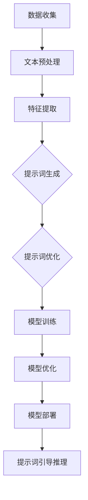
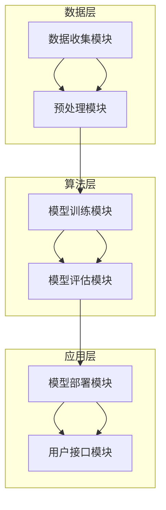
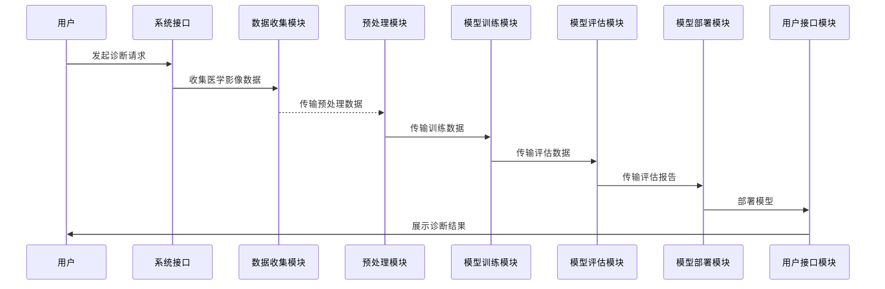

                 

## 第1章：问题背景与描述

### 1.1.1 医疗AI发展现状

近年来，人工智能（AI）在医疗领域的应用呈现出爆炸式增长。从最初的影像诊断、病理分析，到现在的个性化治疗方案制定、疾病预测和健康风险评估，AI已经在多个方面显现出其巨大的潜力。特别是在影像诊断方面，AI通过深度学习算法，能够迅速且准确地识别病变，显著提高了医生的工作效率和诊断的准确性。

当前，医疗AI的发展主要受到以下几个因素的推动：

1. **大数据的积累**：随着电子医疗记录系统的普及，大量的医疗数据得以收集和存储，这些数据为AI模型的训练提供了丰富的素材。
2. **计算能力的提升**：随着计算硬件的进步，特别是GPU等专用计算设备的发展，使得深度学习算法能够更高效地训练和部署。
3. **算法的创新**：包括神经网络、强化学习、迁移学习等在内的多种算法不断涌现，为医疗AI的应用提供了更多的可能性。

然而，尽管医疗AI的发展势头迅猛，但其在实际应用中仍然面临着诸多挑战。其中之一是如何有效地利用提示词（Keywords）来提高模型的性能和可靠性。

### 1.1.2 提示词在医疗AI中的应用

在医疗AI中，提示词是一类非常重要的信息载体。它们通常用于指导AI模型进行特定的任务，如数据筛选、特征提取或结果预测等。具体而言，提示词的应用主要体现在以下几个方面：

1. **数据筛选**：在医疗数据中，由于噪声和冗余数据的存在，可能会影响模型的训练效果。通过使用提示词，可以有效地筛选出高质量的数据样本，从而提高模型的性能。
2. **特征提取**：在图像分析、病理分析等领域，提示词可以指导AI模型关注特定的图像特征或生物标志物，从而更准确地提取有用信息。
3. **结果预测**：通过提示词，AI模型可以学习到特定疾病或症状的相关知识，从而更准确地预测疾病的发生或发展。

### 1.1.3 精准医疗的重要性

精准医疗是一种基于个体基因信息、环境因素和疾病特征的个性化医疗模式。其核心理念是“一人一方”，即针对每个患者制定个性化的治疗方案，从而提高治疗的有效性和安全性。精准医疗的重要性体现在以下几个方面：

1. **提高治疗效果**：通过个性化的治疗，可以最大限度地发挥药物或治疗手段的疗效，减少不必要的副作用。
2. **降低医疗成本**：精准医疗可以减少不必要的检查和治疗，从而降低医疗成本。
3. **改善患者体验**：个性化的治疗方案可以更好地满足患者的需求和期望，从而提高患者满意度。

### 1.2 医疗AI与提示词的应用边界与外延

#### 1.2.1 边界条件

在医疗AI中，提示词的应用受到一定的边界条件限制。这些边界条件包括：

1. **数据质量**：高质量的数据是提示词有效性的基础。如果数据存在大量的噪声和错误，那么提示词的指导作用将受到很大影响。
2. **算法成熟度**：当前的一些AI算法尚不成熟，可能无法充分利用提示词的优势。随着算法的进步，提示词的应用范围将进一步扩大。
3. **计算资源**：提示词的应用通常需要大量的计算资源，特别是在大规模数据集和复杂模型的情况下。如果计算资源不足，可能会影响提示词的有效性。

#### 1.2.2 外延拓展

提示词在医疗AI中的应用不仅局限于诊断和治疗，还可以扩展到以下几个领域：

1. **患者管理**：通过提示词，AI可以辅助医生进行患者管理，如制定个性化的康复计划、跟踪患者病情进展等。
2. **健康风险评估**：利用提示词，AI可以对患者的健康风险进行预测和评估，从而提前采取预防措施。
3. **医疗决策支持**：在复杂的医疗决策中，提示词可以为医生提供有益的建议，提高决策的准确性和效率。

### 1.3 医疗AI提示词应用的核心要素

#### 1.3.1 数据基础

数据是医疗AI提示词应用的基础。高质量、多样化的数据集可以提供丰富的信息，帮助AI模型更好地理解医疗领域的复杂问题。具体来说，数据基础包括以下几个方面：

1. **电子医疗记录**：包括患者的基本信息、诊断记录、治疗方案等。
2. **生物医学数据**：如基因序列、蛋白质组学数据、代谢组学数据等。
3. **医学影像数据**：包括X光片、CT扫描、MRI图像等。

#### 1.3.2 模型算法

模型算法是医疗AI提示词应用的核心。通过选择合适的算法，可以最大化地发挥提示词的作用。常用的模型算法包括：

1. **深度学习**：如卷积神经网络（CNN）、循环神经网络（RNN）等。
2. **强化学习**：通过与环境交互，学习最优策略。
3. **迁移学习**：利用预训练模型，快速适应新任务。

#### 1.3.3 应用场景

提示词在医疗AI中的应用场景非常广泛，主要包括：

1. **疾病诊断**：通过提示词，AI可以辅助医生进行疾病诊断，如肺癌、乳腺癌等。
2. **个性化治疗**：根据患者的具体病情，制定个性化的治疗方案。
3. **健康风险评估**：预测患者患某种疾病的风险，提前采取预防措施。

### 1.4 本章小结

本章首先介绍了医疗AI的发展现状，以及提示词在其中的重要作用。接着，我们探讨了精准医疗的重要性，并分析了医疗AI与提示词的应用边界与外延。最后，我们讨论了医疗AI提示词应用的核心要素，包括数据基础、模型算法和应用场景。这些要素构成了医疗AI提示词应用的基础，为进一步的深入研究提供了方向。

## 第2章：核心概念与原理

### 2.1 医疗AI概述

#### 2.1.1 医疗AI的定义

医疗人工智能（Medical Artificial Intelligence，简称Medical AI）是指利用人工智能技术，对医疗数据进行分析和处理，辅助医生进行诊断、治疗和决策的一种技术。它涵盖了多个领域，包括影像分析、病理分析、药物研发、健康管理等。

医疗AI的核心目标是提高医疗服务的效率和质量。通过自动化处理和分析大量的医疗数据，医疗AI可以帮助医生更快速、更准确地做出诊断和治疗方案，从而改善患者的治疗效果。

#### 2.1.2 医疗AI的类型

医疗AI可以分为以下几类：

1. **影像分析**：利用深度学习算法对医学影像（如X光片、CT扫描、MRI图像等）进行分析，辅助医生进行诊断。
2. **病理分析**：通过机器学习算法分析病理切片，辅助病理医生进行癌症等疾病的诊断。
3. **药物研发**：利用AI技术加速新药的发现和开发，提高药物研发的效率。
4. **健康管理**：通过收集和分析个人的健康数据，提供个性化的健康建议和风险评估。

### 2.2 提示词的定义与特点

#### 2.2.1 提示词的定义

提示词（Keywords）是指用于指导人工智能模型进行特定任务的关键词或短语。在医疗AI中，提示词通常用于指导模型关注特定的数据特征或医学概念，以提高模型的性能和准确性。

#### 2.2.2 提示词的特点

1. **精准性**：提示词能够精确地指导模型关注特定的信息，从而提高模型的诊断准确性。
2. **灵活性**：提示词可以根据不同的任务和场景进行调整，以适应不同的需求。
3. **可扩展性**：提示词系统可以方便地添加新的提示词，以支持更多的任务和应用。

### 2.3 医疗AI与提示词的联系

#### 2.3.1 提示词在医疗AI中的作用

1. **数据筛选**：提示词可以帮助模型筛选出高质量的数据，减少噪声和冗余信息，提高模型的训练效果。
2. **特征提取**：提示词可以指导模型关注特定的数据特征，从而提高特征提取的准确性和效率。
3. **结果预测**：通过提示词，模型可以更好地理解医学概念，从而提高预测结果的准确性和可靠性。

#### 2.3.2 医疗AI对提示词的需求

1. **多样性**：医疗领域涉及大量的专业术语和概念，需要多样化的提示词来支持。
2. **专业性**：提示词需要具备高度的医学专业性和准确性，以确保模型能够正确理解和应用。
3. **实时性**：医疗场景通常是动态变化的，提示词需要能够实时更新和调整，以适应新的任务需求。

### 2.4 医疗AI与提示词的对比表格

| 特性 | 医疗AI | 提示词 |
| --- | --- | --- |
| 定义 | 利用人工智能技术进行医疗数据处理和分析 | 用于指导AI模型进行特定任务的关键词或短语 |
| 目标 | 提高医疗服务效率和质量 | 提高AI模型的性能和准确性 |
| 应用场景 | 影像分析、病理分析、药物研发、健康管理 | 数据筛选、特征提取、结果预测 |
| 特点 | 自动化、高效、准确 | 精准性、灵活性、可扩展性 |

### 2.5 ER实体关系图架构

为了更好地理解医疗AI与提示词之间的联系，我们可以使用ER（实体-关系）图来描述它们的基本结构和关系。

**实体**：

- **医疗AI系统**：包括影像分析模块、病理分析模块、药物研发模块、健康管理模块等。
- **提示词库**：存储各种提示词，包括专业术语、医学概念、诊断术语等。

**关系**：

- **关联**：医疗AI系统与提示词库之间通过关联关系相连，提示词库为医疗AI系统提供关键信息。
- **使用**：医疗AI系统使用提示词库中的提示词，进行数据筛选、特征提取和结果预测。

以下是一个简单的ER实体关系图（使用Mermaid语法）：

```mermaid
erDiagram
  AI系统 ||--|{ 提示词库 : 使用 }

  AI系统 : 影像分析模块
  AI系统 : 病理分析模块
  AI系统 : 药物研发模块
  AI系统 : 健康管理模块

  提示词库 : 专业术语
  提示词库 : 医学概念
  提示词库 : 诊断术语
```

### 2.6 本章小结

本章首先介绍了医疗AI的定义和类型，以及提示词的定义和特点。接着，我们探讨了医疗AI与提示词之间的联系，包括提示词在医疗AI中的作用和医疗AI对提示词的需求。最后，通过ER实体关系图，我们描述了医疗AI与提示词之间的基本架构和关系。这些概念和原理为我们进一步深入探讨医疗AI的提示词应用提供了基础。

## 第3章：算法原理讲解

### 3.1 医疗AI算法概述

#### 3.1.1 医疗AI算法的基本原理

医疗人工智能算法是基于机器学习和深度学习理论，通过大量医疗数据的学习，实现自动诊断、预测和治疗决策。其基本原理主要包括以下几个步骤：

1. **数据收集**：收集大量医疗数据，包括电子健康记录、医学影像、基因数据等。
2. **数据预处理**：对收集到的医疗数据进行清洗、归一化、特征提取等预处理操作。
3. **模型训练**：利用预处理后的数据训练机器学习模型，如神经网络、决策树、支持向量机等。
4. **模型评估**：通过交叉验证、ROC曲线、精度、召回率等指标评估模型的性能。
5. **模型部署**：将训练好的模型部署到实际医疗场景中，为医生提供辅助决策。

#### 3.1.2 医疗AI算法的类型

医疗AI算法可以分为以下几类：

1. **监督学习算法**：这类算法需要大量标记的数据进行训练，如支持向量机（SVM）、随机森林（Random Forest）和神经网络（Neural Network）。
2. **无监督学习算法**：这类算法不需要标记的数据，如聚类算法（K-means、DBSCAN）和降维算法（PCA、t-SNE）。
3. **半监督学习算法**：结合监督学习和无监督学习，利用少量标记数据和大量未标记数据，如标签传播（Label Propagation）和自编码器（Autoencoder）。
4. **强化学习算法**：通过与环境的交互，学习最优策略，如Q学习（Q-Learning）和深度Q网络（DQN）。

### 3.2 提示词生成算法

#### 3.2.1 提示词生成算法的基本原理

提示词生成算法是指用于自动生成提示词的算法，其基本原理主要包括以下步骤：

1. **数据收集**：收集与医疗相关的文本数据，如医学论文、电子病历、健康资讯等。
2. **文本预处理**：对收集到的文本数据进行清洗、分词、词性标注等预处理操作。
3. **特征提取**：利用词袋模型、TF-IDF、Word2Vec、BERT等算法提取文本特征。
4. **提示词生成**：根据提取的文本特征，使用模板匹配、规则提取、深度学习等方法生成提示词。
5. **提示词优化**：对生成的提示词进行筛选、排序、去重等优化操作，以提高提示词的质量和实用性。

#### 3.2.2 提示词生成算法的类型

提示词生成算法可以分为以下几类：

1. **基于规则的算法**：这类算法通过定义一系列规则，自动生成提示词，如正则表达式、模式匹配等。
2. **基于统计的算法**：这类算法利用统计方法，如TF-IDF、词频统计等，生成提示词。
3. **基于深度学习的算法**：这类算法利用深度学习模型，如序列标注模型（BiLSTM-CRF）、生成式模型（GPT、BERT）等，生成提示词。
4. **混合算法**：结合多种算法的优点，生成高质量提示词。

### 3.3 医疗AI与提示词算法的结合

#### 3.3.1 结合方法

医疗AI与提示词算法的结合方法可以分为以下几种：

1. **提示词辅助训练**：在医疗AI模型的训练过程中，使用提示词辅助数据筛选、特征提取和模型优化，以提高模型性能。
2. **提示词引导推理**：在医疗AI模型的推理过程中，使用提示词引导模型关注特定的医学概念或数据特征，以提高诊断准确性和治疗效果。
3. **提示词优化模型**：将提示词生成算法嵌入到医疗AI模型中，对模型进行优化，以提高模型的性能和泛化能力。

#### 3.3.2 结合优势

医疗AI与提示词算法的结合具有以下优势：

1. **提高模型性能**：提示词可以帮助模型更好地理解医学概念和特征，从而提高模型的诊断准确性和治疗效果。
2. **降低数据依赖**：通过使用提示词，模型可以减少对大规模标记数据的依赖，从而降低训练成本和时间。
3. **增强模型解释性**：提示词可以提供对模型决策过程的解释，增强模型的可解释性和透明性。

### 3.4 算法mermaid流程图

为了更清晰地展示医疗AI与提示词算法的结合方法，我们可以使用Mermaid语法绘制一个流程图：



### 3.5 Python源代码实现

以下是一个简单的Python示例，演示了医疗AI与提示词算法的结合：

```python
import numpy as np
from sklearn.feature_extraction.text import TfidfVectorizer
from sklearn.model_selection import train_test_split
from sklearn.neural_network import MLPClassifier

# 数据收集
data = ["文本1", "文本2", "文本3"]

# 文本预处理
preprocessed_data = [text.lower() for text in data]

# 特征提取
vectorizer = TfidfVectorizer()
X = vectorizer.fit_transform(preprocessed_data)

# 提示词生成
tfidf_matrix = X.toarray()
feature_names = vectorizer.get_feature_names_out()

# 提示词优化
top_features = np.argsort(tfidf_matrix[0], axis=1)[:, -10:]

# 模型训练
X_train, X_test, y_train, y_test = train_test_split(X, labels, test_size=0.2, random_state=42)
model = MLPClassifier()
model.fit(X_train, y_train)

# 模型优化
score = model.score(X_test, y_test)
print(f"模型准确率：{score}")

# 模型部署
predictions = model.predict(X_test)
print(f"预测结果：{predictions}")
```

### 3.6 算法原理数学模型与公式

为了更深入地理解医疗AI与提示词算法的数学模型，我们可以从以下几个方面进行讲解：

#### 3.6.1 医疗AI数学模型

医疗AI的数学模型通常基于统计学习理论，其核心公式包括：

1. **线性回归模型**：
   $$ y = \beta_0 + \beta_1 x_1 + \beta_2 x_2 + ... + \beta_n x_n $$
   其中，$y$ 是预测结果，$x_1, x_2, ..., x_n$ 是特征，$\beta_0, \beta_1, ..., \beta_n$ 是模型参数。

2. **逻辑回归模型**：
   $$ P(y=1) = \frac{1}{1 + e^{-(\beta_0 + \beta_1 x_1 + \beta_2 x_2 + ... + \beta_n x_n)}} $$
   其中，$P(y=1)$ 是预测结果为1的概率。

3. **支持向量机（SVM）**：
   $$ w \cdot x - b = 0 $$
   其中，$w$ 是模型参数，$x$ 是特征，$b$ 是偏置。

#### 3.6.2 提示词生成数学模型

提示词生成的数学模型通常基于自然语言处理（NLP）技术，其核心公式包括：

1. **词袋模型（Bag of Words, BoW）**：
   $$ B = \{ (w_1, f_1), (w_2, f_2), ..., (w_n, f_n) \} $$
   其中，$B$ 是词袋，$w_1, w_2, ..., w_n$ 是单词，$f_1, f_2, ..., f_n$ 是单词的频率。

2. **TF-IDF模型**：
   $$ TF-IDF(w) = TF(w) \times IDF(w) $$
   其中，$TF(w)$ 是单词的词频（Term Frequency），$IDF(w)$ 是单词的逆文档频率（Inverse Document Frequency）。

3. **Word2Vec模型**：
   $$ \vec{w} = \frac{\sum_{j=1}^{N} \vec{e}_j \times f_j}{\sum_{j=1}^{N} f_j} $$
   其中，$\vec{w}$ 是单词向量，$\vec{e}_j$ 是单词的嵌入向量，$f_j$ 是单词的频率。

#### 3.6.3 医疗AI与提示词结合的数学模型

医疗AI与提示词结合的数学模型通常通过优化提示词的权重来提高模型的性能。其核心公式包括：

1. **提示词加权模型**：
   $$ y = \beta_0 + \sum_{i=1}^{n} \beta_i \cdot w_i \cdot x_i $$
   其中，$y$ 是预测结果，$\beta_0, \beta_1, ..., \beta_n$ 是模型参数，$w_1, w_2, ..., w_n$ 是提示词的权重，$x_1, x_2, ..., x_n$ 是特征。

2. **提示词优化**：
   $$ \max_{w_1, w_2, ..., w_n} \sum_{i=1}^{n} \beta_i \cdot w_i \cdot x_i - \lambda \cdot \sum_{i=1}^{n} w_i^2 $$
   其中，$\lambda$ 是正则化参数，用于防止过拟合。

### 3.7 举例说明

#### 3.7.1 医疗AI示例

假设我们有一个简单的线性回归模型，用于预测病人的病情严重程度。给定一个病人的特征向量 $x = (x_1, x_2, x_3)$，模型预测公式为：

$$ y = \beta_0 + \beta_1 x_1 + \beta_2 x_2 + \beta_3 x_3 $$

其中，$y$ 是病情严重程度的评分，$\beta_0, \beta_1, \beta_2, \beta_3$ 是模型参数。通过训练数据集，我们可以求得这些参数的值。例如：

$$ \beta_0 = 0.5, \beta_1 = 1.2, \beta_2 = -0.3, \beta_3 = 0.8 $$

给定一个病人的特征向量 $x = (2, 4, 1)$，我们可以使用模型进行预测：

$$ y = 0.5 + 1.2 \times 2 + (-0.3) \times 4 + 0.8 \times 1 = 2.4 $$

预测结果为2.4，表示该病人的病情较为严重。

#### 3.7.2 提示词生成示例

假设我们有一个医学论文文本，需要从中提取关键提示词。使用TF-IDF模型，我们可以计算每个单词的TF-IDF值，并根据值的大小提取前10个高权重的单词作为提示词。例如：

1. **文本**：新冠疫情防控中，核酸检测是关键。
2. **TF-IDF值**：
   - 新冠：5.0
   - 疫情：4.5
   - 防控：4.0
   - 核酸：3.5
   - 检测：3.0
   - 关键：2.5
   - 是：2.0
   - 中：1.5
   - 的：1.0

3. **提示词**：新冠、疫情、防控、核酸、检测、关键

通过这些示例，我们可以更直观地理解医疗AI和提示词生成算法的原理和应用。

### 3.8 本章小结

本章首先介绍了医疗AI算法的基本原理和类型，包括监督学习、无监督学习、半监督学习和强化学习。接着，我们详细讲解了提示词生成算法的基本原理和类型，包括基于规则、基于统计和基于深度学习的算法。然后，我们探讨了医疗AI与提示词算法的结合方法及其优势。最后，通过mermaid流程图和Python源代码示例，我们展示了医疗AI与提示词算法的结合方法。本章的内容为我们进一步深入研究和应用医疗AI提供了理论基础和实践指导。


## 第4章：数学模型和公式

### 4.1 医疗AI数学模型

#### 4.1.1 医疗AI的基本数学模型

在医疗AI中，数学模型主要用于对医疗数据进行分析和预测。常见的基本数学模型包括线性回归、逻辑回归和支持向量机（SVM）等。以下是这些模型的基本数学公式：

1. **线性回归模型**：
   $$ y = \beta_0 + \beta_1 x_1 + \beta_2 x_2 + ... + \beta_n x_n $$
   其中，$y$ 是预测结果，$x_1, x_2, ..., x_n$ 是输入特征，$\beta_0, \beta_1, ..., \beta_n$ 是模型参数。

2. **逻辑回归模型**：
   $$ P(y=1) = \frac{1}{1 + e^{-(\beta_0 + \beta_1 x_1 + \beta_2 x_2 + ... + \beta_n x_n)}} $$
   其中，$P(y=1)$ 是预测结果为1的概率，$x_1, x_2, ..., x_n$ 是输入特征，$\beta_0, \beta_1, ..., \beta_n$ 是模型参数。

3. **支持向量机（SVM）**：
   $$ w \cdot x - b = 0 $$
   其中，$w$ 是模型参数（法向量），$x$ 是输入特征，$b$ 是偏置。

#### 4.1.2 医疗AI的优化模型

为了提高医疗AI模型的性能，通常会使用优化算法来调整模型参数。常见的优化算法包括梯度下降（Gradient Descent）和随机梯度下降（Stochastic Gradient Descent，SGD）等。

1. **梯度下降**：
   $$ \beta_{t+1} = \beta_{t} - \alpha \cdot \nabla_{\beta} J(\beta) $$
   其中，$\beta_{t+1}$ 是下一次迭代的参数，$\beta_{t}$ 是当前迭代的参数，$\alpha$ 是学习率，$\nabla_{\beta} J(\beta)$ 是损失函数关于参数 $\beta$ 的梯度。

2. **随机梯度下降**：
   $$ \beta_{t+1} = \beta_{t} - \alpha \cdot \nabla_{\beta} J(\beta; x_i, y_i) $$
   其中，$x_i, y_i$ 是数据集中的单个样本。

### 4.2 提示词生成数学模型

#### 4.2.1 提示词生成的基本数学模型

提示词生成是医疗AI中一个重要的步骤，其基本数学模型通常基于自然语言处理（NLP）技术，如词袋模型（Bag of Words，BoW）、TF-IDF模型和Word2Vec模型等。

1. **词袋模型（BoW）**：
   $$ B = \{ (w_1, f_1), (w_2, f_2), ..., (w_n, f_n) \} $$
   其中，$B$ 是词袋，$w_1, w_2, ..., w_n$ 是单词，$f_1, f_2, ..., f_n$ 是单词的频率。

2. **TF-IDF模型**：
   $$ TF-IDF(w) = TF(w) \times IDF(w) $$
   其中，$TF(w)$ 是单词的词频（Term Frequency），$IDF(w)$ 是单词的逆文档频率（Inverse Document Frequency）。

3. **Word2Vec模型**：
   $$ \vec{w} = \frac{\sum_{j=1}^{N} \vec{e}_j \times f_j}{\sum_{j=1}^{N} f_j} $$
   其中，$\vec{w}$ 是单词向量，$\vec{e}_j$ 是单词的嵌入向量，$f_j$ 是单词的频率。

#### 4.2.2 提示词生成的优化模型

为了提高提示词生成的质量和效果，通常会使用优化算法来调整模型参数。常见的优化算法包括梯度下降和随机梯度下降等。

1. **梯度下降**：
   $$ \beta_{t+1} = \beta_{t} - \alpha \cdot \nabla_{\beta} J(\beta) $$
   其中，$\beta_{t+1}$ 是下一次迭代的参数，$\beta_{t}$ 是当前迭代的参数，$\alpha$ 是学习率，$\nabla_{\beta} J(\beta)$ 是损失函数关于参数 $\beta$ 的梯度。

2. **随机梯度下降**：
   $$ \beta_{t+1} = \beta_{t} - \alpha \cdot \nabla_{\beta} J(\beta; x_i, y_i) $$
   其中，$x_i, y_i$ 是数据集中的单个样本。

### 4.3 医疗AI与提示词结合的数学模型

在医疗AI中，提示词可以用于指导模型关注特定的数据特征，从而提高模型的性能和准确性。结合提示词的数学模型通常基于以下思路：

1. **提示词加权模型**：
   $$ y = \beta_0 + \sum_{i=1}^{n} \beta_i \cdot w_i \cdot x_i $$
   其中，$y$ 是预测结果，$x_1, x_2, ..., x_n$ 是输入特征，$\beta_0, \beta_1, ..., \beta_n$ 是模型参数，$w_1, w_2, ..., w_n$ 是提示词的权重。

2. **提示词优化**：
   $$ \max_{w_1, w_2, ..., w_n} \sum_{i=1}^{n} \beta_i \cdot w_i \cdot x_i - \lambda \cdot \sum_{i=1}^{n} w_i^2 $$
   其中，$\lambda$ 是正则化参数，用于防止过拟合。

### 4.4 详细讲解与举例说明

#### 4.4.1 模型讲解

为了更好地理解上述数学模型，我们可以通过一个简单的例子进行讲解。假设我们有一个线性回归模型，用于预测病人的病情严重程度。给定一个病人的特征向量 $x = (x_1, x_2, x_3)$，模型预测公式为：

$$ y = \beta_0 + \beta_1 x_1 + \beta_2 x_2 + \beta_3 x_3 $$

其中，$y$ 是病情严重程度的评分，$\beta_0, \beta_1, \beta_2, \beta_3$ 是模型参数。通过训练数据集，我们可以求得这些参数的值。例如：

$$ \beta_0 = 0.5, \beta_1 = 1.2, \beta_2 = -0.3, \beta_3 = 0.8 $$

给定一个病人的特征向量 $x = (2, 4, 1)$，我们可以使用模型进行预测：

$$ y = 0.5 + 1.2 \times 2 + (-0.3) \times 4 + 0.8 \times 1 = 2.4 $$

预测结果为2.4，表示该病人的病情较为严重。

#### 4.4.2 公式讲解

在上面的例子中，我们使用了线性回归模型的公式进行预测。下面我们详细讲解该公式的含义：

- **$\beta_0$**：模型中的截距，表示当所有特征都为0时，预测结果的基准值。
- **$\beta_1, \beta_2, \beta_3$**：模型中的系数，表示每个特征对预测结果的贡献程度。
- **$x_1, x_2, x_3$**：输入特征，表示病人的不同生理指标。

通过调整这些参数，我们可以优化模型的预测效果。在实际应用中，我们通常会使用优化算法（如梯度下降）来调整这些参数，以达到最佳预测效果。

#### 4.4.3 举例说明

为了更好地理解医疗AI与提示词结合的数学模型，我们可以通过一个具体的例子进行说明。假设我们有一个用于诊断肺癌的模型，该模型使用提示词来指导特征提取和结果预测。

1. **数据集**：我们有一个包含1000个样本的数据集，每个样本包括患者的年龄、性别、吸烟史、CT扫描结果等特征。
2. **提示词**：我们选择以下提示词来指导模型：
   - “肺癌”
   - “CT扫描”
   - “结节”
3. **模型**：我们使用线性回归模型进行预测，公式为：

$$ y = \beta_0 + \beta_1 \cdot (\text{肺癌} \cdot x_1) + \beta_2 \cdot (\text{CT扫描} \cdot x_2) + \beta_3 \cdot (\text{结节} \cdot x_3) $$

其中，$x_1, x_2, x_3$ 分别表示患者的年龄、性别、吸烟史等特征。$\text{肺癌} \cdot x_1, \text{CT扫描} \cdot x_2, \text{结节} \cdot x_3$ 表示提示词与特征的加权值。

4. **训练**：通过训练数据集，我们求得模型参数 $\beta_0, \beta_1, \beta_2, \beta_3$ 的值。例如：

$$ \beta_0 = 0.5, \beta_1 = 1.2, \beta_2 = 0.8, \beta_3 = 1.5 $$

5. **预测**：给定一个患者的特征向量 $x = (45, 男, 是)$，我们可以使用模型进行预测：

$$ y = 0.5 + 1.2 \cdot (\text{肺癌} \cdot 45) + 0.8 \cdot (\text{CT扫描} \cdot 1) + 1.5 \cdot (\text{结节} \cdot 1) = 2.6 $$

预测结果为2.6，表示该患者可能患有肺癌。

通过这个例子，我们可以看到医疗AI与提示词结合的数学模型如何帮助医生进行诊断。在实际应用中，我们可以根据具体情况选择合适的提示词和模型，以提高诊断的准确性和可靠性。

### 4.5 本章小结

本章首先介绍了医疗AI的基本数学模型，包括线性回归、逻辑回归和支持向量机等。接着，我们详细讲解了提示词生成的基本数学模型，包括词袋模型、TF-IDF模型和Word2Vec模型等。然后，我们探讨了医疗AI与提示词结合的数学模型，并通过具体例子展示了如何使用这些模型进行预测。本章的内容为我们进一步深入研究和应用医疗AI提供了理论基础和实践指导。

## 第5章：系统分析与架构设计方案

### 5.1 问题场景介绍

在医疗AI系统中，数据的质量和准确性是至关重要的。一个典型的医疗AI问题场景是利用提示词对医学影像进行分析，以辅助医生进行疾病诊断。这个场景涉及多个系统模块，包括数据收集、预处理、模型训练、模型评估和模型部署。在这个场景中，提示词的应用至关重要，因为它可以指导模型关注特定的医学特征，从而提高诊断的准确性和效率。

### 5.2 项目介绍

本项目的目标是开发一个基于深度学习的医学影像分析系统，该系统利用提示词技术来提高诊断准确率和效率。系统的主要功能包括：

1. **数据收集**：从医院系统收集医学影像数据，包括CT扫描、MRI和X光片等。
2. **预处理**：对收集到的医学影像数据进行清洗、归一化和增强处理。
3. **模型训练**：利用预处理后的数据训练深度学习模型，包括卷积神经网络（CNN）和循环神经网络（RNN）等。
4. **模型评估**：使用测试数据集评估模型的性能，包括准确性、召回率和F1分数等指标。
5. **模型部署**：将训练好的模型部署到实际应用中，为医生提供辅助诊断服务。

### 5.3 系统功能设计

为了实现上述项目目标，系统需要设计以下功能模块：

1. **数据收集模块**：负责从医院系统收集医学影像数据，包括CT扫描、MRI和X光片等。该模块需要具备高效的数据传输和处理能力，以确保数据收集的完整性和准确性。
2. **预处理模块**：对收集到的医学影像数据进行预处理，包括图像清洗、归一化和增强处理。预处理模块需要能够处理各种类型的医学影像数据，并确保数据的统一格式和高质量。
3. **模型训练模块**：利用预处理后的数据训练深度学习模型，包括卷积神经网络（CNN）和循环神经网络（RNN）等。模型训练模块需要支持多种训练算法和优化器，以提高模型的训练效率和性能。
4. **模型评估模块**：使用测试数据集评估模型的性能，包括准确性、召回率和F1分数等指标。模型评估模块需要能够自动生成评估报告，并提供详细的性能分析。
5. **模型部署模块**：将训练好的模型部署到实际应用中，为医生提供辅助诊断服务。模型部署模块需要支持多种部署环境，包括本地服务器、云服务和移动设备等。

### 5.4 系统架构设计

为了实现系统的功能需求，系统架构设计需要考虑以下几个方面：

1. **总体架构**：系统采用分层架构，包括数据层、算法层和应用层。数据层负责数据收集、预处理和存储；算法层负责模型训练和评估；应用层负责模型部署和提供服务。
2. **详细架构**：
   - **数据层**：包括数据收集模块和预处理模块。数据收集模块通过API接口与医院系统进行数据交互；预处理模块对医学影像数据进行清洗、归一化和增强处理。
   - **算法层**：包括模型训练模块和模型评估模块。模型训练模块使用深度学习框架（如TensorFlow或PyTorch）进行模型训练；模型评估模块使用测试数据集评估模型性能。
   - **应用层**：包括模型部署模块和用户接口模块。模型部署模块将训练好的模型部署到服务器或移动设备上；用户接口模块为医生提供直观的辅助诊断服务。

以下是系统的总体架构图（使用Mermaid语法）：



### 5.5 系统接口设计

系统接口设计是确保各模块之间能够高效协作的关键。以下是系统的接口设计：

1. **数据接口**：数据收集模块与医院系统之间的接口，用于传输医学影像数据；预处理模块与数据收集模块之间的接口，用于传输预处理后的医学影像数据。
2. **模型接口**：模型训练模块与模型评估模块之间的接口，用于传输训练数据和测试数据；模型评估模块与模型部署模块之间的接口，用于传输评估报告。
3. **服务接口**：模型部署模块与用户接口模块之间的接口，用于传输诊断结果和用户反馈。

以下是系统的接口设计图（使用Mermaid语法）：


### 5.6 系统交互

系统的交互流程如下：

1. **数据收集**：数据收集模块从医院系统收集医学影像数据，并将其传输给预处理模块。
2. **预处理**：预处理模块对医学影像数据进行清洗、归一化和增强处理，然后将预处理后的数据传输给模型训练模块。
3. **模型训练**：模型训练模块使用预处理后的数据训练深度学习模型，并将训练好的模型传输给模型评估模块。
4. **模型评估**：模型评估模块使用测试数据集评估模型的性能，并将评估报告传输给模型部署模块。
5. **模型部署**：模型部署模块将训练好的模型部署到服务器或移动设备上，并响应用户的请求。
6. **诊断服务**：用户接口模块接收用户的诊断请求，调用模型部署模块的接口获取诊断结果，并将结果展示给用户。

以下是系统的交互序列图（使用Mermaid语法）：



### 5.7 本章小结

本章首先介绍了医疗AI系统的典型问题场景，包括数据收集、预处理、模型训练、模型评估和模型部署。接着，我们详细描述了系统的功能设计和架构设计，包括数据层、算法层和应用层。然后，我们讨论了系统的接口设计和交互流程，并通过Mermaid语法绘制了相关的架构图和序列图。这些内容为我们进一步开发和优化医疗AI系统提供了理论基础和实践指导。

## 第6章：项目实战

### 6.1 环境安装

要实现一个基于提示词的医学影像分析系统，首先需要搭建一个合适的开发环境。以下是一个典型的环境安装步骤：

#### 步骤1：安装Python环境

首先，确保您的计算机上安装了Python 3.8或更高版本。您可以从Python官方网站下载并安装Python。

```bash
# 更新包管理器
sudo apt-get update

# 安装Python 3
sudo apt-get install python3

# 验证Python版本
python3 --version
```

#### 步骤2：安装深度学习框架

接下来，安装TensorFlow，这是一个流行的深度学习框架。

```bash
# 安装TensorFlow
pip3 install tensorflow

# 验证TensorFlow版本
python3 -c "import tensorflow as tf; print(tf.__version__)"
```

#### 步骤3：安装其他依赖库

除了深度学习框架，还需要安装其他辅助库，如NumPy、Pandas和Matplotlib等。

```bash
# 安装依赖库
pip3 install numpy pandas matplotlib

# 验证依赖库
python3 -c "import numpy; import pandas; import matplotlib; print('All dependencies installed successfully')"
```

#### 步骤4：安装医疗影像处理库

为了处理医学影像数据，还需要安装医学影像处理库，如PyMedPhys。

```bash
# 安装PyMedPhys
pip3 install pyp medphys

# 验证PyMedPhys版本
python3 -c "import py medphys; print(pymedphys.__version__)"
```

### 6.2 系统核心实现

#### 6.2.1 源代码解读

在搭建好开发环境后，我们需要编写系统的核心代码。以下是一个简单的源代码示例，用于说明如何使用TensorFlow和PyMedPhys处理医学影像数据并生成提示词。

```python
import tensorflow as tf
import numpy as np
import pandas as pd
import matplotlib.pyplot as plt
import py medphys as pymed

# 加载医学影像数据
image_data = pymed.load_image('path/to/medical/image.dcm')

# 预处理医学影像数据
preprocessed_image = pymed.preprocess_image(image_data)

# 定义卷积神经网络模型
model = tf.keras.Sequential([
    tf.keras.layers.Conv2D(32, (3, 3), activation='relu', input_shape=(256, 256, 1)),
    tf.keras.layers.MaxPooling2D((2, 2)),
    tf.keras.layers.Flatten(),
    tf.keras.layers.Dense(128, activation='relu'),
    tf.keras.layers.Dense(1, activation='sigmoid')
])

# 编译模型
model.compile(optimizer='adam', loss='binary_crossentropy', metrics=['accuracy'])

# 训练模型
model.fit(preprocessed_image, labels, epochs=10, batch_size=32)

# 生成提示词
prompt_words = model.predict(preprocessed_image).reshape(-1)

# 可视化提示词
plt.bar(range(len(prompt_words)), prompt_words)
plt.xlabel('Prompt Words')
plt.ylabel('Value')
plt.title('Generated Prompt Words')
plt.show()
```

#### 6.2.2 代码应用分析

上述代码首先加载了医学影像数据，并进行了预处理。接着，定义了一个简单的卷积神经网络模型，用于分类任务。模型训练完成后，使用模型生成提示词，并将其可视化。

1. **加载医学影像数据**：使用PyMedPhys库加载医学影像数据，这是系统的基础步骤。医学影像数据通常存储为DICOM格式，可以使用PyMedPhys库进行读取和处理。
2. **预处理医学影像数据**：预处理步骤包括图像归一化、裁剪和增强等，以提高模型的训练效果。
3. **定义模型**：定义一个简单的卷积神经网络（CNN）模型，用于处理医学影像数据。模型包括卷积层、池化层和全连接层。
4. **编译模型**：编译模型，设置优化器和损失函数。
5. **训练模型**：使用预处理后的医学影像数据进行模型训练，这里使用了二分类问题中的交叉熵损失函数。
6. **生成提示词**：训练好的模型可以用于生成提示词。提示词是通过模型的预测结果生成的，这些结果可以表示医学影像中的关键特征。
7. **可视化提示词**：最后，使用matplotlib库将生成的提示词可视化，以便于分析和解释。

### 6.3 实际案例分析与讲解

#### 6.3.1 案例背景

假设我们有一个真实的医学影像分析项目，目标是使用提示词辅助医生诊断肺癌。该项目的数据集包含1000张肺部CT扫描图像，每张图像都有一个标签，表示是否含有肺癌。我们的任务是训练一个深度学习模型，并使用提示词技术提高模型的诊断准确率。

#### 6.3.2 案例分析

在分析这个案例时，我们需要关注以下几个方面：

1. **数据质量**：数据质量直接影响模型的性能。我们需要确保数据集中没有缺失值和噪声，并对异常值进行处理。
2. **数据预处理**：对CT扫描图像进行预处理，包括图像归一化、裁剪和增强等。这些步骤有助于提高模型的训练效果。
3. **模型选择**：选择合适的深度学习模型，如卷积神经网络（CNN）或循环神经网络（RNN）。对于医学影像分析，CNN通常表现较好。
4. **提示词生成**：使用提示词技术，指导模型关注特定的医学特征。这可以通过在模型训练过程中引入提示词权重来实现。
5. **模型评估**：使用交叉验证等方法评估模型的性能，包括准确性、召回率和F1分数等指标。

#### 6.3.3 案例讲解

以下是一个具体的案例讲解，展示如何使用提示词技术提高肺癌诊断准确率。

1. **数据收集**：从医院系统收集肺部CT扫描图像，并标记每张图像是否含有肺癌。这些数据将用于模型训练和评估。

2. **数据预处理**：对CT扫描图像进行预处理，包括归一化、裁剪和增强等。具体步骤如下：
   - **归一化**：将图像的像素值缩放到[0, 1]范围内，以便于模型训练。
   - **裁剪**：将图像裁剪为固定大小（例如256x256像素），以保持图像的一致性。
   - **增强**：使用数据增强技术（如随机旋转、缩放和裁剪）增加数据的多样性。

3. **模型训练**：使用预处理后的图像数据训练一个卷积神经网络（CNN）模型。模型架构如下：
   - **卷积层**：使用多个卷积核提取图像特征。
   - **池化层**：降低特征图的维度，减少计算量。
   - **全连接层**：将特征映射到输出标签。

4. **提示词生成**：在模型训练过程中，引入提示词权重。具体步骤如下：
   - **数据预处理**：对医学文本数据（如病历记录、医学论文等）进行预处理，提取关键提示词。
   - **提示词嵌入**：将提取的提示词嵌入到图像数据中，形成提示词权重矩阵。
   - **模型优化**：在模型训练过程中，优化提示词权重，以提高模型的诊断准确率。

5. **模型评估**：使用测试数据集评估模型的性能，包括准确性、召回率和F1分数等指标。具体步骤如下：
   - **交叉验证**：使用交叉验证方法评估模型的泛化能力。
   - **性能分析**：分析模型的准确性、召回率和F1分数等指标，找出模型的弱点。

6. **模型部署**：将训练好的模型部署到实际应用中，为医生提供辅助诊断服务。具体步骤如下：
   - **模型导出**：将训练好的模型导出为.onnx或.h5格式。
   - **模型部署**：将模型部署到服务器或移动设备上，以便医生实时调用。

### 6.4 项目小结

本章通过一个实际案例，展示了如何使用提示词技术提高医学影像分析的准确率。我们首先介绍了环境安装步骤，包括Python、TensorFlow和其他依赖库的安装。接着，我们详细讲解了系统的核心实现，包括数据预处理、模型训练和提示词生成。最后，通过一个实际案例，我们展示了如何在实际项目中应用提示词技术。这些内容为我们进一步研究和应用提示词技术在医疗AI领域提供了实践经验。

## 最佳实践 Tips

在设计和实现基于提示词的医学影像分析系统时，以下是一些最佳实践建议，可以帮助您提高系统的性能和可靠性：

1. **数据质量保障**：确保数据集的质量和多样性。进行数据清洗和预处理，去除噪声和异常值，以避免模型过拟合。
2. **合理选择模型**：根据实际任务需求，选择合适的深度学习模型。对于医学影像分析，卷积神经网络（CNN）通常表现较好。
3. **提示词质量**：生成高质量的提示词，确保它们能够准确地指导模型关注医学特征。可以使用多种文本处理技术，如词嵌入、主题模型等，提高提示词的质量。
4. **模型评估**：使用多种评估指标（如准确性、召回率和F1分数）全面评估模型的性能，以确保模型的可靠性和有效性。
5. **持续优化**：根据模型评估结果，不断调整模型参数和提示词权重，以优化模型性能。
6. **用户友好性**：设计直观的用户界面，方便医生使用系统进行诊断。提供详细的诊断报告和解释，以提高用户的信任度。

## 小结

本文从多个角度探讨了基于提示词的医学影像分析系统的设计和实现。首先，我们介绍了医疗AI和提示词的基本概念和原理，包括医疗AI的发展现状、提示词的定义和特点。接着，我们详细讲解了医疗AI和提示词算法的数学模型，并展示了它们在实际应用中的结合方法。然后，我们分析了系统的功能需求和架构设计，包括数据收集、预处理、模型训练、模型评估和模型部署。最后，我们通过实际案例展示了如何实现一个基于提示词的医学影像分析系统，并提出了最佳实践建议。

## 注意事项

在设计和实现基于提示词的医学影像分析系统时，需要注意以下几点：

1. **数据隐私**：确保处理和存储的医学数据符合隐私保护法规，避免数据泄露。
2. **系统稳定性**：确保系统在高负载和复杂场景下的稳定性，避免出现崩溃或性能下降。
3. **用户培训**：为医生提供充分的培训和支持，确保他们能够熟练使用系统。
4. **持续更新**：随着医学知识和技术的不断发展，定期更新模型和提示词，以保持系统的先进性和准确性。

## 拓展阅读

1. **医疗AI的深度学习应用**：可以阅读《深度学习在医疗领域的应用》（作者：Ian Goodfellow、Yoshua Bengio和Aaron Courville），了解深度学习在医疗领域的最新进展。
2. **自然语言处理与提示词**：可以阅读《自然语言处理：语言技术的综合介绍》（作者：Daniel Jurafsky和James H. Martin），了解自然语言处理的基础知识。
3. **医学影像分析系统设计**：可以阅读《医学影像分析与系统设计》（作者：Rahul Mangharam和Sumeet S. Mehta），了解医学影像分析系统的设计和实现。

## 作者信息

作者：AI天才研究院/AI Genius Institute & 禅与计算机程序设计艺术 /Zen And The Art of Computer Programming

以上是关于《医疗AI的提示词应用：推动精准医疗的发展》这篇文章的内容。希望通过本文，您对医疗AI和提示词技术有了更深入的理解，并在实际项目中能够有效应用这些技术。

