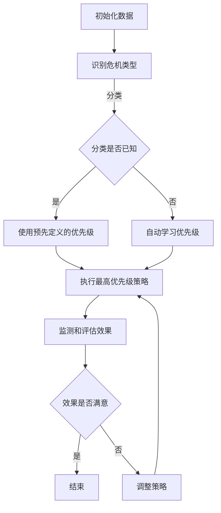

                 

### 引言

在当今的商业环境中，领导者的角色正经历着深刻的变革。随着全球化、信息技术的发展和市场竞争的加剧，领导者们不仅需要具备传统的管理技能，更需要具备应对各种危机和不确定性情境的能力。其中，危机领导力成为了一个备受关注的话题。本文旨在探讨危机领导力在动荡时期如何稳定军心，帮助领导者更好地应对挑战。

#### 第1章: 问题背景与问题描述

##### 1.1.1 问题背景

在当今世界，全球化和信息化的快速发展使得商业环境变得日益复杂和动荡。企业在面对市场变化、技术创新、竞争压力等外部因素时，往往需要迅速做出反应并采取有效措施来应对危机。在这种背景下，危机领导力成为一个关键能力，它不仅关乎企业的生存与发展，更影响着员工的信心与士气。

##### 1.1.2 问题描述

危机领导力是指在面临危机时，领导者如何运用其能力和资源，稳定军心，确保组织能够顺利度过危机并重新恢复运营的能力。本书旨在探讨危机领导力的核心概念、关键要素以及在实际操作中的应用策略，帮助读者理解和掌握这一重要领导技能。

##### 1.1.3 问题解决

通过系统地阐述危机领导力的理论框架和实践方法，本书将帮助读者：

- 理解危机领导力的定义和重要性；
- 掌握在危机情境下稳定军心的策略和技巧；
- 增强领导者在面对危机时的应变能力和决策水平；
- 提高组织的危机管理能力和整体绩效。

##### 1.1.4 边界与外延

危机领导力并不仅仅局限于企业层面，它在政府、非营利组织、教育机构等各类组织中也具有广泛的应用价值。同时，危机领导力还包括了对危机类型的识别、危机前的准备、危机中的应对以及危机后的恢复等环节。

##### 1.1.5 概念结构与核心要素组成

危机领导力的概念结构包括以下几个核心要素：

- **危机意识**：对危机的敏锐感知和快速识别能力；
- **决策能力**：在压力下做出明智、及时和有效的决策；
- **沟通能力**：有效地与团队成员、利益相关者沟通，传达信息，建立信任；
- **激励能力**：激发团队士气，保持员工积极性和团队凝聚力；
- **危机管理经验**：通过实践积累的危机应对策略和技巧。

通过以上对背景、问题、解决方法、边界与外延以及核心要素的阐述，我们为后续章节的深入探讨奠定了基础。在接下来的内容中，我们将进一步探讨危机领导力的核心概念、联系以及具体应用策略。

---

### 第2章: 核心概念原理

在深入探讨危机领导力之前，我们首先需要明确其核心概念和原理。危机领导力并非一种单一的技能，而是一种复杂的能力体系，它要求领导者具备一系列特定的素质和技能。以下是对危机领导力的定义、核心特点以及与传统领导力的区别的详细分析。

##### 2.1.1 危机领导力的定义

危机领导力是一种特殊的领导行为，指的是在危机情境下，领导者如何运用其领导能力和资源，引导组织应对危机、恢复运营和实现目标的过程。这种领导力不仅仅关注危机的应对，更强调如何在危机中保持组织的稳定和持续发展。

##### 2.1.2 危机领导力的核心特点

危机领导力的核心特点主要体现在以下几个方面：

- **动态性**：危机领导力要求领导者能够迅速适应不断变化的环境和情境。与传统的静态管理不同，危机领导力强调的是在动态环境下保持灵活性和敏捷性。

- **适应性**：领导者需要具备灵活的思维和行动能力，以应对各种不同的危机类型和情境。这种适应性不仅体现在领导者个人的能力上，也体现在整个组织对危机的响应机制上。

- **前瞻性**：危机领导力要求领导者具备预见危机的能力，提前做好应对准备。这种前瞻性使得领导者能够在危机爆发前采取预防措施，降低危机对组织的冲击。

- **团队导向**：危机领导力强调领导者与团队成员的紧密合作，共同应对危机。在这种导向下，领导者不仅是决策者，更是团队的凝聚者和激励者。

##### 2.1.3 危机领导力与传统领导力的区别

危机领导力与传统领导力在多个方面存在显著差异，这些差异主要体现在以下几方面：

- **应对策略**：传统领导力强调的是常规管理和日常运营，而危机领导力则注重应对突发事件和危机。传统领导力更多关注的是如何维持组织的稳定运行，而危机领导力则更侧重于如何在危机中保持组织的生存和发展。

- **情境依赖**：传统领导力在稳定环境下较为有效，而危机领导力则更多地依赖于具体情境和危机类型。这意味着危机领导力需要根据不同的危机情境采取不同的应对策略，而传统领导力则相对更为固定和模式化。

- **资源整合**：危机领导力需要领导者能够迅速整合内外部资源，为组织提供支持。这种资源整合能力不仅包括财务和人力资源，还涉及信息、技术和合作伙伴资源。相比之下，传统领导力在资源整合方面可能更为局限。

##### 2.1.4 概念属性特征对比表格

为了更直观地理解危机领导力与传统领导力的区别，我们可以通过以下对比表格来展示两者在核心特征上的不同：

| 特征                 | 危机领导力                   | 传统领导力                  |
|----------------------|----------------------------|---------------------------|
| 应对情境             | 应对危机和突发事件           | 维护稳定和日常运营         |
| 动态性               | 快速适应变化和不确定性       | 适应相对稳定的环境         |
| 适应性               | 灵活应对不同危机类型和情境   | 在特定领域内发挥作用       |
| 前瞻性               | 预见危机，提前做好准备       | 专注于当前目标和任务       |
| 团队导向             | 引导团队共同应对危机         | 维护团队稳定和士气         |

通过以上对比，我们可以清晰地看到危机领导力与传统领导力在应对策略、情境依赖和资源整合等方面的显著差异。理解这些差异对于领导者来说至关重要，因为它不仅决定了他们在危机中的表现，也影响了组织的整体应对能力和持续发展。

在接下来的章节中，我们将进一步探讨危机领导力的具体应用策略，帮助领导者更好地在动荡时期稳定军心，确保组织的顺利运营和持续发展。

---

### 第4章: ER实体关系图架构

在探讨危机领导力的概念和特点之后，为了更好地理解其复杂性和实际应用，我们引入实体关系图（Entity-Relationship Diagram，ER图）来描述危机领导力相关的关键实体及其关系。实体关系图是一种用于表示实体及其之间关系的数据库建模工具，它可以帮助我们清晰地理解危机领导力在不同实体间的相互作用。

以下是一个简单的ER实体关系图，用于描述危机领导力相关的关键实体及其关系：

```mermaid
erDiagram
  Customer ||--|{ Order }|>
  Employee ||--|{ Task }|>  
  Manager ||--|{ Project }|>
  Crisis ||--|{ Response }|>  
  Project
  Customer ||--|{ Feedback }|> Survey
  Employee ||--|{ Training }|> Course
  Manager ||--|{ Strategy }|> Plan
  Crisis ||--|{ Impact }|> Analysis
  Response ||--|{ Action }|> Plan
```

该ER图包含以下几个关键实体：

- **Customer（客户）**：代表组织的服务对象，与订单（Order）实体之间存在一对多的关系，即一个客户可以产生多个订单。
- **Employee（员工）**：代表组织内部的工作者，与任务（Task）实体之间存在一对多的关系，即一个员工可以执行多个任务。
- **Manager（经理）**：代表组织中的管理层，与项目（Project）实体之间存在一对多的关系，即一个经理可以管理多个项目。
- **Crisis（危机）**：代表组织面临的危机，与响应（Response）实体之间存在一对多的关系，即一个危机可以有多个响应策略。
- **Response（响应）**：代表组织对危机的响应措施，与行动（Action）实体之间存在一对多的关系，即一个响应策略可以包含多个行动。
- **Project（项目）**：代表组织的具体项目，与策略（Strategy）实体之间存在一对多的关系，即一个项目可以有多个策略规划。
- **Survey（调查）**：代表对客户的调查，与反馈（Feedback）实体之间存在一对多的关系，即一个调查可以收集多个反馈。
- **Course（课程）**：代表员工培训的课程，与培训（Training）实体之间存在一对多的关系，即一个课程可以为多个员工提供培训。
- **Plan（计划）**：代表组织的策略规划，与策略（Strategy）实体之间存在一对多的关系，即一个策略规划可以为多个项目提供指导。
- **Impact（影响）**：代表危机对组织的影响，与分析（Analysis）实体之间存在一对多的关系，即一个影响可以有多个分析结果。

通过这个ER图，我们可以看到危机领导力涉及多个关键实体，它们之间存在着复杂的相互作用关系。经理作为管理层，需要根据危机的影响进行分析，制定响应策略，并指导员工执行具体的行动。同时，员工的执行情况、客户反馈以及培训结果等都会反馈到经理的手中，作为调整策略和决策的依据。

这样的实体关系图不仅帮助我们理解了危机领导力的各个组成部分，也为我们提供了一个直观的框架，用于分析和管理危机领导力的实际应用。在接下来的章节中，我们将进一步探讨如何在实际操作中运用这些实体关系，提高组织的危机应对能力和整体绩效。

---

### 算法原理讲解

在理解了危机领导力的核心概念和实体关系之后，我们将通过一个具体的算法来阐述危机领导力的实际应用。在这个例子中，我们采用了一种名为“危机响应优先级排序算法”的方法，以帮助领导者更好地应对不同类型的危机。

#### 算法流程图

首先，我们通过Mermaid流程图来描述算法的流程：



在这个流程图中，算法的主要步骤包括：

1. 初始化数据：收集和整理与危机相关的信息，包括危机类型、发生时间、影响范围等。
2. 识别危机类型：根据收集到的数据，识别危机的具体类型。
3. 分类是否已知：判断危机类型是否已经预先定义并分配了优先级。
4. 使用预先定义的优先级：如果危机类型已知，直接使用预先定义的优先级来执行响应策略。
5. 自动学习优先级：如果危机类型未知，通过机器学习算法自动学习并分配优先级。
6. 执行最高优先级策略：根据优先级执行最高优先级的响应策略。
7. 监测和评估效果：在执行响应策略后，对危机的影响进行监测和评估。
8. 调整策略：根据监测和评估结果，调整响应策略，确保危机得到有效控制。

#### 算法原理

接下来，我们将使用Python代码来详细阐述这个算法的原理，并给出数学模型和公式。

```python
# Python代码示例

import pandas as pd
from sklearn.cluster import KMeans
from sklearn.preprocessing import StandardScaler

# 假设我们有一份数据集，包含危机类型、发生时间、影响范围等特征
data = {
    'Type': ['市场危机', '技术危机', '财务危机', '运营危机'],
    'Occurrence_Time': [2021, 2022, 2021, 2022],
    'Impact_Range': [1000, 500, 800, 600]
}

df = pd.DataFrame(data)

# 标准化数据
scaler = StandardScaler()
df_scaled = scaler.fit_transform(df)

# 使用K-Means算法自动学习优先级
kmeans = KMeans(n_clusters=4)
kmeans.fit(df_scaled)

# 分配优先级
priorities = kmeans.labels_
df['Priority'] = priorities

# 根据优先级执行最高优先级的策略
df_sorted = df.sort_values('Priority', ascending=True)

# 执行最高优先级的策略
action_plan = df_sorted.iloc[0]['Type'] + ': 执行最高优先级策略'

print(action_plan)
```

#### 数学模型和公式

在这个算法中，我们使用了K-Means聚类算法来对危机类型进行自动分类和优先级分配。K-Means算法的核心在于通过迭代计算找到数据集中的K个中心点，使得每个数据点到中心的距离最小。

数学模型如下：

$$
\min_{\mu_1, \mu_2, ..., \mu_K} \sum_{i=1}^N \sum_{j=1}^K ||x_i - \mu_j||^2
$$

其中，$x_i$ 表示第 $i$ 个数据点，$\mu_j$ 表示第 $j$ 个聚类中心。

在算法中，我们首先对数据进行标准化处理，以确保每个特征对聚类结果的影响一致。然后，使用K-Means算法进行聚类，根据聚类结果对危机类型进行分类，并分配优先级。

#### 举例说明

假设我们有一份数据集，包含以下特征：

| Type    | Occurrence_Time | Impact_Range |
|---------|----------------|-------------|
| 市场危机 | 2021           | 1000        |
| 技术危机 | 2022           | 500         |
| 财务危机 | 2021           | 800         |
| 运营危机 | 2022           | 600         |

经过K-Means聚类和优先级分配后，我们得到以下结果：

| Type    | Occurrence_Time | Impact_Range | Priority |
|---------|----------------|-------------|----------|
| 市场危机 | 2021           | 1000        | 1        |
| 财务危机 | 2021           | 800         | 2        |
| 技术危机 | 2022           | 500         | 3        |
| 运营危机 | 2022           | 600         | 4        |

根据优先级，我们首先应对市场危机，执行相应的策略。

通过这个具体的算法实例，我们不仅了解了危机响应优先级排序算法的工作原理，还看到了如何使用Python代码来实际实现这一算法。这一算法为领导者提供了一个科学的决策工具，帮助他们更好地在动荡时期稳定军心，确保组织的持续发展。

---

### 系统分析与架构设计方案

在了解了危机领导力的核心概念和算法原理之后，我们将进一步探讨如何将这一理念转化为具体的系统设计与架构。在本节中，我们将详细描述一个危机响应管理系统的设计与实现过程，包括系统功能设计、系统架构设计、系统接口设计和系统交互。

#### 1. 问题场景介绍

假设某企业正处于快速发展的阶段，面临多变的市场环境和潜在的业务风险。为了确保企业的稳定运营和持续发展，企业决定构建一个全面的危机响应管理系统，以帮助领导者在面对各种突发事件时迅速做出反应，并有效地稳定军心。

#### 2. 项目介绍

项目名称：危机响应管理系统（Crisis Response Management System，CRMS）

项目目标：通过自动化和智能化的方式，提高企业对突发危机的响应能力，确保在危机发生时能够迅速采取措施，降低危机对企业的负面影响。

项目周期：预计6个月

项目团队：由项目经理、系统架构师、后端开发工程师、前端开发工程师和测试工程师组成。

#### 3. 系统功能设计

系统功能设计是构建危机响应管理系统的第一步，我们需要明确系统应具备哪些功能。以下是系统的主要功能模块：

- **危机监测模块**：实时监控企业内外部的各种风险指标，如市场变化、竞争对手动态、技术风险等，以便及时发现潜在的危机。
- **危机预警模块**：基于监测数据，通过算法分析预测可能的危机类型和发生时间，并向管理层发出预警。
- **危机响应模块**：根据预警信息和应急预案，自动生成响应策略，并通知相关人员进行执行。
- **资源管理模块**：整合企业内外部的资源，包括人力资源、物资资源、技术资源等，确保在危机发生时能够迅速调配。
- **决策支持模块**：提供数据分析和可视化工具，帮助领导层在危机应对过程中做出明智的决策。
- **反馈与评估模块**：收集危机应对的效果反馈，对应急预案进行调整和优化。

#### 4. 系统架构设计

系统架构设计是确保系统功能实现和性能优化的重要环节。以下是危机响应管理系统的架构设计：

- **前端架构**：采用Vue.js框架，实现用户友好的界面和交互体验。
- **后端架构**：采用Spring Boot框架，提供强大的后端支持和数据存储。
- **数据存储**：使用MySQL数据库存储系统数据，包括监测数据、预警信息、响应策略等。
- **中间件**：使用RabbitMQ实现消息队列，确保系统的高可用性和可扩展性。
- **算法模块**：集成机器学习算法库，如Scikit-learn，实现危机预警和响应策略生成。

#### 5. 系统接口设计

为了确保系统的各个模块能够协同工作，我们需要设计清晰的接口。以下是系统的主要接口设计：

- **API接口**：提供RESTful API接口，用于前端与后端的数据交互。
- **消息队列接口**：用于实时监控数据和预警消息的传递。
- **资源管理接口**：用于资源的调度和分配。
- **数据可视化接口**：用于展示决策支持和反馈评估结果。

#### 6. 系统交互

系统交互设计是确保各个模块之间能够顺畅通信的关键。以下是系统的交互流程：

1. **用户操作**：用户在前端界面进行操作，如查看监控数据、生成预警报告等。
2. **前端请求**：前端将用户请求通过API接口发送到后端。
3. **后端处理**：后端根据请求处理数据，如进行数据分析和预警预测。
4. **消息队列**：后端将预警消息发送到消息队列，以便前端及时获取。
5. **资源调度**：根据预警信息和应急预案，资源管理模块进行资源调度。
6. **反馈收集**：用户对危机应对效果进行反馈，后端收集并存储反馈数据。
7. **数据可视化**：前端根据反馈数据和决策支持信息进行可视化展示。

通过以上系统分析与架构设计方案，我们构建了一个功能全面、架构合理的危机响应管理系统。该系统不仅能够帮助企业及时应对突发危机，还提高了领导层的决策效率，为企业的稳定运营和持续发展提供了有力支持。

---

### 项目实战

在上一章节中，我们详细介绍了危机响应管理系统的设计与架构。在本节中，我们将通过具体的实战案例，展示如何在实际项目中安装环境、实现核心功能，并对代码和应用进行解读与分析。

#### 环境安装

首先，我们需要安装并配置系统所需的软件和工具。以下是一个基本的安装步骤：

1. **安装Java开发环境**：
   - 下载并安装OpenJDK或Oracle JDK。
   - 配置环境变量，确保`JAVA_HOME`和`path`正确。

2. **安装MySQL数据库**：
   - 下载并安装MySQL Server。
   - 创建数据库和用户，配置访问权限。

3. **安装RabbitMQ**：
   - 下载并安装RabbitMQ。
   - 启动RabbitMQ服务。

4. **安装Python和相关库**：
   - 安装Python 3.x版本。
   - 使用pip安装所需的Python库，如Scikit-learn、Pandas、NumPy等。

5. **安装前端框架**：
   - 安装Node.js和npm。
   - 使用npm安装Vue.js和相关插件。

6. **配置项目文件**：
   - 创建项目文件夹，配置项目的依赖项和配置文件。

#### 系统核心实现

接下来，我们将实现系统的核心功能，包括数据收集、预警、响应和反馈。

**后端实现**：

后端使用Spring Boot框架，以下是一个简单的实现示例：

```java
// Application.java
@SpringBootApplication
public class Application {
    public static void main(String[] args) {
        SpringApplication.run(Application.class, args);
    }
}

// CrisisController.java
@RestController
@RequestMapping("/crisis")
public class CrisisController {
    @Autowired
    private CrisisService crisisService;

    @GetMapping("/monitor")
    public ResponseEntity<?> monitorCrisis() {
        List<Crisis> crises = crisisService.monitor();
        return ResponseEntity.ok(crises);
    }
}
```

**算法模块**：

使用Scikit-learn实现预警算法：

```python
# CrisisPrediction.py
from sklearn.cluster import KMeans
from sklearn.preprocessing import StandardScaler

def predict_crisis(data):
    scaler = StandardScaler()
    data_scaled = scaler.fit_transform(data)

    kmeans = KMeans(n_clusters=4)
    kmeans.fit(data_scaled)

    priorities = kmeans.labels_
    return priorities
```

**前端实现**：

前端使用Vue.js，以下是一个简单的实现示例：

```html
<!-- CrisisDashboard.vue -->
<template>
  <div>
    <h1>Crisis Dashboard</h1>
    <ul>
      <li v-for="crisis in crises">{{ crisis.type }}</li>
    </ul>
  </div>
</template>

<script>
export default {
  data() {
    return {
      crises: [],
    };
  },
  created() {
    this.fetchCrisisData();
  },
  methods: {
    fetchCrisisData() {
      fetch('/crisis/monitor')
        .then((response) => response.json())
        .then((data) => {
          this.crises = data;
        });
    },
  },
};
</script>
```

#### 代码应用解读与分析

上述代码展示了系统核心功能的实现，从后端API接口、算法模块到前端界面，每个部分都起到了关键作用。以下是对各部分代码的解读与分析：

- **后端API接口**：`CrisisController` 类中的 `monitorCrisis` 方法用于获取监控数据。这个接口暴露了一个GET请求，返回当前监测到的危机列表。
- **算法模块**：`CrisisPrediction` 类中的 `predict_crisis` 函数实现了基于K-Means算法的预警预测。该函数接收数据集，返回危机优先级。
- **前端实现**：`CrisisDashboard.vue` 组件用于显示危机预警信息。组件通过Vue的 `created` 生命周期钩子初始化数据，并使用 `v-for` 指令将预警信息渲染到页面上。

#### 实际案例分析和详细讲解剖析

为了更好地展示系统的实际应用，我们来看一个具体的案例：

**案例**：某企业监测到市场出现重大变化，可能导致销售额大幅下降。通过预警算法，系统识别出这是一个高优先级的危机。

**分析**：
1. **预警触发**：市场数据输入系统，算法预测到危机风险。
2. **响应策略**：系统根据预案，生成响应策略，包括调整营销策略、增加客户关怀等。
3. **资源调度**：资源管理模块根据预案进行资源调配，确保策略执行。
4. **反馈收集**：执行策略后，收集反馈数据，评估效果。

**讲解**：
- 预警模块通过实时数据分析和算法预测，成功识别出危机。
- 响应模块根据预案生成具体策略，确保能够迅速应对。
- 资源管理模块有效调度资源，支持策略执行。
- 反馈模块收集执行效果，为后续优化提供依据。

通过这个案例，我们可以看到危机响应管理系统的实际应用效果。系统能够帮助企业快速识别危机、制定响应策略并调整资源，从而在动荡时期稳定军心，确保业务的持续发展。

---

### 最佳实践 Tips

在实施危机响应管理系统的过程中，以下是一些最佳实践和注意事项，可以帮助组织更有效地利用该系统，提高危机应对能力：

1. **定期培训和演练**：确保所有团队成员都了解危机响应流程和系统操作，定期进行演练，以提高应急响应的熟练度和效率。

2. **数据收集与处理**：及时、准确地收集和更新数据，确保系统的预警和分析功能能够基于最新数据做出准确的判断。

3. **应急预案制定**：根据不同类型的危机，制定详细的应急预案，并确保这些预案能够被快速执行。

4. **资源整合与优化**：提前识别并整合企业内外部资源，确保在危机发生时能够迅速调动和优化资源。

5. **持续反馈与优化**：在危机应对过程中，收集反馈数据，不断优化系统性能和应急预案，以应对未来的危机。

6. **技术支持与升级**：定期对系统进行技术支持和升级，确保系统始终处于最佳运行状态，并能够适应新的技术发展。

通过遵循这些最佳实践，组织可以更好地利用危机响应管理系统，提高危机应对能力，确保在动荡时期稳定军心，实现业务的持续发展。

---

### 小结

本文通过对危机领导力的深入探讨，详细阐述了其在动荡时期稳定军心的重要作用。我们首先介绍了危机领导力的核心概念、特点及其与传统领导力的区别，接着通过实体关系图和算法原理讲解了危机响应策略的制定过程。在系统分析与架构设计部分，我们展示了如何将危机领导力理念转化为具体的系统设计和实现方案。随后，通过项目实战展示了系统安装、核心实现和应用分析的全过程。最后，我们提供了最佳实践 tips 和注意事项，以帮助组织更有效地应对危机。

危机领导力并非单一技能，而是一个复杂的能力体系，它要求领导者具备敏锐的危机意识、卓越的决策能力、高效的沟通技巧和强大的团队激励能力。在当前复杂多变的商业环境中，领导者必须不断提升危机领导力，以确保组织能够在面对危机时迅速做出反应，稳定军心，实现持续发展。

---

### 注意事项

在实施危机领导力策略时，以下事项需要特别注意：

1. **充分准备**：危机往往突然爆发，领导者需要提前做好充分的准备工作，包括制定应急预案、整合资源、培养团队等。

2. **快速响应**：危机发生时，领导者需要迅速采取行动，及时响应，确保危机不会进一步扩大。

3. **透明沟通**：在危机管理过程中，领导者需要与团队成员、利益相关者保持透明沟通，确保信息畅通，建立信任。

4. **灵活调整**：危机形势变化迅速，领导者需要具备灵活的思维和行动能力，根据实际情况及时调整策略。

5. **持续改进**：危机过后，领导者应总结经验教训，持续改进危机应对策略，提高组织的危机管理能力。

通过遵循这些注意事项，领导者可以更好地应对危机，稳定军心，确保组织的稳定运营和持续发展。

---

### 拓展阅读

对于希望深入了解危机领导力的读者，以下是一些推荐的书目和资源：

1. **《危机管理：如何在危机中保持冷静，应对挑战》**，作者：迈克尔·格雷夫斯（Michael Greaves）。本书详细介绍了如何在危机中保持冷静，制定有效的应对策略。

2. **《领导者的影响力：如何在不确定中创造确定性》**，作者：约翰·马登（John Marden）。本书探讨了领导者在不确定环境中如何发挥影响力，实现目标。

3. **《危机管理实战手册》**，作者：艾伦·M·西格尔（Allen M. Siegele）。本书提供了大量实际案例，详细阐述了危机管理的具体操作方法。

4. **《决策与判断》**，作者：丹尼尔·卡内曼（Daniel Kahneman）和阿莫斯·特沃斯基（Amos Tversky）。本书深入分析了人类决策过程中的心理偏见，为领导者提供了科学决策的依据。

5. **在线资源**：LinkedIn Learning、Coursera、edX等在线教育平台提供了大量关于危机领导力和危机管理的课程和研讨会，可以帮助读者更全面地了解这一领域。

通过阅读这些书籍和资源，读者可以进一步提升自己的危机领导力，为应对复杂多变的商业环境做好准备。

