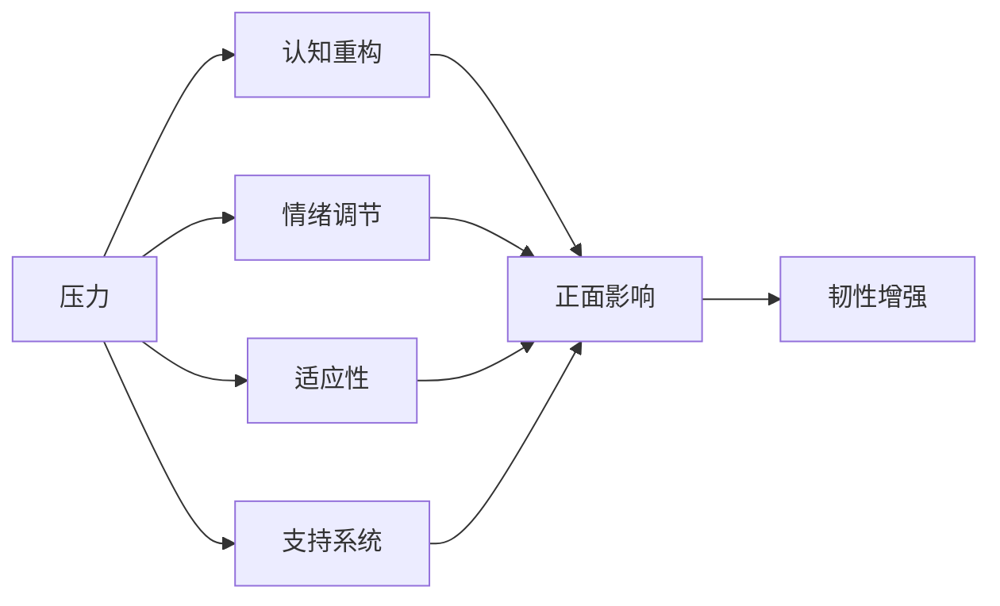

                 


### 引言与背景

在当今这个瞬息万变、竞争激烈的技术时代，IT行业的快速发展带来了前所未有的机遇与挑战。企业在不断追求技术创新和业务增长的过程中，团队面临的压力与挑战也日益加剧。因此，如何培养团队应对压力和挑战的能力，成为每个企业管理者和技术团队领导者亟待解决的问题。

**压力**是团队在日常工作中不可避免的现象。它可能来源于项目进度紧张、市场压力增大、技术创新要求提高等多个方面。而**韧性**，则是指团队在面对压力和挑战时，能够保持积极心态、灵活应对、快速恢复的能力。韧性不仅有助于减轻压力带来的负面影响，还能提高团队的抗风险能力和创新活力。

为了更好地理解压力与韧性的概念，我们首先需要明确以下几点：

1. **压力的定义**：压力是指个体或团队在面临外界要求或预期时，感受到的心理或生理上的紧张状态。
2. **压力的类型**：压力可以分为短期压力和长期压力，急性压力和慢性压力等。
3. **压力的来源**：压力可以来自工作本身，如高强度的工作任务和时间压力，也可以来自人际关系、组织环境等因素。

**韧性**的定义则是指个体或团队在面对压力和挑战时，能够保持积极心态、灵活应对、快速恢复的能力。韧性不仅涉及到心理层面，还包括应对策略、适应性、情感管理等多个方面。

接下来，我们将进一步探讨压力对团队的影响，以及团队如何通过有效的应对策略来减轻压力。同时，我们也会详细讨论韧性的概念和培养方法，以及团队在应对挑战时所需具备的能力。通过这些内容的逐步分析，我们希望能够为读者提供一个系统化的视角，帮助团队在应对压力和挑战时更加从容和有效。

### 压力的定义与类型

**压力**是一个广泛用于描述心理或生理紧张状态的术语，其在不同领域有不同的定义和应用。在心理学中，压力通常被定义为个体对某种外部或内部要求所产生的生理、心理和行为的反应。这种反应可以是积极的，比如在面对挑战时的应对能力；也可以是消极的，如持续的压力可能导致焦虑、抑郁等心理问题。

**压力的类型**主要包括以下几种：

1. **短期压力（急性压力）**：通常是指短时间内出现的压力，如考试前的紧张、项目截止日期的临近等。这种压力通常具有明确的目标和结束时间，个体在压力解除后能够迅速恢复。
2. **长期压力（慢性压力）**：这种压力是指长时间持续存在的压力，如工作中的持续高负荷、家庭问题等。长期压力对个体的身心健康有更大的负面影响，可能导致慢性疾病、心理问题等。
3. **急性压力**：这种压力通常是指突发事件或极端情况下的压力，如自然灾害、重大事故等。急性压力通常会导致强烈的生理和心理反应，如恐慌、心跳加速等。
4. **慢性压力**：与急性压力相对，慢性压力是指长期处于一种紧张状态下的压力，如长期加班、持续的工作紧张等。慢性压力的危害往往被忽视，但它的累积效应可能会对个体的健康产生严重的影响。

**压力的来源**可以归纳为以下几个方面：

1. **工作压力**：工作本身的高强度要求、复杂度以及不确定因素，如项目进度紧张、任务繁多、客户需求变化等，都可能成为压力的来源。
2. **人际关系**：工作中的合作与竞争、团队内部的沟通不畅、冲突等，都可能产生压力。
3. **组织环境**：组织结构、企业文化、管理方式等，都可能对个体产生压力。例如，高压工作环境、不明确的绩效评价标准等。
4. **个人因素**：个人的性格、心理素质、生活状态等，也会对个体感受压力的强度和类型产生影响。例如，焦虑型性格的人可能更容易感受到工作压力。

为了更直观地理解压力的类型和来源，我们可以使用一个**概念属性特征对比表格**来展示：

| 压力类型         | 定义                                                         | 特点                                       | 影响因素                                       |
|------------------|------------------------------------------------------------|------------------------------------------|--------------------------------------------|
| 短期压力（急性压力） | 短时间内出现的压力                                         | 明确的目标和结束时间，压力解除后迅速恢复    | 项目截止日期、考试、突发事件等               |
| 长期压力（慢性压力） | 长时间持续存在的压力                                       | 长期累积效应，可能导致慢性疾病、心理问题    | 工作强度、家庭问题、持续的工作紧张等         |
| 急性压力         | 突发事件或极端情况下的压力                                 | 强烈的生理和心理反应                     | 自然灾害、重大事故、突发事件等               |
| 慢性压力         | 长期处于一种紧张状态下的压力                               | 持续累积效应，对健康产生严重的影响        | 长期加班、持续的工作紧张、不明确的绩效评价等 |

通过上述表格，我们可以更清晰地看到不同类型压力的定义、特点以及影响因素。这些信息对于理解压力对团队的影响至关重要，也是制定有效压力管理策略的基础。

### 压力对团队的影响

压力对团队的影响是多方面的，可以从个体层面和团队层面两个维度进行分析。

**从个体层面看，压力对团队成员的影响主要有以下几方面：**

1. **心理健康问题**：长期压力可能导致团队成员出现焦虑、抑郁、情绪不稳定等问题。这些问题不仅影响个体的工作表现，还可能对他们的身心健康造成长期的损害。
2. **工作表现下降**：在压力下，个体可能会出现注意力不集中、决策能力下降、工作效率降低等现象。这些问题不仅影响个体的绩效，还可能对整个团队的工作进度和项目质量产生负面影响。
3. **人际冲突增加**：压力下的人们更容易感到疲惫和烦躁，这可能导致团队成员之间的沟通不畅、协作困难，进而引发人际冲突。
4. **离职和流失率上升**：持续的高压工作环境和对个人健康的损害，可能导致团队成员选择离职，增加团队的流失率。

**从团队层面看，压力的影响更为复杂且深远：**

1. **团队士气下降**：当团队中的多数成员都感受到高压时，整个团队的士气会受到影响。士气低落可能导致团队成员缺乏工作动力，影响团队的整体表现。
2. **协作效率降低**：压力导致团队成员的沟通不畅、协作困难，降低了团队的效率。在一个压力较大的环境中，团队成员可能更倾向于关注自己的任务，而忽视团队的整体目标。
3. **创新活力减弱**：压力使团队成员更容易陷入惯性思维，缺乏创新的动力和机会。在高压环境下，团队成员可能更倾向于采用保守的方法，而不是尝试新的解决方案。
4. **决策质量下降**：在压力下，团队成员可能难以做出高质量的决策。压力会影响个体的认知功能，降低判断力和决策能力，导致错误的决策和行动。
5. **项目延误和失败**：长期的压力可能导致项目进度延误、质量下降，甚至项目失败。在压力下，团队难以有效地应对外部变化和内部挑战，导致项目目标的难以实现。

为了更直观地展示压力对团队的影响，我们可以使用一个**ER实体关系图**来描述团队成员与压力之间的关系：

```mermaid
erDiagram
    TeamMember ||--|{ Pressure } Pressure
    Pressure ||--|{ TeamHealth } TeamHealth
    Pressure ||--|{ WorkPerformance } WorkPerformance
    Pressure ||--|{ Collaboration } Collaboration
    Pressure ||--|{ TeamMorale } TeamMorale
    Pressure ||--|{ ProjectDelays } ProjectDelays
    TeamMember ||--|{ EmployeeTurnover } EmployeeTurnover
```

在这个ER实体关系图中，我们可以看到团队成员（TeamMember）与压力（Pressure）之间存在多种关系，包括心理健康（TeamHealth）、工作表现（WorkPerformance）、协作（Collaboration）、团队士气（TeamMorale）、项目延误（ProjectDelays）以及员工流失（EmployeeTurnover）。这种关系图有助于我们理解压力如何通过多种途径影响团队的整体运作。

综上所述，压力对团队的影响是深远且复杂的。它不仅影响团队成员的身心健康和工作表现，还可能导致团队士气下降、协作效率降低、项目延误和失败等问题。因此，有效地管理和减轻团队压力，对于保持团队的稳定和提升整体绩效至关重要。

### 压力的应对策略

面对团队中的压力，有效的应对策略至关重要。以下我们将从心理调适、管理层策略和团队层面策略三个方面详细探讨应对压力的方法。

**1. 心理调适策略：**

对于个体来说，心理调适是减轻压力的关键。以下是一些实用的心理调适策略：

- **认知重构**：通过改变对压力事件的认识和解释，减少其负面影响。例如，将“我必须完美完成任务”改为“我尽力而为，接受不完美”。
- **情绪管理**：学习情绪调节技巧，如深呼吸、冥想和正念练习，帮助个体在压力下保持冷静和专注。
- **积极思考**：培养积极心态，寻找压力中的机遇，如“这次挑战让我有机会学习和成长”。
- **时间管理**：合理安排工作和休息时间，避免过度劳累。例如，使用番茄工作法（25分钟工作，5分钟休息）来提高工作效率。
- **社交支持**：寻求家人、朋友或同事的支持和帮助，分享自己的压力和感受，减少孤独感。

**2. 管理层应对策略：**

管理层在应对团队压力方面发挥着关键作用。以下是一些有效的管理层策略：

- **明确目标和期望**：确保团队成员明确了解他们的工作目标和期望，减少不确定性和焦虑。
- **提供资源和支持**：为团队提供必要的资源和支持，如培训、工具和设备，帮助他们更好地应对压力。
- **鼓励沟通**：建立开放和透明的沟通环境，鼓励团队成员分享他们的压力和困惑，提供及时的反馈和解决方案。
- **灵活的工作安排**：根据团队成员的需求和工作情况，提供灵活的工作安排，如远程工作、弹性工作时间等，以减轻他们的压力。
- **绩效评估的调整**：调整绩效评估标准和方式，避免过度依赖量化指标，更多地关注团队成员的工作表现和贡献。

**3. 团队层面策略：**

团队层面的策略有助于建立强大的团队韧性，提高团队的整体抗压能力。以下是一些有效的团队层面策略：

- **团队建设活动**：定期组织团队建设活动，增强团队成员之间的信任和合作，提高团队凝聚力。
- **共同目标**：确保团队有一个共同的目标，让每个成员都明确自己在团队中的角色和责任，增强团队的一致性和协作性。
- **问题解决训练**：通过模拟问题解决场景，培养团队成员的问题解决能力和团队合作精神。
- **反思与反馈**：定期组织团队反思会议，总结工作经验，识别和解决团队面临的问题，提升团队的适应性和学习能力。
- **压力管理培训**：为团队成员提供压力管理培训，帮助他们掌握有效的压力应对技巧。

通过上述策略，团队可以从多个层面减轻压力，提高成员的心理健康和工作满意度，增强团队的韧性和整体表现。有效的压力管理不仅有助于提高团队成员的绩效，还能提升团队的稳定性和长期发展潜力。

### 韧性的定义与特征

**韧性**是指个体或团队在面对压力和挑战时，能够保持积极心态、灵活应对、快速恢复的能力。它不仅涉及到心理层面的应对策略，还涉及到行为和制度的支持。在心理学和管理学中，韧性被广泛研究和应用，因为它是团队在复杂和不确定环境中生存和发展的关键。

**韧性的定义**可以从以下几个方面进行阐述：

1. **心理韧性（Resilience）**：心理韧性是指个体在面临压力、逆境和挑战时，能够迅速适应、恢复并从困境中崛起的能力。它涉及到个体的情绪调节、认知重构、积极应对等心理机制。
2. **组织韧性（Organizational Resilience）**：组织韧性是指一个组织在面对外部冲击和内部挑战时，能够迅速适应、恢复并持续运作的能力。它包括组织的灵活性、应变能力、学习能力以及员工的心理韧性。

**韧性的特征**主要包括以下几个方面：

1. **适应能力（Adaptability）**：韧性强的个体或团队能够迅速适应变化的环境和条件，调整自身行为和策略以应对新的挑战。
2. **恢复能力（Recovery）**：韧性强的个体或团队能够在经历压力和挑战后迅速恢复，恢复到正常或更好的状态。
3. **灵活性（Flexibility）**：韧性强的个体或团队能够灵活调整自己的策略和行动，以应对复杂和不确定的情境。
4. **学习能力（Learning）**：韧性强的个体或团队能够从挑战和失败中学习和成长，不断提升自己的能力和应对策略。
5. **心理韧性（Emotional Resilience）**：韧性强的个体能够有效管理自己的情绪，保持积极心态，减少负面情绪的影响。

为了更直观地理解韧性的特征，我们可以使用一个**表格**来展示：

| 韧性特征 | 定义 | 例子 |
|----------|------|------|
| 适应能力 | 迅速适应变化的能力 | 在项目进展受阻时，团队迅速调整计划，确保目标达成 |
| 恢复能力 | 在压力和挑战后迅速恢复 | 团队成员在项目失败后，迅速调整心态，重新投入到新的任务中 |
| 灵活性 | 调整策略和行动的能力 | 在市场环境变化时，企业快速调整营销策略，以应对新的竞争格局 |
| 学习能力 | 从挑战和失败中学习 | 团队从一次失败的客户项目中学到宝贵的经验，改进流程和沟通 |
| 心理韧性 | 管理情绪，保持积极心态 | 面对客户投诉时，团队成员保持冷静，以专业和礼貌的方式解决问题 |

**韧性的重要性**不可低估。它不仅有助于个体和团队在逆境中生存和成长，还能提升整体组织的抗风险能力和创新能力。在当前复杂多变的市场环境中，韧性成为企业保持竞争优势的关键因素。

通过定义和特征的探讨，我们可以更深入地理解韧性在应对压力和挑战中的重要作用。接下来，我们将进一步探讨如何培养韧性，以及韧性如何与压力相互作用，帮助团队更好地应对各种挑战。

### 韧性的培养

**韧性的培养**是一个系统性和长期性的过程，需要从心理韧性、团队韧性和管理者培养策略等多个方面进行。以下将详细讨论这些方面的具体方法和实践。

**1. 心理韧性培养方法**

心理韧性培养主要关注个体的情绪管理、认知重构和积极思维等心理能力。以下是一些具体的方法：

- **认知重构**：通过识别和改变负面思维模式，帮助个体以更积极、理性的方式看待问题和挑战。例如，将“我无法完成这项任务”改为“我可以尝试找到解决方案”。
- **情绪管理**：学习情绪调节技巧，如深呼吸、冥想、正念练习等，帮助个体在压力下保持冷静和专注。这些技巧有助于减少焦虑和压力的负面影响。
- **积极思维**：培养积极心态，寻找压力中的机遇和成长点。通过正向的自我对话和积极的心理暗示，增强个体面对困难的信心和勇气。
- **目标设定**：明确个人和团队的目标，设定可行的短期和长期目标，以增强动力和方向感。目标设定有助于个体在压力下保持专注和积极心态。
- **自我关怀**：定期进行放松和休息，关注个人的身心健康。通过健康饮食、充足睡眠和适量运动等，提高个体的抗压能力和心理韧性。

**2. 团队韧性培养方法**

团队韧性培养关注团队的整体协作、沟通和应对策略。以下是一些具体的方法：

- **团队建设活动**：定期组织团队建设活动，增强团队成员之间的信任和合作。通过共同完成任务和面对挑战，提高团队的凝聚力和韧性。
- **共同目标**：确保团队有一个共同的目标，让每个成员都明确自己的角色和责任。共同目标有助于团队成员在面对压力和挑战时保持一致性和协作性。
- **问题解决训练**：通过模拟问题和挑战场景，培养团队成员的解决问题能力和团队合作精神。问题解决训练有助于团队在面对不确定性和逆境时保持冷静和高效。
- **反思与反馈**：定期组织团队反思会议，总结工作经验，识别和解决团队面临的问题。反思与反馈有助于团队不断提升自己的适应能力和韧性。
- **跨部门协作**：促进不同部门之间的沟通和协作，减少信息孤岛和沟通障碍。跨部门协作有助于团队在面对复杂任务和挑战时更加灵活和高效。

**3. 管理者培养团队韧性的策略**

管理者在培养团队韧性中起着关键作用。以下是一些具体的管理者策略：

- **明确期望和目标**：确保团队成员明确了解他们的工作目标和期望，减少不确定性和焦虑。管理者应该通过明确的沟通和反馈，帮助团队成员明确自己的责任和目标。
- **提供资源和支持**：为团队提供必要的资源和支持，如培训、工具和设备，帮助团队成员更好地应对压力和挑战。资源和支持不仅包括物质资源，还包括心理支持和职业发展机会。
- **鼓励沟通和反馈**：建立开放和透明的沟通环境，鼓励团队成员分享他们的压力和困惑，提供及时的反馈和解决方案。管理者应该成为团队成员的支持者和倾听者。
- **灵活的工作安排**：根据团队成员的需求和工作情况，提供灵活的工作安排，如远程工作、弹性工作时间等，以减轻他们的压力。灵活的工作安排有助于提高员工的工作满意度和心理韧性。
- **绩效评估的调整**：调整绩效评估标准和方式，避免过度依赖量化指标，更多地关注团队成员的工作表现和贡献。合理的绩效评估有助于激发团队成员的积极性和创造力。

**4. 案例实践**

为了更好地理解韧性的培养方法，我们可以通过以下案例进行实践：

- **案例一**：某科技公司通过定期组织团队建设活动，如户外拓展训练和团队聚餐，增强了团队成员之间的信任和凝聚力。同时，公司还通过问题解决训练和反思会议，帮助团队在面对项目挑战时保持高效和协作。
- **案例二**：某互联网企业在员工培训中加入了心理韧性培训课程，教授员工情绪管理和认知重构技巧。通过这些培训，员工在面对工作压力时能够更加冷静和理性，减少了焦虑和负面情绪的影响。
- **案例三**：某金融机构通过建立跨部门协作机制，促进不同部门之间的沟通和信息共享。在项目实施过程中，各部门能够及时协调和配合，提高了项目的执行效率和质量。

通过这些案例，我们可以看到，韧性的培养需要结合具体的管理情境和团队特点，采取多种方法和策略。有效的韧性培养不仅有助于提高团队的整体表现，还能提升团队在面对压力和挑战时的适应能力和抗风险能力。

### 韧性与压力的关系

**韧性**与**压力**之间的关系是复杂而动态的。韧性不仅有助于个体和团队更好地应对压力，还能在一定程度上减轻压力的负面影响。以下将详细探讨韧性与压力之间的互动关系，以及韧性如何缓解压力的影响。

首先，韧性可以**减轻压力的负面影响**。韧性强的个体和团队能够更有效地应对压力，减少压力带来的负面情绪和生理反应。例如，在面临高强度工作压力时，韧性强的员工能够通过积极的应对策略和良好的情绪管理，降低焦虑和压力感，保持工作效率和心理健康。

其次，韧性有助于**增强个体的抗风险能力**。在面对突发事件和意外挑战时，韧性强的个体能够迅速适应和恢复，降低压力对身心健康的影响。例如，在自然灾害或突发事件发生时，韧性强的社区和组织能够更快地恢复运作，减少经济损失和社会动荡。

此外，韧性还可以**提升团队的协作效率和创新能力**。在面对复杂任务和不确定环境时，韧性强的团队能够更好地协作和沟通，共同应对挑战。通过有效的团队建设和问题解决训练，团队可以提升协作效率，降低冲突和误解，从而提高整体绩效和创新能力。

然而，韧性并不能完全消除压力。压力是工作和生活中的常见现象，它有助于推动个体和团队不断进步和成长。适度的压力可以激发个体的潜能和创造力，促进团队的创新和进步。因此，韧性并不是要消除所有压力，而是帮助个体和团队更好地应对和管理压力，使其转化为积极的力量。

**韧性如何缓解压力的影响**：

1. **情绪调节**：韧性强的个体能够更好地管理自己的情绪，减少压力带来的负面情绪。例如，通过深呼吸、冥想和情绪记录等技巧，个体可以在压力下保持冷静和专注。
2. **认知重构**：韧性强的个体能够通过积极的认知重构，改变对压力事件的看法和解释。例如，将“我不够好”改为“这是一个学习和成长的机会”，从而减轻压力的负面影响。
3. **适应性**：韧性强的团队能够迅速适应变化的环境和条件，调整策略和行动，以应对新的挑战。这种适应性有助于降低压力带来的不确定性和焦虑感。
4. **支持系统**：韧性强的个体和团队通常拥有良好的社会支持系统，包括家人、朋友和同事的支持。这些支持系统在压力下提供情感上的安慰和实际上的帮助，减轻压力的负面影响。

为了更直观地理解韧性与压力之间的关系，我们可以使用一个**mermaid流程图**来展示：



在这个流程图中，我们可以看到压力通过认知重构、情绪调节、适应性和支持系统等多种途径影响韧性。韧性最终通过增强个体和团队的能力，减轻压力的负面影响，促进个人和团队的成长和发展。

综上所述，韧性是应对压力的重要能力。通过培养和提升韧性，个体和团队可以更好地应对压力，减少压力的负面影响，增强整体适应能力和抗风险能力。在复杂多变的环境中，韧性成为个体和团队保持竞争优势和持续发展的关键因素。

### 挑战的类型与特点

在IT行业中，团队面临的挑战多种多样，这些挑战不仅影响项目的进展，还可能对团队的稳定性和整体效能产生深远影响。了解挑战的类型和特点，有助于团队更好地准备和应对。以下我们将详细探讨不同类型的挑战及其特点。

**1. 技术挑战**

技术挑战是指在项目开发过程中遇到的技术难题，如系统架构设计、代码优化、算法实现等。这类挑战的特点包括：

- **复杂性**：技术挑战往往涉及复杂的算法和系统架构，需要深入的技术知识和经验。
- **不确定性**：技术挑战可能涉及尚未解决的难题，存在较高的不确定性，可能需要多次尝试和调整。
- **时效性**：技术挑战通常有时间限制，要求团队在有限的时间内找到解决方案。

**2. 项目管理挑战**

项目管理挑战涉及项目计划、资源分配、进度控制等方面。这类挑战的特点包括：

- **多变性**：项目需求可能会随时变更，导致项目计划频繁调整，增加了管理的复杂性。
- **协调困难**：涉及多个团队和成员的项目，协调工作难度大，容易出现沟通不畅、资源冲突等问题。
- **风险性**：项目管理过程中可能出现各种风险，如预算超支、进度延误、质量下降等。

**3. 市场竞争挑战**

市场竞争挑战涉及在激烈的市场环境中保持竞争优势。这类挑战的特点包括：

- **激烈性**：市场竞争激烈，要求企业不断创新和优化产品和服务，以吸引和留住客户。
- **不确定性**：市场需求和竞争态势不断变化，企业需要具备快速应对变化的能力。
- **时效性**：市场竞争要求企业迅速做出决策和行动，以抢占市场份额。

**4. 人才挑战**

人才挑战涉及团队的人力资源管理，如招聘、培训和团队建设等。这类挑战的特点包括：

- **人才短缺**：在某些领域，高素质人才供不应求，企业面临人才短缺的挑战。
- **人才流失**：高压力和高要求的工作环境可能导致人才流失，影响团队的稳定性和能力。
- **人才发展**：企业需要关注人才的职业发展和培养，以保持团队的活力和竞争力。

**5. 法律法规挑战**

法律法规挑战涉及遵守行业法规和标准。这类挑战的特点包括：

- **严格性**：法律法规通常具有严格的执行标准和程序，企业必须严格遵守，以避免法律风险。
- **复杂性**：不同国家和地区的法律法规可能存在差异，企业需要熟悉并遵守各地的法律法规。
- **变动性**：法律法规可能会随着时间和政策的变化而调整，企业需要及时更新法规知识和应对措施。

为了更直观地了解挑战的类型和特点，我们可以使用一个**mermaid类图**来展示不同类型挑战及其属性：

```mermaid
classDiagram
    Class1[技术挑战] <|-- Class2[复杂性]
    Class1 <|-- Class3[不确定性]
    Class1 <|-- Class4[时效性]
    Class2 <|-- Class5[项目管理挑战]
    Class2 <|-- Class6[多变性]
    Class2 <|-- Class7[协调困难]
    Class2 <|-- Class8[风险性]
    Class2 <|-- Class9[市场竞争挑战]
    Class2 <|-- Class10[激烈性]
    Class2 <|-- Class11[不确定性]
    Class2 <|-- Class12[时效性]
    Class2 <|-- Class13[人才挑战]
    Class2 <|-- Class14[人才短缺]
    Class2 <|-- Class15[人才流失]
    Class2 <|-- Class16[人才发展]
    Class2 <|-- Class17[法律法规挑战]
    Class2 <|-- Class18[严格性]
    Class2 <|-- Class19[复杂性]
    Class2 <|-- Class20[变动性]
```

通过上述类图，我们可以清晰地看到不同类型挑战的属性和特点，这有助于团队在应对挑战时采取更有效的策略和措施。

综上所述，了解挑战的类型和特点是团队应对压力和提升韧性的基础。通过识别和分析不同类型的挑战，团队可以更好地准备和应对，提高整体抗风险能力和应对能力。

### 培养团队应对挑战的能力

要培养团队应对挑战的能力，需要从跨部门协作、解决问题能力和应对不确定性的能力三个方面进行系统性提升。

**1. 跨部门协作能力的培养**

跨部门协作是应对复杂项目和技术挑战的重要手段。以下是几种培养跨部门协作能力的方法：

- **建立跨部门沟通平台**：利用企业内部的即时通讯工具、项目管理软件和邮件系统，建立高效的跨部门沟通渠道。通过定期召开跨部门会议和项目进度更新会议，确保信息共享和及时沟通。
- **开展跨部门团队建设活动**：定期组织团队建设活动，如团队拓展训练、项目协作竞赛等，增强团队成员之间的信任和合作精神。通过共同完成任务，提升跨部门协作的效率和效果。
- **建立统一的项目管理流程**：制定明确的项目管理流程，包括项目启动、执行、监控和收尾阶段的具体步骤和责任分配。确保跨部门团队能够按照统一的流程进行工作，减少沟通障碍和资源冲突。
- **培养跨部门协作的领导力**：选拔和培养具有跨部门协作能力的领导人员，通过他们的示范和引导，带动整个团队形成良好的协作文化。

**2. 解决问题能力的培养**

解决问题是团队在面对挑战时的重要能力。以下是一些培养团队解决问题能力的方法：

- **建立问题解决机制**：制定问题解决的流程和规范，包括问题识别、分析、解决方案制定和实施等步骤。确保团队能够在遇到问题时快速响应和有效解决。
- **开展问题解决培训**：为团队成员提供问题解决技巧的培训，如SWOT分析、头脑风暴、鱼骨图等工具和方法。通过培训，提高团队成员的问题解决能力和团队合作意识。
- **鼓励创新思维**：鼓励团队成员提出创新的想法和解决方案，培养团队的创新能力。通过创建一个鼓励尝试和错误的企业文化，激发团队成员的创新潜力。
- **实践问题解决**：通过实际项目中的问题解决实践，积累经验，提升团队的问题解决能力。定期组织问题解决演练和案例分析，帮助团队成员总结经验，不断提高解决问题的效率和质量。

**3. 应对不确定性的能力培养**

在当今快速变化的环境中，团队需要具备应对不确定性的能力。以下是几种培养团队应对不确定性的方法：

- **建立适应性组织结构**：构建灵活、模块化的组织结构，使团队能够快速调整和适应环境变化。通过减少层级和官僚主义，提高团队的响应速度和创新能力。
- **培养风险管理意识**：提高团队成员对风险管理的认识，制定有效的风险识别、评估和控制措施。通过定期进行风险评估和演练，提高团队应对不确定性的能力。
- **增强学习与适应性**：鼓励团队成员持续学习和更新知识，提高对新兴技术和市场趋势的敏感度。通过不断学习和实践，团队可以更好地应对不确定性和变化。
- **建立应急响应机制**：制定应急响应计划和流程，确保在突发事件和紧急情况下，团队能够迅速反应和采取有效措施。通过模拟应急演练，提高团队成员的应急处理能力和协作效率。

综上所述，培养团队应对挑战的能力是一个系统性和长期性的过程。通过跨部门协作、解决问题能力和应对不确定性的能力培养，团队可以更好地应对各种挑战，提高整体效能和竞争力。

### 团队训练与实战

**团队训练与实战**是培养团队应对挑战能力的重要手段。通过模拟实际工作场景，团队可以在没有实际风险的情况下，积累经验、改进策略，提高应对挑战的能力。以下我们将详细探讨团队培训的方法、实战演练的策略以及反思与改进的过程。

**1. 团队培训的方法**

团队培训是提升团队应对能力的基础。以下是一些有效的培训方法：

- **情景模拟培训**：通过模拟实际的工作场景，如项目管理、危机应对、跨部门协作等，让团队成员在模拟环境中实践和掌握相关技能。这种方法能够帮助团队成员在真实环境中更加从容地应对挑战。
- **案例学习**：通过分析经典案例和实际工作中的成功与失败案例，帮助团队成员了解应对挑战的最佳实践和常见问题。案例学习不仅能够提供具体操作指导，还能激发团队成员的思考和创新。
- **专家讲座与研讨会**：邀请行业专家和资深人士进行讲座和研讨会，分享他们的经验、见解和应对策略。这种方式能够为团队成员提供最新的行业动态和先进理念，拓宽视野，提升专业素养。
- **角色扮演**：通过角色扮演，团队成员可以模拟各种角色，如项目经理、客户代表、团队成员等，以更全面、深入地理解不同角色的需求和挑战。这种方法有助于提高团队成员的沟通技巧和协作能力。

**2. 实战演练的策略**

实战演练是将培训效果转化为实际能力的关键环节。以下是一些实战演练的策略：

- **建立实战演练平台**：创建一个模拟真实工作环境的平台，如虚拟办公环境、模拟项目管理系统等。通过这个平台，团队成员可以进行实战演练，提高应对实际工作的能力。
- **设定实战演练目标**：明确实战演练的目标和预期效果，确保团队成员在演练过程中有明确的任务和方向。目标设定应具有可衡量性，以便在演练后进行评估和反馈。
- **多样化实战演练场景**：设计多种类型的实战演练场景，包括常规工作场景、突发情况场景等。通过多样化的演练，团队成员可以全面了解各种情况的应对策略，提高应对复杂局面的能力。
- **实时反馈与指导**：在实战演练过程中，及时给予团队成员反馈和指导。通过实时反馈，帮助团队成员识别问题、改进策略，提高演练效果。

**3. 反思与改进的过程**

反思与改进是团队训练与实战的重要环节。以下是一些反思与改进的方法：

- **演练后评估**：在实战演练结束后，对团队成员的表现进行评估，包括完成任务的情况、沟通效果、协作能力等方面。通过评估，找出存在的问题和不足，为后续改进提供依据。
- **团队讨论与总结**：组织团队成员进行讨论和总结，分享实战演练的经验和教训。通过集体讨论，团队成员可以互相学习、取长补短，共同提高。
- **制定改进计划**：根据评估和讨论的结果，制定具体的改进计划，包括培训内容调整、策略优化、流程改进等。改进计划应具有可执行性和可行性，确保能够真正解决实际问题。
- **持续跟进与优化**：在改进计划实施过程中，持续跟进和评估改进效果，及时调整和优化方案。通过持续改进，不断提升团队应对挑战的能力。

通过团队训练与实战，团队可以不断提升应对挑战的能力，提高整体绩效和竞争力。实战演练不仅帮助团队成员掌握实际操作技能，还能增强团队凝聚力和协作能力，为企业的长期发展奠定坚实基础。

### 案例研究

为了更好地理解《压力与韧性：培养团队应对挑战的能力》中的理论和方法，我们将通过两个实际案例，分析企业如何在压力和挑战中运用这些理论，并取得了哪些成效。

**案例一：某企业的压力与韧性管理**

**1. 案例背景**

某大型科技公司近期推出了一个重要项目，该项目旨在开发一款创新性的智能家居产品。项目初期，由于市场预期高、时间紧、技术复杂，团队成员面临巨大的工作压力。这不仅影响了工作效率，还引发了团队内部的焦虑和紧张情绪。

**2. 压力管理的策略**

为了应对压力，公司采取了一系列措施：

- **心理调适策略**：公司为团队成员提供了心理咨询服务，帮助员工缓解工作压力。同时，公司组织了定期的心理培训，教授情绪管理和压力缓解技巧，如深呼吸、冥想和正念练习等。
- **管理层应对策略**：管理层明确项目目标和期望，并提供了必要的资源和支持。同时，管理层鼓励团队成员之间的沟通，建立了开放和透明的沟通环境，确保信息畅通无阻。
- **团队层面策略**：公司组织了多次团队建设活动，如团建聚餐和户外拓展训练，增强团队成员之间的信任和合作。此外，公司还引入了问题解决训练，帮助团队成员提升问题解决能力。

**3. 韧性培养的措施**

公司还注重韧性培养，采取了以下措施：

- **心理韧性培养**：公司为员工提供了心理韧性培训课程，教授情绪管理和积极思维技巧。通过这些培训，员工在面对压力时能够保持冷静和专注，提升抗压能力。
- **团队韧性培养**：公司定期组织团队反思会议，总结工作经验，识别和解决团队面临的问题。通过反思和反馈，团队不断优化工作流程和沟通方式，提高协作效率。
- **跨部门协作**：公司通过建立跨部门协作机制，促进不同部门之间的沟通和信息共享。跨部门合作不仅提高了项目效率，还增强了团队的适应能力。

**4. 案例成效分析**

通过上述措施，公司有效缓解了团队压力，提升了团队韧性和应对挑战的能力。具体成效如下：

- **工作效率提升**：团队成员在心理调适和韧性培养的帮助下，能够更好地应对工作压力，工作效率显著提高。
- **团队士气提升**：团队建设活动和心理韧性培训增强了团队成员之间的信任和合作，团队士气明显提升。
- **项目成功交付**：通过有效的压力管理和韧性培养，团队成功完成了智能家居项目的开发，产品得到了市场的广泛认可。

**案例二：某个团队应对挑战的实践**

**1. 案例背景**

某互联网创业团队在开发一款新型社交应用时，遇到了多个技术挑战和市场竞争压力。团队在项目初期面临技术瓶颈和市场需求不明确的问题，导致项目进展缓慢，团队成员情绪低落。

**2. 团队应对策略**

团队采取以下策略应对挑战：

- **技术挑战应对**：团队通过问题解决训练，分析了项目中的技术难题，并制定了详细的解决方案。同时，团队加强了与技术专家的合作，借助外部资源解决技术问题。
- **市场挑战应对**：团队通过市场调研和用户反馈，不断优化产品功能和用户体验。团队还采取了灵活的营销策略，以快速适应市场需求变化。
- **团队韧性培养**：团队定期进行心理韧性培训，帮助成员保持积极心态，增强抗压能力。此外，团队通过反思和总结，不断改进工作流程和协作方式。

**3. 挑战解决的过程**

团队通过以下步骤解决挑战：

- **问题识别**：通过定期反思和评估，团队识别出项目中的主要问题，包括技术难题和市场需求不明确。
- **方案制定**：团队针对识别出的问题，制定详细的解决方案，如技术优化方案和市场营销策略。
- **实施与监控**：团队按计划实施解决方案，并设立关键指标进行监控，确保项目按计划推进。
- **调整与优化**：根据实施结果，团队不断调整和优化方案，以应对新的挑战。

**4. 案例总结**

通过有效的应对策略，团队成功克服了技术挑战和市场压力，取得了以下成果：

- **技术突破**：团队通过合作和培训，解决了多个技术难题，提升了项目的技术水平。
- **市场认可**：通过优化产品和营销策略，团队获得了市场的认可，应用下载量和用户活跃度显著提升。
- **团队成长**：在应对挑战的过程中，团队成员的能力和韧性得到了提升，团队整体表现更加出色。

综上所述，通过实际案例的研究，我们可以看到压力与韧性管理在应对挑战中的重要作用。有效的压力管理和韧性培养不仅有助于提升团队的工作效率和士气，还能增强团队应对复杂挑战的能力，为企业的发展奠定坚实基础。

### 最佳实践与总结

在《压力与韧性：培养团队应对挑战的能力》中，我们探讨了压力与韧性的概念、类型、影响及应对策略，并通过实际案例展示了如何在实践中应用这些理论。以下是一些最佳实践和总结，以帮助团队更好地应对挑战。

**1. 管理层的实践建议**

- **明确目标和期望**：为团队设定明确的目标和期望，确保团队成员了解项目的目标和进度要求。
- **提供资源和支持**：为团队提供必要的资源和支持，如培训、工具和设备，帮助团队成员更好地应对压力。
- **鼓励沟通和反馈**：建立开放和透明的沟通环境，鼓励团队成员分享压力和困惑，提供及时的反馈和解决方案。
- **灵活的工作安排**：根据团队成员的需求和工作情况，提供灵活的工作安排，如远程工作和弹性工作时间，以减轻他们的压力。
- **调整绩效评估**：避免过度依赖量化指标，更多地关注团队成员的工作表现和贡献，以提升团队的工作动力。

**2. 团队的实践经验**

- **心理韧性培养**：通过心理韧性培训，教授情绪管理和积极思维的技巧，提高团队成员的抗压能力。
- **团队建设活动**：定期组织团队建设活动，如团建聚餐和户外拓展训练，增强团队成员之间的信任和合作。
- **反思与总结**：定期进行反思和总结会议，总结团队的工作经验和挑战，识别和解决团队面临的问题。
- **跨部门协作**：促进跨部门协作，通过建立沟通平台和协作机制，提高团队的协作效率和应对能力。

**3. 个人的实践技巧**

- **认知重构**：改变对压力事件的认识和解释，以更积极、理性的方式看待问题和挑战。
- **时间管理**：合理安排工作和休息时间，避免过度劳累，提高工作效率。
- **积极思维**：培养积极心态，寻找压力中的机遇和成长点。
- **社交支持**：寻求家人、朋友和同事的支持和帮助，分享压力和感受，减少孤独感。

**小结**

通过有效的压力管理和韧性培养，团队可以更好地应对挑战，提高工作效率和士气。压力是不可避免的，但通过科学的管理和应对策略，团队可以将压力转化为动力，实现更高的绩效和成长。

**注意事项**

- **避免过度压力**：过度的压力可能导致负面影响，因此要注意适度分配任务和安排工作。
- **持续关注团队成员的心理健康**：定期进行心理健康检查和干预，确保团队成员的身心健康。
- **适应变化**：灵活调整策略和行动，以应对不断变化的外部环境和内部挑战。

**拓展阅读**

- 《禅与计算机程序设计艺术》
- 《团队心理韧性：构建高绩效团队》
- 《领导力与压力管理》
- 《心理学与工作压力》

通过这些最佳实践和拓展阅读，团队可以进一步深入了解和掌握压力与韧性管理的知识和技能，提升应对挑战的能力，实现长期发展。

### 总结与展望

通过本文的详细探讨，我们深入分析了**压力与韧性**在团队应对挑战中的关键作用，并提出了一系列有效的**管理策略和实践方法**。首先，我们明确了**压力**和**韧性**的概念及其重要性，讨论了它们在心理学和管理学中的定义和特征。随后，我们详细分析了**压力的类型和来源**，以及**压力对团队的影响**，展示了这些影响如何从个体和团队层面影响工作效率和心理健康。

在**应对策略**部分，我们提出了**心理调适**、**管理层策略**和**团队层面策略**，帮助团队更好地管理和减轻压力。接着，我们探讨了**韧性**的定义和特征，并详细阐述了如何通过**心理韧性**、**团队韧性**和**管理者培养策略**来提升团队的应对能力。此外，我们还分析了**挑战的类型与特点**，并讨论了如何**培养团队应对挑战的能力**。

通过**案例研究**，我们展示了**压力与韧性管理**在实际工作中的应用，提供了具体的方法和经验。最后，我们在**最佳实践与总结**部分，总结了一系列**管理层的实践建议**、**团队的实践经验**和**个人的实践技巧**，并提供了**拓展阅读**的建议。

**展望未来**，随着技术的不断进步和市场的快速变化，团队面临的压力和挑战将更加复杂和多样。因此，团队需要持续提升**韧性**，以更好地应对未来的挑战。这包括不断**学习和适应新技术**、**优化团队协作机制**和**提升心理韧性**。此外，**企业和管理者**应更加关注**员工的心理健康**和**工作满意度**，通过**灵活的工作安排**和**有效的激励机制**，提高团队的适应能力和创新能力。

总之，**压力与韧性**的管理不仅关乎团队当前的工作绩效，更是企业长期发展的关键。通过有效的**压力管理和韧性培养**，团队可以在面对挑战时更加从容和高效，实现更高水平的绩效和成长。让我们共同努力，构建更加韧性强大的团队，迎接未来的各种挑战。

