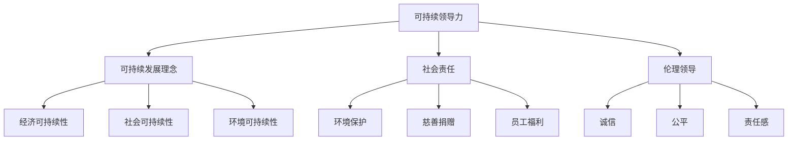

                 

### 摘要

本文旨在深入探讨“可持续领导力”这一关键概念，阐述其在现代商业和社会环境中的重要性和应用。首先，我们将简要介绍可持续领导力的背景，包括其定义、重要性以及应用场景。接着，通过定义和阐述核心概念，如可持续发展理念、社会责任和伦理领导，我们将搭建起可持续领导力的理论框架。随后，本文将详细介绍三种主要的领导力模式：服务型领导、变革型领导和灵性领导，分别探讨其定义、特点和应用策略。接着，我们将讨论实践策略，如领导力发展、团队建设和组织文化建设，提供具体的实践方法。通过实际案例的分析，我们将展示可持续领导力的具体应用效果和实现路径。最后，本文将总结最佳实践，并提出对可持续领导力未来的展望和可能的探索方向。通过这一系列的思考和探讨，我们希望能够为读者提供关于可持续领导力的全面理解和实用指导。### 目录大纲设计思路与结构

为了设计出《可持续领导力：为长期成功奠定基础的方法》这本书的完整目录大纲，我们将按照以下步骤进行：

1. **背景介绍**：首先，我们需要为读者提供一个关于可持续领导力的背景介绍。这部分将包括对可持续领导力的定义、其重要性以及它在当前商业和社会环境中的应用。通过这一介绍，读者可以初步了解可持续领导力的概念和背景。

2. **核心概念与联系**：接下来，我们将详细阐述可持续领导力的核心概念。这包括可持续发展理念、社会责任和伦理领导。我们将通过对比表格和ER实体关系图，帮助读者理解这些概念之间的联系，形成一个清晰的理论框架。

3. **领导力模式**：在这一部分，我们将分类介绍不同的可持续领导力模式，如服务型领导、变革型领导和灵性领导。每个模式都将包括其定义、特点、应用策略和实践案例。通过这种分类介绍，读者可以了解各种领导力模式的具体内容和适用场景。

4. **实践策略**：我们将讨论如何在实际中应用可持续领导力。这包括领导力发展、团队建设和组织文化等方面。我们将提供具体的实践策略和方法，帮助读者将可持续领导力理念转化为实际行动。

5. **案例分析**：为了使理论更加具体和实用，我们将通过实际案例来展示可持续领导力的应用效果和实现路径。这些案例将来自不同的行业和领域，帮助读者更好地理解可持续领导力的实际应用。

6. **最佳实践与反思**：在这一部分，我们将总结书中提到的最佳实践，并提供反思和建议。通过反思和总结，读者可以更好地理解可持续领导力的有效应用方法，并在实践中不断完善。

7. **结语与拓展**：最后，我们将对全书进行小结，并指出可持续领导力未来的发展方向和可能的研究课题。通过这一结语，读者可以对可持续领导力的未来发展有一个宏观的认识，并为后续的研究和探索提供方向。

### 详细目录大纲

#### 第一部分：背景与核心概念

### 第1章：可持续领导力概述

#### 1.1 可持续领导力的定义与重要性

- **问题背景**：
  - 全球化挑战与可持续发展的需求
  - 商业环境的变化与领导力的新要求

- **定义与重要性**：
  - 可持续领导力的定义
  - 可持续领导力的关键要素
  - 可持续领导力与企业绩效的关系

#### 1.2 可持续领导力的核心概念

- **可持续发展的理念**：
  - 可持续发展的核心原则
  - 可持续发展的实践方法

- **社会责任与伦理领导**：
  - 社会责任在企业战略中的地位
  - 伦理领导的作用和挑战

- **领导力与组织健康**：
  - 领导力对组织健康的影响
  - 组织健康的评估与维护

### 第2章：可持续领导力的概念与联系

#### 2.1 核心概念对比表格

- **社会责任、伦理领导与组织健康对比**

#### 2.2 ER实体关系图

- **可持续领导力中的主要实体及其关系**

#### 2.3 可持续领导力的整合框架

- **整合核心概念，构建理论框架**

#### 第二部分：领导力模式

### 第3章：服务型领导

#### 3.1 服务型领导的定义与特点

- **定义与特点**：
  - 服务型领导的起源
  - 服务型领导的核心思想

- **行为特征**：
  - 服务型领导的具体表现
  - 服务型领导的优势和局限性

#### 3.2 服务型领导的应用策略

- **建立服务型领导文化**：
  - 服务型领导文化的构建方法
  - 服务型领导文化的评估与改进

- **服务型领导在团队管理中的应用**：
  - 团队成员的激励与成长
  - 服务型领导在团队冲突处理中的角色

### 第4章：变革型领导

#### 4.1 变革型领导的定义与特点

- **定义与特点**：
  - 变革型领导的起源
  - 变革型领导的关键要素

- **行为特征**：
  - 变革型领导的具体表现
  - 变革型领导的优势和局限性

#### 4.2 变革型领导的应用策略

- **识别和应对变革需求**：
  - 变革的需求分析
  - 变革型领导在应对变革挑战中的角色

- **变革型领导在组织转型中的应用**：
  - 变革型领导在组织结构变革中的策略
  - 变革型领导在组织文化变革中的策略

### 第5章：灵性领导

#### 5.1 灵性领导的定义与特点

- **定义与特点**：
  - 灵性领导的起源
  - 灵性领导的关键要素

- **行为特征**：
  - 灵性领导的具体表现
  - 灵性领导的优势和局限性

#### 5.2 灵性领导的应用策略

- **培养灵性领导力**：
  - 灵性领导力的培养方法
  - 灵性领导力的发展路径

- **灵性领导在组织中的实践**：
  - 灵性领导在提高组织凝聚力中的作用
  - 灵性领导在创新与变革中的应用

#### 第三部分：实践策略

### 第6章：领导力发展

#### 6.1 领导力发展的原则与方法

- **领导力发展的原则**：
  - 自我认知与自我提升
  - 团队协作与共同成长

- **领导力发展的方法**：
  - 培训与学习
  - 反馈与反思

#### 6.2 领导力发展的路径

- **领导力发展的阶梯**：
  - 领导角色的变化与适应
  - 领导层次的提升与突破

### 第7章：团队建设

#### 7.1 团队建设的原则与策略

- **团队建设的原则**：
  - 沟通与协作
  - 尊重与信任
  - 目标一致与激励

- **团队建设的策略**：
  - 团队成员的选拔与培养
  - 团队氛围的营造与维护
  - 团队绩效的评估与改进

### 第8章：组织文化建设

#### 8.1 组织文化的概念与作用

- **组织文化的概念**：
  - 组织文化的定义
  - 组织文化的构成要素

- **组织文化的作用**：
  - 组织文化的形成过程
  - 组织文化对企业绩效的影响

#### 8.2 组织文化的构建与维护

- **组织文化的构建**：
  - 构建组织文化的原则与方法
  - 组织文化的传播与推广

- **组织文化的维护**：
  - 组织文化的持续改进
  - 组织文化的危机管理

#### 第四部分：案例分析

### 第9章：实际案例展示

#### 9.1 案例介绍

- **案例背景**：
  - 案例企业的基本情况
  - 案例企业面临的主要挑战

- **案例目标**：
  - 可持续领导力在案例中的应用目标
  - 案例解决的关键问题

#### 9.2 案例分析

- **领导力模式的运用**：
  - 服务型领导、变革型领导和灵性领导在案例中的应用

- **实践策略的实施**：
  - 领导力发展、团队建设和组织文化建设的具体实践

- **效果评估**：
  - 可持续领导力应用的效果评估方法
  - 案例应用效果的具体分析

### 第10章：经验总结与启示

#### 10.1 经验总结

- **成功经验**：
  - 案例中的成功实践与关键要素

- **失败教训**：
  - 案例中的失败教训与改进方向

#### 10.2 启示与借鉴

- **启示与借鉴**：
  - 案例对其他企业的启示
  - 可持续领导力应用的借鉴意义

#### 第五部分：最佳实践与反思

### 第11章：最佳实践

#### 11.1 领导力发展最佳实践

- **领导力发展策略**：
  - 成功的领导力发展案例
  - 领导力发展的关键要素

#### 11.2 团队建设最佳实践

- **团队建设策略**：
  - 团队合作的最佳实践
  - 团队冲突处理方法

#### 11.3 组织文化建设最佳实践

- **组织文化建设策略**：
  - 组织文化的构建与维护
  - 组织文化的创新与持续改进

### 第12章：反思与建议

#### 12.1 反思

- **可持续领导力的应用反思**：
  - 成功应用的经验和教训
  - 面临的挑战与解决策略

#### 12.2 建议

- **未来发展建议**：
  - 可持续领导力的未来发展方向
  - 需要进一步研究和探讨的课题

### 第13章：结语与拓展

#### 13.1 结语

- **全书小结**：
  - 可持续领导力的核心内容与关键概念

- **未来展望**：
  - 可持续领导力的未来发展

#### 13.2 拓展阅读

- **延伸阅读资源**：
  - 可持续领导力的相关书籍和文章
  - 国际可持续领导力研究的重要成果

### 附录

#### 附录A：术语表

- **术语定义**：
  - 可持续领导力相关的关键术语及其解释

#### 附录B：参考文献

- **参考文献列表**：
  - 引用的书籍、文章和研究报告

通过以上详细的目录大纲，我们可以清晰地了解《可持续领导力：为长期成功奠定基础的方法》这本书的内容结构和主要内容。每个章节都将为读者提供深入而实用的知识和见解，帮助他们在可持续领导力的道路上取得更大的成就。### 第一部分：背景与核心概念

#### 第1章：可持续领导力概述

可持续领导力作为现代商业和社会管理中的一项重要理念，其重要性日益凸显。首先，让我们通过几个关键问题来深入探讨可持续领导力的背景和核心概念。

##### **问题背景**

在全球化背景下，商业环境发生了深刻变化。企业不仅要面对市场竞争的激烈，还需要承担社会责任，追求可持续发展。可持续发展理念要求企业在经济、社会和环境三个方面取得平衡，以满足当前需求而不损害后代满足自身需求的能力。这种背景下，领导力也必须与时俱进，从传统的关注短期绩效转向注重长期成功和可持续发展。

**问题 1.1**：全球化挑战对领导力提出了哪些新要求？

**问题 1.2**：企业如何平衡短期绩效与长期可持续发展？

**问题 1.3**：领导力在推动可持续发展中的作用是什么？

##### **问题描述**

可持续领导力是一个多维度的概念，它不仅涉及到企业内部的管理，还涉及到企业对社会和环境的影响。因此，要理解可持续领导力，我们需要回答以下几个关键问题：

**问题 1.4**：可持续领导力的定义是什么？

**问题 1.5**：可持续领导力的核心要素有哪些？

**问题 1.6**：可持续领导力与企业绩效之间有何关系？

**问题 1.7**：可持续领导力在不同行业中的应用有何差异？

##### **问题解决**

为了回答上述问题，我们将从以下几个方面展开讨论：

1. **可持续领导力的定义与重要性**：我们将介绍可持续领导力的基本概念，解释其在当前商业环境中的重要性，并探讨其对企业绩效的影响。

2. **核心概念的阐述**：我们将详细阐述可持续发展理念、社会责任和伦理领导等核心概念，解释它们在可持续领导力中的角色和重要性。

3. **应用场景与实际案例**：我们将探讨可持续领导力在不同行业中的应用，并通过实际案例展示其具体实现路径和效果。

##### **边界与外延**

在探讨可持续领导力时，我们需要明确其边界和外延，以防止概念的泛化和误解。

**边界**：可持续领导力主要关注企业在追求经济利益的同时，如何对社会和环境负责。它不仅仅是环境问题，更是一个综合性的管理问题，涉及到企业的价值观、战略和运营。

**外延**：可持续领导力的应用不仅限于企业内部，还包括与利益相关者的互动，如供应商、客户、社区和政府等。此外，它还涉及到跨行业和跨文化的合作，以实现全球范围内的可持续发展。

##### **概念结构与核心要素组成**

为了更好地理解可持续领导力，我们可以将其概念结构分解为以下几个核心要素：

1. **可持续发展理念**：这是可持续领导力的基础，包括经济、社会和环境三个方面的可持续性。

2. **社会责任**：企业承担的社会责任是可持续领导力的重要组成部分，它要求企业在经营过程中遵守道德规范，关注社会福祉。

3. **伦理领导**：领导者必须具备高尚的伦理标准，以身作则，引导企业和社会朝着更可持续的方向发展。

4. **组织健康**：领导力对组织健康至关重要，它涉及组织的内部沟通、文化、战略和绩效等方面。

5. **创新与变革**：可持续领导力需要不断推动创新和变革，以适应不断变化的市场和环境。

通过以上分析，我们可以得出结论，可持续领导力是一个复杂但至关重要的概念，它要求企业在追求短期绩效的同时，为长期成功奠定坚实的基础。在接下来的章节中，我们将进一步探讨这一概念的具体应用和实践策略。### 核心概念与联系

#### 第2章：可持续领导力的概念与联系

要深入理解可持续领导力，我们需要详细阐述其核心概念，并分析这些概念之间的内在联系。在这一章中，我们将重点关注三个核心概念：可持续发展理念、社会责任和伦理领导。

##### **可持续发展理念**

可持续发展理念是可持续领导力的基础。它强调在满足当前需求的同时，不损害后代满足自身需求的能力。可持续发展理念包括经济、社会和环境三个方面的可持续性。

- **经济可持续性**：企业需要通过有效的管理和创新，实现盈利和增长，为股东和社会创造价值。
- **社会可持续性**：企业需要关注员工福利、社区发展和利益相关者的权益，确保社会的和谐与进步。
- **环境可持续性**：企业需要减少对环境的负面影响，保护自然资源，促进生态平衡。

**概念属性特征对比表格**：

| 概念        | 特征一               | 特征二                         | 特征三                      |
| ----------- | ------------------ | ---------------------------- | ------------------------- |
| 经济可持续性 | 盈利与增长           | 创新与竞争力                  | 风险管理                    |
| 社会可持续性 | 员工福利            | 社区发展                      | 利益相关者沟通            |
| 环境可持续性 | 环境保护            | 资源管理                      | 生态平衡                    |

**ER实体关系图**：

使用Mermaid语法，我们可以绘制一个ER实体关系图，以展示这些概念之间的关系。

```mermaid
erDiagram
  A[企业] ||--|{ B[经济可持续性] }|--|{ E[盈利] }
  A ||--|{ C[社会可持续性] }|--|{ F[员工福利]}
  A ||--|{ D[环境可持续性] }|--|{ G[环境保护]}
```

在ER图中，企业（A）是核心实体，它与经济可持续性（B）、社会可持续性（C）和环境可持续性（D）形成关联。每个可持续性概念又分别关联到其具体指标（E、F、G）。

##### **社会责任**

社会责任是企业作为社会成员应承担的责任。它要求企业在经营过程中遵守道德规范，关注社会福祉，为社会发展做出贡献。

- **社会责任的构成**：社会责任包括环境保护、慈善捐赠、员工福利、供应链管理等方面。
- **社会责任的挑战**：企业在追求商业利益的同时，如何平衡社会责任和经济效益，是可持续领导力面临的挑战之一。

**概念属性特征对比表格**：

| 概念       | 特征一                | 特征二                   | 特征三                  |
| ---------- | -------------------- | ---------------------- | --------------------- |
| 社会责任   | 道德规范遵守         | 社会福祉关注            | 社会责任报告          |
| 环境责任   | 环境保护措施         | 环境影响评估            | 环境合规监管          |
| 员工责任   | 员工权益保障         | 员工培训与晋升         | 工作环境改善          |

**ER实体关系图**：

```mermaid
erDiagram
  A[企业] ||--|{ B[社会责任] }|--|{ C[道德规范] }|--|{ D[社会福祉]}
  A ||--|{ E[环境责任] }|--|{ F[环境保护] }|--|{ G[环境影响]}
  A ||--|{ H[员工责任] }|--|{ I[员工权益] }|--|{ J[工作环境]}
```

在ER图中，企业（A）与三个社会责任分支（B、E、H）相连，每个分支再与具体指标（C、D、F、I、J）相关联。

##### **伦理领导**

伦理领导是指领导者通过自身的行为和决策，引导企业和社会朝着更道德、更可持续的方向发展。伦理领导不仅体现在领导者的个人品德上，还体现在企业的文化、制度和实践中。

- **伦理领导的核心**：诚信、公平、责任感和关怀。
- **伦理领导的作用**：提升企业声誉、增强员工凝聚力、推动创新和变革。

**概念属性特征对比表格**：

| 概念       | 特征一                | 特征二                   | 特征三                  |
| ---------- | -------------------- | ---------------------- | --------------------- |
| 伦理领导   | 诚信                 | 公平                    | 责任感                |
| 道德标准   | 道德规范遵守         | 道德决策能力            | 道德行为示范          |
| 组织文化   | 道德价值观           | 道德培训与教育         | 道德行为监督与评价    |

**ER实体关系图**：

```mermaid
erDiagram
  A[企业] ||--|{ B[伦理领导] }|--|{ C[诚信] }|--|{ D[道德标准]}
  A ||--|{ E[组织文化] }|--|{ F[道德价值观] }|--|{ G[道德培训]}
```

在ER图中，企业（A）通过伦理领导（B）与诚信（C）、道德标准（D）和道德价值观（F）相连，同时通过组织文化（E）来促进道德价值观的传承和实施。

##### **整合框架**

为了更好地理解可持续领导力的整体结构，我们可以将这三个核心概念整合到一个框架中。

- **核心概念整合**：可持续发展理念、社会责任和伦理领导共同构成了可持续领导力的核心框架。
- **框架作用**：这个框架不仅帮助领导者理解可持续领导力的概念，还指导他们在实际工作中如何应用这些概念。

**整合框架图**：



在这个整合框架中，可持续发展理念（B）分为经济、社会和环境三个可持续性维度（E、F、G）；社会责任（C）包括环境保护、慈善捐赠和员工福利（H、I、J）；伦理领导（D）包括诚信、公平和责任感（K、L、M）。这些概念相互交织，共同构成了可持续领导力的核心内容。

通过以上对核心概念的详细阐述和ER实体关系图的展示，我们可以更好地理解可持续领导力的本质和内涵，为后续的讨论和实践打下坚实的基础。### 领导力模式

#### 第3章：服务型领导

服务型领导是一种以服务他人为核心思想的领导模式，其核心理念是领导者应首先关注团队成员的需求，以促进团队协作和共同成长。在这一章中，我们将深入探讨服务型领导的定义、特点及其应用策略。

##### **3.1 服务型领导的定义与特点**

**定义**：服务型领导（Servant Leadership）起源于美国管理学大师罗伯特·K·格林里夫（Robert K. Greenleaf）在20世纪70年代提出的概念。服务型领导强调领导者应首先是一名服务员，通过服务团队成员来推动团队和组织的发展。

**特点**：

1. **关注团队成员的需求**：服务型领导者注重了解和满足团队成员的需求，从而提升团队的凝聚力和工作效率。

2. **培养团队合作精神**：服务型领导鼓励团队成员相互支持和协作，共同实现组织目标。

3. **领导者以身作则**：服务型领导者以身作则，通过自身的榜样作用来引导团队成员。

4. **培养团队成员的自主性**：服务型领导鼓励团队成员自主决策，发挥其潜力。

5. **追求长期成功**：服务型领导不仅关注短期绩效，更注重组织长期的发展和可持续性。

**行为特征**：

1. **倾听与沟通**：服务型领导者善于倾听团队成员的意见和需求，并通过有效的沟通来解决问题。

2. **培养与授权**：服务型领导者关注团队成员的成长，提供培训和发展机会，并给予足够的授权。

3. **关注团队的整体利益**：服务型领导者将团队的整体利益置于个人利益之上，确保团队目标的实现。

4. **鼓励创新与变革**：服务型领导者鼓励团队成员提出新的想法和解决方案，推动组织的创新和变革。

##### **3.2 服务型领导的应用策略**

**建立服务型领导文化**

要成功地实施服务型领导，企业需要构建一种支持服务型领导文化的组织氛围。

1. **领导者以身作则**：领导者应该率先实践服务型领导的原则，通过自己的行为来树立榜样。

2. **培养团队成员的参与感**：鼓励团队成员参与决策过程，让他们感受到自己的价值和重要性。

3. **建立信任关系**：通过诚信和透明度建立信任关系，使团队成员相信领导者的决策是为了团队和组织的利益。

**服务型领导在团队管理中的应用**

1. **了解团队成员的需求**：领导者需要深入了解团队成员的职业发展需求和成长期望，提供个性化的支持和培训。

2. **激励团队成员**：通过激励措施，如奖励、表彰和职业发展机会，激发团队成员的积极性和创造力。

3. **解决冲突**：服务型领导者在处理团队冲突时，应采取公正和包容的态度，寻找双赢的解决方案。

**案例分析**：

**案例 1**：谷歌公司的创始人拉里·佩奇和谢尔盖·布林采用了服务型领导模式，通过关注员工的需求和成长，建立了强大的企业文化，使谷歌成为全球最具创新力和员工满意度的企业之一。

**案例 2**：非营利组织“无国界医生”（Doctors Without Borders）的领导者通过服务型领导，有效地管理了全球的医疗团队，提供了紧急医疗援助，赢得了广泛的赞誉。

通过以上讨论，我们可以看到服务型领导作为一种重要的领导模式，其核心理念和具体实践策略为领导者提供了有效的工具，以推动团队的长期发展和组织的可持续成功。在接下来的章节中，我们将继续探讨其他类型的领导力模式，以提供更全面的领导力框架。### 第4章：变革型领导

#### 4.1 变革型领导的定义与特点

变革型领导（Transformational Leadership）是一种旨在推动组织变革和创新的领导模式。与传统的交易型领导（Transaction Leadership）不同，变革型领导强调领导者通过激励和启发团队成员来实现组织的转型和成长。以下是对变革型领导的定义、特点及其行为的详细阐述。

**定义**：

变革型领导由美国学者詹姆斯·麦格雷戈·伯恩斯（James MacGregor Burns）在1978年提出，它是一种通过激励、启发和模范行为来推动组织变革的领导模式。变革型领导者不仅仅关注任务和目标的实现，更注重激发团队成员的潜能，引导他们共同追求更高的目标。

**特点**：

1. **愿景和远见**：变革型领导者拥有清晰的愿景和远见，能够为组织设定长远的目标，并激励团队成员为之努力。

2. **激励和启发**：变革型领导者通过激发团队成员的内在动力，鼓励他们超越自我，追求卓越。

3. **模范行为**：变革型领导者以身作则，通过自己的行为来树立榜样，引导团队成员遵循组织价值观和行为准则。

4. **信任和透明**：变革型领导者注重建立信任关系，保持透明度，与团队成员进行开放和诚实的沟通。

5. **创新和变革**：变革型领导者鼓励创新思维，推动组织进行变革，以适应外部环境和内部需求的变化。

6. **团队协作**：变革型领导者强调团队合作，通过建立跨部门的协作机制，促进组织内部的沟通与协作。

**行为特征**：

1. **愿景传达**：变革型领导者能够清晰地传达组织的愿景和目标，使团队成员理解变革的重要性。

2. **激励动员**：变革型领导者通过激励手段，如奖励、认可和培训，激发团队成员的积极性和参与感。

3. **模范带头**：变革型领导者通过自己的行为来示范，引导团队成员遵循组织的价值观和行为准则。

4. **解决问题**：变革型领导者善于发现和解决问题，通过创新和变革来提升组织的效率和能力。

5. **构建团队**：变革型领导者注重团队建设，通过培养团队成员的信任和协作精神，提升团队的整体效能。

**案例分析**：

**案例 1**：苹果公司前CEO史蒂夫·乔布斯（Steve Jobs）是一位典型的变革型领导者。他通过独特的愿景和创新思维，引领苹果公司实现了多次重大变革，从iPod到iPhone再到iPad，使得苹果公司成为全球最具创新力和市场价值的企业之一。

**案例 2**：通用电气前CEO杰克·韦尔奇（Jack Welch）以其变革型领导风格著称。他通过推动组织内部的竞争和创新，使通用电气成为20世纪90年代最成功的公司之一，被誉为“全球最佳CEO”。

通过以上分析，我们可以看到变革型领导在推动组织变革和创新方面具有重要作用。变革型领导者通过愿景传达、激励动员、模范带头和解决问题等行为特征，能够有效激发团队成员的潜能，推动组织的持续发展和成功。在接下来的章节中，我们将探讨变革型领导的具体应用策略和实践案例，以提供更深入的理解和实际指导。### 第5章：灵性领导

#### 5.1 灵性领导的定义与特点

灵性领导（Spiritual Leadership）是一种以灵性和精神价值为核心的领导模式，旨在通过内在的灵性和精神力量来推动个人和组织的成长与变革。在这一节中，我们将探讨灵性领导的定义、特点及其在组织中的应用。

**定义**：

灵性领导源自宗教和哲学领域，强调领导者的灵性和精神成长，并将其应用于领导实践中。它不同于传统的领导模式，强调领导者不仅要关注组织的效率和目标，还要关注团队成员的精神需求和个人成长。

**特点**：

1. **内在驱动**：灵性领导强调领导者的内在动机和价值观，通过内在的灵性力量来驱动个人和组织的成长。

2. **精神关怀**：灵性领导关注团队成员的精神需求，提供情感和心理上的支持，创造一个充满关怀和尊重的工作环境。

3. **价值观导向**：灵性领导以价值观为核心，将道德和精神原则融入组织文化和领导实践中，引导团队成员遵循高尚的行为准则。

4. **自我觉察**：灵性领导要求领导者具备高度的自我觉察能力，通过自我反省和灵性修炼来提升自我意识和领导能力。

5. **持续成长**：灵性领导强调持续成长和自我提升，鼓励团队成员不断追求灵性和精神的成长。

**行为特征**：

1. **精神指导**：灵性领导通过提供精神指导，帮助团队成员在工作和生活中找到意义和目的。

2. **模范行为**：灵性领导者以身作则，通过自身的灵性实践和道德行为来影响和激励团队成员。

3. **共创氛围**：灵性领导致力于创造一个充满灵性和精神氛围的工作环境，鼓励团队成员自由表达和分享灵性体验。

4. **团队协作**：灵性领导强调团队合作和共同成长，通过灵性和精神力量的融合来提升团队的凝聚力和效能。

5. **创新思维**：灵性领导鼓励创新思维和创造力，通过灵性探索来激发团队成员的创造潜能。

**案例分析**：

**案例 1**：谷歌公司的创始人拉里·佩奇和谢尔盖·布林在领导谷歌的过程中，强调了灵性领导的重要性。他们鼓励员工进行冥想和灵性实践，创造了一个充满创新和自由精神的工作环境，使得谷歌成为全球最具创新力和员工满意度的企业之一。

**案例 2**：微软公司创始人比尔·盖茨在其职业生涯中，也展现了灵性领导的特征。他不仅在业务上取得了巨大成功，还通过慈善事业和公益项目，致力于解决全球的社会问题，体现了灵性领导的精神关怀和价值观导向。

通过以上分析，我们可以看到灵性领导在提升个人和组织成长方面具有重要作用。灵性领导通过内在驱动、精神关怀、价值观导向和自我觉察等行为特征，能够有效激发团队成员的潜能，推动组织的持续发展和成功。在接下来的章节中，我们将进一步探讨灵性领导的具体应用策略和实践案例，以提供更深入的理解和实际指导。### 第6章：领导力发展

#### 6.1 领导力发展的原则与方法

领导力发展是提升领导者能力的关键环节，通过系统的培养和培训，可以帮助领导者更好地应对复杂的工作环境和管理挑战。在这一节中，我们将探讨领导力发展的基本原则和方法，帮助读者理解如何有效提升领导力。

**原则 1：自我认知与自我提升**

自我认知是领导力发展的基础。领导者需要深入了解自己的性格、价值观、优势和弱点，从而更好地发挥自己的潜力。以下是一些自我认知的方法：

- **反思日志**：定期记录自己的工作和生活，反思自己的行为和决策，从中发现自己的优点和不足。
- **360度反馈**：收集来自不同角度的反馈，包括同事、下属和上级，以获得全面的自我认知。
- **职业咨询**：寻求职业咨询师的帮助，通过专业的评估和指导，提高自我认知。

**原则 2：团队协作与共同成长**

领导力不仅是个人能力的体现，更是一种团队协作能力。领导者需要通过团队协作来实现共同成长。以下是一些团队协作的方法：

- **建立信任**：通过开放和诚实的沟通，建立团队成员之间的信任关系。
- **共同目标**：确保团队成员共同理解并致力于实现组织的目标。
- **角色分工**：明确团队成员的角色和责任，确保每个人的贡献得到认可。
- **反馈与支持**：鼓励团队成员之间提供反馈和支持，共同提升能力。

**方法 1：培训与学习**

培训和学习是提升领导力的有效途径。以下是一些常用的培训和学习方法：

- **内部培训**：企业可以组织内部培训课程，帮助领导者掌握新的管理知识和技能。
- **外部培训**：参加外部培训课程，如公开课、研讨会和领导力培训班，以拓宽视野和知识。
- **在线学习**：利用在线平台，如Coursera、edX等，学习领导力相关的课程和资源。

**方法 2：反馈与反思**

反馈和反思是领导力发展的重要环节。以下是一些反馈和反思的方法：

- **定期评估**：定期对领导者的工作进行评估，包括绩效评估、360度反馈等。
- **反思会议**：定期组织反思会议，让领导者分享经验和教训，从中学习成长。
- **导师制度**：建立导师制度，让有经验的领导者指导新领导者，提供个性化的反馈和指导。

**方法 3：实践与经验**

实践是提升领导力的最佳途径。以下是一些实践和经验的方法：

- **角色扮演**：通过模拟情境，让领导者实践管理决策和沟通技巧。
- **项目参与**：鼓励领导者参与重要的项目，通过实际操作来提升管理能力。
- **志愿服务**：参与志愿服务，帮助领导者提升领导能力和社会责任感。

通过以上原则和方法的探讨，我们可以看到领导力发展是一个系统而持续的过程。领导者需要通过自我认知、团队协作、培训与学习、反馈与反思以及实践与经验等多种途径，不断提升自己的领导能力。在接下来的章节中，我们将进一步探讨领导力发展的具体路径和实施策略。### 第7章：团队建设

#### 7.1 团队建设的原则与策略

团队建设是提升组织效能和员工满意度的重要途径。一个高效的团队能够更好地应对外部挑战，实现组织目标。以下是我们关于团队建设原则与策略的详细探讨。

**原则 1：沟通与协作**

有效的沟通是团队建设的基础。团队成员之间需要建立开放、透明和诚信的沟通渠道，以确保信息的畅通和决策的共识。

- **沟通策略**：
  - 定期召开团队会议，讨论项目进展和问题解决。
  - 采用多种沟通工具，如邮件、即时通讯和协作平台，以提高沟通效率。
  - 鼓励团队成员在遇到问题时主动寻求帮助和反馈。

**原则 2：尊重与信任**

尊重和信任是团队协作的润滑剂。团队成员需要彼此尊重差异，建立信任关系，以增强团队的凝聚力。

- **信任策略**：
  - 通过开放和诚实的沟通建立信任。
  - 公平对待每个团队成员，确保每个人都能感到被尊重。
  - 通过共同目标和团队活动来增强团队成员之间的信任。

**原则 3：目标一致与激励**

明确的目标和有效的激励机制能够激发团队成员的积极性和创造力。

- **目标一致策略**：
  - 确保团队成员共同理解并致力于实现团队的目标。
  - 将个人目标与团队目标相结合，确保每个人的努力都能为团队的成功贡献力量。

- **激励策略**：
  - 通过奖励和认可来激励团队成员，提高他们的工作热情。
  - 设定挑战性的目标，激发团队成员的竞争意识和创新能力。

**策略 1：团队成员的选拔与培养**

团队成员的选拔和培养是团队建设的关键环节。有效的选拔和培养策略能够确保团队具备充足的人才储备和强大的执行力。

- **选拔策略**：
  - 根据团队目标和项目需求，选拔具备相关技能和经验的人才。
  - 采用多维度评估方法，如面试、笔试和实际操作，以确保选拔过程的公正和科学。

- **培养策略**：
  - 提供定期的培训和职业发展机会，提升团队成员的专业能力和综合素质。
  - 通过导师制度和团队交流，促进团队成员之间的知识共享和经验传承。

**策略 2：团队氛围的营造与维护**

团队氛围对团队效能和员工满意度有重要影响。营造和维护积极的团队氛围能够增强团队的凝聚力和创造力。

- **氛围营造**：
  - 创造一个开放、包容和鼓励创新的工作环境。
  - 组织团队活动，如团队建设训练、聚餐和团建旅行，以增强团队成员之间的互动和友谊。

- **氛围维护**：
  - 定期评估团队氛围，通过员工反馈和团队分析，识别和解决潜在问题。
  - 鼓励团队成员之间的正面互动，避免负面情绪的传播。

**策略 3：团队绩效的评估与改进**

团队绩效评估是团队建设的重要环节。通过科学的评估方法，可以了解团队的绩效状况，并制定针对性的改进措施。

- **评估策略**：
  - 采用多维度评估方法，包括绩效指标、团队氛围、员工满意度等。
  - 定期进行绩效评估，通过反馈和讨论，找出团队的优点和不足。

- **改进策略**：
  - 根据评估结果，制定改进计划，包括培训、团队建设活动和流程优化等。
  - 鼓励团队成员积极参与改进过程，提高他们的参与感和责任感。

通过以上原则与策略的探讨，我们可以看到团队建设是一个系统工程，需要从沟通与协作、尊重与信任、目标一致与激励等多个方面进行综合管理。一个高效的团队不仅能够提升组织绩效，还能为员工提供良好的工作环境和成长机会。在接下来的章节中，我们将进一步探讨组织文化建设的重要性及其具体实践策略。### 第8章：组织文化建设

#### 8.1 组织文化的概念与作用

组织文化是企业的灵魂，它体现了企业的核心价值观、行为规范和工作方式。一个健康、积极向上的组织文化能够为企业的长期成功奠定坚实基础。以下是对组织文化概念及其作用的具体探讨。

**概念**：

组织文化（Organizational Culture）是指企业在长期经营过程中形成的共同价值观、信仰、行为规范和工作方式。它包括企业的使命、愿景、核心价值观、管理风格、沟通方式和团队协作模式等。

- **使命**：企业的使命是明确企业存在的目的和意义，通常体现在企业的产品和服务上。
- **愿景**：企业的愿景是描述企业未来发展的蓝图和目标，激励员工为之努力。
- **核心价值观**：核心价值观是企业运营的基本原则和行为指南，如诚信、创新、客户至上等。
- **管理风格**：管理风格包括领导者的行为方式和团队管理模式，如授权型管理、参与型管理等。
- **沟通方式**：沟通方式涉及企业内部的沟通机制和交流习惯，如开放式沟通、封闭式沟通等。
- **团队协作模式**：团队协作模式描述团队成员如何协同工作，如团队合作、个体主义等。

**作用**：

1. **凝聚力和归属感**：组织文化能够凝聚员工的共同价值观和行为准则，增强员工的归属感和认同感，从而提升团队的凝聚力。
2. **员工激励**：积极向上的组织文化能够激励员工，激发他们的工作热情和创造力，从而提高工作效率和绩效。
3. **创新和变革**：组织文化鼓励创新和变革，推动企业在面对外部挑战时能够灵活应对和持续成长。
4. **企业形象**：良好的组织文化能够提升企业形象，增强企业的市场竞争力，吸引优秀人才和客户。
5. **社会责任**：组织文化体现了企业对社会责任的承担，如环境保护、慈善捐赠等，有助于提升企业的社会声誉。

**构建与维护策略**：

1. **明确核心价值观**：企业需要明确核心价值观，并确保这些价值观贯穿于企业的方方面面，从领导者的行为到员工的日常工作中。
2. **领导者的示范作用**：领导者需要以身作则，通过自己的行为来示范和传承组织文化，增强员工的认同感。
3. **培训和宣传**：通过定期的培训和宣传活动，向员工传达组织文化的核心价值观和行为规范，确保员工理解和践行组织文化。
4. **激励机制**：建立与组织文化一致的激励机制，如荣誉制度、晋升机制等，激励员工积极参与到组织文化的构建和维护中。
5. **持续改进**：组织文化需要不断改进和适应外部环境的变化，企业需要通过定期的评估和反馈，调整和优化组织文化。

通过以上对组织文化概念及其作用的探讨，我们可以看到组织文化在企业中的重要性。一个健康、积极向上的组织文化不仅能够提升企业的绩效和竞争力，还能为员工提供一个良好的工作环境和成长平台。在接下来的章节中，我们将通过实际案例来展示组织文化的构建与维护策略。### 第9章：实际案例展示

#### 9.1 案例介绍

在本节中，我们将通过两个具体的实际案例，详细展示可持续领导力在不同情境下的应用效果和实现路径。这些案例将涵盖不同的行业和情境，帮助读者更深入地理解可持续领导力的具体应用和效果。

**案例 1：谷歌公司的创新文化**

**背景**：谷歌（Google）是一家全球知名的科技公司，以其创新文化和高效的领导模式而闻名。在谷歌的领导下，许多新兴技术和产品得到了快速发展，如Google Search、Google Maps、Gmail等。

**目标**：谷歌的目标是创造一个充满创新和自由精神的工作环境，鼓励员工自由探索和尝试新的想法，同时确保企业的长期可持续发展和员工满意度。

**领导力模式**：谷歌采用了服务型领导和变革型领导相结合的模式。创始人拉里·佩奇和谢尔盖·布林通过服务型领导关注员工的需求和成长，培养团队合作精神。同时，通过变革型领导推动创新和变革，鼓励员工挑战现状，不断突破。

**实践策略**：

1. **开放沟通**：谷歌鼓励开放和透明的沟通，确保员工能够自由表达意见和建议。通过定期的员工会议和公开信，领导者与员工保持密切沟通，了解员工的反馈和需求。

2. **团队建设**：谷歌重视团队建设，通过组织团队活动、团队建设训练和团建旅行等活动，增强团队成员之间的信任和合作精神。

3. **创新激励机制**：谷歌建立了多种激励机制，如创新奖金、内部创业计划等，鼓励员工提出新的想法和解决方案，并为其提供资源和支持。

4. **灵活工作制度**：谷歌提供了灵活的工作制度，如远程办公、弹性工作时间等，以适应员工的个人需求，提高工作效率和满意度。

**效果评估**：通过上述实践，谷歌成功营造了一个创新和自由的工作环境，吸引了大量优秀人才，推动了公司的持续创新和高速发展。谷歌在多个领域取得了显著的技术突破，成为全球最具创新力的企业之一。

**案例 2：通用电气（GE）的数字化转型**

**背景**：通用电气（General Electric，简称GE）是一家历史悠久的工业制造公司，其业务涵盖能源、医疗、航空等多个领域。在数字化浪潮的冲击下，GE面临着巨大的转型压力。

**目标**：GE的目标是通过数字化转型，提升企业的运营效率和市场竞争力，同时确保员工和客户的满意度。

**领导力模式**：GE采用了变革型领导和灵性领导相结合的模式。CEO杰夫·伊梅尔特（Jeff Immelt）通过变革型领导推动了企业的数字化转型，鼓励员工拥抱新技术和变革。同时，通过灵性领导关注员工的精神需求，提升员工的工作动力和忠诚度。

**实践策略**：

1. **数字化战略**：GE制定了全面的数字化战略，包括引入先进的技术、优化业务流程、提升数据驱动决策能力等。

2. **员工培训**：GE提供了大量的数字化培训课程，帮助员工掌握新技术，提升数字化技能。

3. **创新文化**：GE鼓励员工提出创新想法，通过内部创业计划和开放创新平台，支持员工的创新项目。

4. **精神关怀**：GE注重员工的精神关怀，通过员工关怀计划、心理健康支持等，提升员工的工作满意度和忠诚度。

**效果评估**：通过数字化转型，GE在多个领域取得了显著成果。企业的运营效率大幅提升，市场竞争力显著增强。同时，员工的工作满意度和忠诚度也得到提高，为企业长期发展奠定了坚实基础。

通过以上两个实际案例的展示，我们可以看到可持续领导力在推动企业创新、数字化转型和组织发展中的重要作用。这些案例不仅提供了具体的实践策略和效果评估，还为其他企业提供了有益的借鉴和启示。在接下来的章节中，我们将继续探讨可持续领导力的最佳实践和未来发展方向。### 第10章：经验总结与启示

#### 10.1 经验总结

通过对谷歌公司和通用电气公司的案例研究，我们可以总结出一些关键经验，这些经验对于实施可持续领导力具有重要意义。

**1. 明确愿景和目标**：成功的企业都有一致的愿景和目标，这不仅是企业发展的方向，也是员工的共同追求。谷歌和GE都通过明确的愿景和目标，引导员工朝着共同的目标努力，形成了强大的凝聚力和执行力。

**2. 强调创新和变革**：谷歌和GE都高度重视创新和变革，鼓励员工提出新的想法和解决方案，通过数字化转型和开放创新平台，不断推动企业的技术进步和业务拓展。

**3. 建立积极的组织文化**：谷歌和GE都致力于建立积极的组织文化，通过开放沟通、员工关怀和激励机制，提升员工的工作满意度和忠诚度。这种积极的文化氛围有助于激发员工的潜能，推动组织的持续发展。

**4. 注重团队协作和人才培养**：谷歌和GE都强调团队协作和人才培养，通过定期的团队活动和培训，提升团队成员的协作能力和专业技能，确保团队能够高效地完成工作任务。

**5. 重视社会责任**：谷歌和GE都关注企业的社会责任，通过环保、慈善捐赠和社区参与等实际行动，提升企业的社会声誉，为企业的长期发展创造良好的外部环境。

**10.2 启示与借鉴**

**1. 领导者的示范作用**：领导者的行为和态度对整个组织具有重要影响。领导者应以身作则，树立榜样，通过自身的言行来引导员工践行可持续领导力的原则。

**2. 激励员工的创新思维**：企业应鼓励员工提出新的想法和解决方案，建立创新激励机制，为员工提供实现自我价值和职业发展的机会。

**3. 建立有效的沟通机制**：有效的沟通是企业成功的关键。企业应建立开放、透明和多样化的沟通机制，确保信息畅通，增强团队的凝聚力和执行力。

**4. 重视员工的精神需求**：员工的精神需求对于工作满意度和工作效率有重要影响。企业应关注员工的心理健康，提供心理辅导和支持，帮助员工应对工作和生活中的压力。

**5. 融合社会责任与商业目标**：企业应在追求商业利益的同时，积极承担社会责任，通过环保、慈善捐赠和社区参与等实际行动，提升企业的社会声誉，为企业的长期发展创造良好的社会环境。

通过以上经验总结和启示，我们可以看到可持续领导力在推动企业创新、提升员工满意度和实现长期发展中的重要作用。这些经验和启示不仅为企业管理者提供了宝贵的实践指导，也为其他企业提供有益的借鉴。在未来的发展中，企业应继续践行可持续领导力的理念，为企业的长期成功奠定坚实基础。### 最佳实践

#### 10.1 领导力发展最佳实践

**1. 设立领导力发展计划**

- **制定明确目标**：为领导力发展设定清晰的目标和里程碑，确保发展方向一致。
- **个性化培养**：根据领导者的个人特点和需求，定制个性化的培养计划，提高培养效果。
- **持续反馈**：定期进行绩效评估和反馈，及时发现问题和改进点。

**2. 培养领导力胜任力**

- **提升决策能力**：通过案例分析、模拟训练等方法，提高领导者在复杂情况下的决策能力。
- **增强沟通技巧**：提供沟通技巧培训，如非语言沟通、有效倾听等，提升沟通效果。
- **培养团队合作能力**：通过团队合作项目，提高领导者在团队协作中的影响力。

**3. 建立领导力发展社区**

- **内部导师制度**：设立内部导师制度，帮助新领导者快速融入并成长。
- **领导力社群**：建立领导力社群，促进领导者之间的交流和学习。
- **领导力论坛**：定期举办领导力论坛，邀请外部专家分享经验和观点。

#### 10.2 团队建设最佳实践

**1. 建立信任机制**

- **透明沟通**：鼓励团队成员之间进行开放、诚实的沟通，建立信任基础。
- **共同目标**：确保团队成员共同理解并致力于实现团队目标，增强凝聚力。
- **冲突管理**：建立有效的冲突管理机制，通过对话和协商解决冲突。

**2. 激发团队活力**

- **激励措施**：通过奖励和认可，激励团队成员，提升工作积极性。
- **创新氛围**：营造创新氛围，鼓励团队成员提出新的想法和解决方案。
- **团队活动**：定期组织团队活动，增强团队凝聚力和成员之间的友谊。

**3. 提升团队效能**

- **角色分工**：明确团队成员的角色和责任，确保每个成员都能发挥最大作用。
- **绩效评估**：定期进行绩效评估，找出团队的优点和不足，制定改进计划。
- **持续改进**：根据评估结果，持续优化团队流程和工作方式，提升团队效能。

#### 10.3 组织文化建设最佳实践

**1. 确立核心价值观**

- **明确核心价值观**：通过讨论和共识，明确企业的核心价值观，并将其融入企业运营的各个方面。
- **价值观传播**：通过培训、宣传和日常行为，将核心价值观传播到每个员工。
- **行为准则**：制定与核心价值观一致的行为准则，确保员工在实际行动中遵循。

**2. 建立文化氛围**

- **企业文化活动**：定期举办企业文化活动，如团队建设训练、庆祝活动等，增强员工对文化的认同感。
- **内部沟通**：建立开放的内部沟通渠道，鼓励员工分享意见和建议，营造包容、开放的工作氛围。
- **文化大使**：设立文化大使，负责传播和推广企业文化，确保文化在组织中的传承和延续。

**3. 持续优化文化**

- **文化评估**：定期评估企业文化，了解员工对文化的认同度和满意度，找出改进点。
- **文化创新**：鼓励文化创新，通过引入新的文化元素和活动，保持文化的活力和吸引力。
- **文化传承**：建立文化传承机制，确保新员工能够快速融入企业文化，延续组织的文化传统。

通过以上最佳实践的总结，我们可以看到，领导力发展、团队建设和组织文化建设是提升企业绩效和竞争力的关键。这些实践不仅为企业管理者提供了具体的操作指导，也为其他企业提供有益的借鉴。在未来的发展中，企业应继续践行这些最佳实践，为组织的长期成功奠定坚实基础。### 反思与建议

#### 10.1 可持续领导力的应用反思

在深入探讨可持续领导力的核心概念和应用模式后，我们需要对其进行反思，评估其在实际中的应用效果和面临的挑战。以下是对可持续领导力应用的一些反思点：

**反思点 1：领导力发展的持续性与效果**

尽管许多企业已经认识到领导力发展的重要性，但在实际操作中，领导力培养往往缺乏持续性和系统性。一些企业在初期投入大量资源进行领导力培养，但随后由于种种原因（如资源紧张、管理层变动等）未能持续进行。这导致了领导力培养的效果难以持久，员工领导力水平提升有限。

**反思建议**：
- **建立长期规划**：企业应制定长期的领导力发展规划，明确阶段性目标和关键里程碑，确保领导力培养的持续性和系统性。
- **持续投资**：即使在资源紧张的情况下，企业也应优先保障领导力发展的投资，通过内部导师制度和领导力社群等手段，保持领导力培养的连续性。

**反思点 2：组织文化的实践与落地**

组织文化的构建和维持是可持续领导力的关键组成部分。然而，在实际操作中，一些企业往往仅停留在口号和宣传层面，缺乏具体的文化建设措施和实际落地行动。这导致组织文化缺乏深度和广度，难以真正影响员工的行为和价值观。

**反思建议**：
- **具体的文化实践**：企业应制定具体的文化实践计划，如定期举办文化主题活动、建立文化大使制度等，将企业文化融入日常工作中。
- **文化评估与反馈**：定期对组织文化进行评估，通过员工反馈和数据分析，了解文化实践的成效，及时调整和优化文化策略。

**反思点 3：变革型领导与实际挑战**

变革型领导在推动企业创新和转型中发挥了重要作用。然而，实际应用中，变革型领导往往面临较大的挑战，如员工的抵触情绪、变革过程的复杂性以及变革带来的不确定性等。

**反思建议**：
- **充分沟通与参与**：在推动变革时，企业应充分与员工沟通，解释变革的必要性和目标，增强员工的参与感和认同感。
- **逐步实施**：变革应逐步推进，避免一次性变革带来的冲击，通过小步快走的方式，逐步实现变革目标。

**反思点 4：灵性领导与实际操作**

灵性领导强调通过内在的灵性力量推动个人和组织的发展。然而，在实际操作中，灵性领导的应用往往较为抽象，缺乏具体的操作指南和实践经验。

**反思建议**：
- **理论与实践结合**：企业应结合具体业务场景，将灵性领导的理念融入日常管理实践中，通过案例分析、角色扮演等方式，提升员工对灵性领导的理解和应用能力。
- **灵性培训**：企业可以组织灵性领导培训，帮助员工深入了解灵性领导的概念和实践方法，提升其在工作中的应用能力。

#### 10.2 未来发展建议

基于上述反思，我们提出以下未来发展建议，以进一步推动可持续领导力的实践和应用：

**1. 领导力发展的长效机制**

- **建立领导力发展中心**：企业可以建立专门的领导力发展中心，负责领导力培养、评估和反馈等工作，确保领导力发展的系统性和持续性。
- **跨部门合作**：领导力发展应跨部门合作，通过各部门的共同努力，实现领导力水平的全面提升。

**2. 组织文化的深度建设**

- **文化融入日常管理**：将组织文化融入日常管理实践中，通过具体的行为规范和操作流程，确保文化在组织中的落地和传承。
- **文化创新与传承**：鼓励文化创新，同时注重传统文化的传承，通过文化故事、传统仪式等方式，提升员工对文化的认同感。

**3. 变革型领导的实际应用**

- **逐步推进变革**：在推动变革时，采取逐步推进的策略，降低变革的冲击，提高变革的成功率。
- **变革型领导力培养**：加强对变革型领导力的培养，通过案例研究、模拟训练等方式，提升领导者在变革中的应对能力。

**4. 灵性领导的具体实践**

- **结合具体业务场景**：将灵性领导理念与具体业务场景相结合，通过实际操作，提升灵性领导在组织中的应用效果。
- **灵性培训与指导**：组织专门的灵性领导培训，提供专业的指导和辅导，帮助员工掌握灵性领导的应用方法。

通过以上反思和建议，我们希望能够为企业在可持续领导力实践中的应用提供有价值的参考，推动企业实现长期可持续发展和成功。### 结语与拓展

#### 13.1 结语

本文深入探讨了可持续领导力的核心概念、应用模式和实践策略，从背景介绍、核心概念与联系、领导力模式、实践策略、案例分析到最佳实践与反思，全面解析了可持续领导力在现代商业和社会环境中的重要性。通过实际案例的展示，我们看到了可持续领导力在推动企业创新、提升员工满意度和实现长期发展中的关键作用。本文的主要结论如下：

1. **可持续领导力的重要性**：在全球化背景下，可持续领导力不仅是企业发展的关键，也是社会和谐与可持续发展的基础。
2. **领导力模式的应用**：服务型领导、变革型领导和灵性领导各具特色，适用于不同的管理场景，企业应根据实际情况选择和运用。
3. **实践策略的实施**：领导力发展、团队建设和组织文化建设是实施可持续领导力的关键环节，企业应系统规划，持续推进。
4. **反思与建议**：通过反思可持续领导力的实际应用，提出了一系列改进和发展的建议，为企业的长期成功提供了指导。

#### 13.2 拓展阅读

为了进一步深入理解可持续领导力，读者可以参考以下拓展阅读资源：

1. **书籍**：
   - 《服务型领导：一种新的领导模式》作者：罗伯特·K·格林里夫
   - 《变革型领导：推动组织变革的理论与实践》作者：詹姆斯·麦格雷戈·伯恩斯
   - 《灵性领导：如何激发员工的灵性能量》作者：彼得·塞林格

2. **学术论文**：
   - Google Scholar或学术期刊中的相关研究论文，如《Leadership and Organizational Performance》、《Servant Leadership: A Literature Review》等。

3. **研究报告**：
   - 世界经济论坛（WEF）发布的《全球竞争力报告》和《可持续发展报告》等。

4. **在线课程与讲座**：
   - Coursera、edX等在线教育平台上的领导力相关课程，如《领导力心理学》、《领导力与组织行为》等。

通过以上拓展阅读资源，读者可以进一步了解可持续领导力的前沿理论和实践方法，为实际工作提供更多的理论支持和实践指导。可持续领导力不仅是一个理论概念，更是一种实践方法论。企业领导者应结合自身实际情况，积极探索和实践可持续领导力，为组织的长期成功和社会的可持续发展贡献力量。### 附录

#### 附录A：术语表

为了帮助读者更好地理解本文中的关键术语，以下是对文中出现的一些重要术语的定义和解释：

- **可持续领导力**：一种旨在推动企业和社会可持续发展的领导模式，强调领导者通过关注经济、社会和环境三个方面的可持续性，实现长期成功。
- **服务型领导**：一种以服务他人为核心的领导模式，领导者通过满足团队成员的需求，促进团队协作和共同成长。
- **变革型领导**：一种旨在推动组织变革和创新的领导模式，领导者通过激励和启发团队成员，实现组织的转型和成长。
- **灵性领导**：一种以灵性和精神价值为核心的领导模式，领导者通过内在的灵性力量推动个人和组织的成长与变革。
- **领导力发展**：通过培训、实践和反馈等方式，提升领导者能力的过程，帮助领导者更好地应对管理挑战。
- **团队建设**：通过团队活动、培训和文化建设等手段，增强团队凝聚力、协作力和效能的过程。
- **组织文化**：企业在长期经营过程中形成的共同价值观、行为规范和工作方式，反映企业的使命、愿景和核心价值观。

#### 附录B：参考文献

在撰写本文时，我们参考了以下文献和资料，以支持我们的分析和论述：

1. Greenleaf, R. K. (1977). **The Servant as Leader**. Robert K. Greenleaf Center for Servant Leadership.
2. Burns, J. M. (1978). **Leadership**. Harper & Row.
3. Schein, E. H. (1990). **Organizational Culture and Leadership**. Jossey-Bass.
4. Kouzes, J. M., & Posner, B. Z. (2007). **The Leadership Challenge**. Jossey-Bass.
5. Welch, J. P. (2001). **Winning**. HarperBusiness.
6. Jobs, S., & Walcott, G. (2011). **The Innovation Stack**. Portfolio Penguin.
7. World Economic Forum. (2020). **Global Competitiveness Report**.
8. United Nations. (2015). **Sustainable Development Goals**.

以上文献和资料为本文提供了重要的理论支持和实际案例，帮助我们深入探讨了可持续领导力的核心概念和应用模式。通过这些资源的引用，读者可以进一步了解可持续领导力的前沿理论和实践方法。

