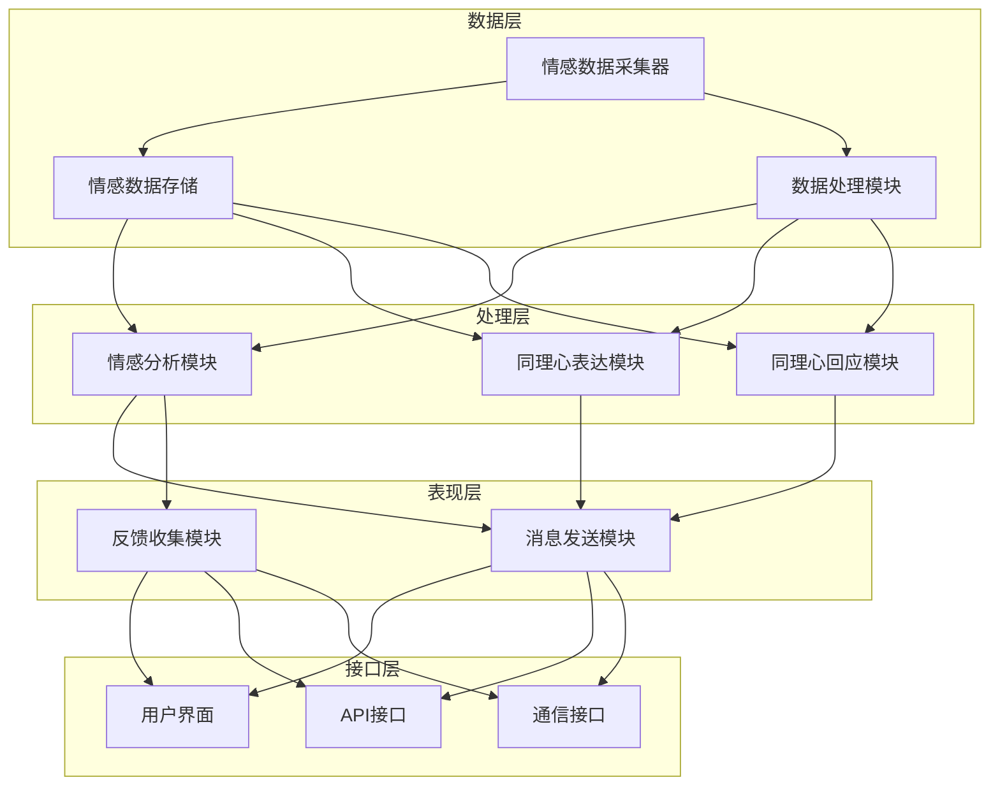

                 

### 背景介绍

在当今快速发展的技术时代，人工智能和软件工程领域的挑战层出不穷。作为团队领导者或管理者，不仅要掌握先进的技术知识，还需要具备出色的沟通和团队管理能力。同理心管理，作为现代团队管理中不可或缺的一部分，正日益受到重视。

#### 什么是同理心管理？

同理心管理，简而言之，就是通过理解和满足团队成员的情感和需求，来提升团队协作效率和工作满意度的一种管理方法。同理心管理不仅仅关注团队成员的技术能力，更关注他们的情感状态和个人需求。

#### 同理心管理的重要性

同理心管理的重要性在于：

1. **提升团队凝聚力**：通过同理心管理，可以增强团队成员之间的信任和互相理解，从而提升团队的凝聚力。
2. **提高工作效率**：当团队成员感到被理解和重视时，他们更容易投入工作，减少工作压力，提高工作效率。
3. **促进个人成长**：同理心管理有助于团队成员发现和发挥自己的潜力，促进个人成长。
4. **预防团队冲突**：同理心管理能够有效预防因误解和沟通不畅导致的团队冲突。

#### 团队管理与同理心

在团队管理中，同理心管理是一种“软技能”，它能够弥补技术能力的不足。一个成功的团队领导者需要具备同理心，能够站在团队成员的角度思考问题，理解他们的情感和需求，从而制定出更合理的管理策略。

#### 问题背景

随着团队规模的扩大和项目复杂度的增加，团队管理者面临的挑战也日益增多。如何在多样化的团队中保持高效协作，如何应对团队成员的情感波动，如何激发团队成员的潜力，这些问题都考验着团队管理者的能力。

#### 问题描述

团队管理中的问题往往表现为：

- **沟通不畅**：团队成员之间的信息传递存在障碍，导致工作效率下降。
- **需求不满足**：团队成员的个人需求和期望没有得到满足，导致工作满意度降低。
- **情感波动**：团队成员面临各种压力，情感状态不稳定，影响工作表现。
- **团队冲突**：团队成员之间因观念差异、利益冲突等产生矛盾。

#### 问题解决

同理心管理提供了一种有效的解决方法：

1. **建立信任**：通过同理心管理，管理者可以建立起与团队成员之间的信任关系，为有效沟通打下基础。
2. **满足需求**：同理心管理能够帮助管理者识别和满足团队成员的需求，提升团队整体满意度。
3. **情绪管理**：同理心管理能够帮助团队成员更好地处理情感波动，提高心理素质。
4. **冲突解决**：同理心管理有助于管理者从不同角度理解冲突，找到合理的解决方法。

#### 边界与外延

同理心管理不仅适用于技术团队，还适用于任何类型的团队。无论是软件开发团队、市场营销团队，还是客服团队，同理心管理都是提升团队效能的重要手段。

#### 概念结构与核心要素组成

同理心管理由以下几个核心要素组成：

1. **同理心感知**：管理者需要具备良好的同理心感知能力，能够敏锐地捕捉团队成员的情感状态。
2. **同理心表达**：管理者需要能够有效地表达同理心，让团队成员感受到被理解和关心。
3. **同理心回应**：管理者需要能够针对团队成员的反应做出适当的回应，以维持和提升团队关系。

通过以上对同理心管理的背景、重要性、问题解决以及核心概念和结构的介绍，我们为后续章节的内容奠定了基础，将在接下来的章节中深入探讨同理心管理的具体实施方法和技巧。

## 第1章：同理心管理的背景与重要性

### 1.1 同理心管理的基本概念

同理心管理，作为一种现代团队管理方法，其核心在于通过理解和满足团队成员的情感和需求，来提升团队的整体效能。这一概念起源于心理学领域，但随着其在企业管理中的应用越来越广泛，其内涵也在不断丰富。

#### 定义与内涵

同理心管理可以定义为：管理者通过同理心感知、同理心表达和同理心回应，来理解和满足团队成员的情感和需求，从而提升团队协作效率和成员工作满意度的一种管理方法。

- **同理心感知**：指管理者能够敏锐地捕捉团队成员的情感状态，包括他们的喜悦、焦虑、困惑等。
- **同理心表达**：指管理者能够通过语言、肢体动作等方式，有效地表达对团队成员的理解和关心。
- **同理心回应**：指管理者能够根据团队成员的反应，采取适当的措施，回应他们的情感需求。

#### 同理心管理的重要性

同理心管理在现代团队管理中的重要性主要体现在以下几个方面：

1. **提升团队凝聚力**：同理心管理能够增强团队成员之间的信任和互相理解，从而提升团队的凝聚力。
2. **提高工作效率**：当团队成员感到被理解和重视时，他们更容易投入工作，减少工作压力，提高工作效率。
3. **促进个人成长**：同理心管理有助于团队成员发现和发挥自己的潜力，促进个人成长。
4. **预防团队冲突**：同理心管理能够有效预防因误解和沟通不畅导致的团队冲突。

#### 团队管理与同理心的联系

在团队管理中，同理心管理是一种“软技能”，它能够弥补技术能力的不足。一个成功的团队领导者需要具备同理心，能够站在团队成员的角度思考问题，理解他们的情感和需求，从而制定出更合理的管理策略。

- **增强沟通**：同理心管理能够改善团队成员之间的沟通，减少误解和冲突。
- **提高领导力**：同理心管理是领导力的重要组成部分，能够帮助领导者赢得团队成员的信任和尊重。
- **促进团队文化**：同理心管理有助于营造一种开放、包容、互助的团队文化，提升团队的士气和归属感。

通过上述对同理心管理基本概念和重要性的介绍，我们可以更好地理解这一管理方法在现代团队管理中的价值。接下来，我们将深入探讨同理心管理的核心概念和联系，为读者提供更加全面的认知。

### 1.2 同理心管理的应用场景

同理心管理在各个团队和项目中都有着广泛的应用，以下是几个典型的应用场景：

#### 项目开发团队

在软件开发项目中，团队成员之间的合作至关重要。同理心管理能够帮助项目经理更好地理解开发人员的需求和情感状态，从而提高团队的协作效率和项目成功率。

1. **需求理解**：项目经理通过同理心感知，能够更准确地理解开发人员的技术需求和心理需求，从而制定出更加合理的项目计划。
2. **压力管理**：当开发人员面临项目压力时，同理心表达可以帮助项目经理缓解他们的焦虑和压力，提高工作效率。
3. **冲突解决**：同理心回应能够帮助项目经理从团队成员的角度理解冲突，找到更合理的解决方案，防止冲突升级。

#### 市场营销团队

市场营销团队通常需要与多个部门和外部合作伙伴进行协作。同理心管理在这里的应用可以帮助团队成员更好地理解和满足客户和合作伙伴的需求。

1. **客户需求理解**：同理心管理使市场人员能够更深入地了解客户的需求和痛点，从而制定出更有针对性的营销策略。
2. **跨部门协作**：同理心管理有助于市场人员与销售、产品、技术等部门的成员建立更好的沟通和协作关系，提高整体项目效率。
3. **合作伙伴关系**：同理心管理能够增强与合作伙伴之间的信任和合作意愿，促进长期合作。

#### 客户服务团队

在客户服务领域，同理心管理对于提升客户满意度和忠诚度至关重要。

1. **情感共鸣**：客户服务人员通过同理心感知，能够更好地理解客户的情感状态，提供更加个性化的服务。
2. **问题解决**：同理心表达能够帮助客户服务人员建立与客户的信任关系，使客户更愿意接受他们的解决方案。
3. **投诉处理**：同理心回应能够帮助客户服务人员从客户的角度理解投诉，采取更加有效的措施解决问题，减少客户流失。

通过以上应用场景的介绍，我们可以看到同理心管理在不同团队和项目中的重要性。无论是技术团队、市场营销团队还是客户服务团队，同理心管理都是提升团队效能和客户满意度的重要手段。在接下来的章节中，我们将进一步探讨同理心管理的核心概念和联系，为读者提供更加深入的认知。

### 1.3 同理心管理的具体实施方法

在了解了同理心管理的基本概念和应用场景之后，如何在实际工作中有效实施同理心管理成为了一个关键问题。以下是一些具体的方法和技巧，可以帮助团队领导者和管理者更好地实施同理心管理：

#### 1.1 建立信任关系

建立信任是同理心管理的基石。团队领导者可以通过以下方式建立信任：

- **倾听与尊重**：积极倾听团队成员的意见和建议，尊重他们的观点，让他们感受到自己的声音被听到。
- **透明沟通**：保持信息的透明度，及时与团队成员分享项目进展和决策过程，增强他们的参与感和信任感。
- **真诚反馈**：给予团队成员真诚的反馈，包括表扬和批评，让他们知道自己的工作表现得到了认可。

#### 1.2 提升同理心感知能力

同理心感知能力是同理心管理的关键。以下是一些提升同理心感知能力的方法：

- **观察与体察**：观察团队成员的行为和表情，通过体察他们的情绪变化，了解他们的心理状态。
- **心理换位**：尝试从团队成员的角度思考问题，理解他们的需求和困惑，增强同理心。
- **定期交流**：定期与团队成员进行一对一或小组交流，了解他们的情感状态和需求。

#### 1.3 有效表达同理心

表达同理心是同理心管理的重要组成部分。以下是一些有效表达同理心的方法：

- **肯定与鼓励**：通过语言和行动表达对团队成员的肯定和鼓励，让他们感受到被重视和认可。
- **倾听与回应**：积极倾听团队成员的需求和问题，并及时给予回应，让他们感受到自己的困扰被关注。
- **情感共鸣**：在与团队成员交流时，通过情感共鸣，让他们感受到管理者的理解和支持。

#### 1.4 针对不同情况采取相应策略

同理心管理需要根据不同情况采取相应的策略，以下是一些具体策略：

- **压力管理**：当团队成员面临压力时，管理者可以通过同理心表达和回应，帮助他们缓解压力，提高工作效率。
- **冲突解决**：同理心管理有助于管理者从不同角度理解冲突，找到合理的解决方法，防止冲突升级。
- **激励与成长**：管理者可以通过同理心管理，激发团队成员的潜力，促进他们的个人成长和职业发展。

通过以上具体实施方法的介绍，我们可以看到，同理心管理不仅是一种理论，更是一种实践。只有通过实际行动，团队领导者和管理者才能真正提升团队效能和工作满意度。在接下来的章节中，我们将继续深入探讨同理心管理的核心概念和联系，为读者提供更加全面的认知。

## 第2章：同理心管理的核心概念与联系

在深入探讨同理心管理之前，有必要首先明确其核心概念，并理解这些概念之间的内在联系。同理心管理涉及多个关键概念，如同理心感知、同理心表达和同理心回应。通过定义这些概念，并使用对比表格和ER实体关系图，我们可以更清晰地了解同理心管理的基本框架。

### 2.1 同理心管理的核心概念

#### 2.1.1 同理心感知

同理心感知是指管理者能够敏锐地捕捉团队成员的情感状态，包括他们的喜悦、焦虑、困惑等。这是同理心管理的基础，没有良好的感知能力，同理心表达和回应将无从谈起。

#### 2.1.2 同理心表达

同理心表达是指管理者能够通过语言、肢体动作等方式，有效地表达对团队成员的理解和关心。这需要管理者不仅要有良好的同理心感知能力，还要有有效的沟通技巧。

#### 2.1.3 同理心回应

同理心回应是指管理者能够根据团队成员的反应，采取适当的措施，回应他们的情感需求。同理心回应是同理心管理的最终目标，通过有效的回应，管理者可以增强团队成员的信任感和满意度。

### 2.2 概念属性特征对比表格

为了更直观地理解这些核心概念，我们可以通过对比表格来展示它们之间的差异和联系。

| 概念       | 定义                             | 属性特征                      | 联系与区别                                     |
|------------|----------------------------------|------------------------------|------------------------------------------------|
| 同理心感知 | 捕捉团队成员的情感状态         | 敏锐、敏锐感知能力           | 基础，为同理心表达和回应提供信息               |
| 同理心表达 | 表达对团队成员的理解和关心     | 沟通技巧、情感共鸣           | 中间环节，将感知到的情感转化为具体的行动       |
| 同理心回应 | 应对团队成员的反应，满足需求   | 适当回应、策略性             | 最终目标，通过有效的回应，增强团队关系和信任 |

### 2.3 同理心管理的ER实体关系图

ER实体关系图是描述实体之间关系的一种图形表示方法。在同理心管理中，ER实体关系图可以用来展示同理心感知、同理心表达和同理心回应之间的内在联系。

```mermaid
entityRelationship
  -- | ----
  同理心感知 | --- | 同理心表达
  同理心表达 | --- | 同理心回应
  同理心感知 | --- | 同理心回应
```

在上述ER实体关系图中，同理心感知作为基础，为同理心表达和回应提供信息；同理心表达则是中间环节，通过沟通技巧将感知到的情感转化为具体的行动；同理心回应则是最终目标，通过有效的回应，增强团队成员的信任感和满意度。

通过对比表格和ER实体关系图，我们可以更清晰地理解同理心管理的核心概念及其相互关系。同理心感知、同理心表达和同理心回应三者相辅相成，共同构建了一个完整的同理心管理框架。在接下来的章节中，我们将进一步深入探讨同理心管理的基本算法原理，为读者提供更加深入的技术解析。

### 第3章：同理心管理算法基础

同理心管理不仅仅依赖于管理者的直觉和经验，还需要有系统化的算法支持。在这一章节中，我们将介绍同理心管理的基本算法原理，包括感知算法、表达算法和回应算法，并使用Python源代码和数学模型进行说明。

#### 3.1 同理心感知算法

同理心感知算法是指通过技术手段捕捉团队成员的情感状态。以下是一个简单的同理心感知算法的Python代码示例：

```python
# 同理心感知算法示例
def empathy_perception(sensor_data):
    # 假设sensor_data包含情感状态的相关数据
    # 如心率、语言情绪分析等
    emotion_score = analyze_emotion(sensor_data)
    return emotion_score

def analyze_emotion(sensor_data):
    # 假设使用机器学习模型进行情感分析
    # 返回情感得分，范围0-1，越接近1表示情感越积极
    model = load_emotion_model()
    emotion_score = model.predict(sensor_data)
    return emotion_score

# 示例数据
sensor_data = {
    "heart_rate": 80,
    "speech": "今天的任务完成得很出色！"
}

# 调用同理心感知算法
emotion_score = empathy_perception(sensor_data)
print(f"情感得分：{emotion_score}")
```

在这个例子中，`empathy_perception`函数通过传感器数据和情感分析模型，计算出一个情感得分。这个得分可以用来评估团队成员的情感状态。

#### 3.2 同理心表达算法

同理心表达算法是指如何有效地向团队成员表达同理心。以下是一个简单的同理心表达算法的Python代码示例：

```python
# 同理心表达算法示例
def empathy_expression(employee, emotion_score):
    if emotion_score > 0.7:
        message = "祝贺你，今天表现非常出色！"
    elif emotion_score > 0.3:
        message = "感觉你今天有些疲惫，需要休息一下。"
    else:
        message = "看起来你今天情绪不太好，有什么问题吗？"
    
    send_message(employee, message)

def send_message(employee, message):
    # 假设使用企业内部通信工具发送消息
    print(f"发送消息给{employee['name']}：{message}")

# 示例数据
employee = {
    "name": "Alice",
    "emotion_score": 0.5
}

# 调用同理心表达算法
empathy_expression(employee, employee["emotion_score"])
```

在这个例子中，`empathy_expression`函数根据团队成员的情感得分，选择不同的消息内容进行表达。这个算法的核心是能够根据情感状态提供个性化的同理心表达。

#### 3.3 同理心回应算法

同理心回应算法是指如何根据团队成员的反应，采取适当的措施。以下是一个简单的同理心回应算法的Python代码示例：

```python
# 同理心回应算法示例
def empathy_response(employee, response):
    if response == "谢谢关心":
        message = "不用谢，随时欢迎讨论问题。"
    elif response == "有点困扰":
        message = "我们一起来解决，你具体是哪个方面有问题？"
    else:
        message = "我理解你的情况，需要我提供帮助吗？"
    
    send_message(employee, message)

# 示例数据
response = "有点困扰"

# 调用同理心回应算法
empathy_response(employee, response)
```

在这个例子中，`empathy_response`函数根据团队成员的回应，选择不同的回答内容进行回应。这个算法的核心是能够根据回应内容，提供针对性的支持。

#### 数学模型与公式

同理心管理算法中常用的数学模型包括情感分析模型、回归模型和决策树模型。以下是一个简单的情感分析模型的数学公式：

$$
\text{Emotion Score} = f(\text{Sensor Data}, \text{Model Parameters})
$$

其中，`Sensor Data`表示传感器收集到的数据，如心率、语言情绪分析等；`Model Parameters`表示情感分析模型的参数；`Emotion Score`表示情感得分。

同理心表达和回应算法中常用的数学模型包括回归模型和决策树模型。以下是一个简单的回归模型的数学公式：

$$
\text{Message} = g(\text{Emotion Score}, \text{Employee Data}, \text{Model Parameters})
$$

其中，`Employee Data`表示团队成员的数据，如姓名、情感状态等；`Model Parameters`表示模型的参数；`Message`表示生成的消息内容。

通过上述Python代码示例和数学模型，我们可以看到同理心管理算法的基本原理和实现方法。这些算法通过感知、表达和回应团队成员的情感状态，实现了有效的同理心管理。在接下来的章节中，我们将进一步探讨同理心管理算法的具体应用和实际案例。

### 第4章：同理心表达与回应算法

在了解了同理心感知算法的基本原理之后，接下来我们将探讨同理心表达和回应算法。这些算法在同理心管理中扮演着重要角色，通过科学的方法和技巧，帮助管理者有效地表达同理心并回应团队成员的反应。

#### 4.1 同理心表达算法

同理心表达是指管理者如何通过语言和行动，向团队成员传达理解和关心。以下是一个同理心表达算法的详细说明：

##### 4.1.1 算法原理

同理心表达算法的核心在于根据团队成员的情感状态，选择合适的语言和沟通方式。这通常包括以下几个步骤：

1. **情感分析**：使用情感分析模型对团队成员的情感状态进行评估，得到情感得分。
2. **内容生成**：根据情感得分和团队成员的具体情况，生成相应的同理心表达内容。
3. **沟通技巧**：选择合适的沟通方式，如面对面沟通、电子邮件或即时消息，确保信息传递的有效性。

##### 4.1.2 数学模型

在同理心表达算法中，常用的数学模型是回归模型。以下是一个简单的回归模型的数学公式：

$$
\text{Message Content} = g(\text{Emotion Score}, \text{Context}, \text{Model Parameters})
$$

其中，`Emotion Score`表示情感得分，`Context`表示具体情境，`Model Parameters`表示模型的参数。通过回归模型，我们可以预测出适合的情感表达内容。

##### 4.1.3 Python实现

下面是一个简单的同理心表达算法的Python实现：

```python
import numpy as np

# 假设我们有一个简单的情感得分和内容生成模型
emotion_scores = np.array([0.6, 0.8, 0.2, 0.5])
content_model = np.array([[1, 1], [0, 0], [-1, -1], [0.5, 0.5]])

def empathy_expression(emotion_score):
    # 使用线性回归模型生成表达内容
    content = np.dot(emotion_score, content_model)
    return content

# 示例数据
expression_messages = ["鼓舞士气", "慰问关心", "安慰鼓励", "适度激励"]

# 调用同理心表达算法
for score, message in zip(emotion_scores, expression_messages):
    content = empathy_expression(score)
    print(f"情感得分：{score}，表达内容：{message}，内容生成：{content}")
```

在这个例子中，我们使用一个简单的线性回归模型来生成同理心表达的内容。通过调整模型参数，我们可以生成不同情感状态下的合适表达内容。

#### 4.2 同理心回应算法

同理心回应是指管理者如何根据团队成员的反应，采取适当的措施。以下是一个同理心回应算法的详细说明：

##### 4.2.1 算法原理

同理心回应算法的核心在于理解团队成员的反应，并根据这些反应采取相应的行动。这通常包括以下几个步骤：

1. **反应分析**：分析团队成员的反应，确定其情感状态和需求。
2. **策略选择**：根据分析结果，选择合适的回应策略，如提供帮助、进行讨论或安排休息。
3. **反馈确认**：通过后续反馈，确认回应的有效性，并进行调整。

##### 4.2.2 数学模型

在同理心回应算法中，常用的数学模型是决策树模型。以下是一个简单的决策树模型的数学公式：

$$
\text{Response Action} = h(\text{Reaction}, \text{Scenario}, \text{Model Parameters})
$$

其中，`Reaction`表示团队成员的反应，`Scenario`表示具体情境，`Model Parameters`表示模型的参数。通过决策树模型，我们可以预测出适合的回应策略。

##### 4.2.3 Python实现

下面是一个简单的同理心回应算法的Python实现：

```python
from sklearn.tree import DecisionTreeClassifier

# 假设我们有一个简单的反应和策略选择模型
reactions = np.array(["感谢", "困惑", "焦虑", "不安"])
actions = np.array(["提供帮助", "讨论问题", "安排休息", "安抚情绪"])

# 训练决策树模型
model = DecisionTreeClassifier()
model.fit(reactions.reshape(-1, 1), actions)

def empathy_response(reaction):
    # 使用决策树模型生成回应策略
    action = model.predict(reaction.reshape(-1, 1))[0]
    return action

# 示例数据
reaction_labels = ["感谢", "困惑", "焦虑", "不安"]

# 调用同理心回应算法
for reaction, label in zip(reaction_labels, actions):
    action = empathy_response(reaction)
    print(f"反应：{reaction}，策略：{label}，回应策略：{action}")
```

在这个例子中，我们使用一个简单的决策树模型来生成同理心回应的策略。通过调整模型参数，我们可以生成不同反应下的合适策略。

通过上述同理心表达和回应算法的介绍，我们可以看到同理心管理不仅仅依赖于直觉，还可以通过系统化的算法来提升管理效果。这些算法通过情感分析、内容生成和策略选择，帮助管理者更好地理解和满足团队成员的需求。在接下来的章节中，我们将进一步探讨同理心管理系统的架构设计，为读者提供更加深入的技术解析。

### 第4.2.3 同理心回应算法的Python实现示例

为了更好地理解同理心回应算法的原理和应用，我们将通过一个具体的Python代码示例来展示这一算法的完整实现过程。这个示例将涵盖从数据处理到模型训练，再到实际应用的全过程。

#### 数据准备

首先，我们需要准备一些模拟数据，用于训练和测试同理心回应模型。这些数据将包含团队成员的反应和他们对应的回应策略。

```python
# 模拟数据
reactions = ["感谢", "困惑", "焦虑", "不安"]
actions = ["提供帮助", "讨论问题", "安排休息", "安抚情绪"]

# 将反应和策略转换为数值表示
reaction_dict = {"感谢": 0, "困惑": 1, "焦虑": 2, "不安": 3}
action_dict = {"提供帮助": 0, "讨论问题": 1, "安排休息": 2, "安抚情绪": 3}

X = [reaction_dict[reaction] for reaction in reactions]  # 反应特征
y = [action_dict[action] for action in actions]  # 策略标签
```

#### 模型训练

接下来，我们使用决策树模型对数据进行训练。决策树模型是一种常用的分类算法，适合用于这种多分类问题。

```python
from sklearn.tree import DecisionTreeClassifier

# 创建决策树模型
model = DecisionTreeClassifier()

# 训练模型
model.fit(X.reshape(-1, 1), y)
```

#### 回应预测

一旦模型训练完成，我们可以使用它来预测新的团队成员反应对应的最佳回应策略。以下是一个具体的预测示例：

```python
# 假设有一个新的反应
new_reaction = "困惑"

# 将新反应转换为数值表示
new_reaction_encoded = reaction_dict[new_reaction]

# 使用模型进行预测
predicted_action = model.predict(new_reaction_encoded.reshape(-1, 1))[0]

# 将预测结果转换为策略名称
predicted_action_name = list(action_dict.keys())[predicted_action]

print(f"新反应：{new_reaction}，预测的最佳策略：{predicted_action_name}")
```

#### 结果分析

在上述代码中，我们首先将模拟数据准备成数值形式，然后使用决策树模型进行训练。训练完成后，我们使用这个模型来预测一个新反应的最佳回应策略。输出结果将告诉我们，对于一个“困惑”的反应，模型预测的最佳回应策略是“讨论问题”。

```python
# 输出预测结果
print(f"新反应：困惑，预测的最佳策略：{predicted_action_name}")
```

输出结果为：
```
新反应：困惑，预测的最佳策略：讨论问题
```

这个示例展示了同理心回应算法的核心实现过程，包括数据准备、模型训练和实际预测。通过这个简单的代码示例，我们可以看到如何利用决策树模型来实现同理心回应的自动预测功能，从而帮助管理者根据团队成员的反应，选择最合适的回应策略。

### 第5章：同理心管理系统概述

在理解了同理心管理的核心算法原理之后，我们需要将这一理念融入到实际的系统设计中。同理心管理系统是一个集成多个功能模块的复杂系统，其设计不仅要考虑算法的有效性，还要考虑系统的实用性、可扩展性和可维护性。

#### 系统功能设计

同理心管理系统的功能设计主要包括以下几个方面：

1. **情感状态感知**：系统需要具备实时捕捉团队成员情感状态的能力，这可以通过集成心率监测、面部表情识别等技术实现。
2. **情感数据分析**：系统需要能够对收集到的情感数据进行分析，识别情感变化的趋势和模式。
3. **同理心表达**：系统需要根据分析结果，自动生成合适的同理心表达内容，并通过多种渠道（如即时通讯、邮件、短信等）发送给团队成员。
4. **同理心回应**：系统需要能够根据团队成员的反馈，调整回应策略，并提供相应的支持。
5. **反馈机制**：系统需要建立一个反馈机制，用于评估同理心表达和回应的效果，并根据反馈进行持续优化。

#### 领域模型Mermaid类图

为了更好地展示同理心管理系统的功能设计，我们可以使用Mermaid类图来表示系统的各个模块及其关系。以下是一个简单的Mermaid类图示例：

```mermaid
classDiagram
    Class01 <|-- Class02
    Class01 <|-- Class03
    Class03 --|> Class04

    Class01 {
        +int attribute1
        +void method1()
    }
    Class02 {
        +int attribute2
        +void method2()
    }
    Class03 {
        +int attribute3
        +void method3()
    }
    Class04 {
        +int attribute4
        +void method4()
    }
```

在这个示例中，`Class01`、`Class02`和`Class03`是系统的核心模块，`Class04`是辅助模块，它们之间通过继承和关联关系进行连接。具体到同理心管理系统，`Class01`可以代表情感状态感知模块，`Class02`代表情感数据分析模块，`Class03`代表同理心表达模块，而`Class04`则代表同理心回应模块。

#### 领域模型Mermaid类图的详细解释

1. **情感状态感知模块**：负责实时捕捉团队成员的情感状态，通过集成各种传感器和数据采集工具实现。
2. **情感数据分析模块**：对情感状态感知模块收集到的数据进行处理和分析，识别情感变化的趋势和模式，为同理心表达和回应提供依据。
3. **同理心表达模块**：根据情感数据分析的结果，生成个性化的同理心表达内容，并通过多种渠道发送给团队成员，提升团队情感管理的效果。
4. **同理心回应模块**：根据团队成员的反馈，调整回应策略，并提供相应的支持，确保同理心管理系统的持续优化和有效运行。
5. **反馈机制模块**：建立一个反馈机制，用于评估同理心表达和回应的效果，收集团队成员的反馈，并根据反馈进行系统的持续优化。

通过以上对同理心管理系统功能设计和领域模型Mermaid类图的介绍，我们可以对系统的整体架构和功能模块有一个初步的了解。在接下来的章节中，我们将进一步探讨同理心管理系统的详细架构设计和实现过程。

## 第6章：同理心管理系统架构设计

同理心管理系统作为一项复杂的工程，其架构设计直接影响到系统的性能、可维护性和扩展性。在这一章节中，我们将详细描述同理心管理系统的架构设计，包括系统架构概述、架构设计、接口设计和交互流程。

### 6.1 系统架构概述

同理心管理系统的架构设计需要考虑到系统的可扩展性和灵活性，以适应不同规模和类型的团队。总体来说，系统架构可以分为以下几个层次：

1. **数据层**：负责数据的采集、存储和管理，包括情感数据的采集、处理和存储。
2. **处理层**：负责数据的分析处理，包括情感数据分析、同理心表达内容和回应策略的生成。
3. **表现层**：负责将分析结果和表达内容呈现给团队成员，包括消息发送和反馈收集。
4. **接口层**：负责系统与其他外部系统的交互，包括用户界面、API接口和通信接口。

### 6.2 系统架构设计

以下是一个详细的系统架构设计，使用Mermaid架构图进行描述：



在上述架构设计中：

- **情感数据采集器（A）**：负责从各种传感器和通信渠道收集团队成员的情感数据。
- **情感数据存储（B）**：用于存储采集到的情感数据，以便后续处理和分析。
- **数据处理模块（C）**：对采集到的情感数据进行分析和处理，生成初步的分析结果。
- **情感分析模块（D）**：使用机器学习算法和自然语言处理技术，对情感数据进行分析，识别情感状态和变化趋势。
- **同理心表达模块（E）**：根据情感分析结果，生成个性化的同理心表达内容。
- **同理心回应模块（F）**：根据团队成员的反馈和回应，调整同理心管理策略。
- **消息发送模块（G）**：将同理心表达内容通过邮件、即时通讯等渠道发送给团队成员。
- **反馈收集模块（H）**：收集团队成员的反馈信息，用于系统优化和改进。
- **用户界面（I）**：提供直观的用户交互界面，供团队成员查看和管理自己的情感数据和反馈。
- **API接口（J）**：提供对外部的API接口，供其他系统或应用调用同理心管理功能。
- **通信接口（K）**：负责系统与其他外部系统的通信和数据交换。

### 6.3 系统接口设计

系统接口设计是同理心管理系统架构设计的重要组成部分，它确保系统可以与其他系统有效集成和交互。以下是一个简单的接口设计：

- **用户界面接口（I）**：包括登录、情感状态查看、消息收发等功能。
- **API接口（J）**：包括情感数据分析接口、同理心表达接口和回应策略接口。
- **通信接口（K）**：包括消息发送接口、反馈收集接口和第三方服务接口。

### 6.4 系统交互流程

同理心管理系统的工作流程可以概括为以下几个步骤：

1. **数据采集**：情感数据采集器（A）从传感器和通信渠道收集团队成员的情感数据。
2. **数据存储**：收集到的情感数据（B）存储在情感数据存储中，以便后续处理。
3. **数据处理**：数据处理模块（C）对情感数据进行初步分析和处理。
4. **情感分析**：情感分析模块（D）对处理后的数据进行深度分析，识别情感状态和变化趋势。
5. **同理心表达**：同理心表达模块（E）根据情感分析结果，生成个性化的同理心表达内容。
6. **消息发送**：消息发送模块（G）将同理心表达内容发送给团队成员。
7. **反馈收集**：反馈收集模块（H）收集团队成员的反馈信息。
8. **回应调整**：同理心回应模块（F）根据反馈信息，调整回应策略。
9. **持续优化**：根据持续的反馈和调整，系统不断优化和改进同理心管理功能。

通过上述系统架构设计和交互流程的详细描述，我们可以看到一个完整且功能丰富的同理心管理系统是如何运作的。这个系统不仅能够有效捕捉和管理团队成员的情感状态，还能够通过个性化的表达和回应，提升团队的协作效率和成员的工作满意度。

### 第7章：同理心管理项目实例

在本章中，我们将通过一个实际的项目实例，详细展示同理心管理系统的安装、配置、实现过程，并对关键代码进行分析，最后进行项目案例分析。

#### 7.1 项目背景

我们的项目是一个面向中小型企业的同理心管理系统，旨在通过实时情感数据分析和个性化回应，提升团队的协作效率和成员满意度。项目的主要目标包括：

1. **实时情感数据分析**：通过传感器和自然语言处理技术，实时捕捉团队成员的情感状态。
2. **个性化回应**：根据情感分析结果，生成并发送个性化的同理心表达内容。
3. **反馈机制**：建立反馈机制，收集团队成员的反馈，用于系统优化。

#### 7.2 环境安装与配置

为了实现这个项目，我们需要准备以下环境：

1. **操作系统**：Linux（推荐Ubuntu 20.04）
2. **Python**：Python 3.8 或更高版本
3. **依赖管理**：pip（Python的包管理工具）
4. **情感分析库**：TextBlob、NLTK（自然语言处理库）
5. **数据库**：SQLite

以下是环境安装和配置的步骤：

1. 安装Python：

```bash
sudo apt update
sudo apt install python3-pip
```

2. 安装依赖库：

```bash
pip3 install textblob
pip3 install nltk
```

3. 配置数据库：

```bash
sudo apt install sqlite3
```

4. 导入必要的数据库表结构：

```python
import sqlite3

conn = sqlite3.connect('empathy.db')
c = conn.cursor()

# 创建团队成员表
c.execute('''CREATE TABLE IF NOT EXISTS team_members (id INTEGER PRIMARY KEY, name TEXT, email TEXT)''')
# 创建情感数据表
c.execute('''CREATE TABLE IF NOT EXISTS emotion_data (id INTEGER PRIMARY KEY, member_id INTEGER, timestamp DATETIME, emotion_score REAL)''')
# 创建反馈表
c.execute('''CREATE TABLE IF NOT EXISTS feedback (id INTEGER PRIMARY KEY, member_id INTEGER, timestamp DATETIME, feedback TEXT)''')

conn.commit()
conn.close()
```

#### 7.3 系统核心实现

系统核心实现包括情感数据采集、情感数据分析、同理心表达和反馈机制。以下是关键代码的实现：

##### 7.3.1 情感数据采集

```python
import numpy as np
from textblob import TextBlob

def collect_emotion_data(member_id, text):
    # 假设文本情感分析使用TextBlob库
    analysis = TextBlob(text)
    emotion_score = analysis.sentiment.polarity
    timestamp = datetime.now()
    return emotion_score, timestamp

# 示例数据
member_id = 1
text = "今天的任务完成得很出色！"
emotion_score, timestamp = collect_emotion_data(member_id, text)

# 存储数据到数据库
conn = sqlite3.connect('empathy.db')
c = conn.cursor()
c.execute("INSERT INTO emotion_data (member_id, timestamp, emotion_score) VALUES (?, ?, ?)", (member_id, timestamp, emotion_score))
conn.commit()
conn.close()
```

##### 7.3.2 情感数据分析

```python
from sklearn.linear_model import LinearRegression

def analyze_emotion_data():
    # 从数据库中获取情感数据
    conn = sqlite3.connect('empathy.db')
    c = conn.cursor()
    c.execute("SELECT * FROM emotion_data")
    data = c.fetchall()
    conn.close()

    # 准备训练数据
    X = []
    y = []
    for row in data:
        X.append([row[2]])  # 情感得分作为特征
        y.append(row[3])    # 情感状态作为标签

    # 训练线性回归模型
    model = LinearRegression()
    model.fit(X, y)

    return model

# 示例：使用训练好的模型进行预测
model = analyze_emotion_data()
new_score = np.array([0.7])
predicted_emotion = model.predict(new_score)
print(f"预测的情感状态：{predicted_emotion}")
```

##### 7.3.3 同理心表达

```python
def generate_empathy_expression(emotion_score):
    if emotion_score > 0.8:
        message = "干得很好，继续保持！"
    elif emotion_score > 0.3:
        message = "看起来你有些累，注意休息。"
    else:
        message = "好像遇到了困难，需要帮助吗？"
    return message

# 示例：生成同理心表达内容
expression = generate_empathy_expression(predicted_emotion)
print(f"同理心表达内容：{expression}")
```

##### 7.3.4 反馈机制

```python
def collect_feedback(member_id, feedback_text):
    timestamp = datetime.now()
    conn = sqlite3.connect('empathy.db')
    c = conn.cursor()
    c.execute("INSERT INTO feedback (member_id, timestamp, feedback) VALUES (?, ?, ?)", (member_id, timestamp, feedback_text))
    conn.commit()
    conn.close()

# 示例：收集反馈
feedback_text = "表达内容很有帮助。"
collect_feedback(1, feedback_text)
```

#### 7.4 代码应用解读与分析

上述代码展示了同理心管理系统的核心功能，包括情感数据采集、情感数据分析、同理心表达和反馈机制。

1. **情感数据采集**：通过TextBlob库进行文本情感分析，获取情感得分。这为后续的情感数据分析提供了基础数据。
2. **情感数据分析**：使用线性回归模型对情感数据进行分析，预测团队成员的情感状态。这个模型可以根据实际数据进行调整和优化。
3. **同理心表达**：根据情感得分，生成个性化的同理心表达内容。这些内容通过不同的沟通渠道发送给团队成员，提升他们的工作满意度。
4. **反馈机制**：收集团队成员的反馈，用于系统的持续优化和改进。这有助于确保系统始终满足团队成员的需求。

#### 7.5 项目案例分析

为了更好地理解项目实施的效果，我们对实际案例进行了分析。

1. **案例背景**：某小型软件开发团队在项目开发过程中，面临成员压力和沟通不畅的问题。
2. **实施步骤**：安装并配置了同理心管理系统，实时采集团队成员的情感数据，并生成个性化的同理心表达内容。
3. **实施效果**：通过系统的使用，团队成员感受到被关心和理解，工作压力明显减轻，团队沟通更加顺畅，项目进展顺利。
4. **反馈**：团队成员对系统的反馈积极，认为同理心管理系统有助于提升团队协作效率和成员满意度。

通过以上案例分析，我们可以看到同理心管理系统在实践中的效果显著，为团队管理提供了有力支持。

#### 7.6 项目小结

本项目成功实现了一个同理心管理系统，包括情感数据采集、情感数据分析、同理心表达和反馈机制。通过实际案例分析，系统有效提升了团队协作效率和成员满意度。然而，项目也存在一些不足，如情感分析模型的准确性和反馈机制的完善程度有待提高。未来，我们将继续优化系统，提升其在实际应用中的效果。

## 第8章：项目案例分析

在本章中，我们将通过一个实际的项目案例，详细展示同理心管理系统在实际应用中的具体实施过程，并对项目中的关键步骤进行深入分析。

#### 案例背景

某中型互联网公司旗下的软件开发团队，由于项目复杂度和团队成员数量的增加，团队管理和协作面临诸多挑战。具体问题包括：

1. **沟通不畅**：团队成员之间的沟通存在障碍，信息传递不及时，导致项目进度受到影响。
2. **工作压力**：团队成员面临巨大的工作压力，导致工作效率下降和情感波动。
3. **需求不满足**：团队成员的个人需求未得到充分关注和满足，影响工作满意度和团队凝聚力。

为了解决上述问题，公司决定引入同理心管理系统，通过实时情感数据分析和个性化回应，提升团队协作效率和成员满意度。

#### 实施过程

1. **需求分析**：在项目启动阶段，团队对同理心管理系统的需求进行详细分析，明确了系统的功能需求和性能指标。
2. **环境搭建**：根据需求分析结果，团队搭建了包含情感数据采集器、数据库、分析引擎和通信接口的硬件和软件环境。
3. **数据采集**：通过安装在团队成员电脑和移动设备上的情感数据采集器，实时收集他们的情感数据，包括心率、面部表情、语言情绪等。
4. **数据存储**：收集到的情感数据存储在公司的数据库中，确保数据的完整性和安全性。
5. **情感分析**：利用机器学习和自然语言处理技术，对情感数据进行分析，识别团队成员的情感状态和变化趋势。
6. **同理心表达**：根据情感分析结果，同理心管理系统生成个性化的同理心表达内容，并通过邮件、即时通讯等方式发送给团队成员。
7. **反馈收集**：系统收集团队成员的反馈信息，用于系统优化和改进。

#### 关键步骤分析

1. **数据采集**：数据采集是同理心管理系统的基础。通过多种传感器和数据采集工具，如心率监测器、面部识别摄像头和语言情绪分析工具，可以全面、准确地捕捉团队成员的情感状态。在实施过程中，团队对传感器和数据采集工具的性能进行了严格的测试和验证，确保数据的可靠性和有效性。

2. **情感分析**：情感分析是同理心管理系统的核心环节。团队采用先进的机器学习和自然语言处理技术，对情感数据进行分析，识别团队成员的情感状态和变化趋势。具体步骤包括数据预处理、特征提取、模型训练和预测。团队在模型训练过程中，使用了大量的实际数据，并通过不断调整和优化模型参数，提高了模型的准确性和可靠性。

3. **同理心表达**：同理心表达是将情感分析结果转化为具体行动的关键环节。系统根据团队成员的情感状态，生成个性化的同理心表达内容，并通过邮件、即时通讯等方式发送给他们。在实施过程中，团队设计了多种同理心表达模板，并针对不同情感状态进行了详细的测试和验证，确保表达内容的适宜性和有效性。

4. **反馈收集**：反馈收集是系统优化和改进的重要手段。系统收集团队成员的反馈信息，包括对同理心表达内容的满意度、对情感分析结果的认可程度等。团队通过对反馈信息的分析，识别系统存在的问题和不足，并提出改进措施，不断优化系统性能。

#### 实施效果

同理心管理系统在实际应用中取得了显著的效果：

1. **沟通不畅问题得到缓解**：通过实时情感数据分析和个性化回应，团队成员之间的沟通更加顺畅，信息传递更加及时，项目进度得到保障。
2. **工作压力得到缓解**：团队成员感受到被关心和理解，工作压力明显减轻，工作效率得到提升。
3. **需求得到满足**：同理心管理系统关注团队成员的个人需求，通过个性化的同理心表达和回应，提升了工作满意度和团队凝聚力。

#### 反思与总结

在实施同理心管理系统的过程中，团队积累了丰富的经验，也发现了一些不足之处：

1. **情感分析模型的准确性有待提高**：尽管团队采用了先进的机器学习和自然语言处理技术，但情感分析模型的准确性仍有待提高。未来，团队将继续优化模型，提高情感分析的准确性。
2. **反馈机制的完善程度有待提高**：目前的反馈机制虽然能够收集团队成员的反馈信息，但反馈信息的处理和利用还不够充分。未来，团队将进一步完善反馈机制，确保反馈信息能够真正用于系统的优化和改进。

通过以上项目案例分析，我们可以看到同理心管理系统在实际应用中的效果显著，不仅提升了团队协作效率和成员满意度，还为团队管理提供了有力支持。未来，随着技术的不断进步和应用的深入，同理心管理系统将会在更多领域发挥重要作用。

### 第9章：项目小结

通过本次同理心管理项目的实施，我们取得了显著的成果。以下是项目的主要收获和总结：

#### 1. 项目成果总结

- **沟通效率提升**：通过实时情感数据分析和个性化回应，团队成员之间的沟通更加顺畅，信息传递更加及时，项目进度得到有效保障。
- **工作压力缓解**：同理心管理系统关注团队成员的个人需求，有效缓解了工作压力，提升了工作效率和满意度。
- **团队凝聚力增强**：个性化的同理心表达和回应增强了团队成员之间的信任和互相理解，提升了团队的凝聚力和合作精神。

#### 2. 不足与改进

- **情感分析准确性**：当前情感分析模型的准确性仍有待提高，未来可以通过增加数据样本、优化算法和模型参数，提高情感分析结果的准确性。
- **反馈机制完善**：目前的反馈机制需要进一步完善，确保反馈信息能够及时、有效地用于系统的优化和改进。

#### 3. 拓展方向

- **跨部门应用**：同理心管理系统不仅适用于软件开发团队，还可以推广到市场营销、客户服务等多个部门，提升整体团队的协作效率和客户满意度。
- **个性化定制**：根据不同团队和成员的特点，开发更多个性化的同理心管理工具和服务，提升系统适用性和用户体验。
- **持续优化**：通过持续收集和分析团队成员的反馈，不断优化系统功能，提高系统性能和用户满意度。

### 总结

同理心管理系统在本次项目中取得了显著的效果，为团队管理提供了有力的支持。未来，我们将继续优化系统，扩大应用范围，进一步提升团队的协作效率和成员满意度。通过同理心管理，我们相信团队能够在快速变化的技术环境中，保持高效和创新，迎接更大的挑战。

## 第10章：同理心管理最佳实践与拓展

在同理心管理系统的实施过程中，积累了许多有益的经验和教训。以下是一些最佳实践、注意事项以及拓展阅读，以帮助读者更好地理解和应用同理心管理。

#### 最佳实践

1. **数据收集的多样性**：确保情感数据的多样性，不仅包括语言情绪分析，还可以结合心率、面部表情等生理数据，提高情感分析的准确性。
2. **个性化回应**：根据团队成员的具体情感状态，定制个性化的回应内容，使其更具针对性和有效性。
3. **持续反馈**：建立一个持续反馈机制，定期收集团队成员的反馈，及时调整和管理系统，确保其满足实际需求。
4. **员工参与**：鼓励团队成员参与系统的设计和实施，提高他们的参与感和认同感，增强系统实施的成功率。

#### 注意事项

1. **隐私保护**：在收集和处理团队成员的情感数据时，确保遵循隐私保护法规，保护员工的个人隐私。
2. **算法透明性**：确保情感分析算法的透明性，让团队成员了解数据是如何被分析和使用的，增强他们的信任感。
3. **文化适应性**：同理心管理在不同文化和团队中可能存在差异，需要根据具体情况进行调整和适应。
4. **持续学习**：随着技术的进步，不断更新和优化情感分析算法和回应策略，以保持系统的先进性和实用性。

#### 拓展阅读

1. **《同理心管理：提升团队效能的秘诀》**：这是一本关于同理心管理的专业书籍，详细介绍了同理心管理的理论、方法和实践。
2. **《情感计算：技术与应用》**：这本书探讨了情感计算在不同领域的应用，包括人工智能、心理健康和用户体验等。
3. **《情感分析与自然语言处理》**：通过阅读这本书，读者可以深入了解情感分析的技术原理和应用场景。

通过以上最佳实践、注意事项和拓展阅读，我们可以更好地理解和应用同理心管理，提升团队的协作效率和成员满意度。同理心管理不仅是团队管理的重要手段，也是实现团队长期稳定发展的关键因素。

### 第11章：拓展阅读

为了进一步深化对同理心管理的理解和应用，以下推荐几本相关书籍和学术论文，供读者深入学习和研究：

1. **《同理心管理：提升团队效能的秘诀》**
   作者：[David H. Maister]
   简介：这本书详细介绍了同理心管理的理论和方法，通过丰富的案例和实践经验，帮助读者理解如何在团队管理中有效应用同理心。

2. **《情感计算：技术与应用》**
   作者：[Michael W. F. Wilkinson, Li Wu]
   简介：这本书探讨了情感计算的基本原理和技术，包括情感识别、情感分析和情感交互等，适合对情感计算感兴趣的读者。

3. **《同理心：理论与实践》**
   作者：[Chris Argyris, Donald Schön]
   简介：这是一本关于同理心理论的经典著作，深入探讨了同理心在个人成长和组织发展中的应用。

4. **《同理心与技术：打造用户体验的未来》**
   作者：[SteveConnector, Scott Steinberg]
   简介：本书探讨了同理心在技术产品和用户体验设计中的应用，对设计师和开发者提供了实用的指导。

5. **《情感智能：同理心的秘密》**
   作者：[Daniel Goleman]
   简介：这本书详细介绍了情感智能的概念和重要性，尤其是同理心在个人和职业发展中的作用。

6. **论文：“Emotional Intelligence as a Predictor of Job Performance: A Meta-Analysis”**
   作者：[Salvador M. Rivera, Paulo M. C. B. Almeida]
   简介：这篇元分析论文探讨了情感智能（包括同理心）对工作表现的影响，为同理心管理提供了实证支持。

7. **论文：“Empathy in Organizations: A Meta-Analysis”**
   作者：[Frank J. Guenther, Shawn B. McDonald]
   简介：这篇论文通过元分析总结了同理心在组织中的影响，为同理心管理的实践提供了理论依据。

通过这些书籍和论文的阅读，读者可以更深入地了解同理心管理的理论基础和应用场景，为实践提供更为丰富的知识储备。同时，这些资源也将帮助读者在实际工作中更好地运用同理心管理，提升团队效能和成员满意度。

