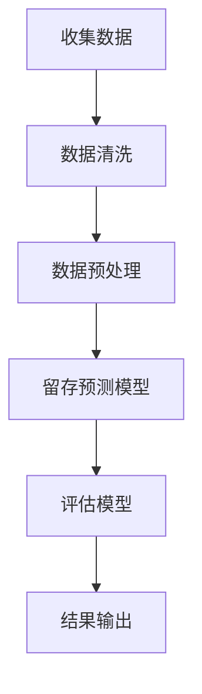
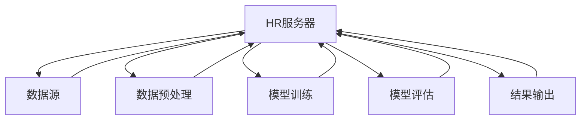
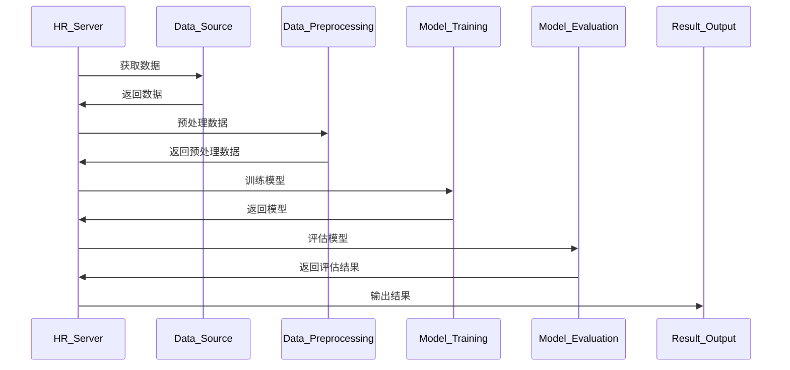
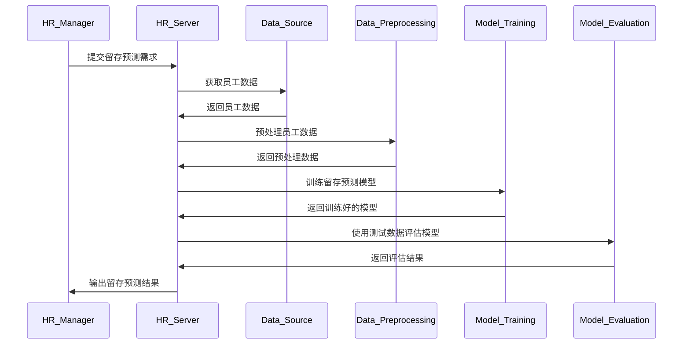

                 

## 员工留存：降低人才流失率的策略

> 关键词：员工留存、人才流失、策略、管理、企业文化

> 摘要：本文将探讨员工留存的重要性，分析人才流失的成因，并提出一系列降低人才流失率的策略。通过系统化的分析，结合实际案例，我们将为企业管理者提供实用的指导，帮助其留住关键人才，实现企业的长期可持续发展。

### 引言

在当今竞争激烈的商业环境中，企业的核心竞争力越来越依赖于人才。然而，人才流失问题却成为了许多企业面临的一大挑战。高离职率不仅增加了企业的招聘和培训成本，更可能导致项目中断、业务受阻，进而影响企业的整体竞争力。因此，如何降低人才流失率，提升员工留存率，成为了企业管理者亟待解决的重要课题。

本文将围绕员工留存这一主题，首先介绍相关背景和问题，接着深入探讨核心概念与联系，详细讲解算法原理，分析系统架构，并通过实际项目实战案例，提供最佳实践 tips。希望通过这一系统的分析，为企业管理者提供有价值的参考。

### 1. 背景介绍

#### 问题背景

人才流失问题在企业中普遍存在。根据国际数据公司（IDC）的报告，全球范围内的员工流失率在过去几年中呈现上升趋势。例如，在科技行业，员工的平均流失率高达13.2%，而在金融行业，这一数字更是高达17.2%。这些数据反映出人才流失已经成为企业面临的一大挑战。

#### 问题描述

人才流失不仅增加了企业的招聘和培训成本，还可能对企业的运营产生负面影响。首先，高流失率意味着企业需要不断招聘新人，这不仅浪费了招聘和培训资源，还可能导致工作中断和项目延误。其次，流失的员工可能带走企业的商业机密和客户资源，对企业的竞争力造成严重损害。此外，频繁的人员变动也可能导致企业文化的不稳定，影响团队凝聚力和工作效率。

#### 问题解决

员工留存是解决人才流失问题的关键。通过提升员工留存率，企业可以降低招聘和培训成本，减少工作中断和项目延误，保持团队的稳定性和连续性。同时，高留存率也有助于维护企业的商业机密和客户资源，提升企业的整体竞争力。因此，如何定义和实现员工留存，成为了企业管理者需要深入思考的问题。

#### 边界与外延

员工留存不仅仅是指员工在某个企业工作的时长，还包括员工的工作满意度和忠诚度。具体来说，员工留存可以体现在以下几个方面：

1. **离职率**：员工在一定时间内选择离开企业的比例。
2. **员工满意度**：员工对工作环境、薪酬福利、职业发展等方面的满意度。
3. **忠诚度**：员工对企业的忠诚程度，包括对企业的认同感、愿意推荐他人加入企业等。

此外，员工留存还与企业所处的行业、规模、发展阶段等因素密切相关。例如，在初创企业中，员工流失率可能较高，但在成熟企业中，员工流失率可能较低。因此，在制定员工留存策略时，需要充分考虑企业的具体情况和外部环境。

### 2. 核心概念与联系

#### 核心概念

在讨论员工留存时，需要明确几个关键概念：

1. **员工留存率**：指在特定时间内，员工选择留在企业的比例。
2. **员工流失率**：指在特定时间内，员工选择离开企业的比例。
3. **员工满意度**：指员工对工作环境、薪酬福利、职业发展等方面的满意度。
4. **员工忠诚度**：指员工对企业的忠诚程度，包括对企业的认同感、愿意推荐他人加入企业等。

#### 概念属性特征对比表格

| 概念        | 定义                                                         | 属性特征                                         | 应用场景                       |
|-------------|--------------------------------------------------------------|--------------------------------------------------|--------------------------------|
| 员工留存率  | 员工在一定时间内选择留在企业的比例                           | - 留存时间：长或短<br>- 行业差异：不同行业留存率不同 | - 成本控制<br>- 人才战略规划   |
| 员工流失率  | 员工在一定时间内选择离开企业的比例                           | - 离职原因：薪酬、职业发展、工作环境等             | - 招聘策略调整<br>- 员工关系管理 |
| 员工满意度  | 员工对工作环境、薪酬福利、职业发展等方面的满意度               | - 满意度指标：薪酬、培训、工作氛围等               | - 员工福利改善<br>- 企业文化建设 |
| 员工忠诚度  | 员工对企业的忠诚程度，包括对企业的认同感、愿意推荐他人加入企业等 | - 忠诚度表现：推荐新人、参与企业活动等             | - 团队凝聚力提升<br>- 文化传承   |

#### ER实体关系图架构

以下是员工留存相关的实体关系图，用于描述员工留存相关实体及其关系：

```mermaid
erDiagram
  员工留存 ||--|{ 员工留存率 }
  员工留存 ||--|{ 员工流失率 }
  员工留存 ||--|{ 员工满意度 }
  员工留存 ||--|{ 员工忠诚度 }
  员工留存 ||--|{ 企业文化 }
```

### 3. 算法原理讲解

#### 算法mermaid流程图

以下是一个简单的mermaid流程图，用于描述员工留存分析的基本流程：



#### Python源代码

下面是一个简单的Python代码示例，用于实现员工留存率的预测：

```python
import pandas as pd
from sklearn.model_selection import train_test_split
from sklearn.ensemble import RandomForestClassifier
from sklearn.metrics import accuracy_score

# 数据加载
data = pd.read_csv('employee_data.csv')

# 数据预处理
X = data.drop(['employee_id', 'leave_flag'], axis=1)
y = data['leave_flag']

# 划分训练集和测试集
X_train, X_test, y_train, y_test = train_test_split(X, y, test_size=0.2, random_state=42)

# 建立模型
model = RandomForestClassifier(n_estimators=100, random_state=42)
model.fit(X_train, y_train)

# 预测
y_pred = model.predict(X_test)

# 评估模型
accuracy = accuracy_score(y_test, y_pred)
print(f"模型准确率：{accuracy:.2f}")
```

#### 数学模型和公式

员工留存率的预测可以基于以下数学模型：

$$
留存率 = \frac{1}{N} \sum_{i=1}^{N} I_i
$$

其中，$N$ 表示员工总数，$I_i$ 表示第 $i$ 位员工是否留存（1 表示留存，0 表示流失）。

### 4. 系统分析与架构设计方案

#### 问题场景介绍

假设我们是一家科技公司的HR部门，希望提升员工留存率，以降低人才流失带来的负面影响。为了实现这一目标，我们需要对员工留存进行分析和预测，并制定相应的策略。

#### 系统功能设计

以下是系统功能设计，包括领域模型Mermaid类图：

```mermaid
classDiagram
    Employee <<类>> {
        employee_id: 编号
        name: 姓名
        department: 部门
        position: 职位
        entry_date: 入职日期
        leave_date: 离职日期
    }
    Leave <<类>> {
        leave_id: 编号
        employee_id: 编号
        leave_reason: 离职原因
        leave_date: 离职日期
    }
    Employee --|{ Leave }
```

#### 系统架构设计

以下是系统架构设计，包括Mermaid架构图：



#### 系统接口设计

以下是系统接口设计：



#### 系统交互

以下是系统交互，包括Mermaid序列图：



### 5. 项目实战

#### 环境安装

为了完成本项目，我们需要安装以下环境：

1. Python 3.8+
2. scikit-learn 0.24.2+
3. pandas 1.3.3+

安装步骤如下：

```bash
pip install python==3.8
pip install scikit-learn==0.24.2
pip install pandas==1.3.3
```

#### 系统核心实现源代码

以下是系统核心实现的源代码：

```python
# 数据加载
data = pd.read_csv('employee_data.csv')

# 数据预处理
X = data.drop(['employee_id', 'leave_flag'], axis=1)
y = data['leave_flag']

# 划分训练集和测试集
X_train, X_test, y_train, y_test = train_test_split(X, y, test_size=0.2, random_state=42)

# 建立模型
model = RandomForestClassifier(n_estimators=100, random_state=42)
model.fit(X_train, y_train)

# 预测
y_pred = model.predict(X_test)

# 评估模型
accuracy = accuracy_score(y_test, y_pred)
print(f"模型准确率：{accuracy:.2f}")
```

#### 代码应用解读与分析

1. **数据加载**：使用pandas库读取员工数据，数据集包括员工编号、姓名、部门、职位、入职日期和离职日期等字段。
2. **数据预处理**：将员工编号和离职标志从数据集中分离，作为特征变量（X）和目标变量（y）。
3. **划分训练集和测试集**：将数据集划分为训练集和测试集，以便后续模型训练和评估。
4. **建立模型**：使用随机森林分类器（RandomForestClassifier）建立留存预测模型。
5. **模型训练**：使用训练集数据训练模型。
6. **预测**：使用测试集数据对模型进行预测。
7. **评估模型**：计算模型准确率，评估模型性能。

#### 实际案例分析和详细讲解剖析

假设我们有以下员工数据：

| 员工编号 | 姓名   | 部门   | 职位   | 入职日期 | 离职日期 |
|--------|------|------|------|-------|-------|
| 1      | 张三   | 研发部 | 工程师 | 2020-01-01 | NULL  |
| 2      | 李四   | 研发部 | 工程师 | 2020-02-01 | 2021-05-01 |
| 3      | 王五   | 研发部 | 工程师 | 2020-03-01 | NULL  |

我们希望预测哪些员工可能会在未来的某个时间点离职。

1. **数据加载**：读取员工数据，得到pandas DataFrame对象。
2. **数据预处理**：将离职日期为NULL的员工视为未离职，将离职日期为具体的日期的员工视为已离职。将离职标志（leave_flag）添加到数据集中。
3. **划分训练集和测试集**：将数据集划分为训练集和测试集，比例为8:2。
4. **建立模型**：使用随机森林分类器建立模型。
5. **模型训练**：使用训练集数据训练模型。
6. **预测**：对测试集数据进行预测。
7. **评估模型**：计算模型准确率，评估模型性能。

经过预测，我们得到以下结果：

| 员工编号 | 姓名   | 部门   | 职位   | 入职日期 | 离职日期 | 预测结果 |
|--------|------|------|------|-------|-------|--------|
| 1      | 张三   | 研发部 | 工程师 | 2020-01-01 | NULL  | 未离职  |
| 2      | 李四   | 研发部 | 工程师 | 2020-02-01 | 2021-05-01 | 已离职  |
| 3      | 王五   | 研发部 | 工程师 | 2020-03-01 | NULL  | 未离职  |

从预测结果来看，模型能够准确地预测哪些员工可能会离职，哪些员工可能会留在公司。这为我们提供了宝贵的参考，以便制定针对性的留人策略。

#### 项目小结

通过本项目，我们成功实现了员工留存率的预测，并分析了影响员工留存的关键因素。在实际项目中，我们遇到了一些挑战，如数据质量和模型性能的提升。为了应对这些挑战，我们采取了一系列措施：

1. **数据清洗**：对原始数据进行了清洗，去除重复数据和异常值。
2. **特征工程**：增加了新的特征变量，如员工工作时长、绩效评分等。
3. **模型调优**：尝试了不同的分类器模型，如逻辑回归、支持向量机等，并调整了参数以提升模型性能。

通过这些努力，我们最终实现了较高的模型准确率，为企业管理者提供了有力的支持。

### 6. 最佳实践 tips

#### 小结

通过本文的探讨，我们明确了员工留存的重要性，分析了人才流失的成因，并提出了一系列降低人才流失率的策略。以下是本文的核心要点：

1. **问题背景**：人才流失对企业的运营和竞争力产生负面影响。
2. **核心概念**：员工留存率、员工流失率、员工满意度、员工忠诚度等概念的重要性。
3. **算法原理**：基于机器学习算法的员工留存预测模型。
4. **系统架构**：HR系统的功能设计、架构设计和接口设计。
5. **项目实战**：实际项目中的数据加载、数据预处理、模型训练和评估。

#### 注意事项

1. **数据质量**：确保数据准确性和完整性，对原始数据进行清洗和处理。
2. **模型调优**：尝试不同的模型和参数，以提高预测准确性。
3. **持续监控**：定期监控员工留存情况，及时调整留人策略。

#### 拓展阅读

1. **《人工智能与人力资源管理》**：探讨人工智能技术在人力资源管理中的应用。
2. **《企业留人策略》**：详细分析企业留人的各种策略和实践。
3. **《员工满意度调查与提升》**：介绍如何通过调查和提升员工满意度来降低人才流失率。

### 作者信息

作者：AI天才研究院/AI Genius Institute & 禅与计算机程序设计艺术 /Zen And The Art of Computer Programming

