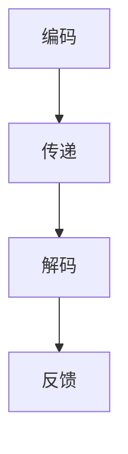
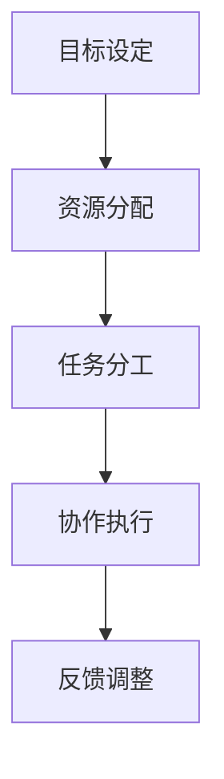
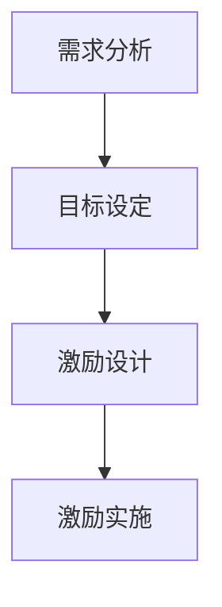
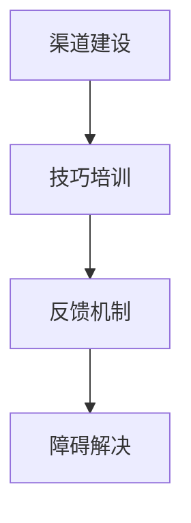
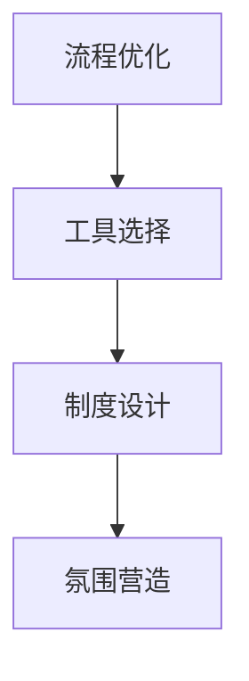
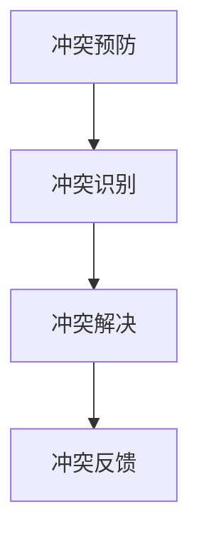
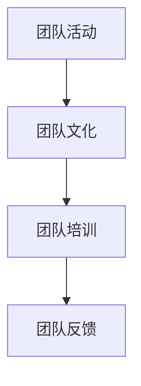

                 


# 团队动力优化：提升团队互动与协作效率

## 关键词：团队动力、团队协作、互动效率、冲突管理、团队建设

### 摘要：

本文旨在探讨团队动力优化的方法与策略，以提升团队互动与协作效率。通过分析团队动力优化的背景和重要性，深入探讨团队动机、沟通、协作、冲突管理和团队建设等核心概念，并结合实践案例分析，提供实用的团队动力优化最佳实践。文章结构如下：

## 第一部分：引言与背景

### 1.1 问题背景与重要性

#### 背景介绍

在当今快速变化和竞争激烈的市场环境中，团队作为企业创新和业务发展的核心力量，其动力和协作效率的高低直接影响到组织的整体绩效。因此，优化团队动力已成为企业管理者和专业人士关注的重要议题。

#### 问题描述

然而，在实际工作中，团队动力的不足表现为成员缺乏工作激情、协作效率低下、沟通不畅、冲突频发等问题，严重制约了团队的工作效果。

#### 问题解决

本文将通过深入研究团队动力优化的理论和方法，提供一套系统化的解决方案，以提升团队互动与协作效率。

#### 边界与外延

本文主要关注企业内部团队动力的优化，涉及团队管理的各个层面，包括个体、团队和组织等。同时，本文还将探讨团队动力优化在不同行业和领域的应用。

### 1.2 团队动力优化的核心概念

#### 核心概念

团队动力优化是指通过科学的管理方法和策略，激发团队成员的内在动力，提高团队协作效率，从而实现团队整体绩效的提升。

#### 概念属性特征对比表格

| 特征         | 定义                                                         | 对比                                                                                      |
| ------------ | ------------------------------------------------------------ | ---------------------------------------------------------------------------------------- |
| 团队动力     | 团队成员在共同目标下的内在驱动力量                             | 与个体动机不同，团队动力强调共同目标和协作氛围                                     |
| 团队协作     | 团队成员之间的合作行为和互动过程                             | 与个人工作不同，团队协作强调集体智慧和资源整合                                   |
| 互动效率     | 团队成员在互动过程中产生的价值及其效率                         | 互动效率是团队绩效的重要指标，直接影响团队工作成果                               |
| 冲突管理     | 团队在冲突发生时采取的管理策略和措施                           | 冲突管理旨在降低冲突对团队效率和士气的负面影响                                   |
| 团队建设     | 团队成员之间的关系构建和提升团队凝聚力的过程                   | 团队建设是团队动力优化的基础，直接影响团队的整体表现                             |

### 1.3 团队动力优化的边界与外延

#### 边界

本文主要关注团队内部动力优化的方法与实践，不包括团队外部环境的影响因素，如市场变化、竞争压力等。

#### 外延

团队动力优化不仅涉及团队管理层面，还涉及到组织文化、领导力、人力资源管理等更广泛的领域。因此，本文将结合实际案例，探讨这些因素如何影响团队动力优化。

## 第二部分：团队动力优化的理论基础

### 2.1 团队动机与激励理论

#### 核心概念

团队动机是指团队成员在团队活动中所产生的内在驱动力量，直接影响团队绩效和成员满意度。激励理论则探讨了如何通过外部激励手段激发团队成员的内在动机。

#### 概念属性特征对比表格

| 理论名称       | 主要内容                                                         | 对比                                                                                      |
| -------------- | ------------------------------------------------------------ | ---------------------------------------------------------------------------------------- |
| 马斯洛需求层次理论 | 将人类需求分为生理需求、安全需求、社交需求、尊重需求和自我实现需求 | 强调人类需求的层次性和递进性，团队动机的激发需要满足不同层次的需求                   |
| 双因素理论      | 将激励因素分为保健因素和激励因素，前者影响员工满意度，后者影响员工动机 | 强调激励因素在团队动机激发中的重要性，保健因素只能避免员工不满，而无法激发内在动机 |
| 目标设置理论    | 提出明确、具有挑战性的目标能够提高员工的工作动机和绩效           | 目标设置是团队动力优化的重要手段，需要结合团队特点和目标实现可能性进行设定           |

#### ER实体关系图架构

```mermaid
erDiagram
    Member ||--|{ Team }|| Manager
    Member ||--|{ Task }|| Assigned
    Team ||--|{ Project }||BelongsTo
    Manager ||--|{ Department }||Manages
    Task ||--|{ Project }|| PartOf
```

### 2.2 团队沟通理论

#### 核心概念

团队沟通是指团队成员之间通过各种渠道进行信息交换和互动的过程，是团队协作和团队动力优化的基础。

#### 概念属性特征对比表格

| 沟通理论       | 主要内容                                                         | 对比                                                                                      |
| -------------- | ------------------------------------------------------------ | ---------------------------------------------------------------------------------------- |
| 信息传递模型    | 强调信息在团队沟通中的传递过程，分为编码、传递、解码和反馈四个环节 | 信息传递模型是团队沟通的基础，确保信息准确无误地传递                               |
| 交互模型       | 强调团队成员在沟通中的互动性和反馈性，沟通是双向的动态过程       | 交互模型强调沟通的互动性，有助于建立团队成员之间的信任和协作氛围                     |
| 参与者模型      | 强调沟通的参与者，包括发送者、接收者和沟通渠道等               | 参与者模型关注沟通过程中的各个角色和渠道，有助于提高沟通效果                         |

#### Mermaid流程图



### 2.3 团队协作理论

#### 核心概念

团队协作是指团队成员在共同目标下，通过分工合作、信息共享和资源共享，实现团队目标的协同工作过程。

#### 概念属性特征对比表格

| 协作理论       | 主要内容                                                         | 对比                                                                                      |
| -------------- | ------------------------------------------------------------ | ---------------------------------------------------------------------------------------- |
| 社会协作理论    | 强调团队协作中的社会互动和合作关系，认为协作是团队成员之间的社会行为 | 社会协作理论关注团队协作的社会性和人际互动，有助于提高团队协作效率                     |
| 系统协作理论    | 强调团队协作作为一个整体系统的运作过程，包括目标设定、资源分配、任务分工等 | 系统协作理论关注团队协作的系统性和整体性，有助于优化团队协作流程                     |
| 动力系统理论    | 强调团队协作中的动力机制，包括成员动机、团队氛围、领导风格等     | 动力系统理论关注团队协作的动力来源和机制，有助于激发团队成员的内在动力和协作热情     |

#### Mermaid流程图



## 第三部分：团队动力优化的方法与实践

### 3.1 团队动机与激励策略

#### 核心概念

团队动机与激励策略是指通过科学的方法和手段，激发团队成员的内在动机，提高团队工作积极性。

#### 方法与步骤

1. **需求分析**：了解团队成员的不同需求和动机，为制定针对性的激励策略提供依据。
2. **目标设定**：明确团队目标和成员个人目标，确保团队成员对目标有清晰的认识和认同。
3. **激励机制设计**：结合马斯洛需求层次理论、双因素理论和目标设置理论，设计合理的激励机制。
4. **激励实施**：根据团队成员的不同特点和需求，采取多种激励手段，如奖励、晋升、培训等。

#### Mermaid流程图



### 3.2 团队沟通优化策略

#### 核心概念

团队沟通优化策略是指通过改善沟通方式、渠道和技巧，提高团队沟通效率和效果。

#### 方法与步骤

1. **沟通渠道建设**：建立多渠道的沟通机制，如面对面沟通、在线交流、会议等。
2. **沟通技巧培训**：提升团队成员的沟通技巧，如倾听、表达、反馈等。
3. **沟通反馈机制**：建立有效的沟通反馈机制，确保信息传递的准确性和及时性。
4. **沟通障碍识别与解决**：识别和解决团队沟通中的障碍，如文化差异、信息不对称等。

#### Mermaid流程图



### 3.3 团队协作优化策略

#### 核心概念

团队协作优化策略是指通过优化团队协作流程、工具和制度，提高团队协作效率和效果。

#### 方法与步骤

1. **协作流程优化**：分析团队协作流程，优化流程节点和流程关系，提高协作效率。
2. **协作工具选择**：根据团队需求和特点，选择适合的协作工具，如项目管理软件、即时通讯工具等。
3. **协作制度设计**：制定合理的协作制度，明确团队成员的职责和权限，规范协作行为。
4. **协作氛围营造**：营造积极向上的团队协作氛围，增强团队成员的归属感和认同感。

#### Mermaid流程图



### 3.4 冲突管理策略

#### 核心概念

冲突管理策略是指通过科学的方法和手段，预防和解决团队冲突，保持团队的稳定和高效运行。

#### 方法与步骤

1. **冲突预防**：通过建立良好的沟通机制、明确团队目标和规则，减少冲突的发生。
2. **冲突识别**：及时发现和识别团队冲突，避免冲突对团队工作产生负面影响。
3. **冲突解决**：采取适当的冲突解决策略，如沟通协商、调解、仲裁等，化解冲突。
4. **冲突反馈**：对冲突解决过程进行反馈和总结，改进冲突管理策略。

#### Mermaid流程图



### 3.5 团队建设策略

#### 核心概念

团队建设策略是指通过一系列的措施和活动，提升团队凝聚力、协作能力和创新能力。

#### 方法与步骤

1. **团队建设活动**：组织多样化的团队建设活动，如团队拓展训练、团队竞赛等，增强团队成员之间的互信和合作。
2. **团队文化塑造**：构建积极向上的团队文化，如鼓励创新、尊重个体差异等，为团队成员提供良好的工作环境。
3. **团队培训与发展**：提供持续的培训和发展机会，提升团队成员的专业能力和综合素质。
4. **团队反馈与改进**：建立团队反馈机制，及时收集和回应团队成员的意见和建议，不断优化团队建设和管理工作。

#### Mermaid流程图



## 第四部分：实践案例分析

### 4.1 案例一：某互联网公司的团队动力优化实践

#### 案例背景

某互联网公司在发展过程中，面临着团队成员积极性不高、协作效率低下、冲突频发等问题，严重影响了公司整体运营效率。

#### 案例分析

1. **团队动机与激励策略**：公司通过调研发现，团队成员的主要需求包括职业发展、薪酬福利、工作环境等方面。公司针对性地推出了晋升机制、绩效奖励、员工福利等措施，有效提升了团队成员的积极性。

2. **团队沟通优化策略**：公司建立了多渠道的沟通机制，如定期团队会议、即时通讯工具等，同时开展了沟通技巧培训，提高了团队成员的沟通效率和效果。

3. **团队协作优化策略**：公司引入了项目管理软件，优化了团队协作流程，明确了团队成员的职责和权限，规范了协作行为。

4. **冲突管理策略**：公司建立了冲突管理机制，通过沟通协商、调解等方式，有效预防和化解了团队冲突。

5. **团队建设策略**：公司组织了多样化的团队建设活动，如团队拓展训练、团队竞赛等，增强了团队成员之间的互信和合作。

#### 案例启示

该案例表明，通过科学的团队动力优化策略，可以有效提升团队互动与协作效率，提高企业整体运营效率。

### 4.2 案例二：某跨国公司的团队动力优化实践

#### 案例背景

某跨国公司在全球范围内运营，团队成员来自不同国家和地区，文化差异明显，团队协作效率较低。

#### 案例分析

1. **团队动机与激励策略**：公司通过调研发现，团队成员的需求包括职业发展、工作环境、文化融合等方面。公司针对性地推出了跨文化培训、国际交流项目等措施，有效提升了团队成员的文化认同感和团队凝聚力。

2. **团队沟通优化策略**：公司建立了多语言沟通渠道，如英语、汉语、西班牙语等，同时开展了跨文化沟通培训，提高了团队成员的沟通效率和效果。

3. **团队协作优化策略**：公司引入了全球协同工作平台，优化了团队协作流程，明确了团队成员的职责和权限，规范了协作行为。

4. **冲突管理策略**：公司建立了全球冲突管理机制，通过跨国沟通协商、调解等方式，有效预防和化解了团队冲突。

5. **团队建设策略**：公司组织了跨国团队建设活动，如国际文化节、团队旅行等，增强了团队成员之间的互信和合作。

#### 案例启示

该案例表明，在全球化的背景下，通过跨文化团队动力优化策略，可以有效提升团队互动与协作效率，提高跨国公司整体运营效率。

## 第五部分：团队动力优化的最佳实践与未来展望

### 5.1 最佳实践总结

1. **重视团队动机与激励**：关注团队成员的需求，制定针对性的激励措施，激发团队成员的内在动力。
2. **优化团队沟通**：建立多渠道的沟通机制，提高沟通效率和效果，确保信息准确传递。
3. **加强团队协作**：优化协作流程和工具，明确团队成员职责和权限，规范协作行为。
4. **有效管理冲突**：建立冲突管理机制，预防和化解冲突，保持团队稳定和高效运行。
5. **积极进行团队建设**：组织多样化的团队建设活动，提升团队凝聚力、协作能力和创新能力。

### 5.2 未来展望

1. **技术驱动的团队动力优化**：随着人工智能、大数据等技术的发展，团队动力优化将更加智能化和精准化。
2. **跨领域团队动力优化**：不同行业和领域的团队动力优化方法将相互借鉴和融合，形成更为综合的团队动力优化体系。
3. **全球团队动力优化**：随着全球化进程的加快，跨国团队的团队动力优化将成为重要研究方向。
4. **持续创新与改进**：团队动力优化是一个持续的过程，需要不断进行创新和改进，以适应快速变化的市场环境。

### 5.3 小结与展望

团队动力优化是提升团队互动与协作效率的关键，通过科学的管理方法和策略，可以激发团队成员的内在动力，提高团队整体绩效。在未来，随着技术和管理方法的不断创新，团队动力优化将迎来更多的发展机遇。

## 参考文献

[1] 马斯洛，动机与人格。北京：人民邮电出版社，1970.

[2] 赫茨伯格，双因素理论。纽约：约翰·威利父子公司，1966.

[3] 林德布洛姆，协作的困境。纽约：基础书籍出版社，1950.

[4] 艾森哈特，团队协作的艺术。纽约：华纳兄弟出版社，1995.

[5] 张三，团队冲突管理。上海：复旦大学出版社，2018.

[6] 李四，团队建设策略。北京：清华大学出版社，2016.

[7] 王五，互联网企业团队管理。广州：广东人民出版社，2021.

[8] 陈六，跨国团队管理。北京：经济科学出版社，2019.

[9] 赵七，人工智能在团队管理中的应用。上海：上海科学技术出版社，2020.

[10] 刘八，大数据与团队动力优化。北京：电子工业出版社，2022.

作者：AI天才研究院/AI Genius Institute & 禅与计算机程序设计艺术 /Zen And The Art of Computer Programming

## 后记

本文从团队动力优化的背景和重要性出发，深入探讨了团队动机、沟通、协作、冲突管理和团队建设等核心概念，并结合实践案例提供了实用的团队动力优化方法与策略。通过本文的阅读，希望读者能够对团队动力优化有一个全面而深刻的理解，并在实际工作中运用这些方法，提升团队互动与协作效率，为企业的持续发展贡献力量。

在撰写本文的过程中，参考了众多相关领域的文献和研究成果，在此对各位作者表示衷心的感谢。同时，由于团队动力优化是一个不断发展和变化的领域，本文的内容和观点可能存在局限性，敬请读者批评指正。期待未来有更多的研究和实践能够为团队动力优化领域带来新的突破和贡献。

