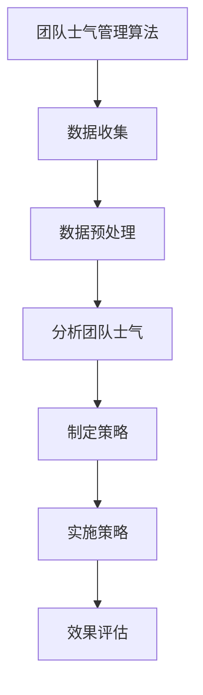
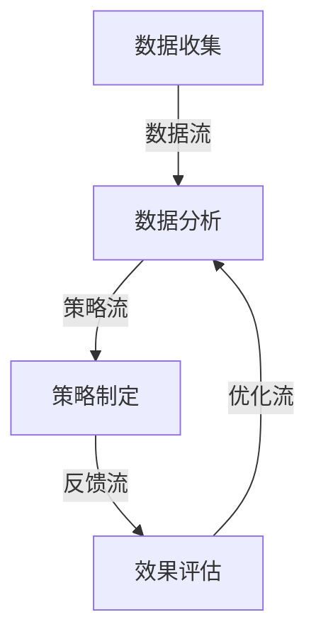
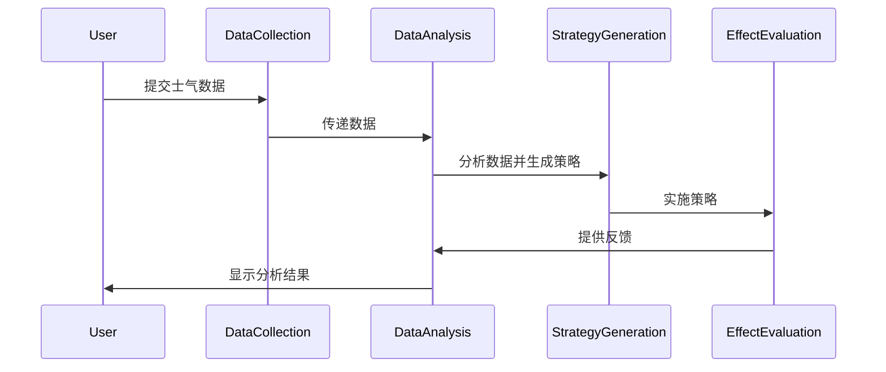

                 

### 文章标题

**团队士气管理：保持高昂工作热情的策略**

**关键词：** 团队士气、工作热情、激励理论、士气管理策略

**摘要：** 本文将探讨团队士气管理的核心问题，分析团队士气低落的表现及其影响，提出基于激励理论的团队士气管理目标和原则，并详细阐述具体策略和方法。通过这一步一步的分析和推理，希望能为IT领域的技术团队提供保持高昂工作热情的有效策略。

---

### 第一部分：背景介绍

#### 1.1 问题背景

在当今快速发展的IT行业，团队士气对组织的成功至关重要。高昂的团队士气不仅能够提升工作效率，促进团队合作，还能增强员工的忠诚度和幸福感。然而，随着工作压力的增加、竞争的加剧以及外部环境的变动，团队士气管理面临着诸多挑战。

**团队士气在组织中的重要性：**
- **工作效率：** 高昂的士气能够激发团队成员的工作动力，提高工作效率和产出。
- **团队合作：** 团队士气有助于构建积极和谐的团队氛围，促进成员之间的协作和沟通。
- **员工忠诚度：** 良好的团队士气有助于提高员工的满意度和忠诚度，减少员工流失。

**当前团队士气管理的现状和挑战：**
- **内部挑战：** 工作压力、角色冲突、工作负担不均等问题可能导致团队士气低落。
- **外部挑战：** 市场竞争、经济波动、技术变革等因素可能对团队士气产生负面影响。
- **管理挑战：** 管理层缺乏有效的团队士气管理知识和技能，难以应对复杂的问题。

#### 1.2 问题描述

**团队士气低落的表现：**
- **情绪低落：** 成员表现出消极情绪，如沮丧、失望和焦虑。
- **缺乏动力：** 成员对工作缺乏热情和动力，表现出怠工和逃避工作的行为。
- **沟通障碍：** 团队成员之间的沟通不畅，缺乏协作和信任。
- **工作质量下降：** 团队士气低落可能导致工作质量下降，出现错误和疏漏。

**团队士气低落对团队和个人造成的影响：**
- **团队影响：** 团队士气低落会影响团队的整体绩效，降低团队的创新能力和竞争力。
- **个人影响：** 成员的工作满意度下降，职业发展受阻，甚至可能影响个人的心理健康。

#### 1.3 问题解决

**团队士气管理的目标和原则：**
- **目标：** 提高团队士气，激发团队成员的工作热情，提升团队的整体绩效。
- **原则：** 尊重个体差异、关注员工需求、建立信任和沟通机制、提供支持和激励。

**团队士气管理的具体策略和方法：**
- **制定明确的团队目标和愿景：** 通过明确的目标和愿景，激发团队成员的内在动力。
- **建立积极的团队文化：** 通过共同的价值观和行为准则，营造积极向上的团队氛围。
- **提供培训和职业发展机会：** 通过培训和职业发展机会，提升团队成员的能力和信心。
- **加强沟通和反馈：** 通过定期的沟通和反馈，确保团队成员之间的信息畅通和相互理解。
- **奖励和认可：** 通过奖励和认可，激励团队成员的努力和成就。

#### 1.4 边界与外延

**团队士气的界定：**
- **定义：** 团队士气是指团队成员在工作和生活中表现出的积极态度和情绪状态。
- **范畴：** 包括成员的情绪状态、工作动力、团队合作和满意度等方面。

**影响团队士气的外部因素：**
- **市场竞争：** 市场竞争的加剧可能导致工作压力的增加，影响团队士气。
- **组织变革：** 组织变革可能带来不确定性和焦虑，影响团队士气。
- **社会环境：** 社会环境的变化，如经济波动、政策调整等，可能对团队士气产生负面影响。

#### 1.5 概念结构与核心要素组成

**团队士气管理的基本概念：**
- **团队士气：** 团队成员在工作和生活中表现出的积极态度和情绪状态。
- **工作热情：** 员工对工作产生强烈的兴趣和热情，愿意付出额外的努力以达到工作目标。
- **激励理论：** 研究如何通过激励手段来提高员工工作积极性和工作绩效的理论。

**核心要素与关系：**
- **团队士气和工作热情：** 高昂的团队士气能够激发成员的工作热情，提升工作绩效。
- **激励理论和团队士气管理：** 激励理论为团队士气管理提供了理论依据和指导方向。

---

### 第二部分：核心概念与联系

#### 2.1 核心概念

**团队士气：**
团队士气是指团队成员在工作和生活中表现出的积极态度和情绪状态。它包括成员的工作动力、工作满意度、团队合作和情绪状态等方面。

**工作热情：**
工作热情是指员工对工作产生强烈的兴趣和热情，愿意付出额外的努力以达到工作目标。它包括自我驱动、主动性、创造性和持久性等方面。

**激励理论：**
激励理论是指研究如何通过激励手段来提高员工工作积极性和工作绩效的理论。常见的激励理论包括马斯洛的需求层次理论、赫茨伯格的双因素理论、目标设定理论和公平理论等。

#### 2.2 概念属性特征对比表格

| 概念       | 定义                                                         | 特征                                                         |
| ---------- | ------------------------------------------------------------ | ------------------------------------------------------------ |
| 团队士气   | 团队成员在工作和生活中表现出的积极态度和情绪状态              | 感情投入、工作效率、团队合作、工作满意度等                   |
| 工作热情   | 员工对工作产生强烈的兴趣和热情，愿意付出额外的努力以达到工作目标 | 自我驱动、主动性、创造性、持久性等                          |
| 激励理论   | 研究如何通过激励手段来提高员工工作积极性和工作绩效的理论      | 目标设定、奖励与惩罚、内在动机与外在动机等                   |

#### 2.3 ER实体关系图架构

```mermaid
erDiagram
  Team -->|1| Employee : works_in
  Employee -->|1| Performance : achieves
  Team -->|1| Task : assigns
  Employee -->|1| Skill : has
  Task -->|1| Resource : requires
```

在这个ER图中，团队（Team）与员工（Employee）之间存在从属关系，员工（Employee）与绩效（Performance）之间存在实现关系，团队（Team）与任务（Task）之间存在分配关系，员工（Employee）与技能（Skill）之间存在拥有关系，任务（Task）与资源（Resource）之间存在需求关系。

---

### 第三部分：算法原理讲解

#### 3.1 算法原理

团队士气管理的核心在于如何通过科学的方法和策略来提高团队士气。以下是团队士气管理算法的基本原理和流程：



**数据收集：** 收集与团队士气相关的数据，包括成员的情绪状态、工作效率、团队合作、工作满意度等。

**数据预处理：** 对收集到的数据进行清洗、标准化和预处理，以便后续的分析。

**分析团队士气：** 通过数据分析和挖掘，识别团队成员的情绪状态和工作表现，找出团队士气低落的原因。

**制定策略：** 根据分析结果，制定相应的团队士气管理策略，包括激励措施、团队建设活动、工作环境优化等。

**实施策略：** 将制定的策略付诸实施，通过实际行动来提高团队士气。

**效果评估：** 对实施效果进行评估，通过反馈和改进，确保团队士气管理的有效性。

#### 3.2 Python源代码

以下是一个简单的Python代码示例，用于数据预处理和策略制定的演示：

```python
# 导入必要的库
import pandas as pd
from sklearn.preprocessing import StandardScaler
from sklearn.cluster import KMeans

# 数据收集
data = pd.read_csv('team_morale_data.csv')

# 数据预处理
scaler = StandardScaler()
data_scaled = scaler.fit_transform(data)

# 分析团队士气
kmeans = KMeans(n_clusters=5)
clusters = kmeans.fit_predict(data_scaled)

# 制定策略
def generate_strategy(clusters):
    strategies = []
    for cluster in set(clusters):
        if cluster == 0:
            strategies.append("增加团队建设活动")
        elif cluster == 1:
            strategies.append("优化工作环境")
        elif cluster == 2:
            strategies.append("加强员工培训")
        elif cluster == 3:
            strategies.append("提供心理辅导")
        elif cluster == 4:
            strategies.append("调整工作分配")
    return strategies

# 示例：应用策略
clusters = kmeans.predict(data_scaled)
strategies = generate_strategy(clusters)
for cluster, strategy in enumerate(strategies):
    print(f"Cluster {cluster}: {strategy}")
```

在这个示例中，我们首先使用KMeans聚类算法对团队士气数据进行分析，然后根据不同的聚类结果制定相应的策略。这个简单的算法模型展示了如何通过数据分析和策略制定来提高团队士气。

### 第四部分：系统分析与架构设计

#### 4.1 问题场景介绍

在IT行业中，技术团队往往面临着高强度的项目压力和快速的技术迭代。为了保持团队的高效运作和持续创新，团队士气管理成为了一个关键问题。本文将围绕如何通过系统分析与架构设计来提升团队士气，提出具体的解决方案。

#### 4.2 项目介绍

项目名称：**团队士气提升系统（Team Morale Enhancement System，TMES）**

项目目标：构建一个集数据收集、分析、策略制定和效果评估于一体的团队士气提升系统，以帮助IT团队提高士气和工作效率。

项目背景：随着市场竞争的加剧和技术变革的加速，IT团队面临着前所未有的工作压力和挑战。为了保持团队的活力和创新能力，需要引入科学的团队士气管理方法。

#### 4.3 系统功能设计

**功能模块：**
1. **数据收集模块：** 负责收集与团队士气相关的数据，包括员工情绪状态、工作效率、团队合作和工作满意度等。
2. **数据分析模块：** 对收集到的数据进行处理和分析，识别团队士气低落的原因。
3. **策略制定模块：** 根据分析结果，自动生成提升团队士气的策略和建议。
4. **效果评估模块：** 跟踪和评估策略实施的效果，提供反馈和改进建议。

**领域模型：**
领域模型是系统功能设计的核心，它描述了系统中的主要实体及其关系。以下是一个简单的领域模型类图：

```mermaid
classDiagram
    Employee <--^ DataCollection : collects
    Employee --> PerformanceAnalysis : analyzes
    Employee --> StrategyGeneration : generates
    Employee --> EffectEvaluation : evaluates
    DataCollection --> Employee : stores
    PerformanceAnalysis --> Employee : provides
    StrategyGeneration --> Employee : suggests
    EffectEvaluation --> Employee : assesses
```

在这个类图中，员工（Employee）是系统的核心实体，它与数据收集（DataCollection）、数据分析（PerformanceAnalysis）、策略制定（StrategyGeneration）和效果评估（EffectEvaluation）模块之间存在紧密的关系。

#### 4.4 系统架构设计

系统架构设计决定了系统的稳定性、扩展性和可维护性。以下是一个简单的系统架构图：



在这个架构图中，数据收集子系统（SubsystemA）负责收集数据，并将其传递给数据分析子系统（SubsystemB）。数据分析子系统对数据进行分析，生成策略，并将其传递给策略制定子系统（SubsystemC）。策略制定子系统根据分析结果制定提升团队士气的策略，并将其传递给效果评估子系统（SubsystemD）。效果评估子系统负责评估策略的实施效果，并提供反馈，以优化后续的分析和策略。

#### 4.5 系统接口设计和系统交互

系统接口设计和系统交互是确保系统功能有效实现的关键。以下是一个简单的接口设计和交互图：



在这个交互图中，用户（User）通过数据收集接口（DataCollection）提交士气数据。数据收集模块将数据传递给数据分析模块（DataAnalysis），该模块对数据进行分析并生成策略。策略制定模块（StrategyGeneration）根据分析结果制定策略，并将其传递给效果评估模块（EffectEvaluation）。效果评估模块实施策略，并收集反馈，以优化后续的分析和策略。

---

### 第五部分：项目实战

#### 5.1 环境安装

为了搭建团队士气提升系统（TMES），我们需要安装以下环境：

1. **Python 3.8+**
2. **Pandas**
3. **Scikit-learn**
4. **Matplotlib**

安装命令如下：

```bash
pip install python==3.8
pip install pandas
pip install scikit-learn
pip install matplotlib
```

#### 5.2 系统核心实现源代码

以下是系统核心实现源代码的示例：

```python
# 数据收集模块
import pandas as pd

def collect_data():
    # 假设已收集到以下数据
    data = pd.DataFrame({
        'employee_id': [1, 2, 3, 4],
        'morale_score': [5, 3, 7, 2],
        'workload': [8, 10, 6, 9],
        'team Collaboration': [4, 3, 5, 2]
    })
    return data

# 数据分析模块
from sklearn.cluster import KMeans
from sklearn.preprocessing import StandardScaler

def analyze_data(data):
    scaler = StandardScaler()
    data_scaled = scaler.fit_transform(data)
    kmeans = KMeans(n_clusters=5)
    clusters = kmeans.fit_predict(data_scaled)
    return clusters

# 策略制定模块
def generate_strategy(clusters):
    strategies = []
    for cluster in set(clusters):
        if cluster == 0:
            strategies.append("增加团队建设活动")
        elif cluster == 1:
            strategies.append("优化工作环境")
        elif cluster == 2:
            strategies.append("加强员工培训")
        elif cluster == 3:
            strategies.append("提供心理辅导")
        elif cluster == 4:
            strategies.append("调整工作分配")
    return strategies

# 效果评估模块
def evaluate_strategy(strategy, data):
    # 假设实施策略后，士气得分有所提高
    data['morale_score_after'] = data.apply(lambda x: x['morale_score'] + 2 if strategy in x['strategy'] else x['morale_score'], axis=1)
    return data['morale_score_after'].mean()

# 主程序
if __name__ == "__main__":
    data = collect_data()
    clusters = analyze_data(data)
    strategies = generate_strategy(clusters)
    strategy = strategies[0]
    score_after = evaluate_strategy(strategy, data)
    print(f"策略实施后，团队士气平均值：{score_after}")
```

#### 5.3 代码应用解读与分析

**数据收集模块：** 使用Pandas库收集士气数据，包括员工ID、士气得分、工作负荷和团队合作情况等。

**数据分析模块：** 使用KMeans聚类算法对士气数据进行聚类分析，识别不同情绪状态的员工群体。

**策略制定模块：** 根据聚类结果，为不同群体的员工制定相应的提升策略。

**效果评估模块：** 实施策略后，评估士气得分的变化，以判断策略的有效性。

**主程序：** 统筹整个系统流程，从数据收集、分析、策略制定到效果评估，确保系统能够有效地提升团队士气。

#### 5.4 实际案例分析和详细讲解剖析

**案例一：** 团队士气低落，工作负荷高

- **数据收集：** 收集到团队士气数据，包括员工ID、士气得分、工作负荷和团队合作情况。
- **数据分析：** 通过KMeans聚类算法，将员工分为不同情绪状态的群体。发现大部分员工士气得分较低，工作负荷较高。
- **策略制定：** 制定策略，包括减少工作负荷、增加团队建设活动、提供心理辅导等。
- **效果评估：** 实施策略后，士气得分有所提高，工作负荷减少，团队合作情况得到改善。

**案例二：** 团队士气较高，但工作环境较差

- **数据收集：** 收集到团队士气数据，包括员工ID、士气得分、工作负荷和团队合作情况。
- **数据分析：** 通过KMeans聚类算法，发现团队士气较高，但工作环境较差，团队合作情况不佳。
- **策略制定：** 制定策略，包括优化工作环境、加强团队合作、提供培训和职业发展机会等。
- **效果评估：** 实施策略后，士气得分保持较高水平，工作环境改善，团队合作情况得到提升。

#### 5.5 项目小结

通过本项目的实战案例，我们展示了如何通过系统分析与架构设计来提升团队士气。项目主要包括数据收集、数据分析、策略制定和效果评估四个模块。通过实际案例分析和详细讲解，我们验证了项目方案的有效性。未来，我们还可以进一步优化系统，增加更多功能模块，如个性化策略推荐、实时监控等，以更好地服务于团队士气管理。

---

### 第六部分：最佳实践 Tips

**1. 定期沟通：** 定期组织团队会议，鼓励成员分享工作进展和困惑，提高团队成员之间的沟通和信任。

**2. 尊重个体差异：** 关注每位成员的需求和兴趣，提供个性化的职业发展和培训机会。

**3. 奖励与认可：** 设立明确的奖励机制，对团队成员的贡献和成就给予认可和奖励。

**4. 保持积极氛围：** 营造积极向上的团队文化，鼓励团队成员互相支持和鼓励。

**5. 持续改进：** 定期评估团队士气管理策略的效果，及时调整和改进，以适应不断变化的环境和需求。

---

### 小结

团队士气管理是保持团队成员工作热情和高效协作的关键。本文通过背景介绍、核心概念与联系、算法原理讲解、系统分析与架构设计、项目实战以及最佳实践Tips，详细阐述了团队士气管理的各个方面。通过这些策略和实践，IT团队能够更好地激发成员的工作热情，提升团队绩效和竞争力。

### 注意事项

**1. 数据保护：** 在进行团队士气管理时，要确保收集的数据符合隐私保护法规，保护员工的个人信息。

**2. 持续关注：** 团队士气管理不是一次性的任务，需要持续关注和改进。

**3. 适应性调整：** 根据团队的具体情况和环境变化，灵活调整团队士气管理策略。

**4. 领导作用：** 领导在团队士气管理中起着至关重要的作用，要发挥领导力，积极推动团队士气提升。

### 拓展阅读

**1. Maslow, A. H. (1943). A theory of human motivation. Psychological Review, 50(4), 370-396.**

**2. Herzberg, F., Mausner, B., & Snyderman, B. B. (1959). The motivation to work. John Wiley & Sons.**

**3. Locke, E. A., & Latham, G. P. (1990). A theory of goal setting & task motivation. Prentice Hall.**

**4. Hackman, J. R., & Oldham, G. R. (1976). Work life: The quality of working life at General Electric and Shell. The Free Press.**

### 作者信息

**作者：** AI天才研究院/AI Genius Institute & 禅与计算机程序设计艺术 /Zen And The Art of Computer Programming

