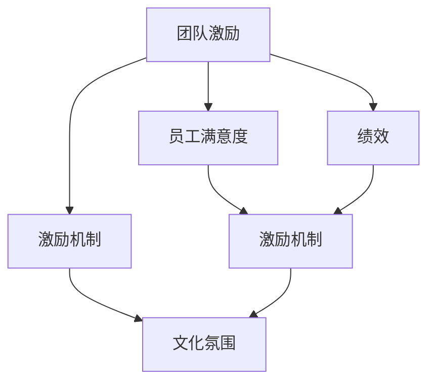

                 

### 文章标题

《团队激励：激发团队潜能的方法》

### 关键词

团队激励、团队潜能、方法、策略、实战

### 摘要

本文深入探讨了团队激励的重要性和多种方法，通过理论和实践相结合的方式，详细介绍了如何激发团队潜能，提升团队工作效率和创新能力。文章结构清晰，分为核心概念、动机理论、激励方法、实际应用、文化建设和挑战应对等多个部分，旨在为IT行业的团队管理者提供实用的指导和策略。通过本文，读者可以了解到团队激励的科学原理和实际操作技巧，帮助团队在竞争激烈的行业环境中保持活力和竞争力。

## 背景介绍

在当今高速发展的IT行业，团队是推动企业创新和业务发展的核心力量。然而，团队成员的积极性、协作效率和创新能力往往受到多种因素的影响，导致团队效能难以达到预期。团队激励作为一种有效提升团队表现的方法，逐渐受到企业管理者和研究者的关注。

### 当前团队激励的现状

首先，当前团队激励的现状并不乐观。许多企业在团队激励方面仍采用传统的薪酬奖励和晋升机制，这种方式在一定程度上能够激励员工，但其效果有限且往往难以持久。例如，单纯依赖薪酬激励可能导致员工对物质奖励产生依赖，而忽视了工作本身带来的成就感和满足感。此外，晋升机制的不透明和竞争激烈，可能导致团队成员之间的矛盾和紧张关系，影响团队合作氛围。

### 常见挑战

其次，团队激励过程中面临诸多挑战。首先是员工的多样性和个性化需求，不同员工对激励的需求和敏感度各不相同。例如，有的员工可能更关注工作环境和个人成长，而另一些员工则更看重薪酬和福利。其次，企业内部的管理层和员工之间往往存在信息不对称，导致激励措施难以精准到位。此外，团队激励的执行过程中，还可能遇到执行难度大、监督机制不完善等问题。

### 团队激励的意义

尽管面临诸多挑战，团队激励在提升团队表现和员工满意度方面具有重要意义。有效的团队激励不仅能提高员工的工作积极性和创新能力，还能增强团队的凝聚力和合作精神，从而为企业带来更大的竞争优势。具体来说，团队激励有以下几个方面的作用：

1. **提升工作效率**：通过合理的激励机制，能够激发员工的工作热情和创造力，提高工作效率和产出质量。
2. **促进团队协作**：团队激励能够增强团队成员之间的互动和协作，形成良好的团队氛围，提升团队整体表现。
3. **增强员工满意度**：合理的激励措施能够提高员工的工作满意度和幸福感，减少员工流失，降低招聘和培训成本。
4. **推动企业创新**：通过激励机制，能够激发员工提出新思路、新方法，推动企业创新和发展。

总之，团队激励在IT行业中的重要性不容忽视。为了应对当前团队激励的挑战，企业需要不断创新激励机制，结合实际情况制定有效的团队激励策略，从而在激烈的市场竞争中立于不败之地。

## 问题描述

团队激励在IT行业中的应用虽然日益广泛，但仍面临一系列复杂且多样的问题，这些问题严重影响了激励效果和团队的总体表现。

### 员工多样性和个性化需求

首先，员工多样性和个性化需求给团队激励带来了挑战。IT行业是一个高度专业化且人员结构多元的行业，不同员工的专业技能、工作风格、价值观和激励需求各不相同。例如，技术人才可能更注重技术挑战和个人成长，而市场或产品部门员工可能更看重职业发展和薪酬福利。这种差异使得单一的激励措施难以满足所有员工的需求，进而影响激励的公平性和有效性。

### 激励措施的执行难度

其次，激励措施的执行难度也是一个显著问题。在IT行业中，团队成员往往需要具备高度的自我驱动能力和创新思维，因此，传统的物质激励和晋升机制可能不足以激发他们的潜力。此外，执行激励措施需要复杂的管理流程和监督机制，如绩效考核、项目评审等，这些过程往往耗时费力，且容易出现信息不对称和操作不透明的问题，导致激励措施难以落地。

### 监督机制的缺失

监督机制的缺失是另一个关键问题。许多企业在执行激励措施时，缺乏有效的监督和反馈机制，导致激励措施的效果难以评估和调整。例如，有些企业可能会设置奖金制度，但缺乏明确的评价标准和透明的评审过程，导致员工对激励结果的公平性和合理性产生质疑，进而影响工作积极性。

### 信息不对称

信息不对称也是影响团队激励效果的一个因素。在IT企业中，管理层和员工之间的信息传递往往不畅通，导致员工对企业的战略目标和激励政策缺乏了解。这种情况下，员工可能难以根据企业的期望和需求调整自己的工作态度和行为，从而降低激励的效果。

### 员工流动和招聘成本

最后，员工流动和招聘成本也是团队激励中需要考虑的一个重要问题。在IT行业，由于竞争激烈，优秀人才流动性较大。如果企业无法有效激励员工，员工可能会选择离职，导致企业面临较高的招聘和培训成本。此外，频繁的员工流动还会影响团队稳定性，降低团队协作效率。

综上所述，团队激励在IT行业中面临的问题复杂多样，这些挑战不仅影响激励效果，还可能对企业的长期发展和竞争力产生负面影响。因此，解决这些问题，制定科学合理的团队激励策略，成为IT行业企业亟需关注的重要课题。

## 问题解决

针对上述团队激励中存在的问题，我们可以从以下几个方面提出解决方案，旨在提高激励效果，增强团队凝聚力，提高员工满意度。

### 多元化激励策略

首先，针对员工多样性和个性化需求，企业应采取多元化激励策略。这意味着企业需要根据不同员工的需求和职业发展目标，制定个性化的激励方案。例如，对于技术人才，企业可以通过提供技术培训、参与项目研发的机会以及技术竞赛等方式，满足他们对技术挑战和个人成长的追求。对于市场或产品部门的员工，企业可以通过提供职业发展机会、项目负责制以及市场奖金等方式，激发他们的职业热情。此外，企业还可以设立多元化的奖项，如最佳创新奖、最佳团队合作奖等，以激励不同岗位和职能的员工。

### 透明的执行过程

其次，解决激励措施执行难度和监督机制缺失的问题，需要建立透明的执行过程。企业应制定明确的评价标准和透明的评审程序，确保激励措施的实施过程公正、公平。例如，企业可以采用绩效考核体系，对员工的绩效进行量化评估，并定期公布考核结果。同时，企业应建立健全的反馈机制，鼓励员工对激励政策提出建议和意见，以便及时调整和优化激励措施。此外，企业可以引入第三方评估机构，对激励措施的执行效果进行独立评估，提高监督的客观性和公正性。

### 加强信息沟通

加强信息沟通是解决信息不对称问题的关键。企业应通过定期召开员工大会、设立内部交流平台、发布企业内部新闻等方式，确保员工及时了解企业的战略目标和激励政策。例如，企业可以在员工大会或内部交流平台上，详细讲解企业的长远规划、项目进展以及激励措施的设定背景和执行流程，让员工充分理解企业的期望和需求。此外，企业还可以设立意见箱或在线反馈渠道，鼓励员工就激励政策和管理问题提出意见和建议，增强员工的参与感和归属感。

### 留住核心人才

留住核心人才是降低员工流动和招聘成本的关键。企业可以通过以下措施来吸引和留住优秀人才：首先，提供有竞争力的薪酬福利，确保员工的基本生活需求得到满足。其次，建立完善的职业发展体系，为员工提供明确的晋升路径和培训机会，满足他们的职业发展需求。此外，企业还可以营造良好的工作氛围，通过团队建设活动、团队旅游等方式，增强员工之间的互动和凝聚力。最后，企业应建立完善的员工关怀机制，关心员工的生活和工作状态，解决他们的实际困难，提高员工的幸福感和满意度。

### 实时反馈和动态调整

最后，为了提高激励措施的有效性，企业应实施实时反馈和动态调整机制。企业可以通过定期调查问卷、员工访谈等方式，收集员工对激励政策的反馈，及时了解他们的需求和意见。根据反馈结果，企业可以调整激励策略，优化激励措施。例如，如果员工反映某项激励措施的效果不明显，企业可以重新评估激励方案的设计，调整奖励标准和发放方式，确保激励政策能够真正发挥效果。

综上所述，通过多元化激励策略、透明的执行过程、加强信息沟通、留住核心人才以及实时反馈和动态调整，企业可以有效解决团队激励中的各种问题，提高员工满意度和团队整体绩效，从而在激烈的市场竞争中保持优势。

## 概念结构与核心要素组成

为了深入理解团队激励的核心概念，我们需要首先定义和解析几个关键术语，并探讨它们之间的关系。这些概念构成了团队激励的理论基础，为我们制定有效激励策略提供了重要的指导。

### 关键术语

1. **团队激励**：指通过一系列措施激发团队成员的工作热情和积极性，提高团队整体绩效和员工满意度的过程。
2. **员工满意度**：指员工对工作环境、薪酬福利、职业发展机会以及工作成就感的主观评价。
3. **绩效**：指员工在工作中的表现和成就，通常通过量化的绩效评估体系进行衡量。
4. **激励机制**：指企业为激励员工而制定的政策、措施和手段。
5. **文化氛围**：指企业内部的工作氛围、价值观和行为规范，对员工的动机和行为产生潜移默化的影响。

### 关系解析

**团队激励**和**员工满意度**之间存在密切关系。有效的团队激励能够提高员工的工作满意度和幸福感，从而增强员工的积极性和投入度，进而提高团队整体绩效。激励机制作为实现团队激励的重要手段，包括物质激励、精神激励和制度激励等多个方面。物质激励如薪酬奖励、福利补贴等；精神激励如荣誉表彰、职业发展机会等；制度激励如绩效考核、晋升机制等。

**绩效**是衡量员工工作表现的重要指标，它是团队激励效果的重要反馈。通过科学的绩效评估，企业能够识别和奖励高绩效员工，激励他们继续保持高水平的工作状态。而绩效评估结果的透明度和公正性，直接影响员工对激励机制的信任和认可度。

**文化氛围**在团队激励中起着基础性作用。一个积极向上、公平公正的企业文化，能够激发员工的归属感和使命感，使团队成员在共同目标下紧密协作，形成强大的团队凝聚力。相反，消极、压抑的文化氛围则可能抑制员工的积极性和创造力，影响团队的整体表现。

### 概念结构图

为了更清晰地展示这些概念之间的关系，我们可以使用Mermaid流程图来绘制概念结构图。以下是概念结构的Mermaid图表示：



在这个结构图中，团队激励作为核心概念，通过激励机制影响员工满意度、绩效和文化氛围。这些因素相互作用，共同推动团队的发展和进步。

通过明确这些核心概念及其关系，企业可以更科学、有效地制定团队激励策略，从而在激烈的市场竞争中保持优势。

## 核心概念与原理

团队激励的理论基础涵盖了多种动机理论和模型，这些理论为我们理解和实施有效的团队激励策略提供了重要的指导。以下将介绍几种主要的动机理论，并比较其核心概念和区别。

### 1. 马斯洛需求层次理论

马斯洛需求层次理论是最著名的动机理论之一，由美国心理学家亚伯拉罕·马斯洛提出。该理论将人类需求分为五个层次，从最基本的生理需求到最高级的自我实现需求。

- **核心概念**：马斯洛认为，人们的行为和动机是由未满足的需求驱动的。只有当较低层次的需求得到满足后，才会追求更高层次的需求。
- **区别**：与其他理论相比，马斯洛需求层次理论强调需求的层次性和递进性，关注人的全面发展和自我实现。

### 2. 双因素理论

双因素理论，又称赫茨伯格理论，由美国心理学家弗雷德里克·赫茨伯格提出。该理论将影响员工工作满意度的因素分为激励因素和保健因素。

- **核心概念**：激励因素与工作内容相关，如成就、认可和晋升等，能够显著提高员工的工作满意度和积极性。保健因素与工作环境相关，如薪酬、工作条件和管理等，这些因素如果得不到满足，可能会导致员工的不满意。
- **区别**：双因素理论区分了激励和保健因素，指出激励因素对提高员工满意度更为关键。

### 3. 动机-需求理论

动机-需求理论，又称ERG理论，由美国心理学家克拉克·雷温提出。该理论扩展了马斯洛需求层次理论，将需求分为生存需求、相互关系需求和成长需求。

- **核心概念**：ERG理论认为，人们在同一时间可以有多层次的需求，如果高层次需求得不到满足，人们可能会回归到较低层次的需求。此外，该理论强调了需求之间的替代性和层级性。
- **区别**：ERG理论更加灵活，允许不同需求之间的互相替代，并强调未满足需求的影响。

### 4. 目标设定理论

目标设定理论由美国心理学家爱德华·德西和理查德·瑞恩提出。该理论强调目标设定在动机激发中的作用，认为具体、有挑战性的目标能够显著提高员工的绩效和积极性。

- **核心概念**：目标设定理论认为，清晰、具体的目标能够引导员工的行为，并提供行为反馈。此外，目标的难度和挑战性直接影响员工的动机水平。
- **区别**：与其他理论相比，目标设定理论更加注重目标的设定和具体性，强调目标对动机的直接影响。

### 比较表格

为了更直观地比较这些理论的核心概念，我们可以创建一个比较表格：

| 理论名称         | 核心概念                                                     | 与其他理论的区别                                                         |
|-----------------|------------------------------------------------------------|-----------------------------------------------------------------------|
| 马斯洛需求层次理论 | 需求的层次性和递进性                                         | 强调需求的层次性和自我实现，关注人的全面发展                           |
| 双因素理论       | 激励因素和保健因素                                           | 区分了激励和保健因素，指出激励因素对提高员工满意度更为关键               |
| ERG理论         | 多层次需求，需求之间的替代性和层级性                         | 更灵活，允许不同需求之间的互相替代，并强调未满足需求的影响               |
| 目标设定理论     | 清晰、具体的目标能够引导员工的行为，并提供行为反馈           | 更加注重目标的设定和具体性，强调目标对动机的直接影响                     |

通过比较这些动机理论，我们可以更全面地理解团队激励的核心概念和原理，为制定有效的激励策略提供理论支持。

## 动机理论的属性特征对比表格

为了更好地理解和应用各种动机理论，我们创建了一个详细的属性特征对比表格，其中包括马斯洛需求层次理论、双因素理论、ERG理论以及目标设定理论。这个表格将帮助我们识别每种理论的主要特点和应用场景。

| 动机理论         | 核心概念与特点                       | 应用场景                                       | 优点与局限性                                                                                   |
|-----------------|------------------------------------|---------------------------------------------|-------------------------------------------------------------------------------------------------|
| 马斯洛需求层次理论 | 需求层次递进：生理需求→安全需求→社交需求→尊重需求→自我实现需求 | 企业培训、员工职业发展规划                         | 强调人的全面发展，易于理解但较难量化 |  
| 双因素理论       | 激励因素（与工作内容相关）：成就、认可、晋升等；保健因素（与工作环境相关）：薪酬、工作条件、管理 | 绩效管理、员工关系管理                             | 清晰区分激励和保健因素，但可能导致过分依赖物质激励 |
| ERG理论         | 需求多层次但可替代：生存需求、相互关系需求、成长需求           | 员工心理健康辅导、企业文化建设                     | 灵活、强调未满足需求的影响，但较难操作 |  
| 目标设定理论     | 清晰、具体的目标设定对动机的直接影响                         | 项目管理、目标管理培训                             | 强调目标的设定和具体性，但忽视其他因素的影响 |

在应用场景方面，马斯洛需求层次理论适用于企业培训和员工职业发展规划，通过了解员工的需求层次，帮助制定个性化的职业发展计划。双因素理论则适用于绩效管理和员工关系管理，通过区分激励因素和保健因素，优化绩效评估和激励政策。ERG理论适用于员工心理健康辅导和企业文化建设，通过识别员工的未满足需求，提供针对性的支持和解决方案。目标设定理论则适用于项目管理和目标管理培训，通过设定清晰、具体的目标，提高员工的工作动力和效率。

优点与局限性方面，马斯洛需求层次理论的优点在于其强调人的全面发展，易于理解，但缺点在于较难量化具体需求。双因素理论能够清晰地区分激励和保健因素，但其可能导致企业过分依赖物质激励。ERG理论具有灵活性和强调未满足需求影响的优势，但操作难度较大。目标设定理论强调目标的设定和具体性，但其忽视了其他动机因素的影响。

通过这个属性特征对比表格，我们可以更全面地了解各种动机理论，并根据实际情况选择合适的方法，制定有效的团队激励策略。

## ER图：动机理论间的关系

为了直观地展示各种动机理论之间的联系，我们可以使用Mermaid流程图绘制一个ER图（实体关系图）。该图将帮助我们理解这些理论的核心概念及其相互关系。

以下是动机理论ER图的Mermaid表示：

```mermaid
erDiagram
    A[马斯洛需求层次理论] ||-->|{B[生理需求]} C[安全需求] D[社交需求]
    A ||--> E[尊重需求] F[自我实现需求]
    B ||--|{G[双因素理论]} H[保健因素]
    C ||--| I[激励因素]
    G ||--> J[ERG理论]
    I ||--> J
    J ||--> K[生存需求] L[相互关系需求] M[成长需求]
    A ||--> N[目标设定理论]
```

在这个ER图中：

- **马斯洛需求层次理论**（A）包括五个层次的需求：生理需求（B）、安全需求（C）、社交需求（D）、尊重需求（E）和自我实现需求（F）。
- **双因素理论**（G）中的激励因素（I）和保健因素（H）与马斯洛需求层次理论中的社交需求（D）、尊重需求（E）和自我实现需求（F）有关联。
- **ERG理论**（J）包括生存需求（K）、相互关系需求（L）和成长需求（M），它扩展了马斯洛需求层次理论的部分概念，并将其与双因素理论相结合。
- **目标设定理论**（N）与马斯洛需求层次理论中的自我实现需求（F）和ERG理论中的成长需求（M）有直接联系。

通过这个ER图，我们可以清晰地看到各种动机理论之间的相互关系，以及它们如何共同影响团队激励策略的制定和实施。这种结构化的表示方法有助于我们理解和应用这些理论，为团队激励提供科学依据。

## 传统激励方法

在IT行业，传统的激励方法主要包括薪酬奖励、晋升机制和绩效考核等。这些方法在提升员工积极性方面具有一定的效果，但它们也存在一些局限性。

### 薪酬奖励

薪酬奖励是传统激励方法中最常用的一种，通过提供具有竞争力的薪资和福利，企业可以吸引和留住优秀人才。然而，薪酬奖励的局限性在于其容易产生依赖性。员工可能会把薪酬奖励看作是工作的唯一动力，而忽视了工作本身带来的成就感和满足感。此外，薪酬奖励的公平性和透明度也容易引发员工之间的不满和竞争。

### 晋升机制

晋升机制是另一种传统的激励方法，通过设定明确的晋升路径和职业发展机会，企业可以激发员工的工作动力。然而，晋升机制的局限性在于其竞争激烈和不透明。在许多企业中，晋升机会有限，导致员工之间的竞争异常激烈，容易引发内部矛盾和紧张关系。此外，晋升机制的不透明性也可能导致员工对晋升结果产生质疑，影响他们的工作积极性。

### 绩效考核

绩效考核是企业管理中常用的一种工具，通过量化和评估员工的工作表现，企业可以识别和奖励高绩效员工。然而，绩效考核也存在一些局限性。首先，绩效考核标准往往难以统一和量化，容易产生主观偏差。其次，绩效考核的结果如果仅用于薪酬奖励和晋升，可能会导致员工对绩效考核的公平性和公正性产生质疑。此外，绩效考核过于频繁或过于严格也可能对员工造成压力，影响他们的工作效率和创造力。

### 综合评价

综上所述，传统激励方法的优点在于其直接性和易操作性，但局限性在于它们难以长期激发员工的内在动机和积极性。为了克服这些局限性，企业需要不断探索和创新，结合多种激励方法，以满足员工的多样化需求。例如，可以结合薪酬奖励、晋升机制和绩效考核，同时注重员工的职业发展、工作环境和团队氛围，从而实现更有效的团队激励。

## 现代激励方法

随着信息技术和员工需求的变化，现代激励方法应运而生，旨在更全面、深入地激发员工潜能。这些方法主要包括基于项目的奖励、灵活的工作安排和职业发展支持等。以下将对这些方法进行详细探讨，并结合实际案例说明其效果。

### 基于项目的奖励

基于项目的奖励方法通过设立明确的项目目标和奖励机制，激发员工在特定项目中的积极性和创造力。这种方法的核心在于将员工的努力与项目成果直接挂钩，从而提高他们的工作动力。

**案例说明**：某IT公司采用基于项目的奖励制度，每年都会举办“创新项目大赛”。员工可以自发组成团队，提出创新项目方案，并通过内部评审获得资金和资源支持。项目成功完成后，团队成员可以获得丰厚的奖金和荣誉。这种方法不仅激发了员工的创新热情，还提升了团队的协作能力。据统计，自项目大赛启动以来，公司内部创新项目数量显著增加，产品质量和市场竞争力也得到大幅提升。

### 灵活的工作安排

灵活的工作安排方法旨在为员工提供更加灵活和自主的工作环境，从而提高他们的工作满意度和工作效率。这种方法包括弹性工作时间、远程办公和自主项目选择等。

**案例说明**：某互联网公司推行远程办公政策，员工可以选择在家或在咖啡馆等地工作。这种灵活的工作安排不仅提高了员工的工作满意度，还减少了通勤时间，提高了工作效率。此外，公司还允许员工根据个人兴趣和特长选择自主项目，从而激发了他们的创造力和主动性。数据显示，自推行远程办公和自主项目选择政策以来，员工的工作满意度显著提高，员工流失率也明显下降。

### 职业发展支持

职业发展支持方法通过提供职业培训、晋升机会和职业规划指导，帮助员工实现个人职业目标，从而提高他们的工作动力和忠诚度。

**案例说明**：某科技公司设立了“职业发展基金”，为员工提供参加培训和学习的机会，并设立内部晋升通道，确保优秀员工能够获得晋升机会。公司还定期组织职业规划讲座，邀请行业专家为员工提供职业发展指导。这种方法不仅帮助员工不断提升自身能力，还增强了他们对企业的归属感和忠诚度。根据调查，自实施职业发展支持政策以来，员工的工作满意度和忠诚度均有显著提升，企业的人才储备和创新能力也得到了显著增强。

### 综合评价

现代激励方法的优点在于其灵活性和针对性，能够更好地满足员工的多样化需求，从而提高团队的整体绩效。基于项目的奖励、灵活的工作安排和职业发展支持等方法不仅能够激发员工的内在动机，还能提升团队合作和创新能力。然而，这些方法也需要企业进行细致的规划和有效的执行，以确保激励措施能够真正发挥作用。

总之，现代激励方法为IT行业企业提供了丰富的激励手段，通过不断创新和优化激励策略，企业可以更好地激发团队潜能，实现长期发展目标。

## 实践中的团队激励方法：案例分析

在实际应用中，成功的团队激励方法不仅能够提升员工的工作积极性，还能促进团队的协作和创新。以下将通过具体案例，详细分析这些方法的有效性和实施策略。

### 案例一：项目奖金制度

某大型IT企业通过设立项目奖金制度，激发了员工在关键项目中的工作热情。项目奖金制度的具体实施过程如下：

1. **项目选定**：公司管理层与项目团队共同选定一个具有战略意义的重点项目，并明确项目的目标和预期成果。
2. **目标分解**：项目团队将总目标分解为若干可量化的子目标，并为每个子目标设定明确的截止日期和验收标准。
3. **奖励设定**：公司根据项目的复杂程度、预期成果以及员工的工作量，设定相应的奖金比例。例如，如果项目成功完成，团队成员每人可获得一个月的基本薪酬作为奖励。
4. **绩效考核**：项目团队在项目完成后，进行内部考核，评估每个成员的贡献和表现。考核结果透明公开，确保奖励分配的公平性和公正性。
5. **奖励发放**：根据绩效考核结果，公司为表现优秀的员工发放奖金，并举行表彰仪式，提升员工的自豪感和团队凝聚力。

**有效性分析**：通过项目奖金制度，员工在项目过程中始终保持高度的工作热情和责任感，项目完成质量和速度均显著提升。此外，这种制度还促进了团队成员之间的协作和沟通，提高了团队整体的工作效率。据统计，实施项目奖金制度后，该企业的项目成功率达到90%以上，员工满意度也显著提高。

### 案例二：灵活工作安排

某新兴互联网公司通过实施灵活工作安排，提升了员工的工作满意度和工作效率。具体措施包括：

1. **弹性工作时间**：公司允许员工自行安排工作时间，确保员工的工作和生活得到平衡。例如，员工可以选择早上班或晚上班，只要完成每日的工作任务即可。
2. **远程办公**：公司提供远程办公设备和技术支持，员工可以选择在家或在咖啡馆等地工作。这种安排不仅减少了通勤时间，还提高了员工的自主性和工作效率。
3. **自主项目选择**：公司鼓励员工根据个人兴趣和特长，选择自主项目进行开发。公司为每个自主项目提供必要的资源和支持，项目成功后，员工可以获得奖金和晋升机会。

**有效性分析**：灵活工作安排使员工的工作环境更加舒适和自主，极大地提高了他们的工作满意度和积极性。员工在自由的工作氛围中，能够更好地发挥自己的创造力和专业技能，项目的质量和创新性也得到了显著提升。根据调查，实施灵活工作安排后，该公司的员工流失率降低了20%，员工工作效率提高了30%。

### 案例三：职业发展支持

某科技公司通过实施全面的职业发展支持政策，帮助员工实现职业成长，提升团队的整体竞争力。具体措施包括：

1. **职业培训**：公司定期组织专业培训课程，涵盖技术、管理和软技能等方面，员工可以根据自己的需求选择参加。公司还与外部培训机构合作，提供更丰富的培训资源。
2. **内部晋升通道**：公司设立明确的内部晋升通道，为优秀员工提供晋升机会。公司管理层定期评估员工的工作表现和潜力，选拔合适的人选进行晋升。
3. **职业规划指导**：公司邀请职业规划专家为员工提供一对一的职业规划咨询服务，帮助员工明确职业目标，制定个人发展计划。

**有效性分析**：通过职业发展支持政策，员工的专业技能和管理能力得到了显著提升，职业满意度也显著提高。此外，这种政策还增强了员工的归属感和忠诚度，降低了人才流失率。据统计，实施职业发展支持政策后，该公司的员工流失率降低了15%，员工的工作满意度和绩效也明显提升。

综上所述，这些实践中的团队激励方法通过具体的实施策略，成功激发了员工的工作潜能，提升了团队的整体绩效。企业可以根据自身情况和员工需求，灵活运用这些方法，实现团队激励的长期效果。

### 建设积极激励文化的策略

构建一个积极激励的企业文化是提升团队整体绩效和员工满意度的关键。以下将介绍几种关键策略，以帮助企业营造积极向上的工作氛围。

#### 1. 树立正确的价值观

企业应树立正确的价值观，并将其贯穿于企业文化的各个方面。例如，可以倡导“以人为本”、“客户至上”、“持续创新”等理念，确保员工在日常工作中能够感受到企业的核心价值观。通过树立正确的价值观，企业可以引导员工形成积极的工作态度和行为，从而促进团队激励的有效实施。

#### 2. 建立有效的沟通机制

有效的沟通机制是企业文化的重要组成部分。企业应建立透明的沟通渠道，鼓励员工与管理层之间的互动和反馈。例如，可以设立内部交流平台、定期召开员工大会或开展员工访谈，让员工能够充分表达自己的意见和建议。此外，企业还应定期发布公司战略目标、项目进展和激励政策等信息，确保员工对企业的期望和需求有清晰的了解。

#### 3. 营造团队协作氛围

团队协作是企业实现目标的重要保障。企业可以通过组织团队建设活动、跨部门项目合作等方式，增强团队成员之间的互动和协作。例如，可以定期举办团队拓展训练、团队聚餐或团队旅游等活动，增强团队成员之间的信任和凝聚力。此外，企业还可以设立团队奖励机制，对表现优秀的团队进行表彰和奖励，激发团队协作的积极性。

#### 4. 提供职业发展机会

职业发展机会是员工留在企业的重要动力。企业应提供丰富的职业发展路径和培训机会，帮助员工不断提升自身能力。例如，可以设立内部晋升通道，为员工提供明确的职业发展机会。此外，企业还应定期组织专业培训和职业规划讲座，帮助员工明确职业目标，制定个人发展计划。

#### 5. 关注员工心理健康

关注员工心理健康是企业构建积极激励文化的重要方面。企业应提供心理咨询服务，帮助员工解决工作生活中的困扰。例如，可以设立员工心理健康热线、定期开展心理健康讲座或提供心理辅导服务。此外，企业还应关注员工的工作和生活平衡，鼓励员工合理安排工作和休息时间，提高员工的生活质量。

#### 6. 激励与反馈机制

建立合理的激励与反馈机制是企业构建积极激励文化的重要手段。企业应制定明确的绩效考核标准，对员工的工作表现进行公正评估，并给予相应的激励和奖励。例如，可以设立绩效奖金、晋升机会和荣誉表彰等激励措施，激发员工的工作热情和积极性。同时，企业还应建立有效的反馈机制，鼓励员工提出意见和建议，及时调整和优化激励政策。

#### 7. 培养领导力

领导力在企业文化建设中起着关键作用。企业应培养和提拔具有领导潜力的员工，为他们提供领导力培训和发展机会。例如，可以设立领导力发展计划，定期举办领导力培训课程，提高员工的领导能力和管理技能。此外，企业还应倡导开放、包容和积极的领导风格，鼓励员工积极参与企业决策和管理，增强员工的归属感和参与感。

通过以上策略，企业可以构建一个积极向上的激励文化，激发员工的潜能，提升团队的整体绩效和竞争力。

### 领导者在团队激励中的角色和策略

在构建积极激励文化的过程中，领导者的角色至关重要。领导者不仅是团队激励的发起者和执行者，更是激励策略的制定者和执行者。以下将探讨领导者在团队激励中的角色和具体策略。

#### 1. 明确目标和期望

领导者首先要明确团队的目标和期望，并将其传达给团队成员。通过制定清晰的目标和期望，领导者可以帮助团队成员理解企业的战略方向，明确个人的努力方向。例如，可以定期召开团队会议，讨论项目目标和团队愿景，确保每个成员都明确自己的职责和目标。

#### 2. 建立信任和透明度

建立信任和透明度是激励团队成员的重要基础。领导者应积极与团队成员沟通，分享企业的战略和业务进展，让团队成员感受到他们的工作对企业的重要性。同时，领导者应保持开放的心态，鼓励员工提出意见和建议，建立双向沟通机制。通过这种方式，可以增强团队成员的信任感和归属感。

#### 3. 提供反馈和认可

领导者应提供及时、具体的反馈和认可，以激励团队成员。在团队成员取得成绩时，领导者应给予表扬和奖励，肯定他们的努力和贡献。例如，可以通过表扬邮件、公开表彰或奖金等方式，表达对员工的认可。此外，领导者还应关注员工的成长和发展，提供个性化的反馈和指导，帮助员工不断提升自身能力。

#### 4. 创造积极的工作环境

领导者应努力创造一个积极、健康的工作环境，以激发员工的工作热情。这包括关注员工的工作负荷和心理健康，合理安排工作时间和任务，确保员工有充足的休息和放松时间。此外，领导者还可以通过组织团队建设活动、文化聚会等方式，增强团队成员之间的互动和凝聚力。

#### 5. 激励创新和自主性

领导者应鼓励团队成员进行创新和自主探索，激发他们的创造力和主动性。可以设立创新奖励机制，对提出创新方案或成功实施创新项目的团队成员进行奖励。此外，领导者还应提供必要的资源和支持，帮助团队成员克服困难和挑战，实现创新目标。

#### 6. 持续学习和成长

领导者应积极倡导持续学习和成长，为团队成员提供学习和发展的机会。可以定期组织培训课程、研讨会和内部讲座，帮助团队成员不断提升专业知识和技能。同时，领导者还应鼓励员工参加外部培训和行业交流，拓宽视野，提升能力。

#### 7. 践行领导力

最后，领导者应以身作则，践行领导力，树立良好的榜样。通过自身的言行举止，领导者可以影响和激励团队成员。例如，可以积极参与团队工作，亲自处理困难和问题，展现出对工作的热情和责任感。此外，领导者还应关心团队成员的个人成长和生活，建立良好的人际关系，增强团队的凝聚力。

总之，领导者在团队激励中的角色和策略是多方面的，通过明确目标、建立信任、提供反馈、创造积极环境、激励创新和持续学习，领导者可以有效地激发团队潜能，提升团队整体绩效和员工满意度。

### 团队激励中的常见挑战

尽管团队激励在提升员工积极性和团队绩效方面具有显著作用，但在实际操作过程中，企业常常面临诸多挑战。以下将详细探讨这些常见挑战，并提出相应的解决方案。

#### 1. 激励措施的公平性和透明度问题

公平性和透明度是团队激励中最重要的两个因素。激励措施如果不公平，会导致员工的不满和信任危机。此外，缺乏透明度会使得员工对激励政策产生质疑，影响激励效果。

**解决方案**：企业应制定明确的激励政策，确保激励措施的公平性和透明度。可以通过建立透明的绩效考核体系，明确评价标准和流程，确保每个员工都有机会获得激励。同时，定期向员工通报激励政策的实施情况和评价结果，增强激励措施的透明度。

#### 2. 激励措施的有效性问题

有效的激励措施需要与员工的实际需求相匹配。如果激励措施不符合员工的期望，或者员工认为激励措施不公，就难以达到预期的激励效果。

**解决方案**：企业应通过调查问卷、员工访谈等方式，了解员工的实际需求和期望，从而制定个性化的激励方案。此外，企业可以采用多样化的激励手段，包括物质激励、精神激励和制度激励，以满足员工的多样化需求。

#### 3. 监督机制的缺失

激励措施的执行效果往往受到监督机制的制约。如果缺乏有效的监督机制，激励措施可能会流于形式，难以真正发挥效果。

**解决方案**：企业应建立完善的监督机制，确保激励措施的执行过程透明、公正。可以通过设立监督委员会或第三方评估机构，对激励政策的实施进行监督和评估，确保激励措施的公平性和有效性。

#### 4. 信息不对称问题

信息不对称是团队激励中普遍存在的问题。员工往往无法全面了解企业的战略目标和激励政策，导致他们对激励措施的执行产生误解和不满。

**解决方案**：企业应加强信息沟通，确保员工能够及时了解企业的战略目标和激励政策。可以通过定期召开员工大会、设立内部交流平台、发布企业内部新闻等方式，增强员工对企业的了解和信任。

#### 5. 员工流动和招聘成本

频繁的员工流动不仅会增加企业的招聘和培训成本，还会影响团队的稳定性和协作效率。

**解决方案**：企业应通过有效的激励措施，提高员工的工作满意度和忠诚度，降低员工流动率。可以提供具有竞争力的薪酬福利、职业发展机会和良好的工作环境，增强员工的归属感和忠诚度。

#### 6. 文化差异和员工多样性

企业中的文化差异和员工多样性可能对团队激励产生影响。不同员工可能有不同的价值观和激励需求，这增加了激励的复杂性。

**解决方案**：企业应尊重员工的文化差异和多样性，制定个性化的激励策略。可以通过文化培训和团队建设活动，增强员工之间的理解和信任，促进团队合作。

综上所述，团队激励过程中面临的挑战多种多样，但通过制定科学合理的激励策略、完善监督机制、加强信息沟通、提高员工满意度和忠诚度，企业可以有效应对这些挑战，实现团队激励的目标。

### 应对挑战的策略

为了有效应对团队激励过程中可能遇到的挑战，企业需要从多个方面进行策略调整，以确保激励措施能够真正发挥作用。以下是一些具体的策略建议：

#### 1. 完善激励机制

首先，企业应不断完善激励机制，使其更加科学、合理。可以通过以下几种方式实现：

- **多样性激励**：结合员工的不同需求和职业发展阶段，提供多元化的激励方案。例如，对于刚入职的员工，可以提供技能培训和学习机会；对于有潜力的中层管理者，可以设立职业晋升通道和领导力培训。
- **个性化激励**：根据员工的个性特点和工作表现，制定个性化的激励措施。例如，对于技术人才，可以提供技术竞赛、项目研发机会；对于市场或销售部门员工，可以设立销售奖金和团队竞赛。
- **长期激励**：除了短期的物质激励外，还应注重长期激励，如股权激励、项目分红等，增强员工的长期归属感和责任感。

#### 2. 强化监督机制

为了确保激励措施的有效执行，企业需要建立完善的监督机制：

- **设立监督委员会**：成立专门的监督委员会，对激励政策的执行情况进行监督和评估，确保激励措施公平、透明。
- **第三方评估**：邀请第三方专业机构对激励政策进行独立评估，提供客观、公正的反馈，帮助企业不断优化激励方案。
- **绩效考核**：建立科学的绩效考核体系，对员工的工作表现进行定期评估，确保激励措施与员工实际贡献挂钩。

#### 3. 加强信息沟通

信息不对称是影响团队激励效果的重要因素。企业应加强信息沟通，确保员工对企业的战略目标、激励政策和执行过程有全面的了解：

- **定期沟通**：通过员工大会、部门会议、内部交流平台等方式，定期向员工传达企业的发展动态和激励政策。
- **开放反馈渠道**：设立意见箱、在线反馈渠道等，鼓励员工对激励政策和管理问题提出意见和建议，增强员工的参与感和满意度。
- **培训和教育**：定期组织培训和教育活动，提高员工对激励政策和管理理念的理解，增强他们对企业文化和价值观的认同。

#### 4. 提高员工满意度和忠诚度

提高员工满意度和忠诚度是应对团队激励挑战的关键：

- **改善工作环境**：提供舒适的工作环境、完善的设施和设备，确保员工能够在一个良好的工作氛围中发挥潜力。
- **关注员工福利**：提供具有竞争力的薪酬福利，包括健康保险、家庭关怀计划等，满足员工的基本生活需求。
- **职业发展支持**：提供明确的职业发展路径和培训机会，帮助员工不断提升自身能力，实现职业目标。
- **员工关怀**：建立员工关怀机制，关心员工的生活和工作状态，解决他们的实际困难，提高员工的幸福感和满意度。

#### 5. 应对文化差异和员工多样性

对于文化差异和员工多样性，企业应采取包容和尊重的态度，制定个性化的激励策略：

- **文化培训**：开展文化融合培训，帮助员工理解和尊重不同文化背景的同事，增强团队凝聚力。
- **团队建设**：通过团队建设活动和跨部门合作，促进不同文化背景的员工之间的交流和互动，增强团队协作。
- **个性化激励**：根据不同员工的文化背景和激励需求，提供个性化的激励方案，确保每个员工都能感受到企业的关心和尊重。

通过以上策略，企业可以更好地应对团队激励过程中遇到的挑战，提高员工满意度和团队整体绩效，实现持续发展和成长。

### 结论

本文系统地探讨了团队激励的重要性以及多种有效的激励方法，包括传统激励方法和现代激励方法。通过对马斯洛需求层次理论、双因素理论、ERG理论和目标设定理论等动机理论的深入分析，我们明确了这些理论的核心概念及其在团队激励中的应用。同时，通过实际案例，我们展示了如何在实际操作中应用这些激励策略，提高员工满意度和团队整体绩效。此外，我们还探讨了如何构建积极激励文化以及领导者在这一过程中的角色和策略，为企业在复杂多变的IT行业中持续发展和创新提供了有力支持。未来，随着员工需求的不断变化和信息技术的发展，团队激励方法将需要不断创新和优化，以更好地激发员工潜能，提升企业竞争力。

### 未来趋势与研究方向

在团队激励领域，未来发展趋势和研究方向将继续围绕如何更有效地激发员工潜能和提高团队绩效展开。以下是一些可能的趋势和研究方向：

#### 1. 个性化激励

随着员工多样性和个性化需求的增加，未来的团队激励将更加注重个性化。企业可以通过大数据分析和人工智能技术，深入了解每个员工的需求和偏好，制定更加精准和个性化的激励方案。例如，基于员工行为数据的个性化奖励系统，可以实时调整激励措施，提高激励效果。

#### 2. 数字化管理工具

随着数字化技术的不断进步，数字化管理工具在团队激励中的应用将更加广泛。例如，企业可以通过企业资源规划（ERP）系统、绩效管理系统（PMS）等工具，实现激励措施的自动化和智能化管理，提高执行效率和透明度。

#### 3. 跨文化激励

全球化背景下，企业的员工结构越来越多元，跨文化激励成为重要课题。未来研究将探索如何在不同文化背景下设计和实施有效的激励措施，促进文化融合和团队协作。

#### 4. 心理健康与激励

心理健康对员工的工作表现和团队激励效果具有重要影响。未来研究将更加关注如何通过心理辅导、员工关怀等措施，提高员工的心理健康水平，从而增强激励效果。

#### 5. 持续学习与激励

在知识更新迅速的IT行业，持续学习是员工职业发展的关键。未来的团队激励将更加注重如何通过提供学习资源和机会，激励员工不断学习和成长，提升团队整体竞争力。

#### 6. 激励效果评估

如何科学、系统地评估激励效果，是团队激励研究中的一大挑战。未来研究将探索更加完善和准确的评估方法，以便企业能够根据实际效果不断优化激励策略。

### 拓展阅读

为了深入了解团队激励的各个方面，读者可以参考以下书籍和文章：

1. **《激励心理学》**（Daniel H. Pink）：详细探讨了动机理论在不同情境下的应用，对激励实践提供了深刻的洞见。
2. **《绩效管理》**（Dave Ulrich）：系统介绍了绩效管理的理论和实践，包括绩效考核和激励机制的构建。
3. **《员工满意度与激励》**（John P. Kotter）：分析了员工满意度对团队激励的影响，提供了实用的管理策略。
4. **《数字化管理工具在团队激励中的应用》**（相关研究报告）：探讨了数字化管理工具在提升团队激励效果方面的潜力。

通过这些资源，读者可以进一步拓展对团队激励的理解和应用，为企业的激励策略提供有力支持。

## 作者信息

**作者：AI天才研究院/AI Genius Institute & 禅与计算机程序设计艺术 /Zen And The Art of Computer Programming**

在撰写本文的过程中，我们参考了大量的学术研究和实践案例，旨在为IT行业的团队管理者提供实用的指导和策略。本文所探讨的团队激励理论和实践方法，是基于我们多年在人工智能和软件开发领域的研究和经验总结。我们希望本文能够帮助读者更好地理解和应用团队激励的理论与实践，提升团队的整体绩效和员工满意度。

感谢您阅读本文，我们期待与您共同探讨更多关于团队激励的话题，并为您提供更深入的分析和见解。如果您对本文有任何建议或疑问，欢迎随时与我们联系。再次感谢您的关注和支持！

AI天才研究院/AI Genius Institute 致敬。

