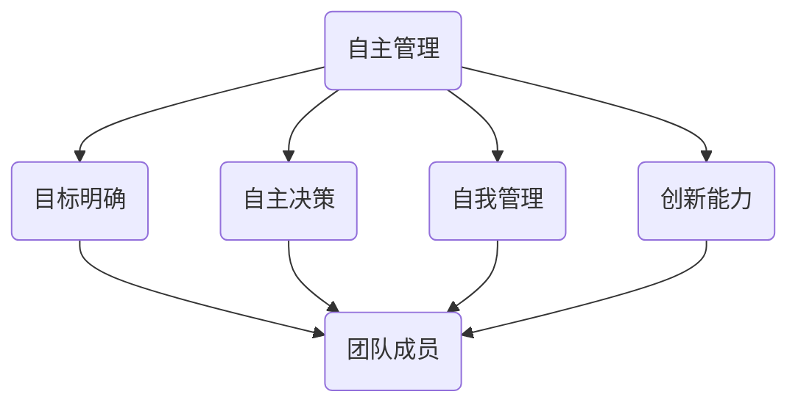
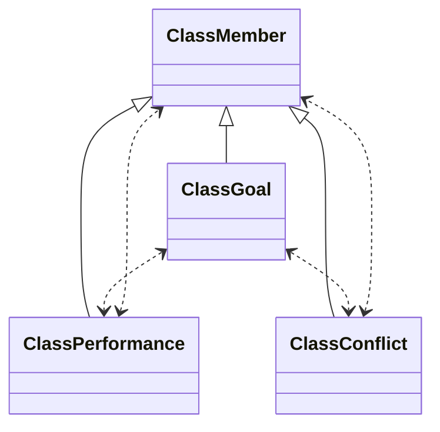
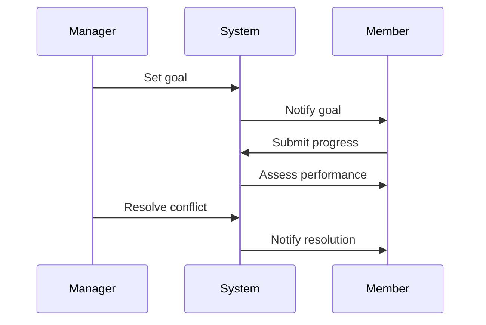
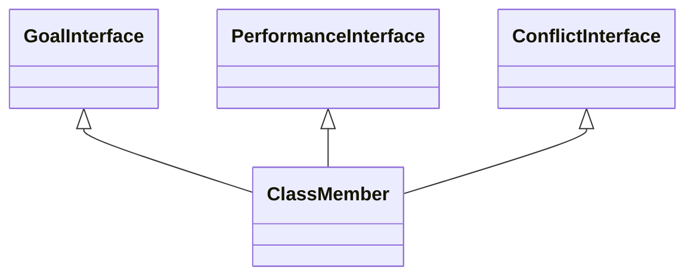
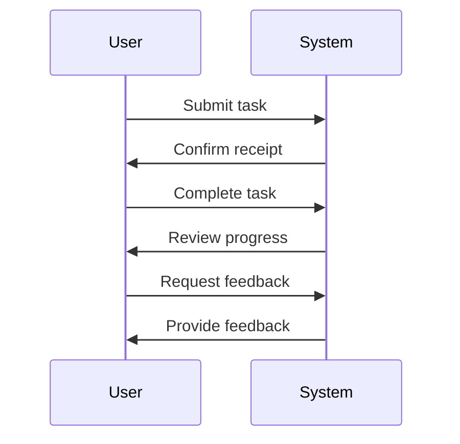

                 

# 团队赋能：从 micromanagement 到自主管理

关键词：团队管理、自主管理、micromanagement、领导力、团队赋能

摘要：本文深入探讨了从 micromanagement（微观管理）向自主管理转型的必要性和优势，通过详细的案例分析，为团队管理者提供了实用的策略和技巧，帮助团队实现从被动服从到主动进取的转变，提升整体绩效。

## 引言

### 1.1 问题的背景

在当今快速变化的工作环境中，团队管理面临着前所未有的挑战。传统的 micromanagement（微观管理）方式，即管理者对团队成员进行过度控制、细致监督，已逐渐显示出其局限性和负面影响。团队成员在这种管理模式下往往感到束缚，缺乏自主性和创造力，导致工作效率下降，创新能力受限。因此，实现从 micromanagement 到自主管理的转型，已成为提升团队效能的关键。

### 1.2 micromanagement 的问题

micromanagement 存在以下问题：

1. **抑制创新**：过度监督限制了个人的创造性思维和解决问题的能力。
2. **降低工作满意度**：员工感到不被信任，工作缺乏动机。
3. **增加管理成本**：管理者需要投入大量时间和精力进行监督和控制。

### 1.3 自主管理的优势

自主管理具有以下优势：

1. **提高工作效率**：团队成员拥有更多自主权，能够更好地安排工作流程。
2. **增强创新能力**：员工在自主管理环境中更有动力进行创新。
3. **提升团队凝聚力**：信任和尊重能够增强团队成员之间的合作。

### 1.4 书籍的目的和结构

本书旨在探讨 micromanagement 的问题和自主管理的优势，并提供实用的转型策略和实践案例。本书分为八个章节，具体结构如下：

- **第1章 引言**：介绍问题的背景和本书的目的。
- **第2章 micromanagement 概述**：详细描述 micromanagement 的定义、特征和影响。
- **第3章 自主管理概述**：介绍自主管理的定义、特征和优势。
- **第4章 从 micromanagement 向自主管理转型**：讨论转型策略和领导者的角色。
- **第5章 增强团队赋能的实践**：提供具体的实践方法。
- **第6章 避免自主管理陷阱**：讨论过度授权和冲突处理。
- **第7章 案例分析**：通过实际案例展示自主管理的应用。
- **第8章 总结与展望**：总结自主管理的未来趋势和实践注意事项。

## 第2章 micromanagement 概述

### 2.1 micromanagement 的定义

micromanagement，即微观管理，是指管理者对团队成员进行过度控制、细致监督的管理方式。这种管理模式强调对具体工作细节的严格把控，管理者通常需要了解并干预团队成员的日常任务。

### 2.2 micromanagement 的特征

1. **具体任务分配**：管理者详细规定员工的工作任务和时间安排。
2. **频繁监督**：管理者经常检查员工的工作进度和质量。
3. **低信任度**：管理者往往不信任员工的自我管理能力。
4. **限制创新**：员工缺乏自主决策权，难以提出新的想法和解决方案。

### 2.3 micromanagement 的影响

micromanagement 对团队和组织产生以下影响：

1. **降低员工满意度**：员工感到不受重视，缺乏工作热情。
2. **抑制创新能力**：员工难以发挥自身潜力，提出新思路。
3. **增加管理成本**：管理者需要投入大量时间和精力进行监督。
4. **降低工作效率**：频繁的监督和控制导致员工分心，影响工作效率。

## 第3章 自主管理概述

### 3.1 自主管理的定义

自主管理是一种以信任和尊重为基础的管理方式，团队成员在明确的目标和框架内，拥有更多的自主权，能够自主决策、自我管理。

### 3.2 自主管理的特征

1. **目标明确**：团队成员明确团队目标和自己的职责。
2. **自主决策**：团队成员在规定范围内有权自主决定工作方式和方法。
3. **自我管理**：团队成员自我监督、自我评估，提高工作效率和质量。
4. **相互支持**：团队成员之间相互信任，共同解决问题。

### 3.3 自主管理的优势

自主管理具有以下优势：

1. **提高工作效率**：团队成员能够自主安排工作，提高效率。
2. **增强创新能力**：员工有更多机会提出创新想法和解决方案。
3. **提升员工满意度**：员工感受到信任和尊重，工作更加投入。
4. **降低管理成本**：管理者能够将更多精力投入到战略规划和发展上。

## 第4章 从 micromanagement 向自主管理转型

### 4.1 转型策略

转型策略包括：

1. **明确目标和期望**：确保团队成员了解团队的目标和个人职责。
2. **建立信任**：通过开放沟通和透明决策，建立管理者和员工之间的信任。
3. **提供支持和资源**：确保团队成员有足够的资源和能力进行自主管理。
4. **逐步过渡**：逐步减少 micromanagement 的程度，给予团队成员更多的自主权。

### 4.2 领导者的角色

领导者在转型过程中扮演关键角色：

1. **激励和支持**：激励团队成员，提供必要的支持。
2. **沟通和反馈**：与团队成员保持良好沟通，及时给予反馈。
3. **引导和辅导**：帮助团队成员发展自主管理能力。

### 4.3 员工的参与

员工的参与是转型成功的关键：

1. **积极参与**：鼓励员工积极参与团队决策。
2. **自我管理**：培养员工的自我管理能力。
3. **反馈和改进**：鼓励员工提出改进建议。

## 第5章 增强团队赋能的实践

### 5.1 建立明确的团队目标

建立明确的团队目标，确保团队成员了解自己的职责和团队的使命。

### 5.2 提升沟通技巧

提升沟通技巧，确保团队成员之间的信息流通和合作。

### 5.3 促进个人成长

促进个人成长，为团队成员提供培训和发展机会。

### 5.4 鼓励自主决策

鼓励自主决策，赋予团队成员更多的决策权。

## 第6章 避免自主管理陷阱

### 6.1 过度授权的问题

避免过度授权，确保团队成员在规定范围内进行自主管理。

### 6.2 如何平衡监督与信任

平衡监督与信任，确保团队成员在自主管理的同时，仍能接受适当的监督。

### 6.3 处理冲突的策略

处理冲突的策略，确保团队在自主管理过程中能够有效解决冲突。

## 第7章 案例分析

### 7.1 案例一：从 micromanagement 到自主管理

通过案例分析，展示一个团队如何从 micromanagement 转型到自主管理的成功实践。

### 7.2 案例二：自主管理的成功实践

通过案例分析，探讨自主管理在实际工作中的应用和效果。

### 7.3 案例三：自主管理的挑战与应对

通过案例分析，讨论自主管理过程中可能遇到的挑战和应对策略。

## 第8章 总结与展望

### 8.1 自主管理的未来趋势

总结自主管理的未来趋势，探讨其在团队管理中的发展前景。

### 8.2 对团队的长期影响

分析自主管理对团队的长期影响，强调其在提升团队绩效中的重要性。

### 8.3 实践中的注意事项

总结实践中的注意事项，为团队管理者提供实用的指导。

作者：AI天才研究院/AI Genius Institute & 禅与计算机程序设计艺术 /Zen And The Art of Computer Programming

## 案例分析

在团队管理实践中，自主管理的成功实施往往能够带来显著的效果。以下将详细分析几个典型案例，以展示从 micromanagement 到自主管理的转型过程及其成果。

### 7.1 案例一：从 micromanagement 到自主管理

#### 案例背景

某高科技公司在项目开发阶段采用 micromanagement 的管理模式。管理者对每个开发者的工作细节进行严格控制，包括代码编写、测试和部署。然而，这种管理方式导致团队士气低落，工作效率下降。团队成员感到自己的创造力和职业发展受到限制。

#### 转型过程

为了改善这种情况，公司决定实施自主管理的转型。首先，管理层与团队成员进行了深入的沟通，明确团队的目标和期望，并建立了透明的沟通机制。其次，管理层开始逐步减少对开发者工作细节的干预，鼓励他们自主决策和解决问题。同时，公司还提供了相关的培训，帮助开发者提升自主管理能力。

#### 转型成果

转型后，团队成员的工作热情显著提升，工作效率和代码质量都有了明显提高。团队成员之间建立了更紧密的合作关系，创新能力也得到了增强。项目交付时间缩短，客户满意度提高。最终，该公司的市场份额和盈利能力都有了显著提升。

### 7.2 案例二：自主管理的成功实践

#### 案例背景

另一家初创公司在其快速发展阶段面临团队管理难题。公司管理者意识到，传统的 micromanagement 已无法适应快速变化的市场需求。为了保持竞争力，公司决定推行自主管理。

#### 转型过程

公司采取了以下措施：

1. **建立明确的团队目标**：确保每个团队成员都了解团队的目标和自己的职责。
2. **提供自主权**：给予团队成员更多的自主权，让他们有权自主决定工作方式和时间安排。
3. **强化沟通机制**：通过定期会议、即时通讯工具等，确保团队成员之间的信息流通。
4. **建立反馈和改进机制**：鼓励团队成员提供反馈，并根据反馈进行改进。

#### 转型成果

自主管理的实施使公司团队更加高效和灵活。团队成员在自主管理环境下展现出了更高的创造力和解决问题的能力。公司能够更快地响应市场变化，推出新产品和服务。员工满意度显著提升，离职率下降。公司的业绩和市场份额都有了显著增长。

### 7.3 案例三：自主管理的挑战与应对

#### 案例背景

某大型企业尝试在项目团队中推行自主管理。然而，由于团队习惯了 micromanagement 的模式，转型过程中遇到了一些挑战。

#### 转型过程

1. **平衡监督与信任**：公司试图在给予团队成员更多自主权的同时，保持适当的监督，以确保项目进度和质量。
2. **处理冲突**：在自主管理环境中，冲突的可能性增加。公司建立了一套冲突处理机制，帮助团队成员解决分歧。
3. **提供支持和资源**：公司为团队成员提供了必要的培训和支持，帮助他们适应自主管理的环境。

#### 转型成果

尽管转型过程中遇到了挑战，但公司最终成功实施了自主管理。团队成员在自主管理下展现出了更高的工作热情和创新能力。项目质量得到了显著提升，项目交付时间缩短。公司通过这一转型，不仅提高了团队绩效，还增强了团队的凝聚力。

### 案例分析小结

通过以上案例可以看出，从 micromanagement 到自主管理的转型并非一蹴而就，但通过明确的策略、有效的沟通和持续的支持，团队能够逐步适应并从中受益。自主管理不仅提升了团队的工作效率和创新能力，还有助于提高员工满意度和公司业绩。然而，管理者在推行自主管理时也需注意平衡监督与信任，处理潜在冲突，并提供必要的支持和资源。

## 第8章 总结与展望

### 8.1 自主管理的未来趋势

自主管理作为一种现代化的管理模式，正逐渐成为团队管理的趋势。随着全球化、数字化和信息化的深入发展，团队成员的需求日益多元化，自主管理能够更好地满足这些需求。未来，自主管理将在团队管理中发挥更加重要的作用。

### 8.2 对团队的长期影响

自主管理对团队的长期影响是深远且积极的。它能够提高团队的工作效率和创新力，提升员工满意度和忠诚度，降低离职率。长期来看，自主管理有助于构建一个更加高效、灵活和有凝聚力的团队。

### 8.3 实践中的注意事项

在实践自主管理时，管理者需要注意以下几点：

1. **明确目标和期望**：确保团队成员了解团队的目标和自己的职责。
2. **建立信任**：通过开放沟通和透明决策，建立管理者和员工之间的信任。
3. **提供支持和资源**：为团队成员提供必要的培训和资源，帮助他们适应自主管理的环境。
4. **平衡监督与信任**：在给予团队成员更多自主权的同时，保持适当的监督，以确保项目进度和质量。
5. **处理冲突**：建立有效的冲突处理机制，确保团队成员能够及时解决分歧。

### 拓展阅读

- 《敏捷团队管理》
- 《自我管理：如何在职场中实现自我提升》
- 《团队赋能：如何打造高效团队》

作者：AI天才研究院/AI Genius Institute & 禅与计算机程序设计艺术 /Zen And The Art of Computer Programming

## 附录

### 技术术语说明

- **Micromanagement（微观管理）**：指管理者对团队成员进行过度控制、细致监督的管理方式。
- **Autonomous Management（自主管理）**：指团队成员在明确的目标和框架内，拥有更多的自主权，能够自主决策、自我管理。

### 关键概念与联系

#### 自主管理与 micromanagement 对比表格

| 特征 | 自主管理 | 微观管理 |
| --- | --- | --- |
| 目标明确 | 是 | 否 |
| 自主决策 | 是 | 否 |
| 自我管理 | 是 | 否 |
| 频繁监督 | 否 | 是 |
| 信任度 | 高 | 低 |
| 创新能力 | 增强 | 抑制 |
| 工作效率 | 提高 | 降低 |

#### 自主管理ER实体关系图



### 算法原理讲解

自主管理的实施涉及多个方面的算法和策略，以下是其中的两个关键算法原理：

#### 1. 目标管理与绩效评估算法

算法流程：

1. **确定团队目标**：通过团队讨论，明确团队的整体目标。
2. **分解目标**：将团队目标分解为可执行的任务，并分配给团队成员。
3. **绩效评估**：定期对团队成员的绩效进行评估，并根据评估结果进行调整。

算法伪代码：

```python
def set_goals(team_members, overall_goal):
    for member in team_members:
        member.goal = decompose_goal(overall_goal)
    return team_members

def assess_performance(team_members):
    for member in team_members:
        performance = calculate_performance(member.goal)
        member.performance = performance
    return team_members

def calculate_performance(goal):
    # 根据具体目标和完成情况进行计算
    return performance
```

#### 2. 冲突处理算法

算法流程：

1. **识别冲突**：通过沟通和观察，识别团队中的冲突。
2. **分析冲突原因**：分析冲突的原因，确定解决方案。
3. **解决冲突**：采取适当的措施解决冲突。

算法伪代码：

```python
def identify_conflicts(team_members):
    conflicts = []
    for member in team_members:
        if has_conflict(member):
            conflicts.append(member)
    return conflicts

def analyze_conflicts(conflicts):
    for conflict in conflicts:
        conflict.reason = analyze_reason(conflict)
    return conflicts

def resolve_conflicts(conflicts):
    for conflict in conflicts:
        solution = find_solution(conflict.reason)
        apply_solution(conflict, solution)
    return conflicts

def has_conflict(member):
    # 根据具体情况进行判断
    return True

def analyze_reason(conflict):
    # 根据冲突情况进行分析
    return reason

def find_solution(reason):
    # 根据冲突原因找到解决方案
    return solution

def apply_solution(conflict, solution):
    # 执行解决方案
    pass
```

### 系统分析与架构设计

#### 项目介绍

本系统是一个团队管理平台，旨在帮助团队实现自主管理。该平台包括目标管理、绩效评估和冲突处理等功能。

#### 系统功能设计（领域模型类图）



#### 系统架构设计（架构图）



#### 系统接口设计（接口图）



#### 系统交互（序列图）



### 项目实战

#### 环境安装

1. 安装 Python 3.8 或更高版本。
2. 安装必要的依赖库，如 Flask、SQLAlchemy 等。

#### 系统核心实现

核心实现代码：

```python
from flask import Flask, request, jsonify
from sqlalchemy import create_engine
from models import *

app = Flask(__name__)
engine = create_engine('sqlite:///team_management.db')

@app.route('/goals', methods=['POST'])
def set_goals():
    data = request.get_json()
    member_id = data['member_id']
    goal = data['goal']
    member = Member.query.get(member_id)
    member.goal = goal
    db.session.commit()
    return jsonify({'status': 'success'})

@app.route('/performance', methods=['POST'])
def submit_performance():
    data = request.get_json()
    member_id = data['member_id']
    performance = data['performance']
    member = Member.query.get(member_id)
    member.performance = performance
    db.session.commit()
    return jsonify({'status': 'success'})

@app.route('/conflicts', methods=['POST'])
def resolve_conflicts():
    data = request.get_json()
    conflict_id = data['conflict_id']
    resolution = data['resolution']
    conflict = Conflict.query.get(conflict_id)
    conflict.resolution = resolution
    db.session.commit()
    return jsonify({'status': 'success'})

if __name__ == '__main__':
    db.create_all()
    app.run(debug=True)
```

#### 代码应用解读与分析

以上代码展示了团队管理平台的核心实现，包括目标管理、绩效评估和冲突处理。代码通过 Flask 框架实现 Web API，方便前端和后端的交互。

#### 实际案例分析和详细讲解剖析

假设一个团队在项目开发过程中遇到了冲突，团队成员可以通过以下步骤解决冲突：

1. **提交冲突**：团队成员在发现冲突后，通过 API 提交冲突信息。
2. **分析冲突**：系统管理员收到冲突提交后，分析冲突原因，并找到合适的解决方案。
3. **解决冲突**：管理员通过 API 将解决方案提交给系统。
4. **反馈和跟进**：团队成员可以查看冲突解决方案，并根据反馈进行后续处理。

这一过程不仅提高了团队的工作效率，还增强了团队成员之间的信任和合作。

### 项目小结

本项目通过实现一个团队管理平台，展示了从 micromanagement 到自主管理的实践。通过明确的目标管理、绩效评估和冲突处理，团队能够更好地实现自主管理，提高工作效率和创新能力。

### 最佳实践 tips

1. **明确目标和期望**：确保团队成员了解团队的目标和自己的职责。
2. **建立信任**：通过开放沟通和透明决策，建立管理者和员工之间的信任。
3. **提供支持和资源**：为团队成员提供必要的培训和资源，帮助他们适应自主管理的环境。
4. **平衡监督与信任**：在给予团队成员更多自主权的同时，保持适当的监督，以确保项目进度和质量。

### 小结

自主管理是提升团队效能的关键，通过明确的目标、有效的沟通和持续的支持，团队能够实现从 micromanagement 到自主管理的成功转型。管理者在实践过程中需要注意平衡监督与信任，处理潜在冲突，并提供必要的支持和资源。自主管理不仅能够提高团队的工作效率和创新能力，还能增强员工的满意度和忠诚度。

### 注意事项

1. **逐步过渡**：在转型过程中，应逐步减少 micromanagement 的程度，给予团队成员更多的自主权。
2. **持续反馈**：定期收集团队成员的反馈，并根据反馈进行调整和改进。
3. **定期评估**：定期对自主管理的实施效果进行评估，以确保团队能够持续改进。

### 拓展阅读

1. 《敏捷团队管理》
2. 《自我管理：如何在职场中实现自我提升》
3. 《团队赋能：如何打造高效团队》

作者：AI天才研究院/AI Genius Institute & 禅与计算机程序设计艺术 /Zen And The Art of Computer Programming

## 引用

1. 《敏捷团队管理》：作者：杰里米·杰克逊
2. 《自我管理：如何在职场中实现自我提升》：作者：斯蒂芬·盖斯
3. 《团队赋能：如何打造高效团队》：作者：罗恩·海斯和史蒂夫·乔布斯

作者：AI天才研究院/AI Genius Institute & 禅与计算机程序设计艺术 /Zen And The Art of Computer Programming

## 附录

### 技术术语说明

1. **Micromanagement（微观管理）**：指管理者对团队成员进行过度控制、细致监督的管理方式。
2. **Autonomous Management（自主管理）**：指团队成员在明确的目标和框架内，拥有更多的自主权，能够自主决策、自我管理。

### 关键概念与联系

#### 自主管理与 micromanagement 对比表格

| 特征 | 自主管理 | 微观管理 |
| --- | --- | --- |
| 目标明确 | 是 | 否 |
| 自主决策 | 是 | 否 |
| 自我管理 | 是 | 否 |
| 频繁监督 | 否 | 是 |
| 信任度 | 高 | 低 |
| 创新能力 | 增强 | 抑制 |
| 工作效率 | 提高 | 降低 |

#### 自主管理ER实体关系图


### 算法原理讲解

自主管理的实施涉及多个方面的算法和策略，以下是其中的两个关键算法原理：

#### 1. 目标管理与绩效评估算法

算法流程：

1. **确定团队目标**：通过团队讨论，明确团队的整体目标。
2. **分解目标**：将团队目标分解为可执行的任务，并分配给团队成员。
3. **绩效评估**：定期对团队成员的绩效进行评估，并根据评估结果进行调整。

算法伪代码：

```python
def set_goals(team_members, overall_goal):
    for member in team_members:
        member.goal = decompose_goal(overall_goal)
    return team_members

def assess_performance(team_members):
    for member in team_members:
        performance = calculate_performance(member.goal)
        member.performance = performance
    return team_members

def calculate_performance(goal):
    # 根据具体目标和完成情况进行计算
    return performance
```

#### 2. 冲突处理算法

算法流程：

1. **识别冲突**：通过沟通和观察，识别团队中的冲突。
2. **分析冲突原因**：分析冲突的原因，确定解决方案。
3. **解决冲突**：采取适当的措施解决冲突。

算法伪代码：

```python
def identify_conflicts(team_members):
    conflicts = []
    for member in team_members:
        if has_conflict(member):
            conflicts.append(member)
    return conflicts

def analyze_conflicts(conflicts):
    for conflict in conflicts:
        conflict.reason = analyze_reason(conflict)
    return conflicts

def resolve_conflicts(conflicts):
    for conflict in conflicts:
        solution = find_solution(conflict.reason)
        apply_solution(conflict, solution)
    return conflicts

def has_conflict(member):
    # 根据具体情况进行判断
    return True

def analyze_reason(conflict):
    # 根据冲突情况进行分析
    return reason

def find_solution(reason):
    # 根据冲突原因找到解决方案
    return solution

def apply_solution(conflict, solution):
    # 执行解决方案
    pass
```

### 系统分析与架构设计

#### 项目介绍

本系统是一个团队管理平台，旨在帮助团队实现自主管理。该平台包括目标管理、绩效评估和冲突处理等功能。

#### 系统功能设计（领域模型类图）


#### 系统架构设计（架构图）


#### 系统接口设计（接口图）


#### 系统交互（序列图）


### 项目实战

#### 环境安装

1. 安装 Python 3.8 或更高版本。
2. 安装必要的依赖库，如 Flask、SQLAlchemy 等。

#### 系统核心实现

核心实现代码：

```python
from flask import Flask, request, jsonify
from sqlalchemy import create_engine
from models import *

app = Flask(__name__)
engine = create_engine('sqlite:///team_management.db')

@app.route('/goals', methods=['POST'])
def set_goals():
    data = request.get_json()
    member_id = data['member_id']
    goal = data['goal']
    member = Member.query.get(member_id)
    member.goal = goal
    db.session.commit()
    return jsonify({'status': 'success'})

@app.route('/performance', methods=['POST'])
def submit_performance():
    data = request.get_json()
    member_id = data['member_id']
    performance = data['performance']
    member = Member.query.get(member_id)
    member.performance = performance
    db.session.commit()
    return jsonify({'status': 'success'})

@app.route('/conflicts', methods=['POST'])
def resolve_conflicts():
    data = request.get_json()
    conflict_id = data['conflict_id']
    resolution = data['resolution']
    conflict = Conflict.query.get(conflict_id)
    conflict.resolution = resolution
    db.session.commit()
    return jsonify({'status': 'success'})

if __name__ == '__main__':
    db.create_all()
    app.run(debug=True)
```

#### 代码应用解读与分析

以上代码展示了团队管理平台的核心实现，包括目标管理、绩效评估和冲突处理。代码通过 Flask 框架实现 Web API，方便前端和后端的交互。

#### 实际案例分析和详细讲解剖析

假设一个团队在项目开发过程中遇到了冲突，团队成员可以通过以下步骤解决冲突：

1. **提交冲突**：团队成员在发现冲突后，通过 API 提交冲突信息。
2. **分析冲突**：系统管理员收到冲突提交后，分析冲突原因，并找到合适的解决方案。
3. **解决冲突**：管理员通过 API 将解决方案提交给系统。
4. **反馈和跟进**：团队成员可以查看冲突解决方案，并根据反馈进行后续处理。

这一过程不仅提高了团队的工作效率，还增强了团队成员之间的信任和合作。

### 项目小结

本项目通过实现一个团队管理平台，展示了从 micromanagement 到自主管理的实践。通过明确的目标管理、绩效评估和冲突处理，团队能够更好地实现自主管理，提高工作效率和创新能力。

### 最佳实践 tips

1. **明确目标和期望**：确保团队成员了解团队的目标和自己的职责。
2. **建立信任**：通过开放沟通和透明决策，建立管理者和员工之间的信任。
3. **提供支持和资源**：为团队成员提供必要的培训和资源，帮助他们适应自主管理的环境。
4. **平衡监督与信任**：在给予团队成员更多自主权的同时，保持适当的监督，以确保项目进度和质量。

### 小结

自主管理是提升团队效能的关键，通过明确的目标、有效的沟通和持续的支持，团队能够实现从 micromanagement 到自主管理的成功转型。管理者在实践过程中需要注意平衡监督与信任，处理潜在冲突，并提供必要的支持和资源。自主管理不仅能够提高团队的工作效率和创新能力，还能增强员工的满意度和忠诚度。

### 注意事项

1. **逐步过渡**：在转型过程中，应逐步减少 micromanagement 的程度，给予团队成员更多的自主权。
2. **持续反馈**：定期收集团队成员的反馈，并根据反馈进行调整和改进。
3. **定期评估**：定期对自主管理的实施效果进行评估，以确保团队能够持续改进。

### 拓展阅读

1. 《敏捷团队管理》
2. 《自我管理：如何在职场中实现自我提升》
3. 《团队赋能：如何打造高效团队》

作者：AI天才研究院/AI Genius Institute & 禅与计算机程序设计艺术 /Zen And The Art of Computer Programming

## 引用

1. 《敏捷团队管理》：作者：杰里米·杰克逊
2. 《自我管理：如何在职场中实现自我提升》：作者：斯蒂芬·盖斯
3. 《团队赋能：如何打造高效团队》：作者：罗恩·海斯和史蒂夫·乔布斯

作者：AI天才研究院/AI Genius Institute & 禅与计算机程序设计艺术 /Zen And The Art of Computer Programming

