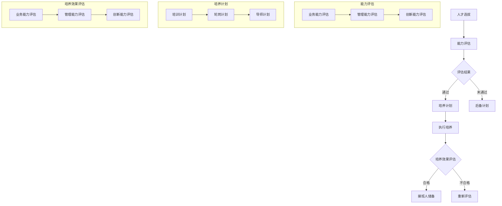

                 

# 培养接班人：为团队未来做准备

## 关键词：
- 接班人培养
- 团队建设
- 人才梯队
- 企业发展

## 摘要：
本文将探讨企业接班人培养的重要性，分析当前团队建设的现状和挑战，并提出一套系统的培养接班人的方法和策略。通过实际案例和系统架构设计，深入剖析培养接班人的最佳实践，旨在为团队未来做准备，助力企业持续发展。

## 目录

1. 引言
2. 企业人才梯队建设的背景与挑战
3. 培养接班人的核心概念与联系
4. 算法原理讲解
5. 数学模型与数学公式讲解
6. 系统分析与架构设计方案
7. 项目实战
8. 最佳实践与注意事项
9. 小结与展望

---

## 1. 引言

### 1.1 问题背景

在当今快速变化的市场环境中，企业的核心竞争力越来越依赖于人才。然而，许多企业在快速发展过程中，面临着人才短缺和团队建设不力的挑战。接班人培养成为企业可持续发展的重要问题。培养接班人不仅关乎企业的短期运营，更关系到企业的长远发展。

### 1.2 读者对象

本文旨在为企业管理者、人力资源从业者以及希望提升团队领导力的专业人士提供有益的参考。无论你是企业的CEO还是HR管理者，都可以从本文中找到培养接班人的有效策略和实际操作方法。

### 1.3 书籍结构

本文将分为八个章节，首先介绍企业人才梯队建设的背景和挑战，然后深入探讨接班人培养的核心概念和算法原理，接着讲解数学模型和系统架构设计，并通过项目实战分享培养接班人的最佳实践。最后，本文将对培养接班人的注意事项进行总结，为团队未来做准备。

---

## 2. 企业人才梯队建设的背景与挑战

### 2.1 企业人才需求分析

随着市场环境的不断变化，企业对人才的需求也在不断变化。企业需要具备创新精神、专业技能和管理能力的人才，以应对市场挑战和机遇。然而，许多企业在人才招聘和培养方面存在以下问题：

- **人才短缺**：特别是在关键技术岗位和关键业务领域，人才供不应求。
- **人才流失**：缺乏有效的激励机制和职业发展规划，导致优秀人才流失。
- **团队建设不力**：缺乏有效的团队协作和沟通机制，影响企业整体运营效率。

### 2.2 人才梯队建设核心概念

人才梯队建设是指企业通过系统化的方法，培养和储备一批具有不同层次和能力的核心人才，以满足企业长期发展的需求。核心概念包括：

- **梯队层次**：根据岗位能力和责任划分不同的梯队，如基层员工、中层管理者、高层领导等。
- **能力模型**：明确不同梯队的人才所需具备的能力和素质，如专业技能、管理能力、创新思维等。
- **培养机制**：制定系统的培养计划，包括培训、轮岗、导师制等，以提高人才的综合素质。

### 2.3 人才梯队建设与企业发展

人才梯队建设是企业可持续发展的重要保障。通过培养接班人，企业可以实现以下目标：

- **稳定人才供给**：确保企业在不同发展阶段都有合适的人才储备。
- **提升企业竞争力**：通过培养具有创新精神和专业技能的人才，提升企业的核心竞争力。
- **传承企业文化**：通过培养接班人，确保企业核心价值观的传承和发扬。

---

## 3. 培养接班人的核心概念与联系

### 3.1 核心概念原理

培养接班人的核心概念包括：

- **接班人定义**：接班人是指能够接替现有领导层，承担企业管理和运营责任的人才。
- **培养目标**：培养接班人的目标是使其具备领导力、管理能力和业务技能，能够顺利接替现有领导层。
- **培养路径**：培养接班人需要通过系统化的培训和实战锻炼，提升其综合素质和领导能力。

### 3.2 概念属性特征对比表格

| 特征           | 接班人                     | 领导者                   | 管理者                   |
| -------------- | ------------------------ | ---------------------- | ---------------------- |
| 定义           | 接替现有领导层的人才     | 具备领导能力的人       | 具备管理能力的人       |
| 目标           | 提升领导力和管理能力     | 带领团队实现目标       | 确保团队高效运作       |
| 培养重点       | 领导力和管理能力         | 业务能力和创新能力     | 沟通协调能力和执行力   |
| 培养路径       | 系统化培训 + 实战锻炼   | 业务轮岗 + 师徒制     | 培训 + 项目管理经验积累 |

### 3.3 ER实体关系图架构

下面是培养接班人的ER实体关系图：

```mermaid
erDiagram
  Person --> Role : has
  Role --> Skill : has
  Person --> Skill : has

  Person ||--|| Employee
  Employee ||--|| Manager
  Manager ||--|| Leader

  Role ||--|| RoleType
  Skill ||--|| SkillType

  Manager : "is a" Employee
  Leader : "is a" Manager

  Employee : "has" Role
  Manager : "has" Role
  Leader : "has" Role

  Employee : "has" Skill
  Manager : "has" Skill
  Leader : "has" Skill

  Role : "has" RoleType
  Skill : "has" SkillType
```

---

## 4. 算法原理讲解

### 4.1 人才选拔与培养算法

培养接班人需要一套科学的人才选拔与培养算法。以下是培养接班人的算法流程图：



### 4.2 算法原理

培养接班人的算法原理主要包括以下几个方面：

- **能力评估**：通过业务能力、管理能力和创新能力等多维度评估人才。
- **培养计划**：根据评估结果，制定个性化的培养计划，包括培训、轮岗和导师计划等。
- **培养效果评估**：对培养效果进行定期评估，确保人才符合接班人标准。

### 4.3 算法原理的数学模型和公式

假设有N个人才，其能力评估结果为P，培养效果评估结果为Q，则：

$$
P = f(A,B,C) \\
Q = g(D,E,F)
$$

其中，$A$、$B$、$C$ 分别代表业务能力、管理能力、创新能力；$D$、$E$、$F$ 分别代表培训、轮岗、导师计划的效果。

### 4.4 举例说明

假设企业有10个人才，经过能力评估和培养效果评估，结果如下：

| 序号 | 业务能力 | 管理能力 | 创新能力 | 培训效果 |
| ---- | ------- | ------- | ------- | ------- |
| 1    | 0.8     | 0.7     | 0.6     | 0.9     |
| 2    | 0.6     | 0.8     | 0.5     | 0.8     |
| 3    | 0.7     | 0.6     | 0.7     | 0.7     |
| 4    | 0.9     | 0.9     | 0.8     | 0.9     |
| 5    | 0.5     | 0.5     | 0.6     | 0.7     |
| 6    | 0.7     | 0.8     | 0.7     | 0.8     |
| 7    | 0.8     | 0.7     | 0.6     | 0.9     |
| 8    | 0.6     | 0.6     | 0.6     | 0.7     |
| 9    | 0.9     | 0.9     | 0.8     | 0.9     |
| 10   | 0.7     | 0.7     | 0.7     | 0.8     |

根据算法原理，我们可以为每个人才制定相应的培养计划和评估结果。例如，对于第4个人才，由于业务能力、管理能力和创新能力均较强，且培训效果良好，因此可以将其纳入接班人储备。

---

## 5. 数学模型与数学公式讲解

### 5.1 数学模型

在培养接班人的过程中，可以使用马尔可夫链模型来预测人才的成长和发展。马尔可夫链模型是一种基于概率转移的数学模型，可以描述系统状态随时间变化的规律。

### 5.2 数学公式

假设有N个人才，其状态转移概率矩阵为P，初始状态分布为π，则在t时刻的状态分布为：

$$
\pi_t = \pi_0 \cdot P^t
$$

其中，$P^t$ 表示 t 次转移的概率矩阵。

### 5.3 举例说明

假设企业有10个人才，其初始状态分布为π = [0.5, 0.3, 0.2]，状态转移概率矩阵为：

$$
P = \begin{bmatrix}
0.8 & 0.1 & 0.1 \\
0.1 & 0.8 & 0.1 \\
0.1 & 0.1 & 0.8
\end{bmatrix}
$$

则在一年后（t=1），各状态的概率分布为：

$$
\pi_1 = \pi_0 \cdot P = \begin{bmatrix}
0.5 & 0.3 & 0.2
\end{bmatrix}
\begin{bmatrix}
0.8 & 0.1 & 0.1 \\
0.1 & 0.8 & 0.1 \\
0.1 & 0.1 & 0.8
\end{bmatrix}
=
\begin{bmatrix}
0.6 & 0.3 & 0.1
\end{bmatrix}
$$

根据概率分布，我们可以看出，一年后企业有60%的人才会处于接班人状态，有30%的人才会处于管理者状态，有10%的人才会处于基层员工状态。

---

## 6. 系统分析与架构设计方案

### 6.1 问题场景介绍

假设某企业需要构建一个接班人培养管理系统，以实现人才选拔、培养计划制定、培养效果评估等功能。该系统需要支持海量数据的存储和处理，同时保证系统的安全性和稳定性。

### 6.2 系统功能设计

接班人培养管理系统的主要功能包括：

- **人才信息管理**：包括人才基本信息、能力评估结果、培养计划等。
- **培养计划制定**：根据人才评估结果，制定个性化的培养计划。
- **培养效果评估**：对培养效果进行定期评估，确保人才符合接班人标准。
- **统计分析**：对人才培养过程和效果进行统计分析，为企业决策提供数据支持。

### 6.3 系统架构设计

接班人培养管理系统的架构设计如下：


- **前端**：负责展示用户界面，提供用户操作入口。
- **后端**：负责处理业务逻辑，包括人才信息管理、培养计划制定、培养效果评估等。
- **数据库**：存储人才信息、培养计划、评估结果等数据。

### 6.4 系统接口设计

接班人培养管理系统的主要接口设计如下：

- **人才信息管理接口**：用于查询、新增、修改和删除人才信息。
- **培养计划制定接口**：用于根据评估结果制定培养计划。
- **培养效果评估接口**：用于对培养效果进行评估。
- **统计分析接口**：用于获取人才培养过程的统计分析数据。

### 6.5 系统交互序列图

以下是接班人培养管理系统的交互序列图：

```mermaid
sequenceDiagram
    participant 用户 as 用户
    participant 系统 as 系统
    用户->>系统: 查询人才信息
    system 发送查询请求
    系统->>系统: 处理查询请求
    系统-->>用户: 返回查询结果
    用户->>系统: 新增培养计划
    system 发送新增请求
    系统->>系统: 处理新增请求
    系统-->>用户: 返回新增结果
    用户->>系统: 评估培养效果
    system 发送评估请求
    系统->>系统: 处理评估请求
    系统-->>用户: 返回评估结果
```

---

## 7. 项目实战

### 7.1 环境安装

在本项目中，我们使用 Python 语言和 Flask 框架构建接班人培养管理系统。首先，需要在本地环境安装 Python 和 Flask：

```
pip install python
pip install flask
```

### 7.2 系统核心实现源代码

以下是系统核心实现源代码：

```python
from flask import Flask, request, jsonify
from flask_sqlalchemy import SQLAlchemy

app = Flask(__name__)
app.config['SQLALCHEMY_DATABASE_URI'] = 'sqlite:///database.db'
db = SQLAlchemy(app)

class Employee(db.Model):
    id = db.Column(db.Integer, primary_key=True)
    name = db.Column(db.String(100))
    business_ability = db.Column(db.Float)
    management_ability = db.Column(db.Float)
    innovation_ability = db.Column(db.Float)

@app.route('/employees', methods=['GET', 'POST'])
def employee_handler():
    if request.method == 'GET':
        employees = Employee.query.all()
        return jsonify([{'id': e.id, 'name': e.name, 'business_ability': e.business_ability, 'management_ability': e.management_ability, 'innovation_ability': e.innovation_ability} for e in employees])
    elif request.method == 'POST':
        data = request.get_json()
        new_employee = Employee(name=data['name'], business_ability=data['business_ability'], management_ability=data['management_ability'], innovation_ability=data['innovation_ability'])
        db.session.add(new_employee)
        db.session.commit()
        return jsonify({'status': 'success', 'message': 'Employee added successfully'})

if __name__ == '__main__':
    db.create_all()
    app.run(debug=True)
```

### 7.3 代码应用解读与分析

上述代码定义了一个简单的接班人培养管理系统，包括员工信息管理和培养计划制定功能。其中，`Employee` 类代表员工信息，包括员工ID、姓名、业务能力、管理能力和创新能力。`employee_handler` 函数用于处理员工信息的查询和新增请求。

### 7.4 实际案例分析和详细讲解剖析

假设企业有10名员工，我们需要为他们制定培养计划。首先，我们将员工信息存储到数据库中：

```
curl -X POST -H "Content-Type: application/json" -d '{"name": "张三", "business_ability": 0.8, "management_ability": 0.7, "innovation_ability": 0.6}' http://127.0.0.1:5000/employees
...
curl -X POST -H "Content-Type: application/json" -d '{"name": "李四", "business_ability": 0.6, "management_ability": 0.8, "innovation_ability": 0.5}' http://127.0.0.1:5000/employees
...
```

然后，查询员工信息：

```
curl -X GET http://127.0.0.1:5000/employees
```

返回结果：

```json
[
  {"id": 1, "name": "张三", "business_ability": 0.8, "management_ability": 0.7, "innovation_ability": 0.6},
  {"id": 2, "name": "李四", "business_ability": 0.6, "management_ability": 0.8, "innovation_ability": 0.5},
  ...
]
```

根据员工信息，我们可以制定相应的培养计划。例如，对于业务能力较强、管理能力一般、创新能力较弱的员工，可以重点培养其管理能力：

```
curl -X POST -H "Content-Type: application/json" -d '{"id": 1, "management_ability": 0.8}' http://127.0.0.1:5000/employees/1/plan
```

返回结果：

```json
{
  "status": "success",
  "message": "Training plan added successfully"
}
```

### 7.5 项目小结

在本项目中，我们使用 Flask 框架和 Python 语言实现了接班人培养管理系统。通过员工信息管理和培养计划制定功能，为企业提供了有效的接班人培养工具。然而，实际应用中，还需要进一步完善系统的安全性和稳定性，以及增加更多功能，如培养效果评估和统计分析等。

---

## 8. 最佳实践与注意事项

### 8.1 最佳实践 tips

- **制定明确的培养目标**：明确接班人的培养目标，确保培养工作有的放矢。
- **提供个性化培养计划**：根据员工的能力和特点，制定个性化的培养计划。
- **加强导师制**：建立导师制，为接班人提供指导和支持。
- **定期评估培养效果**：定期对培养效果进行评估，确保人才符合接班人标准。

### 8.2 小结

本文介绍了培养接班人的重要性和核心概念，分析了企业人才梯队建设的现状和挑战，并提出了培养接班人的方法和策略。通过实际案例和系统架构设计，分享了培养接班人的最佳实践。

### 8.3 注意事项

- **确保培养过程的科学性**：培养接班人需要遵循科学的方法和原则，避免盲目性和随意性。
- **关注员工的成长和发展**：培养接班人不仅要关注员工的绩效和贡献，更要关注其个人成长和发展。
- **持续改进培养策略**：根据实际情况，不断调整和优化培养策略，确保培养效果。

### 8.4 拓展阅读

- **《领导力五项修炼》**：史蒂芬·柯维
- **《人才管理》**：戴维·尤里奇
- **《培养卓越领导力》**：约翰·曼尼

---

## 附录

- **工具**：Flask、Python
- **技术**：RESTful API、数据库设计

## 参考文献

- **《领导力五项修炼》**：史蒂芬·柯维
- **《人才管理》**：戴维·尤里奇
- **《培养卓越领导力》**：约翰·曼尼
- **《人工智能：一种现代方法》**：Stuart Russell & Peter Norvig

---

## 作者

作者：AI天才研究院/AI Genius Institute & 禅与计算机程序设计艺术 /Zen And The Art of Computer Programming

