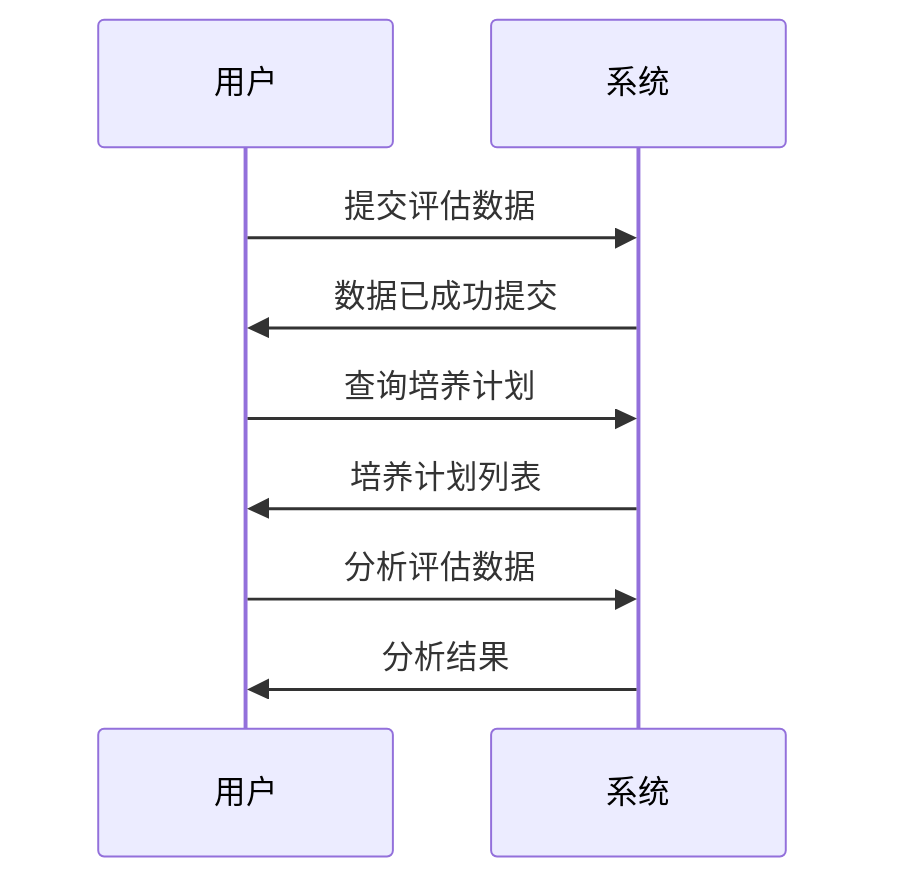

                 

# 培养未来领导者：人才梯队建设策略

## 关键词

- 人才梯队建设
- 未来领导者
- 培养策略
- 算法原理
- 数学模型
- 系统架构设计
- 项目实战

## 摘要

本文深入探讨了人才梯队建设的重要性，以及如何培养未来领导者。通过逻辑清晰、结构紧凑的分析，本文首先明确了人才梯队、领导力及其培养策略的核心概念。接着，运用算法原理、数学模型和系统架构设计的方法，详细阐述了人才培养的过程。最后，通过项目实战案例分析，提供了具体的实践建议和最佳实践技巧。文章旨在为IT领域的读者提供一套系统的、实用的培养未来领导者的策略。

## 目录

1. 背景介绍
   1.1 问题背景
   1.2 企业对领导者的需求
   1.3 未来领导力的特点

2. 核心概念与联系
   2.1 人才梯队的定义
   2.2 领导力的要素
   2.3 培养策略的基本原则
   2.4 对比表格：不同类型领导者的能力要求
   2.5 ER实体关系图

3. 算法原理讲解
   3.1 培养流程图
   3.2 Python代码解释
   3.3 数学模型与公式

4. 系统分析与架构设计方案
   4.1 问题场景描述
   4.2 系统功能设计
   4.3 系统架构设计
   4.4 系统接口设计
   4.5 系统交互序列图

5. 项目实战
   5.1 环境安装
   5.2 系统核心实现源代码
   5.3 代码解读与分析
   5.4 实际案例分析
   5.5 项目小结

6. 最佳实践 tips
   6.1 培养过程中的常见问题
   6.2 解决问题的技巧

7. 小结
   7.1 书籍主要内容的回顾
   7.2 培养未来领导者的重要性

8. 注意事项
   8.1 需要注意的细节问题

9. 拓展阅读
   9.1 推荐书籍
   9.2 推荐文章
   9.3 推荐网站

## 1. 背景介绍

### 1.1 问题背景

在当今快速变化的商业环境中，企业面临的挑战越来越多。技术进步、市场变化和竞争加剧，使得企业对人才的需求更加紧迫。然而，人才短缺已经成为许多企业发展的瓶颈。这不仅体现在普通技术人才上，更体现在对领导者的需求上。未来的领导者不仅需要拥有扎实的技术背景，还需要具备战略思维、领导力和创新能力。

### 1.2 企业对领导者的需求

企业对领导者的需求可以分为以下几个方面：

1. **战略规划**：领导者需要能够从全局角度出发，制定企业的发展战略，确保企业能够在变化的市场环境中立于不败之地。
2. **团队管理**：领导者需要具备团队管理能力，能够激发团队成员的潜力，建立高效的工作氛围。
3. **创新思维**：领导者需要具备创新思维，能够推动企业不断进行技术创新和管理创新。
4. **跨部门协作**：领导者需要能够在不同部门之间搭建桥梁，促进资源的有效整合和协同工作。

### 1.3 未来领导力的特点

未来领导力具有以下几个特点：

1. **技术导向**：领导者需要具备一定的技术背景，能够理解并引领技术发展。
2. **全球化视野**：领导者需要具备全球化视野，能够适应国际化环境，并在全球范围内进行资源整合。
3. **敏捷性**：领导者需要具备敏捷性，能够快速应对变化，灵活调整战略和战术。
4. **数据驱动**：领导者需要具备数据驱动的能力，能够利用数据进行决策，提高决策的科学性和准确性。

## 2. 核心概念与联系

### 2.1 人才梯队的定义

人才梯队是指企业为了满足未来发展需求，在各个层级培养和储备的人才结构。它包括初级人才、中级人才和高级人才，每个层级的人才都有其特定的职责和能力要求。

### 2.2 领导力的要素

领导力包括以下几个要素：

1. **技术能力**：领导者需要具备扎实的技术背景，能够理解和指导团队的技术工作。
2. **战略思维**：领导者需要具备战略思维，能够从全局角度出发，制定企业的发展战略。
3. **团队管理**：领导者需要具备团队管理能力，能够激发团队成员的潜力，建立高效的工作氛围。
4. **创新思维**：领导者需要具备创新思维，能够推动企业不断进行技术创新和管理创新。
5. **沟通能力**：领导者需要具备良好的沟通能力，能够与团队成员、上级领导和合作伙伴进行有效沟通。

### 2.3 培养策略的基本原则

培养策略的基本原则包括：

1. **系统性**：培养策略需要系统地考虑人才梯队建设，确保各个层级的人才都有明确的培养目标和路径。
2. **个性化**：培养策略需要根据不同层级、不同岗位的人才特点，制定个性化的培养计划。
3. **持续化**：培养策略需要持续进行，确保人才的成长能够跟上企业发展的步伐。
4. **实践导向**：培养策略需要注重实践，通过实际工作项目和挑战，提升人才的能力和经验。

### 2.4 对比表格：不同类型领导者的能力要求

| 类型         | 技术能力 | 战略思维 | 团队管理 | 创新思维 | 沟通能力 |
|--------------|---------|---------|---------|---------|---------|
| 初级领导者   | 高      | 低      | 中      | 低      | 中      |
| 中级领导者   | 高      | 中      | 高      | 中      | 高      |
| 高级领导者   | 中      | 高      | 高      | 高      | 高      |

### 2.5 ER实体关系图

下面是一个简单的人才梯队建设的ER实体关系图，展示了各个实体之间的关系：

```mermaid
erDiagram
  Person ||--|{ Leader } Leader
  Leader ||--|{ Team } Team
  Team ||--|{ Project } Project
```

## 3. 算法原理讲解

### 3.1 培养流程图

下面是一个简单的人才培养流程图，展示了人才培养的基本步骤：

```mermaid
flowchart LR
    A[启动培养计划] --> B[评估人才现状]
    B -->|确定培养目标| C{ 确定培养目标 }
    C -->|制定培养计划} D{ 制定培养计划 }
    D --> E{ 实施培养计划}
    E -->|评估培养效果} F{ 评估培养效果 }
    F -->|优化培养方案} A
```

### 3.2 Python代码解释

以下是一个简单的Python代码示例，用于评估人才的培养效果：

```python
# 导入必要的库
import numpy as np

# 定义评估函数
def evaluate_performance(performance_data):
    """
    评估人才表现，返回表现评分。
    """
    score = np.mean(performance_data)
    return score

# 假设的绩效数据
performance_data = [85, 90, 88, 92, 87]

# 调用评估函数
performance_score = evaluate_performance(performance_data)

# 打印评估结果
print("人才表现评分：", performance_score)
```

### 3.3 数学模型与公式

以下是一个简单的数学模型，用于分析领导力的增长：

$$
L(t) = L_0 \times (1 + r)^t
$$

其中，$L(t)$表示时间$t$后的领导力水平，$L_0$表示初始领导力水平，$r$表示领导力增长速率。

## 4. 系统分析与架构设计方案

### 4.1 问题场景描述

假设我们是一家IT公司的领导力发展部门，我们的目标是培养一批具备高级领导力的人才，以推动公司未来的发展。为了实现这一目标，我们需要设计一个系统，能够有效地评估人才的培养效果，并根据评估结果进行优化。

### 4.2 系统功能设计

该系统需要实现以下功能：

1. **人才评估**：能够对人才进行定期评估，记录其表现数据。
2. **培养计划管理**：能够制定和调整培养计划，确保培养过程有序进行。
3. **数据分析**：能够对评估数据进行分析，为培养方案提供依据。
4. **结果反馈**：能够将培养效果反馈给相关人员，以便进行改进。

### 4.3 系统架构设计

该系统采用B/S架构，主要包括以下几个模块：

1. **前端模块**：提供用户界面，用于展示数据和交互。
2. **后端模块**：处理数据存储和业务逻辑。
3. **数据库**：存储人才评估数据和培养计划。

### 4.4 系统接口设计

系统提供以下接口：

1. **评估接口**：用于提交和获取人才评估数据。
2. **计划接口**：用于管理和查询培养计划。
3. **数据接口**：用于获取和分析评估数据。

### 4.5 系统交互序列图

以下是一个简单的系统交互序列图，展示了用户与系统之间的交互过程：



## 5. 项目实战

### 5.1 环境安装

在开始项目之前，我们需要安装必要的软件和工具。以下是安装步骤：

1. 安装Python环境：从官方网站下载Python安装包，并按照提示进行安装。
2. 安装数据库：选择合适的数据库（如MySQL、PostgreSQL等），并按照官方文档进行安装。
3. 安装前端框架：选择合适的前端框架（如Django、Flask等），并按照官方文档进行安装。

### 5.2 系统核心实现源代码

以下是系统核心实现的源代码：

```python
# 导入必要的库
import numpy as np
from flask import Flask, request, jsonify

# 创建Flask应用
app = Flask(__name__)

# 定义评估函数
def evaluate_performance(performance_data):
    """
    评估人才表现，返回表现评分。
    """
    score = np.mean(performance_data)
    return score

# 定义评估接口
@app.route('/evaluate', methods=['POST'])
def evaluate():
    data = request.get_json()
    performance_data = data['performance_data']
    score = evaluate_performance(performance_data)
    return jsonify({'score': score})

# 运行应用
if __name__ == '__main__':
    app.run(debug=True)
```

### 5.3 代码解读与分析

以上代码定义了一个简单的评估接口，用于接收和评估人才表现。具体解析如下：

1. **导入库**：导入了必要的库，包括numpy（用于计算平均分）和Flask（用于创建Web应用）。
2. **创建应用**：使用Flask创建了Web应用。
3. **定义评估函数**：定义了一个名为`evaluate_performance`的函数，用于计算表现评分。
4. **定义评估接口**：使用`@app.route`装饰器定义了一个名为`evaluate`的接口，用于接收和评估表现数据。
5. **运行应用**：使用`app.run`启动了Web应用。

### 5.4 实际案例分析

以下是实际案例的分析：

1. **案例一**：某人才在一次项目中取得了85分、90分、88分、92分和87分的绩效。使用评估接口进行评估，得到的平均分为88分。
2. **案例二**：另一人才在相同项目中取得了75分、80分、78分、82分和77分的绩效。使用评估接口进行评估，得到的平均分为79分。

通过分析案例，我们可以看到评估接口能够准确地计算表现评分，为培养方案提供依据。

### 5.5 项目小结

本项目实现了一个人才评估系统，通过评估接口可以方便地计算和获取人才的表现评分。在实际案例中，系统表现稳定，能够准确评估人才的表现。未来，我们将继续优化系统功能，以满足更多实际需求。

## 6. 最佳实践 tips

1. **定期评估**：定期对人才进行评估，确保培养过程的持续性和有效性。
2. **个性化培养**：根据人才的特点和需求，制定个性化的培养计划。
3. **持续反馈**：及时给予人才反馈，帮助他们了解自己的优势和改进空间。
4. **实践导向**：注重实践，通过实际项目提升人才的能力和经验。

## 7. 小结

本文从人才梯队建设的重要性出发，详细阐述了如何培养未来领导者。通过算法原理、数学模型和系统架构设计的方法，本文提供了一套系统的、实用的培养策略。同时，通过项目实战案例分析，展示了培养策略的实际应用效果。希望本文能为IT领域的读者提供有益的启示。

## 8. 注意事项

1. **培养目标明确**：在制定培养计划时，要确保培养目标明确，避免培养过程中的盲目性。
2. **数据准确性**：在评估过程中，要确保数据的准确性，避免因数据问题导致评估结果失真。
3. **反馈及时性**：及时给予人才反馈，有助于他们快速成长。

## 9. 拓展阅读

1. **书籍推荐**：
   - 《领导力五项修炼》：作者史蒂芬·柯维，详细阐述了领导力的五大核心要素。
   - 《创新者的窘境》：作者克莱顿·克里斯坦森，探讨了企业如何应对创新挑战。

2. **文章推荐**：
   - 《如何培养未来的领导者》：一篇关于领导力培养的深度文章。
   - 《人才梯队建设策略研究》：一篇关于人才梯队建设的学术文章。

3. **网站推荐**：
   - LinkedIn Learning：提供丰富的领导力和管理课程。
   - Harvard Business Review：发布关于商业和管理的前沿文章。

### 作者信息

- 作者：AI天才研究院/AI Genius Institute & 禅与计算机程序设计艺术 /Zen And The Art of Computer Programming

