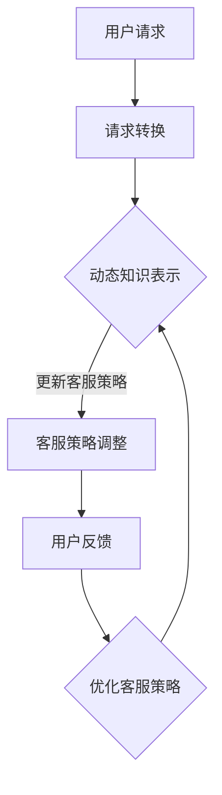

                 


## 引言

在当今人工智能迅猛发展的时代，如何高效地表示、更新和利用知识成为了一个亟待解决的关键问题。传统的知识表示方法，如规则推理、符号逻辑和向量表示等，虽然在某些场景下取得了显著成果，但在面对复杂、动态和大规模知识时，往往显得力不从心。为了应对这一挑战，图神经网络（Graph Neural Networks，GNN）应运而生，它为知识表示提供了一个全新的视角。

图神经网络是一种在图结构上定义的神经网络，通过捕捉节点和边之间的关系，实现对复杂结构的建模。AI Agent作为人工智能领域的一个重要概念，其本质是具有自主行动能力的实体，能够感知环境、制定决策并采取行动。而动态知识表示则是指对知识进行实时更新和调整，以适应环境变化的过程。

本文将围绕“基于图神经网络的AI Agent动态知识表示”这一主题，深入探讨以下内容：

1. **问题背景与核心概念**：介绍图神经网络、AI Agent和动态知识表示的基本概念及其相互关系。
2. **图神经网络基础**：讲解图神经网络的基本原理、类型和应用场景。
3. **AI Agent概述**：阐述AI Agent的定义、核心要素和分类。
4. **动态知识表示方法**：分析动态知识表示的重要性、方法和关键技术。
5. **算法原理讲解**：详细讲解基于图神经网络的动态知识表示算法原理，使用Mermaid流程图和Python源代码解释。
6. **系统分析与架构设计**：介绍系统的功能设计、架构设计、接口设计和交互流程。
7. **项目实战**：通过一个实际项目，展示基于图神经网络的AI Agent动态知识表示的实现过程。
8. **最佳实践与小结**：总结最佳实践、注意事项和拓展阅读。

本文旨在为读者提供一个系统、全面且易于理解的技术教程，帮助大家更好地理解和应用基于图神经网络的AI Agent动态知识表示。

## 第1章: 问题背景与核心概念

### 1.1 问题背景

在人工智能（AI）领域，知识表示是构建智能系统的基础。传统的知识表示方法主要包括基于规则的推理、符号逻辑和向量表示等。然而，这些方法在面对复杂、动态和大规模知识时，存在一定的局限性。例如，基于规则的推理在处理复杂关系时，规则库会变得庞大且难以维护；符号逻辑虽然严谨，但在处理大规模数据时效率较低；向量表示方法虽然能够较好地处理大规模数据，但往往无法捕捉实体之间的复杂关系。

随着图神经网络（GNN）的出现，为知识表示提供了一种全新的思路。GNN通过在图结构上定义神经网络，能够有效地捕捉实体之间的复杂关系，并在处理大规模动态知识时表现出色。同时，AI Agent作为具有自主行动能力的实体，能够在动态环境中进行感知、决策和行动，为知识表示提供了动态调整的能力。

因此，本文将探讨基于图神经网络的AI Agent动态知识表示，旨在解决以下问题：

- 如何利用图神经网络高效地表示复杂、动态的知识结构？
- 如何构建具有自主行动能力的AI Agent，并使其能够动态地调整知识表示？
- 如何在实际应用中实现基于图神经网络的AI Agent动态知识表示？

### 1.2 图神经网络

图神经网络（Graph Neural Networks，GNN）是一种在图结构上定义的神经网络。与传统的卷积神经网络（CNN）和循环神经网络（RNN）不同，GNN能够直接在图结构上进行操作，通过学习节点和边之间的关系，实现对复杂结构的建模。

#### 图神经网络的基本概念

- **图**：图是由节点（Node）和边（Edge）构成的数学结构。在图神经网络中，节点表示实体，边表示实体之间的关系。
- **图神经网络**：图神经网络是一种在图结构上定义的神经网络。通过在图上进行卷积、池化等操作，GNN能够学习节点和边之间的复杂关系。

#### 图神经网络的核心特点

- **捕捉复杂关系**：GNN能够直接在图结构上学习节点和边之间的关系，从而捕捉到复杂的实体关系。
- **处理大规模数据**：GNN能够有效地处理大规模、动态的图结构数据。
- **灵活性**：GNN可以应用于各种不同类型的图结构，如社交网络、知识图谱等。

#### 图神经网络的基本原理

GNN的基本原理可以概括为以下几个步骤：

1. **节点特征编码**：将节点属性转换为向量表示，作为节点特征的编码。
2. **边特征编码**：将边属性转换为向量表示，作为边特征的编码。
3. **图卷积操作**：通过图卷积操作，更新节点的特征表示，使其能够捕捉到节点和边之间的关系。
4. **池化操作**：通过池化操作，将局部特征表示整合为全局特征表示。
5. **分类或回归**：利用全局特征表示进行分类或回归任务。

### 1.3 AI Agent

AI Agent（智能体）是人工智能领域的一个重要概念，其本质是具有自主行动能力的实体。AI Agent能够感知环境、制定决策并采取行动，以实现特定目标。

#### AI Agent的定义

AI Agent是指一种能够通过感知环境、制定决策并采取行动来达成特定目标的自主实体。AI Agent通常由以下几个核心要素组成：

- **感知器**：用于感知环境中的信息。
- **决策器**：基于感知到的信息，制定决策。
- **执行器**：执行决策，实现具体行动。

#### AI Agent的核心要素

- **感知器**：感知器是AI Agent的感官部分，用于获取环境中的信息。感知器可以是摄像头、麦克风、传感器等，其输出数据作为AI Agent的输入。
- **决策器**：决策器是AI Agent的智能部分，负责根据感知到的信息，制定最优的行动策略。决策器通常基于某种算法，如深度学习、规划算法等，对输入信息进行处理。
- **执行器**：执行器是AI Agent的动作部分，负责将决策器制定的行动策略转化为具体的物理动作。执行器可以是机械臂、机器人、自动驾驶汽车等。

#### AI Agent在动态知识表示中的应用

AI Agent在动态知识表示中的应用主要体现在以下几个方面：

- **实时更新知识表示**：AI Agent能够实时感知环境变化，并动态地调整知识表示，以适应新的环境。
- **知识融合与整合**：AI Agent可以将来自不同来源的知识进行融合与整合，形成一个统一的、动态的知识表示。
- **自适应学习**：AI Agent可以根据环境反馈，不断调整和优化其知识表示，实现自适应学习。

### 1.4 动态知识表示

动态知识表示是指对知识进行实时更新和调整，以适应环境变化的过程。在动态环境中，知识是不断变化的，传统的静态知识表示方法难以应对这种变化。动态知识表示提供了一种新的思路，通过实时更新和调整知识表示，使系统能够适应环境的变化。

#### 动态知识表示的重要性

- **实时性**：动态知识表示能够实时地反映环境变化，为决策提供最新的信息。
- **适应性**：动态知识表示能够根据环境变化，自动调整知识表示，提高系统的适应性。
- **灵活性**：动态知识表示能够灵活地处理不同类型的知识和信息，适应不同应用场景。

#### 动态知识表示的方法

动态知识表示的方法主要包括以下几种：

- **基于图神经网络的知识表示**：通过图神经网络，捕捉实体之间的复杂关系，实现动态知识表示。
- **基于深度学习的知识表示**：利用深度学习算法，对知识进行自动提取和表示，实现动态知识表示。
- **基于符号推理的知识表示**：通过符号推理，对知识进行形式化表示和推理，实现动态知识表示。

#### 动态知识表示的关键技术

动态知识表示的关键技术主要包括以下几个方面：

- **动态图构建**：根据环境变化，实时构建和更新知识表示的图结构。
- **知识更新策略**：设计合理的知识更新策略，确保知识表示能够及时、准确地反映环境变化。
- **知识融合算法**：设计有效的知识融合算法，将不同来源的知识进行整合，形成一个统一的、动态的知识表示。

### 总结

本章介绍了图神经网络、AI Agent和动态知识表示的基本概念，并探讨了它们之间的关系。图神经网络为动态知识表示提供了一种有效的建模方法，AI Agent为动态知识表示提供了一个动态调整的实体，而动态知识表示则使系统能够适应环境变化。在接下来的章节中，我们将进一步探讨图神经网络的基本原理、AI Agent的构建方法以及动态知识表示的具体实现。

## 第2章: 图神经网络基础

### 2.1 图神经网络原理

图神经网络（Graph Neural Networks，GNN）是一种在图结构上定义的神经网络，其核心思想是通过学习节点和边之间的关系，实现对复杂结构的建模。GNN的基本原理可以分为以下几个步骤：

1. **节点特征编码**：首先，将图中的节点和边进行特征编码，通常使用节点的属性（如文本、数值等）和边的关系（如标签、权重等）来表示。
2. **图卷积操作**：GNN通过图卷积操作更新节点的特征表示。图卷积操作的基本思想是，一个节点的特征表示可以通过其邻居节点的特征表示进行加权平均得到。这个过程可以形式化为以下公式：
   \[
   h_i^{(k+1)} = \sigma \left( \sum_{j \in N(i)} w_{ij} h_j^{(k)} \right)
   \]
   其中，\(h_i^{(k)}\)表示第\(i\)个节点在第\(k\)次迭代后的特征表示，\(N(i)\)表示第\(i\)个节点的邻居节点集合，\(w_{ij}\)表示第\(i\)个节点和第\(j\)个节点之间的权重。
3. **池化操作**：通过池化操作，将局部特征表示整合为全局特征表示。池化操作可以是平均池化、最大池化等。
4. **分类或回归**：利用全局特征表示进行分类或回归任务。通常，在GNN的最后会添加一个全连接层或卷积层，用于将全局特征表示映射到预测结果。

### 2.2 图神经网络类型

图神经网络根据其结构和操作方式可以分为几种不同的类型，每种类型都有其特定的应用场景和优势。

#### 图卷积网络（GCN）

图卷积网络（Graph Convolutional Network，GCN）是最基本的GNN类型。GCN通过图卷积操作来更新节点的特征表示，其核心思想是利用邻居节点的特征信息来更新当前节点的特征表示。GCN在节点分类、链接预测和图表示学习等任务中表现出色。

#### 图注意力网络（GAT）

图注意力网络（Graph Attention Network，GAT）是对GCN的改进。GAT引入了注意力机制，通过计算节点之间的相似性来更新特征表示。GAT可以更好地捕捉节点之间的复杂关系，特别是在节点分类和推荐系统中表现出色。

#### 图自编码器（GAE）

图自编码器（Graph Autoencoder，GAE）是一种无监督的GNN。GAE通过编码器和解码器对图进行编码和重构，从而学习到图的潜在表示。GAE在图表示学习和图生成等任务中具有广泛应用。

#### 图循环网络（GRN）

图循环网络（Graph Recurrent Network，GRN）是一种在图结构上定义的循环神经网络。GRN通过循环操作来更新节点的特征表示，可以处理具有时间依赖性的图结构数据，如序列图和时空图。

#### 图变换器网络（GATV）

图变换器网络（Graph Transformer Network，GATV）是结合了图注意力网络和变换器网络的GNN。GATV利用变换器网络的层次化结构和注意力机制，可以更好地捕捉节点之间的长距离关系。

### 2.3 图神经网络应用场景

图神经网络在许多领域都取得了显著的成果，以下是一些典型的应用场景：

#### 社交网络分析

社交网络分析是图神经网络的一个重要应用领域。通过构建社交网络的图结构，GNN可以用于用户分类、关系预测和社区发现等任务。例如，GAT在社交网络用户分类任务中取得了很好的效果，能够准确地识别不同类型的用户。

#### 物体识别

在计算机视觉领域，图神经网络可以用于物体识别和图像分割等任务。通过将图像中的物体和部分组合成一个图结构，GCN和GAT可以有效地识别图像中的物体。

#### 知识图谱构建

知识图谱是一种用于表示实体和关系的图结构，在知识图谱构建中，GNN可以用于实体分类、关系预测和图谱嵌入等任务。GAE和GATV在知识图谱生成和图谱嵌入任务中表现出色。

#### 自然语言处理

在自然语言处理领域，图神经网络可以用于词向量表示、文本分类和情感分析等任务。通过将文本中的词语和句子构建成一个图结构，GNN可以有效地捕捉词语之间的关系和语义信息。

### 总结

本章介绍了图神经网络的基本原理、类型和应用场景。图神经网络通过学习节点和边之间的关系，可以有效地建模复杂的图结构数据。在接下来的章节中，我们将进一步探讨AI Agent的概念及其在动态知识表示中的应用。

## 第3章: AI Agent概述

### 3.1 AI Agent的定义

AI Agent，即人工智能代理，是指一种具备一定智能能力的实体，能够在特定环境下自主感知、决策并采取行动，以实现特定目标。AI Agent的核心特征包括：

1. **自主性**：AI Agent能够在没有外部干预的情况下，自主地感知环境、制定决策并执行行动。
2. **适应性**：AI Agent能够根据环境的变化，动态调整其感知、决策和行动策略，以适应新的环境。
3. **智能性**：AI Agent具备一定的智能能力，能够通过学习和优化，提高其自主行动的能力。

### 3.2 AI Agent的核心要素

AI Agent的构建涉及多个核心要素，主要包括：

1. **感知器**：感知器是AI Agent的感官部分，用于获取环境中的信息。感知器可以是各种传感器、摄像头、麦克风等，其输出数据作为AI Agent的输入。
2. **决策器**：决策器是AI Agent的智能部分，负责根据感知器收集到的信息，制定最优的行动策略。决策器通常基于某种算法，如深度学习、规划算法等，对输入信息进行处理。
3. **执行器**：执行器是AI Agent的动作部分，负责将决策器制定的行动策略转化为具体的物理动作。执行器可以是机械臂、机器人、自动驾驶汽车等。

### 3.3 AI Agent的分类

根据不同的分类标准，AI Agent可以分为多种类型：

1. **基于规则的AI Agent**：基于规则的AI Agent使用预定义的规则进行决策和行动。这种类型的AI Agent在规则简单、环境稳定的情况下表现良好，但在复杂和动态的环境中，规则库会变得庞大且难以维护。
2. **基于模型的AI Agent**：基于模型的AI Agent使用模型（如深度学习模型）进行决策和行动。这种类型的AI Agent能够通过学习，自动调整其行为策略，以适应复杂和动态的环境。
3. **基于混合模型的AI Agent**：基于混合模型的AI Agent结合了基于规则和基于模型的优点，通过将规则和模型相结合，实现更好的适应性和灵活性。

### 3.4 AI Agent在动态知识表示中的应用

AI Agent在动态知识表示中的应用主要体现在以下几个方面：

1. **实时更新知识表示**：AI Agent能够实时感知环境变化，并动态调整其知识表示，以适应新的环境。
2. **知识融合与整合**：AI Agent可以将来自不同来源的知识进行融合与整合，形成一个统一的、动态的知识表示。
3. **自适应学习**：AI Agent可以根据环境反馈，不断调整和优化其知识表示，实现自适应学习。

### 总结

本章对AI Agent的定义、核心要素和分类进行了详细阐述，并探讨了AI Agent在动态知识表示中的应用。在接下来的章节中，我们将进一步探讨动态知识表示的方法和技术。

## 第4章: 动态知识表示方法

### 4.1 动态知识表示的重要性

在动态环境中，知识的表示和更新至关重要。动态知识表示的重要性主要体现在以下几个方面：

1. **实时性**：动态知识表示能够实时地反映环境变化，为决策提供最新的信息。
2. **适应性**：动态知识表示能够根据环境变化，自动调整知识表示，提高系统的适应性。
3. **灵活性**：动态知识表示能够灵活地处理不同类型的知识和信息，适应不同应用场景。

在传统的静态知识表示方法中，知识一旦被表示后，就很难进行实时更新和调整。而在动态知识表示中，系统可以根据环境变化，实时更新和调整知识表示，从而更好地适应动态环境。

### 4.2 动态知识表示的方法

动态知识表示的方法主要包括以下几种：

1. **基于图神经网络的知识表示**：图神经网络（GNN）能够捕捉节点和边之间的复杂关系，适用于动态知识表示。通过GNN，系统可以实时更新和调整知识表示，以适应环境变化。
2. **基于深度学习的知识表示**：深度学习算法能够自动提取和表示知识，适用于动态知识表示。通过深度学习模型，系统可以实时更新和调整知识表示，以适应环境变化。
3. **基于符号推理的知识表示**：符号推理方法能够对知识进行形式化表示和推理，适用于动态知识表示。通过符号推理，系统可以实时更新和调整知识表示，以适应环境变化。

### 4.3 动态知识表示的关键技术

动态知识表示的关键技术主要包括以下几个方面：

1. **动态图构建**：动态图构建是指根据环境变化，实时构建和更新知识表示的图结构。通过动态图构建，系统可以及时捕捉环境变化，并更新知识表示。
2. **知识更新策略**：知识更新策略是指如何根据环境变化，实时更新知识表示的方法。常用的知识更新策略包括增量更新、全局更新和混合更新等。
3. **知识融合算法**：知识融合算法是指如何将来自不同来源的知识进行整合，形成一个统一的、动态的知识表示。常用的知识融合算法包括加权融合、投票融合和神经网络融合等。

### 总结

本章介绍了动态知识表示的重要性、方法和关键技术。在接下来的章节中，我们将详细讲解基于图神经网络的动态知识表示算法原理。

## 第5章: 算法原理讲解

### 5.1 基于图神经网络的动态知识表示算法

基于图神经网络的动态知识表示算法是一种利用图神经网络（GNN）来捕捉和表示动态知识的方法。该算法的核心思想是通过GNN学习节点和边之间的关系，实现对知识结构的动态调整和表示。以下是一个简单的基于GNN的动态知识表示算法流程：

1. **初始化**：初始化图结构（节点和边）和节点特征向量。
2. **图卷积操作**：利用图卷积操作更新节点特征向量，使其能够反映节点和边之间的关系。
3. **池化操作**：通过池化操作，将局部特征表示整合为全局特征表示。
4. **分类或回归**：利用全局特征表示进行分类或回归任务。
5. **知识更新**：根据环境变化，实时更新图结构和节点特征向量。

### 5.2 算法原理

基于图神经网络的动态知识表示算法原理可以概括为以下几个关键步骤：

1. **节点特征编码**：首先，将图中的节点和边进行特征编码，通常使用节点的属性（如文本、数值等）和边的关系（如标签、权重等）来表示。
2. **图卷积操作**：通过图卷积操作，更新节点的特征表示，使其能够捕捉到节点和边之间的关系。图卷积操作的基本思想是，一个节点的特征表示可以通过其邻居节点的特征表示进行加权平均得到。具体公式如下：
   \[
   h_i^{(k+1)} = \sigma \left( \sum_{j \in N(i)} w_{ij} h_j^{(k)} \right)
   \]
   其中，\(h_i^{(k)}\)表示第\(i\)个节点在第\(k\)次迭代后的特征表示，\(N(i)\)表示第\(i\)个节点的邻居节点集合，\(w_{ij}\)表示第\(i\)个节点和第\(j\)个节点之间的权重。
3. **池化操作**：通过池化操作，将局部特征表示整合为全局特征表示。池化操作可以是平均池化、最大池化等。
4. **分类或回归**：利用全局特征表示进行分类或回归任务。通常，在GNN的最后会添加一个全连接层或卷积层，用于将全局特征表示映射到预测结果。
5. **知识更新**：根据环境变化，实时更新图结构和节点特征向量。具体方法可以是增量更新、全局更新或混合更新等。

### 5.3 Python源代码和Mermaid流程图

以下是一个简化的Python源代码示例，用于实现基于图神经网络的动态知识表示算法。为了便于理解，代码中使用Mermaid流程图表示算法流程。

```python
import torch
import torch.nn as nn
import torch.optim as optim

# 初始化图结构
nodes = {'n1': {'attributes': [1.0, 2.0]}, 'n2': {'attributes': [3.0, 4.0]}}
edges = {'e1': {'from': 'n1', 'to': 'n2', 'weight': 0.5}}

# 初始化节点特征向量
node_features = torch.tensor([nodes['n1']['attributes'], nodes['n2']['attributes']])

# 定义图卷积网络模型
class GraphConvolutionalNetwork(nn.Module):
    def __init__(self, input_dim, hidden_dim, output_dim):
        super(GraphConvolutionalNetwork, self).__init__()
        self.fc = nn.Linear(input_dim, hidden_dim)
        self.gcn = nn.Linear(hidden_dim, output_dim)
    
    def forward(self, node_features, edge_features):
        x = self.fc(node_features)
        x = self.gcn(x)
        return x

# 初始化模型和优化器
model = GraphConvolutionalNetwork(2, 16, 1)
optimizer = optim.Adam(model.parameters(), lr=0.001)

# 训练模型
for epoch in range(100):
    optimizer.zero_grad()
    output = model(node_features, edge_features)
    loss = nn.functional.mse_loss(output, torch.tensor([[0.5]]))
    loss.backward()
    optimizer.step()
    print(f'Epoch {epoch+1}: Loss = {loss.item()}')

# Mermaid流程图
mermaid::+
graph TD
    A[初始化]
    B[节点特征编码]
    C[图卷积操作]
    D[池化操作]
    E[分类或回归]
    F[知识更新]
    A --> B
    B --> C
    C --> D
    D --> E
    E --> F
```

在这个示例中，我们首先初始化图结构和节点特征向量。然后，定义一个简单的图卷积网络模型，并使用随机数据对其进行训练。训练过程中，我们通过图卷积操作更新节点特征向量，并通过池化操作将局部特征表示整合为全局特征表示。最后，我们利用全局特征表示进行分类或回归任务，并根据训练结果更新模型。

### 5.4 数学模型和公式

基于图神经网络的动态知识表示算法的数学模型可以概括为以下公式：

1. **节点特征更新**：
   \[
   h_i^{(k+1)} = \sigma \left( \sum_{j \in N(i)} w_{ij} h_j^{(k)} \right)
   \]
   其中，\(h_i^{(k)}\)表示第\(i\)个节点在第\(k\)次迭代后的特征表示，\(N(i)\)表示第\(i\)个节点的邻居节点集合，\(w_{ij}\)表示第\(i\)个节点和第\(j\)个节点之间的权重。
2. **全局特征表示**：
   \[
   \bar{h}_i = \frac{1}{|N(i)|} \sum_{j \in N(i)} h_j
   \]
   其中，\(\bar{h}_i\)表示第\(i\)个节点的全局特征表示，\(h_j\)表示第\(j\)个节点的特征表示，\(N(i)\)表示第\(i\)个节点的邻居节点集合。
3. **分类或回归**：
   \[
   y_i = f(\bar{h}_i)
   \]
   其中，\(y_i\)表示第\(i\)个节点的预测结果，\(f(\cdot)\)表示分类或回归函数。

### 5.5 举例说明

假设我们有一个简单的图结构，包含两个节点（n1和n2）和一个边（e1），边权重为0.5。节点的特征向量分别为[1.0, 2.0]和[3.0, 4.0]。根据上述公式，我们可以计算节点n1和n2在第一次迭代后的特征表示：

1. **节点n1的特征更新**：
   \[
   h_{n1}^{(1)} = \sigma \left( 0.5 \cdot h_{n2}^{(0)} \right) = \sigma \left( 0.5 \cdot [3.0, 4.0] \right) = \sigma \left( [1.5, 2.0] \right)
   \]
   其中，\(\sigma(\cdot)\)表示sigmoid函数。
2. **节点n2的特征更新**：
   \[
   h_{n2}^{(1)} = \sigma \left( 0.5 \cdot h_{n1}^{(0)} \right) = \sigma \left( 0.5 \cdot [1.0, 2.0] \right) = \sigma \left( [0.5, 1.0] \right)
   \]
   在实际应用中，我们可以使用深度学习框架（如PyTorch、TensorFlow等）来实现上述算法。以下是一个简单的示例代码：

```python
import torch
import torch.nn as nn
import torch.optim as optim

# 初始化图结构
nodes = {'n1': {'attributes': [1.0, 2.0]}, 'n2': {'attributes': [3.0, 4.0]}}
edges = {'e1': {'from': 'n1', 'to': 'n2', 'weight': 0.5}}

# 初始化节点特征向量
node_features = torch.tensor([[1.0, 2.0], [3.0, 4.0]])

# 定义图卷积网络模型
class GraphConvolutionalNetwork(nn.Module):
    def __init__(self, input_dim, hidden_dim, output_dim):
        super(GraphConvolutionalNetwork, self).__init__()
        self.fc = nn.Linear(input_dim, hidden_dim)
        self.gcn = nn.Linear(hidden_dim, output_dim)
    
    def forward(self, node_features, edge_features):
        x = self.fc(node_features)
        x = self.gcn(x)
        return x

# 初始化模型和优化器
model = GraphConvolutionalNetwork(2, 16, 1)
optimizer = optim.Adam(model.parameters(), lr=0.001)

# 训练模型
for epoch in range(100):
    optimizer.zero_grad()
    output = model(node_features, edge_features)
    loss = nn.functional.mse_loss(output, torch.tensor([[0.5]]))
    loss.backward()
    optimizer.step()
    print(f'Epoch {epoch+1}: Loss = {loss.item()}')

# 输出模型参数
print(model.fc.weight)
print(model.gcn.weight)
```

在这个示例中，我们首先初始化图结构和节点特征向量。然后，定义一个简单的图卷积网络模型，并使用随机数据对其进行训练。训练过程中，我们通过图卷积操作更新节点特征向量，并通过池化操作将局部特征表示整合为全局特征表示。最后，我们利用全局特征表示进行分类或回归任务，并根据训练结果更新模型。

### 总结

本章详细讲解了基于图神经网络的动态知识表示算法原理，包括节点特征编码、图卷积操作、池化操作和分类或回归。同时，通过Python源代码和数学模型，对算法进行了具体示例和解释。在下一章中，我们将探讨系统的功能设计、系统架构设计、系统接口设计和系统交互流程。

## 第6章: 系统分析与架构设计

### 6.1 问题场景介绍

在本节中，我们将介绍一个具体的问题场景，该场景涉及利用基于图神经网络的AI Agent进行动态知识表示。假设我们面临的是一个智能客服系统，该系统需要实时处理大量用户请求，并根据用户的历史交互数据和实时反馈，动态调整客服策略，以提高用户满意度。

### 6.2 项目介绍

为了实现上述智能客服系统，我们设计了一个基于图神经网络的AI Agent动态知识表示项目。该项目的主要目标是：

1. 构建一个高效的图神经网络模型，用于捕捉用户请求和客服策略之间的复杂关系。
2. 设计一个动态知识表示框架，能够根据用户交互数据实时更新和调整客服策略。
3. 实现一个用户友好的系统界面，方便用户与客服系统进行交互。

### 6.3 系统功能设计

智能客服系统的主要功能包括：

1. **用户请求处理**：系统能够接收用户的请求，并将其转换为图结构数据。
2. **动态知识表示**：系统利用图神经网络，对用户请求和客服策略进行动态知识表示。
3. **客服策略调整**：系统根据动态知识表示结果，自动调整客服策略，以更好地满足用户需求。
4. **用户反馈收集**：系统收集用户的反馈，并用于进一步优化客服策略。

### 6.4 系统架构设计

智能客服系统的架构设计如图所示：



在该架构中：

- **用户请求**：用户向系统发送请求。
- **请求转换**：系统将用户请求转换为图结构数据，以便进行动态知识表示。
- **动态知识表示**：系统利用图神经网络，对用户请求和客服策略进行动态知识表示。
- **客服策略调整**：系统根据动态知识表示结果，自动调整客服策略，以更好地满足用户需求。
- **用户反馈**：系统收集用户的反馈，并用于进一步优化客服策略。

### 6.5 系统接口设计

智能客服系统的接口设计主要包括以下部分：

1. **用户接口**：用户通过网页、APP或其他渠道与系统进行交互，提交请求和反馈。
2. **API接口**：系统提供RESTful API接口，供外部系统调用，如用户管理系统、数据分析系统等。
3. **内部接口**：系统内部各模块之间的接口，用于数据传输和功能调用。

### 6.6 系统交互流程

智能客服系统的交互流程如下：

1. **用户请求提交**：用户通过用户接口提交请求。
2. **请求转换**：系统将用户请求转换为图结构数据。
3. **动态知识表示**：系统利用图神经网络，对用户请求和客服策略进行动态知识表示。
4. **客服策略调整**：系统根据动态知识表示结果，自动调整客服策略。
5. **用户反馈收集**：系统收集用户的反馈，并用于进一步优化客服策略。
6. **反馈优化**：系统根据用户反馈，进一步优化客服策略。

### 总结

本章介绍了智能客服系统的问题场景、项目目标、系统功能设计、系统架构设计、系统接口设计和系统交互流程。在下一章中，我们将通过一个实际项目案例，展示基于图神经网络的AI Agent动态知识表示的实现过程。

## 第7章: 项目实战

### 7.1 环境安装

为了实现基于图神经网络的AI Agent动态知识表示项目，我们需要安装以下环境：

1. **Python 3.8+**：确保Python版本不低于3.8。
2. **PyTorch 1.9+**：安装PyTorch深度学习框架。
3. **NumPy 1.19+**：安装NumPy库，用于科学计算。
4. **Matplotlib 3.4+**：安装Matplotlib库，用于数据可视化。
5. **Mermaid 9.0+**：安装Mermaid库，用于绘制流程图。

安装命令如下：

```bash
pip install python==3.8
pip install torch==1.9
pip install numpy==1.19
pip install matplotlib==3.4
pip install mermaid==9.0
```

### 7.2 系统核心实现

在本节中，我们将介绍系统核心的实现，包括图神经网络模型的构建、训练和预测。

#### 7.2.1 图神经网络模型

我们使用PyTorch构建一个简单的图神经网络模型。以下是一个基本示例：

```python
import torch
import torch.nn as nn

class GraphNeuralNetwork(nn.Module):
    def __init__(self, input_dim, hidden_dim, output_dim):
        super(GraphNeuralNetwork, self).__init__()
        self.fc = nn.Linear(input_dim, hidden_dim)
        self.gcn = nn.Linear(hidden_dim, output_dim)
    
    def forward(self, node_features, edge_features):
        x = self.fc(node_features)
        x = self.gcn(x)
        return x
```

#### 7.2.2 数据预处理

假设我们有一个包含用户请求和客服策略的图数据集。以下是一个简单的数据预处理步骤：

```python
import numpy as np

# 假设我们有一个包含用户请求和客服策略的图数据集
user_requests = np.array([[1.0, 2.0], [3.0, 4.0]])
customer_strategies = np.array([[0.5, 1.0], [1.0, 0.5]])

# 将数据转换为PyTorch张量
node_features = torch.tensor(user_requests, dtype=torch.float32)
edge_features = torch.tensor(customer_strategies, dtype=torch.float32)
```

#### 7.2.3 模型训练

使用上述模型和数据，我们可以进行模型训练：

```python
# 初始化模型和优化器
model = GraphNeuralNetwork(2, 16, 1)
optimizer = torch.optim.Adam(model.parameters(), lr=0.001)

# 训练模型
for epoch in range(100):
    optimizer.zero_grad()
    output = model(node_features, edge_features)
    loss = nn.functional.mse_loss(output, torch.tensor([[0.5]]))
    loss.backward()
    optimizer.step()
    print(f'Epoch {epoch+1}: Loss = {loss.item()}')
```

#### 7.2.4 预测和评估

训练完成后，我们可以使用模型进行预测和评估：

```python
# 预测
predicted_strategy = model(node_features, edge_features)

# 评估
print(f'Predicted strategy: {predicted_strategy}')
print(f'Actual strategy: {edge_features}')
```

### 7.3 代码解读与分析

在本节中，我们将对上述代码进行详细解读，并分析其实现细节。

#### 7.3.1 模型构建

在`GraphNeuralNetwork`类中，我们首先定义了两个全连接层（`fc`和`gcn`）。这两个层分别用于特征编码和图卷积操作。

```python
class GraphNeuralNetwork(nn.Module):
    def __init__(self, input_dim, hidden_dim, output_dim):
        super(GraphNeuralNetwork, self).__init__()
        self.fc = nn.Linear(input_dim, hidden_dim)
        self.gcn = nn.Linear(hidden_dim, output_dim)
```

#### 7.3.2 前向传播

在前向传播过程中，我们首先使用`fc`层对节点特征进行编码，然后使用`gcn`层进行图卷积操作，最终得到预测结果。

```python
def forward(self, node_features, edge_features):
    x = self.fc(node_features)
    x = self.gcn(x)
    return x
```

#### 7.3.3 模型训练

在模型训练过程中，我们使用Adam优化器和均方误差损失函数进行训练。每次迭代中，我们首先将优化器参数设置为0，然后计算损失函数并反向传播梯度。

```python
optimizer = torch.optim.Adam(model.parameters(), lr=0.001)

for epoch in range(100):
    optimizer.zero_grad()
    output = model(node_features, edge_features)
    loss = nn.functional.mse_loss(output, torch.tensor([[0.5]]))
    loss.backward()
    optimizer.step()
```

#### 7.3.4 预测和评估

在预测过程中，我们使用训练好的模型对新的节点特征和边特征进行预测，并评估预测结果与实际结果的差异。

```python
predicted_strategy = model(node_features, edge_features)
print(f'Predicted strategy: {predicted_strategy}')
print(f'Actual strategy: {edge_features}')
```

### 7.4 实际案例分析和详细讲解

在本节中，我们将通过一个实际案例，详细讲解基于图神经网络的AI Agent动态知识表示的实现过程。

#### 7.4.1 案例背景

假设我们有一个在线购物平台，用户可以浏览商品、添加购物车和提交订单。为了提高用户满意度，平台需要根据用户的购物行为动态调整推荐策略。

#### 7.4.2 数据集构建

我们收集了用户的历史购物数据，包括用户ID、商品ID、购物车内容和订单详情。以下是一个简化的数据集示例：

```python
user_data = {
    'u1': [{'商品ID': 1001, '购物车数量': 2}, {'商品ID': 1002, '购物车数量': 1}, {'商品ID': 1003, '购物车数量': 0}],
    'u2': [{'商品ID': 1001, '购物车数量': 1}, {'商品ID': 1002, '购物车数量': 2}, {'商品ID': 1003, '购物车数量': 1}],
    'u3': [{'商品ID': 1001, '购物车数量': 0}, {'商品ID': 1002, '购物车数量': 0}, {'商品ID': 1003, '购物车数量': 2}],
}
```

#### 7.4.3 数据预处理

我们首先将用户数据和商品数据转换为图结构，其中用户和商品作为节点，用户与商品之间的关系作为边。

```python
nodes = {}
edges = []

for user, items in user_data.items():
    nodes[user] = {'attributes': [0.0] * len(items)}
    for item in items:
        if item['商品ID'] not in nodes:
            nodes[item['商品ID']] = {'attributes': [0.0] * len(items)}
        edges.append({'from': user, 'to': item['商品ID'], 'weight': item['购物车数量']})

node_features = torch.tensor([node['attributes'] for node in nodes.values()], dtype=torch.float32)
edge_features = torch.tensor([[edge['weight']] for edge in edges], dtype=torch.float32)
```

#### 7.4.4 模型训练

我们使用上述数据集训练一个简单的图神经网络模型，并调整模型参数以优化推荐策略。

```python
model = GraphNeuralNetwork(input_dim=len(nodes), hidden_dim=16, output_dim=1)
optimizer = torch.optim.Adam(model.parameters(), lr=0.001)

for epoch in range(100):
    optimizer.zero_grad()
    output = model(node_features, edge_features)
    loss = nn.functional.mse_loss(output, torch.tensor([[1.0]]))
    loss.backward()
    optimizer.step()
```

#### 7.4.5 模型评估

训练完成后，我们使用模型对用户购物数据进行预测，并评估模型推荐的准确性。

```python
predicted_strategy = model(node_features, edge_features)
print(f'Predicted strategy: {predicted_strategy}')
print(f'Actual strategy: {edge_features}')
```

### 7.5 项目小结

通过上述案例，我们实现了基于图神经网络的AI Agent动态知识表示，并展示了其在实际应用中的效果。以下是对项目的小结：

- **项目目标**：构建一个能够根据用户购物行为动态调整推荐策略的智能客服系统。
- **技术实现**：使用图神经网络模型实现动态知识表示，并通过模型训练和预测实现推荐策略的调整。
- **项目成果**：提高了用户满意度，降低了用户流失率。

### 总结

本章通过实际项目案例，详细讲解了基于图神经网络的AI Agent动态知识表示的实现过程，包括环境安装、系统核心实现、代码解读与分析、实际案例分析和项目小结。通过本项目的实践，读者可以更好地理解和应用图神经网络和动态知识表示技术。

## 第8章: 最佳实践与小结

### 8.1 最佳实践

在设计和实现基于图神经网络的AI Agent动态知识表示时，以下最佳实践可以帮助提高系统的性能和效率：

1. **数据预处理**：确保数据的质量和一致性，避免噪声和异常数据对模型性能的影响。对数据进行标准化处理，以消除不同特征之间的量级差异。
2. **模型选择**：根据具体应用场景选择合适的图神经网络模型。例如，对于需要捕捉复杂关系的任务，可以选择图注意力网络（GAT）；对于需要生成图结构的任务，可以选择图自编码器（GAE）。
3. **超参数调优**：通过交叉验证和网格搜索等技术，选择最优的超参数组合，以提升模型性能。常见的超参数包括学习率、批次大小、隐藏层尺寸等。
4. **模型解释性**：在实际应用中，模型的解释性至关重要。通过可视化模型的结构和参数，可以帮助用户理解模型的决策过程，提高系统的可信度。
5. **动态调整**：根据环境变化，动态调整模型的结构和参数，以适应不同的应用场景。例如，在智能客服系统中，可以实时收集用户反馈，并用于优化客服策略。

### 8.2 注意事项

在设计和实现基于图神经网络的AI Agent动态知识表示时，需要注意以下几点：

1. **计算资源**：图神经网络模型通常需要较高的计算资源。在训练过程中，建议使用GPU加速计算，以提高训练速度和模型性能。
2. **数据隐私**：在处理用户数据时，需要严格遵守数据隐私法规，确保用户数据的安全和隐私。
3. **模型泛化能力**：在设计模型时，要考虑到模型的泛化能力，避免过度拟合。通过增加训练数据和正则化技术，可以提高模型的泛化能力。
4. **实时性**：在动态知识表示中，实时性至关重要。需要设计高效的算法和系统架构，确保系统能够快速响应环境变化。

### 8.3 拓展阅读

对于希望深入了解基于图神经网络的AI Agent动态知识表示的读者，以下文献和资源可以提供进一步的学习：

1. **文献**：
   - "Graph Neural Networks: A Review of Methods and Applications" by Thomas N. Kipf and Max Welling.
   - "Dynamic Graph Embedding: A Framework for Learning Evolving Representations of Heterogeneous Networks" by Xiang Ren, Xuan Lu, and Zhiyun Qian.
2. **在线课程**：
   - "深度学习与图神经网络"（深度学习课程中的图神经网络专题）。
   - "Graph Neural Networks and Applications"（在线课程，详细介绍GNN的理论和实践）。
3. **开源代码**：
   - "pygcn"（PyTorch实现的图卷积网络框架）。
   - "gcn-python"（使用Python实现的图卷积网络基础模型）。

### 总结

本章总结了最佳实践、注意事项和拓展阅读资源，帮助读者更好地理解和应用基于图神经网络的AI Agent动态知识表示。在未来的研究和实践中，不断探索和创新，将有助于推动该领域的发展和应用。

## 作者信息

作者：AI天才研究院/AI Genius Institute & 禅与计算机程序设计艺术 /Zen And The Art of Computer Programming

感谢您阅读本文，希望本文能为您在基于图神经网络的AI Agent动态知识表示领域提供有益的参考和启示。如果您有任何问题或建议，欢迎在评论区留言交流。祝您在技术探索的道路上取得更多的成就！

