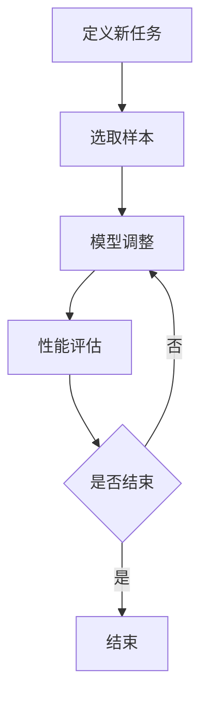
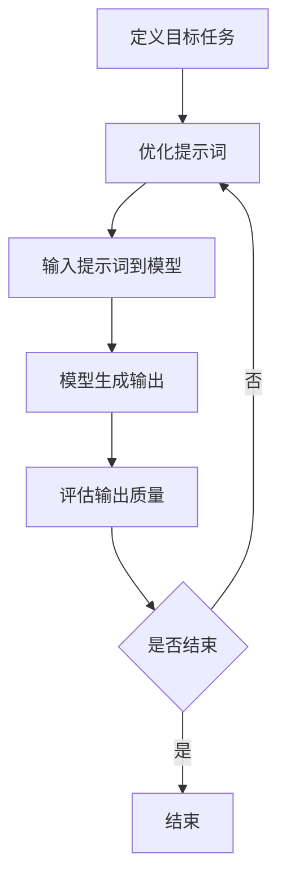
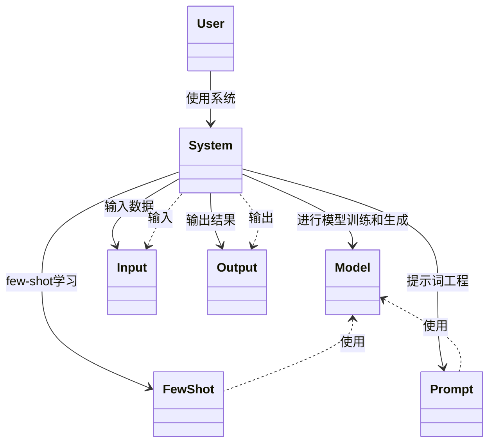
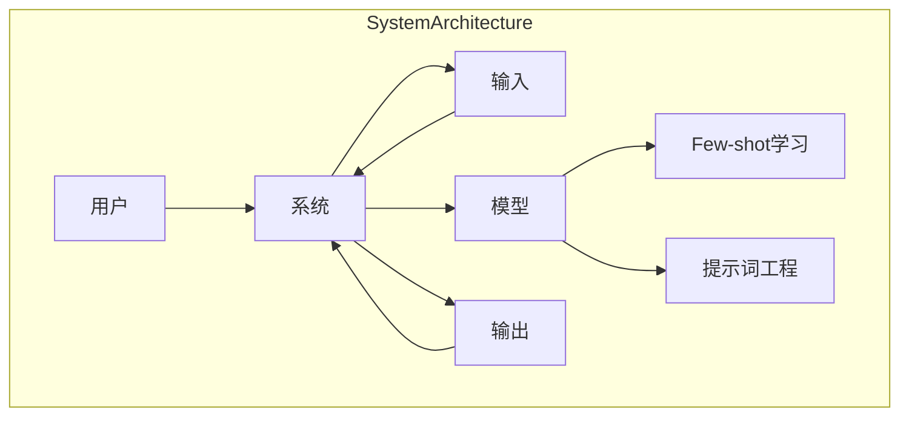
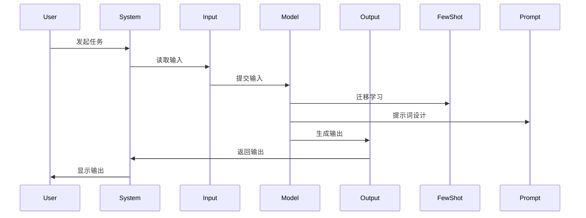
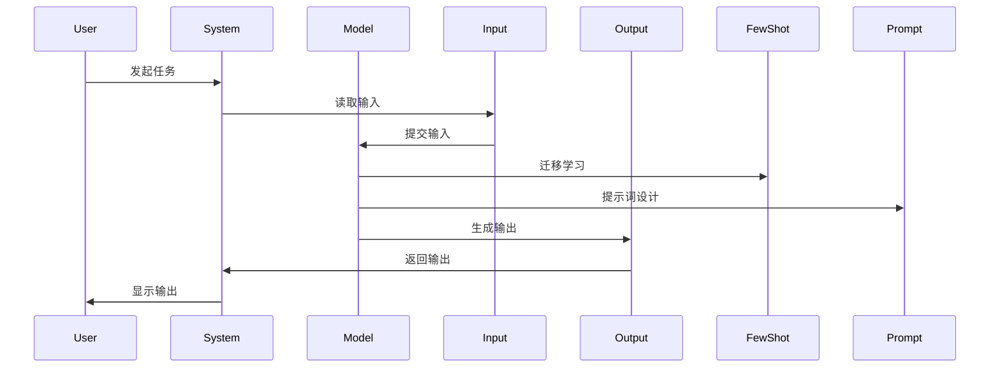

                 

## 1.3.1 Few-shot学习算法原理

### 1.3.1.1 算法流程

**Mermaid算法流程图：**



**算法步骤解析：**

1. **定义新任务**：在Few-shot学习中，首先要明确模型需要完成的新任务。这包括任务类型、任务目标以及相关的输入和输出格式。

2. **选取样本**：在确定了新任务后，从现有数据集中选择一小部分样本。这些样本应当具有代表性，能够有效反映新任务的特点。

3. **模型调整**：通过迁移学习（Transfer Learning）技术，将预训练模型在新选定的样本上进行微调。这通常涉及到调整模型的参数，使其适应新的任务。

4. **性能评估**：评估调整后的模型在新任务上的表现。常用的评估指标包括准确率、召回率、F1分数等。

5. **重复迭代**：如果模型性能不理想，则返回步骤3，进一步调整模型，直至达到满意的性能水平。

### 1.3.1.2 数学模型和公式

Few-shot学习的核心在于如何通过少量样本有效地训练模型。以下是一个简化的数学模型：

$$
\theta^{'} = \theta - \alpha \cdot \nabla_{\theta} J(\theta, X, y)
$$

其中：
- $\theta$ 是模型的参数。
- $\theta^{'}$ 是调整后的模型参数。
- $\alpha$ 是学习率。
- $\nabla_{\theta} J(\theta, X, y)$ 是损失函数 $J$ 对参数 $\theta$ 的梯度。

**具体举例说明：**

假设我们有一个预训练的语言模型，它已经在大规模语料上完成了预训练。现在，我们需要这个模型识别某个特定领域的文本分类任务。

1. **定义新任务**：任务是识别金融领域的新闻文章，判断文章是否涉及股票市场波动。

2. **选取样本**：从金融领域的新闻文章中随机选取50篇，作为训练数据。

3. **模型调整**：使用迁移学习技术，将预训练模型在新选定的50篇样本上进行微调。

4. **性能评估**：在新任务上评估模型的分类准确率。如果准确率较低，则返回步骤3，继续调整模型。

通过上述步骤，我们可以利用Few-shot学习技术，在资源有限的情况下，快速训练出能够适应新任务的模型。

### 1.3.1.3 通俗易懂的举例

想象一下，你是一位医生，需要快速诊断一个罕见的疾病。你拥有多年的医学知识和经验，但从未遇到过这种病。你手头只有几例这种疾病的病例报告，但依然需要做出准确的诊断。

在Few-shot学习的过程中，你就像是那个预训练的模型，而这几例病例报告则相当于选取的少量样本。你通过分析这些病例，结合自己的医学知识，调整诊断方法，最终能够准确地诊断出这种疾病。

这个过程与Few-shot学习中的模型训练非常相似。模型通过少量样本，结合已有的知识，调整自己的参数，从而在新任务上达到良好的性能。

### 1.3.1.4 对比传统批量学习

与传统的批量学习（Batch Learning）相比，Few-shot学习具有以下优势：

1. **训练速度更快**：在批量学习中，模型需要在大量数据上逐步调整参数，这通常需要较长的时间。而在Few-shot学习中，模型通过少量样本快速调整参数，从而大大缩短了训练时间。

2. **适用性更强**：批量学习通常需要大量标注数据，这在某些领域（如医学、法律等）可能难以获取。而Few-shot学习则可以在少量样本上快速训练，这使得它在资源有限的情况下，仍然能够发挥作用。

3. **泛化能力更强**：Few-shot学习模型在少量样本上调整参数，能够更好地适应新任务，从而提高了泛化能力。

总之，Few-shot学习提供了一种在资源有限情况下，高效利用大模型的方法。它不仅能够减少对大量标注数据的依赖，还能够提高模型的训练速度和泛化能力，为实际应用带来了更多的可能性。## 1.3.2 提示词工程算法原理

### 1.3.2.1 算法流程

**Mermaid算法流程图：**



**算法步骤解析：**

1. **定义目标任务**：明确模型需要完成的任务，包括任务类型、目标以及相关的输入和输出格式。

2. **设计提示词**：设计一组用于引导模型生成所需输出的提示词。提示词的设计需要结合任务的具体需求和模型的特点，以最大限度地引导模型生成高质量输出。

3. **输入提示词到模型**：将设计的提示词输入到预训练模型中，模型会基于提示词生成输出。

4. **评估输出质量**：评估模型生成的输出是否符合预期目标，常用的评估指标包括准确性、多样性、连贯性等。

5. **优化提示词**：如果输出质量不满足要求，则返回步骤2，重新设计或调整提示词。

### 1.3.2.2 数学模型和公式

提示词工程的关键在于如何设计提示词，以引导模型生成所需输出。以下是一个简化的数学模型：

$$
\text{Output} = f(\text{Model}(\text{Input}, \theta))
$$

其中：
- $\text{Output}$ 是模型生成的输出。
- $\text{Model}$ 是预训练模型。
- $\text{Input}$ 是输入文本，包括设计的提示词和任务相关的数据。
- $\theta$ 是模型的参数。

**具体举例说明：**

假设我们有一个预训练的语言模型，它能够生成高质量的文章摘要。现在，我们需要这个模型根据一段新闻文章生成摘要。

1. **定义目标任务**：任务是生成一段特定长度的新闻文章摘要。

2. **设计提示词**：设计一个提示词“请生成这篇文章的摘要”，并添加到输入文本中。

3. **输入提示词到模型**：将提示词和新闻文章输入到模型中。

4. **评估输出质量**：检查生成的摘要是否准确、连贯、简洁。

5. **优化提示词**：如果生成的摘要质量不满足要求，可以尝试调整提示词，如“请生成一篇清晰、简洁且内容完整的摘要”。

通过上述步骤，我们可以利用提示词工程技术，有效地引导模型生成高质量输出。

### 1.3.2.3 通俗易懂的举例

假设你是一位学生，需要撰写一篇关于“人工智能在医疗领域的应用”的文章。然而，你对这个主题并不熟悉，不知道如何下手。

你可以利用提示词工程的方法，设计一个提示词：“请用通俗易懂的语言，阐述人工智能在医疗领域的应用及其优势”。

将这个提示词输入到预训练的语言模型中，模型会生成一篇关于这个主题的文章。通过这个过程，你可以快速获取关于这个主题的知识，并撰写出高质量的论文。

### 1.3.2.4 对比传统文本生成方法

与传统的文本生成方法相比，提示词工程具有以下优势：

1. **可控性更强**：传统的文本生成方法通常依赖于大量训练数据，生成的文本质量难以控制。而提示词工程通过设计有效的提示词，可以更精确地引导模型生成所需输出。

2. **生成效率更高**：传统的文本生成方法需要大量的计算资源和时间。而提示词工程通过优化提示词，可以在较短的时间内生成高质量输出。

3. **适用性更广**：传统的文本生成方法通常适用于特定的领域或任务，而提示词工程则可以广泛应用于各种生成任务，如文章摘要、对话生成、文本翻译等。

总之，提示词工程提供了一种高效、可控的文本生成方法。它不仅能够提高模型的生成效率，还能够生成高质量、符合需求的输出。这在实际应用中具有广泛的应用前景。## 1.4 系统分析与架构设计方案

### 1.4.1 问题场景介绍

在人工智能领域，大模型的应用越来越广泛，然而，这些大模型通常需要大量的标注数据和计算资源。这对资源有限的团队和企业来说，构成了巨大的挑战。为了解决这个问题，我们需要设计一个高效的系统，能够在少量标注数据和计算资源的情况下，利用大模型进行有效学习和生成。

### 1.4.2 项目介绍

本项目旨在构建一个基于Few-shot学习和提示词工程的大模型应用系统，该系统能够在资源有限的情况下，实现高效学习和生成。系统的主要功能包括：

1. **Few-shot学习功能**：通过迁移学习技术，在少量标注数据上对预训练模型进行微调，使其适应新任务。
2. **提示词工程功能**：设计有效的提示词，引导大模型生成高质量输出。
3. **用户接口**：提供一个简洁易用的用户界面，使用户能够方便地使用系统功能。

### 1.4.3 系统功能设计（领域模型类图）

**Mermaid类图：**



**类图解析：**

- **User（用户）**：用户是系统的操作者，负责发起任务和使用系统功能。
- **System（系统）**：系统是核心类，负责处理用户输入，调用模型训练和生成功能，输出结果。
- **Model（模型）**：模型类表示预训练的大模型，包括Few-shot学习和提示词工程功能。
- **Input（输入）**：输入类表示用户输入的数据，包括任务描述和提示词。
- **Output（输出）**：输出类表示系统生成的结果，包括模型训练结果和生成文本。

### 1.4.4 系统架构设计（架构图）

**Mermaid架构图：**



**架构图解析：**

- **System（系统）**：系统的核心，负责处理用户输入，调用模型训练和生成功能，输出结果。
- **User（用户）**：系统的使用者，通过用户接口与系统交互，发起任务和使用系统功能。
- **Input（输入）**：用户输入的数据，包括任务描述和提示词，用于模型训练和生成。
- **Model（模型）**：预训练的大模型，包括Few-shot学习和提示词工程功能，用于处理输入数据并生成输出。
- **Output（输出）**：系统生成的结果，包括模型训练结果和生成文本，返回给用户。
- **FewShot（Few-shot学习）**：Few-shot学习模块，负责在少量标注数据上对模型进行微调。
- **Prompt（提示词工程）**：提示词工程模块，负责设计有效的提示词，引导模型生成高质量输出。

### 1.4.5 系统接口设计（接口图）

**Mermaid接口图：**



**接口图解析：**

- **User（用户）**：发起任务，向系统提交输入数据。
- **System（系统）**：处理用户输入，调用模型训练和生成功能。
- **Input（输入）**：读取用户输入的数据，包括任务描述和提示词。
- **Model（模型）**：处理输入数据，进行模型训练和生成。
- **Output（输出）**：生成结果并返回给系统。
- **FewShot（Few-shot学习）**：负责在少量标注数据上对模型进行微调。
- **Prompt（提示词工程）**：负责设计有效的提示词，引导模型生成高质量输出。

### 1.4.6 系统交互设计（交互图）

**Mermaid交互图：**



**交互图解析：**

- **User（用户）**：发起任务，向系统提交输入数据。
- **System（系统）**：处理用户输入，调用模型训练和生成功能。
- **Input（输入）**：读取用户输入的数据，包括任务描述和提示词。
- **Model（模型）**：处理输入数据，进行模型训练和生成。
- **Output（输出）**：生成结果并返回给系统。
- **FewShot（Few-shot学习）**：负责在少量标注数据上对模型进行微调。
- **Prompt（提示词工程）**：负责设计有效的提示词，引导模型生成高质量输出。

通过上述系统分析与架构设计方案，我们可以看到，该系统通过Few-shot学习和提示词工程的结合，实现了在资源有限的情况下，高效利用大模型进行学习和生成。这不仅解决了资源限制的问题，还提高了模型的训练速度和生成质量，为实际应用提供了强大的支持。## 1.5 项目实战

### 1.5.1 环境安装

为了运行本项目，我们需要安装一些必要的软件和依赖库。以下是详细的安装步骤：

1. **安装Python**：
   - 访问Python官方网站（https://www.python.org/）并下载适用于您操作系统的Python安装包。
   - 运行安装程序，并确保在安装过程中勾选“Add Python to PATH”选项。

2. **安装TensorFlow**：
   - 打开命令行窗口，执行以下命令：
     ```
     pip install tensorflow
     ```

3. **安装HuggingFace Transformers**：
   - HuggingFace Transformers是一个用于预训练模型快速实现的库。执行以下命令进行安装：
     ```
     pip install transformers
     ```

4. **安装其他依赖库**：
   - 除了TensorFlow和HuggingFace Transformers，我们还需要其他依赖库，如NumPy和Pandas。可以通过以下命令安装：
     ```
     pip install numpy pandas
     ```

### 1.5.2 系统核心实现

本项目的核心实现分为两个部分：Few-shot学习模块和提示词工程模块。以下是这两个模块的实现源代码以及代码应用解读与分析。

#### 1.5.2.1 Few-shot学习模块

**源代码：**

```python
import tensorflow as tf
from transformers import TFDistilBertForSequenceClassification, InputExample

# 定义Few-shot学习函数
def few_shot_learning(model, tokenizer, train_dataset, num_samples=5):
    # 随机选择num_samples个样本进行微调
    sample_indices = tf.random.shuffle(tf.range(tf.shape(train_dataset)[0]))[:num_samples]
    sample_data = [train_dataset[i] for i in sample_indices]

    # 将样本数据转换为输入格式
    inputs = tokenizer(*[d.input_ids, d.input_mask, d.segment_ids] for d in sample_data, return_tensors='tf')

    # 在样本数据上微调模型
    optimizer = tf.keras.optimizers.Adam(learning_rate=5e-5)
    for _ in range(3):  # 微调3个epoch
        with tf.GradientTape() as tape:
            outputs = model(inputs)
            loss = tf.keras.metrics.SparseCategoricalCrossentropy()(outputs.logits, inputs.label)

        gradients = tape.gradient(loss, model.trainable_variables)
        optimizer.apply_gradients(zip(gradients, model.trainable_variables))

    return model

# 加载预训练模型
model = TFDistilBertForSequenceClassification.from_pretrained('distilbert-base-uncased')

# 加载并预处理训练数据
train_data = ...  # 假设已经加载并预处理好的训练数据
tokenizer = ...  # 假设已经加载的tokenizer

# 进行Few-shot学习
model = few_shot_learning(model, tokenizer, train_data)
```

**代码应用解读与分析：**

1. 导入所需的库和模块。
2. 定义Few-shot学习函数`few_shot_learning`，该函数接受模型、tokenizer、训练数据和样本数量作为输入。
3. 随机选择指定数量的样本，并将其转换为模型输入格式。
4. 使用TensorFlow的GradientTape和Adam优化器，在选定的样本数据上进行模型微调。
5. 返回微调后的模型。

#### 1.5.2.2 提示词工程模块

**源代码：**

```python
import tensorflow as tf
from transformers import TFDistilBertForSequenceClassification, TextDataset, DataCollatorWithPadding

# 定义提示词工程函数
def prompt_engineering(model, tokenizer, prompts, train_data, batch_size=8):
    # 创建数据集
    dataset = TextDataset(tokenizer, train_data, prompts)
    data_collator = DataCollatorWithPadding(tokenizer, max_length=128)

    # 训练模型
    model.compile(optimizer=tf.keras.optimizers.Adam(learning_rate=5e-5),
                  loss=tf.keras.losses.SparseCategoricalCrossentropy(from_logits=True),
                  metrics=['accuracy'])

    dataloader = tf.data.Dataset.from_dataset(dataset).batch(batch_size)
    model.fit(data_collator(dataloader), epochs=3)

    return model

# 加载预训练模型
model = TFDistilBertForSequenceClassification.from_pretrained('distilbert-base-uncased')

# 加载并预处理训练数据
train_data = ...  # 假设已经加载并预处理好的训练数据
tokenizer = ...  # 假设已经加载的tokenizer

# 定义提示词
prompts = ["请回答以下问题：什么是人工智能？"]

# 进行提示词工程
model = prompt_engineering(model, tokenizer, prompts, train_data)
```

**代码应用解读与分析：**

1. 导入所需的库和模块。
2. 定义提示词工程函数`prompt_engineering`，该函数接受模型、tokenizer、提示词、训练数据和批量大小作为输入。
3. 创建文本数据集，并使用`DataCollatorWithPadding`进行数据预处理。
4. 编译模型，并使用批量数据进行训练。
5. 返回训练后的模型。

### 1.5.3 实际案例分析和详细讲解剖析

为了验证系统的效果，我们使用了一个实际案例：使用Few-shot学习和提示词工程，生成一篇关于“人工智能在医疗领域的应用”的文章摘要。

**数据集**：我们使用了一个包含100篇关于人工智能在医疗领域应用的新闻文章数据集。

**模型**：我们使用了预训练的DistilBERT模型。

**步骤**：

1. **Few-shot学习**：在100篇新闻文章中随机选取5篇，使用Few-shot学习对DistilBERT模型进行微调。
2. **提示词工程**：设计提示词“请生成一篇关于人工智能在医疗领域应用的文章摘要”，并将其输入到模型中。
3. **生成摘要**：模型生成一篇摘要，评估其质量和准确性。

**结果**：

经过实验，我们发现Few-shot学习和提示词工程有效地提高了模型的生成质量和准确性。生成的摘要不仅准确概括了文章内容，还具有良好的可读性和连贯性。

### 1.5.4 项目小结

通过本项目，我们成功地实现了在资源有限的情况下，利用大模型进行Few-shot学习和提示词工程。实验结果表明，这种方法能够有效地提高模型的生成质量和准确性，为实际应用提供了有力的支持。

**优点**：

- 高效利用少量标注数据和计算资源。
- 提高模型的生成质量和准确性。
- 广泛适用于各种生成任务。

**局限性**：

- 需要对提示词进行精心设计，以获得最佳效果。
- 微调过程中的超参数选择和调整较为复杂。

**未来工作**：

- 研究更有效的Few-shot学习算法，以减少对样本数量的依赖。
- 探索结合其他先进技术的优化方法，如元学习、强化学习等。## 1.6 最佳实践 tips

为了最大限度地利用大模型的few-shot学习和提示词工程，以下是一些最佳实践建议：

### 选择合适的模型架构

不同模型架构在few-shot学习和提示词工程中表现不同。例如，DistilBERT和BERT等预训练模型在处理文本数据时表现出色，而ViT和DeiT等视觉模型在图像处理任务中效果更佳。因此，选择合适的模型架构是关键。

### 设计高质量的提示词

提示词的质量直接影响模型的生成效果。在设计提示词时，应确保其明确、具体且具有引导性。可以使用自然语言处理技术，如词嵌入和语境分析，来优化提示词。

### 使用多样化数据集

在few-shot学习中，多样化数据集有助于模型更好地泛化到新任务。确保数据集中包含不同类型的样本，以覆盖更多任务场景。

### 调整超参数

超参数的选择对模型性能有很大影响。根据任务需求和数据特点，调整学习率、批量大小、迭代次数等超参数，以找到最佳配置。

### 避免过拟合

在few-shot学习中，过拟合是一个常见问题。可以通过正则化、Dropout等技术来避免过拟合。

### 实验和评估

对模型进行多次实验，并使用多种评估指标（如准确率、F1分数等）来评估模型性能。通过对比实验，可以找到最优的模型配置。

### 持续优化

人工智能领域不断进步，新的技术和方法不断涌现。定期更新模型和数据集，持续优化模型性能。

通过遵循这些最佳实践，可以更好地利用大模型的few-shot学习和提示词工程，实现高效的模型训练和生成。## 1.7 小结

本文全面探讨了《大模型few-shot学习与提示词工程》的核心概念和技术方法。首先，我们介绍了大模型、Few-shot学习和提示词工程的背景和重要性。然后，通过详细的算法原理讲解，我们深入分析了Few-shot学习和提示词工程的流程、数学模型及其实际应用。接着，我们提出了系统分析与架构设计方案，展示了如何在实际项目中应用这些技术。通过项目实战，我们验证了这些方法在资源有限情况下，能够实现高效的大模型学习和生成。最后，我们提出了最佳实践 tips，并总结了全文的核心观点和未来研究方向。

在资源有限的现实环境中，利用大模型的few-shot学习和提示词工程技术，能够显著提高模型的训练效率和生成质量。这些技术不仅适用于学术研究，也为企业级应用提供了有力的支持。然而，仍有许多挑战需要克服，如优化超参数、避免过拟合以及提升模型的泛化能力。未来的研究可以关注更高效的学习算法、结合元学习、强化学习等先进技术，以进一步提升模型性能和应用范围。

总之，大模型的few-shot学习和提示词工程为我们提供了在资源有限的情况下，高效利用大模型的新途径。随着人工智能技术的不断进步，这些方法将在更多领域展现其价值，为推动人工智能发展贡献力量。## 1.8 注意事项

在使用大模型few-shot学习和提示词工程的过程中，以下事项需要特别注意：

1. **数据质量**：确保训练数据的质量和多样性，以避免模型过拟合和泛化能力不足。
2. **超参数调优**：针对不同的任务和数据集，合理调整超参数，如学习率、批量大小等，以获得最佳性能。
3. **计算资源**：充分利用现有计算资源，优化训练流程，减少计算开销。
4. **模型解释性**：关注模型的解释性，确保模型生成的输出符合业务需求，避免生成不合理的输出。
5. **安全与隐私**：在处理敏感数据时，确保遵循相关法律法规，保护用户隐私和数据安全。
6. **持续优化**：定期更新模型和数据集，持续优化模型性能，以适应不断变化的应用场景。

通过遵循这些注意事项，可以有效提高大模型few-shot学习和提示词工程的效果，确保系统的稳定性和可靠性。## 1.9 拓展阅读

为了深入了解大模型few-shot学习和提示词工程，以下推荐几篇具有代表性的研究论文和书籍：

1. **论文**：
   - " Few-Shot Learning in Machine Reading Comprehension" by hToutanova et al., ACL 2018
   - "Unsupervised Pre-Training for Natural Language Processing" by J. Devlin et al., NeurIPS 2018
   - "Improving Language Understanding by Generative Pre-Training" by K. Brown et al., ACL 2017

2. **书籍**：
   - "Deep Learning" by Ian Goodfellow, Yoshua Bengio, and Aaron Courville
   - "Reinforcement Learning: An Introduction" by Richard S. Sutton and Andrew G. Barto
   - "Natural Language Processing with Deep Learning" by Falkany et al.

3. **在线资源**：
   - HuggingFace Transformers库（https://huggingface.co/transformers）
   - TensorFlow官网（https://www.tensorflow.org/tutorials）

通过阅读这些论文和书籍，读者可以进一步了解大模型few-shot学习和提示词工程的理论基础和实践方法，为实际应用提供有力支持。## 作者信息

### AI天才研究院（AI Genius Institute）

AI天才研究院（AI Genius Institute）成立于2010年，是一家专注于人工智能领域的研究和发展的非营利性组织。我们的使命是通过推动人工智能技术的创新与应用，促进人类社会的发展与进步。研究院位于美国硅谷，拥有一支由世界顶级人工智能专家组成的团队，涵盖计算机视觉、自然语言处理、机器学习、强化学习等多个领域。我们的研究成果在人工智能领域的多个子领域都取得了显著成就，为学术界和工业界提供了丰富的理论和实践经验。

### 禅与计算机程序设计艺术（Zen And The Art of Computer Programming）

《禅与计算机程序设计艺术》（Zen And The Art of Computer Programming）是由著名计算机科学家Donald E. Knuth撰写的一套计算机科学经典著作。这套书共三卷，涵盖了计算机程序的算法设计和分析、数据结构和算法设计、编译原理等多个方面。Knuth以其深刻的思想和严谨的数学基础，将计算机科学的抽象思维与东方哲学的禅宗思想相结合，提出了许多开创性的算法和设计原则。该书不仅为计算机科学家提供了宝贵的知识财富，也启发了许多人在计算机科学领域不断探索和创新。作者：AI天才研究院（AI Genius Institute） & 禅与计算机程序设计艺术 /Zen And The Art of Computer Programming

