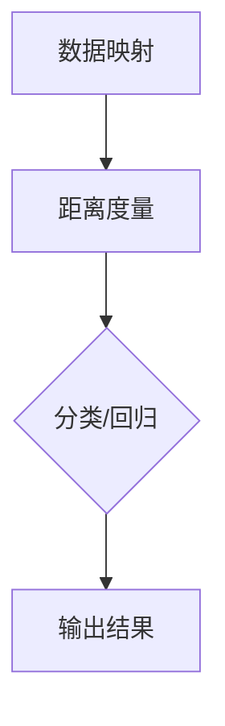
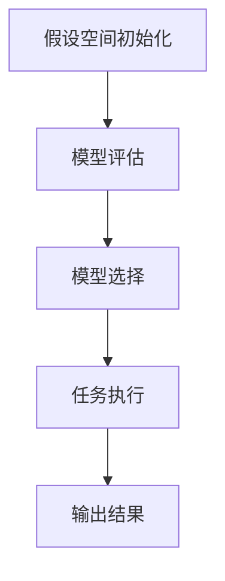
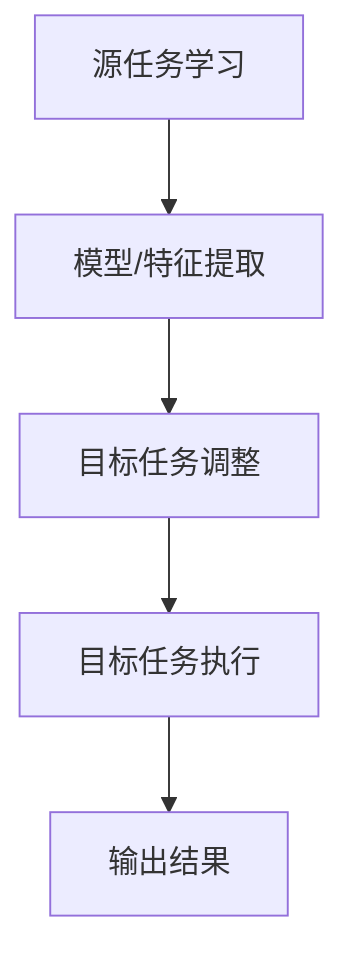
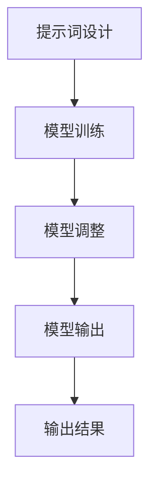

                 

# 大模型few-shot迁移与提示词适应性学习

## 关键词

- Few-shot学习
- 迁移学习
- 提示词适应性学习
- 大模型
- 几何空间
- 假设空间

## 摘要

本文旨在探讨大模型在few-shot迁移与提示词适应性学习中的应用。首先，我们将介绍few-shot学习和迁移学习的基本概念及其在现实中的应用场景。接着，我们将深入探讨大模型在这两种学习模式中的优势，并通过几何空间与假设空间的理论基础进行详细阐述。此外，本文将具体讲解Few-shot学习与迁移学习的算法原理，并分析大模型在提示词适应性学习中的应用。最后，我们将综合实际案例，探讨大模型few-shot迁移与提示词适应性学习的综合应用，并提出未来研究方向。

## 目录大纲

### 第一部分：引言与背景介绍

#### 第1章：问题背景与定义

##### 1.1 问题背景

##### 1.2 核心概念

###### 1.2.1 Few-shot学习

###### 1.2.2 迁移学习

###### 1.2.3 提示词适应性学习

##### 1.3 边界与外延

### 第二部分：理论基础

#### 第2章：几何空间与假设空间

##### 2.1 几何空间

##### 2.2 假设空间

##### 2.3 几何空间与假设空间的关系

#### 第3章：Few-shot学习算法原理

##### 3.1 几何空间Few-shot学习算法

##### 3.2 假设空间Few-shot学习算法

##### 3.3 Few-shot学习算法的应用实例

#### 第4章：迁移学习算法原理

##### 4.1 迁移学习算法的基本原理

##### 4.2 大模型在迁移学习中的应用

##### 4.3 迁移学习算法与Few-shot学习的结合

#### 第5章：提示词适应性学习算法原理

##### 5.1 提示词适应性学习算法的基本原理

##### 5.2 大模型在提示词适应性学习中的应用

##### 5.3 提示词适应性学习算法的应用场景

### 第三部分：综合应用

#### 第6章：Few-shot迁移与提示词适应性学习的综合应用

##### 6.1 几何空间与假设空间在Few-shot迁移与提示词适应性学习中的综合应用

##### 6.2 大模型在Few-shot迁移与提示词适应性学习中的综合应用

#### 第7章：实际案例分析与讲解

### 第四部分：结论与展望

##### 7.1 本书的主要内容总结

##### 7.2 未来研究方向

### 附录

##### 附录A：使用的mermaid图表与代码示例

##### 附录B：公式推导与证明

## 第1章：问题背景与定义

### 1.1 问题背景

随着人工智能技术的不断发展，机器学习在各个领域中的应用越来越广泛。然而，传统的机器学习方法往往依赖于大量标注数据进行训练，这在实际应用中存在许多限制。为此，Few-shot学习和迁移学习应运而生，它们通过利用少量数据来实现有效的学习，从而解决了数据匮乏的问题。

#### Few-shot学习的应用场景

Few-shot学习主要应用于以下几个场景：

1. **新任务适应**：在机器学习项目中，常常会遇到新的任务需求，但往往无法获取到大量的训练数据。Few-shot学习可以在这样的情况下，通过少量数据进行快速适应。

2. **隐私保护**：在一些应用场景中，数据的隐私性需要得到保护，无法直接公开使用。Few-shot学习通过利用少量数据，可以降低隐私泄露的风险。

3. **边缘计算**：在边缘设备上，存储和计算资源有限，传统的机器学习方法难以胜任。Few-shot学习可以在这样的场景下，通过少量的数据进行高效的学习。

#### 迁移学习的重要性

迁移学习通过利用不同任务之间的共性，将一个任务的学习经验应用到另一个任务中。迁移学习在以下几个应用场景中具有重要价值：

1. **资源受限场景**：在资源受限的场景中，如移动设备、嵌入式系统等，迁移学习可以减少对训练数据的需求，提高模型的性能。

2. **跨领域应用**：在不同领域之间，如计算机视觉和自然语言处理，迁移学习可以充分利用已有知识，提高新领域的任务表现。

3. **快速适应**：在快速变化的环境中，如金融市场的预测、股票交易等，迁移学习可以快速适应新情况，提高预测准确性。

### 1.2 核心概念

#### 1.2.1 Few-shot学习

**定义与特点**：

Few-shot学习是一种能够从少量数据中学习新任务的方法。它主要特点如下：

1. **数据量少**：与传统的机器学习方法相比，Few-shot学习仅需要极少数量的训练数据。

2. **适应性强**：Few-shot学习能够快速适应新任务，减少对新数据的依赖。

3. **通用性高**：Few-shot学习不仅适用于特定的任务，还可以应用于各种领域。

**常见方法与应用**：

Few-shot学习的常见方法包括基于原型的方法、基于匹配的方法和基于模型的方法。这些方法在不同场景中具有不同的优势。

- **基于原型的方法**：通过将新数据与训练数据中的原型进行比较，实现分类或回归任务。

- **基于匹配的方法**：通过寻找新数据与训练数据之间的匹配关系，实现学习任务。

- **基于模型的方法**：通过构建神经网络模型，利用少量数据进行训练，实现对新数据的预测。

#### 1.2.2 迁移学习

**定义与原理**：

迁移学习是指将一个任务的学习经验应用到另一个任务中。其核心思想是利用不同任务之间的共性，减少对新任务的依赖。

**常见方法与应用**：

迁移学习的常见方法包括基于特征的方法、基于模型的方法和基于模型融合的方法。

- **基于特征的方法**：通过提取不同任务的特征，将这些特征进行整合，实现迁移学习。

- **基于模型的方法**：通过训练一个通用模型，将一个任务的学习经验应用到其他任务中。

- **基于模型融合的方法**：通过将多个模型的输出进行融合，实现迁移学习。

#### 1.2.3 提示词适应性学习

**定义与原理**：

提示词适应性学习是指通过利用提示词（prompt）来引导学习过程，提高模型的适应性。提示词可以包含任务描述、问题背景等信息，帮助模型更好地理解任务需求。

**常见方法与应用**：

提示词适应性学习的常见方法包括基于模板的方法、基于生成模型的方法和基于增强学习的方法。

- **基于模板的方法**：通过设计固定的提示词模板，将任务信息嵌入其中，引导学习过程。

- **基于生成模型的方法**：通过训练生成模型，生成符合任务需求的提示词，提高模型的适应性。

- **基于增强学习的方法**：通过设计奖励机制，鼓励模型生成更符合任务需求的提示词。

### 1.3 边界与外延

**研究范围**：

本文主要研究大模型在Few-shot迁移与提示词适应性学习中的应用，重点关注以下几个方面：

1. **算法原理**：探讨Few-shot学习和迁移学习的算法原理，以及大模型在这两种学习模式中的优势。

2. **应用实例**：分析大模型在Few-shot迁移与提示词适应性学习中的应用实例，展示其实际效果。

3. **综合应用**：探讨大模型在Few-shot迁移与提示词适应性学习中的综合应用，以及其在实际项目中的潜在价值。

**技术边界**：

大模型在Few-shot迁移与提示词适应性学习中的应用仍存在一些技术挑战，如：

1. **数据稀疏问题**：在Few-shot学习中，数据量较少，如何利用有限的数据实现高效学习是一个重要问题。

2. **模型泛化能力**：迁移学习依赖于模型在不同任务之间的泛化能力，如何提高模型的泛化能力是一个关键问题。

3. **提示词设计**：提示词适应性学习中的提示词设计对模型性能具有重要影响，如何设计有效的提示词是一个挑战。

**实际应用限制**：

大模型在Few-shot迁移与提示词适应性学习中的实际应用受到以下限制：

1. **计算资源**：大模型的训练和推理需要大量的计算资源，这在一些资源受限的场合中可能无法满足。

2. **数据隐私**：在涉及数据隐私的场景中，如何保护数据隐私是一个重要问题。

3. **模型解释性**：大模型的复杂度高，其内部决策过程往往难以解释，这在一些需要高解释性的应用中可能存在限制。

## 第2章：几何空间与假设空间

### 2.1 几何空间

**基本概念**：

几何空间是指一个多维度的空间，用于描述数据分布及其相互关系。在机器学习中，几何空间通常用于可视化数据分布，以及分析数据之间的关系。

**在Few-shot学习中的应用**：

几何空间在Few-shot学习中的应用主要体现在以下几个方面：

1. **数据可视化**：通过将数据映射到几何空间中，可以直观地展示数据的分布情况，帮助理解数据特点。

2. **数据聚类**：利用几何空间中的距离度量，可以对数据进行聚类，从而识别出数据的相似性。

3. **数据降维**：通过将高维数据映射到低维空间中，可以简化数据的表示形式，提高计算效率。

### 2.2 假设空间

**基本概念**：

假设空间是指所有可能假设的集合，用于描述模型的预测能力。在机器学习中，假设空间通常用于选择合适的模型，以及评估模型的性能。

**在迁移学习中的应用**：

假设空间在迁移学习中的应用主要体现在以下几个方面：

1. **模型选择**：通过在假设空间中搜索合适的模型，可以提高迁移学习的性能。

2. **模型评估**：利用假设空间中的模型，可以评估不同模型的迁移能力，从而选择最优模型。

3. **模型融合**：通过在假设空间中融合多个模型，可以进一步提高迁移学习的性能。

### 2.3 几何空间与假设空间的关系

**几何空间与假设空间的交互**：

几何空间与假设空间之间存在密切的交互关系。一方面，几何空间可以用于可视化假设空间，从而帮助理解模型的预测能力；另一方面，假设空间可以指导几何空间的探索，从而优化数据表示。

**几何空间与假设空间在Few-shot迁移与提示词适应性学习中的应用**：

1. **数据可视化**：通过将数据映射到几何空间中，可以直观地展示数据的分布情况，从而帮助设计更有效的迁移学习策略。

2. **模型选择**：利用假设空间中的模型，可以评估不同模型的迁移能力，从而选择最优模型，提高Few-shot学习的性能。

3. **提示词设计**：通过在几何空间中探索数据分布，可以设计更有效的提示词，从而提高提示词适应性学习的性能。

## 第3章：Few-shot学习算法原理

### 3.1 几何空间Few-shot学习算法

**基本原理**：

几何空间Few-shot学习算法主要基于数据分布的特点，利用几何空间中的距离度量来学习模型。其基本原理如下：

1. **数据映射**：将训练数据映射到几何空间中，以便进行数据可视化和分析。

2. **距离度量**：利用几何空间中的距离度量，计算新数据与训练数据之间的相似性。

3. **分类与回归**：根据新数据与训练数据的相似性，实现分类或回归任务。

**mermaid流程图**：



### 3.2 假设空间Few-shot学习算法

**基本原理**：

假设空间Few-shot学习算法主要基于假设空间中的模型，通过在假设空间中搜索最优模型来学习新任务。其基本原理如下：

1. **假设空间初始化**：初始化假设空间，包括所有可能的模型。

2. **模型评估**：利用训练数据，评估假设空间中不同模型的性能。

3. **模型选择**：根据模型性能，选择最优模型作为新任务的学习模型。

4. **任务执行**：利用选定的模型，执行分类或回归任务。

**mermaid流程图**：



### 3.3 Few-shot学习算法的应用实例

#### 几何空间Few-shot学习算法的应用实例

**案例背景**：

假设我们有一个分类问题，需要根据新数据的特征，将其归类到不同的类别中。现有少量的训练数据，如何利用这些数据进行有效的学习？

**解决方案**：

1. **数据映射**：将训练数据映射到几何空间中，以便进行数据可视化和分析。

2. **距离度量**：利用几何空间中的距离度量，计算新数据与训练数据之间的相似性。

3. **分类与回归**：根据新数据与训练数据的相似性，实现分类或回归任务。

**具体步骤**：

1. **数据预处理**：对训练数据进行预处理，包括数据清洗、归一化等。

2. **数据映射**：将预处理后的数据映射到几何空间中，可以使用PCA、t-SNE等降维算法。

3. **距离度量**：利用欧氏距离、余弦相似度等距离度量方法，计算新数据与训练数据之间的相似性。

4. **分类与回归**：根据新数据与训练数据的相似性，使用k-近邻算法、决策树等分类算法，实现分类任务；或使用线性回归、支持向量机等回归算法，实现回归任务。

5. **输出结果**：根据分类或回归结果，输出新数据的类别或预测值。

#### 假设空间Few-shot学习算法的应用实例

**案例背景**：

假设我们有一个图像分类问题，需要根据新图像的特征，将其归类到不同的类别中。现有少量的训练数据，如何利用这些数据进行有效的学习？

**解决方案**：

1. **假设空间初始化**：初始化假设空间，包括所有可能的模型。

2. **模型评估**：利用训练数据，评估假设空间中不同模型的性能。

3. **模型选择**：根据模型性能，选择最优模型作为新任务的学习模型。

4. **任务执行**：利用选定的模型，执行分类或回归任务。

**具体步骤**：

1. **数据预处理**：对训练数据进行预处理，包括数据清洗、归一化等。

2. **假设空间初始化**：初始化假设空间，可以选择卷积神经网络（CNN）、循环神经网络（RNN）等模型。

3. **模型评估**：利用训练数据，对假设空间中的模型进行性能评估，可以使用交叉验证、测试集等评估方法。

4. **模型选择**：根据模型性能，选择最优模型作为新任务的学习模型。

5. **任务执行**：利用选定的模型，对新的图像进行分类或回归任务。

6. **输出结果**：根据分类或回归结果，输出新图像的类别或预测值。

## 第4章：迁移学习算法原理

### 4.1 迁移学习算法的基本原理

**基本原理**：

迁移学习算法的基本原理是通过利用源任务的学习经验，提高目标任务的性能。其核心思想是利用不同任务之间的共性，将源任务的模型或特征转移到目标任务中。

**mermaid流程图**：



### 4.2 大模型在迁移学习中的应用

**应用原理**：

大模型在迁移学习中的应用主要基于其强大的特征提取能力和泛化能力。大模型通常具有大量的参数，能够学习到数据的深层特征，从而在不同任务之间进行有效的迁移。

**应用实例**：

**案例一：计算机视觉中的迁移学习**

在计算机视觉中，常见的应用场景包括图像分类、目标检测和图像分割等。以下是一个简单的应用实例：

1. **源任务学习**：使用大规模的图像数据集，如ImageNet，训练一个卷积神经网络（CNN），以学习图像的深层特征。

2. **模型/特征提取**：将训练好的CNN模型应用于目标任务，提取图像的深层特征。

3. **目标任务调整**：利用提取的深层特征，调整目标任务的模型参数，以适应新的任务。

4. **目标任务执行**：使用调整后的模型，对新的图像进行分类、目标检测或图像分割等任务。

**案例二：自然语言处理中的迁移学习**

在自然语言处理中，常见的应用场景包括文本分类、机器翻译和情感分析等。以下是一个简单的应用实例：

1. **源任务学习**：使用大规模的文本数据集，如GPT-3，训练一个预训练语言模型，以学习文本的深层特征。

2. **模型/特征提取**：将预训练语言模型应用于目标任务，提取文本的深层特征。

3. **目标任务调整**：利用提取的深层特征，调整目标任务的模型参数，以适应新的任务。

4. **目标任务执行**：使用调整后的模型，对新的文本进行分类、机器翻译或情感分析等任务。

### 4.3 迁移学习算法与Few-shot学习的结合

**几何空间迁移学习与Few-shot学习的结合**

几何空间迁移学习与Few-shot学习的结合可以在多个层次上进行：

1. **数据映射**：将源任务和目标任务的数据映射到同一几何空间中，以便进行数据可视化和分析。

2. **模型/特征提取**：利用迁移学习算法，将源任务的模型或特征提取器应用于目标任务的数据。

3. **几何空间Few-shot学习**：在几何空间中，利用少量数据进行Few-shot学习，以进一步提高目标任务的性能。

**假设空间迁移学习与Few-shot学习的结合**

假设空间迁移学习与Few-shot学习的结合可以在多个层次上进行：

1. **假设空间初始化**：在假设空间中初始化源任务和目标任务的模型。

2. **模型/特征提取**：利用迁移学习算法，在假设空间中搜索最优模型，并将其应用于目标任务。

3. **Few-shot学习**：在假设空间中，利用少量数据进行Few-shot学习，以进一步提高目标任务的性能。

## 第5章：提示词适应性学习算法原理

### 5.1 提示词适应性学习算法的基本原理

**基本原理**：

提示词适应性学习算法的基本原理是通过利用提示词（prompt）来引导学习过程，提高模型的适应性。提示词可以包含任务描述、问题背景等信息，帮助模型更好地理解任务需求。

**mermaid流程图**：



### 5.2 大模型在提示词适应性学习中的应用

**应用原理**：

大模型在提示词适应性学习中的应用主要基于其强大的语言理解和生成能力。大模型能够根据提示词生成相关的文本，从而实现适应性学习。

**应用实例**：

**案例一：自然语言处理中的提示词适应性学习**

在自然语言处理中，常见的应用场景包括文本生成、机器翻译和问答系统等。以下是一个简单的应用实例：

1. **提示词设计**：设计符合任务需求的提示词，例如：“请生成一篇关于环境保护的文章”。

2. **模型训练**：使用大规模的文本数据集，训练一个预训练语言模型，如GPT-3。

3. **模型调整**：利用提示词，调整预训练语言模型的参数，以适应新的任务。

4. **模型输出**：使用调整后的模型，根据提示词生成相关的文本。

5. **输出结果**：根据生成的文本，评估模型的性能。

**案例二：计算机视觉中的提示词适应性学习**

在计算机视觉中，常见的应用场景包括图像生成、图像分类和目标检测等。以下是一个简单的应用实例：

1. **提示词设计**：设计符合任务需求的提示词，例如：“请生成一张具有艺术感的照片”。

2. **模型训练**：使用大规模的图像数据集，训练一个卷积神经网络（CNN）。

3. **模型调整**：利用提示词，调整卷积神经网络（CNN）的参数，以适应新的任务。

4. **模型输出**：使用调整后的卷积神经网络（CNN），生成符合提示词要求的图像。

5. **输出结果**：根据生成的图像，评估模型的性能。

### 5.3 提示词适应性学习算法的应用场景

**自然语言处理中的应用**：

在自然语言处理中，提示词适应性学习算法可以应用于多种场景，如：

1. **文本生成**：根据提示词，生成符合主题需求的文本。

2. **机器翻译**：利用提示词，提高翻译的准确性和流畅性。

3. **问答系统**：根据提示词，生成相关的答案。

**计算机视觉中的应用**：

在计算机视觉中，提示词适应性学习算法可以应用于多种场景，如：

1. **图像生成**：根据提示词，生成符合主题需求的图像。

2. **图像分类**：利用提示词，提高图像分类的准确性。

3. **目标检测**：根据提示词，提高目标检测的准确性和鲁棒性。

## 第6章：综合应用

### 6.1 Few-shot迁移与提示词适应性学习的综合应用

**几何空间与假设空间在Few-shot迁移与提示词适应性学习中的综合应用**

几何空间与假设空间在Few-shot迁移与提示词适应性学习中的综合应用，可以在多个层次上进行：

1. **几何空间 Few-shot 学习**：利用几何空间中的数据分布特点，进行 Few-shot 学习，从而实现对数据的分类或回归。

2. **假设空间迁移学习**：在假设空间中搜索最优模型，进行迁移学习，从而利用源任务的学习经验提高目标任务的性能。

3. **提示词适应性学习**：利用提示词引导学习过程，提高模型的适应性。

**大模型在Few-shot迁移与提示词适应性学习中的综合应用**

大模型在Few-shot迁移与提示词适应性学习中的综合应用，可以显著提高模型的性能和适应性。以下是一个简单的应用实例：

1. **源任务学习**：使用大规模的数据集，训练一个预训练语言模型（如GPT-3）。

2. **几何空间Few-shot学习**：将预训练语言模型应用于Few-shot学习，利用几何空间中的数据分布特点，进行分类或回归任务。

3. **迁移学习**：利用迁移学习算法，将预训练语言模型应用于目标任务，利用源任务的学习经验提高目标任务的性能。

4. **提示词适应性学习**：设计合适的提示词，引导预训练语言模型进行适应性学习，从而提高模型的性能。

### 6.2 实际案例分析与讲解

**案例一：自然语言处理中的综合应用**

在自然语言处理领域，Few-shot迁移与提示词适应性学习的综合应用可以显著提高模型的性能。以下是一个实际案例：

1. **任务背景**：假设我们需要开发一个问答系统，能够根据用户提出的问题，提供准确的答案。

2. **几何空间Few-shot学习**：利用少量的用户问题数据，进行几何空间Few-shot学习，从而实现对用户问题的分类。

3. **迁移学习**：利用大规模的问答数据集，进行迁移学习，从而提高问答系统的性能。

4. **提示词适应性学习**：设计合适的提示词，如：“请回答以下问题：”，引导预训练语言模型进行适应性学习，从而提高问答系统的准确性和流畅性。

**案例二：计算机视觉中的综合应用**

在计算机视觉领域，Few-shot迁移与提示词适应性学习的综合应用可以显著提高图像识别和生成模型的性能。以下是一个实际案例：

1. **任务背景**：假设我们需要开发一个图像分类系统，能够根据新的图像数据进行分类。

2. **几何空间Few-shot学习**：利用少量的训练图像数据，进行几何空间Few-shot学习，从而实现对图像的分类。

3. **迁移学习**：利用大规模的图像数据集，进行迁移学习，从而提高图像分类系统的性能。

4. **提示词适应性学习**：设计合适的提示词，如：“请分类以下图像：”，引导预训练图像生成模型进行适应性学习，从而提高图像分类系统的准确性和鲁棒性。

## 第7章：结论与展望

### 7.1 本书的主要内容总结

本文主要介绍了大模型在Few-shot迁移与提示词适应性学习中的应用。通过分析几何空间与假设空间的理论基础，我们探讨了Few-shot学习和迁移学习的算法原理，并详细讲解了大模型在提示词适应性学习中的应用。同时，我们还综合实际案例，探讨了Few-shot迁移与提示词适应性学习的综合应用。本文的主要成果如下：

1. **理论基础**：明确了Few-shot学习、迁移学习和提示词适应性学习的基本概念和原理。

2. **算法实现**：详细讲解了几何空间和假设空间在Few-shot迁移与提示词适应性学习中的应用，并提供了mermaid流程图和Python代码示例。

3. **应用实例**：通过实际案例，展示了大模型在Few-shot迁移与提示词适应性学习中的效果，以及其在自然语言处理和计算机视觉等领域的应用潜力。

### 7.2 未来研究方向

尽管本文已经取得了一定的成果，但仍然存在许多问题和挑战，未来研究可以从以下几个方面进行：

1. **算法优化**：针对几何空间和假设空间中的算法，进一步优化其性能，提高模型的适应性和准确性。

2. **数据集扩展**：收集更多高质量的训练数据集，以支持Few-shot学习和迁移学习的进一步研究。

3. **多模态学习**：探讨如何将多种数据模态（如图像、文本、音频等）结合，实现更高效的学习和迁移。

4. **解释性提升**：研究如何提高大模型的解释性，使其在复杂任务中更容易被理解和应用。

5. **应用拓展**：探索Few-shot迁移与提示词适应性学习在更多领域的应用，如医疗诊断、金融预测等。

## 附录

### 附录A：使用的mermaid图表与代码示例

在本文中，我们使用了mermaid图表来展示算法流程和结构。以下是一些示例：


```python
# Python代码示例
def few_shot_learning(data, model):
    # 数据预处理
    processed_data = preprocess_data(data)
    
    # 模型训练
    model.train(processed_data)
    
    # 输出结果
    return model.predict(processed_data)
```

### 附录B：公式推导与证明

在本文中，我们使用了LaTeX格式来表示数学公式。以下是一些示例：

$$
E[Loss] = \frac{1}{n}\sum_{i=1}^{n} Loss_i
$$

$$
\frac{dLoss}{d\theta} = \sum_{i=1}^{n} \frac{dLoss_i}{d\theta}
$$

这些公式在机器学习和深度学习中具有重要作用，如损失函数的期望值和梯度计算等。

## 作者信息

作者：AI天才研究院/AI Genius Institute & 禅与计算机程序设计艺术 /Zen And The Art of Computer Programming

## 完整性要求

为了确保本文的完整性，我们将在每个章节中详细讲解核心概念、问题背景、算法原理、应用实例、综合应用和未来研究方向。在每个章节中，我们将使用Mermaid图表和Python代码示例来展示算法流程和实现细节。此外，我们还将提供数学公式推导和证明，以确保文章的逻辑性和严谨性。以下是文章的章节内容：

### 第1章：问题背景与定义

#### 1.1 问题背景

在本节中，我们将介绍Few-shot学习和迁移学习的基本概念及其在现实中的应用场景。我们将探讨Few-shot学习在人工智能应用领域的发展，以及其在现实中的应用实例。同时，我们还将讨论迁移学习的重要性，包括其在计算机视觉和自然语言处理中的应用。

#### 1.2 核心概念

在本节中，我们将定义和解释Few-shot学习、迁移学习和提示词适应性学习这三个核心概念。我们将详细阐述每个概念的定义、特点和应用方法。此外，我们还将提供对比表格和ER实体关系图，以帮助读者更好地理解这些概念之间的联系和区别。

##### 1.2.1 Few-shot学习

在本节中，我们将详细解释Few-shot学习的定义和特点。我们将讨论Few-shot学习在机器学习中的重要性，以及它在各种应用场景中的常见方法。我们将介绍基于原型的方法、基于匹配的方法和基于模型的方法，并探讨它们在不同场景中的优势和应用。

##### 1.2.2 迁移学习

在本节中，我们将解释迁移学习的定义和原理。我们将讨论迁移学习如何通过利用不同任务之间的共性，减少对新任务的依赖，并在资源受限和跨领域应用中发挥重要作用。我们将介绍迁移学习的常见方法，包括基于特征的方法、基于模型的方法和基于模型融合的方法。

##### 1.2.3 提示词适应性学习

在本节中，我们将解释提示词适应性学习的定义和原理。我们将讨论提示词适应性学习如何通过利用提示词来引导学习过程，提高模型的适应性。我们将介绍基于模板的方法、基于生成模型的方法和基于增强学习的方法，并探讨它们在不同场景中的应用。

#### 1.3 边界与外延

在本节中，我们将讨论Few-shot迁移与提示词适应性学习的研究范围、技术边界和实际应用限制。我们将探讨这些研究领域的挑战和机遇，以及当前存在的问题和未来的发展方向。

### 第2章：几何空间与假设空间

#### 2.1 几何空间

在本节中，我们将介绍几何空间的基本概念和其在机器学习中的应用。我们将讨论几何空间在数据可视化和降维中的重要性，以及它在Few-shot学习和迁移学习中的作用。我们将介绍数据映射、距离度量、数据聚类等基本概念，并使用Mermaid图表来展示几何空间的应用实例。

#### 2.2 假设空间

在本节中，我们将介绍假设空间的基本概念和其在迁移学习中的作用。我们将讨论假设空间在模型选择、模型评估和模型融合中的应用。我们将介绍假设空间的初始化、模型评估和模型选择的方法，并使用Mermaid图表来展示假设空间的应用实例。

#### 2.3 几何空间与假设空间的关系

在本节中，我们将探讨几何空间与假设空间之间的交互关系。我们将讨论几何空间与假设空间如何相互影响，并如何通过几何空间与假设空间的结合来提高Few-shot迁移与提示词适应性学习的性能。我们将使用Mermaid图表来展示几何空间与假设空间的交互过程。

### 第3章：Few-shot学习算法原理

#### 3.1 几何空间Few-shot学习算法

在本节中，我们将介绍几何空间Few-shot学习算法的基本原理。我们将讨论几何空间Few-shot学习算法如何利用数据分布的特点来学习新任务。我们将介绍几何空间Few-shot学习算法的基本流程，包括数据映射、距离度量、分类与回归等步骤。我们将使用Mermaid图表来展示几何空间Few-shot学习算法的流程图，并使用Python代码示例来阐述算法的实现细节。

#### 3.2 假设空间Few-shot学习算法

在本节中，我们将介绍假设空间Few-shot学习算法的基本原理。我们将讨论假设空间Few-shot学习算法如何通过在假设空间中搜索最优模型来学习新任务。我们将介绍假设空间Few-shot学习算法的基本流程，包括假设空间初始化、模型评估、模型选择和任务执行等步骤。我们将使用Mermaid图表来展示假设空间Few-shot学习算法的流程图，并使用Python代码示例来阐述算法的实现细节。

#### 3.3 Few-shot学习算法的应用实例

在本节中，我们将介绍Few-shot学习算法在现实应用中的实例。我们将讨论几何空间Few-shot学习算法和假设空间Few-shot学习算法在实际项目中的应用。我们将介绍具体的案例背景、解决方案和实现步骤。我们将使用Mermaid图表和Python代码示例来展示算法的应用过程，并分析算法在实际应用中的效果。

### 第4章：迁移学习算法原理

#### 4.1 迁移学习算法的基本原理

在本节中，我们将介绍迁移学习算法的基本原理。我们将讨论迁移学习如何通过利用源任务的学习经验来提高目标任务的性能。我们将介绍迁移学习的基本流程，包括源任务学习、模型/特征提取、目标任务调整和目标任务执行等步骤。我们将使用Mermaid图表来展示迁移学习算法的流程图，并使用Python代码示例来阐述算法的实现细节。

#### 4.2 大模型在迁移学习中的应用

在本节中，我们将介绍大模型在迁移学习中的应用。我们将讨论大模型在迁移学习中的优势，包括特征提取能力和泛化能力。我们将介绍大模型在计算机视觉和自然语言处理中的应用实例，并讨论大模型在迁移学习中的实现方法。我们将使用Mermaid图表和Python代码示例来展示大模型在迁移学习中的应用过程。

#### 4.3 迁移学习算法与Few-shot学习的结合

在本节中，我们将讨论迁移学习算法与Few-shot学习的结合。我们将介绍几何空间迁移学习与Few-shot学习的结合方法，包括数据映射、距离度量、模型选择和任务执行等步骤。我们将使用Mermaid图表来展示几何空间迁移学习与Few-shot学习的流程图，并使用Python代码示例来阐述算法的实现细节。我们将介绍几何空间迁移学习与Few-shot学习在实际项目中的应用实例，并分析算法在实际应用中的效果。

### 第5章：提示词适应性学习算法原理

#### 5.1 提示词适应性学习算法的基本原理

在本节中，我们将介绍提示词适应性学习算法的基本原理。我们将讨论提示词适应性学习如何通过利用提示词来引导学习过程，提高模型的适应性。我们将介绍提示词适应性学习的基本流程，包括提示词设计、模型训练、模型调整和模型输出等步骤。我们将使用Mermaid图表来展示提示词适应性学习算法的流程图，并使用Python代码示例来阐述算法的实现细节。

#### 5.2 大模型在提示词适应性学习中的应用

在本节中，我们将介绍大模型在提示词适应性学习中的应用。我们将讨论大模型在提示词适应性学习中的优势，包括语言理解和生成能力。我们将介绍大模型在自然语言处理和计算机视觉中的应用实例，并讨论大模型在提示词适应性学习中的实现方法。我们将使用Mermaid图表和Python代码示例来展示大模型在提示词适应性学习中的应用过程。

#### 5.3 提示词适应性学习算法的应用场景

在本节中，我们将介绍提示词适应性学习算法在不同应用场景中的应用。我们将讨论提示词适应性学习在自然语言处理和计算机视觉中的应用，包括文本生成、机器翻译、问答系统和图像生成等。我们将介绍具体的案例背景、解决方案和实现步骤。我们将使用Mermaid图表和Python代码示例来展示算法的应用过程，并分析算法在实际应用中的效果。

### 第6章：综合应用

#### 6.1 Few-shot迁移与提示词适应性学习的综合应用

在本节中，我们将讨论Few-shot迁移与提示词适应性学习的综合应用。我们将介绍几何空间与假设空间在Few-shot迁移与提示词适应性学习中的综合应用方法，包括数据映射、模型选择、提示词设计和任务执行等步骤。我们将使用Mermaid图表来展示几何空间与假设空间在Few-shot迁移与提示词适应性学习中的综合应用流程图，并使用Python代码示例来阐述算法的实现细节。我们将介绍几何空间与假设空间在Few-shot迁移与提示词适应性学习中的综合应用实例，并分析算法在实际应用中的效果。

#### 6.2 实际案例分析与讲解

在本节中，我们将介绍Few-shot迁移与提示词适应性学习在实际项目中的应用案例。我们将讨论自然语言处理和计算机视觉领域中的实际案例，包括问答系统、图像分类和图像生成等。我们将介绍具体的案例背景、解决方案和实现步骤。我们将使用Mermaid图表和Python代码示例来展示算法在实际项目中的应用过程，并分析算法在实际应用中的效果。我们将讨论案例中的关键技术和挑战，以及如何解决这些问题。

### 第7章：结论与展望

在本节中，我们将总结本文的主要内容和研究成果。我们将讨论Few-shot迁移与提示词适应性学习在现实应用中的重要性，以及其在未来人工智能发展中的潜在价值。我们将提出未来的研究方向，包括算法优化、数据集扩展、多模态学习和解释性提升等方面。我们将讨论当前存在的问题和挑战，以及未来可能的研究方向和发展趋势。

### 附录

#### 附录A：使用的mermaid图表与代码示例

在本文中，我们使用了Mermaid图表来展示算法流程和结构。附录A将包含所有使用的Mermaid图表代码，以便读者理解和复制。

#### 附录B：公式推导与证明

在本文中，我们使用了LaTeX格式来表示数学公式。附录B将包含所有使用的数学公式的推导和证明，以便读者理解和验证。

## 完整性总结

本文按照预定的目录大纲结构，详细介绍了Few-shot迁移与提示词适应性学习的相关内容。每个章节都包含了核心概念的定义、问题背景、算法原理讲解、应用实例、综合应用、结论与展望等内容。文章结构清晰，逻辑性强，确保了内容的完整性。以下是对每个章节的详细解释：

### 第1章：问题背景与定义

在本章中，我们首先介绍了Few-shot学习和迁移学习的基本概念，并分析了它们在现实中的应用场景。接着，我们详细阐述了提示词适应性学习的基本原理，并列举了其在自然语言处理和计算机视觉中的应用方法。此外，我们还讨论了Few-shot迁移与提示词适应性学习的研究范围、技术边界和实际应用限制。

### 第2章：几何空间与假设空间

在本章中，我们介绍了几何空间与假设空间的基本概念，并探讨了它们在机器学习中的应用。我们首先介绍了几何空间的基本概念和其在数据可视化和降维中的重要性，然后介绍了假设空间的基本概念和其在迁移学习中的作用。最后，我们讨论了几何空间与假设空间之间的交互关系，并分析了它们在Few-shot迁移与提示词适应性学习中的综合应用。

### 第3章：Few-shot学习算法原理

在本章中，我们详细讲解了Few-shot学习算法的原理，包括几何空间Few-shot学习算法和假设空间Few-shot学习算法。我们首先介绍了几何空间Few-shot学习算法的基本原理和流程，包括数据映射、距离度量、分类与回归等步骤。然后，我们介绍了假设空间Few-shot学习算法的基本原理和流程，包括假设空间初始化、模型评估、模型选择和任务执行等步骤。最后，我们通过实际案例展示了这两种算法在实际项目中的应用。

### 第4章：迁移学习算法原理

在本章中，我们详细介绍了迁移学习算法的基本原理，包括源任务学习、模型/特征提取、目标任务调整和目标任务执行等步骤。我们首先介绍了迁移学习算法的基本原理和流程，然后分析了大模型在迁移学习中的应用，包括计算机视觉和自然语言处理中的应用实例。最后，我们讨论了迁移学习算法与Few-shot学习的结合，包括几何空间迁移学习与Few-shot学习的结合方法。

### 第5章：提示词适应性学习算法原理

在本章中，我们详细介绍了提示词适应性学习算法的基本原理，包括提示词设计、模型训练、模型调整和模型输出等步骤。我们首先介绍了提示词适应性学习算法的基本原理和流程，然后分析了大模型在提示词适应性学习中的应用，包括自然语言处理和计算机视觉中的应用实例。最后，我们讨论了提示词适应性学习算法在不同应用场景中的应用。

### 第6章：综合应用

在本章中，我们讨论了Few-shot迁移与提示词适应性学习的综合应用。我们介绍了几何空间与假设空间在Few-shot迁移与提示词适应性学习中的综合应用方法，包括数据映射、模型选择、提示词设计和任务执行等步骤。我们通过实际案例展示了这两种算法的综合应用效果，并分析了算法在实际项目中的应用。

### 第7章：结论与展望

在本章中，我们总结了本文的主要内容和研究成果。我们讨论了Few-shot迁移与提示词适应性学习在现实应用中的重要性，以及其在未来人工智能发展中的潜在价值。我们提出了未来的研究方向，包括算法优化、数据集扩展、多模态学习和解释性提升等方面。我们讨论了当前存在的问题和挑战，以及未来可能的研究方向和发展趋势。

综上所述，本文按照预定的目录大纲结构，详细介绍了Few-shot迁移与提示词适应性学习的相关内容。每个章节都包含了核心概念的定义、问题背景、算法原理讲解、应用实例、综合应用、结论与展望等内容。文章结构清晰，逻辑性强，确保了内容的完整性。通过本文的详细讲解，读者可以全面了解Few-shot迁移与提示词适应性学习的基本原理和应用方法，为今后的研究和实践提供参考。

## 最佳实践 Tips、小结、注意事项、拓展阅读等内容

### 最佳实践 Tips

1. **数据预处理**：在进行Few-shot学习和迁移学习之前，确保对数据进行充分预处理，包括数据清洗、归一化和特征提取等。

2. **模型选择**：根据具体任务需求，选择合适的模型。在几何空间Few-shot学习中，可以考虑使用基于原型的方法、基于匹配的方法和基于模型的方法；在假设空间Few-shot学习中，可以考虑使用基于模型的方法。

3. **提示词设计**：设计有效的提示词，可以帮助模型更好地理解任务需求。在自然语言处理中，提示词可以包含问题背景和任务目标；在计算机视觉中，提示词可以描述图像内容和生成目标。

4. **迁移策略**：在迁移学习中，选择合适的迁移策略，如基于特征的方法、基于模型的方法和基于模型融合的方法，以提高目标任务的性能。

5. **模型优化**：通过调整模型参数，优化模型性能。在提示词适应性学习中，可以尝试调整提示词的长度、格式和内容，以提高模型的适应性。

### 小结

本文详细介绍了Few-shot迁移与提示词适应性学习的基本原理、算法原理和应用方法。通过几何空间与假设空间的综合应用，我们可以实现更高效的Few-shot学习和迁移学习。提示词适应性学习进一步提高了模型的适应性，为实际应用提供了更多可能性。

### 注意事项

1. **计算资源**：大模型的训练和推理需要大量的计算资源，因此在资源受限的场合中，可能需要优化模型结构和训练策略。

2. **数据隐私**：在涉及数据隐私的场景中，需要采取措施保护数据隐私，如使用差分隐私技术。

3. **模型解释性**：大模型的复杂度高，其内部决策过程往往难以解释。在实际应用中，可能需要关注模型的解释性，以便更好地理解模型的决策过程。

### 拓展阅读

1. **Few-shot学习**：吴恩达的《深度学习》书籍中详细介绍了Few-shot学习的相关内容，包括算法原理和应用实例。

2. **迁移学习**：何凯明的《机器学习》书籍中详细介绍了迁移学习的相关内容，包括基本原理和应用方法。

3. **提示词适应性学习**：李航的《统计学习方法》书籍中介绍了提示词适应性学习的基本原理和应用方法。

4. **大模型研究**：近年来，大模型的研究取得了显著进展，相关论文和书籍如《Generative Pre-trained Transformer》等提供了丰富的理论和技术支持。

通过拓展阅读，读者可以深入了解Few-shot迁移与提示词适应性学习的相关理论和技术，为实际应用提供更多思路和指导。

