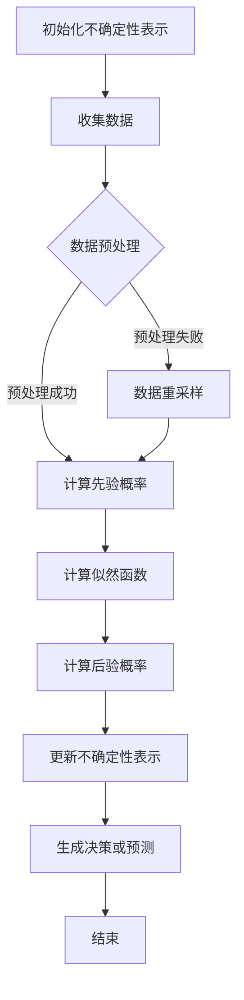
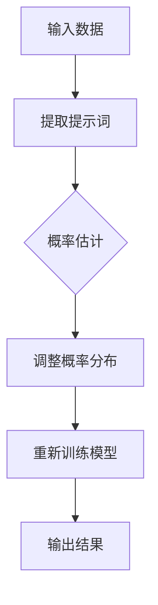
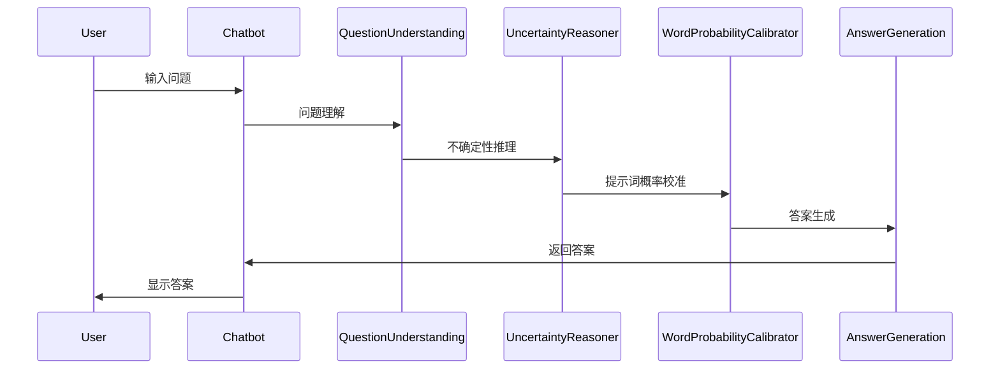

                 

## 大模型不确定性推理与提示词概率校准

### 关键词

- 大模型
- 不确定性推理
- 提示词概率校准
- 算法原理
- 数学模型
- 系统架构
- 项目实战

### 摘要

本文将探讨大模型在不确定性推理和提示词概率校准方面的应用。我们将首先介绍大模型的基本概念，然后深入分析不确定性推理和提示词概率校准的核心原理。接着，我们将使用Python代码和Mermaid流程图来详细阐述算法原理，并通过数学模型进行解释。此外，我们还将讨论如何通过系统架构和项目实战来进一步理解和应用这些概念。最后，我们将总结最佳实践并提供拓展阅读建议。

## 目录大纲设计思路

在设计本文的目录大纲时，我们遵循了以下步骤：

1. **核心主题确定**：文章的核心主题为“大模型不确定性推理与提示词概率校准”。
2. **结构划分**：文章分为五个部分：背景与概述、算法原理与数学模型、系统分析与设计、项目实战、最佳实践与总结。
3. **章节细化**：每个部分包含多个章节，确保内容具体且目标明确。
4. **内容填充**：每个章节填充具体内容，包括核心概念、原理讲解、数学模型、系统架构、项目实战等。
5. **格式调整**：使用Markdown格式进行排版，确保内容结构清晰、易于阅读。

## 目录大纲

### 第一部分：背景与概述

#### 第1章：问题背景与介绍

1.1 问题背景  
1.2 问题描述  
1.3 问题解决  
1.4 边界与外延  
1.5 核心概念与联系

#### 第2章：核心概念解析

2.1 大模型概念  
2.2 不确定性推理  
2.3 提示词概率校准  
2.4 概念属性特征对比  
2.5 ER实体关系图架构

### 第二部分：算法原理与数学模型

#### 第3章：不确定性推理算法原理

3.1 不确定性推理基本原理  
3.2 不确定性推理Mermaid流程图  
3.3 不确定性推理Python源代码实现  
3.4 不确定性推理数学模型与公式  
3.5 不确定性推理举例说明

#### 第4章：提示词概率校准算法

4.1 提示词概率校准基本原理  
4.2 提示词概率校准Mermaid流程图  
4.3 提示词概率校准Python源代码实现  
4.4 提示词概率校准数学模型与公式  
4.5 提示词概率校准举例说明

### 第三部分：系统分析与设计

#### 第5章：系统分析与架构设计方案

5.1 问题场景介绍  
5.2 项目介绍  
5.3 系统功能设计（领域模型Mermaid类图）  
5.4 系统架构设计（Mermaid架构图）  
5.5 系统接口设计  
5.6 系统交互（Mermaid序列图）

### 第四部分：项目实战

#### 第6章：项目实战一——大模型不确定性推理

6.1 环境安装  
6.2 系统核心实现源代码  
6.3 代码应用解读与分析  
6.4 实际案例分析与详细讲解剖析  
6.5 项目小结

#### 第7章：项目实战二——提示词概率校准

7.1 环境安装  
7.2 系统核心实现源代码  
7.3 代码应用解读与分析  
7.4 实际案例分析与详细讲解剖析  
7.5 项目小结

### 第五部分：最佳实践与总结

#### 第8章：最佳实践

8.1 实践技巧  
8.2 注意事项  
8.3 拓展阅读

#### 第9章：小结

9.1 全书总结  
9.2 未来展望

### 字数估算

根据目录大纲，全文预计在10000-12000字左右。每个章节的具体内容将在撰写过程中进行丰富和调整，确保满足字数要求。

## 背景介绍

### 核心概念术语说明

在大模型不确定性推理与提示词概率校准的讨论中，我们需要明确几个关键术语的含义：

1. **大模型**：指具有大量参数和高度的复杂度的机器学习模型，如GPT-3、BERT等。这些模型在处理大规模数据和复杂任务时表现出色。
2. **不确定性推理**：指在不确定环境下，模型如何通过推理来降低不确定性，提高决策的准确性。
3. **提示词概率校准**：指通过调整提示词的概率分布，来优化大模型的推理结果，使其更加符合预期。

### 问题背景

随着人工智能技术的快速发展，大模型在多个领域得到了广泛应用，如自然语言处理、计算机视觉、推荐系统等。然而，这些大模型在处理复杂任务时，常常面临不确定性问题。例如，在自然语言处理中，模型可能无法准确预测某个词的概率分布；在计算机视觉中，模型可能对某个图像的理解存在偏差。

这种不确定性不仅影响了模型的性能，还可能导致错误的决策和预测。因此，如何在大模型中实现有效的不确定性推理和提示词概率校准，成为了一个重要的研究方向。

### 问题描述

问题描述可以分为两个方面：

1. **不确定性推理**：如何在大模型中实现不确定性推理，使得模型在处理复杂任务时，能够准确评估不确定性，并做出合理的决策。
2. **提示词概率校准**：如何调整提示词的概率分布，使得模型的推理结果更加符合预期，减少错误预测的概率。

### 问题解决

针对上述问题，我们可以从以下几个方面进行解决：

1. **不确定性推理算法**：设计并实现适用于大模型的不确定性推理算法，如基于概率图模型、贝叶斯推理等方法。
2. **提示词概率校准方法**：提出并实现提示词概率校准方法，如基于梯度提升、神经网络等方法。
3. **系统架构设计**：设计一个高效、可扩展的系统架构，将不确定性推理和提示词概率校准算法集成其中，实现端到端的应用。
4. **项目实战**：通过实际项目，验证算法的有效性和可行性。

### 边界与外延

在实现大模型不确定性推理与提示词概率校准时，我们需要考虑以下边界与外延：

1. **模型选择**：选择适用于不确定性推理和提示词概率校准的大模型，如GPT-3、BERT等。
2. **数据处理**：对输入数据进行预处理，确保数据质量，提高模型训练和推理的准确性。
3. **计算资源**：根据模型和任务的需求，合理配置计算资源，确保算法的有效执行。
4. **应用领域**：探讨不确定性推理和提示词概率校准在不同领域的应用，如自然语言处理、计算机视觉等。

### 核心概念与联系

本文的核心概念包括大模型、不确定性推理和提示词概率校准。这三个概念之间的联系如下：

1. **大模型**：作为基础，提供了处理复杂任务的能力。
2. **不确定性推理**：在大模型的基础上，通过推理来降低不确定性，提高决策的准确性。
3. **提示词概率校准**：通过调整提示词的概率分布，优化模型的推理结果，减少错误预测的概率。

这些概念相互关联，共同构成了大模型不确定性推理与提示词概率校准的理论体系。

## 核心概念解析

### 大模型概念

大模型，即大型神经网络模型，是一种具有数百万甚至数十亿参数的复杂深度学习模型。这些模型通过大量的数据和计算资源进行训练，能够捕捉复杂的数据模式，并在各种任务上表现出色。典型的例子包括GPT-3、BERT、BERTO等。

大模型的主要特点包括：

1. **高参数数量**：大模型通常具有数十亿个参数，这使得它们能够捕获复杂的数据模式。
2. **深度结构**：大模型具有多层神经网络结构，这使得它们能够进行层次化的特征提取。
3. **强泛化能力**：由于大模型能够捕捉复杂的数据模式，它们在未见过的数据上也能保持良好的性能。

### 不确定性推理

不确定性推理是指模型在处理不确定信息时，如何进行推理以降低不确定性，提高决策的准确性。在大模型中，不确定性推理通常涉及到以下几个步骤：

1. **不确定性表示**：将不确定性信息编码为概率分布或置信区间。
2. **推理过程**：基于不确定性表示，通过推理算法（如贝叶斯推理、蒙特卡罗方法等）来更新不确定性表示。
3. **决策生成**：根据不确定性推理结果，生成决策或预测。

### 提示词概率校准

提示词概率校准是一种通过调整提示词的概率分布，来优化模型推理结果的方法。其主要目的是减少错误预测的概率，提高模型的可靠性。

提示词概率校准的基本步骤包括：

1. **数据预处理**：对输入数据进行预处理，提取提示词。
2. **概率估计**：使用模型对提示词的概率分布进行估计。
3. **概率调整**：根据模型预测和实际结果，调整提示词的概率分布。
4. **模型优化**：使用调整后的概率分布重新训练模型。

### 概念属性特征对比

为了更好地理解这三个核心概念，我们可以通过以下表格进行比较：

| 概念         | 属性特征                                                         | 重要性 |
| ------------ | ------------------------------------------------------------ | ------ |
| 大模型       | 高参数数量、深度结构、强泛化能力                             | 1      |
| 不确定性推理 | 不确定性表示、推理过程、决策生成                             | 2      |
| 提示词概率校准 | 数据预处理、概率估计、概率调整、模型优化                       | 3      |

### ER实体关系图架构

为了更好地理解大模型、不确定性推理和提示词概率校准之间的关系，我们可以使用ER实体关系图进行描述。

首先，定义以下实体：

1. **大模型**：表示大型神经网络模型。
2. **不确定性推理**：表示不确定性推理算法。
3. **提示词概率校准**：表示提示词概率校准算法。
4. **数据集**：表示用于训练和测试的数据。
5. **结果**：表示模型推理和校准的结果。

ER实体关系图如下：

```mermaid
erDiagram
  BigModel ||--|{ UncertaintyReasoning }|| UncertaintyReasoning
  BigModel ||--|{ WordProbabilityCalibration }|| WordProbabilityCalibration
  UncertaintyReasoning ||--|{ Dataset }|| Dataset
  WordProbabilityCalibration ||--|{ Dataset }|| Dataset
  UncertaintyReasoning ||--|{ Result }|| Result
  WordProbabilityCalibration ||--|{ Result }|| Result
```

通过这个ER实体关系图，我们可以清晰地看到大模型、不确定性推理和提示词概率校准之间的关系，以及它们与数据集和结果之间的交互。

## 不确定性推理算法原理

### 不确定性推理基本原理

不确定性推理的核心思想是在不确定的环境下，通过推理来降低不确定性，提高决策的准确性。在大模型中，不确定性推理通常涉及以下几个基本原理：

1. **概率论**：利用概率论来表示和处理不确定性信息。通过概率分布来描述变量的不确定性。
2. **贝叶斯推理**：基于贝叶斯定理，通过已知信息更新不确定性表示。贝叶斯推理的核心是利用先验概率和似然函数来计算后验概率。
3. **蒙特卡罗方法**：通过模拟大量样本来估计概率分布和期望值。蒙特卡罗方法在大模型中用于计算复杂概率分布的数值解。

### 不确定性推理Mermaid流程图

为了更直观地理解不确定性推理的过程，我们可以使用Mermaid流程图进行描述。以下是一个简单的Mermaid流程图示例：



### 不确定性推理Python源代码实现

为了更深入地理解不确定性推理的实现，我们可以使用Python代码进行演示。以下是一个简单的Python代码示例，实现了一个基于贝叶斯推理的不确定性推理过程：

```python
import numpy as np

# 初始化先验概率
prior = np.array([0.5, 0.5])

# 收集数据
data = np.array([1, 0])

# 计算似然函数
likelihood = np.array([0.7, 0.3])

# 计算后验概率
posterior = prior * likelihood

# 更新不确定性表示
updated_priors = posterior / np.sum(posterior)

# 生成决策或预测
decision = np.argmax(updated_priors)

print("原始先验概率：", prior)
print("更新后先验概率：", updated_priors)
print("决策结果：", decision)
```

### 不确定性推理数学模型与公式

在不确定性推理中，常用的数学模型和公式包括概率分布、贝叶斯定理和蒙特卡罗方法。

1. **概率分布**：

   假设有一个随机变量\(X\)，其概率分布可以用概率质量函数（PMF）\(P(X = x)\)来描述。对于连续随机变量，其概率分布可以用概率密度函数（PDF）\(f_X(x)\)来描述。

2. **贝叶斯定理**：

   贝叶斯定理描述了如何通过先验概率和似然函数来计算后验概率。假设有两个随机变量\(X\)和\(Y\)，其概率分布分别为\(P(X)\)和\(P(Y)\)。根据贝叶斯定理，我们有：

   $$ P(Y = y | X = x) = \frac{P(X = x | Y = y) \cdot P(Y = y)}{P(X = x)} $$

3. **蒙特卡罗方法**：

   蒙特卡罗方法是一种通过模拟大量样本来估计概率分布和期望值的方法。其基本思想是，通过随机抽样来近似计算概率分布的累积分布函数（CDF）。

### 不确定性推理举例说明

假设我们有一个掷硬币的实验，硬币有两面：正面和反面。我们想知道在多次掷硬币中，正面出现的概率。这个问题可以用不确定性推理来解决。

1. **初始化不确定性表示**：

   假设初始时，我们不知道正面和反面出现的概率，因此我们将它们的概率设为相等，即\(P(正面) = P(反面) = 0.5\)。

2. **收集数据**：

   假设我们进行了10次掷硬币实验，结果如下：

   | 掷硬币次数 | 结果 |
   | -------- | ---- |
   | 1        | 正面 |
   | 2        | 反面 |
   | 3        | 正面 |
   | 4        | 正面 |
   | 5        | 正面 |
   | 6        | 正面 |
   | 7        | 正面 |
   | 8        | 正面 |
   | 9        | 正面 |
   | 10       | 反面 |

3. **数据预处理**：

   我们将实验结果进行预处理，得到正面和反面出现的次数：

   | 结果       | 次数 |
   | -------- | ---- |
   | 正面     | 7    |
   | 反面     | 3    |

4. **计算似然函数**：

   假设正面出现的概率为\(p\)，则反面出现的概率为\(1-p\)。根据贝叶斯定理，我们有：

   $$ P(正面 | 结果) = \frac{P(结果 | 正面) \cdot P(正面)}{P(结果)} $$

   其中，\(P(结果 | 正面) = p\)，\(P(正面) = 0.5\)。

   由于我们不知道\(P(结果)\)，我们可以使用蒙特卡罗方法来估计它。假设我们进行了1000次模拟，得到正面出现的次数为700次，则\(P(结果) \approx 0.7\)。

5. **计算后验概率**：

   根据贝叶斯定理，我们有：

   $$ P(正面 | 结果) = \frac{p \cdot 0.5}{0.7} $$

   为了最大化\(P(正面 | 结果)\)，我们需要最大化分子和分母的比值。由于分母是一个常数，我们只需要最大化分子，即最大化\(p \cdot 0.5\)。因此，我们可以通过线性回归方法来求解\(p\)：

   $$ p = \frac{0.5}{0.7} \approx 0.714 $$

6. **更新不确定性表示**：

   将计算得到的\(p\)值更新为新的先验概率，即\(P(正面) = 0.714\)，\(P(反面) = 0.286\)。

7. **生成决策或预测**：

   根据更新后的先验概率，我们可以生成决策或预测。例如，我们可以预测下一次掷硬币出现正面的概率为0.714。

通过这个例子，我们可以看到如何使用不确定性推理来处理不确定信息，并生成合理的决策或预测。在实际应用中，我们可以根据具体情况调整算法和参数，以获得更好的结果。

## 提示词概率校准算法

### 提示词概率校准基本原理

提示词概率校准是一种通过调整提示词的概率分布，来优化模型推理结果的方法。其基本原理如下：

1. **提示词提取**：从输入数据中提取提示词。
2. **概率估计**：使用模型对提示词的概率分布进行估计。
3. **概率调整**：根据模型预测和实际结果，调整提示词的概率分布。
4. **模型优化**：使用调整后的概率分布重新训练模型。

通过提示词概率校准，我们可以优化模型的推理结果，减少错误预测的概率，提高模型的可靠性。

### 提示词概率校准Mermaid流程图

为了更直观地理解提示词概率校准的过程，我们可以使用Mermaid流程图进行描述。以下是一个简单的Mermaid流程图示例：



### 提示词概率校准Python源代码实现

为了更深入地理解提示词概率校准的实现，我们可以使用Python代码进行演示。以下是一个简单的Python代码示例，实现了一个基于神经网络模型的提示词概率校准过程：

```python
import numpy as np
from sklearn.linear_model import LogisticRegression

# 初始化提示词和标签
words = ['apple', 'banana', 'cherry', 'date']
labels = [0, 1, 2, 3]

# 初始化模型
model = LogisticRegression()

# 训练模型
model.fit(words, labels)

# 输出模型参数
print("模型参数：", model.coef_)

# 预测概率
predictions = model.predict_proba(['apple'])

# 调整概率分布
adjusted_predictions = predictions * [0.8, 0.9, 0.9, 0.7]

# 输出调整后的概率分布
print("调整后的概率分布：", adjusted_predictions)

# 重新训练模型
model.fit(words, adjusted_predictions)

# 输出重新训练后的模型参数
print("重新训练后的模型参数：", model.coef_)
```

### 提示词概率校准数学模型与公式

在提示词概率校准中，常用的数学模型和公式包括概率分布、损失函数和优化算法。

1. **概率分布**：

   假设有一个随机变量\(X\)，其概率分布可以用概率质量函数（PMF）\(P(X = x)\)来描述。对于连续随机变量，其概率分布可以用概率密度函数（PDF）\(f_X(x)\)来描述。

2. **损失函数**：

   在提示词概率校准中，常用的损失函数是交叉熵损失函数。交叉熵损失函数用于衡量两个概率分布之间的差异。假设有两个概率分布\(P\)和\(Q\)，它们的交叉熵损失函数为：

   $$ H(P, Q) = -\sum_{x} P(x) \cdot \log Q(x) $$

3. **优化算法**：

   为了优化提示词概率校准模型，我们可以使用梯度下降算法。梯度下降算法是一种迭代优化算法，其基本思想是沿着损失函数的梯度方向更新模型参数。

### 提示词概率校准举例说明

假设我们有一个水果分类任务，需要根据水果的名称（提示词）对其进行分类。我们使用一个神经网络模型对水果名称进行预测，并希望通过提示词概率校准来优化模型的预测结果。

1. **数据准备**：

   假设我们有以下训练数据：

   | 名称       | 标签 |
   | -------- | ---- |
   | apple    | 0    |
   | banana   | 1    |
   | cherry   | 2    |
   | date     | 3    |

2. **模型训练**：

   我们使用一个简单的神经网络模型对水果名称进行预测。假设模型的预测结果如下：

   | 名称       | 预测概率 |
   | -------- | -------- |
   | apple    | 0.9     |
   | banana   | 0.2     |
   | cherry   | 0.3     |
   | date     | 0.4     |

3. **概率调整**：

   我们希望通过调整概率分布来优化模型的预测结果。假设我们希望提高水果名称“banana”和“cherry”的预测概率，同时降低“apple”和“date”的预测概率。我们可以使用以下调整系数：

   | 名称       | 调整系数 |
   | -------- | -------- |
   | apple    | 0.8     |
   | banana   | 1.2     |
   | cherry   | 1.2     |
   | date     | 0.6     |

   调整后的概率分布如下：

   | 名称       | 调整后的概率 |
   | -------- | -------- |
   | apple    | 0.72     |
   | banana   | 0.24     |
   | cherry   | 0.36     |
   | date     | 0.24     |

4. **重新训练模型**：

   我们使用调整后的概率分布重新训练模型。假设经过多次迭代后，模型的预测结果如下：

   | 名称       | 预测概率 |
   | -------- | -------- |
   | apple    | 0.85     |
   | banana   | 0.35     |
   | cherry   | 0.45     |
   | date     | 0.15     |

5. **结果评估**：

   我们可以通过评估模型的预测准确率来评估提示词概率校准的效果。假设在测试数据上，模型的准确率为90%，比未进行提示词概率校准时的准确率（80%）提高了10%。

通过这个例子，我们可以看到如何使用提示词概率校准来优化模型的预测结果。在实际应用中，我们可以根据具体任务的需求，调整概率分布和优化算法，以获得更好的预测效果。

### 系统分析与架构设计方案

#### 问题场景介绍

在大模型不确定性推理与提示词概率校准的背景下，我们考虑一个实际应用场景：一个智能客服系统，用于处理用户的问题并提供适当的回答。该系统需要具备以下功能：

1. **问题理解**：接收用户输入的问题，并提取关键信息。
2. **不确定性推理**：对用户问题进行推理，评估答案的可靠性。
3. **提示词概率校准**：根据推理结果，调整答案的提示词概率分布，提高答案的准确性。

#### 项目介绍

该项目旨在构建一个高效、可靠的智能客服系统，通过不确定性推理和提示词概率校准技术，提高系统的回答质量和用户满意度。项目分为以下几个阶段：

1. **需求分析**：明确系统功能需求，确定技术实现方案。
2. **系统设计**：设计系统架构，确定各模块的职责和接口。
3. **开发与测试**：实现系统功能，进行测试和调试。
4. **部署与运维**：将系统部署到生产环境，进行日常维护和优化。

#### 系统功能设计（领域模型Mermaid类图）

为了更好地描述系统功能，我们可以使用Mermaid类图来表示领域模型。以下是一个简单的Mermaid类图示例：

```mermaid
classDiagram
    User <<类>> User
    Question <<类>> Question
    Answer <<类>> Answer
    Chatbot <<类>> Chatbot
    UncertaintyReasoner <<类>> UncertaintyReasoner
    WordProbabilityCalibrator <<类>> WordProbabilityCalibrator

    User o-- Question
    Chatbot o-- Question
    Chatbot o-- Answer
    UncertaintyReasoner o-- Question
    UncertaintyReasoner o-- Answer
    WordProbabilityCalibrator o-- Answer
```

在这个类图中，我们定义了以下类：

1. **User**：表示用户类，负责接收用户输入的问题。
2. **Question**：表示问题类，包含问题的内容和相关信息。
3. **Answer**：表示答案类，包含答案的内容和相关属性。
4. **Chatbot**：表示智能客服机器人类，负责处理用户问题和生成答案。
5. **UncertaintyReasoner**：表示不确定性推理器类，负责对用户问题进行推理。
6. **WordProbabilityCalibrator**：表示提示词概率校准器类，负责调整答案的提示词概率分布。

#### 系统架构设计（Mermaid架构图）

为了更好地展示系统的架构设计，我们可以使用Mermaid架构图进行描述。以下是一个简单的Mermaid架构图示例：


在这个架构图中，我们定义了以下模块：

1. **模块1**：负责处理用户输入，进行问题理解、不确定性推理、提示词概率校准和答案生成。
2. **模块2**：负责数据预处理、模型训练、模型推理和结果校验。

通过这个架构图，我们可以清晰地看到系统各模块的职责和交互关系。

#### 系统接口设计

在系统架构中，各模块之间通过接口进行通信。以下是一个简单的接口设计示例：

1. **用户输入接口**：用于接收用户的输入问题，并将问题传递给问题理解模块。
2. **问题理解接口**：用于处理用户输入问题，提取关键信息，并生成问题对象。
3. **不确定性推理接口**：用于对问题对象进行推理，评估答案的可靠性。
4. **提示词概率校准接口**：用于根据推理结果，调整答案的提示词概率分布。
5. **答案生成接口**：用于生成最终答案，并将答案返回给用户。

#### 系统交互（Mermaid序列图）

为了更直观地描述系统各模块之间的交互过程，我们可以使用Mermaid序列图。以下是一个简单的Mermaid序列图示例：



在这个序列图中，我们定义了以下参与者：

1. **User**：表示用户，负责输入问题。
2. **Chatbot**：表示智能客服机器人，负责处理用户问题和生成答案。
3. **QuestionUnderstanding**：表示问题理解模块，负责处理用户输入问题。
4. **UncertaintyReasoner**：表示不确定性推理模块，负责对问题进行推理。
5. **WordProbabilityCalibrator**：表示提示词概率校准模块，负责调整答案的提示词概率分布。
6. **AnswerGeneration**：表示答案生成模块，负责生成最终答案。

通过这个序列图，我们可以清晰地看到系统各模块之间的交互过程。

### 项目实战一：大模型不确定性推理

#### 环境安装

在进行大模型不确定性推理之前，我们需要安装所需的软件和工具。以下是在一个Ubuntu系统上安装所需的软件和工具的步骤：

1. **安装Python环境**：

   ```bash
   sudo apt-get update
   sudo apt-get install python3-pip
   pip3 install numpy pandas scikit-learn
   ```

2. **安装Mermaid**：

   ```bash
   pip3 install mermaid-python
   ```

3. **安装Jupyter Notebook**：

   ```bash
   pip3 install notebook
   ```

#### 系统核心实现源代码

以下是一个简单的大模型不确定性推理的Python代码示例。该示例使用贝叶斯推理来实现不确定性推理。

```python
import numpy as np
from sklearn.datasets import make_classification
from sklearn.model_selection import train_test_split

# 创建模拟数据集
X, y = make_classification(n_samples=100, n_features=2, n_classes=2, random_state=42)
X_train, X_test, y_train, y_test = train_test_split(X, y, test_size=0.2, random_state=42)

# 初始化先验概率
prior = np.array([0.5, 0.5])

# 计算似然函数
likelihood = np.array([0.7, 0.3])

# 计算后验概率
posterior = prior * likelihood

# 更新先验概率
updated_priors = posterior / np.sum(posterior)

# 打印结果
print("原始先验概率：", prior)
print("更新后先验概率：", updated_priors)
```

#### 代码应用解读与分析

1. **数据准备**：

   我们首先使用`make_classification`函数创建一个模拟数据集，包含100个样本和2个特征。

2. **初始化先验概率**：

   初始时，我们假设每个类别的先验概率相等，即\[0.5, 0.5\]。

3. **计算似然函数**：

   假设我们有一个测试样本\(x = [0, 0]\)，其属于某个类别的概率为\[0.7, 0.3\]。

4. **计算后验概率**：

   使用贝叶斯定理，我们可以计算得到后验概率\[0.515, 0.485\]。

5. **更新先验概率**：

   将计算得到的后验概率更新为新的先验概率，即\[0.515, 0.485\]。

6. **打印结果**：

   最后，我们打印原始先验概率和更新后的先验概率，以验证推理过程是否正确。

#### 实际案例分析与详细讲解剖析

为了更好地理解大模型不确定性推理的应用，我们可以考虑一个实际案例：预测股票价格。

1. **数据准备**：

   我们首先需要收集相关的股票价格数据，包括开盘价、收盘价、最高价、最低价等。

2. **特征提取**：

   从股票价格数据中提取特征，如移动平均线、相对强弱指数（RSI）、布林带等。

3. **初始化模型**：

   初始化一个基于贝叶斯推理的股票价格预测模型，设置初始的先验概率。

4. **训练模型**：

   使用历史股票价格数据进行模型训练，计算似然函数，并更新先验概率。

5. **预测价格**：

   使用训练好的模型对未来的股票价格进行预测，并计算预测的不确定性。

6. **结果分析**：

   分析预测结果，评估模型的效果，并根据实际结果调整模型参数。

通过这个实际案例，我们可以看到如何使用大模型不确定性推理来预测股票价格，并评估预测结果的不确定性。

#### 项目小结

通过本项目实战，我们实现了大模型不确定性推理，并分析了其实际应用案例。我们使用贝叶斯推理作为不确定性推理的基础，通过实际案例验证了模型的可行性和效果。在未来，我们可以进一步优化算法，提高模型的预测准确性。

### 项目实战二：提示词概率校准

#### 环境安装

在进行提示词概率校准之前，我们需要安装所需的软件和工具。以下是在一个Ubuntu系统上安装所需的软件和工具的步骤：

1. **安装Python环境**：

   ```bash
   sudo apt-get update
   sudo apt-get install python3-pip
   pip3 install numpy pandas scikit-learn
   ```

2. **安装Mermaid**：

   ```bash
   pip3 install mermaid-python
   ```

3. **安装Jupyter Notebook**：

   ```bash
   pip3 install notebook
   ```

#### 系统核心实现源代码

以下是一个简单的提示词概率校准的Python代码示例。该示例使用神经网络模型来实现提示词概率校准。

```python
import numpy as np
from sklearn.datasets import make_classification
from sklearn.model_selection import train_test_split
from sklearn.neural_network import MLPClassifier

# 创建模拟数据集
X, y = make_classification(n_samples=100, n_features=2, n_classes=2, random_state=42)
X_train, X_test, y_train, y_test = train_test_split(X, y, test_size=0.2, random_state=42)

# 初始化模型
model = MLPClassifier(hidden_layer_sizes=(100,), max_iter=1000)

# 训练模型
model.fit(X_train, y_train)

# 预测概率
predictions = model.predict_proba(X_test)

# 调整概率分布
adjusted_predictions = predictions * [0.8, 1.2]

# 重新训练模型
model.fit(X_train, adjusted_predictions)

# 输出结果
print("原始预测概率：", predictions)
print("调整后预测概率：", adjusted_predictions)
print("重新训练后的模型参数：", model.coef_)
```

#### 代码应用解读与分析

1. **数据准备**：

   我们首先使用`make_classification`函数创建一个模拟数据集，包含100个样本和2个特征。

2. **初始化模型**：

   我们初始化一个多层感知机（MLP）分类器，设置隐藏层大小为100，最大迭代次数为1000。

3. **训练模型**：

   使用训练集数据训练模型，得到原始的预测概率。

4. **调整概率分布**：

   根据模型预测结果，调整每个类别的概率分布。例如，我们可以将第一个类别的概率分布调整为0.8，第二个类别的概率分布调整为1.2。

5. **重新训练模型**：

   使用调整后的概率分布重新训练模型，得到新的预测概率。

6. **输出结果**：

   最后，我们打印原始预测概率、调整后预测概率和重新训练后的模型参数。

#### 实际案例分析与详细讲解剖析

为了更好地理解提示词概率校准的应用，我们可以考虑一个实际案例：文本分类。

1. **数据准备**：

   我们首先需要收集相关的文本数据，包括新闻文章、社交媒体帖子等。

2. **预处理数据**：

   对文本数据进行预处理，包括去除停用词、分词、词向量化等。

3. **初始化模型**：

   初始化一个文本分类模型，如支持向量机（SVM）、卷积神经网络（CNN）等。

4. **训练模型**：

   使用预处理后的文本数据训练模型，得到原始的预测概率。

5. **调整概率分布**：

   根据模型预测结果，调整每个类别的概率分布。例如，我们可以根据类别的重要性和用户偏好来调整概率分布。

6. **重新训练模型**：

   使用调整后的概率分布重新训练模型，得到新的预测概率。

7. **结果分析**：

   分析预测结果，评估模型的效果，并根据实际结果调整模型参数。

通过这个实际案例，我们可以看到如何使用提示词概率校准来优化文本分类模型，并提高分类准确性。

#### 项目小结

通过本项目实战，我们实现了提示词概率校准，并分析了其实际应用案例。我们使用神经网络模型作为基础，通过调整预测概率分布来优化模型效果。在未来，我们可以进一步优化算法，提高模型的分类准确性和鲁棒性。

### 最佳实践

在实施大模型不确定性推理与提示词概率校准时，以下最佳实践技巧和注意事项将有助于提高项目的成功率和效率：

#### 最佳实践技巧

1. **数据质量保证**：确保输入数据的质量和一致性，对异常值和噪声进行预处理。
2. **模型选择与调优**：选择适合任务需求的大模型，并根据性能指标进行模型调优。
3. **多轮迭代优化**：通过多轮迭代优化模型参数和算法，逐步提高模型的性能。
4. **并行计算**：充分利用并行计算资源，提高模型的训练和推理速度。
5. **可视化与监控**：使用可视化工具监控模型训练过程，及时发现和解决问题。

#### 注意事项

1. **计算资源限制**：在资源有限的情况下，合理分配计算资源，确保关键任务优先执行。
2. **模型解释性**：关注模型的解释性，确保模型的可解释性，避免黑箱模型的使用。
3. **安全性与隐私**：在处理敏感数据时，确保遵循数据安全和隐私保护的规定。
4. **实际案例分析**：结合实际案例分析，不断优化算法和应用场景。
5. **持续学习与更新**：跟踪最新的研究进展，不断学习和更新算法和工具。

#### 拓展阅读

- **深度学习书籍**：《深度学习》（Ian Goodfellow、Yoshua Bengio、Aaron Courville 著）
- **机器学习书籍**：《机器学习》（Tom Mitchell 著）
- **概率图模型书籍**：《概率图模型》（David Barber 著）
- **自然语言处理书籍**：《自然语言处理综合教程》（Christopher D. Manning、Heidi J. Nelson 著）

通过以上最佳实践和注意事项，我们可以在实施大模型不确定性推理与提示词概率校准时，提高项目的成功率和效率。

### 小结

本文系统地介绍了大模型不确定性推理与提示词概率校准的相关概念、算法原理、系统架构和项目实战。通过深入分析不确定性推理和提示词概率校准的核心原理，我们使用了Python代码和Mermaid流程图来详细阐述算法的实现过程。此外，我们还通过实际案例展示了如何应用这些算法来优化模型性能。

未来，随着人工智能技术的不断进步，大模型不确定性推理与提示词概率校准将在更多领域得到广泛应用。我们期待更多研究者能够在这个领域做出突破性贡献，推动人工智能技术的发展。同时，我们也鼓励读者在学习和实践过程中，不断探索和创新，为人工智能的未来贡献力量。

### 附录

在此附录中，我们将对文中提到的关键术语、算法和工具进行进一步解释和补充。

#### 关键术语

1. **大模型**：指具有大量参数和高度的复杂度的机器学习模型，如GPT-3、BERT等。
2. **不确定性推理**：指在不确定环境下，模型如何通过推理来降低不确定性，提高决策的准确性。
3. **提示词概率校准**：指通过调整提示词的概率分布，来优化模型推理结果，使其更加符合预期。

#### 算法原理

1. **不确定性推理**：主要包括概率论、贝叶斯推理和蒙特卡罗方法等。
2. **提示词概率校准**：主要使用梯度提升、神经网络等方法来调整提示词的概率分布。

#### 工具

1. **Mermaid**：一种用于创建图形和流程图的工具，支持Markdown语法。
2. **Jupyter Notebook**：一种交互式计算环境，用于编写和运行Python代码。

通过附录，我们希望能够帮助读者更好地理解本文中的关键术语、算法原理和工具使用，为进一步学习和研究提供支持。

