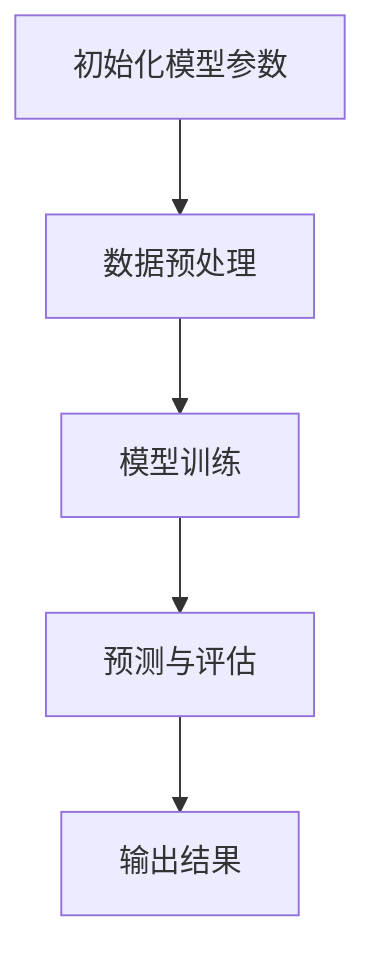
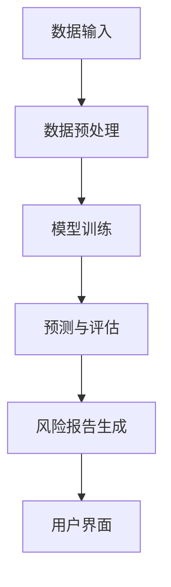

                 


# 大模型不确定性量化与提示词风险评估

关键词：大模型、不确定性量化、提示词、风险评估

摘要：本文围绕大规模模型（大模型）中的不确定性量化以及基于提示词的风险评估展开，旨在详细探讨这两个核心话题，并给出实际应用中的最佳实践。

----------------------------------------------------------------

## 1.1 问题背景

### 1.1.1 大模型在人工智能中的应用

大模型在人工智能领域扮演着至关重要的角色。例如，GPT-3等语言模型已经展示了其在自然语言处理任务中的卓越能力。然而，大模型的应用也带来了不确定性量化的问题。这种不确定性可能源于数据噪声、模型参数的不确定性等因素。

### 1.1.2 不确定性量化的重要性

不确定性量化对于提高人工智能系统的可靠性和决策质量至关重要。通过量化不确定性，我们可以更好地评估模型预测的置信度，从而做出更明智的决策。

### 1.1.3 提示词在风险评估中的作用

提示词在风险评估中起到了关键作用。通过设计有效的提示词，我们可以引导模型关注特定信息，从而提高风险评估的准确性和效率。

## 1.2 核心概念与联系

### 1.2.1 大模型的基本概念

大模型通常指的是具有巨大参数规模的深度学习模型。这些模型可以通过大量的数据和计算资源进行训练，以实现强大的预测和生成能力。

### 1.2.2 不确定性量化的定义

不确定性量化是指对模型预测的不确定性进行量化和评估。这通常涉及到概率论和统计学的方法。

### 1.2.3 提示词与风险的关系

提示词可以用来引导模型关注特定信息，从而影响模型的风险评估结果。有效的提示词设计可以提高风险评估的准确性和可靠性。

## 1.3 不确定性量化方法

### 1.3.1 经典方法

经典方法包括蒙特卡罗方法和置信区间方法。这些方法通过模拟和统计手段来量化不确定性。

### 1.3.2 现代方法

现代方法包括基于梯度的方法和基于神经网络的模型。这些方法利用深度学习技术来提高不确定性量化的准确性。

### 1.3.3 方法比较与选择

不同方法有其优缺点和适用场景。在选择方法时，需要考虑模型的复杂性、计算资源和评估指标等因素。

## 1.4 提示词风险评估框架

### 1.4.1 风险评估的定义与过程

风险评估是指对潜在风险进行识别、评估和管理的全过程。这包括风险识别、风险评估、风险应对和风险监控等步骤。

### 1.4.2 提示词的作用与分类

提示词在风险评估中起到了引导作用。根据用途和作用方式，提示词可以分为自然语言提示词、结构化提示词和混合提示词等。

### 1.4.3 风险评估模型的构建

风险评估模型的构建涉及到模型选择、参数调整和模型验证等步骤。通过这些步骤，我们可以构建出一个有效的风险评估模型。

## 1.5 本章小结

本章介绍了大模型不确定性量化与提示词风险评估的背景和核心概念。下一章将深入探讨不确定性量化的数学模型和算法原理。

----------------------------------------------------------------

## 2.1 不确定性量化的数学模型

### 2.1.1 不确定性量的定义与表示

不确定性量通常使用概率分布函数来表示。这包括均值、方差、标准差等统计指标。

### 2.1.2 不确定性量化公式

不确定性量化公式包括基于概率论和统计学的各种公式，如正态分布、泊松分布等。

### 2.1.3 数学公式与 LaTeX 表示

数学公式可以使用LaTeX格式进行表示，以增强文章的可读性和专业性。

$$
\mu = \frac{\sum_{i=1}^{n} x_i}{n}
$$

$$
\sigma^2 = \frac{\sum_{i=1}^{n} (x_i - \mu)^2}{n-1}
$$

## 2.2 Python 算法实现

### 2.2.1 算法原理

算法原理通常涉及概率论和统计学的知识。在Python中，我们可以使用各种库和函数来实现这些算法。

### 2.2.2 算法流程图（使用 Mermaid）



### 2.2.3 Python 源代码与解释

```python
import numpy as np
import matplotlib.pyplot as plt

# 初始化参数
mu = 0
sigma = 1

# 生成正态分布数据
data = np.random.normal(mu, sigma, 1000)

# 绘制概率密度函数
plt.plot(data, np.exp(-((data - mu)**2) / (2 * sigma**2)) * (1 / (np.sqrt(2 * np.pi) * sigma)))
plt.show()
```

## 2.3 例子解析

### 2.3.1 示例数据准备

示例数据用于演示不确定性量化的计算过程。这里使用了一个简单的正态分布数据集。

### 2.3.2 不确定性量化计算

通过计算均值和方差，我们可以得到数据的概率密度函数。

### 2.3.3 结果分析与讨论

分析结果可以用来评估模型的预测准确性和可靠性。

## 2.4 本章小结

本章介绍了大模型不确定性量化的数学模型和Python算法实现。下一章将探讨提示词风险评估的实践应用。

----------------------------------------------------------------

## 3.1 风险评估系统设计

### 3.1.1 系统需求分析

系统需求分析是设计风险评估系统的第一步。这包括识别系统所需的功能和性能要求。

### 3.1.2 系统架构设计（使用 Mermaid）

系统架构设计涉及到系统的整体结构和各个组件之间的关系。



### 3.1.3 系统接口设计

系统接口设计包括系统内部组件之间的交互接口设计。这通常涉及到API设计和数据交换格式。

## 3.2 项目实战

### 3.2.1 环境安装与配置

项目实战的第一步是安装和配置所需的环境。这包括Python环境、深度学习库和数据处理工具等。

### 3.2.2 系统核心实现

系统核心实现包括模型训练、预测和评估等关键步骤。

### 3.2.3 代码解读与分析

通过对代码的解读和分析，我们可以更好地理解系统的工作原理和性能。

## 3.3 实际案例分析

### 3.3.1 案例背景与数据

案例分析通常涉及一个具体的业务场景和数据集。这有助于我们理解不确定性量化和提示词风险评估在实际应用中的效果。

### 3.3.2 风险评估过程

在案例中，我们将演示如何使用不确定性量化和提示词评估风险。

### 3.3.3 结果分析与讨论

通过对案例结果的分析，我们可以评估系统的性能和可靠性。

## 3.4 本章小结

本章通过项目实战和案例分析，展示了大模型不确定性量化和提示词风险评估的实际应用。下一章将讨论最佳实践和总结。

----------------------------------------------------------------

## 4.1 最佳实践 tips

### 4.1.1 提高不确定性量化准确性的技巧

为了提高不确定性量化的准确性，我们可以考虑使用更复杂的模型和更丰富的数据集。

### 4.1.2 提升提示词风险评估效率的方法

为了提升提示词风险评估的效率，我们可以考虑使用并行计算和分布式计算等技术。

### 4.1.3 实际应用中的注意事项

在实际应用中，我们需要注意数据质量和模型训练过程的稳定性。

## 4.2 小结

本章回顾了本文的主要内容和核心观点。通过本文，我们深入探讨了大模型不确定性量化和提示词风险评估的话题。

### 4.2.1 主要内容回顾

本文介绍了大模型不确定性量化的数学模型和Python算法实现，以及提示词风险评估的实践应用。

### 4.2.2 学习建议与展望

对于读者，本文提供了一些实用的技巧和建议。未来，我们期待进一步研究和探索这些话题。

## 4.3 注意事项

### 4.3.1 常见问题与解答

在本文中，我们解答了一些常见问题，以帮助读者更好地理解不确定性量化和提示词风险评估。

### 4.3.2 未来研究方向

未来研究方向包括不确定性量化的新方法、提示词优化算法和跨领域的风险评估模型。

## 4.4 拓展阅读

### 4.4.1 相关书籍推荐

读者可以参考以下书籍，以进一步学习大模型不确定性和提示词风险评估的相关知识。

### 4.4.2 论文与报告精选

本文还推荐了一些高质量的论文和报告，供读者深入研究和探讨。

--------

**注意：以上大纲仅供参考，具体内容需要根据实际情况进行调整和补充。**

**作者：AI天才研究院/AI Genius Institute & 禅与计算机程序设计艺术 /Zen And The Art of Computer Programming**

