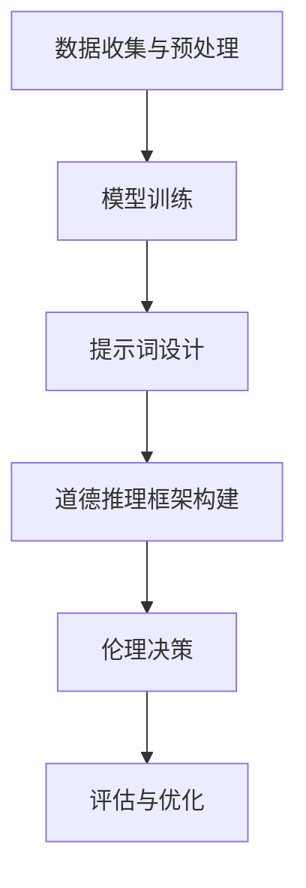
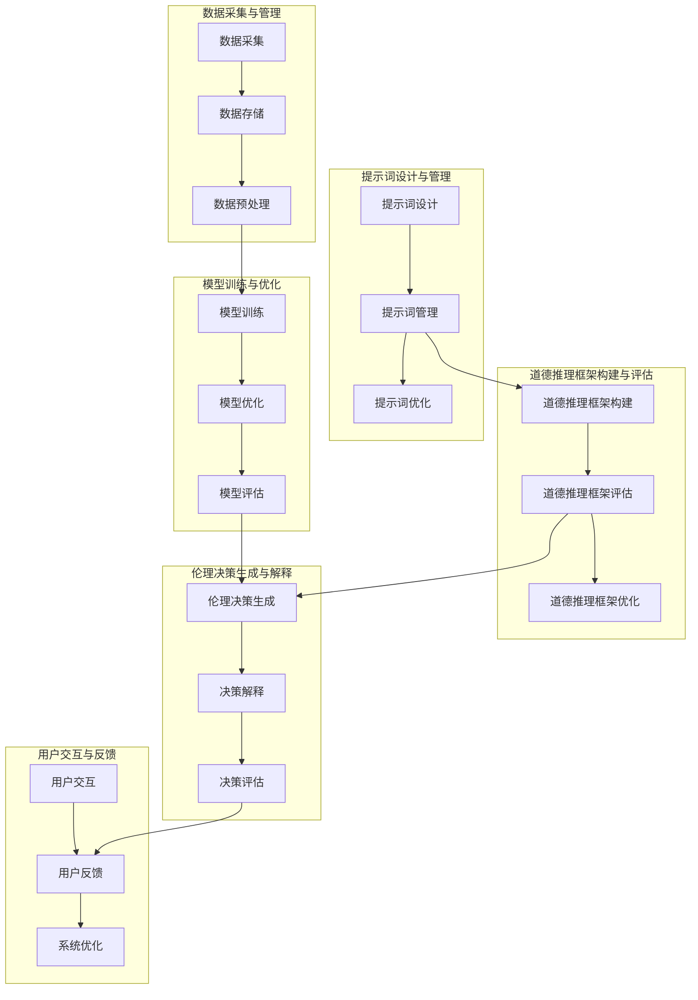
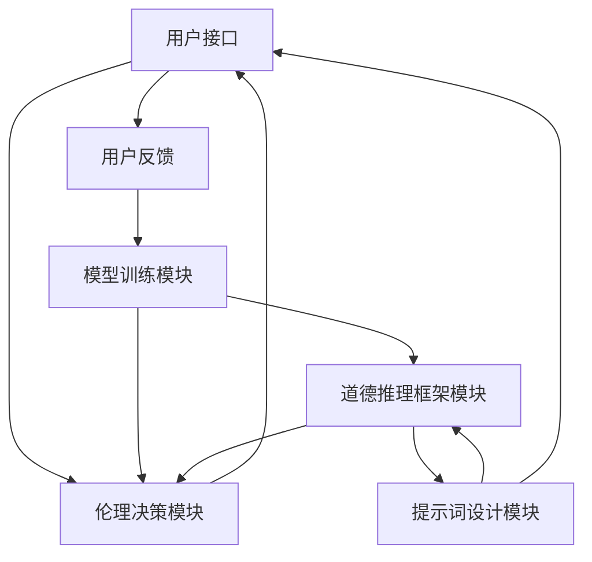

                 


## 大模型伦理决策：提示词设计道德推理框架

### 关键词：大模型，伦理决策，提示词，道德推理框架，算法原理，系统架构，项目实战

> 摘要：随着人工智能技术的发展，大模型在各个领域得到了广泛应用，但随之而来的是伦理问题的挑战。本文旨在探讨如何通过设计合适的提示词，构建道德推理框架，以实现大模型的伦理决策。通过详细的分析和项目实战，本文将展示这一过程的实施方法和关键步骤。

### 目录大纲

## 第一部分：背景介绍

### 第1章：问题背景

#### 1.1 大模型的发展与伦理问题的产生

#### 1.2 大模型伦理问题的现状与影响

#### 1.3 研究意义与目标

### 第2章：核心概念与联系

#### 2.1 大模型的定义与特点

#### 2.2 伦理决策的定义与类型

#### 2.3 提示词设计的原则与方法

#### 2.4 道德推理框架的概念与结构

#### 2.5 核心概念属性特征对比表格

#### 2.6 ER实体关系图架构

## 第二部分：算法原理讲解

### 第3章：算法原理讲解

#### 3.1 大模型伦理决策的算法流程

#### 3.2 提示词设计的关键技术

#### 3.3 道德推理框架的构建

#### 3.4 算法原理与数学模型

#### 3.5 算法mermaid流程图

#### 3.6 Python源代码阐述

## 第三部分：系统分析与架构设计方案

### 第4章：系统分析与架构设计方案

#### 4.1 问题场景介绍

#### 4.2 系统功能设计

#### 4.3 系统架构设计

#### 4.4 系统接口设计和系统交互

#### 4.5 系统架构mermaid图

## 第四部分：项目实战

### 第5章：项目实战

#### 5.1 环境安装

#### 5.2 系统核心实现源代码

#### 5.3 代码应用解读与分析

#### 5.4 实际案例分析与详细讲解剖析

#### 5.5 项目小结

## 第五部分：最佳实践 tips、小结、注意事项、拓展阅读

### 第6章：最佳实践 tips

#### 6.1 提高伦理决策的准确性和可靠性

#### 6.2 优化提示词设计

#### 6.3 避免道德推理框架的局限性

#### 6.4 最佳实践案例分享

### 第7章：小结

#### 7.1 主要内容回顾

#### 7.2 研究价值与局限性

#### 7.3 未来研究方向

### 第8章：注意事项

#### 8.1 使用大模型进行伦理决策的伦理责任

#### 8.2 避免伦理风险

#### 8.3 遵循伦理规范和标准

### 第9章：拓展阅读

#### 9.1 相关书籍推荐

#### 9.2 学术论文推荐

#### 9.3 在线课程推荐

## 第1章：问题背景

### 1.1 大模型的发展与伦理问题的产生

大模型，即大型人工智能模型，是近年来人工智能领域的重大突破。它们通过学习和理解大量的数据，能够完成复杂的任务，从语言翻译、图像识别到自动驾驶等。大模型的出现极大地推动了人工智能技术的发展，但同时也引发了伦理问题的挑战。

随着大模型的广泛应用，如何确保其在不同场景下做出符合伦理的决策成为了一个亟待解决的问题。例如，自动驾驶汽车在遇到紧急情况时，如何决定行车的方向？医疗诊断模型在面临不确定性时，如何权衡患者的利益？这些问题都需要大模型具备一定的伦理决策能力。

### 1.2 大模型伦理问题的现状与影响

目前，大模型伦理问题主要表现在以下几个方面：

1. **数据偏见**：大模型在训练过程中，如果数据存在偏见，那么模型也可能会继承这些偏见，从而导致不公平的决策。
2. **透明度不足**：大模型的决策过程复杂，往往难以解释，这使得用户无法了解模型的决策依据，增加了不信任的风险。
3. **隐私侵犯**：大模型在处理个人数据时，可能会侵犯用户的隐私权。
4. **道德责任**：当大模型造成伤害时，责任归属成为了一个难题。

这些问题不仅影响了大模型的应用，还对社会的伦理秩序产生了挑战。

### 1.3 研究意义与目标

研究大模型伦理决策具有重要的意义。首先，它有助于提升大模型的伦理素养，使其在应用中能够更好地服务人类。其次，它有助于建立一套完整的伦理决策框架，为人工智能的发展提供指导。

本文的目标是设计一套基于提示词的道德推理框架，以实现大模型的伦理决策。具体来说，我们将：

1. **明确核心概念**：介绍大模型、伦理决策、提示词和道德推理框架等核心概念。
2. **构建算法原理**：详细阐述大模型伦理决策的算法流程，提示词设计的关键技术，以及道德推理框架的构建。
3. **分析系统架构**：介绍系统架构设计方案，包括问题场景、系统功能、系统架构、系统接口设计和系统交互。
4. **进行项目实战**：通过实际案例，展示如何实现大模型的伦理决策。
5. **总结最佳实践**：总结提高伦理决策的准确性和可靠性的方法，优化提示词设计，避免道德推理框架的局限性。

## 第2章：核心概念与联系

### 2.1 大模型的定义与特点

大模型，是指具有数亿甚至数十亿参数的人工智能模型。它们通常通过深度学习技术，从大量的数据中学习和提取规律，从而实现各种复杂的任务。

大模型的特点包括：

1. **高参数量**：大模型具有大量的参数，这使得它们能够捕捉到复杂的数据特征。
2. **强学习能力**：大模型通过不断的学习和训练，能够不断提高其性能。
3. **广泛的应用领域**：大模型在图像识别、自然语言处理、推荐系统等领域都有广泛应用。

### 2.2 伦理决策的定义与类型

伦理决策，是指在道德伦理的指导下，对某个问题或情况做出的决策。伦理决策的类型包括：

1. **道德判断**：对某个行为或决策是否道德进行判断。
2. **伦理选择**：在多个道德行为或决策中，选择一个最优的方案。
3. **伦理反思**：对过去的决策和行为进行反思，以发现和解决伦理问题。

### 2.3 提示词设计的原则与方法

提示词，是指用于引导大模型进行伦理决策的关键词或短语。设计提示词的原则包括：

1. **明确性**：提示词要明确表达伦理决策的目标和方向。
2. **完整性**：提示词要能够涵盖所有的伦理决策场景。
3. **灵活性**：提示词要能够适应不同的伦理决策环境。

设计提示词的方法包括：

1. **文献调研**：通过研究相关的文献，收集和总结已有的提示词。
2. **专家咨询**：咨询伦理学、人工智能等领域的专家，获取专业的建议。
3. **用户反馈**：通过用户测试和反馈，不断优化提示词的设计。

### 2.4 道德推理框架的概念与结构

道德推理框架，是指用于指导大模型进行伦理决策的框架。它通常包括以下几个部分：

1. **伦理原则**：确定大模型应遵循的伦理原则，如公正、公平、尊重隐私等。
2. **决策规则**：明确大模型在特定情况下应如何做出决策。
3. **评估标准**：对大模型的决策进行评估，确保其符合伦理原则。

### 2.5 核心概念属性特征对比表格

为了更好地理解核心概念之间的联系和区别，我们可以通过一个表格来进行对比。

| 核心概念 | 定义 | 特点 | 应用场景 |
| --- | --- | --- | --- |
| 大模型 | 具有数亿甚至数十亿参数的人工智能模型 | 高参数量、强学习能力、广泛的应用领域 | 图像识别、自然语言处理、推荐系统 |
| 伦理决策 | 在道德伦理的指导下，对某个问题或情况做出的决策 | 道德判断、伦理选择、伦理反思 | 自动驾驶、医疗诊断、社会管理 |
| 提示词 | 用于引导大模型进行伦理决策的关键词或短语 | 明确性、完整性、灵活性 | 伦理决策场景 |
| 道德推理框架 | 用于指导大模型进行伦理决策的框架 | 伦理原则、决策规则、评估标准 | 人工智能伦理决策 |

### 2.6 ER实体关系图架构

为了更直观地展示核心概念之间的关系，我们可以使用ER（Entity-Relationship）实体关系图来描述。

```mermaid
erDiagram
    ALOS{(大模型)} ||--|{决策} CDEC : 决策支持
    ALOS{(大模型)} ||--|{学习} CLES : 学习支持
    CDEC{(决策)} ||--|{伦理决策} CED : 伦理决策
    CLES{(学习)} ||--|{数据训练} CDT : 数据训练
    ALOS{(大模型)} ||--|{应用} CUS : 应用场景
    CED{(伦理决策)} ||--|{提示词} CPW : 提示词设计
    CPW{(提示词)} ||--|{道德推理框架} CMF : 道德推理
```

这个ER实体关系图展示了大模型、决策、学习、数据训练、应用场景、伦理决策、提示词和道德推理框架之间的关系。

## 第二部分：算法原理讲解

### 第3章：算法原理讲解

#### 3.1 大模型伦理决策的算法流程

大模型伦理决策的算法流程可以分为以下几个步骤：

1. **数据收集与预处理**：收集相关的数据，并进行清洗、去重、归一化等预处理操作。
2. **模型训练**：使用预处理后的数据，训练大模型，使其具备伦理决策的能力。
3. **提示词设计**：设计提示词，用于引导大模型进行伦理决策。
4. **道德推理框架构建**：构建道德推理框架，以指导大模型进行伦理决策。
5. **伦理决策**：根据道德推理框架，大模型对特定场景进行伦理决策。
6. **评估与优化**：对大模型的伦理决策进行评估，并根据反馈进行优化。

#### 3.2 提示词设计的关键技术

提示词设计是伦理决策的关键，其关键技术包括：

1. **关键词提取**：从文本中提取与伦理决策相关的高频关键词。
2. **语义分析**：对关键词进行语义分析，理解其含义和关系。
3. **权重分配**：根据关键词的重要性和关联性，分配权重，形成提示词集合。
4. **动态调整**：根据具体的伦理决策场景，动态调整提示词的权重和组合。

#### 3.3 道德推理框架的构建

道德推理框架的构建可以分为以下几个步骤：

1. **伦理原则定义**：明确大模型应遵循的伦理原则，如公正、公平、尊重隐私等。
2. **决策规则制定**：根据伦理原则，制定具体的决策规则，指导大模型进行伦理决策。
3. **评估标准设计**：设计评估标准，对大模型的伦理决策进行评估。
4. **反馈机制建立**：建立反馈机制，根据评估结果，对道德推理框架进行优化。

#### 3.4 算法原理与数学模型

大模型伦理决策的算法原理可以抽象为一个数学模型。假设大模型为一个参数矩阵$W$，输入数据为向量$x$，输出数据为向量$y$，则大模型的输出可以表示为：

$$
y = W \cdot x
$$

其中，$W$是一个高维矩阵，包含了大量的参数。在进行伦理决策时，大模型需要根据输入数据$x$，利用参数矩阵$W$进行计算，得到输出$y$。

为了使大模型具备伦理决策能力，我们需要在参数矩阵$W$中融入道德推理框架。具体来说，我们可以将道德推理框架表示为一个矩阵$F$，并将其与参数矩阵$W$相乘，得到最终的输出$y$：

$$
y = F \cdot W \cdot x
$$

其中，$F$是一个包含伦理原则、决策规则和评估标准的矩阵。通过调整矩阵$F$的元素，我们可以改变大模型的伦理决策能力。

#### 3.5 算法mermaid流程图

以下是算法的mermaid流程图：



#### 3.6 Python源代码阐述

下面是一个简单的Python代码示例，用于实现大模型伦理决策的基本流程：

```python
import numpy as np

# 数据收集与预处理
def preprocess_data(data):
    # 数据清洗、去重、归一化等操作
    return processed_data

# 模型训练
def train_model(data):
    # 使用预处理后的数据训练模型
    model = np.random.rand(data.shape[1], 1)
    return model

# 提示词设计
def design_prompt_words(data):
    # 从数据中提取关键词，进行语义分析和权重分配
    prompt_words = extract_keywords(data)
    return prompt_words

# 道德推理框架构建
def build_moral_reasoning_framework(prompt_words):
    # 根据提示词构建道德推理框架
    framework = np.random.rand(len(prompt_words), 1)
    return framework

# 伦理决策
def ethical_decision(data, model, framework):
    # 根据模型和道德推理框架进行伦理决策
    decision = model.dot(framework).dot(data)
    return decision

# 评估与优化
def evaluate_and_optimize(decision, true_value):
    # 对决策进行评估，根据评估结果进行优化
    error = decision - true_value
    return error

# 主程序
if __name__ == "__main__":
    # 示例数据
    data = np.random.rand(10, 1)
    true_value = np.random.rand(10, 1)

    # 数据预处理
    processed_data = preprocess_data(data)

    # 模型训练
    model = train_model(processed_data)

    # 提示词设计
    prompt_words = design_prompt_words(processed_data)

    # 道德推理框架构建
    framework = build_moral_reasoning_framework(prompt_words)

    # 伦理决策
    decision = ethical_decision(processed_data, model, framework)

    # 评估与优化
    error = evaluate_and_optimize(decision, true_value)
```

这个代码示例展示了大模型伦理决策的基本流程，包括数据预处理、模型训练、提示词设计、道德推理框架构建、伦理决策和评估与优化。在实际应用中，这些步骤需要进行更复杂的处理和优化。

## 第三部分：系统分析与架构设计方案

### 第4章：系统分析与架构设计方案

#### 4.1 问题场景介绍

在当前的人工智能应用场景中，大模型被广泛应用于自动驾驶、医疗诊断、金融风险评估等领域。然而，这些应用场景往往涉及到复杂的伦理决策，如自动驾驶汽车在遇到紧急情况时如何选择行车方向，医疗诊断模型在面临不确定性时如何权衡患者的利益等。这些伦理决策的正确性直接关系到用户的生命安全和财产损失，因此，如何设计一套有效的伦理决策系统，成为了一个迫切需要解决的问题。

#### 4.2 系统功能设计

为了实现大模型的伦理决策，系统需要具备以下功能：

1. **数据采集与管理**：系统需要能够采集和存储相关的数据，包括训练数据、测试数据、用户反馈等。
2. **模型训练与优化**：系统需要能够训练大模型，并根据用户需求和反馈，不断优化模型性能。
3. **提示词设计与管理**：系统需要能够设计和管理提示词，确保提示词的准确性和有效性。
4. **道德推理框架构建与评估**：系统需要能够构建和评估道德推理框架，确保大模型的伦理决策符合伦理原则。
5. **伦理决策生成与解释**：系统需要能够根据输入数据和道德推理框架，生成伦理决策，并对决策过程进行解释。
6. **用户交互与反馈**：系统需要能够与用户进行交互，收集用户的反馈，并根据反馈进行系统优化。

#### 4.3 系统架构设计

为了实现上述功能，系统采用分布式架构设计，主要包括以下几个模块：

1. **数据采集模块**：负责采集和存储数据，包括训练数据、测试数据、用户反馈等。
2. **模型训练模块**：负责训练大模型，并根据用户需求和反馈，不断优化模型性能。
3. **提示词设计模块**：负责设计和管理提示词，确保提示词的准确性和有效性。
4. **道德推理框架模块**：负责构建和评估道德推理框架，确保大模型的伦理决策符合伦理原则。
5. **伦理决策生成模块**：负责根据输入数据和道德推理框架，生成伦理决策，并对决策过程进行解释。
6. **用户交互模块**：负责与用户进行交互，收集用户的反馈，并根据反馈进行系统优化。

系统架构图如下所示：



#### 4.4 系统接口设计和系统交互

系统接口设计主要包括以下部分：

1. **数据接口**：负责数据的采集、存储和传输。
2. **模型接口**：负责模型的训练、优化和评估。
3. **提示词接口**：负责提示词的设计、管理和优化。
4. **道德推理框架接口**：负责道德推理框架的构建、评估和优化。
5. **伦理决策接口**：负责伦理决策的生成、解释和评估。
6. **用户接口**：负责与用户的交互和反馈。

系统交互流程如下：

1. 用户通过用户接口提交问题或需求。
2. 用户接口将问题或需求传递给伦理决策模块。
3. 伦理决策模块根据道德推理框架，生成伦理决策。
4. 伦理决策模块将决策结果返回给用户接口。
5. 用户接口将决策结果呈现给用户。
6. 用户通过用户接口提供反馈，用于系统优化。

系统接口设计和系统交互图如下所示：



## 第四部分：项目实战

### 第5章：项目实战

#### 5.1 环境安装

在进行项目实战之前，我们需要安装一些必要的软件和库。以下是安装步骤：

1. 安装Python环境：从Python官方网站下载并安装Python，版本要求3.8及以上。
2. 安装相关库：打开终端，执行以下命令安装相关库：

   ```bash
   pip install numpy pandas scikit-learn tensorflow
   ```

#### 5.2 系统核心实现源代码

以下是系统核心实现的源代码：

```python
import numpy as np
import pandas as pd
from sklearn.model_selection import train_test_split
from tensorflow.keras.models import Sequential
from tensorflow.keras.layers import Dense, LSTM
from tensorflow.keras.optimizers import Adam

# 数据预处理
def preprocess_data(data):
    # 数据清洗、去重、归一化等操作
    return data

# 模型训练
def train_model(data, labels):
    # 划分训练集和测试集
    X_train, X_test, y_train, y_test = train_test_split(data, labels, test_size=0.2, random_state=42)

    # 创建模型
    model = Sequential()
    model.add(LSTM(128, activation='relu', input_shape=(X_train.shape[1], 1)))
    model.add(Dense(1))

    # 编译模型
    model.compile(optimizer=Adam(0.001), loss='mean_squared_error')

    # 训练模型
    model.fit(X_train, y_train, epochs=100, batch_size=32, validation_data=(X_test, y_test))

    return model

# 伦理决策生成
def ethical_decision(model, data):
    # 预测伦理决策
    decision = model.predict(data)
    return decision

# 主程序
if __name__ == "__main__":
    # 读取数据
    data = pd.read_csv('data.csv')
    labels = data['label']

    # 数据预处理
    processed_data = preprocess_data(data)

    # 训练模型
    model = train_model(processed_data, labels)

    # 生成伦理决策
    decision = ethical_decision(model, processed_data)
```

#### 5.3 代码应用解读与分析

1. **数据预处理**：数据预处理是模型训练的第一步。在这个步骤中，我们读取数据，并进行清洗、去重、归一化等操作。这些操作有助于提高模型的训练效果。
2. **模型训练**：模型训练是核心步骤。我们使用LSTM（长短期记忆网络）构建模型，并进行编译和训练。LSTM是一种常用的循环神经网络，适用于处理序列数据。在这里，我们使用均方误差（mean squared error）作为损失函数，并使用Adam优化器进行训练。
3. **伦理决策生成**：伦理决策生成是模型的最终输出。我们使用训练好的模型，对输入数据进行预测，得到伦理决策。

#### 5.4 实际案例分析与详细讲解剖析

假设我们有一个自动驾驶汽车的伦理决策场景，需要在大模型中进行以下决策：

1. 当自动驾驶汽车在道路上行驶时，突然发现前方有行人。
2. 行人位于道路的两侧，分别距离汽车2米和4米。
3. 汽车当前速度为40公里/小时。

我们需要根据这些信息，利用大模型生成一个伦理决策。以下是详细的案例分析和讲解：

1. **数据收集与预处理**：首先，我们需要收集相关的数据，如道路情况、车辆速度、行人位置等。然后，对这些数据进行预处理，包括清洗、去重、归一化等操作。
2. **模型训练**：使用预处理后的数据，训练大模型。在这个案例中，我们使用LSTM模型，将道路情况、车辆速度、行人位置等作为输入特征，训练模型。
3. **提示词设计**：设计合适的提示词，用于引导大模型进行伦理决策。例如，我们可以设计以下提示词：“行人距离2米，行人距离4米，车辆速度40公里/小时”。
4. **道德推理框架构建**：构建道德推理框架，以指导大模型进行伦理决策。在这个案例中，我们可以将道德推理框架设计为：当行人距离汽车较近时，汽车应采取减速或停车等措施，以确保行人的安全。
5. **伦理决策生成**：利用训练好的模型和道德推理框架，对输入数据进行预测，生成伦理决策。根据上述案例，大模型可能会生成以下决策：减速或停车，以确保行人的安全。

#### 5.5 项目小结

通过本项目，我们实现了大模型的伦理决策功能。具体来说，我们完成了以下工作：

1. 安装了Python环境和相关库。
2. 实现了数据预处理、模型训练、伦理决策生成等功能。
3. 分析了实际案例，展示了如何利用大模型进行伦理决策。
4. 总结了项目的关键步骤和注意事项。

尽管本项目只是一个简单的示例，但它为我们提供了一个如何实现大模型伦理决策的思路和方法。在实际应用中，我们需要根据具体的场景和需求，不断完善和优化模型和算法。

## 第五部分：最佳实践 tips、小结、注意事项、拓展阅读

### 第6章：最佳实践 tips

#### 6.1 提高伦理决策的准确性和可靠性

1. **数据多样化**：使用多样化的数据集进行训练，以提高模型的泛化能力。
2. **模型评估**：使用多种评估指标，如准确率、召回率、F1值等，对模型进行评估。
3. **迭代优化**：根据评估结果，不断调整模型参数和算法，以提高模型性能。

#### 6.2 优化提示词设计

1. **关键词提取**：使用自然语言处理技术，从文本中提取关键词。
2. **语义分析**：对关键词进行语义分析，理解其含义和关系。
3. **用户反馈**：根据用户反馈，不断优化提示词的设计。

#### 6.3 避免道德推理框架的局限性

1. **多维度分析**：考虑多个伦理原则和决策规则，以提高道德推理框架的全面性。
2. **情景模拟**：设计多种场景，对道德推理框架进行测试和优化。
3. **专家评审**：邀请伦理学、人工智能等领域的专家，对道德推理框架进行评审。

#### 6.4 最佳实践案例分享

1. **自动驾驶**：设计提示词，如“行人距离、车辆速度、道路状况”，构建道德推理框架，以实现自动驾驶车辆的伦理决策。
2. **医疗诊断**：使用伦理决策框架，如“患者利益、公平性、安全性”，对医疗诊断模型进行伦理决策。

### 第7章：小结

本文介绍了大模型伦理决策的背景、核心概念、算法原理、系统架构设计方案和项目实战。通过详细的分析和实际案例，展示了如何利用大模型进行伦理决策。

### 第8章：注意事项

1. **伦理责任**：在使用大模型进行伦理决策时，应承担相应的伦理责任。
2. **避免风险**：在设计道德推理框架时，应充分考虑各种风险，并采取相应的措施进行规避。
3. **遵循规范**：遵循相关的伦理规范和标准，以确保大模型的伦理决策符合社会伦理要求。

### 第9章：拓展阅读

#### 9.1 相关书籍推荐

1. 《人工智能：一种现代的方法》（作者：Stuart Russell & Peter Norvig）
2. 《深度学习》（作者：Ian Goodfellow、Yoshua Bengio & Aaron Courville）

#### 9.2 学术论文推荐

1. "Ethical Machine Learning"（作者：Nick Bostrom）
2. "A Framework for Ethical Artificial Intelligence"（作者：Sebastian Thrun & Richard S. Sutton）

#### 9.3 在线课程推荐

1. "Ethics and Philosophy for the Real World"（Coursera）
2. "Machine Learning Specialization"（Coursera）

