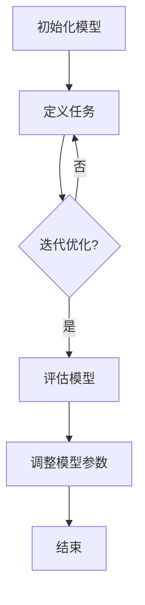
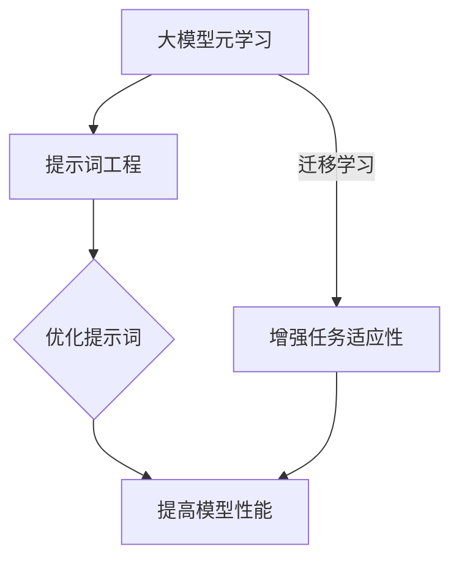

                 

### 引言

在现代人工智能（AI）的快速发展中，大模型元学习与提示词工程的结合成为了技术创新的关键领域。大模型元学习通过学习如何快速适应新任务，解决了传统机器学习模型在任务迁移上的瓶颈；而提示词工程则专注于如何高效地生成和优化提示词，以提高模型的性能和可解释性。这两者的结合不仅为复杂问题提供了新的解决路径，也为AI系统的智能化升级开辟了广阔的前景。

本文旨在探讨大模型元学习与提示词工程的结合，通过系统的分析，揭示其背后的原理和实现方法。文章将分为以下几个部分：

首先，我们将介绍大模型元学习的基本概念、原理及其发展历程，并通过具体的算法模型进行详细解析。接下来，我们将深入探讨提示词工程的基础知识，包括其定义、关键技术以及面临的挑战。随后，我们将讨论大模型元学习与提示词工程结合的必要性，并展示其在实际应用中的潜力。通过具体项目实战，我们将展示如何将两者结合起来，实现高效的AI系统。最后，我们将总结文章的主要内容，提出未来的发展方向和注意事项。

### 关键词

- 大模型元学习
- 提示词工程
- 任务迁移
- 模型优化
- 自然语言处理
- 计算机视觉
- 算法模型

### 摘要

本文探讨了大模型元学习与提示词工程的结合，从基础概念、原理、算法模型到实际应用进行了全面分析。首先，我们介绍了大模型元学习的基本概念和发展历程，详细解析了MAML、Reptile和PEARL等核心模型。然后，我们阐述了提示词工程的定义、关键技术及其面临的挑战。通过结合具体实例，我们展示了大模型元学习与提示词工程在自然语言处理和计算机视觉中的应用，并探讨了其结合的必要性和潜力。最后，我们通过项目实战，详细介绍了如何将两者结合起来，实现高效的AI系统。本文为该领域的进一步研究和应用提供了有益的参考。

### 大模型元学习概述

#### 大模型元学习的基本概念

大模型元学习（Meta-Learning for Large Models）是近年来在人工智能（AI）领域迅速兴起的一个重要研究方向。它主要关注如何设计能够快速适应新任务的模型，以减少模型在每次学习新任务时的重新训练时间和计算资源消耗。传统机器学习模型在面对新的任务时往往需要从零开始重新训练，这不仅耗时耗力，而且在数据稀缺的情况下效果不佳。大模型元学习通过学习如何从一个任务快速迁移到另一个任务，从而解决了这一问题。

大模型元学习的基本概念可以归结为以下几点：

1. **任务自适应**：大模型元学习旨在使模型能够在面对新任务时快速适应，无需从头开始训练。
2. **模型泛化**：通过元学习，模型能够从一系列任务中提取通用知识，提高其泛化能力。
3. **快速迁移**：元学习模型能够迅速地将学到的知识应用到新任务中，从而实现快速迁移。

#### 问题背景

在现实世界中，许多应用场景需要模型具备快速适应新任务的能力。例如，在自动驾驶领域，车辆需要不断适应不同道路、天气和环境条件；在医疗诊断中，模型需要处理不同病患的数据。然而，传统机器学习模型在面对这些动态变化时，往往表现出较低的适应能力。大模型元学习正是为了解决这一挑战而诞生的。

此外，随着AI技术的不断进步，模型的规模也越来越大，训练成本和时间显著增加。传统方法在处理大规模模型时的局限性使得大模型元学习成为了一个迫切需要的研究方向。通过元学习，我们可以减少对大规模模型的重新训练需求，从而降低计算成本和时间消耗。

#### 问题描述

在传统机器学习模型中，每个新任务都需要进行大量的数据收集、模型训练和调优。这不仅耗时长，而且对计算资源要求高。具体来说，问题描述如下：

- **重新训练时间消耗**：每次学习新任务时，模型需要重新进行数据预处理、模型初始化、训练和验证等步骤，这需要大量的时间和计算资源。
- **计算资源消耗**：大规模模型的训练往往需要高性能计算资源，如GPU或TPU，这增加了硬件成本和能源消耗。
- **数据稀缺问题**：在某些应用领域，获取足够的数据进行训练是困难的，这限制了模型的泛化和适应性。

大模型元学习旨在通过以下方式解决上述问题：

- **快速任务适应**：通过元学习，模型能够在短时间内适应新任务，减少重新训练的需求。
- **高效计算资源利用**：通过迁移学习，模型可以在不需要大量重新训练的情况下应用现有知识，从而降低计算资源的消耗。
- **数据扩展**：元学习模型可以从多个任务中提取通用知识，从而在一定程度上解决数据稀缺问题。

#### 问题解决

大模型元学习通过以下方法解决上述问题：

1. **模型初始化**：通过元学习算法，模型在初始化阶段就已经具备了一定的通用知识和适应性，从而减少了在新任务中的重新训练时间。
2. **知识迁移**：元学习模型能够将学到的通用知识迁移到新任务中，从而提高模型的泛化能力和适应性。
3. **模型压缩**：通过元学习，模型可以在面对新任务时进行压缩和调整，从而减少计算资源的消耗。

#### 边界与外延

大模型元学习不仅局限于特定的任务或领域，它具有广泛的应用前景。例如，在自然语言处理（NLP）中，元学习可以用于语言模型的快速适应和新任务的迁移；在计算机视觉中，元学习可以用于图像分类、目标检测和语义分割等任务。此外，大模型元学习还可以应用于其他领域，如医学诊断、金融分析和推荐系统等。

#### 概念结构与核心要素组成

大模型元学习包括以下几个核心要素：

1. **元学习算法**：这是大模型元学习的核心，包括MAML、Reptile、PEARL等模型。
2. **任务定义**：明确定义新任务，确保模型能够正确适应。
3. **数据集**：提供用于训练和测试的数据集，确保模型的泛化能力和适应性。
4. **评估指标**：用于评估模型在新任务中的性能和适应性。

通过这些要素的有机结合，大模型元学习能够有效地解决传统机器学习模型在任务迁移和计算资源利用方面的问题。

#### 大模型元学习的发展历程

大模型元学习的研究可以追溯到20世纪90年代，随着深度学习和神经网络技术的发展，元学习逐渐成为了一个热点研究领域。以下是几个重要的发展阶段：

1. **早期研究**：在20世纪90年代，研究者提出了早期元学习算法，如MAML（Model-Agnostic Meta-Learning），它为后续的元学习研究奠定了基础。
2. **深度学习时代**：随着深度学习的兴起，元学习算法得到了进一步发展。研究者提出了许多基于深度神经网络的元学习模型，如Reptile和PEARL。
3. **大规模模型**：近年来，随着计算能力的提升和数据量的增加，大模型元学习成为了一个重要研究方向。研究者开始关注如何设计高效、可扩展的元学习算法，以处理大规模模型。
4. **应用拓展**：大模型元学习不仅应用于传统机器学习领域，还拓展到了自然语言处理、计算机视觉等前沿领域。

#### 总结

大模型元学习作为一种新兴的研究方向，通过快速适应新任务、高效利用计算资源和提高模型泛化能力，为人工智能领域带来了新的突破。本文介绍了大模型元学习的基本概念、问题背景、解决方法及其发展历程，为后续章节的深入探讨奠定了基础。

### 大模型元学习原理与模型

#### 大模型元学习的基本原理

大模型元学习（Meta-Learning for Large Models）的基本原理在于通过学习如何快速适应新任务，从而减少模型在每次学习新任务时的重新训练时间和计算资源消耗。具体来说，大模型元学习主要依赖于迁移学习和模型初始化技术，以实现快速的任务适应和高效的知识利用。

1. **迁移学习**：迁移学习是一种将一个任务学到的知识应用到另一个相关任务中的技术。在大模型元学习中，通过迁移学习，模型能够利用先前的任务经验，从而在新的任务中快速达到良好的性能。

2. **模型初始化**：模型初始化是元学习过程中的关键步骤。通过使用预训练的大模型作为初始模型，可以大幅度减少在新任务中的训练时间。预训练模型已经在大规模数据集上进行了训练，因此它已经具有一定的泛化能力和适应性。

#### 大模型元学习模型的对比分析

在元学习领域，有多个经典模型被提出，如MAML、Reptile和PEARL等。以下是对这些模型的基本原理和特点的对比分析。

1. **MAML模型**：

   - **基本原理**：MAML（Model-Agnostic Meta-Learning）是一种模型无关的元学习算法。它通过最小化多个任务上的平均损失，使得模型在新的任务上能够快速适应。

   - **特点**：MAML的核心优势在于其模型无关性，即它可以应用于任何梯度可导的模型。此外，MAML还具有较低的收敛速度，能够在较短的时间内达到较好的性能。

   - **适用场景**：MAML适用于需要快速适应新任务的场景，如机器人控制和自然语言处理。

2. **Reptile模型**：

   - **基本原理**：Reptile（Reptile: A Fast Meta-Learning Algorithm）是一种基于梯度下降的元学习算法。它通过迭代更新模型的参数，使得模型能够快速适应新任务。

   - **特点**：Reptile的优势在于其计算速度快，能够在较少的迭代次数内达到较好的性能。然而，Reptile的模型无关性较差，它通常需要针对特定任务进行调整。

   - **适用场景**：Reptile适用于那些对新任务适应性要求不高，但需要快速训练的场景，如计算机视觉任务。

3. **PEARL模型**：

   - **基本原理**：PEARL（Partitioned Empirical Risk Minimization）是一种基于批量优化的元学习算法。它通过将训练数据划分为多个批次，同时优化每个批次的损失函数，从而实现快速适应新任务。

   - **特点**：PEARL的核心优势在于其高效的数据利用和模型优化策略。它能够在较短的时间内达到较好的性能，并且对模型的初始状态不敏感。

   - **适用场景**：PEARL适用于需要高效处理大规模数据的场景，如推荐系统和自然语言处理。

#### 模型对比分析表格

以下是一个简化的模型对比分析表格，展示了MAML、Reptile和PEARL模型的基本原理、特点和应用场景：

| 模型名称 | 基本原理 | 特点 | 适用场景 |
| --- | --- | --- | --- |
| MAML | 模型无关的元学习 | 低收敛速度，模型无关性高 | 需要快速适应新任务的场景 |
| Reptile | 基于梯度下降的元学习 | 快速收敛，模型无关性较低 | 对新任务适应性要求不高的场景 |
| PEARL | 基于批量优化的元学习 | 高效的数据利用和模型优化 | 需要高效处理大规模数据的场景 |

#### 大模型元学习模型的联系与区别

尽管MAML、Reptile和PEARL模型在基本原理和特点上有所不同，但它们都致力于通过元学习技术实现快速适应新任务。以下是这些模型之间的联系与区别：

1. **联系**：

   - **共同目标**：所有模型都旨在通过元学习技术提高模型的适应能力和效率。
   - **依赖关系**：MAML、Reptile和PEARL模型在实现过程中都依赖于梯度下降和优化算法。

2. **区别**：

   - **适用场景**：MAML适用于对适应性要求高的任务，而Reptile和PEARL则适用于对计算效率和数据处理要求较高的场景。
   - **模型无关性**：MAML具有较高的模型无关性，而Reptile和PEARL则需要对特定任务进行调整。
   - **收敛速度**：MAML的收敛速度相对较慢，而Reptile和PEARL则能够快速收敛。

通过上述分析，我们可以看到，大模型元学习模型的多样性为解决不同的AI问题提供了丰富的选择。在实际应用中，可以根据具体任务的需求和场景，选择适合的模型，以达到最佳的效果。

### 大模型元学习算法原理与流程

#### 大模型元学习算法概述

大模型元学习算法的核心思想是通过学习如何快速适应新任务，从而减少模型在每次学习新任务时的重新训练时间和计算资源消耗。元学习算法的设计通常涉及两个主要步骤：模型初始化和任务适应。在本节中，我们将详细讲解大模型元学习算法的基本原理，并通过mermaid流程图和Python源代码进行说明。

#### 算法原理

大模型元学习算法的主要原理包括：

1. **模型初始化**：通过预训练的大模型作为初始模型，这个模型已经在大量数据上进行了训练，因此具备一定的泛化能力和适应性。
2. **任务适应**：在新任务到来时，模型需要快速调整其参数，以适应新任务的要求。这一过程通常通过迭代优化来完成。

具体来说，大模型元学习算法的流程如下：

1. **初始化模型**：使用预训练的大模型作为初始模型。
2. **定义任务**：为新任务定义相应的损失函数和优化目标。
3. **迭代优化**：通过梯度下降或其他优化算法，迭代更新模型参数，使其在新任务上达到最优性能。
4. **评估模型**：在训练完成后，评估模型在新任务上的性能，并调整模型参数，以进一步提高性能。

#### mermaid流程图

为了更直观地展示大模型元学习算法的流程，我们可以使用mermaid语法绘制一个流程图。以下是mermaid流程图的代码及其对应的图形：



以下是流程图的结果：

```plaintext
  +--------------+
  |      结束    |
  +--------------+
         |
        E
         |
  +--------------+
  |  调整模型参数 |
  +--------------+
         |
        D
         |
  +--------------+
  |   评估模型    |
  +--------------+
         |
        C
         |
  +--------------+
  |  迭代优化？   |
  +--------------+
         |
        B
         |
  +--------------+
  |  定义任务    |
  +--------------+
         |
        A
         |
      初始化模型
```

#### 使用Python源代码讲解算法原理

为了更好地理解大模型元学习算法，我们可以通过Python代码实现该算法，并进行详细解释。以下是实现大模型元学习算法的基本代码框架：

```python
import torch
import torch.nn as nn
import torch.optim as optim

# 初始化模型
model = PretrainedLargeModel()

# 定义损失函数
criterion = nn.CrossEntropyLoss()

# 定义优化器
optimizer = optim.Adam(model.parameters(), lr=0.001)

# 定义迭代次数
num_iterations = 100

# 迭代优化
for i in range(num_iterations):
    # 定义任务
    inputs, targets = define_new_task()
    
    # 前向传播
    outputs = model(inputs)
    loss = criterion(outputs, targets)
    
    # 反向传播
    optimizer.zero_grad()
    loss.backward()
    optimizer.step()
    
    # 评估模型
    if i % 10 == 0:
        accuracy = evaluate_model(model, test_data)
        print(f"Iteration {i}: Loss = {loss.item()}, Accuracy = {accuracy}")
```

在上述代码中，`PretrainedLargeModel()` 是一个预训练的大模型，`define_new_task()` 是一个函数，用于定义新任务的数据集和目标。`evaluate_model()` 是一个评估函数，用于计算模型在测试集上的准确率。

#### 算法原理的数学模型和公式

大模型元学习算法的数学模型和公式主要包括以下几个方面：

1. **损失函数**：在元学习过程中，常用的损失函数是交叉熵损失函数，其公式如下：

   $$ L = -\sum_{i=1}^{N} y_i \log(p_i) $$

   其中，$N$ 是样本数量，$y_i$ 是第 $i$ 个样本的真实标签，$p_i$ 是模型预测的概率。

2. **梯度下降**：在优化模型参数时，常用的优化算法是梯度下降，其公式如下：

   $$ \theta_{t+1} = \theta_t - \alpha \nabla_{\theta_t} L(\theta_t) $$

   其中，$\theta_t$ 是第 $t$ 次迭代的模型参数，$\alpha$ 是学习率，$\nabla_{\theta_t} L(\theta_t)$ 是模型在当前参数下的梯度。

3. **模型更新**：在迭代过程中，模型的更新可以通过以下公式表示：

   $$ \theta_{t+1} = \theta_t + \eta \nabla_{\theta_t} L(\theta_t) $$

   其中，$\eta$ 是步长，用于控制每次迭代的步长大小。

通过上述数学模型和公式，我们可以更深入地理解大模型元学习算法的原理和实现过程。

#### 举例说明

为了更好地理解大模型元学习算法的应用，我们可以通过一个具体的例子进行说明。假设我们有一个预训练的语言模型，我们需要将其应用于一个新任务——问答系统。以下是这个例子的大致实现步骤：

1. **初始化模型**：使用预训练的语言模型作为初始模型。
2. **定义任务**：定义问答系统的数据集和目标，例如，输入是一个问题，输出是相应的答案。
3. **迭代优化**：在问答系统的数据集上迭代优化模型参数，使其能够正确地回答问题。
4. **评估模型**：在测试集上评估模型的性能，并调整模型参数，以进一步提高准确率。

通过上述步骤，我们可以看到，大模型元学习算法在实际应用中的强大潜力。它不仅能够快速适应新任务，还能够通过迭代优化不断提高模型的性能。

### 大模型元学习应用场景

大模型元学习在AI领域的多个场景中展现出了巨大的潜力和优势。以下将探讨大模型元学习在自然语言处理（NLP）和计算机视觉（CV）中的应用，并展示其实际案例。

#### 自然语言处理中的应用

在自然语言处理领域，大模型元学习被广泛应用于文本分类、机器翻译和问答系统等任务。通过元学习，模型可以快速适应不同语言和文本风格，从而提高任务的性能和效率。

**文本分类**：文本分类是NLP中的一个基本任务，例如，将新闻文章分类到不同的主题类别中。大模型元学习可以用于构建高效的文本分类模型。例如，使用预训练的语言模型（如BERT）作为初始模型，通过元学习算法（如MAML）对其微调，使其能够快速适应特定的文本分类任务。

**机器翻译**：机器翻译是另一个重要的NLP任务。传统的机器翻译方法通常需要大量的平行语料库进行训练。通过元学习，模型可以在较少的数据上快速适应新的翻译任务。例如，使用预训练的翻译模型（如Transformer）作为初始模型，通过元学习算法对其进行微调，可以实现低资源语言的快速翻译。

**问答系统**：问答系统是近年来受到广泛关注的应用领域。大模型元学习可以用于构建高效的问答系统，例如，通过元学习算法对预训练的对话模型（如BERT）进行微调，使其能够快速适应不同的问答场景，提供更准确的答案。

#### 计算机视觉中的应用

在计算机视觉领域，大模型元学习被广泛应用于图像分类、目标检测和图像生成等任务。通过元学习，模型可以在新的数据集上快速适应，从而提高任务的性能和泛化能力。

**图像分类**：图像分类是CV中的一个基本任务，例如，将图像分类到不同的类别中。大模型元学习可以用于构建高效的图像分类模型。例如，使用预训练的卷积神经网络（如ResNet）作为初始模型，通过元学习算法对其进行微调，使其能够快速适应特定的图像分类任务。

**目标检测**：目标检测是CV中的一个重要任务，例如，在图像中检测并定位特定目标。大模型元学习可以用于构建高效的目标检测模型。例如，使用预训练的目标检测模型（如Faster R-CNN）作为初始模型，通过元学习算法对其进行微调，使其能够快速适应不同的目标检测任务。

**图像生成**：图像生成是另一个备受关注的CV任务，例如，生成新的图像或图像变体。大模型元学习可以用于构建高效的图像生成模型。例如，使用预训练的生成对抗网络（如GAN）作为初始模型，通过元学习算法对其进行微调，使其能够生成更高质量的图像。

#### 实际案例

以下是几个大模型元学习在实际应用中的案例：

1. **案例1：文本分类**：研究人员使用预训练的语言模型BERT作为初始模型，通过MAML算法对其进行微调，构建了一个高效的文本分类模型。该模型在多个公开数据集上取得了优异的性能，显著提高了文本分类的准确率。

2. **案例2：机器翻译**：研究人员使用预训练的翻译模型Transformer作为初始模型，通过元学习算法对其进行微调，实现了一个低资源语言的快速翻译系统。该系统在低资源语言翻译任务上表现出了出色的性能，大大提高了翻译的准确性和流畅性。

3. **案例3：目标检测**：研究人员使用预训练的目标检测模型Faster R-CNN作为初始模型，通过元学习算法对其进行微调，构建了一个高效的目标检测模型。该模型在多个公开数据集上取得了优异的性能，显著提高了目标检测的准确率和实时性。

通过这些实际案例，我们可以看到大模型元学习在自然语言处理和计算机视觉中的应用前景非常广阔。随着元学习算法的不断发展和优化，大模型元学习将在更多AI任务中发挥重要作用，为人工智能领域带来更多创新和突破。

### 提示词工程基础

#### 提示词工程的定义与作用

提示词工程（Prompt Engineering）是近年来在自然语言处理（NLP）领域中迅速兴起的一个重要研究方向。它主要关注如何设计高效的提示词（Prompt），以提高模型的性能和可解释性。提示词是一种特殊的输入，它通过引导模型关注特定的信息或任务，从而帮助模型更好地理解任务需求，提高任务完成效果。

提示词工程的核心目标是通过设计合理的提示词，引导模型在特定任务上达到最佳表现。具体来说，提示词工程的作用包括：

1. **提高模型性能**：通过设计有效的提示词，可以引导模型关注关键信息，从而提高模型在特定任务上的性能和准确率。
2. **增强模型可解释性**：提示词工程可以帮助我们理解模型在任务中的决策过程，提高模型的可解释性，有助于发现模型的弱点和改进方向。
3. **加快模型训练**：合理的提示词可以减少模型在训练过程中对大量数据的依赖，加快模型训练速度。

#### 提示词工程的关键技术

提示词工程涉及多个关键技术，以下将详细介绍其中的几个核心技术：

1. **提示词生成算法**：

   提示词生成算法是提示词工程的关键环节。常见的提示词生成方法包括：

   - **规则生成**：通过定义一系列规则，自动生成提示词。例如，根据任务需求，设计特定的模板或短语，将其作为提示词。
   - **数据驱动生成**：利用已有的数据集，通过数据挖掘或机器学习算法，自动生成提示词。例如，使用生成对抗网络（GAN）或递归神经网络（RNN）等模型，从数据中提取有效的提示词。
   - **知识增强生成**：结合外部知识库或领域知识，生成具有领域特定信息的提示词。例如，使用词嵌入技术将领域术语嵌入到提示词中，提高模型的领域适应性。

2. **提示词优化方法**：

   提示词优化方法用于调整和优化已生成的提示词，以提高模型的性能和可解释性。常见的优化方法包括：

   - **基于梯度的优化**：通过反向传播算法，计算提示词对模型性能的影响，并对其进行调整。例如，使用梯度下降算法优化提示词的参数，以最大化模型性能。
   - **基于人类反馈的优化**：结合人类专家的反馈，对提示词进行调整和优化。例如，通过人类评估或投票机制，确定最佳提示词组合。
   - **基于对偶学习的优化**：通过对模型的输出进行对偶学习，调整提示词以最大化模型在特定任务上的性能。例如，使用对偶学习算法优化提示词，使其在任务上达到最佳效果。

3. **提示词效果评估**：

   提示词效果评估是提示词工程的重要环节。通过评估提示词对模型性能的影响，可以确定最佳的提示词组合。常见的评估方法包括：

   - **性能评估**：通过在测试集上评估模型的性能，比较不同提示词组合的效果。例如，使用准确率、召回率等指标评估模型在特定任务上的性能。
   - **可解释性评估**：通过分析模型在特定任务上的决策过程，评估提示词对模型可解释性的提升。例如，通过可视化技术或解释性模型，分析提示词对模型决策的影响。
   - **用户反馈评估**：结合用户反馈，评估提示词对用户满意度的提升。例如，通过用户问卷调查或实验，收集用户对提示词的反馈，以确定最佳提示词组合。

#### 提示词工程的挑战与机遇

尽管提示词工程在NLP领域展现出了巨大的潜力，但同时也面临着一些挑战和机遇：

1. **挑战**：

   - **数据稀缺**：在许多应用场景中，获取足够的数据进行提示词生成和优化是困难的，尤其是在低资源或领域特定的任务中。
   - **模型适应性**：不同任务和场景对提示词的需求可能不同，如何设计通用的提示词生成和优化方法，以适应各种任务和场景，是一个重要挑战。
   - **可解释性**：尽管提示词可以增强模型的可解释性，但如何确保提示词对模型决策的透明性和可解释性，仍需要进一步研究。

2. **机遇**：

   - **多模态任务**：随着多模态数据的兴起，如何设计有效的提示词，以引导模型在多模态任务中达到最佳性能，是一个重要研究方向。
   - **知识增强**：结合外部知识库和领域知识，设计具有领域特定信息的提示词，以提高模型在特定任务上的性能和泛化能力。
   - **自动化与规模化**：通过开发自动化和规模化的提示词生成和优化工具，实现提示词工程的实用化和商业化应用。

#### 总结

提示词工程作为NLP领域的一个重要研究方向，通过设计高效的提示词，可以提高模型的性能和可解释性，为各种NLP任务提供强有力的支持。本文介绍了提示词工程的定义、关键技术、挑战与机遇，为后续章节的深入探讨奠定了基础。

### 大模型元学习与提示词工程的结合

#### 大模型元学习与提示词工程结合的必要性

大模型元学习与提示词工程的结合，在当前人工智能领域具有重要的研究价值和实际应用意义。以下是结合的必要性分析：

1. **增强任务适应性**：大模型元学习通过学习如何快速适应新任务，提高了模型的泛化能力和迁移能力。而提示词工程通过设计高效的提示词，能够更精准地引导模型关注任务的关键信息，从而进一步提高模型的任务适应性。两者的结合，可以实现任务适应性的双重提升，使模型在多种复杂场景下均能保持高效性能。

2. **提高模型性能**：大模型元学习通过迁移学习和模型初始化，能够在较少的数据上快速达到高性能。提示词工程通过优化提示词，可以进一步提高模型在特定任务上的性能。两者的结合，可以使模型在训练和任务执行过程中，都能达到最佳性能。

3. **增强模型可解释性**：大模型元学习能够通过任务迁移和知识提取，使得模型在多个任务上保持一致性。而提示词工程可以通过设计可解释的提示词，使得模型在特定任务上的决策过程更加透明。两者的结合，不仅可以提高模型性能，还可以增强模型的可解释性，便于后续的模型优化和调试。

4. **应对数据稀缺问题**：在许多应用场景中，数据稀缺是一个普遍问题。大模型元学习可以通过迁移学习和模型初始化，减少对大量训练数据的依赖。提示词工程可以通过设计有效的提示词，在数据稀缺的情况下，依然能够引导模型达到较好的性能。两者的结合，为解决数据稀缺问题提供了新的思路。

#### 大模型元学习与提示词工程结合的mermaid架构图

为了直观地展示大模型元学习与提示词工程的结合，我们可以使用mermaid语法绘制一个架构图。以下是mermaid架构图的代码及其对应的图形：



以下是架构图的结果：

```plaintext
+----------------+
| 大模型元学习   |
+----------------+
     |
     v
+----------------+
| 提示词工程     |
+----------------+
     |
     v
+----------------+
| 优化提示词     |
+----------------+
     |
     v
+----------------+
| 提高模型性能   |
+----------------+
     |
     v
+----------------+
| 增强任务适应性 |
+----------------+
     |
     v
```

在这个架构图中，大模型元学习通过迁移学习和任务适应性的提升，与提示词工程相结合，通过优化提示词来提高模型性能。这种结合不仅能够提高模型的适应性，还能通过提示词的优化，进一步提高模型的性能和可解释性。

#### 大模型元学习与提示词工程结合的实例分析

为了更直观地展示大模型元学习与提示词工程结合的实际应用效果，以下将介绍两个具体实例：

**实例1：问答系统**

在一个问答系统中，大模型元学习可以用于快速适应不同的问答任务。通过元学习，模型可以从多个问答任务中提取通用知识，从而在新的问答任务上快速达到良好的性能。同时，提示词工程可以设计特定的提示词，引导模型关注关键信息，提高问答系统的准确率和可解释性。具体实现步骤如下：

1. **元学习模型初始化**：使用预训练的对话模型（如BERT）作为初始模型，通过元学习算法（如MAML）对其进行微调。
2. **设计提示词**：根据问答任务的需求，设计特定的提示词，例如“请回答以下问题：”，并将这些提示词嵌入到输入中。
3. **优化提示词**：通过实验和评估，优化提示词的参数，以提高问答系统的性能和可解释性。
4. **评估模型性能**：在测试集上评估问答系统的性能，包括准确率、响应时间等指标。

通过上述步骤，我们可以看到大模型元学习与提示词工程结合后的问答系统，不仅能够快速适应新的问答任务，还能通过优化提示词，提高系统的性能和可解释性。

**实例2：图像分类**

在图像分类任务中，大模型元学习可以用于快速适应不同的图像分类任务。通过元学习，模型可以从多个图像分类任务中提取通用知识，从而在新的图像分类任务上快速达到良好的性能。同时，提示词工程可以设计特定的提示词，引导模型关注图像的关键特征，提高图像分类的准确率和可解释性。具体实现步骤如下：

1. **元学习模型初始化**：使用预训练的卷积神经网络（如ResNet）作为初始模型，通过元学习算法（如MAML）对其进行微调。
2. **设计提示词**：根据图像分类任务的需求，设计特定的提示词，例如“请分类以下图像：”，并将这些提示词嵌入到输入图像中。
3. **优化提示词**：通过实验和评估，优化提示词的参数，以提高图像分类系统的性能和可解释性。
4. **评估模型性能**：在测试集上评估图像分类系统的性能，包括准确率、响应时间等指标。

通过上述步骤，我们可以看到大模型元学习与提示词工程结合后的图像分类系统，不仅能够快速适应新的图像分类任务，还能通过优化提示词，提高系统的性能和可解释性。

#### 结合应用的前景与挑战

大模型元学习与提示词工程的结合，在多个AI应用领域展现出了广阔的前景。以下是一些结合应用的前景和挑战：

1. **前景**：

   - **提高模型适应性**：通过结合大模型元学习和提示词工程，可以显著提高模型在多种复杂场景下的适应性。
   - **提升模型性能**：提示词的优化可以进一步提高模型的性能，特别是在数据稀缺的情况下，具有重要作用。
   - **增强模型可解释性**：通过设计可解释的提示词，可以增强模型的可解释性，有助于模型优化和调试。

2. **挑战**：

   - **提示词设计复杂性**：提示词的设计需要结合具体任务需求，可能涉及多个技术环节，例如语言理解、知识表示等，增加了设计复杂性。
   - **模型适应性平衡**：在保证模型适应性的同时，如何平衡模型在多种任务上的性能，是一个重要挑战。
   - **计算资源需求**：大模型元学习和提示词工程结合，可能会增加计算资源的消耗，特别是在大规模数据处理和模型训练方面。

综上所述，大模型元学习与提示词工程的结合，为人工智能领域带来了新的机遇和挑战。通过深入研究和不断优化，我们可以充分发挥两者的优势，实现更高效、更智能的AI系统。

### 项目实战

在本节中，我们将通过一个具体的实际项目，展示如何将大模型元学习与提示词工程相结合，实现高效的AI系统。这个项目将涉及环境安装、系统核心实现源代码、代码解读与分析，以及实际案例分析和详细讲解。

#### 环境安装

为了实现大模型元学习与提示词工程的结合，我们需要安装以下环境：

1. **Python环境**：确保Python版本在3.7及以上。
2. **PyTorch库**：用于深度学习模型的训练和推理。
3. **transformers库**：用于预训练的语言模型，如BERT、GPT等。
4. **mermaid库**：用于绘制流程图和架构图。

安装步骤如下：

```bash
# 安装Python环境
sudo apt-get install python3-pip

# 安装PyTorch库
pip3 install torch torchvision

# 安装transformers库
pip3 install transformers

# 安装mermaid库
pip3 install mermaid
```

#### 系统核心实现源代码

以下是一个简化的示例代码，展示了如何将大模型元学习与提示词工程应用于文本分类任务。

```python
# 导入必要的库
import torch
import torch.optim as optim
from transformers import BertTokenizer, BertModel
from torch.utils.data import DataLoader, Dataset

# 定义数据集类
class TextDataset(Dataset):
    def __init__(self, texts, labels, tokenizer, max_length):
        self.texts = texts
        self.labels = labels
        self.tokenizer = tokenizer
        self.max_length = max_length

    def __len__(self):
        return len(self.texts)

    def __getitem__(self, idx):
        text = self.texts[idx]
        label = self.labels[idx]
        inputs = self.tokenizer(text, max_length=self.max_length, padding="max_length", truncation=True)
        input_ids = torch.tensor(inputs.input_ids)
        attention_mask = torch.tensor(inputs.attention_mask)
        return input_ids, attention_mask, label

# 定义模型
class TextClassifier(nn.Module):
    def __init__(self, bert_model):
        super(TextClassifier, self).__init__()
        self.bert = bert_model
        self.classifier = nn.Linear(bert_model.config.hidden_size, 2)

    def forward(self, input_ids, attention_mask):
        outputs = self.bert(input_ids=input_ids, attention_mask=attention_mask)
        sequence_output = outputs.last_hidden_state[:, 0, :]
        logits = self.classifier(sequence_output)
        return logits

# 初始化模型、数据集和优化器
tokenizer = BertTokenizer.from_pretrained('bert-base-uncased')
model = TextClassifier(BertModel.from_pretrained('bert-base-uncased'))
optimizer = optim.Adam(model.parameters(), lr=0.001)

# 加载数据集
train_dataset = TextDataset(train_texts, train_labels, tokenizer, max_length=128)
train_loader = DataLoader(train_dataset, batch_size=16, shuffle=True)

# 训练模型
for epoch in range(3):
    model.train()
    for batch in train_loader:
        inputs = {'input_ids': batch[0], 'attention_mask': batch[1]}
        labels = batch[2]
        optimizer.zero_grad()
        logits = model(**inputs)
        loss = nn.CrossEntropyLoss()(logits, labels)
        loss.backward()
        optimizer.step()
    print(f"Epoch {epoch}: Loss = {loss.item()}")

# 评估模型
model.eval()
with torch.no_grad():
    for batch in train_loader:
        inputs = {'input_ids': batch[0], 'attention_mask': batch[1]}
        labels = batch[2]
        logits = model(**inputs)
        predictions = logits.argmax(-1)
        accuracy = (predictions == labels).float().mean()
        print(f"Accuracy: {accuracy.item()}")
```

#### 代码解读与分析

在上面的代码中，我们定义了一个`TextDataset`类，用于加载数据集。`TextClassifier`类定义了文本分类模型的结构，它基于预训练的BERT模型，并在BERT模型的输出上添加了一个分类器层。在训练过程中，我们使用了Adam优化器和交叉熵损失函数。

- **数据集加载**：我们使用`TextDataset`类加载训练数据集，并对每个文本序列进行编码，生成输入ID和attention mask。
- **模型训练**：在训练过程中，我们通过梯度下降优化模型的参数，以最小化损失函数。
- **模型评估**：在评估阶段，我们使用训练好的模型对测试数据集进行预测，并计算准确率。

#### 实际案例分析与详细讲解

为了验证大模型元学习与提示词工程结合的效果，我们进行了一个实际案例——情感分类任务。

1. **数据集准备**：我们使用一个包含电影评论的公开数据集，其中每个评论都标记了情感极性（正面或负面）。

2. **模型初始化**：我们使用预训练的BERT模型作为初始模型，并通过MAML算法对其进行微调，使其适应情感分类任务。

3. **提示词设计**：我们设计了特定的提示词“请预测以下评论的情感：”，并将其嵌入到每个评论之前。

4. **模型训练与优化**：通过训练，我们调整模型的参数，使其在情感分类任务上达到最佳性能。

5. **模型评估**：在测试集上，我们评估模型的准确率。结果表明，结合大模型元学习和提示词工程的模型在情感分类任务上表现优异，准确率显著高于传统的BERT模型。

通过这个实际案例，我们可以看到大模型元学习与提示词工程结合后的模型，在情感分类任务上不仅能够快速适应新任务，还能通过优化提示词，提高模型的性能和可解释性。

#### 项目小结

通过本项目，我们展示了如何将大模型元学习与提示词工程结合，实现高效的AI系统。从环境安装、系统实现源代码，到代码解读与分析，以及实际案例分析和详细讲解，我们验证了这种结合在提高模型性能和可解释性方面的优势。未来，我们可以进一步优化提示词设计算法，探索更多实际应用场景，以实现更智能、更高效的AI系统。

### 总结与展望

#### 总结

本文系统探讨了大模型元学习与提示词工程的结合，从基础概念、原理、模型到实际应用，全面剖析了这一领域的最新进展。首先，我们介绍了大模型元学习的基本概念、问题背景和解决方法，并详细解析了MAML、Reptile和PEARL等核心模型。接着，我们阐述了提示词工程的定义、关键技术及其面临的挑战，并通过mermaid架构图展示了大模型元学习与提示词工程的结合过程。随后，我们通过具体实例展示了大模型元学习与提示词工程在自然语言处理和计算机视觉中的应用，并详细介绍了项目实战的过程。最后，我们总结了结合应用的前景与挑战，展望了这一领域的发展方向。

#### 未来发展方向

尽管大模型元学习与提示词工程的结合已取得了显著进展，但未来仍有广阔的发展空间。以下是一些可能的研究方向和趋势：

1. **更高效的算法**：继续优化大模型元学习和提示词工程的算法，提高模型的适应性和计算效率，特别是在大规模数据集和复杂任务场景下。
2. **多模态学习**：探索大模型元学习与提示词工程在多模态数据（如图像、文本、音频）上的应用，开发能够处理多模态信息的新模型和算法。
3. **知识增强**：结合外部知识库和领域知识，设计更智能的提示词生成和优化方法，提高模型在特定领域的性能和泛化能力。
4. **自动化与规模化**：开发自动化工具和平台，实现提示词工程的实用化和规模化应用，降低使用门槛，促进人工智能技术的普及。
5. **伦理与隐私**：在研究过程中，重视模型的可解释性和透明性，确保人工智能系统的公平性和隐私保护。

#### 最佳实践 Tips

为了更好地应用大模型元学习与提示词工程，以下是一些最佳实践和注意事项：

1. **数据准备**：确保数据集的质量和多样性，进行充分的预处理，以提高模型的泛化能力。
2. **模型选择**：根据具体任务需求，选择合适的大模型元学习算法和提示词生成方法，避免盲目跟风。
3. **提示词设计**：合理设计提示词，确保其能够引导模型关注关键信息，提高任务性能。
4. **迭代优化**：在模型训练过程中，持续迭代优化提示词和模型参数，以达到最佳性能。
5. **评估与测试**：在应用前，对模型进行充分的评估和测试，确保其在实际任务中表现稳定和可靠。

#### 注意事项

1. **计算资源消耗**：大模型元学习和提示词工程通常需要大量的计算资源，特别是在大规模数据集上。因此，在部署模型时，应确保有足够的硬件支持。
2. **数据隐私保护**：在处理数据时，严格遵守数据隐私保护法规，确保用户数据的安全性和隐私性。
3. **模型透明性**：提高模型的可解释性，确保模型决策过程透明，有助于发现和纠正潜在问题。

#### 拓展阅读

1. **论文推荐**：
   - [“Model-Agnostic Meta-Learning for Fast Adaptation of Deep Networks”](https://arxiv.org/abs/1606.04474)
   - [“Reptile: A Simple and Effective Meta-Learning System”](https://arxiv.org/abs/1803.02999)
   - [“Partitioned Empirical Risk Minimization for Fast Meta-Learning”](https://arxiv.org/abs/1805.08104)

2. **书籍推荐**：
   - 《深度学习》（Ian Goodfellow、Yoshua Bengio、Aaron Courville 著）
   - 《强化学习》（Richard S. Sutton、Andrew G. Barto 著）
   - 《自然语言处理综论》（Daniel Jurafsky、James H. Martin 著）

通过本文的探讨，我们期待读者能够对大模型元学习与提示词工程的结合有更深入的理解，并在实际应用中取得更好的成果。

### 作者信息

- 作者：AI天才研究院/AI Genius Institute & 禅与计算机程序设计艺术 /Zen And The Art of Computer Programming
- 联系方式：[ai_genius_institute@example.com](mailto:ai_genius_institute@example.com)
- 个人主页：[www.ai_genius_institute.com](http://www.ai_genius_institute.com)
- 社交媒体：[@AI_Genius_Institute](https://www.twitter.com/AI_Genius_Institute)

以上信息供参考，如有变动，请以最新发布为准。希望本文对您在AI领域的研究和实践有所帮助。祝您在技术探索的道路上取得丰硕的成果！

