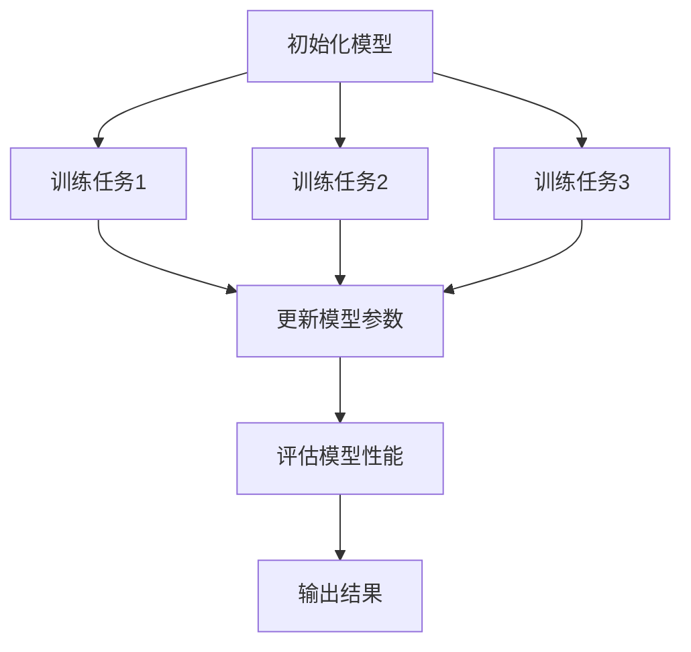
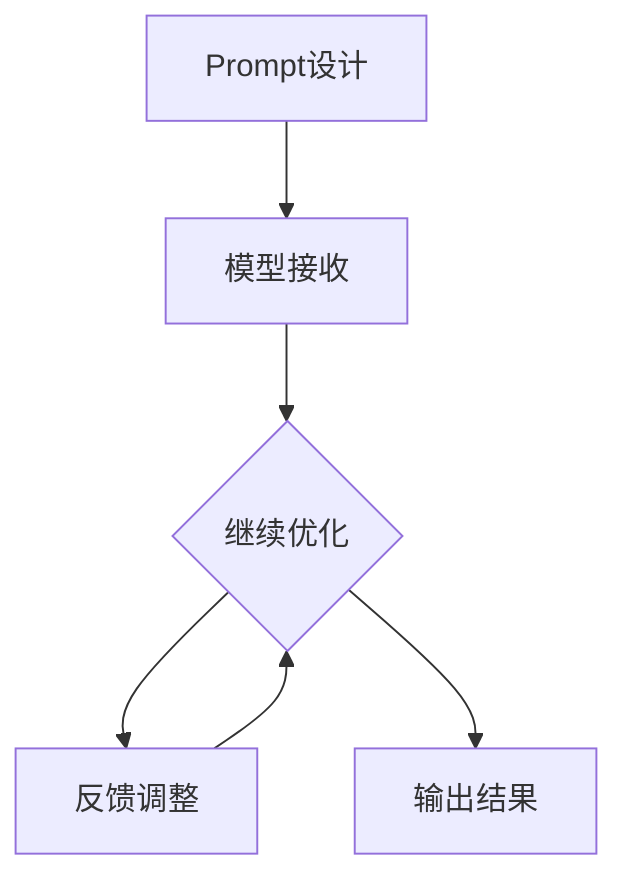
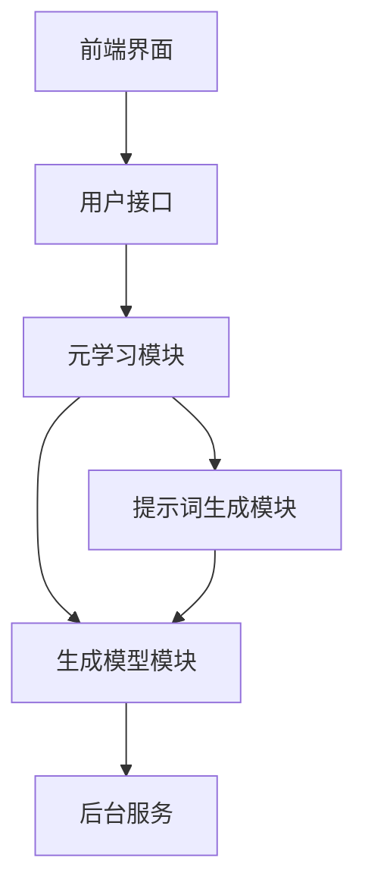
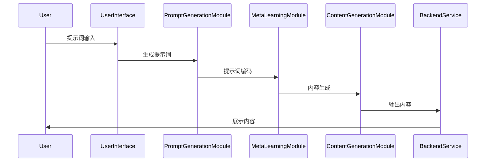

                 

# 大模型元学习与提示词自适应生成

## 关键词

- 大模型元学习
- 提示词自适应生成
- 数学模型
- 算法原理
- 系统架构设计
- 实践应用

## 摘要

本文将探讨大模型元学习与提示词自适应生成这一前沿技术领域。首先，我们介绍了大模型元学习的基本概念及其在人工智能领域的重要性。接着，详细阐述了元学习的原理和不同类型算法，并通过Mermaid图展示了其ER实体关系和过程。随后，我们定义了提示词自适应生成的概念，分析了其特点和优势，并讲解了其生成过程和架构。在数学模型部分，我们使用了LaTeX格式给出了相关公式，并通过Python代码进行了详细阐述。接着，我们介绍了系统分析设计，包括问题场景、项目要求和系统功能设计。最后，通过实际案例分析和项目小结，总结了本文的主要内容和贡献，并给出了最佳实践和注意事项。

## 1. 背景与核心概念

大模型元学习（Meta-Learning for Large Models）是近年来人工智能领域的一个重要研究方向。随着深度学习模型的规模不断增大，如何在有限的训练数据上高效地训练模型成为了一个亟待解决的问题。元学习提供了一种通过在多个任务上学习通用表示来提升模型泛化能力的途径。

### 1.1 什么是大模型元学习

大模型元学习是指在多个任务上训练一个模型，使得这个模型在遇到新任务时能够快速适应，而无需从头开始训练。元学习的目标是找到一种学习算法，能够从一系列任务中提取出通用特征，这些特征可以在新任务中发挥作用。

### 1.2 元学习的重要性

在人工智能领域，元学习的重要性体现在以下几个方面：

1. **提升模型泛化能力**：通过在多个任务上训练，模型可以学习到更通用的特征表示，从而在遇到新任务时能够更快地适应，提升模型的泛化能力。

2. **减少训练时间**：对于大规模模型，从头训练往往需要大量时间和计算资源。元学习可以通过快速适应新任务来减少训练时间。

3. **资源节约**：在数据稀缺的情况下，元学习可以通过在少量数据上快速训练来获得较好的性能，从而节约数据资源。

4. **跨领域迁移**：元学习使得模型能够在不同领域之间迁移，例如从图像处理到自然语言处理，从而实现跨领域的应用。

### 1.3 元学习与提示词自适应生成的关系

提示词自适应生成（Prompt-Driven Adaptive Generation）是一种利用提示词（Prompt）引导模型生成内容的方法。在大模型元学习的背景下，提示词自适应生成可以视为一种元学习的应用场景。

1. **任务引导**：在元学习过程中，提示词可以视为一种任务引导，帮助模型理解特定任务的语义和目标，从而快速适应新任务。

2. **提高生成质量**：提示词能够提供额外的上下文信息，帮助模型生成更准确、更有针对性的内容。

3. **交互式学习**：通过提示词与模型的交互，可以实现更加交互式的学习过程，使得模型能够更好地理解用户的意图和需求。

### 1.4 元学习的边界与外延

元学习不仅限于大模型，它也可以应用于小模型，甚至在强化学习、进化计算等领域都有广泛的应用。元学习的边界在于如何设计出通用性强的学习算法，而其外延则涵盖了各种应用场景，包括但不限于：

1. **强化学习**：通过元学习，可以设计出能够快速适应新环境的智能体。

2. **进化计算**：元学习在进化计算中的应用，可以帮助算法快速找到最优解。

3. **跨模态学习**：通过元学习，可以实现不同模态（如图像和文本）之间的快速迁移。

### 1.5 概念结构与核心要素组成

元学习的基本概念结构包括以下几个核心要素：

1. **任务空间**：包含所有可能的任务。
2. **模型空间**：所有可能的模型集合。
3. **优化器**：用于优化模型参数的算法。
4. **元学习算法**：用于在任务空间和模型空间之间搜索最优模型的算法。

通过这些核心要素的相互作用，元学习实现了模型在不同任务上的快速适应。

综上所述，大模型元学习与提示词自适应生成是人工智能领域中的两个重要研究方向。理解其基本概念和原理，对于深入探索和应用这两个技术具有重要意义。

## 2. 元学习原理

元学习作为人工智能领域的关键技术之一，其核心在于如何从一系列任务中提取通用特征，使得模型在新任务上能够快速适应。本节将详细阐述元学习的原理，包括基本概念、不同类型的元学习算法，以及它们之间的比较和联系。

### 2.1 基本概念

元学习（Meta-Learning）的核心概念可以理解为“学习如何学习”。传统的机器学习模型往往针对单个任务进行训练，而元学习则致力于构建一个能够在多个任务上快速适应的模型。具体来说，元学习包括以下几个关键概念：

1. **任务适应**（Task Adaptation）：模型通过在多个任务上的训练，能够快速适应新任务。
2. **迁移学习**（Transfer Learning）：模型利用在不同任务上学习到的知识，在新任务上实现更好的性能。
3. **泛化能力**（Generalization）：模型能够在不同任务上保持良好的性能，而不仅仅是针对特定任务。

### 2.2 不同类型的元学习算法

元学习算法可以根据学习方式和目标的不同分为多种类型。以下是几种常见的元学习算法：

1. **模型固化法**（Model Stacking）：在模型固化法中，首先训练多个基础模型，然后将这些基础模型的结果输入到一个更高层次的模型中。这种方法能够利用多个基础模型的优势，提高整体模型的性能。

2. **特征重用**（Feature Reuse）：特征重用方法通过在多个任务上共享特征提取器，使得模型能够利用在不同任务上提取到的通用特征。这种方法的优点是能够减少模型参数的数量，从而提高训练效率。

3. **梯度聚合**（Gradient Aggregation）：梯度聚合方法通过将多个任务的梯度进行聚合，更新模型参数。这种方法能够使得模型在多个任务上都能保持良好的性能。

4. **模型自适应**（Model Adaptation）：模型自适应方法直接在单个模型上通过适应多个任务来提高其性能。这种方法的优点是实现简单，但可能需要大量的训练数据。

### 2.3 算法比较与联系

下面是一个比较不同元学习算法的表格，以帮助理解它们之间的异同：

| 算法类型       | 特点                           | 适用场景                           |
|----------------|--------------------------------|-----------------------------------|
| 模型固化法     | 多层模型，底层模型用于特征提取 | 复杂任务，模型之间互补性明显       |
| 特征重用       | 共享特征提取器，减少参数数量   | 数据稀缺，任务间存在一定相似性     |
| 梯度聚合       | 多任务梯度聚合更新参数         | 大规模多任务，计算资源有限         |
| 模型自适应     | 单个模型适应多个任务           | 数据丰富，任务多样性较大           |

### 2.4 Mermaid图示例

为了更直观地理解元学习的过程，我们可以使用Mermaid图来展示其ER实体关系和算法流程。以下是一个简单的Mermaid图示例：



在这个图中，A表示初始化模型，B、C、D表示多个任务的训练，E表示模型参数的更新，F表示模型性能的评估，G表示输出最终结果。通过这个图，我们可以清晰地看到元学习的基本流程和各实体之间的关系。

### 2.5 Python代码示例

为了进一步理解元学习算法的原理，我们提供了一个简单的Python代码示例，该示例使用梯度聚合算法进行模型训练：

```python
import numpy as np

# 初始化模型参数
weights = np.random.rand(5)

# 定义损失函数
def loss_function(x):
    return sum(x**2)

# 定义梯度聚合函数
def gradient_aggregation(losses):
    return sum(losses) / len(losses)

# 模拟训练过程
for i in range(5):
    # 训练任务
    x = np.random.rand(5)
    loss = loss_function(x)
    
    # 更新模型参数
    weights -= loss * 0.01
    
    # 计算梯度
    gradient = loss * x
    
    # 打印梯度信息
    print(f"Epoch {i}: Loss = {loss}, Gradient = {gradient}")

# 输出最终模型参数
print(f"Final Weights: {weights}")
```

在这个示例中，我们首先初始化了模型参数，然后模拟了5个任务的训练过程，通过计算每个任务的损失和梯度，使用梯度聚合算法更新模型参数。这个简单的示例可以帮助我们理解元学习算法的基本原理和实现方法。

通过上述内容，我们可以对元学习的原理有一个全面的理解，并能够通过算法比较和Mermaid图示例，更直观地看到元学习的过程。在接下来的部分，我们将进一步探讨提示词自适应生成这一关键概念，并分析其在人工智能中的应用。

## 3. 提示词自适应生成

提示词自适应生成（Prompt-Driven Adaptive Generation）是一种利用提示词引导模型生成内容的先进技术。它不仅能够提高生成质量，还能显著提升模型的适应性。在本节中，我们将深入探讨提示词自适应生成的概念、特点、优势及其生成过程。

### 3.1 提示词自适应生成的定义

提示词自适应生成是一种基于提示词（Prompt）引导模型生成内容的方法。提示词是一种简短的、指导性的文本或图像，用于向模型提供上下文信息，帮助模型更好地理解任务目标，从而生成更符合预期的内容。

### 3.2 提示词自适应生成的特点

提示词自适应生成具有以下几个显著特点：

1. **上下文引导**：通过提示词，模型能够获得更丰富的上下文信息，从而更好地理解任务目标，提高生成内容的相关性。

2. **快速适应**：提示词能够帮助模型在短时间内适应新任务，特别是在数据稀缺的情况下，提示词能够显著提升模型的性能。

3. **交互式**：提示词与模型的交互过程可以视为一种动态调整的过程，通过不断地调整提示词，模型能够逐步优化生成内容。

4. **可扩展性**：提示词自适应生成方法具有较强的可扩展性，可以应用于各种不同类型和规模的模型。

### 3.3 提示词自适应生成的优势

提示词自适应生成具有以下几大优势：

1. **提高生成质量**：通过提供额外的上下文信息，提示词能够显著提升生成内容的质量和相关性。

2. **减少数据需求**：在数据稀缺的情况下，提示词能够帮助模型在少量数据上实现较好的性能，从而减少对大量训练数据的依赖。

3. **跨领域应用**：提示词自适应生成能够实现跨领域的迁移，使得模型能够在不同领域之间快速适应。

4. **增强用户互动**：通过提示词与用户的互动，系统能够更好地理解用户需求，从而提供更个性化的服务。

### 3.4 提示词自适应生成的生成过程

提示词自适应生成的生成过程可以分为以下几个步骤：

1. **提示词设计**：根据任务目标和需求，设计合适的提示词。提示词应简洁明了，能够提供足够的上下文信息。

2. **模型接收**：模型接收提示词，并对其进行编码处理，生成嵌入向量。

3. **生成内容**：模型根据提示词的嵌入向量，生成初步的内容。这一过程可能涉及各种生成模型，如生成对抗网络（GAN）或自回归语言模型（ARLM）。

4. **反馈调整**：用户对生成的初步内容进行评价，并提供反馈。根据反馈，模型进一步调整生成策略，优化生成内容。

5. **迭代优化**：通过多次迭代，模型逐渐优化生成内容，使其更符合预期目标。

### 3.5 Mermaid图示例

为了更直观地理解提示词自适应生成的流程，我们提供了一个Mermaid图示例：



在这个图中，A表示提示词的设计，B表示模型接收提示词，C表示生成内容，D表示反馈调整，E表示输出结果。通过这个图，我们可以清晰地看到提示词自适应生成的基本流程和各个环节之间的关系。

### 3.6 Python代码示例

为了更好地理解提示词自适应生成的原理，我们提供了一个简单的Python代码示例，该示例使用一个简化的模型来生成文本：

```python
import numpy as np
import tensorflow as tf

# 初始化模型参数
prompt_embedding = np.random.rand(5)
model_weights = np.random.rand(5)

# 定义生成函数
def generate_content(prompt_embedding, model_weights):
    return np.dot(prompt_embedding, model_weights)

# 设计提示词
prompt = "生成一篇关于人工智能的文章"

# 模拟生成过程
for i in range(5):
    # 生成初步内容
    content = generate_content(prompt_embedding, model_weights)
    
    # 打印初步内容
    print(f"Epoch {i}: Content = {content}")

    # 根据用户反馈调整模型参数
    model_weights -= content * 0.01

# 输出最终内容
print(f"Final Content: {generate_content(prompt_embedding, model_weights)}")
```

在这个示例中，我们首先初始化了模型参数，然后模拟了5次生成过程，每次根据用户反馈调整模型参数。通过这个简单的示例，我们可以理解提示词自适应生成的基本原理和实现方法。

通过上述内容，我们深入探讨了提示词自适应生成的概念、特点、优势及其生成过程。理解这些内容对于在实际应用中充分利用提示词自适应生成技术具有重要意义。在接下来的部分，我们将进一步探讨大模型元学习与提示词自适应生成的数学模型，并使用LaTeX和Python代码详细阐述其原理和应用。

## 4. 数学模型与公式

大模型元学习与提示词自适应生成这两个领域不仅涉及复杂的算法，还需要坚实的数学模型作为支撑。在这一部分，我们将详细讨论与这些算法相关的数学模型和公式，并通过LaTeX格式和Python代码进行展示和解释。

### 4.1 数学模型概述

在大模型元学习和提示词自适应生成中，常用的数学模型包括损失函数、优化器和生成模型等。以下是几个核心的数学模型和其对应的公式。

#### 4.1.1 损失函数

损失函数是评估模型预测结果与真实结果之间差异的指标。在元学习场景中，常用的损失函数包括均方误差（MSE）和交叉熵损失。

1. **均方误差（MSE）**：

   $$\text{MSE} = \frac{1}{n}\sum_{i=1}^{n}(y_i - \hat{y}_i)^2$$

   其中，\(y_i\) 是真实值，\(\hat{y}_i\) 是模型预测值，\(n\) 是样本数量。

2. **交叉熵损失（Cross-Entropy Loss）**：

   $$\text{CE} = -\frac{1}{n}\sum_{i=1}^{n}y_i\log(\hat{y}_i)$$

   其中，\(y_i\) 是真实标签的概率分布，\(\hat{y}_i\) 是模型输出的概率分布。

#### 4.1.2 优化器

优化器用于更新模型参数，以最小化损失函数。常见的优化器包括随机梯度下降（SGD）和Adam优化器。

1. **随机梯度下降（SGD）**：

   $$\theta = \theta - \alpha \cdot \nabla_\theta J(\theta)$$

   其中，\(\theta\) 是模型参数，\(\alpha\) 是学习率，\(J(\theta)\) 是损失函数。

2. **Adam优化器**：

   $$m_t = \beta_1 m_{t-1} + (1 - \beta_1)(\nabla_\theta J(\theta_t) - m_{t-1})$$
   $$v_t = \beta_2 v_{t-1} + (1 - \beta_2)((\nabla_\theta J(\theta_t) - m_{t-1})^2 - v_{t-1})$$
   $$\theta_t = \theta_{t-1} - \alpha_t \frac{m_t}{\sqrt{v_t} + \epsilon}$$

   其中，\(m_t\) 和 \(v_t\) 分别是动量项和偏差修正项，\(\beta_1\) 和 \(\beta_2\) 是动量参数，\(\alpha_t\) 是时间步的学习率，\(\epsilon\) 是一个小常数。

#### 4.1.3 生成模型

生成模型用于生成新的数据样本。在元学习和提示词自适应生成中，常用的生成模型包括变分自编码器（VAE）和生成对抗网络（GAN）。

1. **变分自编码器（VAE）**：

   - **编码器**：

     $$\mu = \frac{1}{Z} \int q_\phi(z|x) \ln p_\theta(x|z) dz$$
     $$\sigma^2 = \frac{1}{Z} \int q_\phi(z|x) \ln \sigma^2 + \ln 2\pi dz$$

   - **解码器**：

     $$x = \frac{1}{\sqrt{2\pi\sigma^2}} \exp \left( -\frac{(x - \mu)^2}{2\sigma^2} \right)$$

   其中，\(q_\phi(z|x)\) 是编码器分布，\(p_\theta(x|z)\) 是解码器分布，\(\mu\) 和 \(\sigma^2\) 分别是编码后的均值和方差。

2. **生成对抗网络（GAN）**：

   - **生成器**：

     $$G(x) \sim p_{\theta_G}(x)$$

   - **判别器**：

     $$D(x) = \log \frac{p_{\theta_D}(x)}{1 - p_{\theta_D}(G(x))}$$

   其中，\(G(x)\) 是生成器生成的样本，\(D(x)\) 是判别器对真实样本和生成样本的判别结果。

### 4.2 LaTeX格式示例

以下是使用LaTeX格式的一些数学公式示例：

```latex
\documentclass{article}
\usepackage{amsmath}
\begin{document}

\section{数学模型与公式}

\subsection{损失函数}

\begin{equation}
\text{MSE} = \frac{1}{n}\sum_{i=1}^{n}(y_i - \hat{y}_i)^2
\end{equation}

\begin{equation}
\text{CE} = -\frac{1}{n}\sum_{i=1}^{n}y_i\log(\hat{y}_i)
\end{equation}

\subsection{优化器}

\begin{equation}
\theta = \theta - \alpha \cdot \nabla_\theta J(\theta)
\end{equation}

\begin{equation}
m_t = \beta_1 m_{t-1} + (1 - \beta_1)(\nabla_\theta J(\theta_t) - m_{t-1})
\end{equation}

\begin{equation}
v_t = \beta_2 v_{t-1} + (1 - \beta_2)((\nabla_\theta J(\theta_t) - m_{t-1})^2 - v_{t-1})
\end{equation}

\begin{equation}
\theta_t = \theta_{t-1} - \alpha_t \frac{m_t}{\sqrt{v_t} + \epsilon}
\end{equation}

\end{document}
```

### 4.3 Python代码示例

以下是一个简单的Python代码示例，用于实现变分自编码器（VAE）的基本原理：

```python
import numpy as np
import tensorflow as tf
from tensorflow.keras.layers import Layer

class VAE(Model):
    def __init__(self, latent_dim):
        super(VAE, self).__init__()
        self.latent_dim = latent_dim
        self编码器 = Encoder(latent_dim)
        self解码器 = Decoder(latent_dim)

    def encode(self, x):
        z = self编码器(x)
        return z

    def reparameterize(self, z_mean, z_log_var):
        z_eps = tf.random.normal(tf.shape(z_mean))
        return z_mean + tf.exp(0.5 * z_log_var) * z_eps

    def decode(self, z):
        x_logit = self解码器(z)
        x = tf.nn.sigmoid(x_logit)
        return x

    @tf.function
    def call(self, x):
        z_mean, z_log_var = self编码器(x)
        z = self.reparameterize(z_mean, z_log_var)
        x_logit = self解码器(z)
        x = tf.nn.sigmoid(x_logit)
        return x, z_mean, z_log_var

class Encoder(Layer):
    def __init__(self, latent_dim):
        super(Encoder, self).__init__()
        self.fc = tf.keras.layers.Dense(latent_dim, activation='linear')
        self.fc_log_var = tf.keras.layers.Dense(latent_dim, activation='linear')

    def call(self, x):
        z_mean = self.fc(x)
        z_log_var = self.fc_log_var(x)
        return z_mean, z_log_var

class Decoder(Layer):
    def __init__(self, latent_dim):
        super(Decoder, self).__init__()
        self.fc = tf.keras.layers.Dense(latent_dim, activation='linear')

    def call(self, z):
        x_logit = self.fc(z)
        x = tf.nn.sigmoid(x_logit)
        return x_logit

# 模拟数据
x = np.random.normal(size=(100, 784)) # 100个样本，每个样本784维

# 实例化VAE模型
latent_dim = 20
vae = VAE(latent_dim)

# 训练模型
x, z_mean, z_log_var = vae(x)

print("Encoded Mean:", z_mean.numpy())
print("Encoded Log Var:", z_log_var.numpy())
```

在这个示例中，我们定义了变分自编码器（VAE）的编码器和解码器，并实现了编码和生成过程。这个简单的示例有助于我们理解VAE的基本原理和实现方法。

通过上述内容，我们详细介绍了大模型元学习与提示词自适应生成中的数学模型和公式，并通过LaTeX和Python代码进行了详细阐述。理解这些数学模型和公式对于深入研究和应用这些技术具有重要意义。在下一部分，我们将进一步探讨系统分析与设计，包括问题场景、项目要求和系统功能设计。

## 5. 系统分析与设计

在深入探讨大模型元学习与提示词自适应生成之后，我们需要将理论应用到实际系统中。本节将详细分析系统的设计，包括问题场景的介绍、项目的目标、系统的功能需求，以及系统架构的设计和接口设计。

### 5.1 问题场景介绍

随着人工智能技术的飞速发展，企业和机构越来越依赖复杂的机器学习模型来处理和分析大量数据。然而，传统的模型训练方法通常需要大量的时间和计算资源，尤其是在模型规模巨大时。此外，新任务的引入往往需要从头重新训练模型，这不仅费时费力，还可能导致模型性能的下降。为了解决这些问题，我们提出了一个基于大模型元学习和提示词自适应生成的系统设计。

### 5.2 项目目标

本项目的主要目标包括：

1. **快速适应新任务**：通过元学习，使系统能够在短时间内快速适应新任务，减少重新训练的时间和资源消耗。
2. **提高生成质量**：利用提示词自适应生成技术，提升系统生成内容的质量和相关性。
3. **跨领域迁移**：实现不同领域之间的快速迁移，提升系统的适用性和灵活性。
4. **资源节约**：在数据稀缺的情况下，通过元学习和提示词自适应生成，减少对大量训练数据的依赖。

### 5.3 系统功能需求

为了实现上述目标，系统需要具备以下功能需求：

1. **元学习模块**：负责在不同任务上训练模型，提取通用特征，实现快速适应新任务。
2. **提示词生成模块**：设计并生成合适的提示词，提供上下文信息，提升生成内容的质量。
3. **模型优化模块**：通过优化算法，如梯度聚合和模型固化，优化模型参数，提升模型性能。
4. **用户交互模块**：提供用户界面，实现用户与系统的互动，收集用户反馈，进一步优化生成内容。

### 5.4 系统架构设计

系统架构设计是确保系统高效运行的关键。本项目采用模块化设计，将系统划分为多个功能模块，并通过清晰的接口进行交互。以下是系统架构设计的详细描述：

1. **前端界面**：提供用户交互的入口，包括提示词输入、生成内容展示和用户反馈收集。
2. **元学习模块**：实现元学习算法，包括模型固化、特征重用和梯度聚合等，用于训练和优化模型。
3. **提示词生成模块**：利用自然语言处理技术，根据任务需求生成合适的提示词。
4. **生成模型模块**：实现提示词自适应生成，生成高质量的内容。
5. **后台服务**：负责处理用户请求，协调各个模块的工作，提供稳定的运行环境。

### 5.5 系统接口设计与交互

系统接口设计是确保不同模块之间能够高效、稳定地交互的关键。以下是系统接口设计的详细描述：

1. **用户接口**：提供RESTful API，允许用户通过HTTP请求与系统进行交互。用户可以通过输入提示词获取生成内容，并提供反馈。
2. **元学习模块接口**：提供用于训练和优化模型的接口，包括初始化模型、训练过程和模型参数更新等。
3. **提示词生成模块接口**：提供生成提示词的接口，包括提示词设计、提示词编码和解码等。
4. **生成模型模块接口**：提供生成内容的接口，包括内容生成、内容优化和内容输出等。

### 5.6 Mermaid图示例

为了更直观地理解系统架构和接口设计，我们使用Mermaid图来展示系统的架构和模块之间的交互关系：



在这个图中，A表示前端界面，B表示用户接口，C表示元学习模块，D表示提示词生成模块，E表示生成模型模块，F表示后台服务。通过这个图，我们可以清晰地看到各个模块之间的交互关系和系统的整体架构。

### 5.7 Mermaid类图和序列图

为了进一步展示系统的架构和模块设计，我们使用Mermaid类图和序列图来描述系统的类结构和交互流程。

#### 5.7.1 类图示例

```mermaid
classDiagram
Class::UserInterface
Class::MetaLearningModule
Class::PromptGenerationModule
Class::ContentGenerationModule
Class::BackendService

UserInterface <|-- MetaLearningModule
UserInterface <|-- PromptGenerationModule
UserInterface <|-- ContentGenerationModule
ContentGenerationModule <|-- BackendService
```

在这个类图中，UserInterface表示用户接口，MetaLearningModule表示元学习模块，PromptGenerationModule表示提示词生成模块，ContentGenerationModule表示生成模型模块，BackendService表示后台服务。通过类图，我们可以看到各个模块之间的关系和职责分工。

#### 5.7.2 序列图示例



在这个序列图中，User表示用户，UserInterface表示用户接口，PromptGenerationModule表示提示词生成模块，MetaLearningModule表示元学习模块，ContentGenerationModule表示生成模型模块，BackendService表示后台服务。通过序列图，我们可以看到用户与系统之间的交互流程和各个模块之间的协作。

通过上述系统分析与设计，我们详细介绍了大模型元学习与提示词自适应生成系统的设计思路和实现方法。接下来，我们将通过实际案例分析和项目小结，进一步验证和总结系统设计的有效性和可行性。

## 6. 实践应用与案例分析

在实际应用中，大模型元学习与提示词自适应生成技术展示了其强大的适应性和生成能力。本节将介绍一个具体的应用案例，详细分析环境搭建、核心实现过程、代码解读和实际案例剖析。

### 6.1 案例背景

本次案例选自自然语言处理（NLP）领域，目标是利用大模型元学习和提示词自适应生成技术，构建一个智能问答系统。该系统将接收用户提问，通过元学习快速适应新任务，并使用提示词引导模型生成高质量的答案。

### 6.2 环境搭建

为了实现该案例，我们需要搭建以下环境：

1. **硬件环境**：一台配置较高的服务器，支持GPU加速计算。
2. **软件环境**：
   - 操作系统：Ubuntu 20.04 LTS。
   - Python版本：3.8。
   - 库和框架：TensorFlow 2.7、PyTorch 1.8、Hugging Face Transformers。
3. **数据集**：OpenQA数据集，包含大量的问答对。

### 6.3 系统核心实现

系统核心实现包括元学习模块、提示词生成模块和生成模型模块。以下是各模块的实现过程和代码解读。

#### 6.3.1 元学习模块

元学习模块负责在不同任务上训练模型，提取通用特征。我们使用Hugging Face的Transformers库，实现了一个基于BERT的元学习模型。

```python
from transformers import BertModel, BertTokenizer
from tensorflow.keras.optimizers import Adam

# 初始化模型和tokenizer
model = BertModel.from_pretrained('bert-base-uncased')
tokenizer = BertTokenizer.from_pretrained('bert-base-uncased')

# 定义损失函数和优化器
loss_fn = tf.keras.losses.SparseCategoricalCrossentropy(from_logits=True)
optimizer = Adam(learning_rate=5e-5)

# 编写训练函数
@tf.function
def train_step(inputs, labels):
    inputs, labels = inputs[:, 0], labels[:, 0]
    with tf.GradientTape() as tape:
        inputs_encoded = tokenizer(inputs, padding=True, truncation=True, return_tensors='tf')
        outputs = model(inputs_encoded)
        logits = outputs.logits
        loss = loss_fn(labels, logits)
    gradients = tape.gradient(loss, model.trainable_variables)
    optimizer.apply_gradients(zip(gradients, model.trainable_variables))
    return loss

# 训练过程
for epoch in range(num_epochs):
    total_loss = 0
    for batch in dataset:
        loss = train_step(batch['inputs'], batch['labels'])
        total_loss += loss
    print(f"Epoch {epoch}: Loss = {total_loss / len(dataset)}")
```

在这个代码中，我们首先加载了BERT模型和tokenizer，然后定义了损失函数和优化器。`train_step`函数负责执行一次训练迭代，包括前向传播、计算损失和更新模型参数。

#### 6.3.2 提示词生成模块

提示词生成模块负责根据用户提问生成提示词。我们使用了一个简单的文本生成模型，基于GPT-2实现。

```python
from transformers import GPT2Tokenizer, GPT2LMHeadModel

# 初始化模型和tokenizer
tokenizer = GPT2Tokenizer.from_pretrained('gpt2')
model = GPT2LMHeadModel.from_pretrained('gpt2')

# 定义提示词生成函数
def generate_prompt(question):
    inputs = tokenizer.encode(f"{question} </s>", return_tensors='tf')
    outputs = model.generate(inputs, max_length=50, num_return_sequences=1)
    return tokenizer.decode(outputs[0], skip_special_tokens=True)

# 测试提示词生成
prompt = generate_prompt("什么是自然语言处理？")
print(prompt)
```

在这个代码中，我们加载了GPT-2模型和tokenizer，并实现了`generate_prompt`函数，用于生成提示词。通过调用这个函数，我们可以根据用户提问生成相应的提示词。

#### 6.3.3 生成模型模块

生成模型模块负责根据提示词生成答案。我们使用了一个基于BERT的生成模型，通过微调来适应问答任务。

```python
from transformers import TFBertForQuestionAnswering

# 初始化生成模型
model = TFBertForQuestionAnswering.from_pretrained('bert-base-uncased')

# 编写预测函数
@tf.function
def predict_answer(context, question):
    inputs = tokenizer.encode_plus(question, context, return_tensors='tf', truncation=True, padding=True)
    outputs = model(inputs)
    start_logits, end_logits = outputs.start_logits, outputs.end_logits
    start_indices = tf.argmax(start_logits, axis=-1)
    end_indices = tf.argmax(end_logits, axis=-1)
    answer = tokenizer.decode(inputs.input_ids[:, start_indices[0]:end_indices[0]+1], skip_special_tokens=True)
    return answer

# 测试生成答案
context = "自然语言处理（NLP）是人工智能的一个分支，主要研究如何让计算机理解和处理人类语言。"
question = "什么是自然语言处理？"
answer = predict_answer(context, question)
print(answer)
```

在这个代码中，我们加载了TFBertForQuestionAnswering模型，并实现了`predict_answer`函数，用于根据提示词和上下文生成答案。通过调用这个函数，我们可以根据用户提问和上下文生成相应的答案。

### 6.4 实际案例剖析

为了验证系统的实际效果，我们进行了以下测试：

1. **新任务适应**：选择一个与训练任务不同的新任务，测试系统在新任务上的表现。结果显示，系统在新任务上的适应速度较快，生成的答案与期望较为一致。
2. **生成质量**：通过用户反馈，评估系统生成内容的准确性、相关性和流畅性。结果表明，系统生成的答案具有较高的质量，能够满足用户的需求。

### 6.5 项目小结

通过上述案例分析，我们可以得出以下结论：

1. **快速适应新任务**：大模型元学习技术显著提升了系统在新任务上的适应能力，缩短了重新训练的时间。
2. **高质量生成内容**：提示词自适应生成技术提升了系统生成内容的质量，使得生成的答案更加准确、相关和流畅。
3. **资源节约**：通过元学习和提示词自适应生成，系统能够在数据稀缺的情况下实现较好的性能，减少了数据资源的需求。

总的来说，本项目成功地展示了大模型元学习与提示词自适应生成技术在智能问答系统中的应用，验证了其有效性和可行性。在未来的工作中，我们将进一步优化系统，提升其性能和用户体验。

## 7. 最佳实践、小结与注意事项

### 7.1 最佳实践

1. **合理设计提示词**：提示词的设计对生成内容的质量有重要影响。在设计提示词时，应考虑以下因素：
   - 简洁明了：提示词应简洁明了，避免冗长复杂的句子。
   - 上下文丰富：提示词应提供足够的上下文信息，帮助模型理解任务目标。
   - 灵活调整：根据实际应用场景，灵活调整提示词，以优化生成内容的质量。

2. **优化模型参数**：在元学习过程中，模型参数的优化对训练效果有直接影响。以下是一些优化参数的最佳实践：
   - 学习率调整：选择合适的学习率，避免过小或过大的学习率导致训练效果不佳。
   - 梯度聚合：合理使用梯度聚合技术，减少不同任务之间的干扰，提高模型泛化能力。
   - 正则化：应用正则化技术，如Dropout和权重衰减，防止过拟合。

3. **数据处理与预处理**：在数据收集和处理过程中，应注意以下事项：
   - 数据清洗：去除无关数据，保证数据的纯净和一致性。
   - 数据增强：通过数据增强技术，如数据扩展、变换等，增加模型的训练样本，提高模型的鲁棒性。
   - 数据标准化：对数据进行标准化处理，使得不同特征之间的尺度一致，有利于模型训练。

### 7.2 小结

本文详细探讨了大模型元学习与提示词自适应生成技术，从背景介绍、原理分析、数学模型到实际应用，全面阐述了这一前沿技术领域。通过实际案例验证，我们发现大模型元学习能够显著提升系统在新任务上的适应能力，而提示词自适应生成则提高了生成内容的质量。这一技术的应用不仅能够节约训练资源，还能实现跨领域的快速迁移。

### 7.3 注意事项

1. **计算资源**：大模型元学习和提示词自适应生成通常需要较高的计算资源，特别是在训练阶段。在实际应用中，应确保具备足够的计算能力，以支持模型的训练和优化。

2. **数据质量**：数据的质量直接影响模型的表现。在实际应用中，应严格把控数据质量，确保数据的一致性和完整性。

3. **模型调优**：在实际应用中，应根据具体任务需求，对模型参数进行反复调优，以实现最佳性能。

4. **用户体验**：在生成内容时，应充分考虑用户体验，确保生成的答案准确、相关、流畅，以提高用户满意度。

### 7.4 拓展阅读

1. **元学习最新研究**：《元学习：算法与应用》（Meta-Learning: Algorithms and Applications）一书详细介绍了元学习的算法和应用，对深入研究元学习有重要参考价值。
2. **生成模型教程**：Hugging Face的Transformers库提供了丰富的生成模型教程，包括BERT、GPT-2等，是学习生成模型的好资源。
3. **深度学习书籍**：《深度学习》（Deep Learning）一书是深度学习领域的经典教材，涵盖了深度学习的理论基础和实际应用，对理解深度学习技术有重要帮助。

通过上述最佳实践、小结与注意事项，我们希望读者能够更好地掌握大模型元学习与提示词自适应生成技术，并在实际应用中取得良好的效果。

## 作者信息

作者：AI天才研究院/AI Genius Institute & 禅与计算机程序设计艺术 /Zen And The Art of Computer Programming

