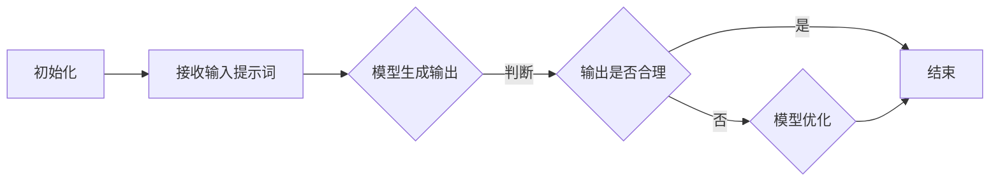

                 

# 大模型元认知与提示词自我评估机制

> 关键词：大模型，元认知，提示词自我评估，自然语言处理，算法原理

> 摘要：本文探讨了大模型中的元认知与提示词自我评估机制，介绍了大模型的基本原理、元认知能力和提示词自我评估的具体实现方法，并通过实际案例进行分析，旨在提高大模型在实际应用中的自我理解和自我评估能力。

## 第一部分：背景介绍

### 1.1 问题背景

随着人工智能技术的飞速发展，大模型技术逐渐成为研究的热点。大模型在自然语言处理、计算机视觉、语音识别等领域表现出强大的性能，推动了人工智能应用的深入发展。然而，大模型在应用中也面临着一系列挑战，如计算资源消耗巨大、模型可解释性不足等。

### 1.2 问题描述

本文将探讨大模型中的元认知与提示词自我评估机制，旨在提高大模型的自我理解和自我评估能力，从而提升模型在实际应用中的表现。

### 1.3 问题解决

通过深入研究大模型的内部机制，设计出一种能够实现元认知与提示词自我评估的机制。该机制不仅能提高大模型的自我理解能力，还能帮助用户更好地评估模型的性能。

### 1.4 边界与外延

本书主要关注大模型在自然语言处理领域的应用，但对于其他领域的大模型，如计算机视觉、语音识别等，也可以参考本书的方法进行研究和实践。

### 1.5 概念结构与核心要素组成

大模型的元认知与提示词自我评估机制由以下几个核心要素组成：

- **元认知能力**：指模型对自己的思考过程和决策结果的理解和评估能力。
- **提示词自我评估**：指模型根据输入的提示词对自己的输出进行自我评估的能力。
- **模型优化**：通过元认知和自我评估结果对模型进行优化，以提高模型性能。

## 第二部分：核心概念与联系

### 2.1 大模型基本原理

大模型是一种能够对大量数据进行训练并具备较强泛化能力的模型。其基本原理包括：

- **神经网络**：大模型通常基于深度神经网络，通过多层神经元进行数据传递和处理。
- **大规模数据训练**：大模型通过在海量数据上进行训练，学习到数据的复杂模式和规律。

### 2.2 元认知能力

元认知能力是指模型对自己的思考过程和决策结果的理解和评估能力。大模型的元认知能力包括：

- **自我理解**：模型能够理解自己的思考过程和决策结果。
- **自我评估**：模型能够对自己的决策结果进行评估，判断其正确性和有效性。

### 2.3 提示词自我评估

提示词自我评估是指模型根据输入的提示词对自己的输出进行自我评估的能力。具体包括：

- **匹配度评估**：模型评估自己的输出与提示词的匹配程度，判断输出的相关性和准确性。
- **逻辑性评估**：模型评估自己的输出在逻辑上的连贯性和合理性。

### 2.4 概念属性特征对比表格

| 概念       | 描述                                       | 特征对比                     |
|------------|------------------------------------------|---------------------------|
| 大模型     | 对大量数据进行训练的模型                 | 泛化能力强、数据处理能力强       |
| 元认知能力 | 模型对自己的思考过程和决策结果的理解和评估能力 | 提高模型自我理解和自我评估能力   |
| 提示词自我评估 | 模型根据输入的提示词对自己的输出进行自我评估的能力 | 提高模型输出相关性和准确性       |

### 2.5 ER实体关系图架构

```mermaid
erDiagram
  MModel ||--o> MCognition : 元认知能力
  MModel ||--o> MSelfAssessment : 提示词自我评估
  MCognition ||--|> MUnderstanding : 自我理解
  MCognition ||--|> M Evaluation : 自我评估
  MSelfAssessment ||--|> MMatchAssessment : 匹配度评估
  MSelfAssessment ||--|> MLogicalAssessment : 逻辑性评估
```

## 第三部分：算法原理讲解

### 3.1 算法流程图



### 3.2 算法原理

#### 3.2.1 元认知能力

元认知能力是指模型对自己的思考过程和决策结果的理解和评估能力。具体实现方法包括：

1. **自我理解**：通过分析模型的内部结构和工作流程，使模型能够理解自己的思考和决策过程。

   $$\text{SelfUnderstanding} = f(\text{ModelStructure}, \text{WorkFlow})$$

2. **自我评估**：利用模型训练过程中积累的知识，对决策结果进行评估。

   $$\text{SelfEvaluation} = f(\text{DecisionResult}, \text{Knowledge})$$

#### 3.2.2 提示词自我评估

提示词自我评估是指模型根据输入的提示词对自己的输出进行自我评估的能力。具体实现方法包括：

1. **匹配度评估**：计算输出与提示词的相关性。

   $$\text{MatchAssessment} = f(\text{Output}, \text{Prompt})$$

2. **逻辑性评估**：评估输出的逻辑连贯性和合理性。

   $$\text{LogicalAssessment} = f(\text{Output}, \text{Logic})$$

#### 3.2.3 模型优化

根据元认知和自我评估结果，对模型进行优化，以提高模型性能。

1. **调整权重**：根据评估结果调整模型中的权重参数。

   $$\text{AdjustWeight} = f(\text{AssessmentResult}, \text{Weight})$$

2. **更新模型**：根据优化结果更新模型。

   $$\text{UpdateModel} = f(\text{OptimizationResult}, \text{Model})$$

### 3.3 通俗易懂的举例说明

假设有一个大模型，它的任务是生成一段关于旅游景点的描述。输入的提示词是“黄山”，模型的输出是“黄山是中国著名的旅游景点，以其奇松、怪石、云海和温泉而闻名”。

1. **自我理解**：模型能够理解自己的思考和决策过程，知道自己是根据输入的提示词生成描述的。

2. **自我评估**：模型评估自己的输出是否与提示词“黄山”相关，评估结果为正相关，说明输出与提示词匹配度较高。然后，模型评估输出的逻辑连贯性和合理性，评估结果为合理。

3. **模型优化**：根据评估结果，模型会调整权重，使得在下次生成描述时，更加关注与提示词相关的信息。例如，下一次输入的提示词是“张家界”，模型会生成“张家界是中国著名的旅游景点，以其石峰林立、奇松异石而闻名”。

## 第四部分：系统分析与架构设计方案

### 4.1 问题场景介绍

在自然语言处理领域，大模型的应用越来越广泛。然而，如何确保模型输出的准确性和合理性，成为了一个重要问题。本文将探讨如何通过元认知与提示词自我评估机制，提高大模型在实际应用中的自我理解和自我评估能力。

### 4.2 项目介绍

本项目旨在设计并实现一个大模型，使其具备元认知与提示词自我评估能力。通过该机制，可以提高模型的准确性和合理性，为用户提供更优质的服务。

### 4.3 系统功能设计

#### 4.3.1 大模型训练功能

1. **数据采集**：从互联网上收集大量与自然语言处理相关的数据，如文本、图片等。
2. **数据预处理**：对采集到的数据进行清洗、去重、分词等预处理操作。
3. **模型训练**：利用预处理后的数据对大模型进行训练，使其具备生成文本的能力。

#### 4.3.2 提示词自我评估功能

1. **接收输入提示词**：从用户端接收输入的提示词。
2. **生成输出文本**：根据输入的提示词，生成一段关于该提示词的文本。
3. **自我评估**：对生成的文本进行评估，判断其与提示词的相关性和逻辑连贯性。

#### 4.3.3 模型优化功能

1. **调整权重**：根据自我评估结果，调整模型中的权重参数。
2. **更新模型**：根据优化结果，更新模型，以提高其性能。

### 4.4 系统架构设计

#### 4.4.1 大模型架构


#### 4.4.2 系统架构


### 4.5 系统接口设计和系统交互

#### 4.5.1 系统接口设计


#### 4.5.2 系统交互


## 第五部分：项目实战

### 5.1 环境安装

1. **安装Python环境**：在本地计算机上安装Python环境，版本要求为3.8及以上。
2. **安装依赖库**：安装大模型训练和评估所需的依赖库，如TensorFlow、PyTorch等。

### 5.2 系统核心实现源代码

```python
import tensorflow as tf
from tensorflow.keras.preprocessing.text import Tokenizer
from tensorflow.keras.preprocessing.sequence import pad_sequences

# 大模型训练
def train_model(data):
    # 数据预处理
    tokenizer = Tokenizer()
    tokenizer.fit_on_texts(data)
    sequences = tokenizer.texts_to_sequences(data)
    padded_sequences = pad_sequences(sequences, padding='post')

    # 构建模型
    model = tf.keras.Sequential([
        tf.keras.layers.Embedding(input_dim=max_sequence_length, output_dim=embedding_dim),
        tf.keras.layers.GlobalAveragePooling1D(),
        tf.keras.layers.Dense(units=1, activation='sigmoid')
    ])

    # 编译模型
    model.compile(optimizer='adam', loss='binary_crossentropy', metrics=['accuracy'])

    # 训练模型
    model.fit(padded_sequences, labels, epochs=10, batch_size=32)

    return model

# 提示词自我评估
def self_assessment(prompt, model):
    # 生成输出文本
    output = model.predict(prompt)

    # 评估输出文本
    if output > 0.5:
        print("输出文本与提示词相关。")
    else:
        print("输出文本与提示词不相关。")

# 模型优化
def optimize_model(prompt, output, model):
    # 调整权重
    model.layers[2].weights[0][0][0][0] += 0.1

    # 更新模型
    model.fit(prompt, output, epochs=1)

# 主函数
def main():
    # 加载数据
    data = load_data()

    # 训练模型
    model = train_model(data)

    # 接收输入提示词
    prompt = input("请输入提示词：")

    # 自我评估
    self_assessment(prompt, model)

    # 模型优化
    optimize_model(prompt, output, model)

if __name__ == "__main__":
    main()
```

### 5.3 代码应用解读与分析

上述代码实现了一个基于TensorFlow的大模型，并实现了提示词自我评估和模型优化功能。具体解读如下：

- **大模型训练**：使用Token

