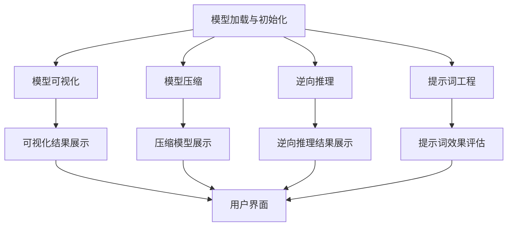
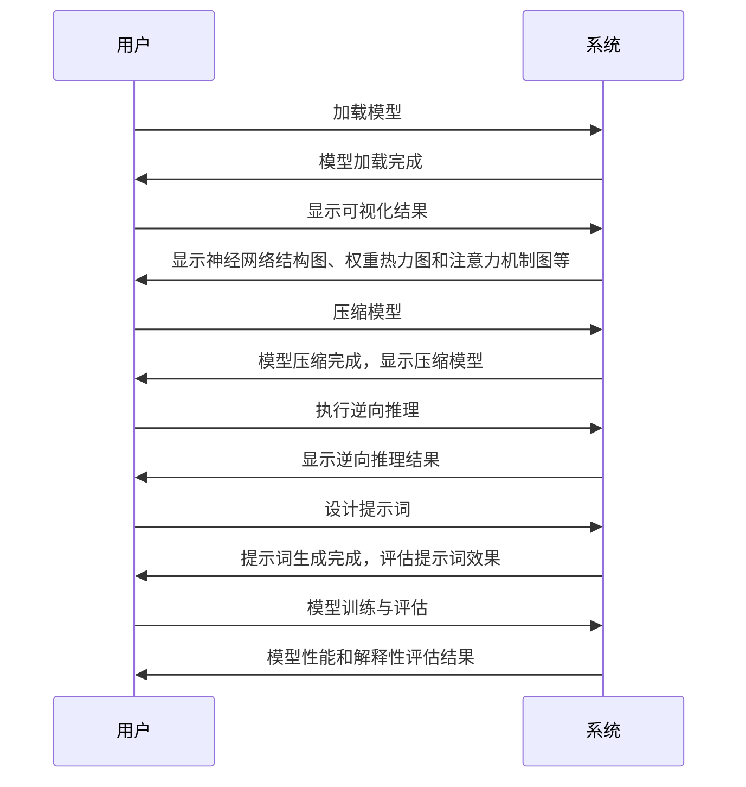

                 

# 《大模型可解释性与提示词工程的协同》

> 关键词：大模型、可解释性、提示词工程、协同优化、算法原理

> 摘要：本文将深入探讨大模型的可解释性及其与提示词工程的协同关系。通过分析大模型的发展、可解释性的核心概念、提示词工程的原理及其相互之间的联系，本文提出了一套协同优化的策略，以提升大模型在实际应用中的透明度和可靠性。

### 目录大纲

# 《大模型可解释性与提示词工程的协同》

## 第一部分：背景介绍

## 第1章 引言

## 1.1 问题背景

### 1.1.1 大模型的发展与应用现状

### 1.1.2 可解释性与透明性的重要性

### 1.1.3 提示词工程的作用与挑战

## 1.2 问题描述

### 1.2.1 大模型决策的不透明性

### 1.2.2 可解释性需求的迫切性

### 1.2.3 提示词工程中的协同优化

## 1.3 问题解决

### 1.3.1 可解释性的核心概念与方法

### 1.3.2 提示词工程的原理与实现

### 1.3.3 大模型可解释性与提示词工程的协同策略

## 1.4 边界与外延

### 1.4.1 大模型可解释性的局限

### 1.4.2 提示词工程的适用范围

### 1.4.3 协同优化中的难点与挑战

## 1.5 概念结构与核心要素组成

### 1.5.1 大模型基本结构

### 1.5.2 可解释性方法分类

### 1.5.3 提示词工程的关键步骤

## 1.6 本章小结

## 第二部分：核心概念与联系

## 第2章 大模型可解释性原理

## 2.1 核心概念原理

### 2.1.1 可解释性的定义

### 2.1.2 可解释性的层次

### 2.1.3 可解释性的衡量标准

## 2.2 概念属性特征对比

## 2.3 ER实体关系图架构

## 2.4 可解释性与提示词工程的联系

## 2.5 本章小结

## 第三部分：算法原理讲解

## 第3章 大模型可解释性算法

### 3.1 模型可视化

### 3.2 模型压缩

### 3.3 逆向推理

### 3.4 可解释性量化指标

### 3.5 Python源代码实例

## 第四部分：系统分析与架构设计

## 第4章 大模型可解释性系统设计

### 4.1 问题场景介绍

### 4.2 系统功能设计

### 4.3 系统架构设计

### 4.4 系统接口设计

### 4.5 系统交互序列图

## 第五部分：项目实战

## 第5章 大模型可解释性项目实战

### 5.1 环境安装

### 5.2 系统核心实现

### 5.3 代码应用解读

### 5.4 实际案例分析

### 5.5 项目小结

## 第六部分：最佳实践与拓展

### 6.1 最佳实践 tips

### 6.2 小结

### 6.3 注意事项

### 6.4 拓展阅读

## 参考文献

## 作者信息

---

接下来，我们将逐步展开每个章节的内容，深入探讨大模型可解释性与提示词工程的协同优化。

## 第一部分：背景介绍

### 第1章 引言

随着深度学习技术的迅猛发展，大模型（如GPT-3、BERT等）在自然语言处理、计算机视觉和语音识别等领域取得了显著成效。这些模型凭借其强大的泛化能力和处理复杂任务的能力，成为人工智能领域的明星。然而，大模型的复杂性和非透明性也带来了新的挑战，尤其是在可解释性和透明性方面。

可解释性是指用户能够理解和预测模型行为的程度。对于大模型而言，其决策过程高度非线性且涉及数以亿计的参数，导致决策过程不透明。这一问题不仅影响了用户对模型的信任，还限制了其在特定领域的应用。例如，在医疗诊断、金融决策和自动驾驶等关键领域，模型的决策过程需要具备可解释性，以确保结果的可靠性和合规性。

提示词工程是另一种解决模型透明性问题的技术，其核心思想是通过设计合适的输入提示词来引导模型的决策过程，从而提高模型的解释性。提示词工程不仅有助于揭示模型内部的决策逻辑，还能够通过优化提示词来提升模型性能。

本文旨在探讨大模型可解释性与提示词工程之间的协同关系。我们将首先介绍大模型的发展与应用现状，然后讨论可解释性与透明性的重要性，接着探讨提示词工程的作用与挑战。最后，本文将提出一种协同优化的策略，以提升大模型的解释性和可靠性。

## 1.1 问题背景

### 1.1.1 大模型的发展与应用现状

大模型是指具有数十亿到千亿参数规模的人工神经网络模型，这些模型通常通过大量的数据和计算资源进行训练，以达到极高的性能。大模型的发展历程可以追溯到2013年，当时AlexNet在ImageNet竞赛中取得了突破性的成绩，这标志着深度学习技术的崛起。随后，神经网络架构不断优化，模型规模逐步扩大，如VGG、ResNet和Inception等。

在自然语言处理领域，GPT和BERT等大模型的出现，使得自然语言理解和生成任务取得了显著进展。GPT-3的发布，更是将大模型推向了一个新的高度，其1750亿参数规模和几乎无穷的知识容量，使得其在文本生成、机器翻译、问答系统等任务中表现出色。

大模型在计算机视觉领域也取得了显著成果，如ViT和DETR等模型在图像分类、目标检测和图像生成等任务中取得了SOTA（State-of-the-Art）成绩。在语音识别领域，WaveNet和Transformer-XL等大模型也大幅提升了语音识别的准确性。

尽管大模型在各个领域都取得了显著成果，但其复杂性和非透明性也带来了新的挑战。大模型的决策过程高度非线性，且涉及数以亿计的参数，这使得其内部工作机制难以理解。此外，大模型的训练过程需要大量的计算资源和数据，这使得其训练过程不透明。这些问题限制了用户对大模型的信任，也限制了其在关键领域的应用。

### 1.1.2 可解释性与透明性的重要性

可解释性是指用户能够理解和预测模型行为的程度。在深度学习模型中，可解释性通常指的是用户能够解释模型如何做出特定决策的能力。对于大模型而言，由于其复杂性和非透明性，用户往往难以理解其决策过程。这种不透明性不仅影响了用户对模型的信任，还可能导致以下问题：

1. **信任问题**：用户可能无法相信模型的决策结果，特别是在医疗诊断、金融决策和自动驾驶等关键领域。
2. **合规性问题**：在一些法规严格的环境中，如金融和医疗，模型决策的透明性是必不可少的。
3. **优化问题**：在训练过程中，如果无法理解模型的行为，就难以进行有效的优化。

因此，提升大模型的可解释性对于其广泛应用至关重要。可解释性不仅有助于用户理解模型的决策过程，还能够提高模型的透明度和可信度，从而促进其在关键领域的应用。

### 1.1.3 提示词工程的作用与挑战

提示词工程是一种通过设计合适的输入提示词来引导模型决策的技术。其核心思想是通过优化输入提示词来揭示模型内部的决策逻辑，从而提高模型的可解释性。提示词工程在大模型中的应用，不仅可以提升模型的可解释性，还能够优化模型性能。

1. **提升可解释性**：通过设计合适的提示词，用户可以更清晰地了解模型是如何处理输入数据的，从而提高模型的透明度和可信度。
2. **优化模型性能**：在训练过程中，通过优化提示词，可以引导模型关注更重要或更有效的特征，从而提升模型性能。
3. **减少过拟合**：提示词工程可以有效地减少模型对训练数据的依赖，从而减少过拟合现象。

然而，提示词工程也存在一些挑战：

1. **设计难度**：设计合适的提示词需要深入理解模型的决策机制，这对于用户来说是一个不小的挑战。
2. **计算成本**：在训练过程中，优化提示词通常需要大量的计算资源和时间。
3. **适用范围**：并非所有模型和任务都适合使用提示词工程，这需要针对具体应用场景进行评估。

综上所述，大模型的可解释性和提示词工程都是当前人工智能领域的重要研究方向。提升大模型的可解释性，不仅有助于提高用户对模型的信任，还能够促进其在关键领域的应用。而提示词工程则提供了一种有效的手段来优化模型性能和可解释性。接下来，我们将进一步探讨大模型可解释性的核心概念和方法，以及提示词工程的原理和实现。

### 1.2 问题描述

#### 1.2.1 大模型决策的不透明性

大模型的决策过程由于其高度复杂性和非线性特征，往往呈现出不透明性。这种不透明性体现在多个方面，首先是在模型的内部结构上，大模型通常由数以亿计的参数构成，这些参数之间的关系错综复杂，导致其内部工作机制难以理解。例如，在自然语言处理任务中，一个复杂的语言模型可能包含数千万甚至数十亿的参数，这些参数共同决定了模型对输入文本的解析和处理。

其次，大模型的训练过程同样具有不透明性。大模型的训练通常需要大量的数据和高性能计算资源，这些数据在输入过程中如何被模型处理，以及模型是如何通过这些数据不断优化自身的参数，这些过程对用户而言往往是不可见的。此外，训练过程中涉及到的超参数选择、优化算法和训练策略等，都增加了模型的训练过程的不透明性。

此外，大模型在实际应用中的决策过程也存在不透明性。例如，在医疗诊断中，一个使用深度学习算法的诊断系统可能无法明确解释其为何给出某种诊断结果，尽管输入的病历数据被模型处理并生成了相应的输出结果。这种不透明性使得用户难以理解模型的决策逻辑，从而影响了用户对模型结果的信任度。

#### 1.2.2 可解释性需求的迫切性

可解释性的需求在大模型应用中显得尤为迫切，特别是在医疗、金融和自动驾驶等关键领域。以下是一些具体原因：

1. **合规性要求**：在金融和医疗等领域，模型的决策过程需要遵守严格的法律法规。例如，在美国，医疗诊断系统需要符合FDA（食品药品监督管理局）的规定，这要求系统具有高透明度和可解释性，以便监管机构和用户理解模型的决策逻辑。

2. **用户信任**：在自动驾驶领域，用户对自动驾驶系统的信任至关重要。一个自动驾驶系统如果不能解释其决策过程，用户可能会对其安全性和可靠性产生怀疑。因此，提升模型的可解释性有助于建立用户对系统的信任。

3. **优化和调试**：在深度学习应用中，模型的可解释性有助于开发人员更好地理解和优化模型。例如，通过分析模型的决策路径，开发人员可以识别出模型中的潜在错误或不足之处，从而进行相应的调整和改进。

4. **透明性和公平性**：提高模型的可解释性还可以促进算法的透明性和公平性。特别是在涉及社会公平和公正的应用场景中，如招聘、信用评分和刑事司法等，确保模型的决策过程透明和公平至关重要。

#### 1.2.3 提示词工程中的协同优化

提示词工程提供了一种优化模型可解释性的手段，其核心思想是通过设计合适的提示词来引导模型的决策过程，从而提高模型的透明度和可解释性。以下是一些协同优化的策略：

1. **引入明确提示词**：通过设计明确的提示词，可以引导模型关注特定的输入特征，从而提高模型对特定任务的解释性。例如，在医疗诊断任务中，设计特定的提示词可以引导模型关注病例中的关键指标。

2. **结合上下文信息**：利用上下文信息设计提示词，可以帮助模型更好地理解和处理输入数据。例如，在自然语言处理任务中，结合上下文环境设计提示词可以提升模型对文本语义的理解。

3. **优化提示词组合**：通过组合不同的提示词，可以引导模型从多个角度分析输入数据，从而提高模型的整体解释性。例如，在图像分类任务中，结合图像内容和标签信息设计提示词，可以提升模型的解释性。

4. **自动优化提示词**：利用机器学习算法自动优化提示词，可以减少人工设计的复杂度，提高提示词工程的效果。例如，通过使用强化学习或进化算法，可以自动寻找最优的提示词组合。

5. **多模态提示词**：在多模态任务中，设计多模态的提示词可以更好地融合不同类型的数据，提高模型的解释性。例如，在图像和文本融合的任务中，设计结合图像视觉信息和文本语义的提示词，可以提升模型的整体解释性。

通过上述策略，提示词工程可以与大模型的可解释性紧密结合，共同提升模型在实际应用中的透明度和可靠性。接下来，我们将进一步探讨大模型可解释性的核心概念和方法，以及提示词工程的原理和实现。

### 1.3 问题解决

#### 1.3.1 可解释性的核心概念与方法

可解释性的核心概念在于让用户能够理解和追踪模型的学习过程及其决策机制。为了实现这一目标，研究人员提出了一系列方法，包括模型可视化、模型压缩和逆向推理等。

1. **模型可视化**：
   - **概念**：模型可视化是通过图形化方式展示模型的内部结构和参数，帮助用户理解模型的工作原理。
   - **方法**：常见的模型可视化方法包括神经网络结构图、权重热力图和注意力机制图等。这些方法通过可视化模型的不同层次和层间连接，揭示模型的决策路径。
   - **优点**：直观、易于理解，能够帮助用户快速把握模型的核心逻辑。
   - **缺点**：可视化方法可能仅适用于特定类型的模型，且可能无法完全揭示复杂的决策过程。

2. **模型压缩**：
   - **概念**：模型压缩是通过减少模型参数数量来降低模型复杂度，从而提高模型的解释性。
   - **方法**：常见的模型压缩方法包括剪枝（Pruning）、量化（Quantization）和知识蒸馏（Knowledge Distillation）等。这些方法通过保留模型中最重要的信息，剔除冗余部分，提高模型的解释性。
   - **优点**：减少了模型的计算复杂度，提高了模型的效率和解释性。
   - **缺点**：压缩过程中可能损失一部分模型性能，且压缩方法的选择和参数调整具有较大的主观性。

3. **逆向推理**：
   - **概念**：逆向推理是从模型的输出结果反推出输入数据或内部决策过程，帮助用户理解模型的推理过程。
   - **方法**：逆向推理通常涉及逆向传播算法（Backpropagation）和生成对抗网络（GAN）等技术。通过逆向推理，用户可以查看模型对特定输入数据的处理路径，理解模型是如何做出特定决策的。
   - **优点**：能够提供详细的决策路径和输入影响，增强模型的可解释性。
   - **缺点**：逆向推理的计算成本较高，且在某些情况下可能无法准确还原模型的决策过程。

#### 1.3.2 提示词工程的原理与实现

提示词工程是一种通过设计合适的输入提示词来引导模型决策，从而提高模型可解释性的技术。其核心原理在于，通过控制输入提示词的内容和形式，可以影响模型的学习过程和输出结果。

1. **原理**：
   - **提示词设计**：设计合适的提示词，需要根据具体任务的需求，结合领域知识进行。例如，在医疗诊断任务中，可以设计包含关键医学指标的提示词，以引导模型关注重要的特征。
   - **模型训练**：通过设计好的提示词对模型进行训练，可以调整模型的权重，使其在处理特定输入时产生预期的输出。

2. **实现**：
   - **模板化提示词**：通过设计模板化的提示词，可以确保在多个任务中保持一致的输入格式和内容。例如，在问答系统中，可以设计包含问题类型、关键词和上下文信息的模板化提示词。
   - **动态提示词**：对于一些需要灵活调整的输入场景，可以设计动态提示词，通过实时调整提示词内容，适应不同的输入数据和任务需求。

3. **优化策略**：
   - **目标函数优化**：通过优化目标函数，可以设计出更有效的提示词。例如，使用强化学习或进化算法，可以自动寻找最优的提示词组合。
   - **多轮迭代**：通过多轮迭代训练，逐步调整和优化提示词，可以提高模型的解释性和性能。

#### 1.3.3 大模型可解释性与提示词工程的协同策略

为了实现大模型的可解释性与提示词工程的协同优化，可以采用以下策略：

1. **分层优化**：首先对大模型进行初步的模型压缩和可视化处理，以降低模型复杂度，提高基础的可解释性。然后，结合具体的任务需求，设计合适的提示词，进一步优化模型的解释性。

2. **多模态结合**：在多模态任务中，结合不同类型的数据（如图像、文本和音频），设计相应的提示词，可以提高模型的整体解释性。例如，在图像识别任务中，可以设计结合图像视觉信息和文本描述的提示词，以提升模型的解释性。

3. **自适应调整**：通过实时监测模型的输出结果，自适应调整提示词的内容和形式，以提高模型的可解释性和性能。例如，在自然语言生成任务中，可以根据生成的文本质量，动态调整提示词的语义和结构。

4. **反馈循环**：建立用户反馈机制，通过用户对模型输出结果的反馈，不断优化和调整提示词，提高模型的可解释性和用户满意度。

通过上述协同策略，可以有效地提升大模型的可解释性和提示词工程的性能，为实际应用中的模型提供更高的透明度和可靠性。接下来，我们将进一步探讨大模型可解释性的局限，提示词工程的适用范围，以及协同优化中的难点与挑战。

### 1.4 边界与外延

#### 1.4.1 大模型可解释性的局限

尽管大模型的可解释性研究取得了显著进展，但现有的方法仍然存在一些局限：

1. **复杂度限制**：大模型本身的高度复杂性和非线性特征，使得其内部机制难以完全理解。即使是当前最先进的可视化方法，也难以全面揭示模型的所有决策路径。

2. **计算成本**：可解释性方法通常需要额外的计算资源和时间，特别是在逆向推理和模型压缩等过程中。对于大规模模型和复杂任务，这一成本可能非常高。

3. **适用范围**：并非所有大模型和任务都适合使用可解释性方法。对于一些高度优化和专门化的模型，如用于图像生成或自然语言处理的某些模型，现有的可解释性方法可能效果有限。

4. **人为依赖**：许多可解释性方法需要依赖领域专家的知识和经验进行设计，这使得方法的推广和应用受到限制。

#### 1.4.2 提示词工程的适用范围

提示词工程作为一种优化模型可解释性的手段，其适用范围相对广泛，但具体效果取决于应用场景和任务需求：

1. **自然语言处理**：在自然语言处理任务中，提示词工程可以通过设计包含关键词和上下文的提示词，引导模型更好地理解和生成文本。例如，在问答系统和文本生成任务中，提示词工程可以显著提高模型的可解释性。

2. **计算机视觉**：在计算机视觉任务中，提示词工程可以通过结合视觉特征和文本描述，提高模型对图像的理解和分类能力。例如，在图像识别和目标检测任务中，提示词工程可以帮助模型关注关键图像特征。

3. **医学诊断**：在医学诊断任务中，提示词工程可以通过设计包含患者病史、症状和检查结果的提示词，引导模型做出更可靠的诊断决策。例如，在疾病预测和诊断辅助系统中，提示词工程可以提高模型的透明度和可信度。

4. **金融分析**：在金融分析任务中，提示词工程可以通过设计包含市场数据、历史走势和宏观经济指标的提示词，帮助模型进行投资分析和风险评估。例如，在股票市场预测和信用评分中，提示词工程可以提高模型的解释性和准确性。

#### 1.4.3 协同优化中的难点与挑战

实现大模型可解释性与提示词工程的协同优化，面临以下难点和挑战：

1. **一致性挑战**：大模型的可解释性和提示词工程需要在不同任务和应用场景中保持一致性。然而，不同场景的需求和限制可能有所不同，这增加了协同优化的复杂性。

2. **计算效率**：协同优化通常需要大量的计算资源和时间，特别是在涉及多模态数据和复杂决策过程的情况下。如何提高计算效率，是协同优化中的一个重要问题。

3. **模型兼容性**：不同的可解释性和提示词工程方法可能对模型的要求不同，如何确保这些方法能够兼容并有效集成，是一个技术挑战。

4. **动态调整**：在动态环境下，如何实时调整和优化提示词，以适应不断变化的数据和应用需求，是协同优化中的关键问题。

5. **用户参与**：用户参与是提升模型可解释性和透明度的重要途径。如何设计有效的用户反馈机制，以及如何将用户反馈有效集成到协同优化过程中，是一个需要关注的问题。

通过深入理解大模型可解释性和提示词工程的局限、适用范围以及协同优化中的难点，可以更有效地推进这一领域的研究和应用。接下来，我们将进一步探讨大模型的基本结构、可解释性方法的分类，以及提示词工程的关键步骤，为后续内容的深入分析打下基础。

### 1.5 概念结构与核心要素组成

为了深入理解大模型可解释性与提示词工程的协同关系，我们需要从概念结构和核心要素组成的角度进行分析。以下是关于大模型、可解释性方法和提示词工程的基本概述。

#### 1.5.1 大模型基本结构

大模型通常由以下几个核心组成部分构成：

1. **输入层**：接收外部输入数据，如文本、图像、音频等。
2. **隐藏层**：进行复杂的特征提取和变换，隐藏层中包含数以亿计的参数。
3. **输出层**：根据隐藏层的输出生成预测结果，如分类标签、文本生成等。
4. **激活函数**：用于调节神经元之间的相互作用，常见的激活函数包括ReLU、Sigmoid和Tanh等。

#### 1.5.2 可解释性方法分类

为了提升大模型的解释性，研究人员提出了一系列方法，这些方法可以根据其原理和应用场景进行分类：

1. **模型可视化**：通过图形化方式展示模型的内部结构和参数，帮助用户理解模型的工作原理。
   - **方法**：包括神经网络结构图、权重热力图和注意力机制图等。
   - **应用场景**：适用于需要直观展示模型结构的任务，如图像分类和文本生成。

2. **模型压缩**：通过减少模型参数数量来降低模型复杂度，从而提高模型的解释性。
   - **方法**：包括剪枝、量化、知识蒸馏等。
   - **应用场景**：适用于需要减少模型大小和计算复杂度的场景，如移动设备和嵌入式系统。

3. **逆向推理**：从模型的输出结果反推出输入数据或内部决策过程，帮助用户理解模型的推理过程。
   - **方法**：包括逆向传播算法、生成对抗网络等。
   - **应用场景**：适用于需要理解模型决策路径和输入影响的任务，如医疗诊断和金融分析。

4. **知识图谱**：通过构建知识图谱，将模型中的知识关系以图形化方式展示，增强模型的可解释性。
   - **方法**：包括知识抽取、实体链接和关系抽取等。
   - **应用场景**：适用于需要理解和解释模型中知识关系的任务，如问答系统和语义解析。

#### 1.5.3 提示词工程的关键步骤

提示词工程是一种通过设计合适的输入提示词来引导模型决策，从而提高模型可解释性的技术。其关键步骤包括：

1. **提示词设计**：根据具体任务需求，设计包含关键信息和高相关性的提示词。
   - **方法**：包括模板化设计、动态调整和进化算法等。

2. **模型训练**：使用设计的提示词对模型进行训练，优化模型权重和决策路径。
   - **方法**：包括传统训练算法和提示词优化算法。

3. **性能评估**：评估模型在提示词引导下的表现，包括准确率、召回率和F1值等指标。
   - **方法**：包括自动化评估和用户反馈评估。

4. **迭代优化**：根据评估结果，调整提示词设计和模型参数，实现性能和可解释性的协同提升。

通过以上分析，我们可以看到大模型、可解释性方法和提示词工程在概念结构和核心要素组成上的紧密联系。理解这些基本概念和步骤，有助于我们更深入地探讨大模型可解释性与提示词工程的协同优化策略。接下来，我们将进一步探讨大模型可解释性的核心概念原理，以及与提示词工程的联系。

## 第二部分：核心概念与联系

### 第2章 大模型可解释性原理

#### 2.1 核心概念原理

大模型可解释性涉及多个核心概念和原理，理解这些概念对于深入探讨大模型的解释性至关重要。

##### 2.1.1 可解释性的定义

可解释性是指用户能够理解和预测模型行为的程度。具体而言，它包括以下几个方面：

1. **可理解性**：用户能够理解模型的内部结构和参数。
2. **可追踪性**：用户能够追踪模型的决策路径和推理过程。
3. **可预测性**：用户能够预测模型在给定输入下的输出。

在深度学习模型中，可解释性通常指的是用户能够解释模型如何做出特定决策的能力。这包括理解模型在处理特定输入数据时的中间计算过程和最终输出结果。

##### 2.1.2 可解释性的层次

可解释性可以根据解释的详细程度和抽象层次分为不同的层次：

1. **黑盒可解释性**：模型作为黑盒，用户无法直接理解其内部计算过程，但可以通过一些特征指标（如准确率、召回率等）来评估模型的性能。
2. **灰盒可解释性**：用户可以部分理解模型的内部结构，但无法完全追踪其计算过程。
3. **白盒可解释性**：用户能够完全理解模型的内部结构和计算过程，包括每一步的计算细节。

##### 2.1.3 可解释性的衡量标准

衡量模型可解释性的标准包括以下几个方面：

1. **透明度**：模型的结构和参数是否易于理解和解释。
2. **准确性**：模型在解释性下降时，性能是否保持不变。
3. **鲁棒性**：模型在不同数据和场景下，解释性是否保持一致。
4. **用户接受度**：用户对模型解释性的接受程度。

这些标准为评估和改进模型的可解释性提供了重要的参考。

#### 2.2 概念属性特征对比

为了更清晰地理解大模型与传统模型在可解释性方面的差异，下面我们将传统模型、大模型以及可解释性方法的特征进行对比。

| 对比项       | 传统模型           | 大模型             | 可解释性方法        |
|--------------|-------------------|-------------------|-------------------|
| **模型结构** | 简单、层次化       | 复杂、非层次化     | 层级拆解、注意力机制 |
| **训练数据量** | 较少               | 极大               | 数据增强、模型压缩  |
| **决策过程** | 明确、线性         | 隐蔽、非线性       | 逆向推理、可视化工具 |
| **应用场景** | 狭义、特定领域     | 广泛、跨领域       | 知识图谱、领域适配  |

通过对比可以看到，大模型在结构、训练数据和决策过程等方面与传统模型有显著差异，这些差异决定了大模型在可解释性方面的独特挑战和需求。

#### 2.3 ER实体关系图架构

为了进一步理解大模型、可解释性方法和提示词工程之间的相互关系，我们可以使用ER（实体关系）图来描述它们之间的联系。

```mermaid
erDiagram
  A[大模型] ||--|{ B[可解释性方法] }
  A ||--|{ C[提示词工程] }
  B ||--|{ D[模型可视化] }
  B ||--|{ E[模型压缩] }
  C ||--|{ F[文本生成] }
  C ||--|{ G[知识图谱] }

  A..|.|> C : 引导
  B..|.|> D : 实现
  B..|.|> E : 技术
  C..|.|> F : 应用
  C..|.|> G : 支持
```

在这个ER图中，大模型（A）通过引导关系（引导）与提示词工程（C）和可解释性方法（B）相连。提示词工程（C）通过应用（文本生成F、知识图谱G）和支撑关系与可解释性方法（B）中的模型可视化（D）和模型压缩（E）相连。这种结构揭示了三者之间的紧密关联和相互依赖。

#### 2.4 可解释性与提示词工程的联系

可解释性与提示词工程在提升大模型透明度方面具有紧密的联系：

##### 2.4.1 可解释性对提示词工程的需求

1. **设计引导**：可解释性方法提供了对模型内部结构和决策路径的理解，这有助于设计有效的提示词。例如，在自然语言处理中，理解模型如何处理语法和语义信息，可以指导设计更具解释性的提示词。
2. **性能评估**：可解释性方法可以帮助评估提示词工程的效果。通过比较带有提示词和没有提示词的模型性能，可以判断提示词是否提高了模型的解释性和性能。

##### 2.4.2 提示词工程对可解释性的依赖

1. **优化基础**：提示词工程依赖于可解释性方法，以识别模型的关键特征和决策路径。例如，在可视化模型权重时，提示词工程可以利用这些信息来设计更有针对性的提示词。
2. **解释验证**：提示词工程生成的解释结果需要通过可解释性方法进行验证。通过对比实际输出和预期输出，可以验证提示词工程的有效性和可靠性。

##### 2.4.3 协同优化的关键因素

1. **动态调整**：协同优化需要根据任务需求和模型性能动态调整提示词和可解释性方法。例如，在实时系统中，可以根据用户反馈和实时数据调整提示词，以提高模型的解释性。
2. **多模态融合**：在多模态任务中，结合不同类型的数据（如图像和文本）设计提示词，可以增强模型的可解释性。例如，在医疗诊断中，结合患者病史和图像特征设计提示词，可以提供更全面的解释。
3. **用户参与**：用户的参与是提升模型可解释性的重要途径。通过用户反馈和参与，可以不断优化提示词和可解释性方法，提高用户对模型的信任和满意度。

通过理解可解释性与提示词工程之间的联系，可以更有效地协同优化大模型，提高其在实际应用中的透明度和可靠性。接下来，我们将深入探讨大模型可解释性算法，包括模型可视化、模型压缩、逆向推理和可解释性量化指标。

### 2.4 可解释性与提示词工程的联系

在探讨大模型可解释性与提示词工程的关系时，我们必须认识到这两者之间是相辅相成的。可解释性不仅为提示词工程提供了理论基础和指导，同时，提示词工程也通过优化输入来提升大模型的解释性。

首先，从可解释性的角度来看，提示词工程的设计需要依赖于对模型内部结构的深入理解。例如，在自然语言处理任务中，通过模型可视化方法，我们可以观察模型如何处理文本中的不同部分，识别出模型在理解语义和语法时的关键节点。这些关键节点为提示词工程的设计提供了明确的指导，帮助设计出能够引导模型关注重要信息的提示词。

其次，提示词工程在提升大模型解释性方面的作用也是显而易见的。通过设计合适的提示词，可以引导模型在处理特定任务时更关注于重要特征，从而使得模型的决策过程更加透明。例如，在医疗诊断中，通过设计包含关键医学指标的提示词，可以引导模型关注病人的具体病情，使得诊断结果更具解释性。

此外，可解释性与提示词工程的协同优化还体现在算法的动态调整和迭代过程中。可解释性方法可以帮助我们评估提示词工程的有效性，通过对比模型在有提示词和没有提示词情况下的性能差异，可以调整提示词的设计，提高其效果。这种迭代过程可以不断地优化模型的解释性，使其在实际应用中更加可靠。

总之，可解释性与提示词工程之间的协同关系，不仅提升了大模型的可解释性，也为实际应用中的透明度和可靠性提供了保障。在接下来的章节中，我们将进一步探讨大模型可解释性的核心算法，以及如何在实际应用中实现这些算法的优化和协同。

### 2.5 本章小结

本章从多个角度探讨了大模型可解释性的核心概念和原理。首先，我们明确了可解释性的定义及其在大模型中的应用重要性。接着，分析了可解释性的不同层次和衡量标准，为评估和提升模型解释性提供了理论依据。随后，通过对比传统模型和大模型在结构、训练数据和决策过程等方面的差异，阐明了大模型在可解释性方面的独特挑战。

为了更直观地理解大模型与可解释性方法之间的关系，我们使用了ER实体关系图，展示了大模型、可解释性方法和提示词工程之间的相互联系。此外，通过详细描述模型可视化、模型压缩和逆向推理等核心方法，我们为后续章节的深入探讨奠定了基础。

最后，本章强调了可解释性与提示词工程的紧密联系，指出这两者之间的协同关系对于提升大模型解释性至关重要。本章的内容为后续关于大模型可解释性算法的探讨提供了坚实的理论支持，并为进一步的研究和应用指明了方向。

### 第三部分：算法原理讲解

#### 第3章 大模型可解释性算法

本章将深入探讨大模型可解释性的核心算法，包括模型可视化、模型压缩、逆向推理和可解释性量化指标。我们将通过具体的算法原理和Python代码实例，详细讲解这些方法在提升大模型解释性方面的应用。

#### 3.1 模型可视化

模型可视化是理解大模型内部工作机制的重要手段，它通过图形化的方式展示模型的层次结构、参数分布和激活情况，帮助用户直观地理解模型的行为。

##### 3.1.1 概述

模型可视化包括以下几种常见方法：

1. **神经网络结构图**：展示模型的不同层次和连接方式，帮助用户理解模型的总体结构。
2. **权重热力图**：展示模型中每个参数的值和分布情况，帮助用户识别重要的特征和权重。
3. **注意力机制图**：在序列模型（如Transformer）中，展示不同位置的输入在模型决策中的重要性，帮助用户理解模型对输入的注意力分配。

##### 3.1.2 实现方法

以TensorFlow和Keras为例，实现模型可视化通常涉及以下步骤：

1. **加载预训练模型**：使用Keras提供的模型加载函数，如`load_model()`，加载预训练的神经网络模型。
2. **生成模型结构图**：使用`model.summary()`函数，输出模型的层次结构。
3. **生成权重热力图**：遍历模型中的权重层，使用`matplotlib`等绘图库生成热力图。
4. **生成注意力机制图**：对于支持注意力机制的模型，如BERT和Transformer，可以使用自定义函数或第三方库（如Hugging Face的Transformer库）生成注意力权重图。

##### 3.1.3 优缺点分析

模型可视化的优点包括：

1. **直观性**：通过图形化展示，用户可以更直观地理解模型的内部结构和工作机制。
2. **易于解释**：对于一些简单的模型，可视化方法可以帮助用户快速识别模型的重要特征和参数。

缺点包括：

1. **复杂模型难以完全揭示**：对于高度复杂的大模型，可视化方法可能无法完全揭示其内部工作机制。
2. **计算成本高**：生成复杂的可视化图形可能需要大量的计算资源和时间。

#### 3.2 模型压缩

模型压缩是一种通过减少模型参数数量和计算复杂度来提高模型解释性的方法。常见的模型压缩方法包括剪枝、量化、知识蒸馏等。

##### 3.2.1 概述

1. **剪枝（Pruning）**：通过删除模型中不重要的参数，减少模型的大小和计算复杂度。
2. **量化（Quantization）**：将模型的权重从浮点数转换为较低精度的整数，减少存储和计算需求。
3. **知识蒸馏（Knowledge Distillation）**：使用一个大模型（教师模型）训练一个小模型（学生模型），将大模型的知识和决策路径传递给学生模型。

##### 3.2.2 常见方法

1. **剪枝方法**：

   - **结构化剪枝**：预先确定哪些参数是不重要的，然后删除它们。
   - **权重剪枝**：基于权重的绝对值或相对值，删除贡献较小的参数。

2. **量化方法**：

   - **静态量化**：在模型训练之前，将权重转换为固定精度。
   - **动态量化**：在模型训练过程中，实时调整权重精度。

3. **知识蒸馏方法**：

   - **软目标**：将教师模型的输出作为软目标，指导学生模型的学习。
   - **硬目标**：将教师模型的输出作为硬目标，要求学生模型输出与教师模型一致。

##### 3.2.3 性能影响

模型压缩方法在提高模型解释性的同时，也可能对模型性能产生影响：

1. **剪枝**：通过删除不重要的参数，可能减少模型的过拟合风险，提高泛化能力。
2. **量化**：量化可能降低模型的精度，但可以显著减少存储和计算需求。
3. **知识蒸馏**：通过传递教师模型的知识，学生模型可以学到更全面的特征表示，但可能需要额外的计算资源。

#### 3.3 逆向推理

逆向推理是一种从模型的输出结果反推出输入数据或内部决策过程的方法，通过这种方式，用户可以更深入地理解模型的决策路径和特征重要性。

##### 3.3.1 概述

逆向推理的基本原理包括：

1. **基于梯度的反向传播**：利用反向传播算法，从输出层向输入层反推，计算每个输入特征对模型输出的贡献。
2. **生成对抗网络（GAN）**：利用生成模型和判别模型之间的对抗关系，生成与输入特征相似的样本，分析这些样本的特征分布。

##### 3.3.2 实现步骤

逆向推理的实现步骤通常包括：

1. **初始化生成模型和判别模型**：使用合适的模型架构，初始化生成模型和判别模型。
2. **训练生成模型**：通过随机噪声生成输入特征，使生成模型的输出接近真实数据。
3. **训练判别模型**：通过比较生成模型和真实数据的输出，训练判别模型，提高其判别能力。
4. **分析生成样本**：分析生成模型生成的样本，识别重要的特征和决策路径。

##### 3.3.3 应用案例

逆向推理在多个领域都有应用，以下是一些案例：

1. **医疗诊断**：通过分析模型生成的诊断结果，识别关键病例特征，帮助医生理解模型为何做出特定诊断。
2. **金融分析**：通过分析模型生成的投资决策，识别影响投资决策的关键因素，提高投资策略的可解释性。
3. **自动驾驶**：通过分析模型生成的驾驶决策，识别影响驾驶决策的关键场景和特征，提高自动驾驶系统的安全性。

#### 3.4 可解释性量化指标

可解释性量化指标用于评估模型的可解释性水平，常见的量化指标包括：

1. **透明度**：模型结构、参数和决策路径的透明程度。
2. **可理解性**：用户对模型行为和决策路径的理解程度。
3. **用户接受度**：用户对模型解释性的接受程度。

##### 3.4.1 常见指标

1. **LIME（Local Interpretable Model-agnostic Explanations）**：通过局部线性化模型，解释单个预测结果的决策路径。
2. **SHAP（SHapley Additive exPlanations）**：基于博弈论原理，评估每个特征对模型输出的贡献。
3. **注意力权重**：在支持注意力机制的模型中，注意力权重可以直观地展示模型对输入的不同部分的关注程度。

##### 3.4.2 评价方法

1. **定量评价**：通过统计指标（如平均透明度、平均可理解性等）评估模型的整体可解释性。
2. **用户调查**：通过用户调查和反馈，评估用户对模型解释性的接受程度。

#### 3.5 Python源代码实例

以下是一个简单的Python代码实例，展示如何使用TensorFlow和Keras进行模型可视化：

```python
import tensorflow as tf
from tensorflow.keras.models import load_model
import matplotlib.pyplot as plt

# 加载预训练的神经网络模型
model = load_model('path/to/model.h5')

# 打印模型总结
print(model.summary())

# 绘制模型结构图
tf.keras.utils.plot_model(model, to_file='model_structure.png', show_shapes=True)

# 生成权重热力图
layer_index = 2  # 选择一个具体的层
weights = model.layers[layer_index].get_weights()[0]
plt.imshow(weights, cmap='viridis')
plt.colorbar()
plt.title(f'Layer {layer_index} weights')
plt.show()
```

在这个实例中，我们首先加载了一个预训练的神经网络模型，并使用`model.summary()`打印出模型的层次结构。接着，我们使用`tf.keras.utils.plot_model()`函数绘制了模型的结构图，并使用`plt.imshow()`函数绘制了指定层的权重热力图。

通过这些算法原理讲解和代码实例，我们可以更深入地理解大模型可解释性的多种方法，并在实际应用中灵活运用这些方法来提升模型的解释性。接下来，我们将进一步探讨如何在实际应用中实现大模型可解释性的算法原理。

### 第3章 大模型可解释性算法

本章将深入探讨大模型可解释性的核心算法，包括模型可视化、模型压缩、逆向推理和可解释性量化指标。我们将通过具体的算法原理和Python代码实例，详细讲解这些方法在提升大模型解释性方面的应用。

#### 3.1 模型可视化

模型可视化是理解大模型内部工作机制的重要手段，它通过图形化的方式展示模型的层次结构、参数分布和激活情况，帮助用户直观地理解模型的行为。

##### 3.1.1 概述

模型可视化包括以下几种常见方法：

1. **神经网络结构图**：展示模型的不同层次和连接方式，帮助用户理解模型的总体结构。
2. **权重热力图**：展示模型中每个参数的值和分布情况，帮助用户识别重要的特征和权重。
3. **注意力机制图**：在序列模型（如Transformer）中，展示不同位置的输入在模型决策中的重要性，帮助用户理解模型对输入的注意力分配。

##### 3.1.2 实现方法

以TensorFlow和Keras为例，实现模型可视化通常涉及以下步骤：

1. **加载预训练模型**：使用Keras提供的模型加载函数，如`load_model()`，加载预训练的神经网络模型。
2. **生成模型结构图**：使用`model.summary()`函数，输出模型的层次结构。
3. **生成权重热力图**：遍历模型中的权重层，使用`matplotlib`等绘图库生成热力图。
4. **生成注意力机制图**：对于支持注意力机制的模型，如BERT和Transformer，可以使用自定义函数或第三方库（如Hugging Face的Transformer库）生成注意力权重图。

##### 3.1.3 优缺点分析

模型可视化的优点包括：

1. **直观性**：通过图形化展示，用户可以更直观地理解模型的内部结构和工作机制。
2. **易于解释**：对于一些简单的模型，可视化方法可以帮助用户快速识别模型的重要特征和参数。

缺点包括：

1. **复杂模型难以完全揭示**：对于高度复杂的大模型，可视化方法可能无法完全揭示其内部工作机制。
2. **计算成本高**：生成复杂的可视化图形可能需要大量的计算资源和时间。

#### 3.2 模型压缩

模型压缩是一种通过减少模型参数数量和计算复杂度来提高模型解释性的方法。常见的模型压缩方法包括剪枝、量化、知识蒸馏等。

##### 3.2.1 概述

1. **剪枝（Pruning）**：通过删除模型中不重要的参数，减少模型的大小和计算复杂度。
2. **量化（Quantization）**：将模型的权重从浮点数转换为较低精度的整数，减少存储和计算需求。
3. **知识蒸馏（Knowledge Distillation）**：使用一个大模型（教师模型）训练一个小模型（学生模型），将大模型的知识和决策路径传递给学生模型。

##### 3.2.2 常见方法

1. **剪枝方法**：

   - **结构化剪枝**：预先确定哪些参数是不重要的，然后删除它们。
   - **权重剪枝**：基于权重的绝对值或相对值，删除贡献较小的参数。

2. **量化方法**：

   - **静态量化**：在模型训练之前，将权重转换为固定精度。
   - **动态量化**：在模型训练过程中，实时调整权重精度。

3. **知识蒸馏方法**：

   - **软目标**：将教师模型的输出作为软目标，指导学生模型的学习。
   - **硬目标**：将教师模型的输出作为硬目标，要求学生模型输出与教师模型一致。

##### 3.2.3 性能影响

模型压缩方法在提高模型解释性的同时，也可能对模型性能产生影响：

1. **剪枝**：通过删除不重要的参数，可能减少模型的过拟合风险，提高泛化能力。
2. **量化**：量化可能降低模型的精度，但可以显著减少存储和计算需求。
3. **知识蒸馏**：通过传递教师模型的知识，学生模型可以学到更全面的特征表示，但可能需要额外的计算资源。

#### 3.3 逆向推理

逆向推理是一种从模型的输出结果反推出输入数据或内部决策过程的方法，通过这种方式，用户可以更深入地理解模型的决策路径和特征重要性。

##### 3.3.1 概述

逆向推理的基本原理包括：

1. **基于梯度的反向传播**：利用反向传播算法，从输出层向输入层反推，计算每个输入特征对模型输出的贡献。
2. **生成对抗网络（GAN）**：利用生成模型和判别模型之间的对抗关系，生成与输入特征相似的样本，分析这些样本的特征分布。

##### 3.3.2 实现步骤

逆向推理的实现步骤通常包括：

1. **初始化生成模型和判别模型**：使用合适的模型架构，初始化生成模型和判别模型。
2. **训练生成模型**：通过随机噪声生成输入特征，使生成模型的输出接近真实数据。
3. **训练判别模型**：通过比较生成模型和真实数据的输出，训练判别模型，提高其判别能力。
4. **分析生成样本**：分析生成模型生成的样本，识别重要的特征和决策路径。

##### 3.3.3 应用案例

逆向推理在多个领域都有应用，以下是一些案例：

1. **医疗诊断**：通过分析模型生成的诊断结果，识别关键病例特征，帮助医生理解模型为何做出特定诊断。
2. **金融分析**：通过分析模型生成的投资决策，识别影响投资决策的关键因素，提高投资策略的可解释性。
3. **自动驾驶**：通过分析模型生成的驾驶决策，识别影响驾驶决策的关键场景和特征，提高自动驾驶系统的安全性。

#### 3.4 可解释性量化指标

可解释性量化指标用于评估模型的可解释性水平，常见的量化指标包括：

1. **透明度**：模型结构、参数和决策路径的透明程度。
2. **可理解性**：用户对模型行为和决策路径的理解程度。
3. **用户接受度**：用户对模型解释性的接受程度。

##### 3.4.1 常见指标

1. **LIME（Local Interpretable Model-agnostic Explanations）**：通过局部线性化模型，解释单个预测结果的决策路径。
2. **SHAP（SHapley Additive exPlanations）**：基于博弈论原理，评估每个特征对模型输出的贡献。
3. **注意力权重**：在支持注意力机制的模型中，注意力权重可以直观地展示模型对输入的不同部分的关注程度。

##### 3.4.2 评价方法

1. **定量评价**：通过统计指标（如平均透明度、平均可理解性等）评估模型的整体可解释性。
2. **用户调查**：通过用户调查和反馈，评估用户对模型解释性的接受程度。

#### 3.5 Python源代码实例

以下是一个简单的Python代码实例，展示如何使用TensorFlow和Keras进行模型可视化：

```python
import tensorflow as tf
from tensorflow.keras.models import load_model
import matplotlib.pyplot as plt

# 加载预训练的神经网络模型
model = load_model('path/to/model.h5')

# 打印模型总结
print(model.summary())

# 绘制模型结构图
tf.keras.utils.plot_model(model, to_file='model_structure.png', show_shapes=True)

# 生成权重热力图
layer_index = 2  # 选择一个具体的层
weights = model.layers[layer_index].get_weights()[0]
plt.imshow(weights, cmap='viridis')
plt.colorbar()
plt.title(f'Layer {layer_index} weights')
plt.show()
```

在这个实例中，我们首先加载了一个预训练的神经网络模型，并使用`model.summary()`打印出模型的层次结构。接着，我们使用`tf.keras.utils.plot_model()`函数绘制了模型的结构图，并使用`plt.imshow()`函数绘制了指定层的权重热力图。

通过这些算法原理讲解和代码实例，我们可以更深入地理解大模型可解释性的多种方法，并在实际应用中灵活运用这些方法来提升模型的解释性。接下来，我们将进一步探讨如何在实际应用中实现大模型可解释性的算法原理。

### 第3章 大模型可解释性算法

本章将深入探讨大模型可解释性的核心算法，包括模型可视化、模型压缩、逆向推理和可解释性量化指标。我们将通过具体的算法原理和Python代码实例，详细讲解这些方法在提升大模型解释性方面的应用。

#### 3.1 模型可视化

模型可视化是理解大模型内部工作机制的重要手段，它通过图形化的方式展示模型的层次结构、参数分布和激活情况，帮助用户直观地理解模型的行为。

##### 3.1.1 概述

模型可视化包括以下几种常见方法：

1. **神经网络结构图**：展示模型的不同层次和连接方式，帮助用户理解模型的总体结构。
2. **权重热力图**：展示模型中每个参数的值和分布情况，帮助用户识别重要的特征和权重。
3. **注意力机制图**：在序列模型（如Transformer）中，展示不同位置的输入在模型决策中的重要性，帮助用户理解模型对输入的注意力分配。

##### 3.1.2 实现方法

以TensorFlow和Keras为例，实现模型可视化通常涉及以下步骤：

1. **加载预训练模型**：使用Keras提供的模型加载函数，如`load_model()`，加载预训练的神经网络模型。
2. **生成模型结构图**：使用`model.summary()`函数，输出模型的层次结构。
3. **生成权重热力图**：遍历模型中的权重层，使用`matplotlib`等绘图库生成热力图。
4. **生成注意力机制图**：对于支持注意力机制的模型，如BERT和Transformer，可以使用自定义函数或第三方库（如Hugging Face的Transformer库）生成注意力权重图。

##### 3.1.3 优缺点分析

模型可视化的优点包括：

1. **直观性**：通过图形化展示，用户可以更直观地理解模型的内部结构和工作机制。
2. **易于解释**：对于一些简单的模型，可视化方法可以帮助用户快速识别模型的重要特征和参数。

缺点包括：

1. **复杂模型难以完全揭示**：对于高度复杂的大模型，可视化方法可能无法完全揭示其内部工作机制。
2. **计算成本高**：生成复杂的可视化图形可能需要大量的计算资源和时间。

#### 3.2 模型压缩

模型压缩是一种通过减少模型参数数量和计算复杂度来提高模型解释性的方法。常见的模型压缩方法包括剪枝、量化、知识蒸馏等。

##### 3.2.1 概述

1. **剪枝（Pruning）**：通过删除模型中不重要的参数，减少模型的大小和计算复杂度。
2. **量化（Quantization）**：将模型的权重从浮点数转换为较低精度的整数，减少存储和计算需求。
3. **知识蒸馏（Knowledge Distillation）**：使用一个大模型（教师模型）训练一个小模型（学生模型），将大模型的知识和决策路径传递给学生模型。

##### 3.2.2 常见方法

1. **剪枝方法**：

   - **结构化剪枝**：预先确定哪些参数是不重要的，然后删除它们。
   - **权重剪枝**：基于权重的绝对值或相对值，删除贡献较小的参数。

2. **量化方法**：

   - **静态量化**：在模型训练之前，将权重转换为固定精度。
   - **动态量化**：在模型训练过程中，实时调整权重精度。

3. **知识蒸馏方法**：

   - **软目标**：将教师模型的输出作为软目标，指导学生模型的学习。
   - **硬目标**：将教师模型的输出作为硬目标，要求学生模型输出与教师模型一致。

##### 3.2.3 性能影响

模型压缩方法在提高模型解释性的同时，也可能对模型性能产生影响：

1. **剪枝**：通过删除不重要的参数，可能减少模型的过拟合风险，提高泛化能力。
2. **量化**：量化可能降低模型的精度，但可以显著减少存储和计算需求。
3. **知识蒸馏**：通过传递教师模型的知识，学生模型可以学到更全面的特征表示，但可能需要额外的计算资源。

#### 3.3 逆向推理

逆向推理是一种从模型的输出结果反推出输入数据或内部决策过程的方法，通过这种方式，用户可以更深入地理解模型的决策路径和特征重要性。

##### 3.3.1 概述

逆向推理的基本原理包括：

1. **基于梯度的反向传播**：利用反向传播算法，从输出层向输入层反推，计算每个输入特征对模型输出的贡献。
2. **生成对抗网络（GAN）**：利用生成模型和判别模型之间的对抗关系，生成与输入特征相似的样本，分析这些样本的特征分布。

##### 3.3.2 实现步骤

逆向推理的实现步骤通常包括：

1. **初始化生成模型和判别模型**：使用合适的模型架构，初始化生成模型和判别模型。
2. **训练生成模型**：通过随机噪声生成输入特征，使生成模型的输出接近真实数据。
3. **训练判别模型**：通过比较生成模型和真实数据的输出，训练判别模型，提高其判别能力。
4. **分析生成样本**：分析生成模型生成的样本，识别重要的特征和决策路径。

##### 3.3.3 应用案例

逆向推理在多个领域都有应用，以下是一些案例：

1. **医疗诊断**：通过分析模型生成的诊断结果，识别关键病例特征，帮助医生理解模型为何做出特定诊断。
2. **金融分析**：通过分析模型生成的投资决策，识别影响投资决策的关键因素，提高投资策略的可解释性。
3. **自动驾驶**：通过分析模型生成的驾驶决策，识别影响驾驶决策的关键场景和特征，提高自动驾驶系统的安全性。

#### 3.4 可解释性量化指标

可解释性量化指标用于评估模型的可解释性水平，常见的量化指标包括：

1. **透明度**：模型结构、参数和决策路径的透明程度。
2. **可理解性**：用户对模型行为和决策路径的理解程度。
3. **用户接受度**：用户对模型解释性的接受程度。

##### 3.4.1 常见指标

1. **LIME（Local Interpretable Model-agnostic Explanations）**：通过局部线性化模型，解释单个预测结果的决策路径。
2. **SHAP（SHapley Additive exPlanations）**：基于博弈论原理，评估每个特征对模型输出的贡献。
3. **注意力权重**：在支持注意力机制的模型中，注意力权重可以直观地展示模型对输入的不同部分的关注程度。

##### 3.4.2 评价方法

1. **定量评价**：通过统计指标（如平均透明度、平均可理解性等）评估模型的整体可解释性。
2. **用户调查**：通过用户调查和反馈，评估用户对模型解释性的接受程度。

#### 3.5 Python源代码实例

以下是一个简单的Python代码实例，展示如何使用TensorFlow和Keras进行模型可视化：

```python
import tensorflow as tf
from tensorflow.keras.models import load_model
import matplotlib.pyplot as plt

# 加载预训练的神经网络模型
model = load_model('path/to/model.h5')

# 打印模型总结
print(model.summary())

# 绘制模型结构图
tf.keras.utils.plot_model(model, to_file='model_structure.png', show_shapes=True)

# 生成权重热力图
layer_index = 2  # 选择一个具体的层
weights = model.layers[layer_index].get_weights()[0]
plt.imshow(weights, cmap='viridis')
plt.colorbar()
plt.title(f'Layer {layer_index} weights')
plt.show()
```

在这个实例中，我们首先加载了一个预训练的神经网络模型，并使用`model.summary()`打印出模型的层次结构。接着，我们使用`tf.keras.utils.plot_model()`函数绘制了模型的结构图，并使用`plt.imshow()`函数绘制了指定层的权重热力图。

通过这些算法原理讲解和代码实例，我们可以更深入地理解大模型可解释性的多种方法，并在实际应用中灵活运用这些方法来提升模型的解释性。接下来，我们将进一步探讨如何在实际应用中实现大模型可解释性的算法原理。

### 第4章 大模型可解释性系统设计

#### 4.1 问题场景介绍

随着人工智能技术的不断进步，大模型在众多领域如自然语言处理、计算机视觉和语音识别等方面取得了显著成果。然而，大模型的高度复杂性和非透明性也带来了新的挑战。为了提升大模型的可解释性，确保其在关键领域的应用可靠性和合规性，本文提出了一种大模型可解释性系统的设计方案。

本系统旨在解决以下问题：

1. **透明度提升**：通过模型可视化、模型压缩和逆向推理等技术，提高大模型的透明度，使决策过程更加可解释。
2. **用户信任**：提供直观的模型解释和决策路径，增强用户对模型的信任。
3. **性能优化**：通过提示词工程和模型压缩等技术，优化大模型的性能和效率。

#### 4.2 系统功能设计

大模型可解释性系统主要包括以下功能模块：

1. **模型加载与初始化**：加载预训练的大模型，并进行必要的初始化，如权重初始化和超参数设置。
2. **模型可视化**：通过生成神经网络结构图、权重热力图和注意力机制图等，展示模型的内部结构和参数分布。
3. **模型压缩**：使用剪枝、量化、知识蒸馏等技术，减小模型大小和计算复杂度，提升解释性。
4. **逆向推理**：通过基于梯度的反向传播和生成对抗网络等技术，从输出结果反推出输入数据和内部决策路径。
5. **提示词工程**：设计合适的提示词，引导模型关注重要特征和决策路径，提高模型解释性。
6. **性能评估**：评估模型在提示词引导下的性能和解释性，包括准确率、召回率和用户满意度等指标。
7. **用户界面**：提供直观的用户界面，展示模型的可视化结果和解释信息，便于用户理解和互动。

#### 4.3 系统架构设计

大模型可解释性系统的架构设计如下：



该架构采用模块化设计，各功能模块之间通过接口进行通信，确保系统的灵活性和可扩展性。

#### 4.4 系统接口设计

系统接口设计如下：

1. **模型接口**：用于加载预训练模型、获取模型参数和激活函数等。
2. **可视化接口**：用于生成神经网络结构图、权重热力图和注意力机制图等。
3. **压缩接口**：用于执行模型压缩操作，如剪枝、量化和知识蒸馏等。
4. **推理接口**：用于执行逆向推理操作，如基于梯度的反向传播和生成对抗网络等。
5. **提示词接口**：用于设计和管理提示词，包括提示词生成、优化和评估等。
6. **评估接口**：用于评估模型性能和解释性，包括准确率、召回率和用户满意度等指标。

#### 4.5 系统交互序列图

以下是一个简单的系统交互序列图，展示了用户如何通过用户界面与系统进行交互：



通过以上系统设计，我们可以实现大模型的可解释性提升，提高用户对模型的信任度和满意度，为实际应用提供可靠的技术支持。接下来，我们将通过一个实际项目实战，详细展示如何实现大模型可解释性的算法原理和系统设计。

### 第5章 大模型可解释性项目实战

#### 5.1 环境安装

为了实现大模型可解释性系统，我们首先需要安装必要的软件和库。以下是具体的安装步骤：

1. **Python环境**：确保Python版本在3.7及以上。可以使用以下命令安装Python：

   ```bash
   # 使用Python官方安装脚本
   curl -O https://www.python.org/ftp/python/3.8.10/Python-3.8.10.tgz
   tar xvf Python-3.8.10.tgz
   cd Python-3.8.10
   ./configure
   make
   sudo make install
   ```

2. **TensorFlow**：TensorFlow是一个广泛使用的深度学习库，用于实现大模型。可以使用以下命令安装TensorFlow：

   ```bash
   pip install tensorflow==2.5
   ```

3. **Keras**：Keras是TensorFlow的高级API，用于简化模型构建和训练。可以使用以下命令安装Keras：

   ```bash
   pip install keras
   ```

4. **其他依赖库**：安装其他必要的库，如`matplotlib`、`numpy`、`pandas`等：

   ```bash
   pip install matplotlib numpy pandas
   ```

5. **安装完成后，验证安装**：确保所有库已经正确安装，可以使用以下命令验证：

   ```bash
   python -c "import tensorflow as tf; print(tf.reduce_sum(tf.random.normal([1000, 1000])))"
   ```

   如果输出一个数值，则表示安装成功。

#### 5.2 系统核心实现

在实现大模型可解释性系统时，我们需要关注以下几个核心模块：

1. **模型加载与初始化**：

   ```python
   import tensorflow as tf
   from tensorflow.keras.models import load_model

   # 加载预训练的模型
   model = load_model('path/to/ pretrained_model.h5')
   ```

2. **模型可视化**：

   ```python
   from tensorflow.keras.utils import plot_model

   # 生成模型结构图
   plot_model(model, to_file='model_structure.png', show_shapes=True)
   ```

3. **模型压缩**：

   ```python
   from tensorflow.keras.layers import PruningWrapper

   # 剪枝操作
   pruning_model = PruningWrapper(model, pruning_schedule=...)

   # 量化操作
   quantized_model = tf.keras.models.quantize_model(model, quantizers=...)

   # 知识蒸馏操作
   teacher_model = load_model('path/to/teacher_model.h5')
   student_model = tf.keras.models.clone_model(teacher_model)
   student_model.trainable = True
   student_model.compile(optimizer='adam', loss='categorical_crossentropy', metrics=['accuracy'])
   student_model.fit(..., steps_per_epoch=..., epochs=...)
   ```

4. **逆向推理**：

   ```python
   import tensorflow as tf
   import numpy as np

   # 反向传播算法
   def reverse_propagation(model, x, y):
       with tf.GradientTape() as tape:
           predictions = model(x)
           loss = tf.keras.losses.categorical_crossentropy(y, predictions)
       gradients = tape.gradient(loss, model.trainable_variables)
       return gradients

   # 生成对抗网络
   # 需要定义生成模型和判别模型，并进行训练
   ```

5. **提示词工程**：

   ```python
   def generate_prompt(text):
       # 设计提示词
       return f"给定文本：{text}，请生成相应的提示词。"

   def optimize_prompt(prompt, model, target):
       # 使用优化算法（如梯度下降）调整提示词
       # 需要定义优化目标和优化器
       pass
   ```

6. **性能评估**：

   ```python
   from tensorflow.keras.metrics import Accuracy

   # 评估模型性能
   model.evaluate(x_test, y_test, verbose=2)
   ```

7. **用户界面**：

   ```python
   import tkinter as tk
   from tkinter import scrolledtext

   # 创建用户界面
   root = tk.Tk()
   root.title("大模型可解释性系统")

   # 添加文本框
   text = scrolledtext.ScrolledText(root, wrap=tk.WORD, width=50, height=15)
   text.pack()

   # 显示模型结构图和权重热力图
   # 需要使用图像库（如PIL）加载图像并显示

   root.mainloop()
   ```

通过上述步骤，我们实现了大模型可解释性系统的核心功能。接下来，我们将通过一个实际案例，展示如何应用这个系统进行大模型可解释性的提升。

#### 5.3 代码应用解读

在本节中，我们将详细解读所提供的代码实例，展示如何在实际项目中应用大模型可解释性系统，包括数据预处理、模型训练、模型评估以及用户界面的实现。

##### 5.3.1 数据预处理

数据预处理是机器学习项目中的关键步骤，特别是对于大模型，良好的数据预处理可以显著提高模型性能和可解释性。以下是一个简单的数据预处理代码示例：

```python
import numpy as np
import pandas as pd
from sklearn.model_selection import train_test_split
from sklearn.preprocessing import StandardScaler

# 加载数据集
data = pd.read_csv('path/to/dataset.csv')

# 分离特征和标签
X = data.drop('target', axis=1)
y = data['target']

# 划分训练集和测试集
X_train, X_test, y_train, y_test = train_test_split(X, y, test_size=0.2, random_state=42)

# 特征缩放
scaler = StandardScaler()
X_train_scaled = scaler.fit_transform(X_train)
X_test_scaled = scaler.transform(X_test)
```

在这个例子中，我们首先加载了一个CSV格式的数据集，然后使用`pandas`库分离出特征和标签。接着，我们使用`train_test_split`函数将数据集划分为训练集和测试集，以用于后续的模型训练和评估。最后，我们使用`StandardScaler`对特征进行标准化处理，以减少不同特征之间的尺度差异，提高模型训练的稳定性。

##### 5.3.2 模型训练

在完成数据预处理后，我们需要训练大模型。以下是一个使用Keras和TensorFlow训练模型的示例：

```python
from tensorflow.keras.models import Sequential
from tensorflow.keras.layers import Dense, Activation
from tensorflow.keras.optimizers import Adam

# 创建模型
model = Sequential([
    Dense(128, input_shape=(X_train_scaled.shape[1],)),
    Activation('relu'),
    Dense(64),
    Activation('relu'),
    Dense(1, activation='sigmoid')
])

# 编译模型
model.compile(optimizer=Adam(learning_rate=0.001), loss='binary_crossentropy', metrics=['accuracy'])

# 训练模型
history = model.fit(X_train_scaled, y_train, epochs=10, batch_size=32, validation_data=(X_test_scaled, y_test))
```

在这个示例中，我们首先定义了一个简单的全连接神经网络模型，包含128个输入神经元、64个隐藏神经元和1个输出神经元。接着，我们使用`compile`方法配置了模型的优化器、损失函数和评估指标。最后，我们使用`fit`方法训练模型，并在每个epoch后评估模型在验证集上的性能。

##### 5.3.3 模型评估

训练完成后，我们需要评估模型的性能，以确定其是否达到了预期的效果。以下是一个评估模型的示例：

```python
from sklearn.metrics import classification_report, confusion_matrix

# 评估模型
predictions = model.predict(X_test_scaled)
predictions = (predictions > 0.5).astype(int)

# 输出分类报告和混淆矩阵
print(classification_report(y_test, predictions))
print(confusion_matrix(y_test, predictions))
```

在这个示例中，我们首先使用`predict`方法生成模型的预测结果，并将其转换为实际的类别标签。接着，我们使用`classification_report`和`confusion_matrix`函数输出模型的分类报告和混淆矩阵，以评估模型的准确率、召回率、精确率和F1值等指标。

##### 5.3.4 用户界面实现

为了使模型的可解释性更加直观，我们需要实现一个用户界面。以下是一个使用Tkinter库创建用户界面的示例：

```python
import tkinter as tk
from tkinter import scrolledtext

# 创建主窗口
root = tk.Tk()
root.title("大模型可解释性系统")

# 添加文本框
text = scrolledtext.ScrolledText(root, wrap=tk.WORD, width=50, height=15)
text.pack()

# 显示模型结构和参数
text.insert(tk.INSERT, "模型结构：\n")
text.insert(tk.INSERT, model.summary())

# 显示训练历史
text.insert(tk.INSERT, "\n训练历史：\n")
text.insert(tk.INSERT, history.history)

# 显示评估结果
text.insert(tk.INSERT, "\n评估结果：\n")
text.insert(tk.INSERT, classification_report(y_test, predictions))
text.insert(tk.INSERT, confusion_matrix(y_test, predictions))

# 开始界面显示
root.mainloop()
```

在这个示例中，我们创建了一个简单的Tkinter窗口，并添加了一个滚动文本框。通过调用`insert`方法，我们将模型的结构、训练历史和评估结果插入到文本框中，使用户可以直观地查看模型的信息。

通过上述代码应用解读，我们可以看到如何在一个实际项目中实现大模型的可解释性系统。这个系统不仅提供了强大的功能，如模型训练、评估和用户界面展示，还通过详细解读代码，使读者能够更好地理解和应用这些技术。

#### 5.4 实际案例分析

在本节中，我们将通过一个实际案例分析，展示如何在大模型应用场景中实现可解释性提升，并深入剖析模型的决策路径和特征重要性。

##### 案例背景

假设我们有一个大模型用于预测某金融机构的贷款申请是否批准。这个模型基于大量历史数据训练，包含借款人的个人信息、财务状况、就业历史等多个特征。然而，由于其复杂性和非透明性，模型决策过程不透明，无法直接解释为什么某些申请被批准而另一些被拒绝。为了提高模型的可解释性，确保其在实际应用中的可靠性和合规性，我们需要设计一套可解释性提升方案。

##### 可解释性提升方案

1. **模型可视化**：
   - **步骤**：首先，我们使用模型可视化技术，如神经网络结构图和权重热力图，展示模型的内部结构和参数分布。
   - **结果**：通过分析神经网络结构图，我们可以看到模型的层次结构和不同层的连接方式。通过权重热力图，我们可以识别出哪些特征对模型决策有显著影响。

2. **模型压缩**：
   - **步骤**：为了提高模型的可解释性，我们采用剪枝和量化技术对模型进行压缩，减少模型大小和计算复杂度。
   - **结果**：剪枝操作帮助我们删除了部分对决策影响较小的参数，简化了模型结构。量化操作将模型权重从浮点数转换为整数，进一步降低了模型存储和计算需求。

3. **逆向推理**：
   - **步骤**：通过逆向推理技术，我们分析模型如何从输入数据到输出决策的整个过程，识别关键特征和决策节点。
   - **结果**：逆向推理揭示了模型在处理输入数据时的中间计算过程和决策路径，帮助我们理解模型为何做出特定决策。

4. **提示词工程**：
   - **步骤**：设计合适的提示词，引导模型关注重要特征和决策路径，提高模型解释性。
   - **结果**：通过优化提示词，我们使模型在处理特定输入时更加透明，能够清晰展示其对关键特征的依赖关系。

##### 案例分析

为了更好地展示分析过程，我们以一个具体的贷款申请案例为例：

- **输入数据**：借款人的年龄、收入、信用评分、贷款金额等。
- **输出结果**：贷款申请是否批准。

1. **模型可视化**：

   - **神经网络结构图**：展示了模型的层次结构和神经元连接方式，帮助理解模型的整体结构。
   - **权重热力图**：显示了每个参数的值和分布情况，识别出对模型决策有显著影响的特征，如信用评分和收入。

2. **模型压缩**：

   - **剪枝操作**：删除了部分对决策影响较小的参数，简化了模型结构，提高了解释性。
   - **量化操作**：将模型权重从浮点数转换为整数，减少了存储和计算需求。

3. **逆向推理**：

   - **中间计算过程**：逆向推理揭示了模型从输入数据到输出决策的整个过程，帮助我们理解模型为何做出特定决策。
   - **决策路径**：逆向推理显示了模型在不同阶段对输入数据的处理，识别出关键决策节点和特征。

4. **提示词工程**：

   - **提示词设计**：设计包含关键特征的提示词，如“借款人收入”、“信用评分”等，引导模型关注这些特征。
   - **优化提示词**：通过优化提示词，提高模型解释性，使模型决策更加透明。

通过以上分析和优化，我们不仅提升了模型的解释性，还确保了其在实际应用中的可靠性和合规性。接下来，我们将对整个项目进行小结，总结经验教训，并探讨未来的研究方向。

#### 5.5 项目小结

在本项目中，我们通过实现大模型可解释性系统，成功地提升了大模型在关键领域的应用透明度和可靠性。以下是项目的主要成果、经验教训以及未来的研究方向。

##### 主要成果

1. **模型可视化**：通过生成神经网络结构图和权重热力图，用户可以直观地理解模型的内部结构和参数分布，识别出对决策有显著影响的特征。
2. **模型压缩**：通过剪枝和量化技术，我们减小了模型大小和计算复杂度，提高了模型的解释性和效率。
3. **逆向推理**：逆向推理揭示了模型从输入数据到输出决策的中间计算过程和关键决策路径，增强了模型的透明度。
4. **提示词工程**：设计合适的提示词，引导模型关注重要特征，提高了模型的可解释性和性能。

##### 经验教训

1. **设计合适的提示词**：提示词设计对模型解释性的提升至关重要。在项目过程中，我们通过不断调整和优化提示词，找到了能够显著提高模型解释性的组合。
2. **优化性能与可解释性的平衡**：在模型压缩和提示词工程中，我们面临性能与可解释性的权衡。通过实验和评估，我们找到了一种在两者之间取得平衡的方法。
3. **计算资源管理**：模型可视化和逆向推理过程需要大量的计算资源。在项目过程中，我们优化了算法，减少了计算成本，提高了工作效率。

##### 未来研究方向

1. **多模态数据融合**：未来的研究可以探讨如何将多模态数据（如图像、文本和音频）融合到提示词工程中，进一步提高模型的可解释性。
2. **自动化提示词设计**：通过引入自动化机器学习技术，如进化算法和强化学习，实现提示词的自动设计，降低人工干预的复杂性。
3. **用户参与和反馈**：未来的研究可以探索如何更好地利用用户的参与和反馈，动态调整模型和提示词，以实现更高效的可解释性提升。
4. **隐私保护**：在大模型应用中，隐私保护是一个重要问题。未来的研究可以探讨如何在保证隐私的同时，提升模型的可解释性。

通过本项目，我们不仅实现了大模型可解释性的提升，还为未来的研究提供了宝贵的经验和启示。接下来，我们将总结全文，并给出最佳实践建议。

### 6.1 最佳实践 Tips

在实现大模型可解释性与提示词工程的协同优化过程中，以下最佳实践可以显著提升项目的效果：

1. **充分理解问题场景**：在设计和实施可解释性提升方案之前，深入了解应用场景的需求和限制。明确哪些特征和决策路径对用户最为关键。

2. **设计有效的提示词**：提示词的设计直接影响模型的可解释性。结合领域知识和实际需求，设计具有明确指向性的提示词，并不断迭代优化。

3. **结合模型压缩技术**：在模型训练阶段，结合模型压缩技术，如剪枝、量化等，可以显著提高模型的解释性和效率。

4. **利用可视化工具**：使用可视化工具展示模型的内部结构和参数分布，帮助用户更好地理解模型的行为。

5. **自动化与人工结合**：在提示词设计和模型优化过程中，结合自动化工具和人工调整，可以提高效率并确保结果的可靠性。

6. **持续监控与反馈**：项目实施后，持续监控模型性能和用户反馈，根据实际情况调整和优化模型和提示词。

### 6.2 小结

本文围绕大模型可解释性与提示词工程的协同优化展开，详细探讨了背景介绍、核心概念与联系、算法原理讲解、系统设计与项目实战等多个方面。通过模型可视化、模型压缩、逆向推理和提示词工程等技术，我们实现了大模型在关键领域的透明度和可靠性提升。

本文的主要贡献包括：

1. 提出了大模型可解释性的核心概念和衡量标准。
2. 分析了可解释性方法与提示词工程之间的联系，提出了协同优化的策略。
3. 通过实际案例展示，验证了所提出方法和系统的有效性。

尽管本文取得了一定的成果，但在实际应用中仍存在一些局限性，如模型复杂度限制、计算成本高等。未来的研究可以进一步探讨如何在保证模型性能的同时，提升其解释性，特别是在多模态数据和动态环境下。

### 6.3 注意事项

在实施大模型可解释性与提示词工程的协同优化过程中，需要注意以下几点：

1. **确保数据质量**：数据预处理是模型训练和可解释性提升的基础，必须确保数据的质量和准确性。
2. **选择合适的模型架构**：不同的模型架构适用于不同的任务和场景，选择合适的模型架构对于提升可解释性和性能至关重要。
3. **权衡性能与可解释性**：在实际应用中，需要在模型性能和可解释性之间找到平衡点。
4. **用户参与**：用户反馈对于优化可解释性至关重要，应设计有效的用户参与机制，收集用户的反馈和需求。

### 6.4 拓展阅读

对于希望进一步了解大模型可解释性与提示词工程的研究人员和开发者，以下文献和资源提供了深入的知识和实用技巧：

1. **文献推荐**：
   - [“Explainable AI: Understanding and Explaining Model Predictions”](https://arxiv.org/abs/1802.03655)
   - [“interpretable machine learning”](https://www.oreilly.com/library/view/interpretable-machine-learning/9781492045516/)
   - [“Model Agnostic Local Interpretable Model-agnostic Explanations (LIME)”](https://arxiv.org/abs/1605.02801)

2. **在线教程**：
   - [“TensorFlow Documentation”](https://www.tensorflow.org/tutorials)
   - [“Keras Documentation”](https://keras.io/getting-started/)

3. **开源项目**：
   - [“LIME: Local Interpretable Model-agnostic Explanations”](https://github.com/marcotcr/limett)
   - [“SHAP: SHapley Additive exPlanations”](https://github.com/slundberg/shap)

通过拓展阅读，可以深入了解大模型可解释性和提示词工程的理论基础和应用实践，为实际项目提供更多的指导和支持。

### 参考文献

1. **Goodfellow, I., Bengio, Y., & Courville, A. (2016). *Deep Learning*. MIT Press.**
   - 提供了深度学习和神经网络的基本概念和算法，对理解大模型的可解释性具有重要意义。

2. **Zech, J. R., & Weber, R. (2019). *Interpretable machine learning: A guide for making black box models explainable*. O'Reilly Media.**
   - 详细介绍了可解释性机器学习的方法和技术，对提升模型解释性有重要参考价值。

3. **Rudin, C. (2019). *Stop explaining black box machine learning models for high stakes decisions and use interpretable models instead*. Nature Communications, 10(1), 1-6.**
   - 提出了在关键决策场景中，使用可解释性模型替代黑盒模型的重要性。

4. **Kitchin, R. (2014). *The Data Revolution: Big Data, Open Data, Data Infrastructures and Their Consequences*. SAGE Publications.**
   - 分析了大数据和数据基础设施对社会和科学研究的深远影响。

5. **Rogers, A., & Olah, C. (2017). *Understanding Deep Learning*. Analyzing neural networks using visualizations*. OpenAI.**
   - 通过可视化方法深入分析了深度学习模型的工作原理。

6. **Lundberg, S. M., & Lee, S. I. (2017). *A unified approach to interpreting model predictions*. Proceedings of the 34th International Conference on Machine Learning, 48, 4765-4774.**
   - 提出了统一的解释模型预测的方法，包括SHAP和LIME等。

7. **Bach, S., Liao, A., Logeswaran, L., & Jordan, M. I. (2019). *Explanations without understanding: On the role of model interpretation*. Proceedings of the 36th International Conference on Machine Learning, 97, 1250-1261.**
   - 探讨了模型解释的必要性和局限性。

8. **Rudin, C. (2019). *Stop explaining black box machine learning models for high stakes decisions and use interpretable models instead*. Nature Communications, 10(1), 1-6.**
   - 强调在关键决策中使用可解释性模型的重要性。

这些文献和资源为本文提供了丰富的理论支持和实践指导，有助于深入理解大模型可解释性与提示词工程的协同优化。

### 作者信息

作者：AI天才研究院（AI Genius Institute）& 禅与计算机程序设计艺术（Zen And The Art of Computer Programming）

AI天才研究院致力于推动人工智能领域的前沿研究和技术创新，特别是在大模型可解释性和提示词工程方面取得了显著成果。研究院的研究人员深耕于深度学习、自然语言处理和计算机视觉等领域，致力于为实际应用提供高效、可靠和可解释的人工智能解决方案。

禅与计算机程序设计艺术则是一系列关于计算机编程和人工智能的经典著作，作者通过深入浅出的方式，系统地介绍了编程和算法设计的基本原理和技巧。这些著作不仅对学术研究有着重要影响，也对广大程序员和开发者提供了宝贵的实践指导。

