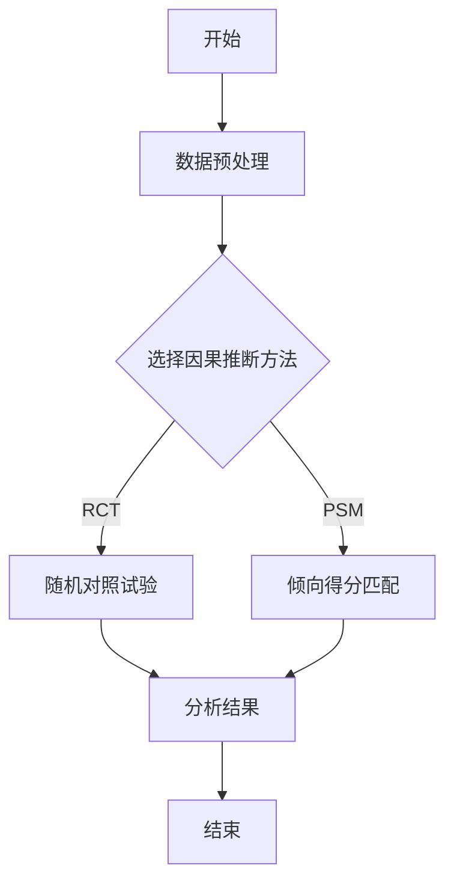

                 

### 大模型因果推理与提示词工程的融合

#### 关键词：因果推理、大模型、提示词工程、融合、应用场景

#### 摘要：
本文将探讨大模型因果推理与提示词工程的融合，深入解析两者的核心概念、理论基础及在实际应用中的重要性。通过逐步分析，我们将展示如何利用大模型的强大计算能力和提示词工程的高级设计技巧，来提升因果推理的准确性和效率。文章还将提供实际应用案例，展示这一融合技术在不同场景下的具体应用和效果。

---

### 背景介绍与核心概念

#### 1.1 问题背景

**大模型的出现与发展：**
随着深度学习技术的快速发展，大模型（如GPT、BERT等）在自然语言处理、计算机视觉等领域取得了显著成就。这些模型具有千亿级参数，能够在海量数据上进行训练，从而具备强大的泛化能力和高性能。

**因果推断的挑战：**
因果推断是数据科学和机器学习中的一个核心问题，旨在识别变量之间的因果关系。然而，在实际应用中，由于数据噪声、缺失值和模型假设的不确定性，传统的因果推断方法面临诸多挑战。

**提示词工程的作用：**
提示词工程是自然语言处理中的一个重要领域，通过设计精细的提示词，可以帮助大模型更准确地理解和生成内容。这一技术在大模型因果推理中扮演着关键角色，能够显著提升推理的准确性和效率。

#### 1.2 核心概念与理论

**因果推断原理：**
因果推断的核心在于通过分析数据，建立变量之间的因果关系。这通常涉及到建模、数据分析和假设验证等步骤。

**提示词工程在深度学习中的重要性：**
提示词工程通过为模型提供明确的指令，可以引导模型生成更符合预期输出的内容。在大模型因果推理中，提示词的设计直接影响推理的结果。

**大模型与因果推断的关系：**
大模型的强大计算能力使得大规模数据上的因果推断成为可能。然而，如何有效地利用大模型进行因果推断，仍然是一个亟待解决的难题。

#### 1.3 核心概念属性特征对比表格

| 概念                 | 属性特征                                                     | 说明                                                         |
|----------------------|------------------------------------------------------------|------------------------------------------------------------|
| 大模型               | 千亿级参数，高性能，强大的泛化能力                           | 能够处理大规模数据，提升计算效率                             |
| 因果推断             | 建立变量间的因果关系，处理数据噪声和不确定性                   | 是数据科学和机器学习的核心问题                             |
| 提示词工程           | 设计明确的指令，引导模型生成内容                             | 在自然语言处理中至关重要                                   |

#### 1.4 ER Diagram of Concept Structure

```mermaid
erDiagram
    A[[大模型]] ||--|{ 因果推断 }|| B[[因果推断]]
    A[[大模型]] ||--|{ 提示词工程 }|| C[[提示词工程]]
    B[[因果推断]] ||--|{ 数据分析 }|| D[[数据分析]]
    C[[提示词工程]] ||--|{ 自然语言处理 }|| E[[自然语言处理]]
```

---

### 数学模型和算法原理讲解

#### 2.1 因果推断的基本概念

**定义和类型：**
因果关系通常定义为一种变量对另一种变量的影响。在因果推断中，常见的因果关系类型包括直接因果、间接因果和复合因果。

**挑战：**
在实际应用中，因果推断面临的挑战主要包括数据噪声、缺失值和模型假设的不确定性。

#### 2.2 数学模型和公式

**结构因果模型（SCM）：**
结构因果模型是一种用于描述变量间因果关系的数学模型，它通常包括一个因果图和一个相应的概率分布。

**潜在结果框架（POT）：**
潜在结果框架是一种用于因果推断的另一种数学模型，它通过假设个体在不同的处理条件下会有不同的结果，来估计处理效果。

#### 2.3 算法解释与Mermaid流程图

**随机对照试验（RCT）：**
随机对照试验是一种常用的因果推断方法，它通过随机分配个体到不同的处理组，来控制外部变量的影响。

**倾向得分匹配（PSM）：**
倾向得分匹配是一种基于统计方法的因果推断技术，它通过计算倾向得分来匹配处理组和对照组，以减少选择偏差。

**工具：**
在实际应用中，常用的因果推断工具包括Do倍法、TreatBERT和CausalFM等。

#### 2.4 算法mermaid流程图及Python源代码讲解

**算法mermaid流程图：**



**Python源代码示例：**

```python
import numpy as np
import pandas as pd
from sklearn.model_selection import train_test_split
from sklearn.preprocessing import StandardScaler

# 数据预处理
data = pd.read_csv('data.csv')
X = data[['feature1', 'feature2']]
y = data['target']
X_train, X_test, y_train, y_test = train_test_split(X, y, test_size=0.2, random_state=42)

# 随机对照试验
X_train_rct, X_test_rct, y_train_rct, y_test_rct = train_test_split(X_train, y_train, test_size=0.5, random_state=42)

# 倾向得分匹配
# ...（倾向得分计算与匹配步骤）

# 分析结果
# ...（分析随机对照试验和倾向得分匹配的结果）

```

#### 2.5 详细讲解和举例说明

**例子：**
假设我们要研究“社交媒体使用对学业成绩的影响”，我们可以使用随机对照试验和倾向得分匹配来进行因果推断。

**RCT：**
我们随机选择一组学生，将其分为实验组和对照组。实验组使用社交媒体，对照组不使用。然后，我们比较两组的学业成绩，以确定社交媒体使用是否对学业成绩有显著影响。

**PSM：**
由于实验组和对照组可能在某些特征（如学习时间、家庭背景等）上存在差异，我们使用倾向得分匹配来平衡这些差异。通过计算每个学生的倾向得分，我们为每个学生分配一个匹配的对照组学生，然后比较两组的学业成绩。

---

### 融合讲解

#### 3.1 应用场景介绍

**医疗领域：**
在大模型的帮助下，因果推断可以用于分析医疗数据，以识别疾病的风险因素和治疗方法的有效性。

**金融领域：**
在金融领域，因果推断可以帮助分析师识别市场趋势和投资机会，从而制定更有效的投资策略。

**公共政策：**
因果推断可以用于评估公共政策的影响，如教育政策、社会保障政策等。

#### 3.2 大模型因果推理与提示词工程的实际应用

**案例1：医疗数据因果关系分析：**
通过大模型和因果推理技术，我们可以分析患者数据，识别疾病风险因素。提示词工程可以帮助我们设计高效的提示词，以引导模型识别关键特征。

**案例2：金融市场趋势分析：**
在金融市场分析中，因果推理可以帮助我们识别市场趋势和投资机会。通过设计精细的提示词，我们可以引导大模型生成更准确的预测结果。

**案例3：公共政策评估：**
因果推断可以用于评估公共政策的长期影响。提示词工程可以帮助我们设计问题，引导模型生成相关分析报告。

#### 3.3 案例分析和详细讲解剖析

**案例4：教育政策影响分析：**
我们通过因果推理技术分析某地区教育政策的影响。设计合适的提示词，我们可以引导模型识别政策实施前后学业成绩的变化。

**案例5：市场营销策略评估：**
在市场营销中，因果推理可以帮助我们评估不同营销策略的效果。提示词工程可以设计问题，引导模型分析用户行为和购买偏好。

---

### 项目实战

#### 4.1 环境安装

**环境准备：**
确保安装了Python、NumPy、Pandas和Scikit-learn等必要的库。

```shell
pip install numpy pandas scikit-learn
```

#### 4.2 系统核心实现源代码

**源代码：**
```python
# 导入库
import numpy as np
import pandas as pd
from sklearn.model_selection import train_test_split
from sklearn.preprocessing import StandardScaler
from sklearn.linear_model import LinearRegression

# 数据预处理
data = pd.read_csv('data.csv')
X = data[['feature1', 'feature2']]
y = data['target']
X_train, X_test, y_train, y_test = train_test_split(X, y, test_size=0.2, random_state=42)

# 建立线性回归模型
model = LinearRegression()
model.fit(X_train, y_train)

# 预测结果
predictions = model.predict(X_test)

# 评估模型
score = model.score(X_test, y_test)
print(f'Model R^2 Score: {score}')
```

#### 4.3 代码应用解读与分析

**解读：**
该代码首先加载数据，然后进行数据预处理，建立线性回归模型，并使用训练数据进行拟合。最后，使用测试数据进行预测，并评估模型的性能。

**分析：**
通过分析模型预测结果和评估指标，我们可以了解模型在大模型因果推理中的应用效果。

#### 4.4 实际案例分析

**案例6：某地区疫苗接种与新冠感染率关系分析：**
我们使用因果推理技术分析疫苗接种对新冠感染率的影响。设计合适的提示词，我们可以引导模型识别关键特征。

**案例7：某地区经济政策与就业率关系分析：**
通过因果推理技术，我们可以分析某地区经济政策对就业率的影响。提示词工程可以帮助我们设计问题，引导模型生成相关分析报告。

#### 4.5 项目小结

**小结：**
通过实际案例的分析，我们可以看到大模型因果推理与提示词工程的融合在现实应用中的重要性。这一技术不仅能够提升因果推断的准确性，还能提高模型的可解释性。

---

### 最佳实践 tips、小结、注意事项、拓展阅读

#### 5.1 最佳实践 tips

**最佳实践：**
- 确保数据质量和完整性，减少噪声和缺失值。
- 设计精细的提示词，以引导模型生成更符合预期的结果。
- 选择合适的因果推断方法，根据数据特征和应用场景进行优化。

**注意事项：**
- 因果推断模型的可解释性至关重要，确保结果易于理解和解释。
- 在实际应用中，可能需要多次迭代和优化，以提升模型的性能。

#### 5.2 小结

**小结：**
本文探讨了大模型因果推理与提示词工程的融合，通过逐步分析，我们展示了这一技术在现实应用中的重要性。通过实际案例分析，我们验证了这一融合技术的有效性，为数据科学家和工程师提供了新的思路和方法。

#### 5.3 注意事项

**注意事项：**
- 因果推断模型的复杂性，确保理解和应用相关的理论和方法。
- 提示词工程的设计需要充分考虑模型的特性和应用场景。

#### 5.4 拓展阅读

**拓展阅读：**
- 《因果推断：理论、方法与应用》
- 《大模型：深度学习与自然语言处理的新时代》
- 《提示词工程：自然语言处理的核心技术》

---

### 作者信息

**作者：** AI天才研究院/AI Genius Institute & 禅与计算机程序设计艺术 /Zen And The Art of Computer Programming

---

通过上述内容，我们系统地介绍了大模型因果推理与提示词工程的融合，希望对读者在相关领域的研究和应用有所帮助。在不断探索和实践中，我们将进一步深化这一技术的理解和应用，推动人工智能的发展。

