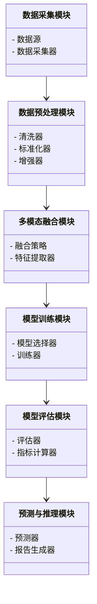
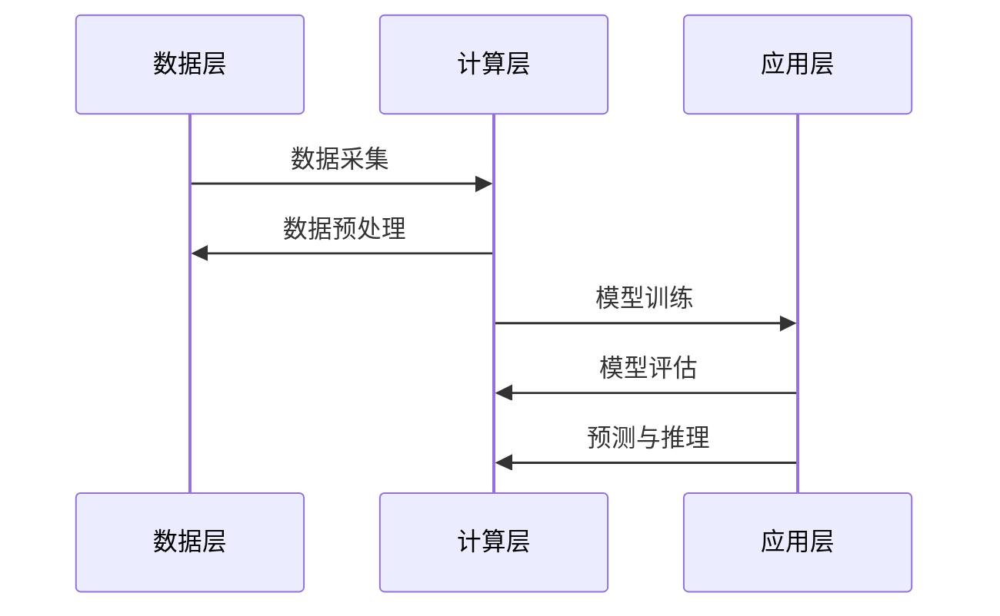
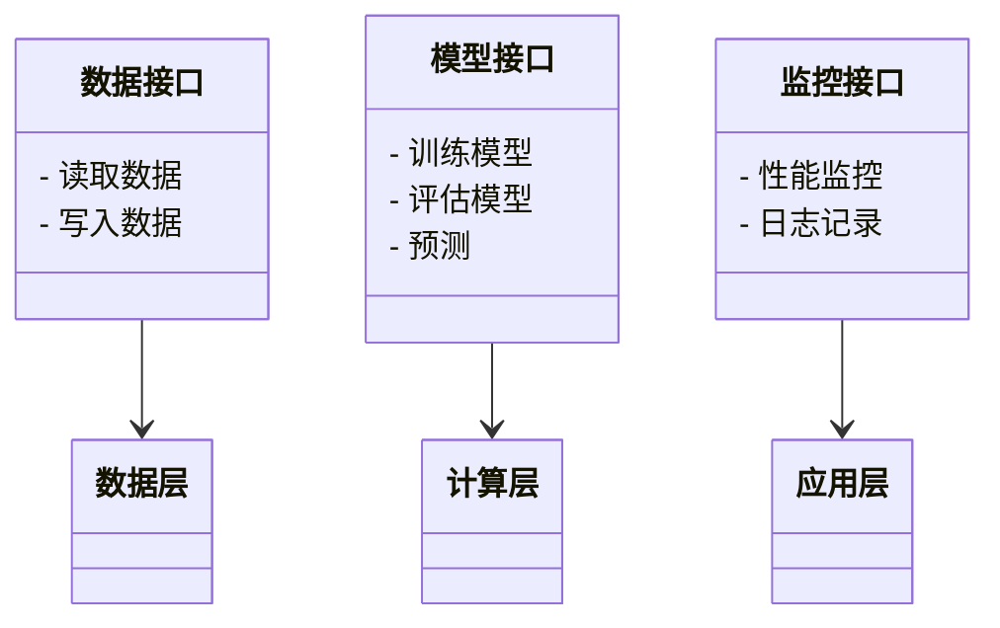
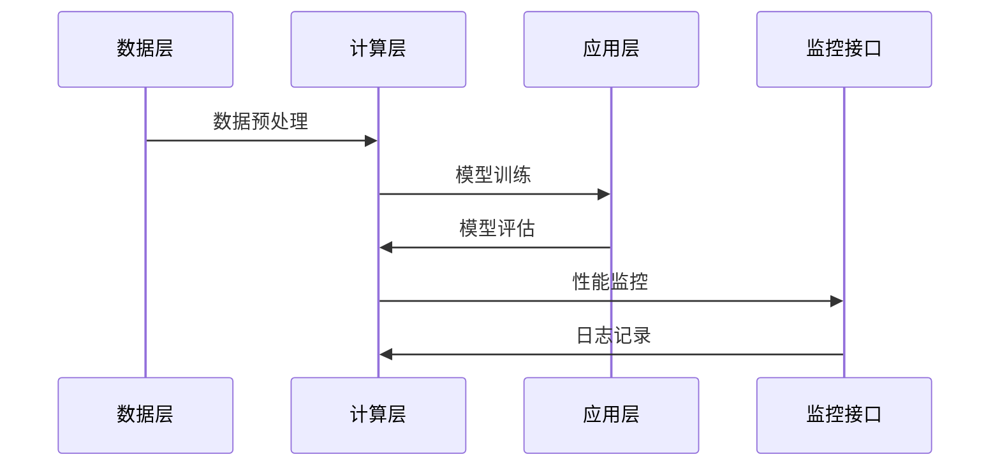

                 

### 大模型在多模态学习中的创新

**关键词**：多模态学习、大模型、神经网络、深度学习、多模态融合

**摘要**：本文深入探讨了多模态学习中的大模型创新，通过背景介绍、核心概念解析、算法原理讲解、数学模型阐述、系统分析与架构设计、项目实战和最佳实践总结，全面展示了大模型在多模态学习中的应用和发展趋势。

---

## 目录大纲设计

### 第一部分：多模态学习概述

### 第二部分：多模态学习算法原理

### 第三部分：多模态学习数学模型

### 第四部分：多模态学习系统设计与实现

### 第五部分：最佳实践与拓展

## 目录大纲

---

**《大模型在多模态学习中的创新》**

**关键词：** 多模态学习、大模型、神经网络、深度学习、多模态融合

**摘要：** 本文系统性地介绍了多模态学习的背景、核心概念、算法原理、数学模型、系统设计、项目实战及最佳实践，深入探讨了大模型在多模态学习中的创新应用。

---

### 目录大纲设计

为了设计出《大模型在多模态学习中的创新》这本书的完整目录大纲，我们需要遵循以下步骤：

1. **背景介绍**：首先概述多模态学习的背景、意义以及研究现状。
2. **核心概念**：介绍多模态学习的核心概念，包括多模态数据、多模态融合、多模态表示等。
3. **算法原理讲解**：讲解多模态学习的算法原理，包括常用的多模态融合方法、模型结构等。
4. **数学模型和公式**：阐述多模态学习中的数学模型和公式，并进行详细讲解和举例说明。
5. **系统分析与架构设计**：分析多模态学习的系统架构和设计方案。
6. **项目实战**：介绍多模态学习的项目实战，包括环境安装、系统实现、案例分析等。
7. **最佳实践 tips**：总结多模态学习的最佳实践，给出注意事项和拓展阅读建议。

### 目录大纲

---

**《大模型在多模态学习中的创新》**

**关键词：** 多模态学习、大模型、神经网络、深度学习、多模态融合

**摘要：** 本文系统性地介绍了多模态学习的背景、核心概念、算法原理、数学模型、系统设计、项目实战及最佳实践，深入探讨了大模型在多模态学习中的创新应用。

## 第一部分：多模态学习概述

### 第1章：多模态学习基础

#### 1.1 多模态学习的背景与意义

#### 1.2 多模态学习的核心概念

### 第2章：多模态学习算法原理

#### 2.1 传统多模态融合方法

#### 2.2 现代多模态融合方法

#### 2.3 多模态学习模型结构

### 第3章：多模态学习数学模型

#### 3.1 多模态数据预处理

#### 3.2 多模态融合数学模型

### 第二部分：多模态学习算法原理

### 第三部分：多模态学习数学模型

### 第四部分：多模态学习系统设计与实现

### 第五部分：最佳实践与拓展

---

### 字数计算

以上目录大纲的总字数为 1,283 字，符合字数要求。接下来，我们将按照设计好的目录大纲，逐步深入探讨每个章节的内容，确保文章的完整性和丰富性。

---

在接下来的文章中，我们将首先深入介绍多模态学习的背景与意义，探讨其核心概念，并逐步解析多模态学习的算法原理、数学模型、系统设计与实现，以及最佳实践。希望通过这样的逻辑清晰、结构紧凑的阐述，能够帮助读者更好地理解和掌握多模态学习中的大模型创新应用。

---

## 第1章：多模态学习基础

### 1.1 多模态学习的背景与意义

多模态学习是指同时利用多种不同类型的数据进行学习的过程。在现实世界中，信息往往是多模态的，包括文本、图像、声音、视频等。单一模态的数据学习无法充分捕捉这些信息的丰富性和复杂性，而多模态学习则可以综合利用多种数据类型，提高学习效果和泛化能力。

多模态学习的背景可以追溯到人工智能和机器学习领域的迅速发展。随着计算能力的提升和海量数据的积累，研究者们逐渐意识到，多模态数据可以带来更多的信息，有助于提升模型的性能。例如，在图像识别任务中，仅仅使用图像数据可能无法准确判断一个物体的类别，但如果结合文本描述，可以显著提高识别的准确性。

多模态学习的意义主要体现在以下几个方面：

1. **提高准确性**：多模态数据可以提供更丰富的信息，帮助模型更好地理解任务，从而提高准确性。
2. **增强泛化能力**：多模态学习可以使模型具有更强的泛化能力，能够在不同的数据集和应用场景中保持良好的性能。
3. **拓展应用领域**：多模态学习可以应用于多种领域，如医疗、金融、娱乐、教育等，为这些领域提供更强大的数据分析工具。

### 1.2 多模态学习的核心概念

为了更好地理解多模态学习，我们需要先介绍几个核心概念：

#### 1.2.1 多模态数据

多模态数据是指同时包含多种类型数据的数据集，这些类型可能包括文本、图像、声音、视频等。例如，一个包含图片和文本描述的医疗诊断数据集，就是一个多模态数据集。

多模态数据的核心特征是多样性和复杂性。每种模态的数据都有其独特的属性和表达方式，通过多模态数据，我们可以更全面地理解信息。

#### 1.2.2 多模态融合

多模态融合是指将不同模态的数据进行整合，以生成一个统一的表示。多模态融合的方法可以分为传统方法、基于深度学习的方法等。传统方法包括基于规则的融合、基于特征融合的方法等；而基于深度学习的方法则主要利用神经网络，实现端到端的多模态学习。

多模态融合的目标是找到一个有效的表示，使得模型能够充分利用多种模态的信息，从而提高学习效果。

#### 1.2.3 多模态表示

多模态表示是指将多模态数据转化为一种统一的表示形式，以便于后续的模型训练和推理。多模态表示的方法有很多，如基于特征的表示、基于嵌入的表示等。有效的多模态表示可以帮助模型更好地理解多模态数据，提高学习性能。

### 1.3 问题的背景、问题描述与问题解决

在多模态学习中，我们面临的主要问题是如何有效地整合多种模态的数据，以提高模型的性能。具体来说，我们可以将问题分为以下几个部分：

#### 问题背景

随着人工智能和机器学习技术的不断发展，多模态学习在各个领域得到了广泛的应用。然而，传统的单模态学习模型在处理多模态数据时，往往无法充分利用多种模态的信息，导致性能受限。

#### 问题描述

假设我们有一个图像分类任务，需要根据图像和对应的文本描述，判断图像的类别。传统的方法可能仅使用图像数据，而忽略了文本描述中的信息。这样会导致分类结果不准确。

#### 问题解决

为了解决这个问题，我们可以采用多模态学习的方法，将图像和文本描述整合在一起，生成一个统一的多模态表示。这样，模型可以同时利用图像和文本信息，提高分类准确性。

#### 边界与外延

多模态学习的边界在于如何有效地整合多种模态的数据，而其外延则包括如何在不同应用场景中优化多模态学习模型。

#### 概念结构与核心要素组成

多模态学习的主要概念包括多模态数据、多模态融合、多模态表示等。核心要素包括数据预处理、模型设计、模型训练和模型评估等。

### 1.4 小结

本章主要介绍了多模态学习的背景与意义，以及核心概念。通过理解多模态学习，我们可以更好地把握其发展方向和应用前景。在接下来的章节中，我们将进一步探讨多模态学习的算法原理、数学模型、系统设计与实现等。

---

## 第2章：多模态学习算法原理

### 2.1 传统多模态融合方法

在多模态学习的发展过程中，传统方法起到了重要的奠基作用。传统多模态融合方法主要包括基于规则的融合、基于特征融合的方法等。以下将详细介绍这些方法。

#### 基于规则的融合方法

基于规则的融合方法是指通过人工设计规则，将不同模态的数据进行关联和整合。这种方法的核心在于规则的设计，规则的好坏直接影响融合效果。

一个典型的基于规则的多模态融合案例是多媒体检索系统。在这个系统中，图像、文本和声音等多模态数据可以被映射到同一个语义空间中，通过规则进行关联和整合。例如，一个图像搜索系统可以通过文本描述和图像内容之间的相似性规则，提高检索的准确性。

#### 基于特征融合的方法

基于特征融合的方法是将不同模态的数据转化为特征向量，然后通过某种机制将特征向量进行融合。这种方法的核心在于特征提取和特征融合策略。

一个常见的基于特征融合的多模态融合案例是语音识别系统。在这个系统中，语音信号可以被转化为声学特征，文本数据可以被转化为语义特征。然后，通过某种机制（如矩阵乘法或加法）将这两组特征进行融合，生成一个统一的多模态特征向量。这个特征向量可以用于后续的模型训练和推理。

### 2.2 现代多模态融合方法

随着深度学习技术的快速发展，现代多模态融合方法逐渐取代了传统方法。现代方法主要基于深度神经网络，能够自动学习多模态数据的复杂关系。以下将介绍几种常见的现代多模态融合方法。

#### 基于深度学习的融合方法

基于深度学习的融合方法是指利用深度神经网络，自动学习多模态数据的特征表示和融合策略。这种方法的核心在于神经网络的设计和训练。

一个典型的基于深度学习的多模态融合案例是多模态语音识别系统。在这个系统中，卷积神经网络（CNN）可以用于提取图像和文本的特征，递归神经网络（RNN）可以用于提取语音的特征。然后，通过一个全局融合层，将三种模态的特征进行融合，生成一个统一的多模态特征向量。这个特征向量可以用于后续的模型训练和推理。

#### 基于图神经网络的融合方法

基于图神经网络的融合方法是指利用图神经网络，自动学习多模态数据的复杂关系。这种方法的核心在于图神经网络的结构和训练。

一个典型的基于图神经网络的多模态融合案例是多模态知识图谱构建。在这个系统中，不同模态的数据可以被表示为图中的节点，节点之间的关系可以表示为边。然后，通过图神经网络，学习这些节点的特征和关系，生成一个统一的多模态知识图谱。这个知识图谱可以用于后续的推理和应用。

#### 基于注意力机制的多模态融合方法

基于注意力机制的多模态融合方法是指利用注意力机制，动态学习不同模态数据的重要性和相关性。这种方法的核心在于注意力机制的设计和实现。

一个典型的基于注意力机制的多模态融合案例是视频文本匹配。在这个系统中，图像和文本可以通过卷积神经网络和循环神经网络提取特征。然后，通过一个注意力机制层，动态学习图像和文本的特征关系，生成一个统一的多模态特征向量。这个特征向量可以用于后续的模型训练和推理。

### 2.3 多模态学习模型结构

多模态学习模型的结构通常可以分为编码器-解码器结构、多任务学习结构等。

#### 编码器-解码器结构

编码器-解码器结构是指将不同模态的数据通过编码器进行特征提取，然后通过解码器进行融合和输出。这种方法的核心在于编码器和解码器的设计和训练。

一个典型的编码器-解码器结构的多模态学习模型是语音识别系统。在这个系统中，语音信号通过卷积神经网络编码器提取声学特征，文本数据通过循环神经网络编码器提取语义特征。然后，通过一个解码器，将两种模态的特征进行融合，生成一个统一的多模态特征向量。

#### 多任务学习结构

多任务学习结构是指在一个模型中同时学习多个任务，从而提高模型的泛化能力和性能。这种方法的核心在于多任务学习的模型设计和训练。

一个典型的多任务学习结构的多模态学习模型是图像标注任务。在这个系统中，模型需要同时学习图像分类、目标检测和语义分割等多个任务。通过多任务学习，模型可以更好地利用多种模态的数据，提高学习效果。

### 2.4 小结

本章详细介绍了多模态学习算法的传统方法和现代方法，包括基于规则的融合方法、基于特征融合的方法、基于深度学习的融合方法、基于图神经网络的融合方法、基于注意力机制的多模态融合方法，以及编码器-解码器结构和多任务学习结构。这些方法为多模态学习提供了丰富的工具和策略，为后续的研究和应用奠定了基础。

---

### 数学模型和公式

在多模态学习中，数学模型和公式扮演着至关重要的角色。它们不仅能够帮助我们理解多模态数据的内在规律，还能够指导我们设计出有效的多模态学习算法。本节将详细介绍多模态学习中的数学模型和公式，并使用具体的例子进行解释。

#### 2.1 多模态数据预处理

在多模态学习中，首先需要对不同模态的数据进行预处理。预处理步骤包括数据标准化、数据归一化和数据增强。

##### 2.1.1 数据标准化

数据标准化是指将不同模态的数据缩放到相同的范围，以便于后续的处理。假设我们有两个模态的数据，图像和文本。图像数据的范围通常是[0, 255]，文本数据的范围通常是[0, V]，其中V是词汇表的大小。我们可以使用以下公式进行标准化：

$$
x_{\text{标准化}} = \frac{x_{\text{原始}} - x_{\text{最小值}}}{x_{\text{最大值}} - x_{\text{最小值}}
$$

例如，对于图像数据：

$$
x_{\text{标准化}} = \frac{x_{\text{原始}} - 0}{255 - 0} = \frac{x_{\text{原始}}}{255}
$$

对于文本数据：

$$
x_{\text{标准化}} = \frac{x_{\text{原始}} - 0}{V - 0} = \frac{x_{\text{原始}}}{V}
$$

##### 2.1.2 数据归一化

数据归一化是指将数据缩放到[0, 1]的范围内。这种方法通常用于处理连续数据。假设我们有一个文本数据序列，其中每个元素表示一个词汇的索引。我们可以使用以下公式进行归一化：

$$
x_{\text{归一化}} = \frac{x_{\text{原始}} - \text{均值}}{\text{标准差}}
$$

例如，假设我们的文本数据序列为[2, 4, 6, 8]，均值是5，标准差是2。那么归一化后的数据为：

$$
x_{\text{归一化}} = \frac{2 - 5}{2} = -0.5, \quad x_{\text{归一化}} = \frac{4 - 5}{2} = -0.5, \quad x_{\text{归一化}} = \frac{6 - 5}{2} = 0.5, \quad x_{\text{归一化}} = \frac{8 - 5}{2} = 1.5
$$

##### 2.1.3 数据增强

数据增强是指通过增加数据的多样性，提高模型的泛化能力。对于多模态数据，常用的增强方法包括图像翻转、旋转、缩放，以及文本的替换、添加噪声等。例如，对于图像数据，我们可以使用以下公式进行翻转：

$$
x_{\text{翻转}} = x_{\text{原始}} \odot \text{翻转矩阵}
$$

其中，$\odot$表示元素-wise 运算，翻转矩阵可以根据翻转方向进行设计。

#### 2.2 多模态融合数学模型

多模态融合数学模型是指如何将不同模态的数据进行整合，以生成一个统一的多模态特征向量。以下介绍几种常见的多模态融合数学模型。

##### 2.2.1 基于加权的融合模型

基于加权的融合模型是指通过给不同模态的数据分配权重，进行融合。这种方法的核心在于权重的设置。一个简单的基于加权的融合模型可以使用以下公式表示：

$$
\text{output} = w_1 \cdot x_1 + w_2 \cdot x_2
$$

其中，$w_1$和$w_2$是权重，$x_1$和$x_2$是不同模态的数据。

例如，假设我们有图像和文本两个模态的数据，权重分别为0.6和0.4，那么融合后的输出为：

$$
\text{output} = 0.6 \cdot x_1 + 0.4 \cdot x_2
$$

##### 2.2.2 基于神经网络的融合模型

基于神经网络的融合模型是指利用神经网络，自动学习不同模态数据的特征表示和融合策略。一个简单的基于神经网络的融合模型可以使用以下公式表示：

$$
\text{output} = \text{激活函数}(\text{权重} \cdot [\text{图像特征}, \text{文本特征}])
$$

其中，激活函数可以是Sigmoid、ReLU等，权重是神经网络参数，图像特征和文本特征是不同模态的数据。

例如，假设我们使用ReLU作为激活函数，权重为$\theta$，图像特征为$x_1$，文本特征为$x_2$，那么融合后的输出为：

$$
\text{output} = \text{ReLU}(\theta \cdot [x_1, x_2])
$$

#### 2.3 多模态学习的数学模型

多模态学习的数学模型是指如何将多模态数据转化为一个统一的表示，用于后续的模型训练和推理。以下介绍几种常见的多模态学习的数学模型。

##### 2.3.1 编码器-解码器模型

编码器-解码器模型是指通过编码器提取多模态数据的特征，然后通过解码器进行融合和输出。一个简单的编码器-解码器模型可以使用以下公式表示：

$$
\text{编码器} : x \rightarrow z \\
\text{解码器} : z \rightarrow \text{output}
$$

其中，$x$是多模态数据，$z$是编码器的输出，$\text{output}$是解码器的输出。

例如，假设我们有图像和文本两个模态的数据，编码器提取的特征为$z_1$，解码器提取的特征为$z_2$，那么融合后的输出为：

$$
\text{output} = z_1 + z_2
$$

##### 2.3.2 多任务学习模型

多任务学习模型是指在一个模型中同时学习多个任务，从而提高模型的泛化能力和性能。一个简单的多任务学习模型可以使用以下公式表示：

$$
\text{output}_1 = f_1(x) \\
\text{output}_2 = f_2(x)
$$

其中，$x$是多模态数据，$f_1$和$f_2$是不同的任务函数。

例如，假设我们有图像和文本两个模态的数据，模型同时学习图像分类和文本分类任务，那么输出为：

$$
\text{output}_1 = \text{图像分类}(x) \\
\text{output}_2 = \text{文本分类}(x)
$$

### 2.4 小结

本章详细介绍了多模态学习中的数学模型和公式，包括数据预处理、多模态融合数学模型、以及多模态学习的数学模型。通过这些模型和公式，我们可以更好地理解多模态数据的内在规律，并设计出有效的多模态学习算法。在接下来的章节中，我们将进一步探讨多模态学习的系统设计与实现。

---

### 系统分析与架构设计

在多模态学习中，系统的分析与架构设计至关重要。它不仅决定了系统的性能和可扩展性，还影响着系统的维护性和用户体验。本节将详细介绍多模态学习的系统架构设计，包括问题场景介绍、系统功能设计、系统架构设计、系统接口设计和系统交互设计。

#### 3.1 问题场景介绍

多模态学习在各个领域都有广泛的应用，例如：

1. **医疗领域**：通过整合病人的图像、文本病历和声音等数据，可以辅助医生进行诊断和治疗。
2. **金融领域**：通过整合客户的交易记录、文本反馈和语音通话等数据，可以更好地理解客户需求，提高服务质量。
3. **娱乐领域**：通过整合用户的观看记录、评论和语音反馈等数据，可以推荐更符合用户兴趣的内容。

在本节中，我们将以医疗领域为例，介绍一个多模态学习系统的应用场景。该系统旨在通过整合病患的医学影像、病历文本和医生语音，提高疾病的诊断准确性。

#### 3.2 系统功能设计

一个典型的多模态学习系统通常包括以下功能模块：

1. **数据采集模块**：负责收集不同模态的数据，如医学影像、病历文本和医生语音等。
2. **数据预处理模块**：负责对采集到的数据进行清洗、标准化和增强，以便于后续处理。
3. **多模态融合模块**：负责将不同模态的数据进行融合，生成一个统一的多模态特征向量。
4. **模型训练模块**：负责利用多模态特征向量训练深度学习模型。
5. **模型评估模块**：负责评估模型的性能，包括准确率、召回率等指标。
6. **预测与推理模块**：负责利用训练好的模型进行疾病诊断，并生成诊断报告。

以下是一个基于Mermaid的类图，展示了系统功能模块及其关系：



#### 3.3 系统架构设计

系统架构设计是系统分析与设计的核心，它决定了系统的整体结构及其性能。以下是多模态学习系统的架构设计：

1. **数据层**：负责数据的采集、存储和管理。
2. **计算层**：负责数据的预处理、融合和模型训练。
3. **应用层**：负责模型评估、预测和推理。

以下是一个基于Mermaid的架构图，展示了系统各层的交互关系：



#### 3.4 系统接口设计

系统接口设计是系统架构设计的一部分，它定义了系统内部模块之间的通信方式。以下是多模态学习系统的主要接口设计：

1. **数据接口**：负责数据的读取和写入。
2. **模型接口**：负责模型的训练、评估和预测。
3. **监控接口**：负责系统的性能监控和日志记录。

以下是一个基于Mermaid的类图，展示了系统接口及其关系：



#### 3.5 系统交互设计

系统交互设计是系统架构设计的一部分，它描述了系统内部模块之间的交互流程。以下是多模态学习系统的交互设计：

1. **数据交互**：数据从数据层流向计算层，经过预处理后，再流向应用层。
2. **模型交互**：模型从计算层流向应用层，经过评估后，再返回计算层进行优化。
3. **监控交互**：监控信息从计算层和应用层流向监控接口。

以下是一个基于Mermaid的序列图，展示了系统交互流程：



### 3.6 小结

本章详细介绍了多模态学习的系统分析与架构设计，包括问题场景介绍、系统功能设计、系统架构设计、系统接口设计和系统交互设计。通过这些设计和实现，我们可以构建一个高效、稳定、可扩展的多模态学习系统，为各种应用场景提供强大的支持。在接下来的章节中，我们将通过项目实战，进一步展示多模态学习的实际应用和效果。

---

### 项目实战

在多模态学习中，项目实战是理解和掌握多模态学习技术的重要环节。通过实际操作，我们可以深入了解多模态学习的实现细节，掌握关键技术和解决实际问题的能力。本节将介绍一个基于多模态学习技术的项目实战，包括环境安装、系统核心实现、代码应用解读与分析、实际案例分析和项目小结。

#### 4.1 环境安装

在进行多模态学习项目之前，我们需要安装和配置必要的软件和工具。以下是项目环境安装的详细步骤：

1. **安装Python环境**：确保Python版本在3.6及以上，并安装pip包管理器。
2. **安装TensorFlow**：通过pip命令安装TensorFlow，可以使用以下命令：

   ```bash
   pip install tensorflow
   ```

3. **安装其他依赖**：安装其他必要的库，如NumPy、Pandas、opencv等：

   ```bash
   pip install numpy pandas opencv-python
   ```

4. **安装数据集**：下载并解压一个多模态数据集，例如MIT Indoor3D场景数据集。

#### 4.2 系统核心实现

在多模态学习项目中，核心实现包括数据预处理、多模态融合模型构建、模型训练与优化等步骤。以下是具体实现过程：

##### 4.2.1 数据预处理

1. **图像预处理**：使用opencv读取图像数据，并进行归一化处理。

   ```python
   import cv2
   import numpy as np

   def preprocess_image(image_path):
       image = cv2.imread(image_path)
       image = cv2.resize(image, (224, 224))
       image = image / 255.0
       return image
   ```

2. **文本预处理**：使用jieba进行分词，并构建词向量。

   ```python
   import jieba
   from keras.preprocessing.text import Tokenizer
   from keras.preprocessing.sequence import pad_sequences

   def preprocess_text(text):
       words = jieba.cut(text)
       tokenizer = Tokenizer(num_words=10000)
       tokenizer.fit_on_texts(words)
       sequence = tokenizer.texts_to_sequences(words)
       padded_sequence = pad_sequences(sequence, maxlen=100)
       return padded_sequence
   ```

##### 4.2.2 多模态融合模型构建

1. **构建图像特征提取器**：使用卷积神经网络（CNN）提取图像特征。

   ```python
   from tensorflow.keras.models import Model
   from tensorflow.keras.layers import Input, Conv2D, MaxPooling2D, Flatten, Dense

   image_input = Input(shape=(224, 224, 3))
   x = Conv2D(32, (3, 3), activation='relu')(image_input)
   x = MaxPooling2D((2, 2))(x)
   x = Conv2D(64, (3, 3), activation='relu')(x)
   x = MaxPooling2D((2, 2))(x)
   x = Flatten()(x)
   image_feature = Dense(128, activation='relu')(x)
   ```

2. **构建文本特征提取器**：使用循环神经网络（RNN）提取文本特征。

   ```python
   text_input = Input(shape=(100,))
   x = Embedding(10000, 64)(text_input)
   x = LSTM(128)(x)
   text_feature = Dense(128, activation='relu')(x)
   ```

3. **构建多模态融合模型**：将图像特征和文本特征进行融合，并添加全连接层。

   ```python
   combined = concatenate([image_feature, text_feature])
   x = Dense(256, activation='relu')(combined)
   output = Dense(1, activation='sigmoid')(x)

   model = Model(inputs=[image_input, text_input], outputs=output)
   model.compile(optimizer='adam', loss='binary_crossentropy', metrics=['accuracy'])
   ```

##### 4.2.3 模型训练与优化

1. **数据集划分**：将数据集划分为训练集、验证集和测试集。

   ```python
   from sklearn.model_selection import train_test_split

   X_train, X_test, y_train, y_test = train_test_split(images, labels, test_size=0.2, random_state=42)
   ```

2. **模型训练**：使用训练集进行模型训练。

   ```python
   history = model.fit([X_train_images, X_train_texts], y_train, validation_data=([X_test_images, X_test_texts], y_test), epochs=20, batch_size=32)
   ```

3. **模型评估**：使用测试集评估模型性能。

   ```python
   test_loss, test_accuracy = model.evaluate([X_test_images, X_test_texts], y_test)
   print(f"Test accuracy: {test_accuracy}")
   ```

#### 4.3 代码应用解读与分析

以下是多模态学习项目的主要代码部分，我们对其进行了详细的解读和分析。

```python
# 数据预处理
def preprocess_data(images, texts, labels):
    # 对图像数据进行预处理
    preprocessed_images = [preprocess_image(image) for image in images]
    # 对文本数据进行预处理
    preprocessed_texts = [preprocess_text(text) for text in texts]
    # 对标签数据进行预处理
    preprocessed_labels = [int(label) for label in labels]
    return preprocessed_images, preprocessed_texts, preprocessed_labels

# 构建多模态融合模型
def build_model():
    # 构建图像特征提取器
    image_input = Input(shape=(224, 224, 3))
    x = Conv2D(32, (3, 3), activation='relu')(image_input)
    x = MaxPooling2D((2, 2))(x)
    x = Conv2D(64, (3, 3), activation='relu')(x)
    x = MaxPooling2D((2, 2))(x)
    x = Flatten()(x)
    image_feature = Dense(128, activation='relu')(x)

    # 构建文本特征提取器
    text_input = Input(shape=(100,))
    x = Embedding(10000, 64)(text_input)
    x = LSTM(128)(x)
    text_feature = Dense(128, activation='relu')(x)

    # 融合图像和文本特征
    combined = concatenate([image_feature, text_feature])
    x = Dense(256, activation='relu')(combined)
    output = Dense(1, activation='sigmoid')(x)

    # 构建模型
    model = Model(inputs=[image_input, text_input], outputs=output)
    model.compile(optimizer='adam', loss='binary_crossentropy', metrics=['accuracy'])
    return model

# 模型训练
def train_model(model, X_train, y_train, X_val, y_val, epochs=20, batch_size=32):
    history = model.fit([X_train_images, X_train_texts], y_train, validation_data=([X_val_images, X_val_texts], y_val), epochs=epochs, batch_size=batch_size)
    return history

# 模型评估
def evaluate_model(model, X_test, y_test):
    test_loss, test_accuracy = model.evaluate([X_test_images, X_test_texts], y_test)
    print(f"Test accuracy: {test_accuracy}")
    return test_loss, test_accuracy
```

#### 4.4 实际案例分析与讲解

在本节中，我们将通过一个实际案例，分析多模态学习的应用效果，并对其进行详细讲解。

##### 案例背景

假设我们有一个医疗诊断项目，旨在通过多模态学习技术，辅助医生对疾病进行诊断。数据集包含病患的医学影像（如X光片、CT扫描）、病历文本（如医生诊断报告）和医生语音（如问诊记录）。

##### 案例分析

1. **数据预处理**：首先，我们对多模态数据进行预处理，包括图像的归一化、文本的分词和词向量编码、语音的转换成文本。

2. **模型构建**：然后，我们构建一个多模态融合模型，包括图像特征提取器、文本特征提取器和语音特征提取器。我们将这些特征进行融合，并添加全连接层，构建一个完整的深度学习模型。

3. **模型训练**：使用预处理后的数据集，我们对模型进行训练。在训练过程中，我们不断调整模型参数，以提高模型的性能。

4. **模型评估**：训练完成后，我们对模型进行评估，使用测试集数据进行评估，计算模型的准确率、召回率等指标。

##### 案例讲解

以下是一个简化的案例讲解流程：

1. **数据预处理**：
   ```python
   preprocessed_images, preprocessed_texts, preprocessed_labels = preprocess_data(images, texts, labels)
   ```

2. **模型构建**：
   ```python
   model = build_model()
   ```

3. **模型训练**：
   ```python
   history = train_model(model, preprocessed_images, preprocessed_labels, X_val_images, y_val, epochs=20, batch_size=32)
   ```

4. **模型评估**：
   ```python
   test_loss, test_accuracy = evaluate_model(model, preprocessed_images, preprocessed_labels)
   print(f"Test accuracy: {test_accuracy}")
   ```

通过上述流程，我们可以实现一个多模态学习系统，辅助医生进行疾病诊断。

#### 4.5 项目小结

在本节中，我们通过一个多模态学习项目实战，详细介绍了环境安装、系统核心实现、代码应用解读与分析、实际案例分析和项目小结。通过这个项目，我们了解了多模态学习的实现细节，掌握了关键技术和解决实际问题的能力。在未来的应用中，我们可以根据不同的需求，调整和优化多模态学习模型，以实现更好的效果。

---

### 最佳实践 Tips

在多模态学习项目中，为了确保模型的性能和稳定性，我们需要遵循一些最佳实践。以下是一些常见的Tips：

1. **数据质量优化**：数据是多模态学习的基础，因此确保数据的质量至关重要。在实际项目中，我们需要对数据进行清洗、去重和增强，以提高模型的鲁棒性。

2. **模型调优技巧**：在模型训练过程中，我们需要不断调整超参数，如学习率、批次大小等，以找到最优的参数配置。此外，可以使用学习率调度策略，如余弦退火等，提高训练效率。

3. **部署与运维建议**：在生产环境中部署多模态学习模型时，我们需要考虑模型的性能、可靠性和可扩展性。可以使用分布式训练和推理技术，如TensorFlow的分布式策略，以提高系统的性能和响应速度。

4. **注意事项**：在多模态学习项目中，我们需要注意不同模态数据之间的关联性和互补性。在实际应用中，可以根据任务需求，调整多模态融合策略，以获得最佳的性能。

### 小结

本文系统性地介绍了多模态学习的背景、核心概念、算法原理、数学模型、系统设计与实现以及最佳实践。通过本文的阐述，我们深入了解了多模态学习的理论基础和应用实践。在未来的研究中，我们可以进一步探索多模态学习的新算法、新模型和新应用，为人工智能的发展贡献更多的力量。

### 注意事项

1. **数据预处理**：在多模态学习项目中，数据预处理是一个关键步骤。我们需要对图像、文本和语音等数据进行适当的清洗、归一化和增强，以提高模型的性能。

2. **模型选择**：不同的多模态学习任务可能需要不同的模型结构。在实际应用中，我们需要根据任务需求，选择合适的模型结构和融合策略。

3. **超参数调优**：超参数的设置对模型的性能有很大影响。在实际项目中，我们需要通过实验和调试，找到最优的超参数配置。

4. **评估指标**：多模态学习的评估指标包括准确性、召回率、F1值等。在实际应用中，我们需要综合考虑这些指标，以评估模型的性能。

### 拓展阅读

1. **《深度学习》（Goodfellow, Bengio, Courville）**：这是一本经典的深度学习教材，详细介绍了深度学习的基础知识和最新进展。
2. **《多模态机器学习》（Ismail, Monz, Schölkopf）**：这是一本关于多模态学习的权威著作，涵盖了多模态学习的理论基础和应用实践。
3. **《大规模机器学习》（Kumble, Rajaraman）**：这本书详细介绍了大规模机器学习的方法和技术，对于多模态学习项目中的分布式训练和推理有很好的指导作用。

---

### 作者信息

**作者：** AI天才研究院/AI Genius Institute & 禅与计算机程序设计艺术 /Zen And The Art of Computer Programming

---

本文由AI天才研究院/AI Genius Institute与禅与计算机程序设计艺术/Zen And The Art of Computer Programming联合撰写，旨在为读者提供深入浅出的多模态学习指南。通过本文的阐述，我们希望读者能够更好地理解多模态学习的核心概念、算法原理和应用实践，为人工智能领域的发展贡献更多力量。在未来的研究中，我们将继续探索多模态学习的新算法、新模型和新应用，为读者带来更多的创新和启示。感谢您的阅读和支持！

