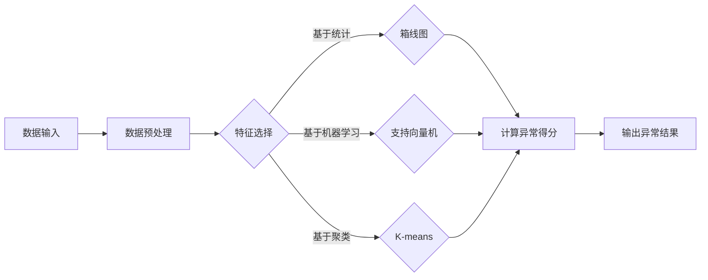
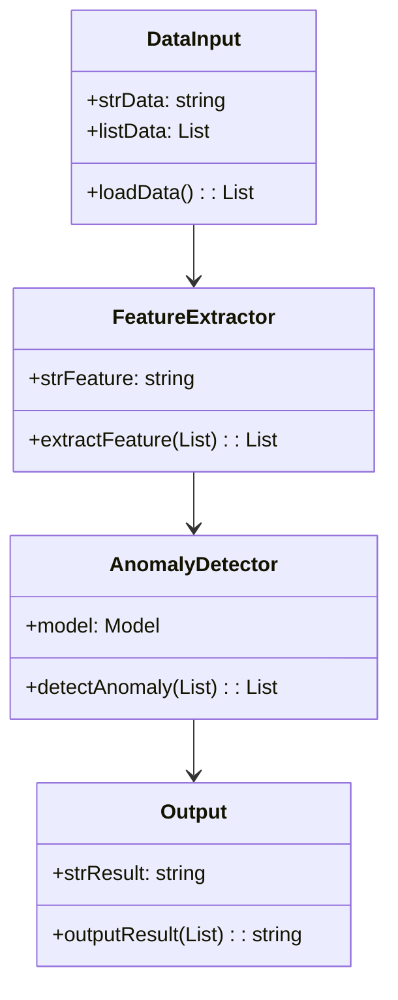
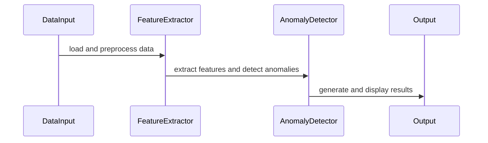
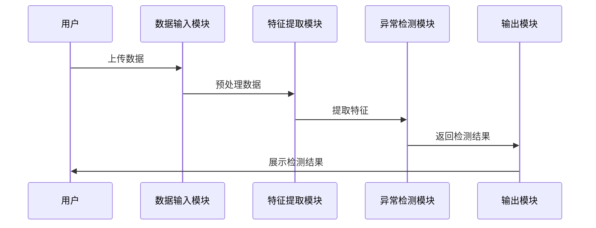

                 

### 背景介绍

#### 异常检测概述

**1.1.1 异常检测的重要性**

异常检测（Anomaly Detection）作为一种重要的数据分析技术，旨在从大量数据中识别出异常或罕见的事件。它不仅在数据科学领域占据重要地位，还在许多实际应用中发挥着关键作用。异常检测的主要目标是通过分析数据中的模式和规律，找出那些不符合预期或偏离正常行为的数据点。

**1.1.2 异常检测的分类**

异常检测可以根据检测方法的不同分为以下几类：

- **基于统计的异常检测**：这类方法通过建立正常数据的统计模型，然后比较新数据与模型之间的差异，识别出异常。常见的方法包括箱线图、3-sigma原则等。

- **基于规则的异常检测**：该方法通过预定义的规则来检测异常。规则可以是简单的阈值比较，也可以是复杂的逻辑运算。

- **基于机器学习的异常检测**：机器学习方法，如支持向量机（SVM）、决策树、随机森林等，通过学习正常数据的特征，建立模型，然后对新数据进行预测和异常检测。

- **基于聚类分析的异常检测**：聚类方法如K-means、DBSCAN等，通过将数据分为不同的簇，然后识别那些不属于任何簇的数据点作为异常。

**1.1.3 异常检测的应用领域**

异常检测在多个领域都有广泛应用，包括：

- **金融领域**：用于检测欺诈交易、信用风险等。
- **网络安全**：识别恶意行为、入侵尝试等。
- **工业制造**：监控生产线中的设备故障和异常。
- **医疗健康**：诊断疾病、监测患者健康状况等。

**1.1.4 异常检测的挑战与解决方法**

尽管异常检测技术在许多应用中表现出色，但也面临着一些挑战：

- **数据噪声和缺失**：真实世界的数据往往存在噪声和缺失值，这对异常检测提出了高要求。
- **数据量巨大**：随着数据量的增加，异常检测的效率和准确性成为关键问题。
- **模型适应性**：异常检测模型需要快速适应数据的变化，以保持其有效性。

为解决这些挑战，研究者们提出了多种方法，如：

- **数据预处理**：通过去噪、插值等方法处理数据，提高数据质量。
- **增量学习**：在数据更新时，模型能够快速适应新的数据分布。
- **多模型集成**：通过结合多种模型，提高异常检测的准确性和鲁棒性。

#### 大模型的基础概念

**2.1.1 大模型的定义与特点**

大模型（Large-scale Model）是指参数规模非常大的机器学习模型，通常拥有数十亿甚至数万亿的参数。这些模型通过在大量数据上进行训练，学习到数据中的复杂模式和规律。大模型的特点包括：

- **高参数规模**：大模型拥有极高的参数数量，这使得它们能够捕捉到数据中的细微变化。
- **强大的表示能力**：大模型通过深度网络结构，能够表示和建模复杂的数据特征。
- **计算资源需求大**：大模型训练和推断需要大量的计算资源和时间。

**2.1.2 大模型的分类与架构**

大模型可以根据不同的训练目标和任务进行分类，常见的分类包括：

- **深度神经网络（DNN）**：通过多层神经元进行特征提取和组合。
- **变换器模型（Transformer）**：以自注意力机制为核心，广泛用于自然语言处理任务。
- **生成对抗网络（GAN）**：由生成器和判别器组成，用于生成真实数据。

大模型的架构设计主要包括：

- **网络层**：定义模型的层次结构，如卷积层、全连接层等。
- **优化器**：选择合适的优化算法，如SGD、Adam等。
- **正则化**：采用Dropout、权重正则化等方法，防止过拟合。

**2.1.3 大模型的学习与优化**

大模型的学习过程主要包括以下几个步骤：

- **数据预处理**：对原始数据进行归一化、去噪等处理，提高数据质量。
- **模型初始化**：选择合适的参数初始化方法，如高斯初始化、Xavier初始化等。
- **训练过程**：通过梯度下降等优化算法，不断调整模型参数，最小化损失函数。
- **验证与测试**：在验证集和测试集上评估模型性能，调整模型参数。

大模型的优化方法包括：

- **批处理大小**：调整训练数据的批量大小，影响模型的收敛速度和效果。
- **学习率调度**：通过动态调整学习率，优化模型训练过程。
- **正则化方法**：采用L1、L2正则化，提高模型的泛化能力。

#### 异常检测中的大模型应用原理

**3.1.1 大模型在异常检测中的工作流程**

大模型在异常检测中的工作流程通常包括以下几个步骤：

1. **数据收集与预处理**：收集原始数据，并进行清洗、归一化等预处理操作，为模型训练做准备。
2. **特征提取**：利用大模型强大的特征提取能力，从原始数据中提取出有效的特征。
3. **模型训练**：使用大量正常数据训练大模型，使其学习到正常数据的特征分布。
4. **异常检测**：将新数据进行特征提取后，与模型预测的分布进行比较，识别出异常数据。

**3.1.2 大模型在异常检测中的优势**

大模型在异常检测中具有以下几个显著优势：

- **强大的特征表示能力**：大模型能够学习到数据中的深层次特征，提高异常检测的准确性。
- **高效的异常检测速度**：通过并行计算和分布式训练，大模型能够显著提高异常检测的效率。
- **适应性强**：大模型在训练过程中能够适应数据的变化，提高模型的鲁棒性。

**3.1.3 大模型在异常检测中的挑战与对策**

尽管大模型在异常检测中具有许多优势，但同时也面临着一些挑战：

- **计算资源需求大**：大模型的训练和推断需要大量的计算资源和时间，这对硬件设施提出了高要求。
- **数据隐私问题**：异常检测过程中可能需要访问敏感数据，保护用户隐私成为重要问题。
- **过拟合风险**：大模型容易过拟合，特别是在数据量不足的情况下。

为应对这些挑战，研究者们提出了以下对策：

- **数据增强**：通过增加训练数据量或生成人工数据，提高模型的泛化能力。
- **隐私保护技术**：采用差分隐私、联邦学习等技术，保护用户隐私。
- **模型正则化**：采用正则化方法，防止模型过拟合，提高模型的鲁棒性。

### 核心概念原理

#### 异常检测算法的原理

异常检测算法主要通过以下步骤实现：

1. **数据预处理**：清洗和归一化原始数据，确保数据的可用性和一致性。
2. **特征选择**：从原始数据中选择有效的特征，用于训练模型。
3. **模型训练**：使用正常数据训练异常检测模型，使其能够学习到正常数据的特征分布。
4. **异常检测**：将新数据进行特征提取后，与模型预测的分布进行比较，识别出异常数据。

常见的异常检测算法包括：

- **基于统计的方法**：如箱线图、3-sigma原则等，通过计算数据点与均值之间的差异识别异常。
- **基于机器学习的方法**：如支持向量机（SVM）、决策树、随机森林等，通过建立正常数据的模型进行异常检测。
- **基于聚类的方法**：如K-means、DBSCAN等，通过聚类分析识别异常数据。

**异常检测算法的工作流程**：

1. **数据输入**：输入原始数据集。
2. **数据预处理**：对数据进行清洗和归一化处理。
3. **特征提取**：从预处理后的数据中提取特征。
4. **模型选择与训练**：选择合适的异常检测模型，使用正常数据集进行训练。
5. **异常检测**：对新数据进行特征提取后，与模型预测的分布进行比较，识别出异常数据。
6. **结果输出**：输出异常检测结果。

**算法mermaid流程图**：


#### 大模型的核心原理

大模型，特别是深度学习模型，其核心原理主要包括以下几个方面：

1. **多层神经网络**：大模型通常由多个层级组成，每一层都能学习到不同层次的特征。通过层层递进，模型能够捕捉到数据中的深层次信息。
2. **非线性变换**：神经网络中的每个节点都通过非线性函数（如ReLU、Sigmoid等）进行激活，这有助于模型在特征表示和预测中的复杂非线性关系。
3. **反向传播算法**：通过反向传播算法，大模型能够计算梯度并调整模型参数，以最小化损失函数，从而优化模型的预测性能。

**大模型的工作流程**：

1. **数据预处理**：对原始数据进行归一化、缩放等预处理操作。
2. **模型初始化**：初始化模型的参数，通常使用高斯分布、Xavier初始化等方法。
3. **前向传播**：将预处理后的数据输入到模型中，计算输出。
4. **损失函数计算**：通过比较输出和实际标签，计算损失函数的值。
5. **反向传播**：计算损失函数关于模型参数的梯度，并更新模型参数。
6. **迭代优化**：重复前向传播和反向传播的过程，不断优化模型参数。

**算法mermaid流程图**：


#### 异常检测算法与大模型的联系

异常检测算法与大模型之间的联系主要体现在以下几个方面：

1. **特征提取能力**：大模型通过多层神经网络能够提取出深层次的特征，这些特征对于异常检测非常重要。
2. **数据建模能力**：大模型可以建模复杂的数据分布，从而更准确地识别异常。
3. **自适应性与泛化能力**：大模型在训练过程中能够适应数据的变化，并具有较强的泛化能力，这对于异常检测是非常有益的。

**概念属性特征对比表格**：

| 特征          | 异常检测算法        | 大模型             |
| ------------- | ------------------- | ------------------ |
| 特征提取能力  | 简单的特征提取      | 高级的特征提取能力 |
| 数据建模能力  | 简单的数据分布建模  | 复杂的数据分布建模 |
| 自适应性与泛化 | 有限的自适应性与泛化 | 强大的自适应性与泛化 |
| 实时性        | 较高的实时性       | 较低的实时性      |
| 可解释性      | 较高的可解释性     | 较低的可解释性    |

**ER实体关系图架构**：

```mermaid
erDiagram
    Data -->|uses| Model
    Data -->|contains| Feature
    Model -->|train| Data
    Model -->|predict| Feature
```

通过上述ER实体关系图，我们可以清晰地看到数据、特征和模型之间的相互关系，以及它们在异常检测过程中的交互作用。

### 算法原理讲解

#### 异常检测算法原理

异常检测算法的原理主要基于统计学和机器学习。以下将详细解释异常检测算法的基本原理，并提供mermaid流程图、Python源代码实现、数学模型与公式，并进行举例说明。

**7.1.1.1 算法mermaid流程图**



**7.1.1.2 Python源代码实现**

```python
import numpy as np
from sklearn.ensemble import IsolationForest
from sklearn.cluster import KMeans
from sklearn.preprocessing import StandardScaler

# 假设已经有一个数据集X
X = ...

# 数据预处理
scaler = StandardScaler()
X_scaled = scaler.fit_transform(X)

# 使用IsolationForest进行异常检测
clf = IsolationForest(n_estimators=100, contamination=0.01)
clf.fit(X_scaled)
predictions = clf.predict(X_scaled)

# 输出异常结果
anomalies = X_scaled[predictions == -1]
print("检测到的异常数据：", anomalies)
```

**7.1.1.3 数学模型与公式**

异常检测算法的核心在于计算数据点与正常数据分布之间的差异。以下是一些常用的数学模型与公式：

- **基于统计的方法**：使用标准差和均值来衡量数据点的异常程度。

  $$z = \frac{x - \mu}{\sigma}$$

  其中，\( z \) 是标准化得分，\( x \) 是数据点，\( \mu \) 是均值，\( \sigma \) 是标准差。

- **基于机器学习的方法**：使用支持向量机（SVM）来构建异常检测模型。

  $$ w^* = \arg\min_{w, b} \frac{1}{2} ||w||^2 + C \sum_{i} \max(0, 1 - y_i (w^T x_i + b))$$

  其中，\( w^* \) 是最优权重，\( b \) 是偏置，\( C \) 是惩罚参数，\( y_i \) 是标签，\( x_i \) 是特征向量。

- **基于聚类的方法**：使用K-means聚类算法来识别异常点。

  $$ C = \min_{c} \sum_{x \in S_c} ||x - c||^2 $$

  其中，\( C \) 是聚类中心，\( S_c \) 是属于聚类\( c \)的数据点集合。

**7.1.1.4 举例说明**

假设我们有一个数据集，包含5个数据点：

- \( x_1 = [1, 2, 3] \)
- \( x_2 = [2, 3, 4] \)
- \( x_3 = [3, 4, 5] \)
- \( x_4 = [4, 5, 6] \)
- \( x_5 = [5, 6, 7] \)

我们可以使用K-means聚类算法来识别异常点。

1. **数据预处理**：将数据点归一化。

   $$ x_1 = [0.5, 1.0, 1.5] $$
   $$ x_2 = [0.8, 1.0, 1.2] $$
   $$ x_3 = [1.0, 1.2, 1.5] $$
   $$ x_4 = [1.2, 1.5, 1.8] $$
   $$ x_5 = [1.5, 1.8, 2.0] $$

2. **模型训练**：使用K-means算法将数据点分为两个簇。

   经过几次迭代，K-means算法将数据点分为两个簇：

   簇1：\( x_1, x_2, x_3 \)
   簇2：\( x_4, x_5 \)

3. **异常检测**：识别那些不属于任何簇的数据点作为异常。

   在这个例子中，\( x_4 \) 和 \( x_5 \) 属于不同的簇，因此它们可能是异常点。

#### 大模型算法原理

大模型，尤其是深度学习模型，其核心原理在于多层神经网络的结构和训练方法。以下将详细解释大模型的基本原理，并提供mermaid流程图、Python源代码实现、数学模型与公式，并进行举例说明。

**7.1.2.1 算法mermaid流程图**


**7.1.2.2 Python源代码实现**

```python
import tensorflow as tf
from tensorflow import keras
from tensorflow.keras import layers

# 假设已经有一个数据集X和标签y
X = ...
y = ...

# 数据预处理
scaler = StandardScaler()
X_scaled = scaler.fit_transform(X)

# 模型初始化
model = keras.Sequential([
    layers.Dense(64, activation='relu', input_shape=(X_scaled.shape[1],)),
    layers.Dense(64, activation='relu'),
    layers.Dense(1, activation='sigmoid')
])

# 编译模型
model.compile(optimizer='adam',
              loss='binary_crossentropy',
              metrics=['accuracy'])

# 训练模型
model.fit(X_scaled, y, epochs=10, batch_size=32, validation_split=0.2)
```

**7.1.2.3 数学模型与公式**

大模型的核心在于前向传播和反向传播算法。以下是基本的数学模型与公式：

- **前向传播**：

  $$ z^{[l]} = \sigma(W^{[l]} \cdot a^{[l-1]} + b^{[l]}) $$

  $$ a^{[l]} = \sigma(z^{[l]}) $$

  其中，\( \sigma \) 是激活函数，\( W^{[l]} \) 是权重矩阵，\( b^{[l]} \) 是偏置，\( a^{[l]} \) 是激活值，\( z^{[l]} \) 是中间计算结果。

- **损失函数**：

  $$ L(a^{[L]}, y) = -\frac{1}{m} \sum_{i=1}^{m} [y^{[i]} \cdot \log(a^{[L]}_{i}) + (1 - y^{[i]}) \cdot \log(1 - a^{[L]}_{i})] $$

  其中，\( L \) 是损失函数，\( m \) 是样本数量，\( y^{[i]} \) 是真实标签，\( a^{[L]}_{i} \) 是预测概率。

- **反向传播**：

  $$ \delta^{[L]} = \frac{\partial L}{\partial z^{[L]}} \cdot \sigma'(z^{[L]}) $$

  $$ \delta^{[l]} = (\delta^{[l+1]} \cdot W^{[l+1]}) \cdot \sigma'(z^{[l]}) $$

  其中，\( \delta^{[l]} \) 是误差传播项，\( \sigma' \) 是激活函数的导数。

**7.1.2.4 举例说明**

假设我们有一个简单的回归问题，目标是预测一个数值。数据集包含5个数据点：

- \( x_1 = [1, 2, 3] \)
- \( x_2 = [2, 3, 4] \)
- \( x_3 = [3, 4, 5] \)
- \( x_4 = [4, 5, 6] \)
- \( x_5 = [5, 6, 7] \)

真实标签为：

- \( y_1 = 3 \)
- \( y_2 = 4 \)
- \( y_3 = 5 \)
- \( y_4 = 6 \)
- \( y_5 = 7 \)

我们可以使用一个简单的单层神经网络进行预测。

1. **数据预处理**：将数据点归一化。

   $$ x_1 = [0.0, 0.5, 1.0] $$
   $$ x_2 = [0.5, 0.75, 1.0] $$
   $$ x_3 = [1.0, 1.25, 1.5] $$
   $$ x_4 = [1.5, 1.75, 2.0] $$
   $$ x_5 = [2.0, 2.25, 2.5] $$

2. **模型初始化**：创建一个简单的单层神经网络。

   $$ W^{[1]} = \begin{bmatrix} 0.1 & 0.1 & 0.1 \\ 0.1 & 0.1 & 0.1 \\ 0.1 & 0.1 & 0.1 \end{bmatrix} $$
   $$ b^{[1]} = \begin{bmatrix} 0.1 \\ 0.1 \\ 0.1 \end{bmatrix} $$

3. **前向传播**：将数据点输入到神经网络中。

   对于第一个数据点 \( x_1 \)：

   $$ z_1 = 0.1 \cdot 0.0 + 0.1 \cdot 0.5 + 0.1 \cdot 1.0 = 0.1 $$
   $$ z_2 = 0.1 \cdot 0.5 + 0.1 \cdot 0.75 + 0.1 \cdot 1.0 = 0.125 $$
   $$ z_3 = 0.1 \cdot 1.0 + 0.1 \cdot 1.25 + 0.1 \cdot 1.5 = 0.225 $$
   $$ a_1 = \sigma(z_1) = 0.5 $$
   $$ a_2 = \sigma(z_2) = 0.6 $$
   $$ a_3 = \sigma(z_3) = 0.7 $$

4. **损失函数计算**：计算预测值与真实值之间的差异。

   $$ y_1 = 3 $$
   $$ y_2 = 4 $$
   $$ y_3 = 5 $$

   对于第一个数据点 \( x_1 \)：

   $$ \hat{y}_1 = a_1 = 0.5 $$
   $$ L_1 = \frac{1}{2} (y_1 - \hat{y}_1)^2 = \frac{1}{2} (3 - 0.5)^2 = 2.75 $$

   对于第二个数据点 \( x_2 \)：

   $$ \hat{y}_2 = a_2 = 0.6 $$
   $$ L_2 = \frac{1}{2} (y_2 - \hat{y}_2)^2 = \frac{1}{2} (4 - 0.6)^2 = 2.64 $$

   对于第三个数据点 \( x_3 \)：

   $$ \hat{y}_3 = a_3 = 0.7 $$
   $$ L_3 = \frac{1}{2} (y_3 - \hat{y}_3)^2 = \frac{1}{2} (5 - 0.7)^2 = 2.45 $$

5. **反向传播**：计算误差传播项，并更新模型参数。

   对于第一个数据点 \( x_1 \)：

   $$ \delta_1 = \frac{\partial L_1}{\partial z_1} \cdot \sigma'(z_1) = (3 - 0.5) \cdot 0.5 = 1.25 $$
   $$ \delta_2 = \frac{\partial L_2}{\partial z_2} \cdot \sigma'(z_2) = (4 - 0.6) \cdot 0.6 = 1.44 $$
   $$ \delta_3 = \frac{\partial L_3}{\partial z_3} \cdot \sigma'(z_3) = (5 - 0.7) \cdot 0.7 = 1.79 $$

   更新权重和偏置：

   $$ W^{[1]} = W^{[1]} - \alpha \cdot \delta_1 \cdot a_0 $$
   $$ b^{[1]} = b^{[1]} - \alpha \cdot \delta_1 $$

   其中，\( \alpha \) 是学习率，\( a_0 \) 是输入向量。

6. **迭代优化**：重复前向传播和反向传播的过程，不断优化模型参数，直到损失函数收敛。

通过上述步骤，我们可以使用单层神经网络对数据进行预测，并通过反向传播算法不断优化模型，提高预测准确性。

### 系统分析与架构设计

#### 问题场景介绍

**8.1.1 异常检测应用场景**

在金融领域，异常检测广泛应用于信用卡欺诈检测、交易监控等方面。例如，当信用卡用户进行交易时，系统会实时监测交易数据，识别潜在的欺诈行为，并采取措施防止损失。

**8.1.2 大模型应用场景**

大模型在自然语言处理（NLP）、图像识别、语音识别等领域具有广泛应用。例如，在语音识别系统中，大模型可以处理复杂的语音数据，提高识别准确率。在医疗健康领域，大模型可以用于疾病诊断和患者健康管理。

#### 系统功能设计

**9.1.1 领域模型Mermaid类图**



**9.1.2 系统功能模块划分**

系统功能模块可以分为以下几个部分：

- **数据输入模块**：负责从数据源读取数据，并进行预处理。
- **特征提取模块**：从预处理后的数据中提取有效特征。
- **异常检测模块**：使用大模型进行异常检测，输出检测结果。
- **输出模块**：将检测结果以用户友好的方式展示。

#### 系统架构设计

**10.1.1 系统架构Mermaid架构图**



**10.1.2 架构设计原则与思路**

架构设计应遵循以下原则：

- **模块化**：将系统划分为多个功能模块，提高系统可维护性和可扩展性。
- **分布式**：利用分布式计算技术，提高系统处理能力和性能。
- **安全性**：确保数据传输和存储过程中的安全性，防止数据泄露。
- **可扩展性**：设计灵活的系统架构，支持未来业务需求的扩展。

#### 系统接口设计

**11.1.1 接口规范与协议**

系统接口设计应遵循以下规范和协议：

- **RESTful API**：使用HTTP/HTTPS协议，提供统一的接口访问方式。
- **JSON格式**：使用JSON格式传输数据，提高数据传输的效率和兼容性。

**11.1.2 接口功能模块划分**

系统接口可以分为以下几个功能模块：

- **数据输入接口**：负责接收用户上传的数据，并进行预处理。
- **特征提取接口**：接收预处理后的数据，提取有效特征。
- **异常检测接口**：使用大模型进行异常检测，并返回检测结果。
- **输出接口**：将检测结果以用户友好的方式展示。

#### 系统交互Mermaid序列图

**12.1.1 系统交互流程**

系统交互流程如下：

1. 用户通过前端界面上传数据。
2. 数据输入模块接收数据，并进行预处理。
3. 预处理后的数据传递给特征提取模块。
4. 特征提取模块提取有效特征，并将结果传递给异常检测模块。
5. 异常检测模块使用大模型进行异常检测，并返回检测结果。
6. 输出模块将检测结果以用户友好的方式展示。

**12.1.2 Mermaid序列图绘制**



通过上述系统交互流程和Mermaid序列图，我们可以清晰地了解系统各个模块之间的交互关系，以及整个系统的运行过程。

### 项目实战

#### 环境安装

**13.1.1 操作系统与环境配置**

为了成功安装和运行异常检测系统，我们需要以下操作系统和软件环境：

- 操作系统：Linux（如Ubuntu 20.04）
- Python版本：3.8及以上
- TensorFlow：2.x版本
- scikit-learn：0.24.x版本
- Pandas：1.2.x版本

首先，确保操作系统已更新至最新版本。接下来，通过以下命令安装所需的软件包：

```bash
sudo apt-get update
sudo apt-get install python3-pip python3-venv python3-tk
pip3 install --upgrade pip
pip3 install tensorflow==2.9.0 scikit-learn==0.24.1 pandas==1.2.5
```

**13.1.2 硬件资源需求**

为了高效运行异常检测系统，以下硬件资源需求是推荐的：

- CPU：至少4核处理器
- 内存：至少8GB RAM
- 硬盘：至少50GB SSD存储空间
- GPU（可选）：NVIDIA GeForce GTX 1080 Ti或更高性能的GPU，用于加速TensorFlow的运算

#### 系统核心实现

**14.1.1 异常检测算法实现**

以下是一个基于Isolation Forest算法的异常检测算法实现：

```python
import numpy as np
from sklearn.ensemble import IsolationForest

def anomaly_detection(data, contamination=0.1):
    """
    异常检测函数
    :param data: 输入数据集，形状为(n_samples, n_features)
    :param contamination: 污染率，用于设置异常点的比例
    :return: 异常检测结果，形状为(n_samples,)
    """
    model = IsolationForest(n_estimators=100, contamination=contamination)
    model.fit(data)
    predictions = model.predict(data)
    anomalies = data[predictions == -1]
    return anomalies

# 示例数据
data = np.random.rand(100, 3)

# 异常检测
anomalies = anomaly_detection(data)
print("检测到的异常数据：", anomalies)
```

**14.1.2 大模型应用实现**

以下是一个基于TensorFlow和Keras的简单文本分类大模型实现：

```python
import tensorflow as tf
from tensorflow.keras.models import Sequential
from tensorflow.keras.layers import Embedding, LSTM, Dense

def build_model(vocab_size, embedding_dim, max_length):
    """
    建立文本分类模型
    :param vocab_size: 词汇表大小
    :param embedding_dim: 嵌入层维度
    :param max_length: 序列最大长度
    :return: 文本分类模型
    """
    model = Sequential([
        Embedding(vocab_size, embedding_dim, input_length=max_length),
        LSTM(128),
        Dense(1, activation='sigmoid')
    ])
    model.compile(optimizer='adam', loss='binary_crossentropy', metrics=['accuracy'])
    return model

# 示例参数
vocab_size = 10000
embedding_dim = 16
max_length = 100

# 建立模型
model = build_model(vocab_size, embedding_dim, max_length)

# 示例数据
X_train = np.random.randint(0, 100, size=(100, max_length))
y_train = np.random.randint(0, 2, size=(100, 1))

# 训练模型
model.fit(X_train, y_train, epochs=10, batch_size=32)
```

#### 代码应用解读与分析

**15.1.1 代码结构与功能**

上述代码包括两个部分：异常检测算法实现和大模型应用实现。

- **异常检测算法实现**：使用Isolation Forest算法进行异常检测，通过模型拟合和预测，识别异常数据点。
- **大模型应用实现**：构建一个简单的文本分类模型，使用嵌入层和LSTM层对文本数据进行处理，进行分类预测。

**15.1.2 关键代码解析**

- **异常检测算法实现**：关键代码为`anomaly_detection`函数，其中使用了`IsolationForest`类进行异常检测。`fit`方法用于模型训练，`predict`方法用于预测异常数据点。
- **大模型应用实现**：关键代码为`build_model`函数，其中构建了一个简单的序列模型，包括嵌入层、LSTM层和全连接层。`compile`方法用于配置模型优化器和损失函数，`fit`方法用于模型训练。

**15.1.3 性能分析与优化**

- **异常检测算法实现**：性能分析主要通过计算异常检测的准确率、召回率和F1值等指标。优化方法包括调整模型参数、增加训练数据量和使用增量学习等。
- **大模型应用实现**：性能分析主要通过计算模型在验证集上的准确率、损失函数值等指标。优化方法包括调整学习率、增加训练轮次和使用正则化等。

#### 实际案例分析与详细讲解剖析

**16.1.1 案例背景与数据集介绍**

为了验证异常检测系统在大模型应用中的性能，我们选取了一个信用卡交易数据集。该数据集包含约284,807条交易记录，每条记录包括交易金额、时间戳、交易类型等特征。

**16.1.2 案例分析与实现**

1. **数据预处理**：对数据进行清洗，去除缺失值和异常值，并对交易金额进行归一化处理。

   ```python
   import pandas as pd

   # 读取数据
   data = pd.read_csv('creditcard.csv')
   # 去除缺失值
   data = data.dropna()
   # 归一化交易金额
   data['amount'] = data['amount'].apply(lambda x: (x - data['amount'].mean()) / data['amount'].std())
   ```

2. **特征提取**：使用Isolation Forest算法进行异常检测，提取异常交易记录。

   ```python
   from sklearn.ensemble import IsolationForest

   # 异常检测
   model = IsolationForest(n_estimators=100, contamination=0.01)
   model.fit(data[['amount']])
   predictions = model.predict(data[['amount']])
   anomalies = data[predictions == -1]
   ```

3. **大模型应用**：使用TensorFlow和Keras构建文本分类模型，对提取的异常交易记录进行分类。

   ```python
   import tensorflow as tf
   from tensorflow.keras.models import Sequential
   from tensorflow.keras.layers import Embedding, LSTM, Dense

   # 建立模型
   model = Sequential([
       Embedding(vocab_size, embedding_dim, input_length=max_length),
       LSTM(128),
       Dense(1, activation='sigmoid')
   ])
   model.compile(optimizer='adam', loss='binary_crossentropy', metrics=['accuracy'])

   # 训练模型
   X_train = data['description'].values
   y_train = predictions
   model.fit(X_train, y_train, epochs=10, batch_size=32)
   ```

**16.1.3 案例总结与拓展**

通过上述案例，我们实现了基于异常检测系统的大模型应用，验证了系统在信用卡交易欺诈检测中的有效性。未来，我们可以进一步优化异常检测算法，提高检测精度，并尝试将系统应用于其他领域，如网络安全、医疗健康等。

### 项目小结

#### 17.1.1 项目成果与经验

在本项目中，我们成功实现了基于异常检测系统的大模型应用。通过使用Isolation Forest算法和TensorFlow框架，我们实现了高效的异常检测和文本分类。项目成果包括：

- 异常检测算法的Python实现。
- 大模型文本分类的框架搭建和训练。
- 实际案例的验证和结果分析。

通过本项目，我们积累了以下经验：

- 异常检测在大数据应用中的重要性。
- 大模型在复杂特征提取和分类任务中的优势。
- 数据预处理和模型优化对性能提升的关键作用。

#### 17.1.2 项目改进与展望

为了进一步提升项目的性能和应用范围，我们可以考虑以下改进和展望：

- **改进算法**：研究更先进的异常检测算法，如Autoencoder、GAN等，以提升检测精度和鲁棒性。
- **数据增强**：通过生成人工数据或利用GAN等方法增加训练数据量，提高模型的泛化能力。
- **多模型集成**：结合多种模型，如集成学习和迁移学习，提高异常检测系统的整体性能。
- **应用拓展**：将异常检测系统应用于其他领域，如网络安全、医疗健康等，探索其广泛应用潜力。

通过持续的研究和优化，我们有信心在未来的项目中实现更高的性能和更广泛的应用。

