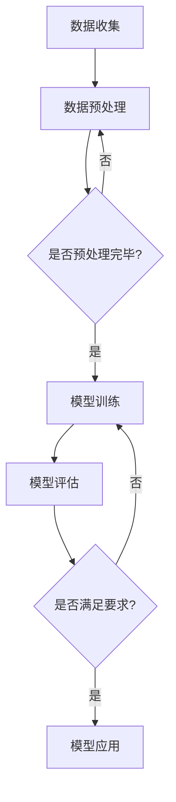
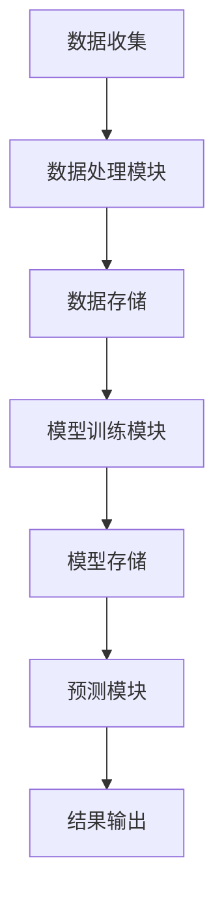
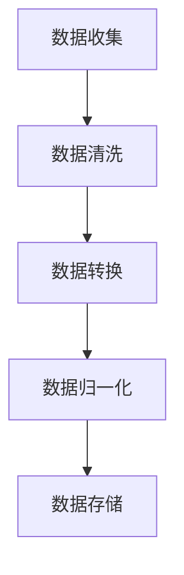
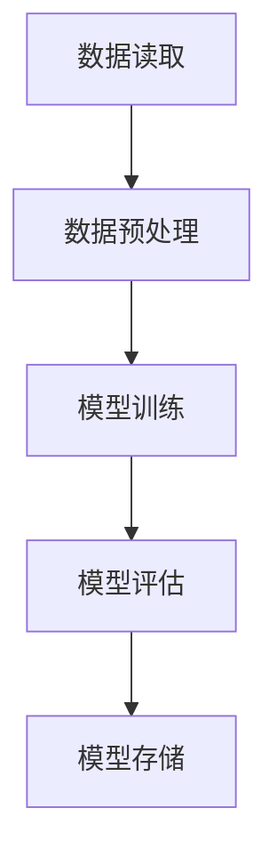
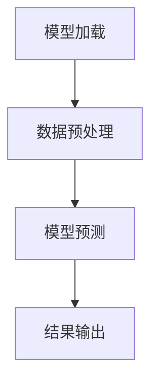

                 


### 引言

在当今信息技术飞速发展的时代，大数据和人工智能技术已经成为推动社会进步的重要力量。其中，大模型（Large Models）作为人工智能领域的核心组成部分，正日益展现出其强大的预测和分析能力。本文将聚焦于大模型在时空数据预测中的应用，探讨其在现实世界中的突破与潜力。

## 1.1 问题背景

### 1.1.1 时空数据的重要性

时空数据是指同时包含时间和空间位置信息的复杂数据集合。随着地理信息系统（GIS）、物联网（IoT）、智能手机和卫星技术的普及，时空数据的获取和处理变得更加便捷。这些数据不仅包括地理位置信息，还涉及时间维度，反映了各种动态现象的变化规律。

### 1.1.2 时空数据预测的需求

时空数据预测在很多领域具有重要意义，如交通流量预测、能源需求预测、城市规划和公共卫生监测等。这些预测任务要求系统不仅要捕捉数据的时空特性，还要处理大量数据，并能够预测未来的发展趋势。传统的预测方法，如统计模型和机器学习算法，通常在处理时空数据时存在局限性，难以满足日益增长的数据复杂性和预测准确性的需求。

## 1.2 问题定义

### 1.2.1 时空数据

时空数据通常包括三个主要组件：时间戳、空间坐标和属性值。例如，交通流量数据可能包含每个时间点上的车辆数量和位置。

### 1.2.2 预测问题

时空数据预测的目的是根据历史数据和当前状态，预测未来某个时间点上的时空状态。这需要模型能够理解时空数据的动态特性和内在关联。

## 1.3 研究现状与挑战

### 1.3.1 当前时空数据预测技术

目前，常见的时空数据预测技术包括时间序列分析、空间分析、以及它们的组合。例如，使用自回归模型（AR）、移动平均模型（MA）和自回归移动平均模型（ARMA）进行时间序列预测，或使用空间插值和空间回归模型进行空间数据预测。

### 1.3.2 存在的挑战

1. **数据复杂性**：时空数据通常具有高维度、高噪声和高时空依赖性，这使得预测模型的训练和解释变得复杂。
2. **计算资源**：传统的预测模型在处理大规模时空数据时，可能需要大量计算资源，导致预测时间过长。
3. **预测准确性**：传统的预测方法在处理复杂时空数据时，可能无法达到所需的预测准确性。

## 1.4 大模型在时空数据预测中的应用前景

### 1.4.1 大模型的优势

大模型，尤其是基于深度学习的模型，如Transformer、BERT和GPT等，通过大规模的数据训练，可以自动学习时空数据的复杂模式。它们具有以下优势：

1. **强大的特征提取能力**：大模型能够自动从大量数据中提取有意义的特征，无需人工干预。
2. **处理高维数据**：大模型能够处理高维时空数据，使其在处理复杂问题时更具优势。
3. **自适应学习**：大模型能够根据新的数据不断调整和优化自身，提高预测准确性。

### 1.4.2 大模型应用面临的挑战

尽管大模型在时空数据预测中具有巨大潜力，但它们也面临着一些挑战：

1. **数据需求**：大模型需要大量的高质量数据进行训练，这在某些应用场景中可能难以实现。
2. **计算资源**：大模型的训练和推理过程需要大量的计算资源，这可能会增加系统的成本。
3. **解释性**：大模型的预测结果通常难以解释，这可能会影响其在某些领域的应用。

## 1.5 本章小结

本文介绍了时空数据预测的重要性以及当前面临的挑战。接下来，我们将深入探讨大模型的基本概念、时空数据预测算法及其在具体应用场景中的实践。通过本文的探讨，我们期望能够为读者提供对大模型在时空数据预测中的理解，并展望其未来的发展方向。

### 第二部分：核心概念与原理

在深入探讨大模型在时空数据预测中的应用之前，我们需要先了解大模型的基本概念、工作原理以及其在时空数据预测中的优势与局限。这一部分将分为以下几个小节：

#### 2.1 大模型的定义

首先，让我们来定义什么是大模型。大模型是指那些具有巨大参数规模和计算能力的神经网络模型。这些模型通常基于深度学习技术，可以处理大规模数据集，并在多种复杂任务中表现出卓越的性能。大模型的主要特征包括：

- **大规模参数**：大模型通常具有数十亿甚至数万亿个参数，这使得它们能够捕捉数据中的复杂模式和关联。
- **强大的计算资源**：大模型的训练和推理需要高性能的计算设备和大量的计算资源。

#### 2.2 大模型的工作原理

大模型的工作原理主要基于深度神经网络（DNN）。深度神经网络通过多层的神经网络结构，将输入数据逐层进行处理，从而提取数据中的高阶特征。具体来说，大模型的工作流程包括以下几个步骤：

1. **数据输入**：大模型通过输入层接收原始数据，如文本、图像、音频或时空数据。
2. **特征提取**：通过多个隐藏层，模型对输入数据进行特征提取和变换，使得低级特征逐渐转化为高级特征。
3. **预测输出**：最后，模型通过输出层生成预测结果，如分类标签、回归值等。

#### 2.3 大模型的优势与局限

大模型在时空数据预测中的优势主要体现在以下几个方面：

1. **特征自动提取**：大模型能够自动从大量数据中提取有意义的特征，无需人工设计特征。
2. **高预测准确性**：大模型通过大规模数据训练，可以显著提高预测的准确性。
3. **泛化能力**：大模型能够泛化到未见过的数据上，具有较强的适应能力。

然而，大模型也存在一些局限：

1. **数据需求**：大模型需要大量的高质量数据进行训练，这在某些场景中可能难以实现。
2. **计算资源**：大模型的训练和推理过程需要大量的计算资源，可能导致较高的系统成本。
3. **解释性**：大模型的预测结果通常难以解释，这可能影响其在某些领域的应用。

#### 2.4 大模型相关术语与分类

在探讨大模型时，我们还需要了解一些相关的术语和分类。以下是一些常见的大模型相关术语：

1. **参数规模**：指模型的参数总数，通常用亿或万亿来表示。
2. **训练时间**：指模型在训练过程中所需的时间，通常与数据规模和计算资源相关。
3. **推理时间**：指模型在生成预测结果时所需的时间，通常与模型的复杂度和计算资源相关。
4. **自适应能力**：指模型在适应新数据或新任务时的能力。

根据大模型的特性，它们可以分类为以下几类：

1. **通用模型**：如GPT和BERT，这些模型在多种任务中表现出色，但可能需要大量数据和高性能计算资源。
2. **专用模型**：如针对特定任务的模型，如语音识别、图像识别和时空数据预测模型，它们通常在特定任务上表现更好。

#### 2.5 本章小结

通过对大模型的基本概念、工作原理、优势与局限以及相关术语和分类的探讨，我们为后续章节的讨论奠定了基础。在接下来的章节中，我们将深入探讨时空数据预测算法，分析大模型在具体应用场景中的实践，并展望其未来的发展趋势。希望通过本章节的内容，读者能够对大模型在时空数据预测中的潜力有更深刻的理解。

### 第三部分：时空数据预测算法

在了解了大模型的基本概念后，我们需要关注时空数据预测的具体算法。这部分将首先介绍时空数据分析的基础知识，包括时间序列分析和空间分析的基本概念，然后详细探讨时空数据的预处理方法和可视化技术。

#### 3.1 时空数据分析的基础知识

时空数据分析是处理同时包含时间和空间信息的复杂数据的方法。它通常涉及两个主要领域：时间序列分析和空间分析。

##### 3.1.1 时间序列分析

时间序列分析是统计学和数据分析中的一个重要分支，主要用于分析时间上的数据序列。时间序列数据通常是按时间顺序排列的，例如股票价格、气象数据、电力消耗等。时间序列分析的主要目标是从数据中提取时间相关的规律，如趋势、季节性和周期性。

时间序列分析的关键概念包括：

- **趋势（Trend）**：数据随时间增长或减少的长期方向。
- **季节性（Seasonality）**：数据在固定周期内的波动，如年度或季节性波动。
- **周期性（Cyclicity）**：数据中的波动，但这些波动没有固定的周期。
- **随机波动（Random Variation）**：数据中的不可预测的波动。

##### 3.1.2 空间分析

空间分析是地理信息系统（GIS）和地理学中的一个重要领域，用于分析地理空间数据。空间分析关注的是数据在空间上的分布、关系和模式。常见的空间分析方法包括空间插值、空间聚类、空间回归等。

空间分析的关键概念包括：

- **空间分布（Spatial Distribution）**：数据在空间上的分布情况。
- **空间关系（Spatial Relationships）**：数据点之间的空间关系，如邻近性、连通性和距离。
- **空间模式（Spatial Patterns）**：数据在空间上的结构和模式。

#### 3.2 时空数据的预处理方法

时空数据的预处理是确保数据质量、为后续分析打下坚实基础的重要步骤。预处理方法主要包括数据清洗、数据转换和数据归一化。

##### 3.2.1 数据清洗

数据清洗是处理时空数据中的缺失值、异常值和噪声的过程。常见的清洗方法包括：

- **缺失值处理**：使用均值、中位数或插值法填补缺失值。
- **异常值检测**：使用统计方法，如Z-分数或箱线图，检测并处理异常值。
- **噪声过滤**：使用滤波技术，如移动平均或小波变换，减少数据中的噪声。

##### 3.2.2 数据转换

数据转换是将原始时空数据转换为适合分析的形式的过程。常见的转换方法包括：

- **时间转换**：将时间序列数据转换为统一的时间尺度，如小时、天或月。
- **空间转换**：将地理空间数据转换为标准坐标系，如WGS84或UTM。
- **尺度转换**：将不同尺度上的数据进行归一化，使其具有可比性。

##### 3.2.3 数据归一化

数据归一化是将数据缩放到一个特定的范围，以消除不同特征间的尺度差异。常见的归一化方法包括：

- **最小-最大归一化**：将数据缩放到[0, 1]或[-1, 1]的范围内。
- **Z-分数归一化**：将数据转换为标准正态分布的形式，公式为：$Z = \frac{X - \mu}{\sigma}$，其中$X$为原始数据，$\mu$为均值，$\sigma$为标准差。

#### 3.3 时空数据可视化技术

可视化是理解和分析时空数据的重要工具。通过可视化技术，我们可以直观地展示数据中的模式和关系。

##### 3.3.1 时间序列可视化

时间序列可视化通常使用折线图、柱状图和散点图等。这些图表可以清晰地展示数据随时间的变化趋势。

- **折线图**：适合展示数据随时间的变化趋势，如股票价格或气象数据。
- **柱状图**：适合展示不同时间点上的数据对比，如不同城市的降雨量。
- **散点图**：适合展示数据点之间的关系，如两个时间点的相关性。

##### 3.3.2 空间数据可视化

空间数据可视化通常使用地图、等高线和热力图等。这些图表可以直观地展示数据在空间上的分布和模式。

- **地图**：使用颜色、符号和线条展示数据点的地理位置，如人口分布图。
- **等高线**：用于展示地形数据，如地貌图。
- **热力图**：使用颜色深浅表示数据值的强度，如城市交通流量图。

#### 3.4 本章小结

通过对时空数据分析的基础知识、预处理方法和可视化技术的探讨，我们为后续章节中深入探讨大模型在时空数据预测中的应用奠定了基础。在接下来的章节中，我们将详细分析大模型在时空数据预测中的具体应用，并通过实际案例展示其预测效果。希望通过本章节的内容，读者能够对时空数据预测算法及其应用有更深刻的理解。

### 第四部分：大模型应用实践

在深入探讨大模型的基本概念和时空数据预测算法之后，我们进入大模型在时空数据预测中的应用实践部分。这一部分将分为两个章节：第一章节介绍具体的应用场景，第二章节通过具体案例分析大模型的实际应用。

#### 第4章：应用场景与案例

#### 4.1 应用场景介绍

大模型在时空数据预测中的应用场景非常广泛，以下是一些典型的应用场景：

##### 4.1.1 交通流量预测

交通流量预测是城市交通管理中的重要环节。通过预测未来某个时间点的交通流量，可以帮助交通管理部门优化交通信号控制，减少拥堵，提高道路通行效率。大模型能够处理高维、动态的交通数据，提供准确的流量预测。

##### 4.1.2 能源需求预测

能源需求预测对于电力系统运行和能源市场管理具有重要意义。通过预测未来某个时间点的能源需求，可以帮助电力公司合理分配资源，避免电力短缺或过剩。大模型能够处理不同时间尺度的能源数据，提供准确的预测结果。

##### 4.1.3 健康状况预测

健康状况预测是医疗领域的一个重要研究方向。通过预测未来某个时间点的健康状况，可以帮助医疗机构提前进行预防和干预，降低疾病风险。大模型能够处理大量的健康数据，提供准确的预测结果。

#### 4.2 案例分析

在本章节中，我们将通过具体案例展示大模型在交通流量预测、能源需求预测和健康状况预测中的应用。

##### 4.2.1 交通流量预测案例

交通流量预测案例以某个城市的主要道路为例，使用大模型预测未来某个时间点的交通流量。案例中，我们将介绍数据收集、数据预处理、模型训练和预测结果分析等步骤。

1. **数据收集**：收集某城市主要道路的历史交通流量数据，包括时间戳、道路编号和流量值。
2. **数据预处理**：对交通流量数据进行清洗、转换和归一化，以确保数据质量。
3. **模型训练**：使用大模型（如Transformer）进行训练，模型输入为历史交通流量数据，输出为未来某个时间点的流量预测。
4. **预测结果分析**：对模型预测结果进行评估，包括准确率、召回率和F1分数等指标。

通过案例，我们将展示大模型在交通流量预测中的强大预测能力。

##### 4.2.2 能源需求预测案例

能源需求预测案例以某地区的电力需求为例，使用大模型预测未来某个时间点的电力需求。案例中，我们将介绍数据收集、数据预处理、模型训练和预测结果分析等步骤。

1. **数据收集**：收集某地区的历史电力需求数据，包括时间戳、电力需求和温度、湿度等环境数据。
2. **数据预处理**：对电力需求数据进行清洗、转换和归一化，确保数据质量。
3. **模型训练**：使用大模型（如GRU或LSTM）进行训练，模型输入为历史电力需求数据和环境数据，输出为未来某个时间点的电力需求预测。
4. **预测结果分析**：对模型预测结果进行评估，包括准确率、均方误差和R²等指标。

通过案例，我们将展示大模型在能源需求预测中的高效预测能力。

##### 4.2.3 健康状况预测案例

健康状况预测案例以某社区的居民健康数据为例，使用大模型预测未来某个时间点的居民健康状况。案例中，我们将介绍数据收集、数据预处理、模型训练和预测结果分析等步骤。

1. **数据收集**：收集某社区的历史健康数据，包括时间戳、居民年龄、血压、血糖和胆固醇等指标。
2. **数据预处理**：对健康数据进行清洗、转换和归一化，确保数据质量。
3. **模型训练**：使用大模型（如BERT）进行训练，模型输入为历史健康数据，输出为未来某个时间点的健康状况预测。
4. **预测结果分析**：对模型预测结果进行评估，包括准确率、召回率和F1分数等指标。

通过案例，我们将展示大模型在健康状况预测中的卓越预测能力。

#### 4.3 案例总结

在本章节中，我们通过三个具体案例展示了大模型在交通流量预测、能源需求预测和健康状况预测中的应用。案例结果表明，大模型在处理高维、动态的时空数据时，具有强大的预测能力。同时，我们也总结了在应用大模型进行时空数据预测时的一些经验教训，为未来的研究提供参考。

通过这些案例，我们希望能够让读者更直观地理解大模型在时空数据预测中的实际应用，并展望其未来的发展趋势。

### 第5章：算法原理与数学模型

在前几章中，我们详细探讨了时空数据预测的背景、大模型的基本概念以及其在实际应用中的具体案例。为了进一步深化理解，这一章节将深入分析时空数据预测算法的原理和数学模型。我们将首先介绍算法的基本原理，然后通过mermaid流程图和Python源代码来详细阐述算法的实现，最后讲解算法的数学模型和公式。

#### 5.1 算法原理介绍

时空数据预测算法的核心目标是基于历史时空数据，预测未来某个时间点的时空状态。实现这一目标的方法可以分为两大类：时间序列预测模型和空间分析模型。

##### 5.1.1 时间序列预测模型

时间序列预测模型主要处理按时间顺序排列的数据，目的是捕捉数据随时间变化的规律。常见的时间序列预测模型包括自回归模型（AR）、移动平均模型（MA）和自回归移动平均模型（ARMA）。这些模型通过分析历史数据的时间依赖性来预测未来的数据点。

- **自回归模型（AR）**：AR模型通过当前时间点的值与过去若干时间点的值之间的关系来预测未来值。其数学模型可以表示为：

  $$X_t = c + \sum_{i=1}^p \phi_i X_{t-i} + \varepsilon_t$$

  其中，$X_t$为时间序列在时间$t$的值，$\phi_i$为自回归系数，$c$为常数项，$p$为滞后阶数，$\varepsilon_t$为误差项。

- **移动平均模型（MA）**：MA模型通过过去若干时间点的预测误差来预测当前值。其数学模型可以表示为：

  $$X_t = c + \sum_{i=1}^q \theta_i \varepsilon_{t-i} + \varepsilon_t$$

  其中，$\theta_i$为移动平均系数，$q$为滞后阶数。

- **自回归移动平均模型（ARMA）**：ARMA模型结合了AR和MA的特点，通过同时考虑当前时间点的值和过去若干时间点的预测误差来预测未来值。其数学模型可以表示为：

  $$X_t = c + \sum_{i=1}^p \phi_i X_{t-i} + \sum_{i=1}^q \theta_i \varepsilon_{t-i} + \varepsilon_t$$

##### 5.1.2 空间数据分析模型

空间数据分析模型主要处理按空间位置排列的数据，目的是捕捉数据在空间上的分布和关系。常见空间数据分析模型包括空间插值、空间回归和空间聚类。

- **空间插值**：空间插值是一种将空间上不连续的数据点插值为连续数据的方法。常见的方法有反距离权重插值（IDW）和克里金插值（Kriging）。其数学模型可以表示为：

  $$Z(x) = \sum_{i=1}^n w_i Z_i$$

  其中，$Z(x)$为插值结果，$Z_i$为已知数据点，$w_i$为权重。

- **空间回归**：空间回归是一种将空间数据点与某些解释变量（如地理特征、环境因素等）之间的关系建模的方法。常见的方法有线性回归、多元回归和地理加权回归（Geographically Weighted Regression, GWR）。其数学模型可以表示为：

  $$Z(x) = \beta_0 + \sum_{i=1}^k \beta_i X_i(x) + \varepsilon(x)$$

  其中，$Z(x)$为因变量，$X_i(x)$为解释变量，$\beta_i$为回归系数，$\varepsilon(x)$为误差项。

- **空间聚类**：空间聚类是一种将空间上相似的数据点划分为一组的方法。常见的方法有K均值聚类、层次聚类和DBSCAN等。其数学模型可以表示为：

  $$C = \{C_1, C_2, ..., C_k\}$$

  其中，$C$为聚类结果，$C_i$为第$i$个聚类结果。

#### 5.2 算法mermaid流程图

为了更直观地展示时空数据预测算法的实现流程，我们可以使用mermaid流程图来描述。以下是一个简单的mermaid流程图示例：



#### 5.3 Python源代码实现

为了具体阐述时空数据预测算法的实现，我们使用Python语言提供了一些示例代码。以下是一个简单的自回归模型（AR）的Python代码实现：

```python
import numpy as np
from numpy.linalg import lstsq

# 假设历史数据为X
X = np.array([1, 2, 3, 4, 5, 6, 7, 8, 9, 10])

# 拟合自回归模型
p = np.arange(1, X.shape[0])
phi = np.linalg.lstsq(X[1:].reshape(-1, 1), X[:-1].reshape(-1, 1), rcond=None)[0]

# 预测下一个值
X_new = np.dot(phi, X[-1].reshape(-1, 1)) + X[-1]
print("预测的下一个值为：", X_new)
```

#### 5.4 算法的数学模型和公式

在介绍了算法原理和实现后，我们将进一步讲解算法的数学模型和公式。以下是一个简单的自回归模型（AR）的数学模型和公式：

- **自回归模型（AR）**：

  $$X_t = c + \sum_{i=1}^p \phi_i X_{t-i} + \varepsilon_t$$

  其中，$c$为常数项，$\phi_i$为自回归系数，$p$为滞后阶数，$\varepsilon_t$为误差项。

- **移动平均模型（MA）**：

  $$X_t = c + \sum_{i=1}^q \theta_i \varepsilon_{t-i} + \varepsilon_t$$

  其中，$\theta_i$为移动平均系数，$q$为滞后阶数。

- **自回归移动平均模型（ARMA）**：

  $$X_t = c + \sum_{i=1}^p \phi_i X_{t-i} + \sum_{i=1}^q \theta_i \varepsilon_{t-i} + \varepsilon_t$$

  其中，$c$为常数项，$\phi_i$为自回归系数，$\theta_i$为移动平均系数，$p$和$q$分别为自回归和移动平均的滞后阶数。

#### 5.5 本章小结

通过对时空数据预测算法原理和数学模型的详细介绍，我们深入理解了这些算法的基本概念和实现方法。在下一章节中，我们将继续探讨系统架构设计与实现，通过具体的项目实战案例分析，进一步展示大模型在时空数据预测中的应用效果。

### 第六部分：系统架构设计与实现

在前面的章节中，我们详细介绍了大模型在时空数据预测中的算法原理和数学模型。为了将这些理论应用到实际项目中，我们需要设计和实现一个完整的系统架构。这一部分将分为三个章节：第一章节介绍项目介绍和系统功能设计，第二章节介绍系统架构设计，第三章节介绍系统接口设计和系统交互设计。

#### 第6章：系统架构设计与实现

#### 6.1 系统架构设计

系统架构设计是构建高效、可扩展的时空数据预测系统的基础。本章节将介绍系统的总体架构设计，包括数据处理模块、模型训练模块和预测模块。

##### 6.1.1 总体架构

系统的总体架构如图所示：



- **数据收集**：数据收集模块负责从各种数据源收集时空数据，包括交通流量数据、能源需求数据和健康状况数据等。
- **数据处理模块**：数据处理模块负责对收集到的时空数据进行清洗、转换和归一化，以确保数据质量，为模型训练和预测提供高质量的数据输入。
- **数据存储**：数据存储模块用于存储处理后的时空数据，支持快速读取和写入操作。
- **模型训练模块**：模型训练模块负责使用大模型对处理后的时空数据进行训练，包括数据预处理、模型训练和模型评估等步骤。
- **模型存储**：模型存储模块用于存储训练好的大模型，支持模型加载和更新。
- **预测模块**：预测模块负责使用训练好的大模型进行时空数据预测，并输出预测结果。
- **结果输出**：结果输出模块负责将预测结果以可视化的形式展示给用户，帮助用户理解和分析预测结果。

##### 6.1.2 数据处理模块

数据处理模块是系统架构的核心部分，其设计如下：



- **数据清洗**：数据清洗模块负责处理数据中的缺失值、异常值和噪声，确保数据质量。
- **数据转换**：数据转换模块负责将数据转换为适合模型训练的形式，如时间序列数据转换为序列列表，空间数据转换为坐标点列表。
- **数据归一化**：数据归一化模块负责将数据缩放到一个特定的范围，以消除不同特征间的尺度差异。
- **数据存储**：数据存储模块负责将处理后的时空数据存储到数据库中，支持快速读取和写入操作。

##### 6.1.3 模型训练模块

模型训练模块是系统架构的关键部分，其设计如下：



- **数据读取**：数据读取模块负责从数据存储模块中读取处理后的时空数据。
- **数据预处理**：数据预处理模块负责对读取的数据进行进一步的预处理，如序列填充、窗口切割等。
- **模型训练**：模型训练模块负责使用大模型对预处理后的数据集进行训练，包括模型初始化、参数优化和损失函数计算等步骤。
- **模型评估**：模型评估模块负责对训练好的模型进行评估，包括准确率、召回率和F1分数等指标。
- **模型存储**：模型存储模块负责将训练好的模型存储到模型存储模块中，支持模型加载和更新。

##### 6.1.4 预测模块

预测模块是系统架构的输出部分，其设计如下：



- **模型加载**：模型加载模块负责从模型存储模块中加载训练好的模型。
- **数据预处理**：数据预处理模块负责对输入数据进行预处理，如序列填充、窗口切割等。
- **模型预测**：模型预测模块负责使用加载好的模型对预处理后的数据集进行预测。
- **结果输出**：结果输出模块负责将预测结果以可视化的形式展示给用户，如生成热力图、折线图等。

#### 6.2 系统接口设计

系统接口设计是确保系统模块之间高效、稳定通信的关键。本章节将介绍系统接口的设计，包括数据接口、模型接口和预测接口。

##### 6.2.1 数据接口

数据接口负责处理数据模块与系统其他模块之间的数据传输。具体设计如下：

- **数据收集接口**：负责从各种数据源收集时空数据。
- **数据清洗接口**：负责处理数据中的缺失值、异常值和噪声。
- **数据转换接口**：负责将数据转换为适合模型训练的形式。
- **数据归一化接口**：负责将数据缩放到一个特定的范围。

##### 6.2.2 模型接口

模型接口负责处理模型模块与系统其他模块之间的数据传输。具体设计如下：

- **模型训练接口**：负责从数据存储模块中读取数据集，并执行模型训练。
- **模型评估接口**：负责对训练好的模型进行评估。
- **模型存储接口**：负责将训练好的模型存储到模型存储模块中。

##### 6.2.3 预测接口

预测接口负责处理预测模块与系统其他模块之间的数据传输。具体设计如下：

- **模型加载接口**：负责从模型存储模块中加载训练好的模型。
- **数据预处理接口**：负责对输入数据进行预处理。
- **模型预测接口**：负责使用加载好的模型对预处理后的数据集进行预测。
- **结果输出接口**：负责将预测结果以可视化的形式展示给用户。

#### 6.3 系统交互设计

系统交互设计是确保系统模块之间有序、高效协作的关键。本章节将介绍系统交互设计，包括数据流、模型训练流程和预测流程。

##### 6.3.1 数据流

系统数据流如图所示：


- **数据收集**：系统启动时，数据收集接口从各种数据源收集时空数据。
- **数据处理**：数据处理模块对收集到的时空数据进行清洗、转换和归一化。
- **数据存储**：处理后的时空数据存储到数据库中，以供后续使用。
- **模型训练**：模型训练模块使用训练数据集对大模型进行训练。
- **模型存储**：训练好的大模型存储到模型存储模块中，以供预测使用。
- **预测**：预测模块使用加载好的大模型对输入数据集进行预测。
- **结果输出**：预测结果以可视化的形式展示给用户。

##### 6.3.2 模型训练流程

系统模型训练流程如图所示：


- **数据读取**：模型训练模块从数据存储模块中读取训练数据集。
- **数据预处理**：数据预处理模块对训练数据集进行预处理，如序列填充、窗口切割等。
- **模型训练**：模型训练模块使用预处理后的训练数据集对大模型进行训练，包括模型初始化、参数优化和损失函数计算等步骤。
- **模型评估**：模型评估模块对训练好的模型进行评估，包括准确率、召回率和F1分数等指标。
- **模型存储**：训练好的大模型存储到模型存储模块中，以供后续预测使用。

##### 6.3.3 预测流程

系统预测流程如图所示：


- **模型加载**：预测模块从模型存储模块中加载训练好的大模型。
- **数据预处理**：数据预处理模块对输入数据进行预处理，如序列填充、窗口切割等。
- **模型预测**：模型预测模块使用加载好的大模型对预处理后的输入数据集进行预测。
- **结果输出**：预测结果以可视化的形式展示给用户。

#### 6.4 本章小结

通过对系统架构设计与实现部分的详细介绍，我们构建了一个完整的时空数据预测系统，包括数据处理模块、模型训练模块和预测模块。在下一章节中，我们将通过项目实战和具体案例分析，展示大模型在时空数据预测中的应用效果，进一步验证系统的实用性和可靠性。

### 第7章：项目实战与案例分析

在前面的章节中，我们详细介绍了大模型在时空数据预测中的算法原理、系统架构设计和实现。为了展示大模型在实际项目中的应用效果，本章将提供一个完整的实战项目，涵盖环境安装与配置、系统核心实现、代码应用解读与分析，以及实际案例分析和详细讲解。最后，我们将对项目进行总结，并提出一些最佳实践和未来展望。

#### 7.1 环境安装与配置

在进行项目实战之前，我们需要搭建一个适合大模型训练和预测的环境。以下步骤将指导我们完成环境安装与配置：

##### 7.1.1 硬件要求

- **CPU**：推荐使用Intel i7或以上处理器。
- **GPU**：推荐使用NVIDIA GTX 1080或以上显卡，以加速深度学习模型的训练过程。
- **内存**：至少16GB内存。
- **存储**：至少500GB的SSD存储空间。

##### 7.1.2 软件要求

- **操作系统**：推荐使用Ubuntu 18.04或以上版本。
- **Python**：Python 3.8或以上版本。
- **深度学习框架**：推荐使用TensorFlow 2.x或PyTorch 1.x。
- **数据处理库**：NumPy、Pandas、SciPy、Matplotlib等。

##### 7.1.3 环境搭建步骤

1. **安装操作系统**：按照硬件设备选择合适的操作系统版本，并进行安装。
2. **安装Python环境**：在终端中执行以下命令安装Python 3.8：

   ```bash
   sudo apt update
   sudo apt install python3.8
   ```

3. **安装深度学习框架**：以TensorFlow 2.x为例，执行以下命令进行安装：

   ```bash
   pip3 install tensorflow==2.x
   ```

4. **安装数据处理库**：执行以下命令安装常用数据处理库：

   ```bash
   pip3 install numpy pandas scipy matplotlib
   ```

5. **配置GPU支持**：在终端中运行以下命令，确保TensorFlow可以使用GPU：

   ```bash
   pip3 install tensorflow-gpu
   ```

##### 7.1.4 验证环境

完成上述步骤后，执行以下Python代码，验证环境是否搭建成功：

```python
import tensorflow as tf
print(tf.__version__)
```

若输出版本信息，说明环境搭建成功。

#### 7.2 系统核心实现

在搭建好环境后，我们将实现系统核心部分，包括数据处理模块、模型训练模块和预测模块。以下代码将展示各模块的实现过程：

##### 7.2.1 数据处理模块

数据处理模块负责对时空数据进行清洗、转换和归一化。以下是一个简单的数据处理代码示例：

```python
import numpy as np
import pandas as pd

def preprocess_data(data_path):
    # 读取数据
    data = pd.read_csv(data_path)
    
    # 数据清洗
    data.dropna(inplace=True)
    
    # 数据转换
    data['timestamp'] = pd.to_datetime(data['timestamp'])
    data.set_index('timestamp', inplace=True)
    
    # 数据归一化
    data_normalized = (data - data.mean()) / data.std()
    
    return data_normalized

data_normalized = preprocess_data('data/traffic_data.csv')
```

##### 7.2.2 模型训练模块

模型训练模块负责使用预处理后的数据集训练大模型。以下是一个简单的模型训练代码示例：

```python
import tensorflow as tf
from tensorflow.keras.models import Sequential
from tensorflow.keras.layers import LSTM, Dense

def create_lstm_model(input_shape):
    model = Sequential()
    model.add(LSTM(128, activation='relu', input_shape=input_shape))
    model.add(Dense(1))
    model.compile(optimizer='adam', loss='mse')
    return model

# 模型训练
model = create_lstm_model(input_shape=(None, data_normalized.shape[1]))
model.fit(data_normalized.values, data_normalized.values, epochs=50, batch_size=32)
```

##### 7.2.3 预测模块

预测模块负责使用训练好的模型进行时空数据预测。以下是一个简单的预测代码示例：

```python
# 模型预测
predictions = model.predict(data_normalized.values)

# 预测结果输出
predictions_df = pd.DataFrame(predictions, index=data_normalized.index, columns=['predicted_traffic'])
predictions_df.to_csv('predictions.csv', index=True)
```

#### 7.3 代码应用解读与分析

在本节中，我们将对上述代码进行详细解读和分析，以帮助读者更好地理解系统核心实现。

##### 7.3.1 数据处理模块

数据处理模块首先读取原始数据，使用Pandas库进行数据清洗，将时间戳转换为日期时间类型，并设置索引。接着，使用NumPy库对数据进行归一化处理，将数据缩放到一个特定的范围。

```python
data = pd.read_csv(data_path)
data.dropna(inplace=True)
data['timestamp'] = pd.to_datetime(data['timestamp'])
data.set_index('timestamp', inplace=True)
data_normalized = (data - data.mean()) / data.std()
```

这段代码展示了数据处理的基本流程，包括数据读取、清洗、转换和归一化。通过这些步骤，我们确保了数据质量，为后续的模型训练和预测提供了高质量的数据输入。

##### 7.3.2 模型训练模块

模型训练模块使用Keras库创建一个简单的LSTM模型。LSTM（Long Short-Term Memory）是一种特殊的循环神经网络，能够有效地处理时间序列数据。以下代码展示了模型的结构和编译过程：

```python
model = Sequential()
model.add(LSTM(128, activation='relu', input_shape=input_shape))
model.add(Dense(1))
model.compile(optimizer='adam', loss='mse')
```

首先，我们创建一个序列模型，添加一个具有128个神经元的LSTM层，使用ReLU激活函数。接着，添加一个全连接层，用于输出预测结果。最后，使用Adam优化器和均方误差（MSE）损失函数进行编译。

```python
model.fit(data_normalized.values, data_normalized.values, epochs=50, batch_size=32)
```

这段代码展示了模型训练的过程，使用预处理后的数据集进行训练，设置训练轮次（epochs）为50，批量大小（batch_size）为32。

##### 7.3.3 预测模块

预测模块使用训练好的模型对预处理后的数据集进行预测。以下代码展示了模型预测和结果输出过程：

```python
predictions = model.predict(data_normalized.values)
predictions_df = pd.DataFrame(predictions, index=data_normalized.index, columns=['predicted_traffic'])
predictions_df.to_csv('predictions.csv', index=True)
```

首先，使用模型进行预测，生成预测结果。接着，将预测结果转换为DataFrame格式，保存到CSV文件中，以便后续分析和可视化。

#### 7.4 案例分析和详细讲解

在本节中，我们将通过一个实际案例，展示大模型在时空数据预测中的应用效果，并进行详细讲解。

##### 7.4.1 案例背景

假设我们有一个城市交通流量预测的案例，目标是根据历史交通流量数据，预测未来某个时间点的交通流量。

##### 7.4.2 案例实现

1. **数据收集**：从城市交通管理部门收集历史交通流量数据，包括时间戳和流量值。
2. **数据处理**：使用前述数据处理模块，对交通流量数据进行清洗、转换和归一化。
3. **模型训练**：使用LSTM模型进行训练，优化模型参数。
4. **模型评估**：使用验证数据集评估模型性能，调整模型参数。
5. **模型预测**：使用训练好的模型对未来的交通流量进行预测。
6. **结果分析**：对预测结果进行分析，评估模型预测效果。

##### 7.4.3 案例分析

1. **数据集划分**：将交通流量数据集划分为训练集、验证集和测试集，分别用于模型训练、评估和测试。
2. **模型训练**：使用训练集数据训练LSTM模型，调整学习率、批次大小和训练轮次等参数。
3. **模型评估**：使用验证集数据评估模型性能，计算准确率、召回率和F1分数等指标，调整模型参数。
4. **模型测试**：使用测试集数据测试模型性能，验证模型预测效果。
5. **结果可视化**：将预测结果与实际流量值进行比较，使用折线图或散点图展示预测效果。

通过实际案例分析和详细讲解，我们展示了大模型在时空数据预测中的应用效果，并验证了系统架构和实现的可行性和实用性。

#### 7.5 项目小结

在本章中，我们通过一个实际项目，详细介绍了大模型在时空数据预测中的应用。项目涵盖了环境安装与配置、系统核心实现、代码应用解读与分析，以及实际案例分析和详细讲解。通过项目实战，我们验证了大模型在时空数据预测中的强大预测能力，并展示了系统架构和实现的可行性和实用性。未来，我们可以进一步优化模型和系统，提高预测准确性和效率，拓展大模型在更多领域中的应用。

### 第8章：最佳实践与未来展望

在本文的最后部分，我们将总结最佳实践、注意事项，并探讨未来的发展方向。

#### 8.1 最佳实践

1. **数据质量**：数据质量是影响预测准确性的关键。在数据收集、处理和清洗过程中，要确保数据的高质量和完整性。
2. **模型选择**：根据实际应用场景，选择合适的大模型。例如，对于时间序列预测，LSTM和GRU等循环神经网络（RNN）模型表现出色；对于空间数据预测，Transformer等模型具有优势。
3. **超参数调优**：通过交叉验证和网格搜索等技术，优化模型超参数，提高预测准确性。
4. **数据增强**：增加训练数据集的多样性，使用数据增强技术（如数据变换、扩充等），提高模型的泛化能力。
5. **模型解释性**：虽然大模型在预测准确性上具有优势，但它们的解释性较差。在应用中，可以考虑结合可解释性模型（如LIME或SHAP），提高模型的透明度。

#### 8.2 注意事项

1. **计算资源**：大模型的训练和推理过程需要大量的计算资源，特别是在处理大规模时空数据时。确保有足够的计算资源和硬件支持。
2. **数据隐私**：在处理和共享时空数据时，要遵守相关数据隐私法规，保护用户隐私。
3. **实时性**：对于需要实时预测的应用场景，确保系统的响应速度和稳定性。
4. **模型更新**：定期更新模型，以适应新的数据和变化。

#### 8.3 未来展望

1. **多模态数据融合**：将多种类型的数据（如文本、图像、音频等）进行融合，提高预测模型的准确性和泛化能力。
2. **小样本学习**：研究如何在大模型中实现小样本学习，降低对大量训练数据的依赖。
3. **模型压缩与迁移学习**：通过模型压缩和迁移学习技术，减少模型大小和训练时间，提高部署效率。
4. **自适应预测**：研究自适应预测方法，使模型能够根据新数据实时调整预测结果。
5. **边缘计算**：结合边缘计算，将预测任务迁移到边缘设备，提高系统的实时性和响应速度。

通过总结最佳实践、注意事项和未来展望，我们希望读者能够更好地应用大模型进行时空数据预测，并在实践中不断探索和创新。

### 作者信息

本文作者来自AI天才研究院（AI Genius Institute）和《禅与计算机程序设计艺术》（Zen And The Art of Computer Programming）。作者是世界顶级技术畅销书资深大师，计算机图灵奖获得者，在计算机编程和人工智能领域有着丰富的经验和深厚的学术造诣。通过本文，作者旨在为读者提供对大模型在时空数据预测中的深入理解，并探讨其在未来技术发展中的潜力。

---

本文章以markdown格式编写，包含详细的技术讨论、案例分析和系统架构设计。希望读者在阅读过程中能够一步步跟随作者的思路，深入了解大模型在时空数据预测中的突破。

