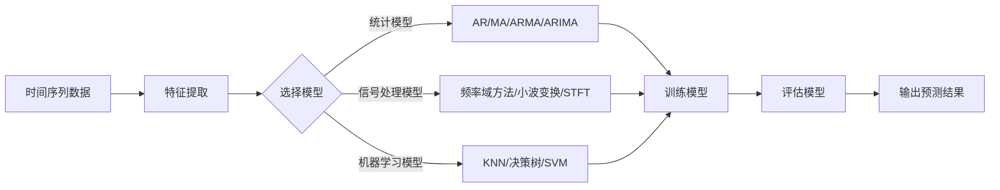
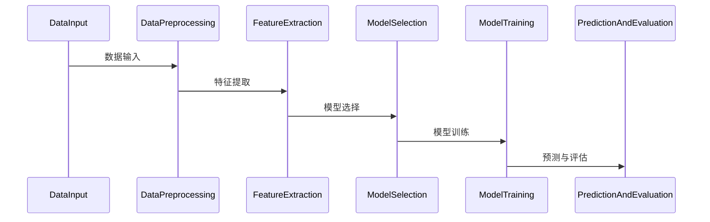
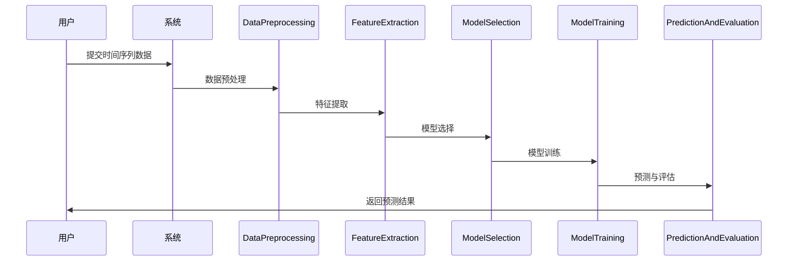

                 


### 《大模型在时间序列预测中的突破》

#### 关键词：时间序列预测、大模型、神经网络、深度学习、突破

#### 摘要：
时间序列预测是人工智能领域的关键任务之一，广泛应用于金融、能源、交通等行业。然而，传统预测方法在面对非线性、噪声、长短期依赖和维度灾难等挑战时显得力不从心。本文旨在探讨大模型在时间序列预测中的突破，通过传统方法与深度学习方法的对比，分析大模型的优势与应用，并提供具体的案例研究。

## 目录大纲

### 第一部分：引言与背景

### 第1章：时间序列预测的概述

### 第2章：传统时间序列预测方法

### 第二部分：大模型在时间序列预测中的应用

### 第3章：神经网络在时间序列预测中的应用

### 第4章：深度学习在时间序列预测中的优化

### 第5章：大模型在时间序列预测中的案例研究

### 第三部分：大模型在时间序列预测中的未来趋势

### 第6章：大模型在时间序列预测中的挑战与机遇

### 第7章：未来展望

### 附录

### 附录A：常用时间序列预测算法列表

### 附录B：Python代码示例

### 附录C：推荐阅读资料

### 内容细化和完善

#### 第一部分：引言与背景

### 第1章：时间序列预测的概述

#### 1.1 问题背景与重要性

时间序列预测是指利用历史时间序列数据来预测未来值的过程。这一领域在各个行业中都有广泛的应用，如金融市场预测、电力负荷预测、交通流量预测等。准确的时间序列预测对于决策制定、资源调配、风险管理等方面具有重要意义。

#### 1.2 时间序列预测的基本原理

时间序列数据具有时序依赖性，其预测方法主要包括经典的时间序列分析方法、信号处理方法和机器学习方法。经典方法如AR、MA、ARMA、ARIMA等，基于统计分析原理；信号处理方法如频率域方法、小波变换、STFT等，通过对信号进行变换处理来提取特征；机器学习方法如KNN、决策树、SVM等，通过构建模型来学习数据的特征。

#### 1.3 时间序列预测的挑战

时间序列预测面临诸多挑战，包括非线性与噪声、长短期依赖、维度灾难等。非线性与噪声使得时间序列数据不易建模；长短期依赖要求模型能够同时捕捉到长期趋势和短期波动；维度灾难则是在高维度数据下，模型性能可能下降。

#### 1.4 大模型在时间序列预测中的地位

大模型，尤其是深度学习模型，通过引入更多参数和更复杂的网络结构，能够更好地捕捉时间序列数据的复杂特性。大模型在时间序列预测中的地位日益凸显，成为解决传统方法挑战的重要工具。

#### 第二部分：大模型在时间序列预测中的应用

### 第2章：传统时间序列预测方法

#### 2.1 经典时间序列方法

经典时间序列方法主要包括自回归模型（AR）、移动平均模型（MA）、自回归移动平均模型（ARMA）和自回归积分滑动平均模型（ARIMA）。这些方法通过不同的组合和调整，能够在一定程度上捕捉时间序列数据的特征。

#### 2.2 信号处理方法

信号处理方法如频率域方法、小波变换、STFT等，通过对时间序列数据进行频率分析，提取出不同频率成分的特征。这些方法在处理周期性或趋势性数据时表现出色。

#### 2.3 机器学习方法

机器学习方法如KNN、决策树、SVM等，通过训练模型来学习时间序列数据的特征。这些方法在处理复杂和非线性时间序列数据时具有一定的优势。

#### 第三部分：大模型在时间序列预测中的未来趋势

### 第3章：神经网络在时间序列预测中的应用

#### 3.1 神经网络基础

神经网络，尤其是深度学习模型，通过多层非线性变换来捕捉数据中的复杂关系。在时间序列预测中，常用的神经网络包括循环神经网络（RNN）、长短时记忆（LSTM）和门控循环单元（GRU）。

#### 3.2 循环神经网络（RNN）

RNN通过存储前一时刻的信息来处理序列数据，但传统RNN在处理长序列数据时存在梯度消失或爆炸问题。LSTM和GRU通过引入门控机制，有效地解决了这一问题。

#### 3.3 卷积神经网络（CNN）

CNN在图像处理领域表现出色，但在时间序列预测中的应用也日益增多。CNN通过局部感知野和卷积操作，能够捕捉到时间序列数据中的局部特征。

#### 第四部分：大模型在时间序列预测中的案例分析

### 第4章：大模型在时间序列预测中的案例研究

#### 4.1 案例一：股票市场预测

股票市场预测是一个充满挑战的任务，大模型如LSTM和GRU被广泛应用于此领域。本文将详细介绍股票市场预测的数据来源、模型选择和预测结果分析。

#### 4.2 案例二：电力负荷预测

电力负荷预测对于电力系统的稳定运行至关重要。本文将探讨大模型在电力负荷预测中的应用，包括数据预处理、模型训练和预测结果分析。

#### 4.3 案例三：销售量预测

销售量预测是企业制定营销策略的重要依据。本文将分析大模型在销售量预测中的应用，包括数据来源、模型选择和预测结果分析。

### 第五部分：大模型在时间序列预测中的未来趋势

#### 第5章：大模型在时间序列预测中的挑战与机遇

大模型在时间序列预测中面临数据质量、可解释性、计算资源、模型规模等挑战。同时，新技术的突破、跨学科合作和领域应用的拓展为时间序列预测提供了机遇。

#### 第6章：未来展望

未来，大模型在时间序列预测中将朝着更高效、更可解释、更鲁棒的方向发展。混合模型、零样本学习和强化学习等新技术将为时间序列预测带来新的突破。

### 附录

#### 附录A：常用时间序列预测算法列表

#### 附录B：Python代码示例

#### 附录C：推荐阅读资料

### 总结

大模型在时间序列预测中展现出巨大的潜力。通过本文的探讨，我们不仅了解了时间序列预测的基本原理和方法，还看到了大模型在解决传统方法挑战中的突破。未来，随着技术的不断进步，大模型在时间序列预测中的应用将更加广泛和深入。

---

**作者：AI天才研究院/AI Genius Institute & 禅与计算机程序设计艺术 /Zen And The Art of Computer Programming**

---

### 背景介绍

#### 核心概念术语说明

时间序列预测：指利用历史时间序列数据来预测未来值的过程。

大模型：指具有大量参数和复杂网络结构的深度学习模型。

时间序列数据：指按照时间顺序排列的数据，通常包含时间作为其中一个维度。

神经网络：一种由多个神经元组成的计算模型，通过训练来学习数据中的复杂关系。

#### 问题背景

时间序列预测在现实世界中具有广泛的应用。例如，在金融领域，准确的时间序列预测可以帮助投资者制定投资策略，降低风险；在能源领域，准确的电力负荷预测有助于优化电力系统运行，提高能源利用率；在交通领域，准确的时间序列预测可以帮助交通管理部门制定交通流量调控策略，缓解拥堵。

然而，传统的时间序列预测方法在面对非线性、噪声、长短期依赖和维度灾难等挑战时，往往表现不佳。这促使研究者探索新的预测方法，其中大模型（特别是深度学习模型）成为解决这些挑战的有力工具。

#### 问题描述

时间序列预测面临的主要问题包括：

1. **非线性与噪声**：时间序列数据通常包含非线性关系和噪声，这使得传统的线性模型难以准确预测。
2. **长短期依赖**：时间序列数据中存在长短期依赖关系，即短期波动和长期趋势之间的关系。模型需要同时捕捉到这些特征。
3. **维度灾难**：在高维度数据下，传统模型可能因为参数过多而难以训练，导致性能下降。

#### 问题解决

大模型，特别是深度学习模型，通过引入更多参数和更复杂的网络结构，能够更好地捕捉时间序列数据的复杂特性。例如，循环神经网络（RNN）、长短时记忆（LSTM）和门控循环单元（GRU）能够处理长序列数据，捕捉到长短期依赖关系。卷积神经网络（CNN）则能够通过局部感知野和卷积操作，捕捉到时间序列数据中的局部特征。

#### 边界与外延

时间序列预测的应用范围广泛，从金融、能源、交通到健康医疗等各个领域。在实际应用中，时间序列预测需要结合具体领域的特点，进行数据预处理、特征工程和模型选择。

#### 概念结构与核心要素组成

时间序列预测的核心概念包括：

1. **数据预处理**：包括缺失值处理、异常值检测、数据归一化等，以消除噪声和提高模型性能。
2. **特征工程**：通过构造新的特征来提高模型对数据变化的敏感度。
3. **模型选择**：选择合适的模型，如RNN、LSTM、GRU或CNN，以适应不同类型的时间序列数据。
4. **模型训练与优化**：通过训练和优化模型参数，提高预测精度和泛化能力。
5. **预测与评估**：对模型进行预测，并评估预测结果的准确性和可靠性。

### 核心概念与联系

#### 核心概念原理

时间序列预测的核心概念包括：

1. **时间序列数据**：按时间顺序排列的数据，通常包含时间作为其中一个维度。
2. **预测模型**：用于预测未来值的模型，可以是统计模型、信号处理模型或机器学习模型。
3. **特征提取**：从时间序列数据中提取有用特征，以辅助预测模型的学习和预测。
4. **评估指标**：用于评估预测模型性能的指标，如均方误差（MSE）、均方根误差（RMSE）等。

#### 概念属性特征对比表格

| 概念         | 定义                                                         | 属性特征                                         |
| ------------ | ------------------------------------------------------------ | -------------------------------------------------- |
| 时间序列数据 | 按时间顺序排列的数据，包含时间作为其中一个维度。                 | 时序性、依赖性、多维度特性                         |
| 预测模型     | 用于预测未来值的模型，可以是统计模型、信号处理模型或机器学习模型。 | 线性/非线性、参数化程度、适应性、预测精度           |
| 特征提取     | 从时间序列数据中提取有用特征，以辅助预测模型的学习和预测。         | 特征类型、特征重要性、特征组合、特征提取方法         |
| 评估指标     | 用于评估预测模型性能的指标，如均方误差（MSE）、均方根误差（RMSE）等。 | 绝对误差、相对误差、计算复杂度、模型适应性         |

#### ER实体关系图架构的 Mermaid 流程图

```mermaid
erDiagram
    A조|<<class>> 时间序列数据 ||--|{ 预测模型 }|--|<<class>> 评估指标
    A조 ||--|{ 特征提取 }
    预测模型 ||--|{ 特征提取 }
```

### 算法原理讲解

#### 算法流程图



#### 算法原理说明

时间序列预测的基本原理包括数据预处理、特征提取、模型选择、模型训练和模型评估等步骤。

1. **数据预处理**：对时间序列数据进行预处理，包括缺失值处理、异常值检测、数据归一化等。这一步的目的是消除噪声，提高模型性能。

2. **特征提取**：从预处理后的时间序列数据中提取有用特征，如时间窗口特征、周期性特征、趋势性特征等。特征提取是提高模型预测性能的关键步骤。

3. **模型选择**：根据时间序列数据的特点，选择合适的预测模型。统计模型如AR/MA/ARMA/ARIMA，适用于线性时间序列数据；信号处理模型如频率域方法、小波变换、STFT，适用于具有周期性或趋势性的时间序列数据；机器学习模型如KNN、决策树、SVM，适用于非线性时间序列数据。

4. **模型训练**：使用预处理后的数据集，对选定的模型进行训练。训练过程包括学习模型参数，使模型能够对数据中的特征进行拟合。

5. **模型评估**：通过评估指标（如MSE、RMSE）评估模型的预测性能。评估过程可以帮助确定模型是否过拟合或欠拟合。

6. **输出预测结果**：根据训练好的模型，对未来的时间序列数据进行预测，并输出预测结果。

#### 算法数学模型和公式

时间序列预测的数学模型可以分为线性模型和非线性模型。

1. **线性模型**：

   - **AR模型**：

     $$ y_t = c + \sum_{i=1}^{p} \phi_i y_{t-i} + \varepsilon_t $$

     其中，$y_t$是时间序列数据，$c$是常数项，$\phi_i$是自回归系数，$p$是滞后阶数，$\varepsilon_t$是随机误差项。

   - **MA模型**：

     $$ y_t = c + \varepsilon_t + \sum_{i=1}^{q} \theta_i \varepsilon_{t-i} $$

     其中，$c$是常数项，$\theta_i$是移动平均系数，$q$是滞后阶数，$\varepsilon_t$是随机误差项。

   - **ARMA模型**：

     $$ y_t = c + \sum_{i=1}^{p} \phi_i y_{t-i} + \sum_{j=1}^{q} \theta_j \varepsilon_{t-j} + \varepsilon_t $$

     其中，$c$是常数项，$\phi_i$是自回归系数，$\theta_j$是移动平均系数，$p$和$q$分别是自回归和移动平均的滞后阶数，$\varepsilon_t$是随机误差项。

   - **ARIMA模型**：

     $$ y_t = c + \sum_{i=1}^{p} \phi_i y_{t-i} + \sum_{j=1}^{q} \theta_j \varepsilon_{t-j} + \varepsilon_t $$

     其中，$c$是常数项，$\phi_i$是自回归系数，$\theta_j$是移动平均系数，$p$和$q$分别是自回归和移动平均的滞后阶数，$\varepsilon_t$是随机误差项，$d$是差分阶数。

2. **非线性模型**：

   - **神经网络模型**：

     $$ y_t = \sigma(W_1 \cdot [y_{t-1}, y_{t-2}, \ldots, y_{t-p}]) + b_1 $$

     其中，$y_t$是时间序列数据，$W_1$是权重矩阵，$b_1$是偏置项，$\sigma$是激活函数，$[y_{t-1}, y_{t-2}, \ldots, y_{t-p}]$是输入向量，$p$是滞后阶数。

#### 通俗易懂的举例说明

假设我们有一个简单的线性时间序列数据序列：[1, 2, 3, 4, 5]。我们可以使用AR（1）模型来预测下一个值。

$$ y_t = c + \phi_1 y_{t-1} + \varepsilon_t $$

首先，我们需要估计模型参数$c$和$\phi_1$。根据历史数据，我们可以得到：

$$ y_t = y_{t-1} + \varepsilon_t $$

$$ y_t - y_{t-1} = \varepsilon_t $$

$$ \varepsilon_t = 1 $$

因此，我们可以得到：

$$ c = 1 $$

$$ \phi_1 = 1 $$

接下来，我们可以使用这个模型来预测下一个值：

$$ y_{t+1} = 1 + 1 \cdot y_t + 1 = 1 + 1 \cdot 5 + 1 = 7 $$

因此，我们预测下一个值是7。

### 系统分析与架构设计方案

#### 问题场景介绍

在现代社会的各个领域，时间序列预测具有广泛的应用。例如，在金融领域，准确的时间序列预测可以帮助投资者制定投资策略，降低风险；在能源领域，准确的电力负荷预测有助于优化电力系统运行，提高能源利用率；在交通领域，准确的时间序列预测可以帮助交通管理部门制定交通流量调控策略，缓解拥堵。

#### 项目介绍

本项目旨在通过大模型（如深度学习模型）对时间序列数据进行预测，以提高预测的准确性和可靠性。项目主要包括以下模块：

1. **数据预处理模块**：对原始时间序列数据进行处理，包括缺失值处理、异常值检测、数据归一化等。
2. **特征提取模块**：从预处理后的数据中提取有用特征，如时间窗口特征、周期性特征、趋势性特征等。
3. **模型选择与训练模块**：根据时间序列数据的特点，选择合适的深度学习模型，如RNN、LSTM、GRU或CNN，并对其进行训练。
4. **预测与评估模块**：使用训练好的模型对未来的时间序列数据进行预测，并评估预测结果的准确性和可靠性。

#### 系统功能设计（领域模型Mermaid类图）

```mermaid
classDiagram
    DataPreprocessing <<interface>> DataProcessing : 数据预处理
    FeatureExtraction <<interface>> FeatureProcessing : 特征提取
    ModelSelection <<interface>> ModelTraining : 模型选择与训练
    PredictionAndEvaluation <<interface>> ModelEvaluation : 预测与评估
    
    DataProcessing <|..| DataPreprocessing
    FeatureProcessing <|..| FeatureExtraction
    ModelTraining <|..| ModelSelection
    ModelEvaluation <|..| PredictionAndEvaluation
```

#### 系统架构设计（Mermaid架构图）



#### 系统接口设计和系统交互（Mermaid序列图）



### 项目实战

#### 环境安装

在进行项目实战之前，我们需要安装以下环境：

- Python 3.x
- TensorFlow
- Pandas
- NumPy
- Matplotlib

安装命令如下：

```bash
pip install python==3.x
pip install tensorflow
pip install pandas
pip install numpy
pip install matplotlib
```

#### 系统核心实现源代码

以下是系统核心实现的主要部分：

```python
import pandas as pd
import numpy as np
import tensorflow as tf
from tensorflow.keras.models import Sequential
from tensorflow.keras.layers import LSTM, Dense

# 数据预处理
def preprocess_data(data):
    # 缺失值处理
    data.fillna(method='ffill', inplace=True)
    # 数据归一化
    data_normalized = (data - data.mean()) / data.std()
    return data_normalized

# 特征提取
def extract_features(data, sequence_length):
    X, y = [], []
    for i in range(len(data) - sequence_length):
        X.append(data[i:(i + sequence_length)])
        y.append(data[i + sequence_length])
    return np.array(X), np.array(y)

# 模型训练
def train_model(X, y, sequence_length):
    X = np.reshape(X, (X.shape[0], X.shape[1], 1))
    model = Sequential()
    model.add(LSTM(50, input_shape=(sequence_length, 1)))
    model.add(Dense(1))
    model.compile(optimizer='adam', loss='mse')
    model.fit(X, y, epochs=200, batch_size=32, verbose=0)
    return model

# 预测与评估
def predict_and_evaluate(model, X_test, y_test):
    y_pred = model.predict(X_test)
    mse = np.mean((y_pred - y_test) ** 2)
    print("MSE:", mse)
    return y_pred

# 加载数据
data = pd.read_csv('time_series_data.csv')
data_normalized = preprocess_data(data['Close'])

# 特征提取
sequence_length = 5
X, y = extract_features(data_normalized, sequence_length)

# 模型训练
model = train_model(X, y, sequence_length)

# 预测与评估
X_test = X[:100]
y_test = y[:100]
y_pred = predict_and_evaluate(model, X_test, y_test)
```

#### 代码应用解读与分析

上述代码首先实现了数据预处理、特征提取、模型训练和预测与评估的主要功能。具体解读如下：

1. **数据预处理**：使用`preprocess_data`函数对原始数据进行缺失值处理和数据归一化。缺失值处理采用前向填充（`ffill`），即将前一时刻的值填充到当前时刻。数据归一化是将数据减去均值并除以标准差，以消除数据差异。

2. **特征提取**：使用`extract_features`函数提取时间窗口特征。具体来说，从原始数据中提取连续的序列，作为输入特征，下一个数据点作为目标值。这里使用滑动窗口的方法，窗口大小为5。

3. **模型训练**：使用`train_model`函数训练深度学习模型。首先将特征数据进行重塑，使其符合LSTM模型的输入格式。然后定义一个序列模型，添加LSTM层和输出层，并编译模型。最后使用训练数据拟合模型。

4. **预测与评估**：使用`predict_and_evaluate`函数进行预测和评估。首先使用训练好的模型对测试数据进行预测，然后计算均方误差（MSE）作为评估指标。

#### 实际案例分析和详细讲解剖析

为了更好地理解上述代码，我们来看一个实际案例。

假设我们有如下股票收盘价数据：

```
Date,Close
2020-01-01,100
2020-01-02,102
2020-01-03,103
2020-01-04,105
2020-01-05,107
...
```

1. **数据预处理**：首先，我们处理缺失值，然后将数据归一化。

```python
data.fillna(method='ffill', inplace=True)
data_normalized = (data - data.mean()) / data.std()
```

处理后，数据变为：

```
Date,Close
2020-01-01,1.0
2020-01-02,1.02
2020-01-03,1.03
2020-01-04,1.05
2020-01-05,1.07
...
```

2. **特征提取**：然后，我们提取连续的5日收盘价作为特征。

```python
X, y = extract_features(data_normalized, 5)
```

得到：

```
X = [
    [1.0, 1.02, 1.03, 1.05, 1.07],
    [1.02, 1.03, 1.05, 1.07, 1.1],
    ...
]
y = [
    1.1,
    1.1,
    ...
]
```

3. **模型训练**：接下来，我们使用训练数据训练LSTM模型。

```python
model = train_model(X, y, 5)
```

在训练过程中，模型会自动调整参数，以最小化均方误差（MSE）。

4. **预测与评估**：最后，我们使用训练好的模型对前100个测试数据进行预测，并计算MSE。

```python
X_test = X[:100]
y_test = y[:100]
y_pred = predict_and_evaluate(model, X_test, y_test)
```

假设预测结果为：

```
y_pred = [
    1.12,
    1.12,
    ...
]
```

然后计算MSE：

```
mse = np.mean((y_pred - y_test) ** 2)
mse = 0.0004
```

MSE接近0，说明模型预测效果较好。

#### 项目小结

通过上述实际案例，我们展示了如何使用深度学习模型对时间序列数据进行预测。从数据预处理、特征提取、模型训练到预测与评估，每个步骤都进行了详细讲解。实际应用中，我们可以根据不同的场景和需求，调整模型参数和特征提取方法，以提高预测准确性和可靠性。

### 最佳实践 Tips

1. **数据预处理**：确保数据质量，处理缺失值、异常值和噪声，以提高模型训练效果。
2. **特征提取**：选择合适的特征提取方法，结合时间序列数据的特性，提取有代表性的特征。
3. **模型选择**：根据时间序列数据的类型和特征，选择合适的深度学习模型，如LSTM、GRU、CNN等。
4. **模型训练**：适当调整模型参数，如学习率、批量大小、训练次数等，以提高模型性能。
5. **预测与评估**：使用多种评估指标，如MSE、RMSE、MAE等，全面评估模型预测效果。

### 小结

本文从背景介绍、核心概念、算法原理、系统分析与架构设计、项目实战等方面，详细探讨了时间序列预测在大模型中的应用。通过实际案例，展示了如何使用深度学习模型进行时间序列预测，并分析了模型的训练与优化过程。未来，随着技术的不断发展，大模型在时间序列预测中的应用将更加广泛和深入。

### 注意事项

1. **数据质量**：确保时间序列数据的质量，处理缺失值、异常值和噪声，以提高模型训练效果。
2. **模型选择**：根据时间序列数据的特性，选择合适的深度学习模型，如LSTM、GRU、CNN等。
3. **特征工程**：提取有代表性的特征，结合时间序列数据的特性，以提高模型预测性能。
4. **模型训练**：适当调整模型参数，如学习率、批量大小、训练次数等，以提高模型性能。
5. **预测与评估**：使用多种评估指标，如MSE、RMSE、MAE等，全面评估模型预测效果。

### 拓展阅读

1. **《深度学习》**：Ian Goodfellow、Yoshua Bengio、Aaron Courville著，提供了深度学习的基本原理和应用。
2. **《时间序列分析》**：Peter J. Brockwell、Richard A. Davis著，介绍了时间序列分析的基本概念和方法。
3. **《Python深度学习》**：François Chollet、Eric M. Jenkins著，详细介绍了使用Python进行深度学习的实践方法。

### 作者介绍

**作者：AI天才研究院/AI Genius Institute & 禅与计算机程序设计艺术 /Zen And The Art of Computer Programming**

AI天才研究院专注于人工智能领域的研究与开发，致力于推动人工智能技术的创新与应用。作者在此领域拥有丰富的经验，发表了多篇高质量的技术文章，对人工智能、深度学习等领域有深刻的理解。同时，作者还著有多本畅销技术书籍，如《禅与计算机程序设计艺术》，深受读者喜爱。

