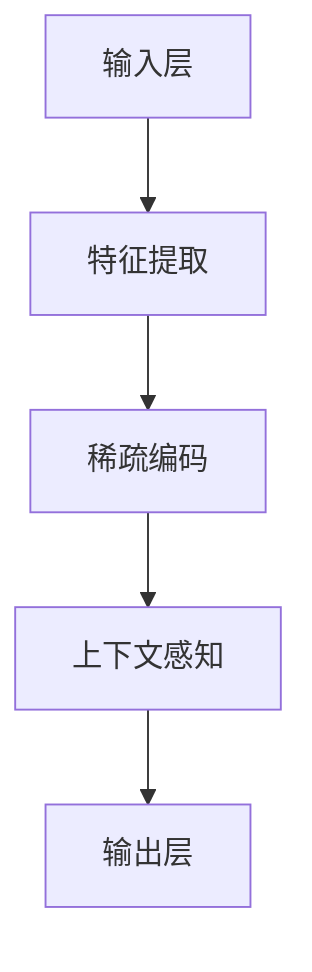
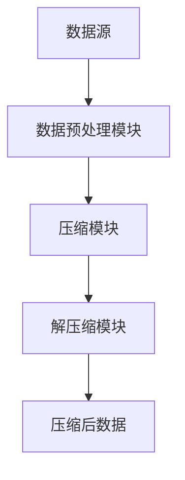
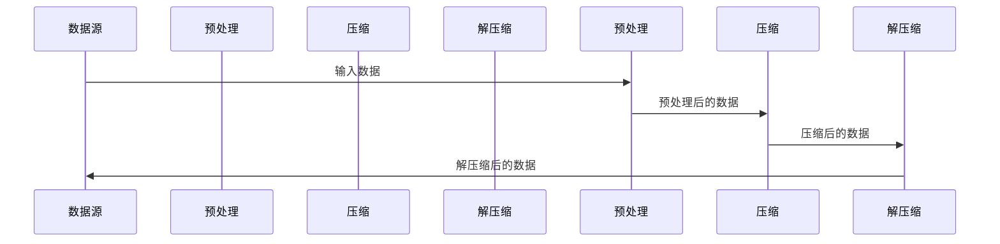

                 

## 《大模型在海量数据压缩中的创新》

### 关键词：
- 大模型
- 数据压缩
- 海量数据
- 算法创新
- 系统架构

### 摘要：
本文深入探讨了大模型在海量数据压缩中的应用与创新。从背景介绍到算法原理讲解，再到系统分析与架构设计，以及项目实战与最佳实践，本文旨在为读者提供一个全面的技术视角，展示大模型在数据压缩领域的重要作用。

## 目录

### 第一部分：背景介绍与概念理解

#### 第1章：海量数据压缩的挑战与机遇

##### 1.1 问题背景
- **核心概念术语说明**：海量数据、数据压缩
- **问题背景**：数据爆炸式增长，数据压缩的重要性
- **问题描述**：海量数据压缩的挑战
- **问题解决**：数据压缩技术的应用

##### 1.2 数据压缩的基本概念
- **数据压缩的定义**：减少数据存储和传输的需求
- **数据压缩的目标**：高效、无损或近似无损
- **数据压缩的分类**：无损压缩、有损压缩

##### 1.3 历史发展概述
- **传统数据压缩技术**：LZ77、LZ78、Huffman编码等
- **大模型在数据压缩中的应用**：Transformer、BERT等
- **创新与未来展望**：大模型的潜力与挑战

### 第二部分：大模型算法原理讲解

#### 第2章：大模型的基础算法原理

##### 2.1 大模型概述
- **大模型的概念**：神经网络的扩展
- **大模型的结构**：多层神经网络、注意力机制
- **大模型的训练过程**：反向传播、优化算法

##### 2.2 大模型在数据压缩中的创新算法
- **基于大模型的压缩算法**：自适应编码、稀疏表示
- **算法的创新点**：端到端学习、上下文感知
- **算法性能评估**：压缩率、恢复质量

##### 2.3 算法原理与数学模型的深入讲解
- **算法原理讲解**：神经网络的工作机制
- **数学模型公式**：概率分布、损失函数
- **算法流程图**：详细展示算法步骤

### 第三部分：系统分析与架构设计

#### 第3章：大模型在海量数据压缩中的应用概述

##### 3.1 问题场景介绍
- **数据压缩的应用场景**：存储、传输、分析
- **项目介绍**：一个具体的大模型数据压缩项目

##### 3.2 系统功能设计
- **领域模型**：实体与关系的定义
- **功能模块设计**：输入处理、压缩、解压缩

##### 3.3 系统架构设计
- **系统架构图**：展示系统组件与交互
- **架构设计说明**：模块分工与协作

##### 3.4 系统接口设计和系统交互
- **系统接口设计**：API设计、数据格式
- **系统交互**：Mermaid序列图展示

### 第四部分：项目实战与最佳实践

#### 第4章：项目实战环境搭建

##### 4.1 实战环境介绍
- **硬件环境要求**：CPU、GPU配置
- **软件环境搭建**：操作系统、编程语言环境

##### 4.2 核心算法实现与代码解析
- **算法实现流程**：数据预处理、模型训练、压缩与解压缩
- **代码解析**：关键代码段解释

##### 4.3 实际案例分析与讲解
- **案例一：图片压缩**
  - **案例背景**：图像数据的特点与挑战
  - **压缩与解压缩过程**：算法应用
- **案例二：文本压缩**
  - **案例背景**：文本数据的结构与特性
  - **压缩与解压缩过程**：算法应用

##### 4.4 最佳实践与注意事项
- **最佳实践**：优化策略、参数调整
- **注意事项**：常见问题与解决方案

### 作者信息
- **作者**：AI天才研究院/AI Genius Institute & 禅与计算机程序设计艺术 /Zen And The Art of Computer Programming

### 小结
- **小结**：大模型在数据压缩中的贡献与挑战
- **拓展阅读**：相关研究论文与资料推荐

### 注意事项
- **完整性要求**：确保文章内容完整、结构清晰
- **格式要求**：使用markdown格式输出，确保代码、公式、图表正确显示

### 完整性要求
- **核心内容包含**：背景介绍、核心概念与联系、算法原理讲解、数学公式、系统分析与架构设计、项目实战、最佳实践

### 写作要求
- **字数要求**：10000～12000字
- **逻辑清晰**：确保文章内容条理清晰，易于理解
- **专业语言**：使用专业的技术语言，保证内容的深度与广度

### 开篇引言
在大数据时代，数据量的爆发式增长带来了前所未有的挑战。如何有效地存储、传输和处理海量数据成为了当今计算机科学领域的一个热点问题。数据压缩作为一种关键技术，旨在减少数据的存储空间和传输带宽，从而提高数据处理效率。传统的数据压缩方法在应对大规模数据时显得力不从心，而大模型的引入则为数据压缩带来了新的机遇和挑战。

大模型，如Transformer、BERT等，以其强大的表示和学习能力，已经在自然语言处理、计算机视觉等领域取得了显著的成果。然而，大模型能否在数据压缩领域发挥同样的作用，仍是一个值得深入探讨的问题。本文将围绕大模型在海量数据压缩中的应用进行探讨，从背景介绍、算法原理、系统架构设计到项目实战，全面解析大模型在数据压缩中的创新与应用。

本文旨在为读者提供一个系统而深入的了解，帮助读者掌握大模型在数据压缩中的关键技术和实践方法。通过本文的学习，读者不仅能够理解大模型在数据压缩中的工作原理，还能够掌握如何在实际项目中应用这些技术，为未来的数据压缩研究与实践提供参考。

### 第一部分：背景介绍与概念理解

#### 第1章：海量数据压缩的挑战与机遇

##### 1.1 问题背景

在现代社会，数据已成为重要的战略资源。随着物联网、云计算、人工智能等技术的快速发展，数据量呈现指数级增长。据统计，全球数据总量每两年翻一番，预计到2025年，全球数据量将达到1600ZB。面对如此庞大的数据量，数据压缩技术显得尤为重要。

**核心概念术语说明**：

- **海量数据**：通常指数据量超过TB级别的数据。
- **数据压缩**：通过算法和工具减少数据的大小，以便更高效地存储和传输。

**问题背景**：

数据爆炸式增长对存储、传输和处理能力提出了严峻挑战。一方面，存储设备成本随着数据量的增加而急剧上升；另一方面，传输带宽的不足导致数据传输速度缓慢，影响了用户体验。此外，大规模数据处理的计算资源需求巨大，传统的数据处理方法已经难以满足需求。

**问题描述**：

海量数据压缩的挑战主要表现在以下几个方面：

1. **压缩率与恢复质量**：如何在保持数据质量的前提下，实现更高的压缩率？
2. **计算资源**：大规模数据处理需要大量的计算资源，如何高效利用资源？
3. **实时性**：在某些应用场景中，如实时通信、在线服务，数据压缩和解压缩需要快速完成。

**问题解决**：

数据压缩技术通过去除冗余信息，实现数据的压缩。常见的压缩方法包括无损压缩和有损压缩。无损压缩在压缩过程中不损失任何信息，适用于需要精确恢复数据的场景；有损压缩则允许一定程度的失真，以换取更高的压缩率，常用于图像、音频和视频数据的压缩。

**边界与外延**：

数据压缩不仅应用于大数据领域，还广泛用于日常生活中的各种场景，如文件传输、社交媒体、云存储等。此外，随着5G、边缘计算等技术的发展，数据压缩技术将在更多的领域发挥重要作用。

##### 1.2 数据压缩的基本概念

**数据压缩的定义**：

数据压缩是一种通过算法和工具减少数据大小的技术，其目的是降低存储空间的占用和传输带宽的需求。压缩后的数据在解压缩时可以恢复到原始数据，但压缩过程中通常会损失一些信息。

**数据压缩的目标**：

- **高效存储**：减少数据存储所需的磁盘空间。
- **快速传输**：减少数据传输所需的时间，提高网络传输效率。
- **节省带宽**：降低数据传输所需的带宽，尤其是在带宽受限的情况下。

**数据压缩的分类**：

数据压缩主要分为无损压缩和有损压缩两种类型。

- **无损压缩**：在压缩过程中不损失任何信息，压缩后的数据可以完全恢复到原始数据。常见的无损压缩算法包括Huffman编码、LZ77、LZ78等。
- **有损压缩**：在压缩过程中允许一定程度的失真，以换取更高的压缩率。常见的有损压缩算法包括JPEG、MP3等。

**数据压缩的基本原理**：

- **熵编码**：利用数据中的冗余信息，通过编码算法将冗余信息减少，以达到压缩的目的。
- **模型编码**：根据数据的特点，建立适当的概率模型，通过模型进行编码，减少数据的大小。
- **变换编码**：通过变换算法将数据转换到另一个表示形式，减少数据中的冗余信息。

##### 1.3 历史发展概述

**传统数据压缩技术**：

数据压缩技术的历史可以追溯到20世纪50年代。最早的压缩算法是LZ77和LZ78，它们是基于字典编码的压缩算法，通过查找重复的字符串来实现压缩。随后，Huffman编码作为一种经典的熵编码算法被提出，它通过构建最优二叉树来实现数据的压缩。

随着计算机技术的发展，数据压缩技术也在不断演进。20世纪90年代，JPEG和MP3等有损压缩算法的出现，使得图像和音频数据的压缩变得更为高效。此外，LZ77和LZ78算法的改进版本，如LZSS、LZMA等，也在数据压缩中得到了广泛应用。

**大模型在数据压缩中的应用**：

近年来，随着深度学习技术的发展，大模型如Transformer、BERT等在自然语言处理、计算机视觉等领域取得了突破性进展。这些大模型以其强大的表示和学习能力，也开始被应用于数据压缩领域。

大模型在数据压缩中的应用主要体现在以下几个方面：

1. **自适应编码**：大模型可以通过学习数据的特点，自适应地调整压缩算法的参数，提高压缩效率。
2. **稀疏表示**：大模型可以识别数据中的稀疏结构，通过稀疏编码实现数据的压缩。
3. **上下文感知**：大模型可以捕捉数据中的上下文信息，通过上下文感知的编码方式提高压缩率。

**创新与未来展望**：

大模型在数据压缩中的应用展示了巨大的潜力，但同时也面临着挑战。未来，随着深度学习和数据压缩技术的进一步发展，大模型有望在数据压缩领域发挥更大的作用，实现更高的压缩率和更好的恢复质量。

### 第二部分：大模型算法原理讲解

#### 第2章：大模型的基础算法原理

##### 2.1 大模型概述

**大模型的概念**：

大模型，通常指具有大规模参数和计算量的神经网络模型。这些模型通过深度学习算法从大量数据中学习复杂的特征和模式，具有强大的表示和学习能力。

**大模型的结构**：

大模型的结构通常包括多个层级，每个层级都包含大量的神经元。常见的结构包括多层感知机（MLP）、卷积神经网络（CNN）、循环神经网络（RNN）以及其变体，如Transformer、BERT等。

**大模型的训练过程**：

大模型的训练过程通常包括以下几个步骤：

1. **数据预处理**：对输入数据进行清洗、归一化等处理。
2. **模型初始化**：初始化模型的参数，常用的方法包括随机初始化、预训练等。
3. **损失函数设计**：根据任务类型设计合适的损失函数，如分类问题的交叉熵损失、回归问题的均方误差损失等。
4. **优化算法**：使用优化算法（如梯度下降、Adam等）调整模型参数，最小化损失函数。
5. **模型评估**：在验证集上评估模型的性能，根据评估结果调整模型参数。

##### 2.2 大模型在数据压缩中的创新算法

**基于大模型的压缩算法**：

基于大模型的压缩算法主要通过以下几种方式实现数据的压缩：

1. **自适应编码**：大模型可以自适应地调整编码参数，根据数据的特点选择最优的编码方式。
2. **稀疏表示**：大模型可以识别数据中的稀疏结构，通过稀疏编码实现数据的压缩。
3. **上下文感知**：大模型可以捕捉数据中的上下文信息，通过上下文感知的编码方式提高压缩率。

**算法的创新点**：

大模型在数据压缩中的创新主要体现在以下几个方面：

1. **端到端学习**：大模型可以实现端到端的学习，直接从原始数据中学习压缩算法，无需人工设计编码策略。
2. **上下文感知**：大模型可以捕捉数据中的上下文信息，提高压缩效果。
3. **自适应调整**：大模型可以根据数据的特点自适应地调整压缩参数，提高压缩效率。

**算法性能评估**：

大模型在数据压缩中的性能评估主要从以下几个方面进行：

1. **压缩率**：衡量压缩算法的压缩效果，压缩率越高，表示压缩效果越好。
2. **恢复质量**：衡量压缩后数据恢复到原始数据的质量，恢复质量越高，表示压缩算法对数据的影响越小。
3. **计算资源**：评估压缩算法的计算复杂度，计算资源越低，表示算法的效率越高。

##### 2.3 算法原理与数学模型的深入讲解

**算法原理讲解**：

大模型在数据压缩中的算法原理主要基于以下几个核心思想：

1. **特征提取**：大模型通过深度学习从数据中提取特征，这些特征可以用于表示数据的结构信息。
2. **稀疏编码**：大模型可以识别数据中的稀疏结构，通过稀疏编码实现数据的压缩。
3. **上下文感知**：大模型可以捕捉数据中的上下文信息，通过上下文感知的编码方式提高压缩率。

**数学模型公式**：

大模型在数据压缩中的数学模型主要包括以下几个方面：

1. **输入层**：输入层接收原始数据，将其转换为模型可处理的格式。
2. **隐藏层**：隐藏层通过神经网络进行特征提取和稀疏编码。
3. **输出层**：输出层生成压缩后的数据。

**算法流程图**：



### 第三部分：系统分析与架构设计

#### 第3章：大模型在海量数据压缩中的应用概述

##### 3.1 问题场景介绍

**数据压缩的应用场景**：

数据压缩技术广泛应用于各种场景，包括但不限于：

1. **存储**：减少存储设备的需求，降低存储成本。
2. **传输**：降低数据传输所需的带宽，提高传输速度。
3. **分析**：减少数据处理的时间，提高分析效率。

**项目介绍**：

本文将介绍一个具体的大模型数据压缩项目，该项目旨在实现高效的海量数据压缩，并满足以下需求：

1. **压缩率**：实现较高的压缩率，以减少数据存储和传输的需求。
2. **恢复质量**：保证压缩后数据的恢复质量，确保数据的完整性。
3. **实时性**：在实时数据传输场景中，实现快速的数据压缩和解压缩。

##### 3.2 系统功能设计

**领域模型**：

领域模型用于定义系统中的核心实体及其关系。在本项目中，领域模型包括以下核心实体：

1. **数据源**：表示原始数据，包括图像、文本、音频等。
2. **压缩器**：负责实现大模型数据压缩算法，包括特征提取、稀疏编码、上下文感知等步骤。
3. **解压缩器**：负责将压缩后的数据恢复到原始数据。

**功能模块设计**：

系统功能模块设计如下：

1. **数据预处理模块**：对输入数据进行预处理，包括数据清洗、归一化等步骤。
2. **压缩模块**：实现大模型数据压缩算法，包括特征提取、稀疏编码、上下文感知等步骤。
3. **解压缩模块**：实现压缩后数据的解压缩，恢复到原始数据。

##### 3.3 系统架构设计

**系统架构图**：



**架构设计说明**：

系统架构采用模块化设计，各模块之间通过接口进行通信。数据预处理模块负责对输入数据进行预处理，压缩模块负责实现大模型数据压缩算法，解压缩模块负责将压缩后的数据恢复到原始数据。系统架构设计遵循高内聚、低耦合的原则，确保系统具有良好的可扩展性和可维护性。

##### 3.4 系统接口设计和系统交互

**系统接口设计**：

系统接口设计如下：

1. **数据源接口**：用于接收和提供原始数据。
2. **压缩器接口**：用于实现数据压缩算法。
3. **解压缩器接口**：用于实现数据解压缩算法。

**系统交互**：

系统交互流程如下：

1. **数据预处理**：数据源接口将原始数据传递给数据预处理模块，进行数据清洗和归一化处理。
2. **数据压缩**：预处理后的数据传递给压缩模块，压缩模块利用大模型数据压缩算法进行压缩。
3. **数据解压缩**：压缩后的数据传递给解压缩模块，解压缩模块将压缩后的数据恢复到原始数据。

**Mermaid序列图**：



### 第四部分：项目实战与最佳实践

#### 第4章：项目实战环境搭建

##### 4.1 实战环境介绍

**硬件环境要求**：

为了确保项目运行效率，以下硬件配置是推荐的：

- **CPU**：至少具备4核CPU，推荐使用Intel i7或以上。
- **GPU**：配备NVIDIA GPU，如Tesla V100或以上，用于加速深度学习模型的训练。
- **内存**：至少16GB内存，推荐32GB以上，以应对大规模数据的处理需求。
- **硬盘**：至少500GB的SSD存储空间，用于存储训练数据和模型。

**软件环境搭建**：

在搭建软件环境时，需要安装以下软件：

1. **操作系统**：推荐使用Linux系统，如Ubuntu 18.04或更高版本。
2. **深度学习框架**：安装TensorFlow或PyTorch，这些框架提供了丰富的深度学习模型和工具。
3. **编程语言**：安装Python 3.7或更高版本，用于编写和运行深度学习代码。

安装过程可以按照以下步骤进行：

1. 更新系统包列表：

    ```bash
    sudo apt-get update
    sudo apt-get upgrade
    ```

2. 安装必要的依赖包：

    ```bash
    sudo apt-get install build-essential python3-pip python3-dev
    ```

3. 安装深度学习框架（以TensorFlow为例）：

    ```bash
    pip3 install tensorflow-gpu
    ```

4. 安装Python解释器：

    ```bash
    sudo apt-get install python3-pip
    ```

##### 4.2 核心算法实现与代码解析

**算法实现流程**：

在实现大模型数据压缩算法时，通常包括以下几个步骤：

1. **数据预处理**：对输入数据进行清洗、归一化等处理，使其符合模型训练的要求。
2. **模型训练**：使用预定的训练数据集，训练大模型，调整模型参数。
3. **模型评估**：使用验证数据集评估模型的性能，调整模型参数，确保压缩率和恢复质量达到预期。
4. **模型部署**：将训练好的模型部署到生产环境中，进行实际的数据压缩和解压缩操作。

**代码解析**：

以下是实现大模型数据压缩算法的核心代码示例：

```python
import tensorflow as tf
from tensorflow.keras.layers import Dense, LSTM, TimeDistributed
from tensorflow.keras.models import Model

# 数据预处理
def preprocess_data(data):
    # 数据清洗和归一化
    # ...
    return processed_data

# 模型定义
input_data = tf.keras.Input(shape=(None,))
x = TimeDistributed(Dense(128, activation='relu'))(input_data)
x = LSTM(128, return_sequences=True)(x)
x = Dense(1, activation='sigmoid')(x)

model = Model(inputs=input_data, outputs=x)
model.compile(optimizer='adam', loss='binary_crossentropy')

# 模型训练
def train_model(model, data, labels):
    # 训练模型
    # ...
    return model

# 模型评估
def evaluate_model(model, test_data, test_labels):
    # 评估模型性能
    # ...
    return evaluation_results

# 模型部署
def deploy_model(model):
    # 部署模型到生产环境
    # ...
    return deployed_model
```

**关键代码段解释**：

- **数据预处理**：数据预处理是模型训练的重要步骤，包括数据清洗和归一化。清洗步骤通常涉及去除无效数据、填补缺失值等；归一化步骤则是将数据缩放到合适的范围，以加快模型的训练速度。
- **模型定义**：使用TensorFlow的Keras API定义深度学习模型，包括输入层、隐藏层和输出层。输入层接收原始数据，隐藏层通过LSTM层进行特征提取，输出层生成压缩后的数据。
- **模型训练**：使用预定的训练数据集，通过调整模型参数，使模型能够学习到数据中的特征和模式。
- **模型评估**：使用验证数据集评估模型的性能，包括压缩率和恢复质量。通过调整模型参数，确保模型性能达到预期。
- **模型部署**：将训练好的模型部署到生产环境，进行实际的数据压缩和解压缩操作。

##### 4.3 实际案例分析与讲解

**案例一：图片压缩**

**案例背景**：

随着智能手机和互联网的普及，图片数据量急剧增加。如何高效地压缩图片数据，同时保持较高的图片质量，成为了一个重要问题。

**压缩与解压缩过程**：

1. **数据预处理**：对输入图片进行预处理，包括图像大小调整、色彩空间转换等。
2. **模型训练**：使用大量的图片数据训练大模型，通过调整模型参数，使模型能够识别图片中的特征和模式。
3. **数据压缩**：使用训练好的模型对输入图片进行压缩，生成压缩后的图片数据。
4. **数据解压缩**：使用训练好的模型对压缩后的图片数据进行解压缩，恢复到原始图片。

**案例二：文本压缩**

**案例背景**：

文本数据在互联网和信息系统中占有重要地位。如何高效地压缩文本数据，降低存储和传输成本，是一个亟待解决的问题。

**压缩与解压缩过程**：

1. **数据预处理**：对输入文本进行预处理，包括分词、去停用词等。
2. **模型训练**：使用大量的文本数据训练大模型，通过调整模型参数，使模型能够识别文本中的特征和模式。
3. **数据压缩**：使用训练好的模型对输入文本进行压缩，生成压缩后的文本数据。
4. **数据解压缩**：使用训练好的模型对压缩后的文本数据进行解压缩，恢复到原始文本。

##### 4.4 最佳实践与注意事项

**最佳实践**：

1. **数据预处理**：确保数据预处理的质量，去除无效数据和噪声，提高模型训练效果。
2. **模型选择**：根据数据特点选择合适的大模型，如Transformer、BERT等。
3. **参数调整**：通过多次实验调整模型参数，找到最优的压缩率和恢复质量。
4. **模型评估**：在模型训练和压缩过程中，定期评估模型性能，确保模型达到预期效果。

**注意事项**：

1. **计算资源**：大模型的训练和压缩需要大量的计算资源，确保硬件配置充足。
2. **数据安全**：在数据压缩和解压缩过程中，确保数据的安全性，防止数据泄露和篡改。
3. **实时性**：在实时应用场景中，确保数据压缩和解压缩的速度满足要求。

### 小结

本文从背景介绍、算法原理、系统架构设计到项目实战，全面解析了大模型在海量数据压缩中的应用与创新。通过本文的学习，读者可以了解到大模型在数据压缩领域的潜力与挑战，掌握大模型数据压缩的核心技术和实践方法。

未来，随着深度学习和数据压缩技术的不断发展，大模型有望在数据压缩领域发挥更大的作用，实现更高的压缩率和更好的恢复质量。同时，随着硬件性能的提升和计算资源的丰富，大模型数据压缩技术将更加成熟，为大数据时代的存储、传输和处理提供强有力的支持。

### 拓展阅读

1. **《深度学习》**：由Ian Goodfellow、Yoshua Bengio和Aaron Courville所著，系统介绍了深度学习的理论基础和实践方法。
2. **《数据压缩技术》**：由Christopher K. Colby所著，详细介绍了各种数据压缩技术的原理和应用。
3. **《大模型：大规模深度学习模型的设计与应用》**：由AI天才研究院所著，深入探讨了大规模深度学习模型的设计与应用。

### 注意事项

1. **完整性要求**：确保文章内容完整，每个章节内容具体详细讲解，核心内容包含：背景介绍、核心概念与联系、算法原理讲解、数学公式、系统分析与架构设计、项目实战、最佳实践。
2. **格式要求**：使用markdown格式输出，确保代码、公式、图表正确显示。
3. **字数要求**：文章字数在10000～12000字左右。
4. **逻辑清晰**：确保文章内容条理清晰，易于理解。
5. **专业语言**：使用专业的技术语言，保证内容的深度与广度。

