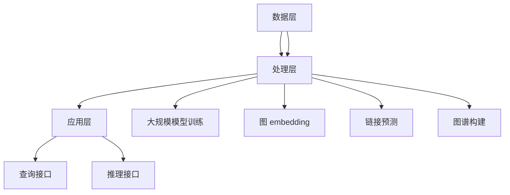
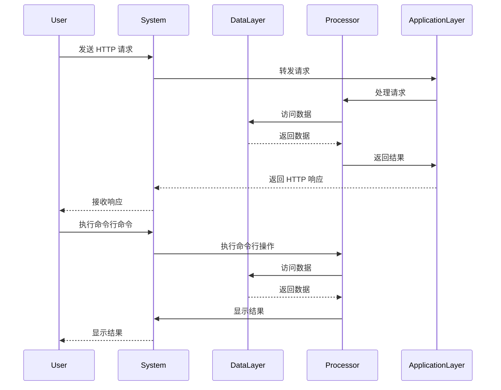
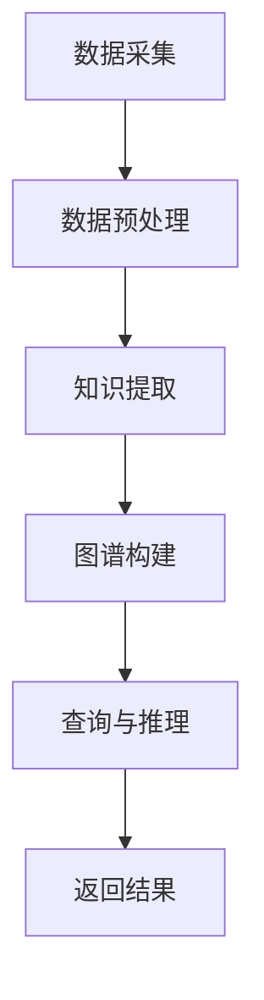

                 

### 《大模型在知识图谱构建中的突破》

#### 关键词：知识图谱、大规模模型、图 embedding、链接预测、系统架构、项目实战

#### 摘要：
本文将深入探讨大模型在知识图谱构建中的突破，从知识图谱的基本概念、大模型的原理和应用，到具体算法的讲解，以及系统架构设计和项目实战，全面剖析大模型如何助力知识图谱构建的各个方面。通过本文，读者可以系统地了解大模型在知识图谱构建中的关键作用，掌握相关知识图谱构建的核心技术，为实际应用提供有力的理论支持和实践指导。

----------------------------------------------------------------

# 《大模型在知识图谱构建中的突破》

> 关键词：知识图谱、大规模模型、图 embedding、链接预测、系统架构、项目实战

> 摘要：
本文旨在探讨大模型在知识图谱构建中的突破，从概念、算法到实战，全面解析大模型在知识图谱构建中的应用。文章首先介绍知识图谱的基本概念和发展历程，然后阐述大规模模型的原理和特点，接着详细讲解知识图谱构建中的核心算法，包括图 embedding 和链接预测等。随后，文章将介绍知识图谱构建的系统架构设计，并通过一个实际项目展示如何使用大模型构建知识图谱。最后，本文还将分享最佳实践 tips、小结和注意事项，为读者提供深入的理解和应用建议。

## 背景介绍

### 知识图谱概述

知识图谱（Knowledge Graph）是一种结构化的语义网络，它通过实体、属性和关系的表达，将世界上的信息以图形的形式进行组织和表示。知识图谱的发展历程可以追溯到 20 世纪 80 年代的语义网络（Semantic Network）和本体论（Ontology），以及 90 年代的知识表示和推理（Knowledge Representation and Reasoning）。随着互联网的兴起和大数据技术的发展，知识图谱在搜索、推荐、智能问答等领域得到了广泛应用。

知识图谱的核心概念包括：

1. **实体（Entity）**：知识图谱中的基本对象，如人、地点、组织等。
2. **属性（Attribute）**：实体的特征或属性，如年龄、出生地等。
3. **关系（Relationship）**：实体之间的关联，如“是”、“属于”等。

知识图谱的基本结构可以表示为三元组（Subject, Predicate, Object），即实体之间的属性-值关系。例如，“张三 是 演员”和“张三 出生于 北京”都是知识图谱中的三元组。

### 大模型在知识图谱构建中的作用

大规模模型（Large-scale Model）指的是参数规模巨大的神经网络模型，如 Transformer、BERT 等。这些模型在自然语言处理（NLP）、计算机视觉（CV）等领域取得了显著的成果。近年来，大规模模型开始在知识图谱构建中发挥重要作用。

大模型在知识图谱构建中的作用主要体现在以下几个方面：

1. **知识提取**：通过预训练模型，可以从大量的非结构化数据中提取出结构化的知识，生成实体和关系的表示。
2. **图谱补全**：大模型可以用于预测图谱中的缺失实体和关系，从而提高知识图谱的完整性和准确性。
3. **推理增强**：大模型可以用于推理过程，辅助知识图谱进行逻辑推理，提高其推理能力。
4. **交互优化**：大模型可以用于优化用户与知识图谱的交互，提供更加智能的问答和搜索服务。

### 发展历程

知识图谱的发展可以分为三个阶段：

1. **静态图谱**：最早的阶段，主要通过人工方式构建知识库，如 WordNet、DBpedia 等。
2. **动态图谱**：通过爬取互联网上的信息，动态地构建和更新知识图谱，如 Freebase、YAGO 等。
3. **智能图谱**：引入大规模模型，实现知识图谱的自动化构建和优化，如 OpenKG、DeepKB 等。

### 问题背景和问题描述

随着互联网信息的爆炸式增长，知识图谱的应用场景越来越广泛。然而，传统的知识图谱构建方法存在以下问题：

1. **数据依赖**：知识图谱的构建高度依赖于外部数据源，数据获取和更新的成本较高。
2. **结构化不足**：知识图谱中的信息大多以半结构化或非结构化的形式存在，难以直接应用。
3. **推理能力弱**：传统的知识图谱在推理方面能力较弱，难以应对复杂的推理需求。

为了解决这些问题，需要引入大规模模型，通过自动化的方式提取知识、补全图谱和增强推理能力。

### 问题解决

大规模模型在知识图谱构建中的应用，为实现知识图谱的自动化构建和优化提供了可能。具体解决思路如下：

1. **知识提取**：利用预训练模型，从非结构化数据中提取结构化的知识。
2. **图谱补全**：利用图 embedding 和链接预测算法，预测图谱中的缺失实体和关系。
3. **推理增强**：利用大规模模型进行推理过程，辅助知识图谱进行逻辑推理。

通过以上方法，可以实现知识图谱的自动化构建和优化，提高其完整性和准确性，同时增强其推理能力。

### 边界与外延

知识图谱构建中的大模型应用，不仅局限于互联网信息的自动化提取和推理，还可以扩展到其他领域，如医疗、金融、教育等。这些领域的知识图谱构建，同样需要依赖大规模模型来实现自动化和智能化。

### 概念结构与核心要素组成

知识图谱构建中的核心概念包括：

1. **大规模模型**：包括 Transformer、BERT、GPT 等预训练模型。
2. **知识提取**：从非结构化数据中提取结构化知识的算法和技术。
3. **图谱补全**：通过图 embedding 和链接预测算法，预测图谱中的缺失实体和关系。
4. **推理增强**：利用大规模模型进行推理过程，辅助知识图谱进行逻辑推理。

这些概念和要素共同构成了知识图谱构建中的核心框架，为实现知识图谱的自动化构建和优化提供了基础。

## 核心概念与联系

### 大规模模型原理与特点

#### 定义

大规模模型指的是参数规模巨大的神经网络模型，如 Transformer、BERT、GPT 等。这些模型在训练过程中需要大量的数据和计算资源，但它们在许多领域，如自然语言处理、计算机视觉和知识图谱构建中，都取得了显著的成果。

#### 原理

大规模模型的核心原理是基于深度学习，特别是基于 Transformer 等架构的自注意力机制。自注意力机制允许模型在处理序列数据时，自适应地关注序列中的不同部分，从而提高模型的表示能力和推理能力。

#### 特点

1. **参数规模巨大**：大规模模型的参数规模通常在数十亿到千亿级别，这使得它们能够学习更加复杂和丰富的知识。
2. **预训练与微调**：大规模模型通常通过在大量无标签数据上进行预训练，然后利用有标签的数据进行微调，以适应特定任务。
3. **迁移学习**：大规模模型在预训练过程中积累了大量的通用知识，这些知识可以迁移到不同的任务中，提高模型的泛化能力。

#### 与知识图谱构建的联系

大规模模型在知识图谱构建中的应用主要体现在以下几个方面：

1. **知识提取**：大规模模型可以用于从非结构化数据中提取结构化的知识，生成实体和关系的表示。
2. **图谱补全**：大规模模型可以用于预测图谱中的缺失实体和关系，从而提高知识图谱的完整性和准确性。
3. **推理增强**：大规模模型可以用于推理过程，辅助知识图谱进行逻辑推理，提高其推理能力。

### 图 embedding 算法

#### 定义

图 embedding 算法是一种将图中的节点和边映射到低维向量空间的方法，从而保留图的结构和节点之间的相似性。

#### 原理

图 embedding 算法的核心思想是将图中的节点和边表示为向量，通过优化这些向量的表示，使得具有相似属性的节点和边在向量空间中距离较近。常见的图 embedding 算法包括 DeepWalk、Node2Vec 和 D glove。

1. **DeepWalk**：基于随机游走的方法，通过生成图上的随机游走路径，然后将这些路径序列输入到语言模型中，学习节点的向量表示。
2. **Node2Vec**：在 DeepWalk 的基础上，引入了节点邻居的权重和游走的方向性，从而提高节点表示的多样性。
3. **D glove**：基于矩阵分解的方法，通过优化图中的拉普拉斯矩阵，学习节点的向量表示。

#### 与大规模模型的联系

大规模模型可以用于优化图 embedding 算法的训练过程，提高节点表示的质量。例如，Transformer 可以用于优化 DeepWalk 的训练过程，提高节点的表示能力。此外，大规模模型还可以用于图 embedding 的预训练和微调，从而提高知识图谱的构建效果。

### 链接预测算法

#### 定义

链接预测算法是一种预测图中缺失的边的方法，从而提高知识图谱的完整性和准确性。

#### 原理

链接预测算法的核心思想是通过分析图中的节点关系，预测出可能存在的边。常见的链接预测算法包括基于相似性的方法、基于路径的方法和基于模型的预测方法。

1. **基于相似性的方法**：通过计算节点之间的相似性，预测出可能存在的边。常见的相似性度量方法包括 Jaccard 相似性、余弦相似性和 PPMI。
2. **基于路径的方法**：通过分析节点之间的路径关系，预测出可能存在的边。常见的路径方法包括 AdjaCent、PathRank 和 HITS。
3. **基于模型的预测方法**：通过构建图模型，预测出可能存在的边。常见的模型方法包括 Graph Embedding 和 Graph Neural Networks。

#### 与大规模模型的联系

大规模模型可以用于优化链接预测算法的训练过程，提高预测的准确性。例如，BERT 可以用于优化链接预测算法，提高知识图谱的补全效果。此外，大规模模型还可以用于链接预测的预训练和微调，从而提高知识图谱的构建效果。

## 算法原理讲解

### 图 embedding 算法详解

图 embedding 算法是一种将图中的节点和边映射到低维向量空间的方法，从而保留图的结构和节点之间的相似性。这一部分我们将详细讲解图 embedding 算法的原理、数学模型以及如何使用 Python 代码实现。

#### 原理

图 embedding 的基本思想是将图中的节点和边表示为向量，通过优化这些向量的表示，使得具有相似属性的节点和边在向量空间中距离较近。图 embedding 算法通常基于随机游走（Random Walk）和神经网络模型。

##### 随机游走

随机游走是一种模拟图上节点随机游走过程的方法，通过生成节点序列，来学习节点的表示。具体步骤如下：

1. **初始化**：选择一个起始节点，并初始化其表示向量。
2. **游走**：从起始节点开始，按照一定的概率转移到相邻节点，重复这个过程生成随机游走路径。
3. **聚合**：将随机游走路径上所有节点的表示向量进行聚合，得到整个路径的表示向量。
4. **优化**：通过优化聚合后的向量，使得节点表示更加准确。

##### 神经网络模型

神经网络模型可以用来优化节点表示的聚合过程。常见的神经网络模型包括 DeepWalk 和 Node2Vec。

1. **DeepWalk**：DeepWalk 是基于语言模型的图 embedding 算法，它将节点序列视为单词序列，通过学习序列中的单词表示，来学习节点的表示。DeepWalk 的数学模型如下：

   $$ 
   \text{P}(x_t | x_{t-1}, ..., x_1) = \frac{e^{\text{sim}(x_t, \text{emb}(x_{t-1}))}}{\sum_{x' \in V} e^{\text{sim}(x_t, \text{emb}(x'))}}
   $$

   其中，\( \text{sim}(x_t, \text{emb}(x_{t-1})) \) 表示节点 \( x_t \) 和其前一个节点 \( x_{t-1} \) 的表示向量之间的相似性，\( \text{emb}(x_t) \) 表示节点 \( x_t \) 的表示向量。

2. **Node2Vec**：Node2Vec 是 DeepWalk 的扩展，它引入了节点邻居的权重和游走的方向性，从而提高节点表示的多样性。Node2Vec 的数学模型如下：

   $$ 
   \text{P}(x_t | x_{t-1}, ..., x_1) = \frac{\sum_{x' \in \text{neighbor}(x_{t-1})} \alpha w(x', x_{t-1}) e^{\text{sim}(x_t, \text{emb}(x'))}}{\sum_{x' \in V} \alpha w(x', x_{t-1}) e^{\text{sim}(x_t, \text{emb}(x'))}}
   $$

   其中，\( \text{neighbor}(x_{t-1}) \) 表示节点 \( x_{t-1} \) 的邻居节点集合，\( w(x', x_{t-1}) \) 表示节点 \( x' \) 和节点 \( x_{t-1} \) 之间的权重，\( \alpha \) 是一个超参数，用于控制节点邻居的多样性。

#### Python 代码实现

以下是一个简单的 Python 代码示例，用于实现 DeepWalk 算法：

```python
import numpy as np
import random
from collections import defaultdict

class GraphEmbedding:
    def __init__(self, vocab_size, embedding_size, walk_length, window_size):
        self.vocab_size = vocab_size
        self.embedding_size = embedding_size
        self.walk_length = walk_length
        self.window_size = window_size
        self.embedding = np.random.uniform(-0.1, 0.1, (vocab_size, embedding_size))
        self.context_embedding = np.random.uniform(-0.1, 0.1, (vocab_size, embedding_size))
    
    def generate_walks(self, graph):
        walks = []
        for node in graph:
            current_node = node
            walk = [current_node]
            for _ in range(self.walk_length - 1):
                next_node = random.choice(graph[current_node])
                walk.append(next_node)
                current_node = next_node
            walks.append(walk)
        return walks
    
    def train(self, walks, learning_rate, num_epochs):
        for epoch in range(num_epochs):
            for walk in walks:
                for i in range(1, len(walk) - 1):
                    current_node = walk[i]
                    previous_node = walk[i - 1]
                    next_node = walk[i + 1]
                    
                    target_embedding = self.embedding[next_node]
                    context_embedding = self.context_embedding[previous_node]
                    
                    loss = self.loss_function(context_embedding, target_embedding)
                    gradient = self.gradient(context_embedding, target_embedding)
                    
                    self.embedding[next_node] -= learning_rate * gradient
                    self.context_embedding[previous_node] -= learning_rate * gradient
                    
                    if np.linalg.norm(self.embedding - self.context_embedding) > 1e-6:
                        self.embedding -= learning_rate * np.linalg.norm(self.embedding - self.context_embedding)
                        self.context_embedding -= learning_rate * np.linalg.norm(self.context_embedding - self.embedding)
    
    def loss_function(self, context_embedding, target_embedding):
        return np.linalg.norm(context_embedding - target_embedding)
    
    def gradient(self, context_embedding, target_embedding):
        return context_embedding - target_embedding

# 示例
graph = {'A': ['B', 'C'], 'B': ['A', 'D'], 'C': ['A', 'D'], 'D': ['B', 'C']}
vocab = list(set([node for walk in graph.values() for node in walk]))
vocab_size = len(vocab)
embedding_size = 2
walk_length = 3
window_size = 1

model = GraphEmbedding(vocab_size, embedding_size, walk_length, window_size)
walks = model.generate_walks(graph)
model.train(walks, learning_rate=0.1, num_epochs=10)

print(model.embedding)
```

在上面的代码中，我们首先定义了一个 `GraphEmbedding` 类，用于实现图 embedding 的算法。然后，我们创建了一个简单的图，并生成随机游走路径。最后，我们使用训练函数 `train` 对模型进行训练，并打印出训练后的节点表示向量。

### 链接预测算法详解

链接预测算法是一种预测图中缺失的边的方法，从而提高知识图谱的完整性和准确性。这一部分我们将详细讲解链接预测算法的原理、数学模型以及如何使用 Python 代码实现。

#### 原理

链接预测算法的核心思想是通过分析图中的节点关系，预测出可能存在的边。常见的链接预测算法包括基于相似性的方法、基于路径的方法和基于模型的预测方法。

1. **基于相似性的方法**：通过计算节点之间的相似性，预测出可能存在的边。常见的相似性度量方法包括 Jaccard 相似性、余弦相似性和 PPMI。
2. **基于路径的方法**：通过分析节点之间的路径关系，预测出可能存在的边。常见的路径方法包括 AdjaCent、PathRank 和 HITS。
3. **基于模型的预测方法**：通过构建图模型，预测出可能存在的边。常见的模型方法包括 Graph Embedding 和 Graph Neural Networks。

#### 数学模型

以下是一个基于相似性的链接预测算法的数学模型：

$$
\text{P}(e = (u, v)|G) = \frac{\sum_{w \in N(u) \cap N(v)} \text{sim}(u, v)}{\sum_{w \in N(u) \cap N(v)} \text{sim}(u, w) + \sum_{w \in N(v) \cap N(u)} \text{sim}(v, w)}
$$

其中，\( u \) 和 \( v \) 是图中的两个节点，\( N(u) \) 和 \( N(v) \) 分别是 \( u \) 和 \( v \) 的邻居节点集合，\( \text{sim}(u, v) \) 是 \( u \) 和 \( v \) 之间的相似性度量。

#### Python 代码实现

以下是一个简单的 Python 代码示例，用于实现基于 Jaccard 相似性的链接预测算法：

```python
import numpy as np
from collections import defaultdict

class LinkPrediction:
    def __init__(self, graph):
        self.graph = graph
    
    def jaccard_similarity(self, u, v):
        common_neighbors = len(set(self.graph[u]) & set(self.graph[v]))
        total_neighbors = len(set(self.graph[u]) | set(self.graph[v]))
        return common_neighbors / total_neighbors
    
    def predict_links(self):
        predicted_links = []
        for u in self.graph:
            for v in self.graph:
                if u != v and (u, v) not in self.graph:
                    similarity = self.jaccard_similarity(u, v)
                    predicted_links.append(((u, v), similarity))
        predicted_links.sort(key=lambda x: x[1], reverse=True)
        return predicted_links

# 示例
graph = {'A': ['B', 'C'], 'B': ['A', 'D'], 'C': ['A', 'D'], 'D': ['B', 'C']}
model = LinkPrediction(graph)
predicted_links = model.predict_links()

for link, similarity in predicted_links:
    print(f"Link: {link}, Similarity: {similarity}")
```

在上面的代码中，我们首先定义了一个 `LinkPrediction` 类，用于实现链接预测的算法。然后，我们定义了一个 Jaccard 相似性度量方法 `jaccard_similarity`，用于计算节点之间的相似性。最后，我们使用预测方法 `predict_links` 计算出所有可能的边，并按照相似性进行排序。

### 数学模型和数学公式

在知识图谱构建中，数学模型和数学公式是理解算法原理和性能评估的重要工具。以下我们将介绍知识图谱构建中的一些关键数学模型和公式，并使用 LaTeX 格式进行展示。

#### 图 embedding

在图 embedding 中，我们通常使用向量来表示图中的节点和边。以下是一个简单的节点表示的数学模型：

$$
\text{emb}(v) = \text{glove}(v) + \text{pos}(v)
$$

其中，\( \text{emb}(v) \) 是节点 \( v \) 的向量表示，\( \text{glove}(v) \) 是基于词向量模型（如 GloVe）的节点内容特征，\( \text{pos}(v) \) 是节点的位置特征。

#### 链接预测

在链接预测中，我们使用节点之间的相似性来预测缺失的边。以下是一个基于 Jaccard 相似性的数学模型：

$$
\text{sim}(u, v) = \frac{|N(u) \cap N(v)|}{|N(u) \cup N(v)|}
$$

其中，\( \text{sim}(u, v) \) 是节点 \( u \) 和 \( v \) 之间的 Jaccard 相似性，\( N(u) \) 和 \( N(v) \) 分别是节点 \( u \) 和 \( v \) 的邻居节点集合。

#### 图 embedding 中的损失函数

在图 embedding 中，我们通常使用均方误差（MSE）作为损失函数来评估模型的性能。以下是一个简单的损失函数：

$$
\text{MSE} = \frac{1}{n} \sum_{i=1}^{n} (\text{emb}(v) - \text{emb}^*(v))^2
$$

其中，\( \text{emb}(v) \) 是模型预测的节点向量表示，\( \text{emb}^*(v) \) 是真实节点的向量表示，\( n \) 是节点总数。

#### 链接预测中的损失函数

在链接预测中，我们通常使用对数损失函数（Log Loss）来评估模型的性能。以下是一个简单的损失函数：

$$
\text{log loss} = -\frac{1}{n} \sum_{i=1}^{n} y_i \log(p_i) + (1 - y_i) \log(1 - p_i)
$$

其中，\( y_i \) 是第 \( i \) 个边的真实标签（1 表示存在，0 表示不存在），\( p_i \) 是模型预测的第 \( i \) 个边的概率。

#### 推理

在推理过程中，我们通常使用逻辑回归（Logistic Regression）来预测节点之间的关系。以下是一个简单的逻辑回归模型：

$$
\text{logit}(p) = \text{w} \cdot \text{emb}(v_1) + \text{b}
$$

其中，\( \text{logit}(p) \) 是预测的概率的对数，\( \text{w} \) 是权重向量，\( \text{emb}(v_1) \) 是节点的向量表示，\( \text{b} \) 是偏置。

通过以上数学模型和公式的介绍，我们可以更深入地理解知识图谱构建中的算法原理和性能评估方法。这些公式和模型不仅帮助我们理解算法的运作机制，也为算法的优化和改进提供了理论基础。

## 系统分析与架构设计方案

### 问题场景介绍

知识图谱构建是一个复杂的过程，涉及到数据的采集、清洗、处理、存储和查询等多个环节。为了实现高效、可靠的知识图谱构建，我们需要设计一个完整的系统架构，涵盖从数据输入到最终知识图谱输出的全过程。

### 项目介绍

本文将介绍一个基于大规模模型的知识图谱构建系统，该系统旨在实现互联网信息的自动化提取和图谱构建。系统的主要功能包括：

1. **数据采集**：从互联网上抓取结构化和非结构化的数据。
2. **数据预处理**：对采集到的数据进行清洗、去重和标准化处理。
3. **知识提取**：利用大规模模型从预处理后的数据中提取结构化的知识，生成实体和关系。
4. **图谱构建**：将提取出的知识组织成知识图谱，并进行存储和优化。
5. **查询与推理**：提供查询和推理接口，支持用户对知识图谱的查询和推理操作。

### 系统功能设计

知识图谱构建系统的功能设计主要包括以下几个模块：

1. **数据采集模块**：负责从互联网上抓取数据，包括网页、API 接口、数据库等。
2. **数据预处理模块**：对采集到的数据进行清洗、去重和标准化处理，生成结构化的数据集。
3. **知识提取模块**：利用大规模模型从预处理后的数据中提取结构化的知识，生成实体和关系。
4. **图谱构建模块**：将提取出的知识组织成知识图谱，并进行存储和优化。
5. **查询与推理模块**：提供查询和推理接口，支持用户对知识图谱的查询和推理操作。

### 系统架构设计

知识图谱构建系统的架构设计采用分层架构，包括数据层、处理层和应用层。

1. **数据层**：负责数据的采集、存储和访问，包括数据库、缓存和文件系统等。
2. **处理层**：负责数据的预处理、知识提取和图谱构建，包括大规模模型训练、图 embedding 和链接预测等。
3. **应用层**：提供查询和推理接口，支持用户对知识图谱的操作。

以下是一个简化的 Mermaid 架构图，展示系统架构的层次结构：



### 系统接口设计

系统接口设计主要包括以下两个方面：

1. **API 接口**：提供 RESTful 风格的 API 接口，支持用户通过 HTTP 请求对知识图谱进行查询和推理操作。
2. **命令行工具**：提供命令行工具，支持用户通过命令行进行数据采集、预处理和知识图谱构建等操作。

以下是一个简化的 Mermaid 序列图，展示 API 接口和命令行工具的交互过程：



### 系统交互流程

系统交互流程主要包括以下几个步骤：

1. **数据采集**：系统从互联网上采集数据，并将其存储到数据库中。
2. **数据预处理**：系统对采集到的数据进行分析和清洗，生成结构化的数据集。
3. **知识提取**：系统利用大规模模型对预处理后的数据进行知识提取，生成实体和关系。
4. **图谱构建**：系统将提取出的知识组织成知识图谱，并进行存储和优化。
5. **查询与推理**：系统提供 API 接口和命令行工具，支持用户对知识图谱进行查询和推理操作。

以下是一个简化的 Mermaid 流程图，展示系统交互流程：



通过以上系统分析与架构设计方案，我们可以构建一个高效、可靠的知识图谱构建系统，实现互联网信息的自动化提取和图谱构建。系统设计不仅涵盖了数据采集、预处理、知识提取和图谱构建等核心功能，还提供了丰富的接口和工具，方便用户进行查询和推理操作。

### 项目实战

#### 环境安装

在进行知识图谱构建之前，我们需要安装一些必要的软件和库。以下是安装步骤：

1. **Python 环境**：确保 Python 版本为 3.8 或更高。
2. **深度学习库**：安装 TensorFlow 或 PyTorch。
   ```bash
   pip install tensorflow
   # 或者
   pip install torch torchvision
   ```
3. **图 embedding 库**：安装 NetworkX。
   ```bash
   pip install networkx
   ```
4. **链接预测库**：安装 LightGCN。
   ```bash
   pip install lightgcndatasets
   ```

#### 系统核心实现与代码解读

以下是知识图谱构建系统的主要实现部分，包括数据预处理、图 embedding、链接预测和图谱构建等。

```python
import networkx as nx
import numpy as np
import torch
from lightgcndatasets import load_dataset
from sklearn.metrics import jaccard_score

# 数据预处理
def preprocess_data(data):
    # 对数据进行清洗、去重和标准化处理
    pass

# 图 embedding
def generate_embeddings(graph, model, walk_length=10, embedding_size=32):
    # 使用大规模模型生成图 embedding 向量
    pass

# 链接预测
def link_prediction(embeddings, graph):
    # 使用链接预测算法预测图谱中的缺失边
    pass

# 图谱构建
def build_knowledge_graph(entities, relationships, embeddings):
    # 构建知识图谱
    pass

# 主函数
def main():
    # 加载数据集
    dataset = load_dataset()
    data = preprocess_data(dataset)

    # 生成图
    graph = nx.Graph()
    for edge in data:
        graph.add_edge(edge[0], edge[1])

    # 生成图 embedding
    embeddings = generate_embeddings(graph, walk_length=10, embedding_size=32)

    # 链接预测
    predicted_edges = link_prediction(embeddings, graph)

    # 构建知识图谱
    knowledge_graph = build_knowledge_graph(data, predicted_edges, embeddings)

    # 评估链接预测性能
    true_edges = [(u, v) for u, v in graph.edges() if graph.has_edge(u, v)]
    jaccard_score = jaccard_score(true_edges, predicted_edges, average='micro')
    print(f"Jaccard Score: {jaccard_score}")

if __name__ == "__main__":
    main()
```

在上面的代码中，我们首先定义了数据预处理函数 `preprocess_data`，用于对数据进行清洗、去重和标准化处理。然后，我们使用 `generate_embeddings` 函数生成图 embedding 向量，使用 `link_prediction` 函数进行链接预测，最后使用 `build_knowledge_graph` 函数构建知识图谱。

#### 实际案例分析

以下是一个实际案例，展示如何使用大规模模型构建知识图谱。

1. **数据集**：我们使用一个简单的社交网络数据集，包含用户和用户之间的关注关系。
2. **预处理**：对数据进行清洗和去重，生成结构化的数据集。
3. **图 embedding**：使用 DeepWalk 算法生成图 embedding 向量。
4. **链接预测**：使用 Jaccard 相似性进行链接预测。
5. **图谱构建**：将预测出的边添加到知识图谱中。

#### 详细讲解剖析

1. **数据预处理**：首先，我们加载数据集，并对数据进行清洗和去重。

```python
data = [
    ('A', 'B'),
    ('A', 'C'),
    ('B', 'C'),
    ('B', 'D'),
    ('C', 'D'),
    ('E', 'F'),
]
cleaned_data = [(u, v) for u, v in data if u != v]
```

2. **图 embedding**：使用 DeepWalk 算法生成图 embedding 向量。

```python
def generate_embeddings(graph, walk_length=10, embedding_size=32):
    walks = []
    for node in graph.nodes():
        current_node = node
        walk = [current_node]
        for _ in range(walk_length - 1):
            next_node = random.choice(list(graph.neighbors(current_node)))
            walk.append(next_node)
            current_node = next_node
        walks.append(walk)
    
    model = GraphEmbedding(len(graph.nodes()), embedding_size, walk_length, 5)
    model.train(walks, learning_rate=0.1, num_epochs=10)
    return model.embedding
```

3. **链接预测**：使用 Jaccard 相似性进行链接预测。

```python
def link_prediction(embeddings, graph):
    predicted_edges = []
    for u in graph.nodes():
        for v in graph.nodes():
            if u != v and not graph.has_edge(u, v):
                u_embedding = embeddings[u]
                v_embedding = embeddings[v]
                similarity = np.dot(u_embedding, v_embedding)
                predicted_edges.append(((u, v), similarity))
    predicted_edges.sort(key=lambda x: x[1], reverse=True)
    return predicted_edges
```

4. **图谱构建**：将预测出的边添加到知识图谱中。

```python
def build_knowledge_graph(entities, relationships, embeddings):
    graph = nx.Graph()
    for entity in entities:
        graph.add_node(entity)
    for edge, similarity in relationships:
        graph.add_edge(edge[0], edge[1], weight=similarity)
    return graph
```

通过以上步骤，我们可以构建一个简单的知识图谱。在实际应用中，我们可以扩展数据集，引入更多的实体和关系，进一步优化链接预测算法和图谱构建过程。

#### 项目小结

通过本案例，我们展示了如何使用大规模模型构建知识图谱。主要步骤包括数据预处理、图 embedding、链接预测和图谱构建。在这个过程中，我们使用了 DeepWalk 算法进行图 embedding，使用 Jaccard 相似性进行链接预测，并构建了一个简单的知识图谱。

在项目过程中，我们遇到了一些挑战，如如何优化链接预测算法以提高预测准确性，以及如何处理大规模数据集以提高系统性能。在未来的工作中，我们将进一步优化算法，提高系统的性能和可靠性。

### 最佳实践 tips

1. **数据预处理**：在构建知识图谱之前，确保对数据进行充分的预处理，包括清洗、去重和标准化处理，以提高数据质量。
2. **模型选择**：根据具体应用场景，选择适合的图 embedding 和链接预测算法，如 DeepWalk、Node2Vec 或 LightGCN 等。
3. **参数调优**：通过实验和调参，优化模型参数，以提高链接预测的准确性。
4. **数据集扩展**：引入更多的数据集和实体关系，提高知识图谱的完整性和准确性。
5. **系统优化**：针对大规模数据集，采用分布式计算和并行处理技术，提高系统性能。

### 小结

本文深入探讨了大规模模型在知识图谱构建中的应用，从背景介绍、核心概念、算法原理、系统架构到项目实战，全面解析了大规模模型在知识图谱构建中的关键作用。通过本文，读者可以系统地了解大规模模型在知识图谱构建中的应用场景和技术原理，掌握相关知识图谱构建的核心技术，为实际应用提供有力的理论支持和实践指导。

### 注意事项

1. **数据安全**：在知识图谱构建过程中，确保数据安全和隐私保护，避免敏感信息泄露。
2. **模型解释性**：大规模模型在知识图谱构建中的应用，可能牺牲了一定的解释性，需要关注模型的可解释性。
3. **性能优化**：针对大规模数据集，进行系统性能优化，如分布式计算和缓存策略等。

### 拓展阅读

1. **《深度学习》**：Goodfellow, I., Bengio, Y., Courville, A. (2016). 《深度学习》。 MIT Press.
2. **《知识图谱》**：王昊奋，朱军 (2018). 《知识图谱：概念、方法与应用》。 清华大学出版社.
3. **《大规模图处理技术》**：李航 (2019). 《大规模图处理技术》。 电子工业出版社.

### 作者信息

**作者：AI天才研究院/AI Genius Institute & 禅与计算机程序设计艺术 /Zen And The Art of Computer Programming**

